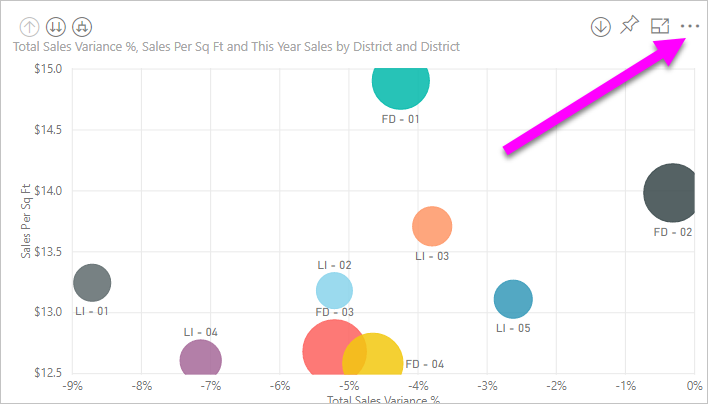
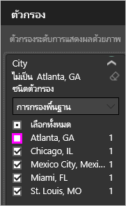
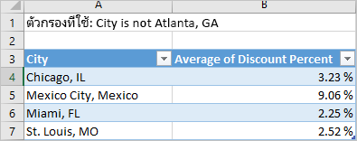

# ส่งออกข้อมูลจากการแสดงภาพ
ถ้าคุณต้องการดูข้อมูลที่ใช้ในการสร้างการแสดงภาพ คุณสามารถแสดงข้อมูลนั้นใน Power BI หรือส่งออกข้อมูลนั้นไปยัง Excel เป็นไฟล์ .xlsx หรือ .csv ได้   

ดู Will ส่งออกข้อมูลจากหนึ่งในการแสดงภาพในรายงานของเขา บันทึกเป็นไฟล์ .xlsx และเปิดใน Excel จากนั้นทำตามคำแนะนำทีละขั้นตอนตามวิดีโอด้านล่างนี้เพื่อลองทำด้วยตนเอง

<iframe width="560" height="315" src="https://www.youtube.com/embed/KjheMTGjDXw" frameborder="0" allowfullscreen></iframe>

## จากการแสดงภาพบนแดชบอร์ด Power BI
1. เลือกจุดไข่ปลาที่มุมขวาบนของการแสดงภาพ

    
2. เลือกที่ไอคอน **ส่งออกข้อมูล**

    
3. ส่งออกข้อมูลไปยังไฟล์ .csv ถ้ามีกรองภาพ ข้อมูลที่ดาวน์โหลดจะถูกกรองด้วย    
4. เบราว์เซอร์ของคุณจะปรากฏขึ้นให้คุณบันทึกไฟล์  เมื่อบันทึกแล้ว เปิดไฟล์ .csv ใน Excel

    

## จากการแสดงภาพในรายงาน
ในการทำตามขั้นตอนนี้ เปิด[รายงานตัวอย่างการวิเคราะห์การจัดซื้อ](../sample-procurement.md)ใน[มุมมองการแก้ไข](../consumer/end-user-reading-view.md) [เพิ่มหน้ารายงานเปล่าใหม่](../power-bi-report-add-page.md) จากนั้นทำตามขั้นตอนด้านล่างเพื่อเพิ่มการรวมและตัวกรองระดับการแสดงภาพ

1. สร้างแผนภูมิคอลัมน์ใหม่  จากช่องเขตข้อมูล เลือก**ตำแหน่งที่ตั้ง > เมือง**และ**ใบแจ้งหนี้ > เปอร์เซ็นต์ส่วนลด**  คุณอาจจำเป็นต้องย้าย**เปอร์เซ็นต์ส่วนลด**ลงในแอ่งค่าดังกล่าว 

    
2. เปลี่ยนการรวมสำหรับ**เปอร์เซ็นต์ส่วนลด**จาก**จำนวน**เป็น**ค่าเฉลี่ย** ในแอ่งค่า เลือกลูกศรทางด้านขวาของ**เปอร์เซ็นต์ส่วนลด** (ที่อาจระบุว่า**จำนวนเปอร์เซ็นต์ส่วนลด**) และเลือก**ค่าเฉลี่ย**ได้

    
3. เพิ่มตัวกรองเป็น**เมือง**เพื่อลบ**แอตแลนต้า**

   

   ในตอนนี้เราก็พร้อมที่จะลองใช้ทั้งสองตัวเลือกสำหรับการส่งออกข้อมูล 

4. เลือกจุดไข่ปลาที่มุมขวาบนของการแสดงภาพ เลือก **ส่งออกข้อมูล**

   
5. ใน Power BI online ถ้าการแสดงภาพของคุณมีค่ารวม (ตัวอย่างหนึ่งที่ควรเป็นถ้าคุณเปลี่ยน**จำนวนนับ**เป็น*ค่าเฉลี่ย* *ผลรวม*หรือ*ค่าต่ำสุด*) คุณจะได้สองตัวเลือก นั่นคือ **ข้อมูลสรุป**และ**ข้อมูลพื้นฐาน** ใน Power BI Desktop คุณจะมีตัวเลือก**ข้อมูลสรุป** เท่านั้น เพื่อทำความเข้าใจเรื่องการรวมค่า ดู [การรวมค่าใน Power BI](../service-aggregates.md)

    
6. เลือก**ข้อมูลสรุป** > **ส่งออก**และเลือกไฟล์ .xlsx หรือ .csv Power BI ส่งออกข้อมูล  ถ้าคุณได้ใช้ตัวกรองกับการแสดงภาพ ข้อมูลที่ส่งออกจะถูกส่งออกตามที่ถูกกรอง เมื่อคุณเลือก**ส่งออก** เบราว์เซอร์ของคุณจะปรากฏให้คุณบันทึกไฟล์ดังกล่าว เมื่อบันทึกแล้ว เปิดไฟล์ดังกล่าวใน Excel

   **ข้อมูลสรุป**: เลือกตัวเลือกนี้ถ้าคุณต้องการส่งออกข้อมูลสำหรับสิ่งที่คุณเห็นในภาพนั้น  การส่งออกชนิดนี้แสดงเฉพาะข้อมูล (คอลัมน์และหน่วยวัด) ที่คุณเลือกเพื่อสร้างภาพ  ถ้าภาพมีการรวม คุณจะส่งออกข้อมูลรวม ตัวอย่างเช่น ถ้าคุณมีแผนภูมิแท่งแสดง 4 แถบ คุณจะได้รับข้อมูล 4 แถว ข้อมูลสรุปจะพร้อมใช้งานเป็นไฟล์ .xlsx และ .csv

   ในตัวอย่างนี้ การส่งออก Excel ของเราแสดงผลรวมหนึ่งสำหรับแต่ละเมือง เนื่องจากเราได้กรองรัฐแอตแลนต้าออกไป รัฐดังกล่าวจะไม่รวมอยู่ในผลลัพธ์  แถวแรกของสเปรดชีตของคุณจะแสดงตัวกรองที่ใช้เมื่อดึงข้อมูลจาก Power BI

   
7. ตอนนี้ลองเลือก**ข้อมูลเบื้องต้น** > **ส่งออก**และเลือก .xlsx Power BI ส่งออกข้อมูล ถ้าคุณได้ใช้ตัวกรองกับการแสดงภาพดังกล่าว ข้อมูลจะถูกส่งออกตามที่ถูกกรอง เมื่อคุณเลือก**ส่งออก** เบราว์เซอร์ของคุณจะปรากฏให้คุณบันทึกไฟล์ดังกล่าว เมื่อบันทึกแล้ว เปิดไฟล์ดังกล่าวใน Excel

   >[!WARNING]
   >การส่งออกข้อมูลเบื้องต้นอนุญาตให้ผู้ใช้งานดูข้อมูลทั้งหมดโดยละเอียด โดยดูทุกคอลัมน์ในข้อมูล ผู้ดูแลระบบบริการ Power BI สามารถปิดใช้งานคุณลักษณะนี้สำหรับองค์กรของตนได้ ถ้าคุณเป็นเจ้าของชุดข้อมูล คุณสามารถตั้งค่าคอลัมน์ที่คุณเป็นเจ้าของเป็น "ซ่อน" เพื่อให้คอลัมน์เหล่านี้ไม่แสดงในรายการเขตข้อมูลใน Desktop หรือบริการ Power BI

   **ข้อมูลต้นแบบ**: เลือกตัวเลือกนี้ถ้าคุณต้องการดูข้อมูลในภาพ***และ***ข้อมูลเพิ่มเติมจากรูปแบบข้อมูล (ดูแผนภูมิด้านล่างสำหรับรายละเอียด)  ถ้าภาพของคุณมีการรวมค่า การเลือก*ข้อมูลต้นแบบ*จะลบการรวมค่า เมื่อคุณเลือก**ส่งออก** ข้อมูลจะถูกส่งออกไปยังไฟล์ .xlsx และเบราว์เซอร์ของคุณจะปรากฏข้อความให้คุณบันทึกไฟล์ เมื่อบันทึกแล้ว เปิดไฟล์ดังกล่าวใน Excel

   ในตัวอย่างนี้ การส่งออก Excel ของเราแสดงหนึ่งแถวสำหรับทุกหนึ่งแถวของเมืองในชุดข้อมูลของเรา และเปอร์เซ็นต์ส่วนลดสำหรับรายการเดียวนั้น กล่าวคือ ข้อมูลถูกลดรูปและจะไม่รวมเข้า แถวแรกของสเปรดชีตของคุณจะแสดงตัวกรองที่ใช้เมื่อดึงข้อมูลจาก Power BI  

   

## ส่งออกรายละเอียดข้อมูลต้นแบบ
สิ่งที่คุณเห็นเมื่อคุณเลือก**ข้อมูลต้นแบบ**อาจแตกต่างกันได้ การทำความเข้าใจรายละเอียดเหล่านี้อาจต้องการความช่วยเหลือจากผู้ดูแลระบบหรือแผนก IT ของคุณ ใน Power BI Desktop หรือบริการของ Power BI ในมุมมองรายงาน *หน่วยวัด*แสดงในรายการเขตข้อมูลที่มีไอคอนเครื่องคิดเลข หน่วยวัดจะถูกสร้างขึ้นใน Power BI Desktop ไม่ใช่ในบริการ Power BI

| การแสดงภาพประกอบด้วย |                                                                              สิ่งที่คุณจะเห็นในการส่งออก                                                                              |
|-----------------|-------------------------------------------------------------------------------------------------------------------------------------------------------------------------------------|
|   การรวมค่า    |                                                 ข้อมูลการรวม*ครั้งแรก*และที่เปิดเผยจากตารางทั้งหมดสำหรับการรวมค่านั้น                                                  |
|   การรวมค่า    | ข้อมูลที่เกี่ยวข้อง - ถ้าภาพใช้ข้อมูลจากตารางข้อมูลอื่นที่ *\* \*เกี่ยวข้อง* \*กับตารางข้อมูลที่ประกอบด้วยการรวมค่า (ตราบใดที่ความสัมพันธนั้นเป็น\*: 1 หรือ 1:1) |
|    หน่วยวัด     |                                      หน่วยวัดทั้งหมดในภาพ*และ*หน่วยวัดทั้งหมดจากตารางข้อมูลใดๆที่ประกอบด้วยหน่วยวัดที่ใช้ในภาพ                                      |
|    หน่วยวัด     |                                       ข้อมูลที่เปิดเผยทั้งหมดจากตารางที่ประกอบด้วยหน่วยวัด (ตราบใดที่ความสัมพันธ์นั้นเป็น\*: 1 หรือ 1:1)                                       |
|    หน่วยวัด     |                                      ข้อมูลทั้งหมดจากตารางทั้งหมดที่เกี่ยวข้องกับตารางที่ประกอบด้วยหน่วยวัดผ่านทางสาย \*: 1 จาก 1:1)                                      |
|  หน่วยวัดเท่านั้น  |                                                   คอลัมน์ที่เปิดเผยทั้งหมดจากตารางที่เกี่ยวข้องทั้งหมด (เมื่อต้องขยายหน่วยวัด)                                                   |
|  หน่วยวัดเท่านั้น  |                                                             ข้อมูลสรุปของแถวที่ซ้ำกันของหน่วยวัดรูปแบบข้อมูล                                                              |

## ข้อจำกัดและข้อควรพิจารณา
* จำนวนแถวสูงสุดที่สามารถส่งออกจาก**Power BI Desktop**และ**บริการ Power BI**ไปยัง .csv คือ 30,000
* จำนวนแถวสูงสุดที่จะส่งออกไปยัง .xlsx คือ 150,000
* การส่งออกโดยใช้*ข้อมูลเบื้องต้น*จะไม่สามารถทำได้ถ้าแหล่งข้อมูลเป็นการเชื่อมต่อสด Analysis Services และเป็นเวอร์ชันที่เก่ากว่า 2016 และตารางในแบบจำลองไม่มีคีย์ที่ไม่ซ้ำกัน  
* การส่งออกโดยใช้*ข้อมูลเบื้องต้น*จะไม่สามารถทำได้ถ้าตัวเลือก*แสดงรายการที่ไม่มีข้อมูล*เปิดใช้งานสำหรับการแสดงภาพที่ถูกกำลังส่งออก
* เมื่อใช้ DirectQuery จำนวนข้อมูลที่สามารถส่งออกได้สูงสุดคือ 16 MB ซึ่งนี่อาจส่งผลให้มีการส่งออกน้อยกว่าจำนวนแถวสูงสุด โดยเฉพาะอย่างยิ่งเมื่อมีคอลัมน์จำนวนมาก มีข้อมูลที่ยากต่อการบีบอัด และปัจจัยอื่น ๆ ที่เพิ่มขนาดไฟล์ และลดจำนวนแถวที่ถูกส่งออก
* ถ้าภาพใช้ข้อมูลจากตารางข้อมูลมากกว่าหนึ่งตาราง และไม่มีความสัมพันธ์ระหว่างตารางเหล่านั้นในรูปแบบข้อมูล เฉพาะข้อมูลสำหรับตารางแรกจะถูกส่งออก 
* วิชลแบบกำหนดเองและวิชวล R ยังไม่สนับสนุนในขณะนี้
* การส่งออกข้อมูลไม่พร้อมใช้งานสำหรับผู้ใช้ภายนอกองค์กรของคุณที่กำลังใช้แดชบอร์ดที่แชร์ 
* ใน Power BI เขตข้อมูล (คอลัมน์) สามารถถูกเปลี่ยนชื่อ โดยการดับเบิลคลิกที่เขตข้อมูล แล้วพิมพ์ชื่อใหม่  ชื่อใหม่นี้จะเรียกว่า*นามแฝง* อาจเป็นไปได้ว่า รายงาน Power BI สุดท้ายแล้วมีชื่อเขตข้อมูลที่ซ้ำกัน แต่ Excel ไม่อนุญาตให้มีชื่อที่ซ้ำกัน  ดังนั้น เมื่อข้อมูลถูกส่งออกไปยัง Excel นามแฝงของเขตข้อมูลถูกแปลงกลับไปเป็นชื่อเขตข้อมูล (คอลัมน์) เดิม  
* ถ้ามีอักขระ Unicode ในไฟล์ .csv ข้อความใน Excel อาจไม่แสดงอย่างเหมาะสม แม้ว่าการเปิดใน Notepad จะสามารถใช้งานได้ดีก็ตาม ตัวอย่างของอักขระ Unicode คือสัญลักษณ์สกุลเงินและคำในภาษาต่างประเทศ การแก้ไขปัญหาชั่วคราวสำหรับปัญหานี้คือการนำเข้า csv ลงใน Excel แทนที่จะเปิด csv โดยตรง ในการทำขั้นตอนนี้:

  1. เปิด Excel
  2. จากแท็บ**ข้อมูล** เลือก**รับข้อมูลภายนอก** > **จากข้อความ**
* ผู้ดูแลระบบ Power BI สามารถปิดใช้งานการส่งออกข้อมูลได้

## ขั้นตอนถัดไป
[แดชบอร์ดใน Power BI](../consumer/end-user-dashboards.md)  
[Power BI แนวคิดพื้นฐาน](../consumer/end-user-basic-concepts.md)

มีคำถามเพิ่มเติมหรือไม่? [ลองถามชุมชน Power BI](http://community.powerbi.com/)

