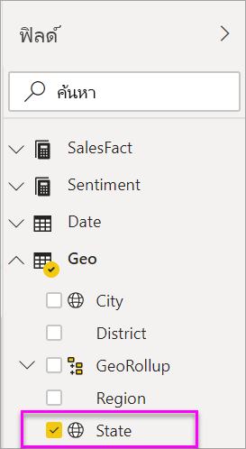

# แผนที่แถบสี (Choropleths) ใน Power BI
แผนที่แถบสีใช้เฉดสีหรือ หรือการปรับสีอ่อนแก่ หรือรูปแบบต่าง ๆ เพื่อแสดงว่าค่าแตกต่างกันมากเพียงใดในสัดส่วนทั่วทั้งภูมิศาสตร์หรือภูมิภาค  เพื่อแสดงความแตกต่างเหล่านี้ที่สัมพันธ์กับเฉดสีที่อยู่ในช่วงจากสีอ่อน (ความถี่น้อยกว่า/ต่ำกว่า) ไปถึงเข้ม (ความถี่มากกว่า/สูงกว่า) ได้อย่างรวดเร็ว    

## สิ่งที่จะถูกส่งไปยัง Bing
Power BI รวมเข้ากับ Bing เพื่อให้มีพิกัดแมปเริ่มต้น (กระบวนการที่เรียกว่า การกำหนดรหัสทางภูมิศาสตร์) เมื่อคุณสร้างการแสดงภาพของแผนที่ในบริการ Power BI หรือ Power BI Desktop ข้อมูลในบักเก็ต**ตำแหน่งที่ตั้ง** **ละติจูด** และ**ลองติจู** (ที่กำลังถูกใช้เพื่อสร้างการแสดงภาพนั้น) จะถูกส่งไปยัง Bing

คุณหรือผู้ดูแลระบบของคุณอาจจำเป็นต้องอัปเดตไฟร์วอลล์ของคุณเพื่ออนุญาตให้เข้าถึง URL ที่ Bing ใช้สำหรับการกำหนดพิกัดทางภูมิศาสตร์  URL เหล่านั้นคือ:
- https://dev.virtualearth.net/REST/V1/Locations    
- https://platform.bing.com/geo/spatial/v1/public/Geodata    
- https://www.bing.com/api/maps/mapcontrol

สำหรับข้อมูลเพิ่มเติมเกี่ยวกับข้อมูลที่ถูกส่งไปยัง Bing และสำหรับเคล็ดลับในการเพิ่มความสำเร็จการกำหนดรหัสทางภูมิศาสตร์ของคุณ ดู[คำแนะนำและเคล็ดลับสำหรับการแสดงภาพแผนที่](power-bi-map-tips-and-tricks.md)

## เมื่อใดควรใช้แผนที่แถบสี
แผนที่แถบสีเป็นทางเลือกที่เหมาะสมอย่างยิ่งในกรณีต่อไปนี้:

* เมื่อต้องแสดงข้อมูลเชิงปริมาณบนแผนที่
* เมื่อต้องแสดงรูปแบบเชิงพื้นที่และความสัมพันธ์
* เมื่อข้อมูลของคุณคือข้อมูลมาตรฐาน
* เมื่อทำงานกับข้อมูลด้านสังคมและเศรษฐกิจ
* เมื่อภูมิภาคที่กำหนดไว้มีความสำคัญ
* เมื่อต้องดูภาพรวมของการกระจายทั่วทั้งตำแหน่งที่ตั้งทางภูมิศาสตร์

### ข้อกำหนดเบื้องต้น
- บริการ Power BI หรือ Power BI Desktop
- ตัวอย่างการขายและการตลาด

เมื่อต้องการทำตาม บทช่วยสอนใช้บริการของ Power BI ไม่ใช่ Power BI Desktop ไม่

## สร้างแผนที่แถบสีพื้นฐาน
ในวิดีโอนี้ Kim สร้างแผนที่พื้นฐานและแปลงเป็นแผนที่แถบสี

<iframe width="560" height="315" src="https://www.youtube.com/embed/ajTPGNpthcg" frameborder="0" allowfullscreen></iframe>

### รับข้อมูลและเพิ่มหน้าเปล่าใหม่ลงในรายงาน
1. ในการสร้างแผนที่แถบสีของคุณเอง [ดาวน์โหลดตัวอย่างยอดขายและการตลาด](../sample-datasets.md)โดยลงชื่อเข้าใช้ Power BI และเลือก **รับข้อมูล\>ตัวอย่าง\>การขายและการตลาด\>เชื่อมต่อ** หรือรับแอป**การขายและการตลาด Power BI**บน appsource.com 

2. เปิดรายงานการขายและการตลาด

   
3. Power BI เปิดรายงาน เลือก**แก้ไขรายงาน** เพื่อเปิดรายงานใน [มุมมองการแก้ไข](../service-interact-with-a-report-in-editing-view.md)

4. เพิ่มหน้าใหม่โดยการเลือกไอคอนเครื่องหมายถูกสีเหลืองที่ด้านล่างของพื้นที่รายงาน

    

### สร้างแผนที่แถบสี
1. จากช่องเขตข้อมูล เลือกเขตข้อมูลง**ทางภูมิศาสตร์** \> **รัฐ**    

   
2. [แปลงแผนภูมิ](power-bi-report-change-visualization-type.md)ให้เป็นแผนภูมิแถบสี โปรดสังเกตว่าตอนนี้**รัฐ**อยู่ในแอ่ง**ตำแหน่งที่ตั้ง** Bing Maps ใช้เขตข้อมูลในแอ่ง**ตำแหน่งที่ตั้ง**เพื่อสร้างแผนที่  ตำแหน่งที่ตั้งสามารถเป็นตำแหน่งที่ตั้งที่มีอยู่จริงต่าง ๆ: ประเทศ รัฐ เขต เมือง รหัสไปรษณีย์ หรืออื่น ๆ Bing Maps มีรูปร่างแผนผังแถบสีสำหรับตำแหน่งที่ตั้งต่าง ๆ ทั่วโลก หากรายการที่ใส่ในแอ่งตำแหน่งที่ตั้งไม่ถูกต้อง Power BI จะไม่สามารถสร้างแผนผังแถบสีได้  

   
3. กรองแผนที่เพื่อแสดงเฉพาะแผ่นดินใหญ่สหรัฐอเมริกา

   a.  ที่ด้านล่างของช่องการแสดงภาพ ค้นหาพื้นที่**ตัวกรอง**

   b.  เลื่อนไปเหนือ**รัฐ**และคลิกเครื่องหมายรูปตัววี (V) ที่ขยาย  
   

   c.  ทำเครื่องหมายถูกถัดจาก **ทั้งหมด** และนำเครื่องหมายถูกออกถัดจาก **AK**

   
4. เลือกไอคอนแปรงลูกกลิ้งเพื่อเปิดบานหน้าต่างจัดรูปแบบ และเลือก **สีข้อมูล**

    

5. เลือกจุดแนวตั้งสามจุด แล้วเลือก **การจัดรูปแบบตามเงื่อนไข**

    

6. ใช้หน้าจอ **สีตามค่าเริ่มต้น - สีข้อมูล** เพื่อกำหนดวิธีการแรเงาแผนที่แถบสีของคุณ ตัวเลือกที่พร้อมใช้งานสำหรับคุณรวมถึงเขตข้อมูลที่ยึดตามฐานการแรเงา และวิธีการปรับใช้การแรเงา ในตัวอย่างนี้ เราจะใช้เขตข้อมูล**SalesFact** > **ความคิดเห็น** และการตั้งค่าต่ำสุดสำหรับความคิดเห็นเป็นสีแดงและค่าสูงสุดเป็นสีเขียว ค่าที่อยู่ระหว่างค่าสูงสุด และค่าต่ำสุดจะมีแรเงาเป็นสีแดง และสีเขียว ภาพประกอบที่ด้านล่างของหน้าจอจะแสดงช่วงของสีที่จะนำไปใช้ 

    

7. แผนที่แถบสีจะเป็นสีเขียวและแดง โดยที่สีแดงเป็นตัวแทนตัวเลขความคิดเห็นที่ต่ำกว่า และสีเขียวแสดงตัวเลขความคิดเห็นที่สูงกว่า ซึ่งหมายความว่ามีความเห็นในเชิงบวกมากกว่า  เมื่อต้องแสดงรายละเอียดเพิ่มเติม ให้ลากเขตข้อมูลลงในแถบสีเหลืองเขียนคำอธิบายเวลาเอาเมาส์ไปชี้  ที่นี่ฉันได้เพิ่ม**ช่องว่างความคิดเห็น** และเน้นไปที่รัฐไอดาโฮ (ID) และเห็นว่าช่องว่างความคิดเห็นต่ำ อยู่ที่ 6
   

10. [บันทึกรายงาน](../service-report-save.md)

Power BI อนุญาตให้คุณควบคุมลักษณะที่ปรากฏของแผนที่แถบสีของคุณมากมาย ดำเนินการกับตัวควบคุมสีข้อมูลเหล่านี้จนกว่าคุณได้ลักษณะตามที่คุณต้องการ 

## การทำไฮไลท์และการกรองข้าม
สำหรับข้อมูลเกี่ยวกับการใช้บานหน้าต่างตัวกรอง โปรดดู[เพิ่มตัวกรองไปยังรายงาน](../power-bi-report-add-filter.md)

การไฮไลต์ตำแหน่งที่ตั้งหนึ่งในแผนที่แถบสี จะกรองข้ามการแสดงภาพอื่น ๆ บนหน้ารายงานนั้น... และนอกจากนี้จะทำในทางกลับกันด้วย

1. เมื่อต้องการทำตามขั้นตอน ก่อนบันทึกรายงานนี้ โดยการเลือก**ไฟล์ > บันทึก** 

2. คัดลอกแผนที่แถบสีโดยใช้ CTRL C

3. จากด้านล่างของพื้นที่รายงาน เลือกแท็บ**ความคิดเห็น** เพื่อเปิดหน้ารายงานความคิดเห็น

    

4. ย้ายและปรับขนาดการแสดงภาพบนหน้าเพื่อสร้างพื้นที่ว่าง แล้วกด CTRL V เพื่อวางแผนที่แถบสีจากรายงานก่อนหน้า

   

5. บนแผนที่แถบสี เลือกหนึ่งรัฐ  ขั้นตอนนี้จะไฮไลต์การแสดงภาพอื่น ๆ บนหน้า เลือก**Texas** ตัวอย่าง แสดงให้ฉันเห็นว่า ความคิดเห็นเป็น 74 Texas อยู่ในเขตกลาง\#23   
   
2. เลือกจุดข้อมูลบน VanArsdel ความคิดเห็นตามเดือนแผนภูมิเส้น การทำเช่นนี้จะกรองแผนที่แถบสีเพื่อให้แสดงความคิดเห็นสำหรับ VanArsdel และไม่ใช่สำหรับการแข่งขันของ VanArsdel  
   

## ข้อควรพิจารณาและการแก้ไขปัญหา
ข้อมูลในแผนที่อาจไม่ชัดเจน  ตัวอย่างเช่น มีปารีส ประเทศฝรั่งเศส และยังมีปารีส ในรัฐเท็กซัสด้วย ข้อมูลทางภูมิศาสตร์ของคุณถูกเก็บไว้ในคอลัมน์แยกต่างหาก ไม่ว่าจะเป็น คอลัมน์สำหรับชื่อเมือง คอลัมน์สำหรับชื่อรัฐหรือจังหวัด และอื่น ๆ ดังนั้น Bing อาจไม่สามารถบอกได้ว่าเป็นปารีสที่ไหน ถ้าชุดข้อมูลของคุณประกอบด้วยข้อมูลละติจูดและลองจิจูดอยู่แล้ว Power BI มีเขตข้อมูลพิเศษเพื่อช่วยทำให้ข้อมูลแผนที่ชัดเจนยิ่งขึ้น เพียงแค่ลากเขตข้อมูลที่ประกอบด้วยข้อมูลละติจูดของคุณลงในพื้นที่\>การแสดงภาพ > ละติจูด  และทำเช่นเดียวกันสำหรับข้อมูลลองจิจูดของคุณ    

ถ้าคุณมีสิทธิ์แก้ไขชุดข้อมูลใน Power BI Desktop ดูวิดีโอนี้สำหรับความช่วยเหลือในการแก้ไขแผนที่ที่ไม่ชัดเจน

<iframe width="560" height="315" src="https://www.youtube.com/embed/Co2z9b-s_yM" frameborder="0" allowfullscreen></iframe>

ถ้าคุณไม่สามารถเข้าถึงข้อมูลละติจูดและลองจิจูดได้ แต่คุณสามารถเข้าถึงการแก้ไขในชุดข้อมูล [ทำตามคำแนะนำเหล่านี้เพื่ออัปเดตชุดข้อมูลของคุณ](https://support.office.com/article/Maps-in-Power-View-8A9B2AF3-A055-4131-A327-85CC835271F7)

สำหรับความช่วยเหลือเพิ่มเติมเกี่ยวกับการแสดงภาพของแผนที่ ดู[เคล็ดลับและคำแนะนำสำหรับการแสดงภาพของแผนที่](../power-bi-map-tips-and-tricks.md)

## ขั้นตอนถัดไป

[แผนที่รูปร่าง](desktop-shape-map.md)

[ชนิดการแสดงภาพใน Power BI](power-bi-visualization-types-for-reports-and-q-and-a.md)