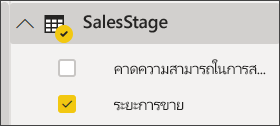
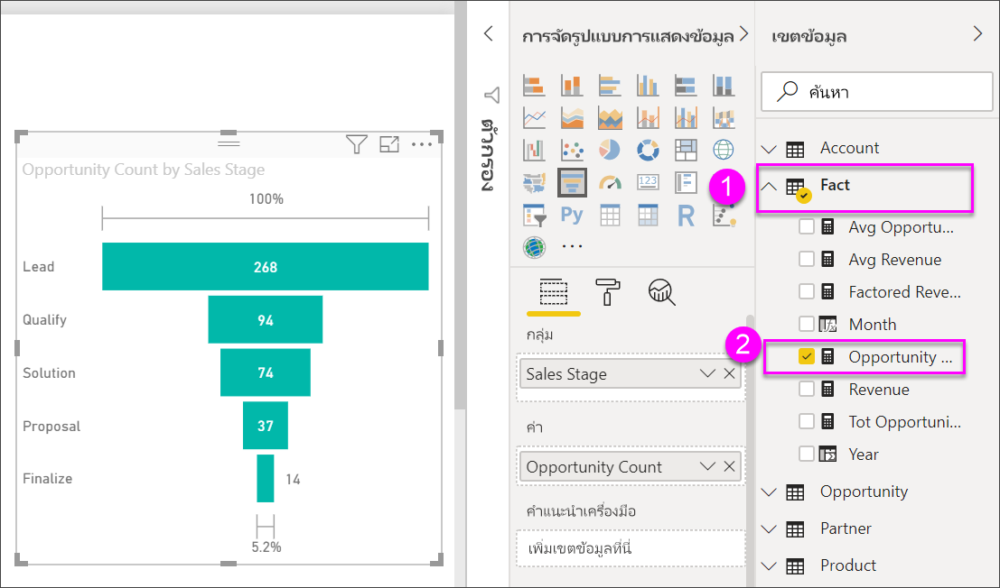

# สร้างและใช้แผนภูมิกรวย

[!INCLUDE[consumer-appliesto-nyyn](../includes/consumer-appliesto-nyyn.md)]

[!INCLUDE [power-bi-visuals-desktop-banner](../includes/power-bi-visuals-desktop-banner.md)]

แผนภูมิกรวยช่วยให้คุณแสดงกระบวนการเส้นตรง ที่แบ่งเป็นขั้นตอนที่เชื่อมต่อกันตามลำดับ ยกตัวอย่างเช่น ช่วงระยะการขายที่มีการติดตามลูกค้าตามขั้นตอนดังนี้: ลูกค้าที่เป็นเป้าหมาย\>ลูกค้าเป้าหมายที่มีคุณสมบัติ\>ผู้ที่มีแนวโน้มจะเป็นลูกค้า\>ทำสัญญา\>ปิดลูกค้า  มองอย่างรวดเร็ว รูปร่างของกรวยบ่งบอกสุขภาพของกระบวนการที่คุณกำลังติดตาม

แต่ละขั้นตอนกรวยการแสดงเปอร์เซ็นต์ของผลรวม ดังนั้น ในกรณีส่วนใหญ่ แผนภูมิกรวยจะมีรูปเหมือนกรวย - ด้วยขั้นตอนแรกที่ใหญ่ที่สุด และขั้นตอนถัด ๆ มาเล็กกว่าขั้นตอนก่อนหน้า  แผนภูมิเป็นรูปต้นแพร์จะยังมีประโยชน์ -- สามารถใช้ระบุปัญหาในกระบวนการได้  แต่โดยทั่วไปแล้ว ขั้นแรกหรือขั้น "ทางเข้า" มีขนาดใหญ่ที่สุด

> [!NOTE]
> การแชร์รายงานของคุณกับผู้ร่วมงาน Power BI กำหนดให้คุณต้องมีสิทธิ์การใช้งาน Power BI Pro แต่ละรายการ หรือรายงานจะถูกบันทึกในความจุแบบพรีเมียม    

## เมื่อใดที่ใช้แผนภูมิกรวย
แผนภูมิกรวยเป็นตัวเลือกที่ดีสำหรับ:

* เมื่อข้อมูลมีลำดับ และผ่านไปตามลำดับขั้นอย่างน้อย 4 ขั้นตอน
* เมื่อจำนวนของ "รายการ" ในขั้นตอนแรกคาดว่า จะมีค่ามากกว่าจำนวนในขั้นตอนสุดท้าย
* เพื่อคำนวณโอกาสที่จะเกิดขึ้น (รายได้/ยอดขาย/ข้อตกลง/ฯลฯ) ตามลำดับขั้น
* เพื่อคำนวณและติดตาม อัตราการแปลงและการรักษาสถานภาพ
* เพื่อเปิดเผยปัญหาคอขวดในกระบวนการที่เป็นเส้นตรง
* เพื่อติดตามเวิร์กโฟลว์ของตะกร้าสินค้า
* เพื่อติดตามความคืบหน้าและความสำเร็จของแคมเปญ การคลิกโฆษณา/การตลาด

## การทำงานกับแผนภูมิกรวย
แผนภูมิกรวย:

* สามารถเรียงลำดับ
* สนับสนุนตัวเลขที่เป็นจำนวนเท่า
* สามารถไฮไลต์เชื่อมโยง และกรองข้าม จากการแสดงภาพอื่น ๆ บนหน้ารายงานเดียวกัน
* สามารถไฮไลต์เชื่อมโยง และกรองข้าม ไปยังการแสดงภาพอื่น ๆ บนหน้ารายงานเดียวกัน
   > [!NOTE]
   > รับชมวิดีโอนี้เพื่อดู Will จัดทำแผนภูมิกรวยโดยใช้ตัวอย่างด้านการขายและการตลาด จากนั้นทำตามขั้นตอนด้านล่างวิดีโอเพื่อทดลองด้วยตัวเองโดยใช้ไฟล์ตัวอย่าง Opportunity Analysis PBIX
   > 
   > 
## เงื่อนไขเบื้องต้น

บทช่วยสอนนี้ใช้ไฟล์ PBIX [Opportunity Analysis .PBIX ตัวอย่าง](https://download.microsoft.com/download/9/1/5/915ABCFA-7125-4D85-A7BD-05645BD95BD8/Opportunity%20Analysis%20Sample%20PBIX.pbix
)

1. จากด้านบนซ็ายของแถบเมนู เลือก **ไฟล์** > **เปิด**
   
2. ค้นหาสำเนา**ไฟล์ PBIX ตัวอย่างการวิเคราะห์โอกาส**

1. เปิด**ไฟล์ PBIX ตัวอย่างการวิเคราะห์โอกาส**ในมุมมองรายงาน 

1. เลือก  หากต้องการเพิ่มหน้าใหม่

## สร้างแผนภูมิกรวยพื้นฐาน
รับชมวิดีโอนี้เพื่อดู Will จัดทำแผนภูมิกรวยโดยใช้ตัวอย่างด้านการขายและการตลาด

<iframe width="560" height="315" src="https://www.youtube.com/embed/qKRZPBnaUXM" frameborder="0" allow="autoplay; encrypted-media" allowfullscreen></iframe>

ตอนนี้ ลองสร้างแผนภูมิของคุณเอง ที่แสดงจำนวนโอกาสที่เรามีในแต่ละของขั้นตอนการขายของเรา

1. เริ่มต้นที่หน้ารายงานที่ว่างเปล่า แล้วเลือกเขตข้อมูล **SalesStage** \> **ขั้นตอนการขาย**
   
    

1. เลือกไอคอนกรวย  การแปลงแผนภูมิคอลัมน์ให้เป็นแผนภูมิกรวย

2. จากบานหน้าต่าง **เขตข้อมูล** เลือก **ข้อเท็จจริง** \> **จำนวนโอกาส**
   
    
4. โฮเวอร์เหนือแท่ง จะแสดงข้อมูลจำนวนมากออกมา
   
   * ชื่อของขั้นตอน
   * จำนวนโอกาสทางการขายในขั้นตอนนี้
   * อัตราการแปลงโดยรวม (% ของลูกค้าเป้าหมาย) 
   * ขั้นตอน-ถึง-ขั้นตอน (หรืออัตราการดรอป) ซึ่งก็เป็น % ของขั้นตอนก่อนหน้า (ในกรณีนี้ ขั้นตอนข้อเสนอ/ขั้นตอนโซลูชัน)
     
     

6. [บันทึกรายงาน](../create-reports/service-report-save.md)

## การทำไฮไลท์และการกรองข้าม
สำหรับข้อมูลเกี่ยวกับการใช้บานหน้าต่างตัวกรอง ดู[เพิ่มตัวกรองไปยังรายงาน](../create-reports/power-bi-report-add-filter.md)

ไฮไลต์แท่งในแผนภูมิกรวย จะกรองข้ามการแสดงภาพอื่น ๆ บนหน้ารายงาน... และในทางกลับกัน เพื่อทำตาม เพิ่มวิชวลอีกสองสามวิชวล บนหน้ารายงานที่มีแผนภูมิกรวย

1. บนกรวย เลือกแท่ง**ข้อเสนอ** ซึ่งจะไฮไลต์เชื่อมโยงไปยังการแสดงภาพอื่น ๆ บนหน้า ใช้ CTRL เพื่อเลือกหลายค่า
   
   
2. เพื่อกำหนดลักษณะ การไฮไลต์เชื่อมโยง และการกรองข้าม ระหว่างวิชวล ดู[การโต้ตอบระหว่างวิชวลใน Power BI](../create-reports/service-reports-visual-interactions.md)

## ขั้นตอนถัดไป

[ตัววัดใน Power BI](power-bi-visualization-radial-gauge-charts.md)

[ชนิดการแสดงภาพใน Power BI](power-bi-visualization-types-for-reports-and-q-and-a.md)

