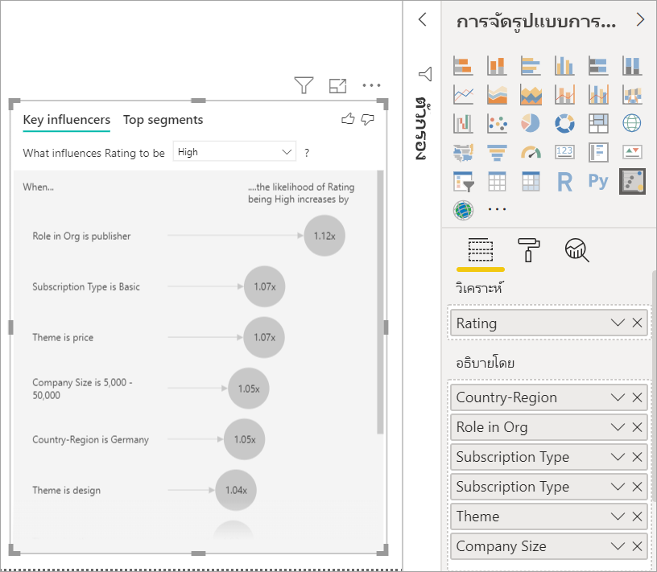

# การแสดงภาพข้อมูลผู้มีอิทธิพลหลัก

[!INCLUDE [power-bi-visuals-desktop-banner](../includes/power-bi-visuals-desktop-banner.md)]

ภาพวิชวลของผู้มีอิทธิพลหลักช่วยให้คุณเข้าใจปัจจัยที่มีผลต่อเมตริกที่คุณสนใจ ซึ่งช่วยวิเคราะห์ข้อมูลของคุณ จัดอันดับปัจจัยที่มีความสำคัญ และแสดงพวกเขาในฐานะที่เป็นผู้มีอิทธิพลหลัก ตัวอย่างเช่น สมมติว่าคุณต้องการค้นหาว่าสิ่งที่มีผลต่อการลาออกของพนักงาน ซึ่งเรียกอีกอย่างว่าการลาออก ปัจจัยหนึ่งอาจมาจากระยะเวลาของสัญญาจ้างงาน และอีกปัจจัยหนึ่งอาจเป็นอายุของพนักงาน 
 
## เมื่อใดที่ควรใช้ผู้มีอิทธิพลหลัก 
ภาพวิชวลของผู้มีอิทธิพลหลักเป็นตัวเลือกที่ยอดเยี่ยมหากคุณต้องการที่จะ: 
- ดูว่าปัจจัยใดที่ส่งผลกระทบต่อเมตริกที่กำลังวิเคราะห์
- เปรียบเทียบความสำคัญที่เกี่ยวข้องของปัจจัยเหล่านี้ ตัวอย่างเช่น สัญญาระยะสั้นมีผลต่อการลาออกของพนักงานมากกว่าสัญญาระยะยาวหรือไม่? 

## คุณลักษณะของภาพวิชวลผู้มีอิทธิพลหลัก

1. **แท็บ**: เลือกแท็บเพื่อสลับระหว่างมุมมอง **ผู้มีอิทธิพลหลัก** จะแสดงตัวช่วยที่มีส่วนร่วมสูงสุดต่อค่าเมตริกที่เลือก **กลุ่มยอดนิยม** จะแสดงกลุ่มที่มีส่วนร่วมสูงสุดต่อค่าเมตริกที่เลือก *กลุ่ม* สร้างขึ้นจากชุดของค่า ตัวอย่างเช่น กลุ่มหนึ่งอาจเป็นผู้บริโภคที่เคยเป็นลูกค้ามาแล้วอย่างน้อย 20 ปีและอาศัยอยู่ในภาคตะวันตก 

2. **กล่องดรอปดาวน์**: ค่าของเมตริกภายใต้การตรวจสอบ ในตัวอย่างนี้ ค้นหาเมตริก**การให้คะแนน**เมตริก ค่าที่เลือกคือ **ต่ำ**

3. **การกล่าวซ้ำ**: ช่วยเราตีความภาพวิชวลในบานหน้าต่างด้านซ้าย

4. **บานหน้าต่างด้านซ้าย**: บานหน้าต่างด้านซ้ายประกอบด้วยภาพวิชวลหนึ่งภาพ ในกรณีนี้ บานหน้าต่างด้านซ้ายจะแสดงรายชื่อของผู้ทรงอิทธิพลมากที่สุด

5. **การกล่าวซ้ำ**: ช่วยเราตีความภาพวิชวลในบานหน้าต่างด้านขวา

6. **บานหน้าต่างด้านขวา**: บานหน้าต่างด้านขวาประกอบด้วยภาพวิชวลหนึ่งภาพ ในกรณีนี้ แผนภูมิคอลัมน์แสดงค่าทั้งหมดสำหรับผู้มีอิทธิพลหลัก, **ธีม** ที่เลือกไว้ในบานหน้าต่างด้านซ้าย ค่าเฉพาะของ**ความสามารถในการใช้งาน**จากบานหน้าต่างด้านซ้ายจะแสดงเป็นสีเขียว ค่าอื่น ๆ ทั้งหมดสำหรับ**ธีม**จะแสดงเป็นสีดำ

7. **เส้นเฉลี่ย**: เราใช้ค่าเฉลี่ยในการคำนวณค่าอื่น ๆ ที่เป็นไปได้ทั้งหมดสำหรับ **ธีม** ยกเว้น **ความสามารถในการใช้งาน** (ซึ่งเป็นผู้ทรงอิทธิพลที่เลือก) ดังนั้นการคำนวณจึงใช้กับค่าทั้งหมดเป็นสีดำ ซึ่งบอกคุณว่าเปอร์เซ็นต์ของ **ธีม** อื่นมีคะแนนต่ำแค่ไหน ในกรณีนี้ 11.35% มีการให้คะแนนต่ำ (ซึ่งแสดงตามเส้นประ)

8. **กล่องกาเครื่องหมาย**: กรองภาพวิชวลออกในบานหน้าต่างด้านขวาเพื่อแสดงเฉพาะค่าที่เป็นผู้มีอิทธิพลสำหรับเขตข้อมูลนั้น ในตัวอย่างนี้จะกรองภาพวิชวลสำหรับความสามารถในการใช้งาน ความปลอดภัย และการนำทาง

## วิเคราะห์เมตริกที่เป็นแบบจัดกลุ่ม
 
ดูวิดีโอนี้เพื่อเรียนรู้วิธีการสร้างภาพวิชวลของผู้มีอิทธิพลหลักด้วยเมตริกแบบจัดกลุ่ม แล้วทำตามขั้นตอนเหล่านี้เพื่อสร้างภาพวิชวล 

   > [!NOTE]
   > วิดีโอนี้ใช้ Power BI Desktop เวอร์ชันก่อนหน้านี้
   > 
   > 
<iframe width="560" height="315" src="https://www.youtube.com/embed/fDb5zZ3xmxU" frameborder="0" allow="accelerometer; autoplay; encrypted-media; gyroscope; picture-in-picture" allowfullscreen></iframe>

ผู้จัดการผลิตภัณฑ์ของคุณต้องการให้คุณค้นหาว่าปัจจัยใดที่ทำให้ลูกค้าต้องแสดงความคิดเห็นเชิงลบเกี่ยวกับบริการคลาวด์ของคุณ หากต้องการทำตาม ให้เปิด [ไฟล์ PBIX คำติชมของลูกค้า](https://github.com/Microsoft/powerbi-desktop-samples/blob/master/2019/customerfeedback.pbix) ใน Power BI Desktop คุณยังสามารถดาวน์โหลด [ไฟล์ Excel คำติชมของลูกค้าสำหรับบริการ Power BI หรือ Power BI Desktop](https://github.com/Microsoft/powerbi-desktop-samples/blob/master/2019/customerfeedback.xlsx) 

> [!NOTE]
> ชุดข้อมูลคำติชมของลูกค้าขึ้นอยู่กับ [Moro et al., 2014] S. Moro, P. Cortez และ P. Rita “แนวทางการขับเคลื่อนด้วยข้อมูลเพื่อทำนายความสำเร็จของการตลาดทางโทรศัพท์ของธนาคาร” *ระบบสนับสนุนการตัดสินใจ*, Elsevier, 62:22-31, มิถุนายน 2014 

1. เปิดรายงานและเลือกไอคอน**ผู้มีอิทธิพลหลัก** 

    

2. ย้ายเมตริกที่คุณต้องการตรวจสอบไปที่เขตข้อมูล **การวิเคราะห์** เมื่อต้องการดูสิ่งที่มีผลต่อการให้คะแนนการบริการของลูกค้าต่ำ เลือก **ตารางลูกค้า** > **การให้คะแนน**

3. ย้ายเขตข้อมูลที่คุณคิดว่ามีผลต่อ **การให้คะแนน** เข้าไปที่เขตข้อมูล **อธิบายโดย** คุณสามารถย้ายเขตข้อมูลได้มากเท่าที่คุณต้องการ ในกรณีนี้ เริ่มต้นด้วย:
    - ประเทศ-ภูมิภาค 
    - บทบาทในองค์กร 
    - ชนิดการสมัครใช้งาน 
    - ขนาดบริษัท 
    - ธีม
    
4. ปล่อยเขตข้อมูล**ขยายโดย**ว่างไว้ เขตข้อมูลนี้จะใช้เฉพาะเมื่อทำการวิเคราะห์เขตข้อมูลการวัดหรือเขตข้อมูลสรุป 

5. เมื่อต้องการเน้นการให้คแนนติดลบ เลือก**ต่ำ**ในกล่องดรอปดาวน์ **สิ่งที่มีผลต่อการให้คะแนนที่จะเป็น**  

    

การวิเคราะห์จะทำงานในระดับตารางของเขตข้อมูลที่กำลังวิเคราะห์ ในกรณีนี้ เป็นเมตริก**การให้คะแนน** เมตริกนี้ถูกกำหนดขึ้นในระดับลูกค้า ลูกค้าแต่ละรายได้รับคะแนนสูงสุดหรือคะแนนต่ำ ปัจจัยการอธิบายทั้งหมดจะต้องกำหนดไว้ในระดับลูกค้าสำหรับภาพวิชวลเพื่อใช้ประโยชน์จากปัจจัยเหล่านั้น 

ในตัวอย่างก่อนหน้านี้ ปัจจัยการอธิบายทั้งหมดมีความสัมพันธ์แบบหนึ่งต่อหนึ่งหรือกลุ่มต่อหนึ่งกับเมตริก ในกรณีนี้ ลูกค้าแต่ละรายกำหนดธีมเดี่ยวให้กับการให้คะแนนของพวกเขา ในทำนองเดียวกัน ลูกค้ามาจากประเทศหนึ่ง มีประเภทสมาชิกประเภทหนึ่ง และดำเนินบทบาทหนึ่งในองค์กรของพวกเขา ปัจจัยการอธิบายนั้นเป็นแอตทริบิวต์ของลูกค้าอยู่แล้ว และไม่จำเป็นต้องมีการแปลง ภาพวิชวลทำให้ปัจจัยเหล่านี้สามารถใช้ได้ทันที 

ต่อมาในบทช่วยสอน คุณจะได้ดูตัวอย่างที่ซับซ้อนมากขึ้นซึ่งมีความสัมพันธ์แบบหนึ่งต่อกลุ่ม ในกรณีดังกล่าว คอลัมน์จะต้องถูกรวมเข้ากับระดับลูกค้าก่อนจึงจะสามารถทำการวิเคราะห์ได้ 

การวัดและผลรวมที่ใช้เป็นปัจจัยการอธิบายจะถูกประเมินที่ระดับตารางของเมตริก **การวิเคราะห์** ตัวอย่างบางอย่างจะแสดงในภายหลังในบทความนี้ 

## ตีความผู้มีอิทธิพลหลักตามประเภท 
ลองมาดูที่ผู้มีอิทธิพลหลักสำหรับการให้คะแนนต่ำ 

### ปัจจัยเดียวอันดับแรกที่มีผลต่อความน่าจะเป็นของการให้คะแนนต่ำ

ลูกค้าในตัวอย่างนี้สามารถมีสามบทบาทได้แก่ ลูกค้า ผู้ดูแลระบบ และผู้เผยแพร่ การเป็นลูกค้าเป็นปัจจัยอันดับต้น ๆ ที่ส่งผลให้เกิดการให้คะแนนต่ำ 

แม่นยำยิ่งขึ้น ลูกค้าของคุณมีแนวโน้มที่จะให้คะแนนการบริการติดลบ 2.57 เท่า แผนภูมิผู้มีอิทธิพลหลักแสดง **บทบาทในองค์กรเป็นลูกค้า** ก่อนในรายการด้านซ้าย จากการเลือก**บทบาทในองค์กรเป็นลูกค้า** Power BI จะแสดงรายละเอียดเพิ่มเติมในบานหน้าต่างด้านขวา แสดงผลการเปรียบเทียบของแต่ละบทบาทเกี่ยวกับความน่าจะเป็นของการให้คะแนนต่ำ
  
- ลูกค้า 14.93% ให้คะแนนต่ำ 
- โดยเฉลี่ยบทบาทอื่น ๆ ทั้งหมดให้คะแนนของเวลาต่ำเท่ากับ 5.78%
- ลูกค้าจำนวน 2.57 เท่าที่มีแนวโน้มจะให้คะแนนต่ำเมื่อเทียบกับบทบาทอื่น ๆ ทั้งหมด คุณสามารถตรวจสอบสิ่งนี้ได้โดยการแบ่งแถบสีเขียวด้วยเส้นประสีแดง 

### ปัจจัยเดียวอันดับที่สองที่มีผลต่อความน่าจะเป็นของการให้คะแนนต่ำ

ภาพวิชวลของผู้มีอิทธิพลหลักจะเปรียบเทียบและจัดลำดับปัจจัยจากตัวแปรที่แตกต่างมากมายได้ ผู้มีอิทธิพลลำดับที่สองไม่มีส่วนเกี่ยวข้องกับ **บทบาทในองค์กร** เลือกผู้มีอิทธิพลลำดับที่สองในรายการ ซึ่งก็คือ **ธีมเป็นความสามารถในการใช้งาน** 

ปัจจัยที่สำคัญที่สุดลำดับที่สองเกี่ยวข้องกับธีมการรีวิวของลูกค้า ลูกค้าที่แสดงความคิดเห็นเกี่ยวกับความสามารถในการใช้งานของผลิตภัณฑ์มีแนวโน้มที่จะให้คะแนนต่ำ 2.55 เท่าเมื่อเปรียบเทียบกับลูกค้าที่แสดงความคิดเห็นในหัวข้ออื่น ๆ เช่น ความน่าเชื่อถือ การออกแบบ หรือความเร็ว 

ระหว่างภาพวิชวล ค่าเฉลี่ยซึ่งแสดงด้วยเส้นประสีแดงจะเปลี่ยนจาก 5.78% เป็น 11.34% ได้ ค่าเฉลี่ยเป็นแบบไดนามิกเนื่องจากเป็นไปตามค่าเฉลี่ยของค่าอื่นทั้งหมด สำหรับผู้มีอิทธิพลลำดับแรก ค่าเฉลี่ยจะแยกออกจากบทบาทของลูกค้า สำหรับผู้มีอิทธิพลลำดับที่สอง จะแยกออกจากธีมความสามารถในการใช้งาน 
 
เลือกกล่องกาเครื่องหมาย **แสดงเฉพาะค่าที่เป็นผู้มีอิทธิพลเท่านั้น** เพื่อกรองข้อมูลโดยใช้เฉพาะค่าที่มีอิทธิพล ในกรณีนี้ พวกเขามีบทบาทที่มีผลทำให้คะแนนต่ำ ธีมสิบสองแบบจะลดลงเหลือสี่แบบที่ Power BI ระบุว่าเป็นธีมที่มีผลต่อการให้คะแนนต่ำ 

## โต้ตอบกับวิชวลอื่น ๆ 
 
ทุกครั้งที่คุณเลือกตัวแบ่งส่วนข้อมูล ตัวกรอง หรือภาพวิชวลอื่น ๆ บนพื้นที่ทำงาน ผู้มีอิทธิพลหลักจะแสดงการวิเคราะห์ซ้ำในส่วนของข้อมูลใหม่ ตัวอย่างเช่น คุณสามารถย้าย **ขนาดบริษัท** เข้าไปที่รายงานและใช้เป็นตัวแบ่งส่วนข้อมูล ใช้เพื่อดูว่าผู้มีอิทธิพลหลักสำหรับลูกค้าระดับองค์กรของคุณแตกต่างจากประชากรทั่วไปหรือไม่ บริษัทขนาดใหญ่มีพนักงานมากกว่า 50,000 คน
 
การเลือก **> 50,000** จะเรียกใช้การวิเคราะห์อีกครั้งและคุณจะเห็นว่าผู้มีอิทธิพลมีการเปลี่ยนแปลง สำหรับลูกค้าระดับองค์กรขนาดใหญ่ ผู้มีอิทธิพลสูงสุดสำหรับการให้คะแนนต่ำมีธีมที่เกี่ยวข้องกับความปลอดภัย คุณอาจต้องการตรวจสอบเพิ่มเติมเพื่อดูว่ามีคุณลักษณะด้านความปลอดภัยที่เฉพาะเจาะจงที่ลูกค้ารายใหญ่ของคุณไม่พึงพอใจหรือไม่ 

## ตีความผู้มีอิทธิพลหลักอย่างต่อเนื่อง 
 
จนถึงตอนนี้ คุณจะได้ทราบว่าวิธีการใช้ภาพวิชวลเพื่อสำรวจว่าเขตข้อมูลตามประเภทที่แตกต่างกันส่งผลต่อการให้คะแนนต่ำอย่างไร นอกจากนี้ ยังอาจมีปัจจัยต่อเนื่องต่าง ๆ เช่น อายุ ความสูง และราคาในเขตข้อมูล **อธิบายโดย** มาดูกันว่าจะเกิดอะไรขึ้นถ้าเราย้าย **ระยะเวลาการครอบครอง** จากตารางลูกค้าไปที่ **อธิบายโดย** ระยะเวลาการครอบครองแสดงถึงระยะเวลาที่ลูกค้าใช้บริการ 
 
เมื่อระยะเวลาการครอบครองเพิ่มขึ้น โอกาสที่จะได้รับการให้คะแนนต่ำลงก็เพิ่มขึ้นเช่นกัน แนวโน้มนี้แสดงให้เห็นว่าลูกค้าระยะยาวมากขึ้นมีแนวโน้มมากที่จะให้คะแนนติดลบ ข้อมูลเชิงลึกนี้น่าสนใจ และข้อมูลที่คุณอาจต้องการติดตามในภายหลัง 
 
การแสดงภาพข้อมูลแสดงให้เห็นว่าทุกครั้งที่ระยะเวลาการครอบครองเพิ่มขึ้น 13.44 เดือน โดยเฉลี่ยความน่าจะเป็นของการให้คะแนนต่ำเพิ่มขึ้น 1.23 เท่า ในกรณีนี้ 13.44 เดือนแสดงถึงค่าเบี่ยงเบนมาตรฐานของระยะเวลาการครอบครอง ดังนั้นข้อมูลเชิงลึกที่คุณได้รับจะทำให้ทราบว่าการเพิ่มระยะเวลาการครอบครองตามปริมาณมาตรฐาน ซึ่งเป็นค่าเบี่ยงเบนมาตรฐานของระยะเวลาการครอบครอง ส่งผลกระทบต่อโอกาสที่จะได้รับการให้คะแนนต่ำอย่างไร 
 
แผนภูมิกระจายในบานหน้าต่างด้านขวาจะกำหนดเปอร์เซ็นต์เฉลี่ยของการให้คะแนนต่ำสำหรับแต่ละค่าของระยะเวลาการครอบครอง ซึ่งเน้นความชันด้วยเส้นแนวโน้ม

## ผู้มีอิทธิพลหลักอย่างต่อเนื่องที่จัดเก็บไว้

ในบางกรณี คุณอาจพบว่าปัจจัยแบบต่อเนื่องจะถูกเปลี่ยนเป็นปัจจัยตามประเภทโดยอัตโนมัติ ทั้งนี้เนื่องจากเราตระหนักถึงความสัมพันธ์ระหว่างตัวแปรไม่ใช่เชิงเส้นและดังนั้นเราจึงไม่สามารถอธิบายความสัมพันธ์ได้ว่าเป็นการเพิ่มหรือลดลง (อย่างที่เราทำในตัวอย่างด้านบน)

เราดำเนินการใช้การทดสอบความสัมพันธ์เพื่อกำหนดวิธีการเชิงเส้นที่ผู้มีอิทธิพลที่เกี่ยวข้องกับเป้าหมาย ถ้าเป้าหมายเป็นแบบต่อเนื่อง เราจะเรียกใช้ความสัมพันธ์แบบ Pearsons และถ้าเป้าหมายเป็นแบบจัดกลุ่ม เราจะดำเนินการทดสอบความสัมพันธ์แบบ Biserial Point หากเราตรวจพบว่าความสัมพันธ์ไม่เป็นเชิงเส้นพอ เราจะดำเนินการจัดเก็บแบบควบคุม และสร้างช่องเก็บได้สูงสุด 5 ช่อง หากต้องการทราบว่าช่องเก็บใดที่เหมาะสมมากที่สุดที่เราจะใช้วิธีการ จัดเก็บแบบควบคุม ซึ่งดูที่ความสัมพันธ์ระหว่างปัจจัยการอธิบายและเป้าหมายที่กำลังวิเคราะห์

## ตีความการวัดและผลรวมเป็นผู้มีอิทธิพลหลัก 
 
คุณสามารถใช้การวัดและผลรวมเป็นปัจจัยการอธิบายในการวิเคราะห์ของคุณได้ ตัวอย่างเช่น คุณอาจต้องการดูว่าปัจจัยใดส่งผลกระทบต่อจำนวนตั๋วการสนับสนุนของลูกค้าหรือระยะเวลาเฉลี่ยของตั๋วเปิดที่มีต่อคะแนนที่คุณได้รับ 
 
ในกรณีนี้ คุณต้องการดูว่าจำนวนตั๋วการสนับสนุนที่ลูกค้ามีอิทธิพลต่อคะแนนที่พวกเขาให้หรือไม่ ตอนนี้ คุณสามารถใช้ **ID ตั๋วการสนับสนุน** จากตารางตั๋วการสนับสนุนได้ เนื่องจากลูกค้าสามารถมีตั๋วการสนับสนุนได้หลายใบ คุณจึงต้องรวม ID กับระดับลูกค้า การรวมนี้มีความสำคัญเนื่องจากเรากำลังทำการวิเคราะห์ในระดับลูกค้า ดังนั้นจำเป็นต้องกำหนดตัวขับเคลื่อนทั้งหมดที่ระดับความละเอียดนั้น 
 
มาดูที่จำนวนของ ID ลูกค้าแต่ละแถวมีจำนวนตั๋วการสนับสนุนที่เกี่ยวข้องกัน ในกรณีนี้ เมื่อจำนวนตั๋วการสนับสนุนเพิ่มขึ้น โอกาสในการให้คะแนนต่ำจะเพิ่มขึ้น 5.51 เท่า ภาพวิชวลด้านขวาแสดงจำนวนตั๋วการสนับสนุนโดยเฉลี่ยตามค่า**การให้คะแนน**ที่ต่างกัน โดยประเมินที่ระดับลูกค้า 

## ตีความผลลัพธ์: เซกเมนต์ด้านบน 
 
คุณสามารถใช้แท็บ **ผู้มีอิทธิพลหลัก** เพื่อประเมินปัจจัยแต่ละรายการได้ คุณยังสามารถใช้แท็บ **เซกเมนต์ด้านบน** เพื่อดูวิธีชุดปัจจัยมีผลต่อเมตริกที่คุณกำลังวิเคราะห์อยู่นั้นได้ 
 
เซกเมนต์ด้านบนเริ่มแสดงภาพรวมของเซกเมนต์ทั้งหมดที่ Power BI ค้นพบ ตัวอย่างต่อไปนี้แสดงหกเซกเมนต์ที่ค้นพบ เซกเมนต์เหล่านี้จะถูกจัดอันดับตามเปอร์เซ็นต์ของการให้คะแนนต่ำภายในเซกเมนต์ ตัวอย่างเช่น เซกเมนต์ 1 มีลูกค้าให้คะแนน 74.3% ซึ่งเป็นค่าที่ต่ำ ยิ่งฟองสบู่สูงขึ้น สัดส่วนการจัดอันดับต่ำก็จะสูงขึ้นตาม ขนาดของฟองสบู่แสดงถึงจำนวนลูกค้าที่อยู่ในเซกเมนต์ 

เลือกการเจาะฟองสบู่เข้าไปในรายละเอียดของกลุ่มนั้น ตัวอย่างเช่น ถ้าคุณเลือกเซกเมนต์ 1 คุณจะพบว่าเป็นเซกเมนต์ของลูกค้าที่มีชื่อเสียง ซึ่งพวกเขาเป็นลูกค้ามาแล้วกว่า 29 เดือน และมีตั๋วการสนับสนุนมากกว่า 4 ใบ ท้ายที่สุด พวกเขาไม่ใช่ผู้เผยแพร่ ดังนั้นพวกเขาจึงเป็นได้ทั้งลูกค้าหรือผู้ดูแลระบบ 
 
ในกลุ่มนี้ 74.3% ของลูกค้าให้คะแนนต่ำ ลูกค้าโดยเฉลี่ยให้คะแนนต่ำ 11.7% ของเวลา ดังนั้นเซกเมนต์นี้มีสัดส่วนการให้คะแนนต่ำมากขึ้น ซึ่งมีคะแนนร้อยละ 63 สูงขึ้น นอกจากนี้เรายังพบว่ากลุ่มที่ 1 มีข้อมูลประมาณ 2.2% ของข้อมูลดังนั้นจึงเป็นส่วนที่สามารถระบุตำแหน่งของประชากรได้ 

## การเพิ่มจำนวน

ในบางครั้งผู้มีอิทธิพลอาจมีผลกระทบที่ใหญ่ แต่แสดงข้อมูลน้อยมาก ตัวอย่างเช่น**ธีม**คือ**ความสามารถในการใช้งาน** เป็นผู้มีอิทธิพลใหญ่ที่สุดเป็นอันดับสองสำหรับการให้คะแนนต่ำ อย่างไรก็ตามอาจมีลูกค้าจำนวนเล็กน้อยเท่านั้นที่บ่นเกี่ยวกับเรื่องความสามารถในการใช้งาน การนับจำนวนสามารถช่วยให้คุณจัดลำดับความสำคัญของผู้มีอิทธิพลที่คุณต้องการมุ่งความสนใจได้

คุณสามารถเปิดใช้งานจำนวนผ่าน **บัตรการวิเคราะห์** ของบานหน้าต่างการจัดรูปแบบ

เมื่อมีการเปิดใช้งานจำนวนแล้ว คุณจะเห็นวงแหวนรอบ ๆ ฟองของผู้มีอิทธิพลแต่ละราย ซึ่งแสดงถึงเปอร์เซ็นต์ของข้อมูลโดยประมาณที่ผู้มีอิทธิพลประกอบอยู่ด้วย ยิ่งฟองของวงแหวนกลมมากขึ้นเท่าไหร่ ก็ยิ่งมีข้อมูลประกอบในนั้นมากขึ้นตาม เราสามารถเห็นได้ว่า**ธีม**มี**ความสามารถในการใช้งาน**ประกอบด้วยสัดส่วนข้อมูลที่มีขนาดเล็กมาก

นอกจากนี้คุณยังสามารถใช้การเรียงลำดับด้วยการสลับที่ด้านล่างซ้ายของวิชวลเพื่อเรียงลำดับฟองตามจำนวนครั้งแรกแทนที่ผลกระทบ **ชนิดการสมัครใช้งาน** คือ **Premier** คือ ผู้มีอิทธิพลสูงสุดยึดตามตามจำนวน

การมีวงแหวนแบบเต็มรอบวงกลมหมายความว่าผู้มีอิทธิพลนั้นประกอบด้วยข้อมูล 100% คุณสามารถเปลี่ยนชนิดจำนวนให้สัมพันธ์กับผู้มีอิทธิพลสูงสุดได้โดยใช้รายการเลือกแบบดึงลง**ชนิดจำนวน**ใน**การ์ดการวิเคราะห์**ของบานหน้าต่างการจัดรูปแบบ ตอนนี้ผู้มีอิทธิพลที่มีจำนวนข้อมูลมากที่สุดจะถูกแสดงด้วยวงแหวนแบบเต็มและจำนวนอื่น ๆ ทั้งหมดจะสัมพันธ์กับมัน

## วิเคราะห์เมตริกที่เป็นตัวเลข

หากคุณย้ายเขตข้อมูลตัวเลขที่ไม่ได้สรุปไปยังเขตข้อมูล **การวิเคราะห์** คุณสามารถเลือกวิธีการจัดการสถานการณ์นั้น คุณสามารถเปลี่ยนลักษณะการทำงานของภาพวิชวลโดยการเข้าไปที่**บานหน้าต่างการจัดรูปแบบ**และการสลับไปมาระหว่าง**ประเภทการวิเคราะห์ตามประเภท**และ**ประเภทการวิเคราะห์แบบต่อเนื่อง**ได้

**ประเภทการวิเคราะห์ตามประเภท**จะมีลักษณะการทำงานตามที่อธิบายไว้ข้างต้น เช่น ถ้าคุณกำลังดูคะแนนการสำรวจตั้งแต่ 1 ถึง 10 คุณสามารถสอบถามว่า “สิ่งใดที่มีผลทำให้คะแนนการสำรวจได้ 1 คะแนน”

**ประเภทการวิเคราะห์แบบต่อเนื่อง** จะเปลี่ยนคำถามเป็นคำถามแบบต่อเนื่อง ในตัวอย่างด้านบน คำถามใหม่ของเราจะเป็น “สิ่งใดที่มีผลทำให้คะแนนการสำรวจเพิ่มขึ้น/ลดลง”

ความแตกต่างนี้จะมีประโยชน์มากเมื่อคุณมีหลายค่าที่ไม่ซ้ำกันในเขตข้อมูลคุณกำลังวิเคราะห์อยู่นั้น ในตัวอย่างด้านล่าง เราดูที่บ้านราคา ซึ่งไม่มีความหมายมากนักที่จะถามว่า “สิ่งใดที่มีผลทำให้ราคาบ้านเท่ากับ 156,214” เนื่องจากคำถามดังกล่าวมีลักษณะที่เฉพาะเจาะจงมาก และเราไม่มีข้อมูลเพียงพอที่จะอนุมานรูปแบบได้

แต่เราอาจต้องการถามว่า “สิ่งใดที่มีผลทำให้ราคาบ้านเพิ่มขึ้น” ซึ่งช่วยให้เราสามารถกำหนดราคาบ้านเป็นช่วง ๆ แทนค่าที่เฉพาะเจาะจง

## ตีความผลลัพธ์: ผู้มีอิทธิพลที่สำคัญ 

ในสถานการณ์นี้ เรามาดูว่า “สิ่งใดที่มีผลทำให้ราคาบ้านเพิ่มขึ้น” เราจะมาดูจำนวนปัจจัยการอธิบายที่อาจส่งผลต่อราคาในบ้านเช่น **ปีที่สร้าง** (ปีที่สร้างบ้าน), **KitchenQual** (คุณภาพของห้องครัว) และ**YearRemodAdd** (ปีที่ปรับปรุงบ้าน) 

ในตัวอย่างด้านล่าง เราจะดูที่ผู้มีอิทธิพลสูงสุดของเราซึ่งห้องครัวมีคุณภาพดีเยี่ยม ผลลัพธ์จะคล้ายมากกับที่เราเห็นเมื่อเราได้วิเคราะห์เมตริกตามประเภทด้วยความแตกต่างที่สำคัญสองสามประการได้แก่:

- แผนภูมิคอลัมน์ทางด้านขวาแสดงค่าเฉลี่ยแทนเปอร์เซ็นต์ ดังนั้นจึงแสดงให้เราเห็นราคาบ้านโดยเฉลี่ยของบ้านพร้อมห้องครัวที่คุณภาพดี (แถบสีเขียว) เทียบกับราคาบ้านโดยเฉลี่ยของบ้านที่ไม่มีห้องครัวที่คุณภาพดี (เส้นประ)
- ตัวเลขในแผนภูมิฟองยังคงความแตกต่างระหว่างเส้นประสีแดงและแถบสีเขียว แต่จะแสดงเป็นตัวเลข ($158 49K) แทนความน่าเป็น (1.93 x) ดังนั้นโดยเฉลี่ยแล้ว บ้านพร้อมห้องครัวที่คุณภาพดีจะมีราคาเกือบ $160K แพงกว่าบ้านที่ไม่ห้องครัวที่คุณภาพดี

ในตัวอย่างด้านล่าง เราจะดูผลกระทบที่ปัจจัยแบบต่อเนื่อง (ปีที่ปรับปรุงบ้าน) มีต่อราคาบ้าน ความแตกต่างเมื่อเทียบกับวิธีที่เราวิเคราะห์ผู้มีอิทธิพลแบบต่อเนื่องสำหรับเมตริกตามประเภทมีดังนี้:

-   แผนภูมิกระจายในบานหน้าต่างด้านขวาจะกำหนดราคาบ้านโดยเฉลี่ยสำหรับค่าที่เฉพาะเจาะจงแต่ละค่าของปีที่ปรับปรุง 
-   ค่าในแผนภูมิฟองจะแสดงตามจำนวนราคาบ้านโดยเฉลี่ยที่เพิ่มขึ้น (ในกรณีนี้คือ $2.87K) เมื่อจำนวนปีทีปรับปรุงบ้านเพิ่มขึ้นตามค่าเบี่ยงเบนมาตรฐาน (ในกรณีนี้คือ 20 ปี)

สุดท้าย ในกรณีของการวัด เราจะดูปีที่สร้างบ้านโดยเฉลี่ย การวิเคราะห์ในที่นี่จะเป็นดังนี้:

-   แผนภูมิกระจายในบานหน้าต่างด้านขวาจะกำหนดราคาบ้านโดยเฉลี่ยสำหรับค่าที่เฉพาะเจาะจงแต่ละค่าในตาราง
-   ค่าในแผนภูมิฟองจะแสดงตามจำนวนราคาบ้านโดยเฉลี่ยที่เพิ่มขึ้น (ในกรณีนี้คือ $1.35K) เมื่อจำนวนปีโดยเฉลี่ยเพิ่มขึ้นตามค่าเบี่ยงเบนมาตรฐาน (ในกรณีนี้คือ 30 ปี)

## ตีความผลลัพธ์: เซกเมนต์ด้านบน

เซกเมนต์ด้านบนสำหรับเป้าหมายที่เป็นตัวเลขแสดงกลุ่มที่มีราคาบ้านโดยเฉลี่ยสูงกว่าราคาบ้านในชุดข้อมูลโดยรวม ตัวอย่างเช่น ด้านล่างเราสามารถดูที่ **เซกเมนต์ 1** คือบ้านซึ่ง**GarageCars** (จำนวนรถยนต์พอดีกับที่จอด) มีค่ามากกว่า 2 และ**RoofStyle**คือ Hip ได้ บ้านที่มีลักษณะดังกล่าวมีราคาเฉลี่ย $355K เมื่อเทียบกับค่าเฉลี่ยโดยรวมในข้อมูลซึ่งเป็น $180K

## วิเคราะห์เมตริกที่เป็นคอลัมน์หน่วยวัดหรือคอลัมน์สรุป

ในกรณีของคอลัมน์หน่วยวัดหรือคอลัมน์สรุปการวิเคราะห์ที่เป็นค่าเริ่มต้นเป็น**ชนิดการวิเคราะห์อย่างต่อเนื่อง**ดังที่อธิบายไว้ [ด้านบน](https://docs.microsoft.com/en-us/power-bi/visuals/power-bi-visualization-influencers#analyze-a-metric-that-is-numeric) ซึ่งไม่สามารถเปลี่ยนแปลงได้ ความแตกต่างที่ใหญ่ที่สุดระหว่างการวิเคราะห์คอลัมน์หน่วยวัด/คอลัมน์สรุปและคอลัมน์ตัวเลขที่ไม่ได้สรุปคือ ระดับที่มีการเรียกใช้การวิเคราะห์

ในกรณีของคอลัมน์ที่ไม่ได้สรุป การวิเคราะห์จะเรียกใช้ในระดับตารางเสมอ ในตัวอย่างราคาบ้านข้างต้น เราวิเคราะห์เมตริก**ราคาบ้าน** เพื่อดูว่าสิ่งใดที่มีอิทธิพลต่อการเพิ่มขึ้น/ลดลงของราคาบ้าน การวิเคราะห์จะเรียกใช้ในระดับตารางโดยอัตโนมัติ ตารางของเรามี ID ที่ไม่ซ้ำกันสำหรับบ้านแต่ละหลังเพื่อให้การวิเคราะห์เรียกใช้ ณ ระดับบ้าน

สำหรับคอลัมน์หน่วยวัดและคอลัมน์สรุป เรายังไม่ทราบโดยทันทีว่าจะวิเคราะห์คอลัมน์เหล่านี้ระดับใด หาก**ราคาบ้าน**ได้รับการสรุปเป็น **ค่าเฉลี่ย** เราจะต้องพิจารณาว่าเราต้องการคำนวณราคาบ้านเฉลี่ยนี้ที่ระดับใด เป็นราคาบ้านเฉลี่ยในระดับใกล้เคียงหรือไม่ หรืออาจจะเป็นระดับภูมิภาคใช่หรือไม่

คอลัมน์หน่วยวัดและคอลัมน์สรุปจะได้รับการวิเคราะห์โดยอัตโนมัติที่ระดับของ**อธิบายโดย** เขตข้อมูลที่ใช้ ลองจินตนาการว่าเรามีสามเขตข้อมูลใน**อธิบายโดย**ที่เราสนใจ: **คุณภาพห้องครัว** **ชนิดอาคาร** และ**เครื่องปรับอากาศ** จะมีการคำนวณ **ราคาบ้านเฉลี่ย** สำหรับการรวมที่ไม่ซ้ำกันของเขตข้อมูลทั้งสามเหล่านั้น ซึ่งมักจะเป็นประโยชน์ในการสลับไปยังมุมมองแบบตารางเพื่อดูว่าข้อมูลที่ทำการประเมินมีลักษณะอย่างไร

การวิเคราะห์นี้ได้รับการสรุปมากมายและดังนั้นจึงเป็นเรื่องยากสำหรับแบบจำลองการถดถอยเพื่อค้นหารูปแบบใด ๆ ในข้อมูลที่แบบจำลองสามารถเรียนรู้ได้ เราควรเรียกใช้การวิเคราะห์ที่ระดับที่มีรายละเอียดมากขึ้นเพื่อให้ได้ผลลัพธ์ที่ดีขึ้น หากเราต้องการวิเคราะห์ราคาบ้านที่ระดับบ้าน เราจะต้องเพิ่มเขตข้อมูล**ID**ลงในการวิเคราะห์อย่างชัดเจน อย่างไรก็ตาม เราไม่ต้องการพิจารณาให้ ID ของบ้านเป็นผู้มีอิทธิพล ซึ่งไม่มีประโยชน์ที่จะเรียนรู้ว่าขณะที่ ID ของบ้านเพิ่มชึ้น ราคาของบ้านก็เพิ่มขึ้นด้วย นี่คือ ที่ ๆ ตัวเลือกแหล่งเขตข้อมูล**ขยายโดย** มาพร้อมประโยชน์ คุณสามารถใช้ **ขยายโดย** เพื่อเพิ่มเขตข้อมูลที่คุณต้องการใช้ในการตั้งค่าระดับของการวิเคราะห์โดยไม่ต้องค้นหาผู้มีอิทธิพลใหม่

ลองดูที่การแสดงภาพข้อมูลที่มีลักษณะเช่นเดียวกับครั้งที่เราเพิ่ม**ID**ไปยัง**ขยายโดย** หลังจากที่คุณได้กำหนดระดับที่คุณต้องการให้มีการประเมินผลหน่วยวัดของคุณ การแปลคำสั่งผู้มีอิทธิพลจะเหมือนกับ[คอลัมนตัวเลขที่ไม่ได้สรุป](https://docs.microsoft.com/en-us/power-bi/visuals/power-bi-visualization-influencers#analyze-a-metric-that-is-numeric) อย่างชัดเจน

หากคุณต้องการเรียนรู้เพิ่มเติมเกี่ยวกับวิธีการที่คุณสามารถวิเคราะห์หน่วยวัดด้วยการแสดงภาพข้อมูลผู้มีอิทธิพลหลัก โปรดดูบทช่วยสอนดังต่อไปนี้

<iframe width="1167" height="631" src="https://www.youtube.com/embed/2X1cW8oPtc8" frameborder="0" allow="accelerometer; autoplay; encrypted-media; gyroscope; picture-in-picture" allowfullscreen></iframe>

## ข้อควรพิจารณาและการแก้ไขปัญหา 
 
**ข้อจำกัดสำหรับวิชวลคืออะไร** 
 
วิชวลของผู้มีอิทธิพลหลักมีข้อจำกัดบางอย่าง:

- ไม่สนับสนุน Direct Query
- การเชื่อมต่อสดไปยัง Azure Analysis Services และ SQL Server Analysis Services ไม่ได้รับการสนับสนุน
- ไม่รองรับการเผยแพร่บนเว็บ
- จำเป็นต้องมี .NET Framework 4.6 หรือสูงกว่า

**ฉันเห็นข้อผิดพลาดเนื่องจากไม่พบผู้มีอิทธิพลหรือเซกเมนต์ เหตุใดจึงเป็นเช่นนั้น** 

ข้อผิดพลาดนี้เกิดขึ้นเมื่อคุณได้รวมเขตข้อมูลใน **อธิบายโดย** แต่ไม่พบผู้มีอิทธิพล 
- คุณได้รวมเมตริกที่คุณกำลังวิเคราะห์ทั้งใน **การวิเคราะห์** และ **อธิบายโดย** เอาเมตริกออกจาก **อธิบายโดย** 
- เขตข้อมูลการอธิบายของคุณมีหมวดหมู่มากเกินไปโดยมีข้อสังเกตเพียงเล็กน้อย สถานการณ์นี้ทำให้ยากสำหรับการแสดงภาพข้อมูลเพื่อกำหนดปัจจัยที่เป็นผู้มีอิทธิพล ซึ่งเป็นการยากที่จะลงความเห็นตามข้อสังเกตเพียงสองสามข้อ ถ้าคุณกำลังวิเคราะห์เขตข้อมูลตัวเลข คุณอาจต้องการสลับจาก **การวิเคราะห์ตามประเภท** เป็น **การวิเคราะห์แบบต่อเนื่อง** ใน **บานหน้าต่างการจัดรูปแบบ** ภายใต้การ์ด **การวิเคราะห์**
- ปัจจัยการอธิบายของคุณมีจำนวนข้อสังเกตเพียงพอที่จะลงความเห็น แต่การสร้างภาพข้อมูลไม่พบความสัมพันธ์ที่มีความหมายใด ๆ ต่อรายงาน
 
**ฉันเห็นข้อผิดพลาดซึ่งเมตริกที่ฉันกำลังวิเคราะห์มีข้อมูลไม่เพียงพอที่จะทำการวิเคราะห์ เหตุใดจึงเป็นเช่นนั้น** 

การแสดงภาพข้อมูลจะทำงานโดยดูที่รูปแบบในข้อมูลสำหรับกลุ่มหนึ่งเปรียบเทียบกับกลุ่มอื่น ตัวอย่างเช่น จะค้นหาลูกค้าที่ให้คะแนนต่ำเมื่อเปรียบเทียบกับลูกค้าทีให้คะแนนสูง หากข้อมูลในแบบจำลองของคุณมีข้อสังเกตสองสามข้อ จึงเป็นเรื่องยากที่จะค้นหา หากการแสดงภาพข้อมูลไม่มีข้อมูลเพียงพอที่จะค้นหาผู้มีอิทธิพลที่มีความหมาย แสดงว่าจำเป็นต้องใช้ข้อมูลเพิ่มเติมเพื่อทำการวิเคราะห์ 

เราขอแนะนำว่าคุณมีข้อสังเกตอย่างน้อย 100 ข้อสำหรับสถานะเลือกไว้ ในกรณีนี้ สถานะคือลูกค้าทียกเลิกบริการ นอกจากนี ้คุณยังต้องมีข้อสังเกตอย่างน้อย 10 ข้อสำหรับสถานะที่คุณใช้สำหรับการเปรียบเทียบ ในกรณีนี้ สถานะการเปรียบเทียบคือลูกค้าที่ไม่ยกเลิกบริการ

ถ้าคุณกำลังวิเคราะห์เขตข้อมูลตัวเลข คุณอาจต้องการสลับจาก **การวิเคราะห์ตามประเภท** เป็น **การวิเคราะห์แบบต่อเนื่อง** ใน **บานหน้าต่างการจัดรูปแบบ** ภายใต้การ์ด **การวิเคราะห์**

**ฉันเห็นข้อผิดพลาดที่เมื่อ ' วิเคราะห์ ' ไม่ได้รับการสรุป การวิเคราะห์จะเรียกใช้ที่ระดับแถวของตารางหลักเสมอ ไม่อนุญาตให้เปลี่ยนระดับนี้ผ่านเขตข้อมูล 'ขยายโดย' เหตุใดจึงเป็นเช่นนั้น**

เมื่อทำการวิเคราะห์คอลัมน์ตัวเลขหรือคอลัมนจัดกลุ่ม การวิเคราะห์จะเรียกใช้ในระดับตารางเสมอ ตัวอย่างเช่น หากคุณกำลังวิเคราะห์ราคาบ้านและตารางของคุณประกอบด้วยคอลัมน์ ID การวิเคราะห์จะเรียกใช้โดยอัตโนมัติที่ระดับ ID บ้าน 

เมื่อคุณกำลังวิเคราะห์คอลัมน์หน่วยวัดหรือคอลัมน์สรุป คุณต้องระบุว่าคุณต้องการให้การวิเคราะห์เรียกใช้ที่ระดับใด คุณสามารถใช้ **ขยายโดย** เพื่อเปลี่ยนระดับของการวิเคราะห์สำหรับคอลัมน์หน่วยวัดและคอลัมน์สรุปโดยไม่ต้องเพิ่มผู้มีอิทธิพลใหม่ หาก**ราคาบ้าน** ได้รับการกำหนดเป็นหน่วยวัด คุณสามารถเพิ่มคอลัมน์ ID บ้านไปยังเขตข้อมูล **ขยายโดย**เพื่อเปลี่ยนระดับการวิเคราะห์ได้

**ฉันเห็นข้อผิดพลาดว่าเขตข้อมูลใน *อธิบายโดย* ไม่เกี่ยวข้องกับตารางที่มีเมตริกที่ฉันกำลังวิเคราะห์โดยเฉพาะ เหตุใดจึงเป็นเช่นนั้น**
 
การวิเคราะห์จะทำงานในระดับตารางของเขตข้อมูลที่กำลังวิเคราะห์ ตัวอย่างเช่น หากคุณวิเคราะห์ความคิดเห็นของลูกค้าสำหรับบริการของคุณ คุณอาจมีตารางที่บอกคุณว่าลูกค้าให้คะแนนสูงหรือต่ำ ในกรณีนี้ การวิเคราะห์ของคุณจะทำงานที่ระดับตารางลูกค้า 

หากคุณมีตารางที่เกี่ยวข้องซึ่งกำหนดไว้ในระดับที่ละเอียดมากกว่าตารางที่มีเมตริกของคุณ คุณจะพบข้อผิดพลาดนี้ ตัวอย่างมีดังนี้: 
 
- คุณจะต้องวิเคราะห์สิ่งที่มีผลทำให้ลูกค้าให้คะแนนการบริการของคุณต่ำ
- คุณต้องการดูว่าอุปกรณ์ที่ลูกค้าใช้บริการมีผลต่อการรีวิวที่พวกเขาให้หรือไม่
- ลูกค้าสามารถใช้บริการได้หลายวิธีที่แตกต่างกัน
- ในตัวอย่างต่อไปนี้ ลูกค้า 10000000 รายใช้ทั้งเบราว์เซอร์และแท็บเล็ตเพื่อโต้ตอบกับบริการ

หากคุณพยายามใช้คอลัมน์อุปกรณ์เป็นปัจจัยการอธิบาย คุณจะเห็นข้อผิดพลาดต่อไปนี้: 

ข้อผิดพลาดนี้ปรากฏขึ้นเนื่องจากอุปกรณ์ไม่ได้ถูกกำหนดไว้ในระดับลูกค้า ลูกค้าหนึ่งรายสามารถใช้บริการได้บนหลายอุปกรณ์ สำหรับการแสดงภาพข้อมูลเพื่อหารูปแบบ อุปกรณ์ต้องเป็นแอตทริบิวต์ของลูกค้า มีวิธีแก้ไขปัญหาหลากหลาย ทั้งนี้ขึ้นอยู่กับความเข้าใจเกี่ยวกับธุรกิจของคุณ: 
 
- คุณสามารถเปลี่ยนการสรุปอุปกรณ์เป็นการนับ ตัวอย่างเช่น ใช้การนับถ้าจำนวนอุปกรณ์อาจส่งผลต่อคะแนนที่ลูกค้าให้ 
- คุณสามารถหมุนคอลัมน์อุปกรณ์เพื่อดูว่าการใช้บริการบนอุปกรณ์เฉพาะนั้นมีผลต่อการให้คะแนนของลูกค้าหรือไม่
 
ในตัวอย่างนี้ ข้อมูลจะถูกควบคุมการแสดงผลอย่างสั้นเพื่อสร้างคอลัมน์ใหม่สำหรับเบราว์เซอร์ อุปกรณ์เคลื่อนที่ และแท็บเล็ต (ตรวจสอบให้แน่ใจว่าคุณได้ลบและสร้างความสัมพันธ์ของคุณในมุมมองการสร้างแบบจำลองใหม่หลังจากการควบคุมการแสดงผลของข้อมูลอย่างสั้น) ตอนนี้คุณสามารถใช้อุปกรณ์เฉพาะเหล่านี้ใน**อธิบายโดย**ได้ อุปกรณ์ทั้งหมดกลายเป็นผู้มีอิทธิพล และเบราว์เซอร์มีผลกระทบต่อคะแนนของลูกค้ามากที่สุด

แม่นยำยิ่งขึ้น ลูกค้าที่ไม่ได้ใช้เบราว์เซอร์เพื่อใช้บริการมีแนวโน้มที่จะให้คะแนนต่ำกว่าลูกค้าที่ใช้ 3.79 เท่า เมื่อลดรายการสำหรับมือถือลง การผกผันจะเป็นจริง ลูกค้าที่ใช้แอปมือถือมีแนวโน้มที่จะให้คะแนนต่ำกว่าลูกค้าที่ไม่ได้ใช้ 

**ฉันเห็นคำเตือนว่าการวัดไม่ได้รวมอยู่ในการวิเคราะห์ของฉัน เหตุใดจึงเป็นเช่นนั้น** 

การวิเคราะห์จะทำงานในระดับตารางของเขตข้อมูลที่กำลังวิเคราะห์ หากคุณวิเคราะห์การเลิกใช้บริการของลูกค้า คุณอาจมีตารางที่บอกคุณว่าลูกค้าเลิกใช้บริการหรือไม่ ในกรณีนี้ การวิเคราะห์ของคุณจะทำงานที่ระดับตารางลูกค้า
 
การวัดและผลรวมจะถูกวิเคราะห์ตามค่าเริ่มต้นที่ระดับตารางนั้น หากมีการวัดสำหรับค่าใช้จ่ายรายเดือนเฉลี่ย ระบบจะวิเคราะห์ในระดับตารางลูกค้า 

หากตารางลูกค้าไม่มีตัวระบุที่ไม่ซ้ำกัน คุณจะไม่สามารถประเมินการวัดได้และจะถูกละเว้นโดยการวิเคราะห์ เมื่อต้องการหลีกเลี่ยงเหตุการณ์เช่นนี้ ให้แน่ใจว่าตารางที่มีเมตริกของคุณมีตัวระบุที่ไม่ซ้ำกัน ในกรณีนี้ ตารางลูกค้าและตัวระบุที่ไม่ซ้ำกันคือ ID ลูกค้า นอกจากนี้ ยังง่ายต่อการเพิ่มคอลัมน์ดัชนีโดยใช้ Power Query
 
**ฉันเห็นคำเตือนว่าเมตริกที่ฉันกำลังวิเคราะห์มีค่ามากกว่า 10 ค่าที่ไม่ซ้ำกันและจำนวนนี้อาจส่งผลกระทบต่อคุณภาพการวิเคราะห์ของฉัน เหตุใดจึงเป็นเช่นนั้น** 

การแสดงภาพข้อมูล AI สามารถวิเคราะห์เขตข้อมูลตามประเภทและเขตข้อมูลตัวเลข ในกรณีของเขตข้อมูลตามประเภท ตัวอย่างอาจเป็น Churn ใช่หรือไม่ และความพึงพอใจของลูกค้าอาจสูง ปานกลาง หรือต่ำได้ การเพิ่มจำนวนประเภทเพื่อวิเคราะห์หมายความว่ามีข้อสังเกตน้อยลงสำหรับแต่ละประเภท สถานการณ์นี้ทำให้ยุ่งยากมากขึ้นในการแสดงภาพข้อมูลเพื่อค้นหารูปแบบในข้อมูล 

เมื่อทำการวิเคราะห์เขตข้อมูลตัวเลข คุณจะมีตัวเลือกในระหว่างการจัดการเขตข้อมูลตัวเลขเช่น ข้อความ ในกรณีที่คุณจะเรียกใช้การวิเคราะห์เดียวกันกับที่คุณดำเนินการสำหรับข้อมูลตามประเภท (**การวิเคราะห์ตามประเภท**) ถ้าคุณมีค่าที่เฉพาะเจาะจงจำนวนมาก เราขอแนะนำให้คุณสลับการวิเคราะห์เป็น**การวิเคราะห์แบบต่อเนื่อง** ซึ่งหมายความว่าเราสามารถอนุมานรูปแบบจากเมื่อตัวเลขเพิ่มขึ้นหรือลดลงแทนการจัดการตัวเลขเหล่านั้นในรูปแบบค่าที่เฉพาะเจาะจง คุณสามารถสลับจาก **การวิเคราะห์ตามประเภท** เป็น **การวิเคราะห์แบบต่อเนื่อง** ใน **บานหน้าต่างการจัดรูปแบบ** ภายใต้การ์ด **การวิเคราะห์**

หากต้องการค้นหาผู้มีอิทธิพลที่แข็งแกร่ง เราแนะนำให้จัดกลุ่มค่าที่คล้ายกันไว้ในหน่วยเดียว ตัวอย่างเช่น หากคุณมีเมตริกสำหรับราคา คุณจะได้ผลลัพธ์ที่ดีขึ้นโดยการจัดกลุ่มราคาที่คล้ายกัน เช่น กลุ่มราคาสูง กลุ่มราคาปานกลาง และกลุ่มราคาต่ำเทียบกับการเลือกใช้จุดราคาแต่ละจุด 

**มีปัจจัยในข้อมูลของฉันที่ดูเหมือนว่าปัจจัยดังกล่าวควรจะเป็นผู้มีอิทธิพลหลัก แต่ว่าไม่ใช่ สถานการณ์เช่นนั้นเกิดขึ้นได้อย่างไร**

ในตัวอย่างต่อไปนี้ ลูกค้าที่เป็นผู้บริโภคมีผลต่อการให้คะแนนต่ำ โดยให้คะแนน 14.93% ซึ่งถือว่าต่ำ บทบาทของผู้ดูแลระบบยังมีสัดส่วนสูงในการให้คะแนนต่ำ 13.42% แต่ไม่ถือว่าเป็นผู้มีอิทธิพล 

เหตุผลในการพิจารณานี้คือการแสดงภาพข้อมูลนั้นคำนึงถึงจำนวนของจุดข้อมูลด้วยเมื่อค้นหาผู้มีอิทธิพล ตัวอย่างต่อไปนี้มีลูกค้ามากกว่า 29,000 คน และมีผู้ดูแลระบบน้อยกว่า 10 เท่า ประมาณ 2,900 คน มีเพียง 390 คนเท่านั้นที่ให้คะแนนต่ำ ภาพวิชวลนั้นไม่มีข้อมูลเพียงพอที่จะพิจารณาว่าเป็นรูปแบบที่มีการให้คะแนนโดยผู้ดูแลระบบหรือเป็นเพียงการค้นหาโอกาสเท่านั้น 

**คุณจะคำนวณผู้มีอิทธิพลหลักสำหรับการวิเคราะห์ตามประเภทได้อย่างไร**

ในเบื้องหลัง การแสดงภาพข้อมูล AI จะใช้ [ML.NET](https://dotnet.microsoft.com/apps/machinelearning-ai/ml-dotnet) เพื่อประมวลผลการถดถอยโลจิสติกส์เพื่อคำนวณผู้มีอิทธิพลหลัก การถดถอยโลจิสติกเป็นรูปแบบทางสถิติที่เปรียบเทียบกลุ่มที่แตกต่างกัน 

หากคุณต้องการเห็นสิ่งที่มีผลต่อการให้คะแนนต่ำ การถดถอยโลจิสติกส์จะพิจารณาว่าลูกค้าที่ให้คะแนนต่ำแตกต่างจากลูกค้าที่ให้คะแนนสูงอย่างไร หากคุณมีหลายหมวดหมู่เช่น คะแนนสูง คะแนนปานกลาง และคะแนนต่ำ คุณจะต้องพิจารณาว่าลูกค้าที่ให้คะแนนต่ำแตกต่างจากลูกค้าที่ไม่ได้ให้คะแนนต่ำอย่างไร ในกรณีน ี้ลูกค้าที่ให้คะแนนต่ำแตกต่างจากลูกค้าที่ให้คะแนนสูงหรือคะแนนปานกลางอย่างไร 
 
การถดถอยโลจิสติกจะค้นหารูปแบบในข้อมูลและค้นหาว่าลูกค้าที่ให้คะแนนต่ำอาจแตกต่างจากลูกค้าที่ให้คะแนนสูงอย่างไร ตัวอย่างเช่น อาจพบว่าลูกค้าที่มีตั๋วการสนับสนุนมากกว่าจะให้คะแนนต่ำกว่าลูกค้าที่มีตั๋วการสนับสนุนน้อยหรือไม่มีเลย
 
การถดถอยโลจิสติกส์ยังคำนึงถึงจำนวนจุดข้อมูลที่มีอยู่ด้วย ตัวอย่างเช่น หากลูกค้าที่มีบทบาทผู้ดูแลระบบให้คะแนนติดเชิงลบมากกว่าตามสัดส่วน แต่มีผู้ดูแลระบบเพียงไม่กี่คน ปัจจัยนี้ไม่ถือว่ามีอิทธิพล การกำหนดนี้เกิดขึ้นเนื่องจากมีจุดข้อมูลไม่เพียงพอที่จะอนุมานรูปแบบ การทดสอบทางสถิติหรือที่รู้จักกันในชื่อการทดสอบ Wald นั้นใช้เพื่อพิจารณาว่าปัจจัยใดที่ถือว่าเป็นผู้มีอิทธิพล ภาพวิชวลใช้ค่า p เป็น 0.05 เพื่อกำหนดเกณฑ์ 

**คุณจะคำนวณผู้มีอิทธิพลหลักสำหรับการวิเคราะห์เชิงตัวเลขได้อย่างไร**

ในเบื้องหลัง การแสดงภาพข้อมูล AI จะใช้ [ML.NET](https://dotnet.microsoft.com/apps/machinelearning-ai/ml-dotnet) เพื่อประมวลผลการถดถอยเชิงเส้นเพื่อคำนวณผู้มีอิทธิพลหลัก การถดถอยเชิงเส้นเป็นแบบจำลองเชิงสถิติที่พิจารณาว่าผลลัพธ์ของเขตข้อมูลที่คุณกำลังวิเคราะห์มีการเปลี่ยนแปลงตามปัจจัยการอธิบายของคุณอย่างไร

ตัวอย่างเช่น ถ้าเรากำลังวิเคราะห์ราคาบ้าน การถดถอยเชิงเส้นจะพิจารณาถึงอิทธิพลจากการมีห้องครัวที่ดีเยี่ยมจะมีผลต่อราคาบ้าน บ้านที่มีห้องครัวที่ดีเยี่ยมมักมีราคาบ้านที่ต่ำกว่าหรือสูงกว่าเมื่อเทียบกับบ้านที่ไม่มีห้องครัวที่ดีเยี่ยมใช่หรือไม่

การถดถอยเชิงเส้นยังพิจารณาจำนวนของจุดข้อมูลด้วย ตัวอย่างเช่น หากบ้านที่มีสนามเทนนิสมีราคาสูงกว่า แต่เรามีบ้านน้อยมากที่มีสนามเทนนิส ปัจจัยนี้จะไม่ถือว่ามีอิทธิพล การกำหนดนี้เกิดขึ้นเนื่องจากมีจุดข้อมูลไม่เพียงพอที่จะอนุมานรูปแบบ การทดสอบทางสถิติหรือที่รู้จักกันในชื่อการทดสอบ Wald นั้นใช้เพื่อพิจารณาว่าปัจจัยใดที่ถือว่าเป็นผู้มีอิทธิพล ภาพวิชวลใช้ค่า p เป็น 0.05 เพื่อกำหนดเกณฑ์ 

**คุณคำนวณกลุ่มอย่างไร**

ในเบื้องหลัง การแสดงภาพข้อมูล AI ใช้[ML.NET](https://dotnet.microsoft.com/apps/machinelearning-ai/ml-dotnet)เพื่อเรียกใช้แผนภูมิการตัดสินใจเพื่อค้นหากลุ่มย่อยที่น่าสนใจ วัตถุประสงค์ของแผนภูมิการตัดสินใจคือการจบด้วยกลุ่มย่อยของจุดข้อมูลที่ค่อนข้างสูงในเมตริกที่คุณสนใจ ซึ่งอาจเป็นลูกค้าที่ให้คะแนนต่ำหรือบ้านที่มีราคาสูง

แผนภูมิการตัดสินใจใช้ปัจจัยการอธิบายแต่ละตัวและพยายามหาเหตุผลว่าปัจจัยใดที่มี *การแยก* ที่ดีที่สุด ตัวอย่างเช่น หากคุณกรองข้อมูลเพื่อรวมเฉพาะลูกค้าองค์กรขนาดใหญ่จะแยกลูกค้าที่ให้คะแนนสูงกับคะแนนต่ำหรือไม่ หรืออาจจะดีกว่าถ้ากรองข้อมูลเพื่อรวมเฉพาะลูกค้าที่แสดงความคิดเห็นเกี่ยวกับความปลอดภัยเท่านั้นใช่หรือไม่ 

หลังจากทำการแบ่งแผนภูมิการตัดสินใแล้ว ระบบจะใช้กลุ่มย่อยของข้อมูลและกำหนดการแยกที่ดีที่สุดในลำดับถัดไปสำหรับข้อมูลนั้น ในกรณีนี้ กลุ่มย่อยคือลูกค้าที่แสดงข้อคิดเห็นเกี่ยวกับความปลอดภัย หลังจากการแยกแต่ละครั้ง ระบบจะพิจารณาว่ามีจุดข้อมูลเพียงพอหรือไม่สำหรับกลุ่มนี้ที่จะเป็นตัวแทน ซึ่งเพียงพอที่จะอนุมานรูปแบบหรืออาจเป็นความผิดปกติของข้อมูลและไม่ใช่เซกเมนต์จริงหรือไม่ ใช้การทดสอบทางสถิติอื่นเพื่อตรวจสอบนัยสำคัญทางสถิติของเงื่อนไขการแยกด้วยค่า p เท่ากับ 0.05 

หลังจากแผนภูมิการตัดสินใจทำงานเสร็จสิ้น ระบบจะใช้การแยกทั้งหมดเช่น ความคิดเห็นด้านความปลอดภัยและองค์กรขนาดใหญ่ รวมถึงสร้างตัวกรอง Power BI มีการรวมแพคเกจชุดตัวกรองเป็นกลุ่มในภาพวิชวล 
 
**เหตุใดปัจจัยบางอย่างจึงกลายเป็นผู้มีอิทธิพลหรือหยุดการเป็นผู้มีอิทธิพลเมื่อฉันย้ายเขตข้อมูลไปที่ *อธิบายโดย***

การแสดงภาพข้อมูลประเมินปัจจัยอธิบายทั้งหมดเข้าด้วยกัน ปัจจัยอาจเป็นผู้มีอิทธิพลด้วยตัวเอง แต่เมื่อพิจารณาด้วยปัจจัยอื่น ๆ อาจไม่เป็นเช่นนั้น สมมติว่าคุณต้องการวิเคราะห์สิ่งที่ทำให้ราคาบ้านสูงด้วยห้องนอนและขนาดบ้านเป็นปัจจัยการอธิบาย:

- โดยตัวเองแล้ว การมีห้องนอนมากขึ้นอาจเป็นตัวผลักดันให้ราคาบ้านสูงขึ้น
- การรวมขนาดบ้านในการวิเคราะห์หมายความว่าตอนนี้คุณจะต้องพิจารณาว่าเกิดอะไรขึ้นกับห้องนอนในขณะที่ขนาดบ้านยังคงไม่เปลี่ยนแปลง
- หากบ้านมีขนาดคงที่ 1,500 ตารางฟุต ไม่น่าเป็นไปได้ที่การเพิ่มจำนวนห้องนอนมากขึ้นอย่างต่อเนื่องจะเพิ่มราคาบ้านอย่างมาก 
- ห้องนอนอาจไม่สำคัญเท่าปัจจัยก่อนที่จะพิจารณาขนาดบ้าน 

## ขั้นตอนถัดไป
- [แผนภูมิผสมใน Power BI](power-bi-visualization-combo-chart.md)
- [ชนิดการแสดงภาพใน Power BI](power-bi-visualization-types-for-reports-and-q-and-a.md)
