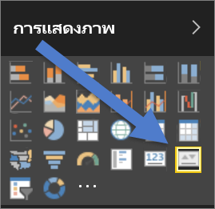
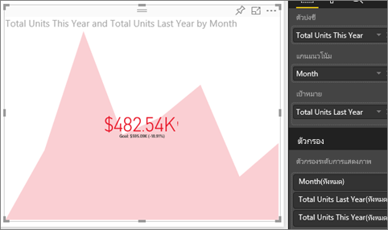

# วิชวล KPI
ดัชนีประสิทธิภาพหลัก (KPI) เป็นภาพสัญลักษณ์ที่แสดงปริมาณความก้าวหน้าของงานที่ทำเพื่อมุ่งไปยังเป้าหมายที่วัดผลได้ สำหรับข้อมูลเพิ่มเติมเกี่ยวกับ KPI ดู [Microsoft Developer Network](https://msdn.microsoft.com/library/hh272050)

## เมื่อต้องการใช้ KPI
KPI เป็นตัวเลือกที่ดีที่สุด:

* เมื่อต้องวัดความคืบหน้า (ฉันอยู่ข้างหน้าหรือข้างหลังสิ่งใด)
* เมื่อวัดระยะห่างจากเป้าหมาย (ฉันอยู่ห่างจากเป้าหมายหรือห่างจากจุดเริ่มเท่าใด)   

## ข้อกำหนดความต้องการของภาพ KPI
ดัชนีประสิทธิภาพหลัก (KPI) อิงกับการวัดเฉพาะและถูกออกแบบมาเพื่อช่วยให้คุณประเมินค่าและสถานะปัจจุบันเมื่อเทียบกับเป้าหมายที่กำหนด ดังนั้น ภาพ KPI จำเป็นต้องมีการวัด*ฐาน*ที่ประเมินเป็นค่าหนึ่งและการวัดหรือค่า*เป้าหมาย*และค่าเกณฑ์

> [!NOTE]
> ในปัจจุบัน ชุดข้อมูล KPI จำเป็นต้องประกอบด้วยค่าเป้าหมายสำหรับ KPI ถ้าชุดข้อมูลของคุณไม่ประกอบด้วยค่าเป้าหมาย คุณสามารถสร้างค่าเป้าหมายโดยการเพิ่มแผ่นงาน Excel ที่แสดงค่าเป้าหมาย ให้กับรูปแบบข้อมูลหรือไฟล์ PBIX ของคุณ
> 
> 

## วิธีการสร้าง KPI
เมื่อต้องการทำตาม ลงชื่อเข้าใช้บริการของ Power BI และเลือก**รับข้อมูล > ตัวอย่าง > ตัวอย่างการวิเคราะห์การค้าปลีก** เราจะสร้าง KPI ที่วัดความคืบหน้าที่เราได้ทำเพื่อบรรลุเป้าหมายยอดขาย

หรือดู วิธีที่คุณสามารถสร้างภาพการวัดตัวเดียว: ตัวประเมิน บัตร และ KPI

<iframe width="560" height="315" src="https://www.youtube.com/embed/xmja6EpqaO0?list=PL1N57mwBHtN0JFoKSR0n-tBkUJHeMP2cP" frameborder="0" allowfullscreen></iframe>

1. เปิดรายงานใน[มุมมองการแก้ไข](../consumer/end-user-reading-view.md)และ[เพิ่มหน้าใหม่](../power-bi-report-add-page.md)    
2. เลือก**ยอดขาย > หน่วยรวมปีนี้**  ซึ่งจะเป็นตัวดัชนี
3. เพิ่ม**เวลา > เดือน**  เพื่อแสดงแนวโน้ม
4. สิ่งสำคัญ: เรียงลำดับแผนภูมิเป็นราย**เดือน** เมื่อคุณแปลงการแสดงภาพเป็น KPI จึงไม่มีตัวเลือกการเรียงลำดับ

    
5. แปลงภาพเป็น KPI โดยเลือกไอคอน KPI จากบานหน้าต่างการแสดงภาพ
   
    
6. เพิ่มเป้าหมาย เพิ่มยอดขายของปีล่าสุดเป็นเป้าหมาย ลาก**หน่วยรวมปีที่แล้ว**ไปยังเขตข้อมูล**เป้าหมาย**
   
    
7. อีกทางหนึ่งคือ จัดรูปแบบ KPI โดยเลือกไอคอน ลูกกลิ้งทาสี เพื่อเปิดบานหน้าต่างการจัดรูปแบบ
   
   * **ตัวดัชนี** - ควบคุมหน่วยแสดงผลของตัวดัชนีและตำแหน่งทศนิยม
   * **แกนแนวโน้ม** - เมื่อตั้งค่าเป็น**เปิด** แกนแนวโน้มจะถูกแสดงเป็นพื้นหลังของภาพ KPI  
   * **เป้าหมาย** - เมื่อตั้งค่าเป็น**เปิด** ภาพจะแสดงเป้าหมายและระยะห่างจากเป้าหมายเป็นเปอร์เซ็นต์
   * **รหัสสี > ทิศทาง** - บาง KPI จะถูกถือว่า*ดีขึ้น*เมื่อมีค่าสูงขึ้นและบาง KPI จะถูกถือว่า*ดีขึ้น*เมื่อมีค่าต่ำลง ตัวอย่างเช่น กำไรเทียบกับเวลารอ โดยทั่วไปแล้ว กำไรที่สูงขึ้นจะดีกว่าเมื่อเทียบกับค่าสูงขึ้นของเวลารอ เลือก**สูงขึ้นดีกว่า**และเลือกเปลี่ยนการตั้งค่าสีได้

1. เมื่อคุณมี KPI ตามที่คุณต้องการ[ปักหมุด KPI ไปยังแดชบอร์ด](../service-dashboard-pin-tile-from-report.md)

KPI จะพร้อมใช้งานบนอุปกรณ์เคลื่อนที่ของคุณ – ช่วยให้คุณเชื่อมต่อกับธุรกิจของคุณเสมอ

## ข้อควรพิจารณาและการแก้ไขปัญหา
* ถ้า KPI ของคุณไม่มีลักษณะคล้ายกับด้านบน อาจเป็น เพราะคุณจำเป็นต้องเรียงลำดับตามเดือน เนื่องจาก KPI ไม่มีตัวเลือกการเรียงลำดับ คุณจะต้องเรียงลำดับตามเดือน*ก่อน*คุณแปลงการแสดงภาพของคุณเป็น KPI

## ขั้นตอนถัดไป

[การแสดงภาพในรายงาน Power BI](power-bi-report-visualizations.md)

มีคำถามเพิ่มเติมหรือไม่ [ลองไปที่ชุมชน Power BI](http://community.powerbi.com/)

