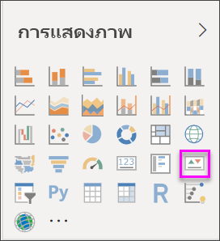
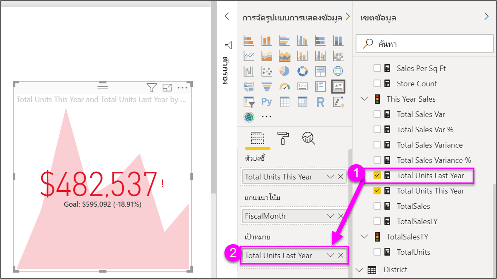

# สร้างการแสดงภาพตัวบ่งชี้ประสิทธิภาพหลัก (KPI)

[!INCLUDE [power-bi-visuals-desktop-banner](../includes/power-bi-visuals-desktop-banner.md)]

ดัชนีประสิทธิภาพหลัก (KPI) เป็นภาพสัญลักษณ์ที่แสดงปริมาณความก้าวหน้าของงานที่ทำเพื่อมุ่งไปยังเป้าหมายที่วัดผลได้ สำหรับข้อมูลเพิ่มเติมเกี่ยวกับ KPI โปรดดู [ตัวบ่งชี้ประสิทธิภาพหลัก (KPI) ใน PowerPivot](/previous-versions/sql/sql-server-2012/hh272050(v=sql.110))

ดูวิธีที่คุณสามารถสร้างภาพการวัดตัวเดียว: ตัวประเมิน บัตร และ KPI
   > [!NOTE]
   > วิดีโอนี้ใช้ Power BI Desktop เวอร์ชันเก่า
   > 
   > 
<iframe width="560" height="315" src="https://www.youtube.com/embed/xmja6EpqaO0?list=PL1N57mwBHtN0JFoKSR0n-tBkUJHeMP2cP" frameborder="0" allowfullscreen></iframe>

## เมื่อต้องการใช้ KPI

KPI เป็นตัวเลือกที่ดีที่สุด:

* การวัดความคืบหน้า ตอบคำถาม "ฉันน้ำนำหน้าหรือตามหลังสิ่งใดอยู่"?

* การวัดระยะห่างเป้าหมาย ตอบคำถาม "ฉันน้ำนำหน้าหรือตามหลังอยู่ไกลเท่าใด"?

## ข้อกำหนดของ KPI

ตัวออกแบบวัดภาพ KPI ตามหน่วยวัดเฉพาะ เป้าหมายของ KPI คือช่วยให้คุณประเมินค่าและสถานะปัจจุบันเทียบกับเป้าหมายที่กำหนด ภาพ KPI จำเป็นต้องมีการวัด *พื้นฐาน* ที่ประเมินเป็นค่าและการวัดหรือค่า *เป้าหมาย* *ค่าเกณฑ์* หรือ *จุดหมาย*

ชุดข้อมูล KPI จำเป็นต้องประกอบด้วยค่าเป้าหมายสำหรับ KPI ถ้าชุดข้อมูลของคุณไม่ประกอบด้วยค่าเป้าหมาย คุณสามารถสร้างค่าเป้าหมายโดยการเพิ่มแผ่นงาน Excel ที่แสดงค่าเป้าหมาย ให้กับรูปแบบข้อมูลหรือไฟล์ PBIX ของคุณ

## ข้อกำหนดเบื้องต้น

บทช่วยสอนนี้ใช้[ไฟล์ PBIX ตัวอย่างการวิเคราะห์การค้าปลีก](https://download.microsoft.com/download/9/6/D/96DDC2FF-2568-491D-AAFA-AFDD6F763AE3/Retail%20Analysis%20Sample%20PBIX.pbix)

1. จากด้านบนซ้ายของแถบเมนู เลือก **ไฟล์** > **เปิด**

1. ค้นหาสำเนา**ไฟล์ PBIX ตัวอย่างการวิเคราะห์การค้าปลีก**

1. เปิด**ไฟล์ PBIX ตัวอย่างการวิเคราะห์ด้านการขายปลีก**ในมุมมองรายงาน 

1. เลือ **+** เพื่อเพิ่มหน้าใหม่ 

## วิธีการสร้าง KPI

ในตัวอย่างนี้ คุณจะสร้าง KPI เพื่อวัดความคืบหน้าที่คุณได้ทำเพื่อบรรลุเป้าหมายยอดขาย

1. จากบานหน้าต่าง **เขตข้อมูล** ให้เลือก **ยอดขาย > หน่วยรวมปีนี้**  ค่านี้จะเป็นตัวดัชนี

1. เพิ่ม**เวลา > เดือนการเงิน**  ค่านี้จะแสดงแนวโน้ม

1. ในมุมขวาบนของภาพ เลือกจุดไข่ปลา และตรวจสอบว่า Power BI เรียงลำดับคอลัมน์ตาม **เดือนงบประมาณ**

    > [!IMPORTANT]
    > เมื่อคุณแปลงการแสดงภาพเป็น KPI จึง **ไม่มี** ตัวเลือกการเรียงลำดับ คุณต้องเรียงลำดับอย่างถูกต้องในขณะนี้

    

    เมื่อเรียงลำดับอย่างถูกต้อง ภาพของคุณจะมีลักษณะดังนี้:

    

1. แปลงภาพเป็น KPI โดยเลือกไอคอน **KPI** จากบานหน้าต่าง **การแสดงภาพ**

    

1. หากต้องการเพิ่งเป้าหมาย ลาก **หน่วยรวมปีที่แล้ว** ไปยังเขตข้อมูล **เป้าหมาย**

    

1. อีกทางหนึ่งคือ จัดรูปแบบ KPI โดยเลือกไอคอน ลูกกลิ้งทาสี เพื่อเปิดบานหน้าต่างการจัดรูปแบบ

    * **ตัวดัชนี** - ควบคุมหน่วยแสดงผลของตัวดัชนีและตำแหน่งทศนิยม

    * **แกนแนวโน้ม** - เมื่อตั้งค่าเป็น**เปิด** ภาพจะแสดงแกนแนวโน้มเป็นพื้นหลังของภาพ KPI  

    * **เป้าหมาย** - เมื่อตั้งค่าเป็น**เปิด** ภาพจะแสดงเป้าหมายและระยะห่างจากเป้าหมายเป็นเปอร์เซ็นต์

    * **รหัสสี > ทิศทาง** - ผู้คนจะพิจารณา KPI บางส่วนว่า ดีกว่า เมื่อมีค่า *สูงกว่า* และพิจารณา KPI บางส่วนว่า *ดีกว่า* เมื่อมีค่าต่ำกว่า ตัวอย่างเช่น กำไรเทียบกับเวลารอ โดยทั่วไปแล้ว กำไรที่สูงขึ้นจะดีกว่าเมื่อเทียบกับค่าสูงขึ้นของเวลารอ เลือก **สูงขึ้นดีกว่า** และเลือกเปลี่ยนการตั้งค่าสีได้

KPI ยังมีให้บริการในบริการของ Power BI และจากอุปกรณ์มือถือของคุณและติดตั้งได้ง่ายๆ ช่วยให้คุณสามารถเลือกที่จะเชื่อมต่อกับความคืบหน้าของธุรกิจของคุณได้ตลอดเวลา

## ข้อควรพิจารณาและการแก้ไขปัญหา

ถ้า KPI ของคุณไม่มีลักษณะคล้ายกับด้านบน อาจเป็นเพราะคุณไม่ได้จัดเรียงตาม **เดือนงบประมาณ** KPI ไม่มีตัวเลือกการจัดเรียง คุณจะต้องเริ่มต้นใหม่อีกครั้งและจัดเรียงตาม **FiscalMonth** *ก่อน*ที่คุณจะแปลงการแสดงภาพของคุณเป็น KPI

## ขั้นตอนถัดไป

* [เคล็ดลับและลูกเล่นในการแสดงข้อมูลแผนที่ Power BI](power-bi-map-tips-and-tricks.md)

* [ชนิดการแสดงภาพใน Power BI](power-bi-visualization-types-for-reports-and-q-and-a.md)

มีคำถามเพิ่มเติมหรือไม่ [ลองไปที่ชุมชน Power BI](https://community.powerbi.com/)
