# บทช่วยสอน: ฝังวิชวล Power App ในรายงาน Power BI

ในการแนะนำวิธีการใช้นี้ คุณใช้วิชวล Power Apps สร้างแอปใหม่ที่ถูกฝังในตัวอย่างรายงาน Power BI แอปนี้โต้ตอบกับวิชวลอื่นในรายงานดังกล่าว

หากคุณไม่มีการสมัครสมาชิก Power Apps [สร้างบัญชีฟรี](https://docs.microsoft.com/powerapps/maker/signup-for-powerapps) ก่อนที่คุณจะเริ่มใช้งาน

ในบทช่วยสอนนี้ คุณจะเรียนรู้วิธีการ:
> [!div class="checklist"]
> * เพิ่มวิชวล Power App ไปยังรายงาน Power I
> * ทำงานใน Power Apps เพื่อสร้างแอปใหม่ที่ใช้ข้อมูลจากรายงาน Power BI
> * ดูและโต้ตอบกับวิชวล Power Apps ในรายงาน

## ข้อกำหนดเบื้องต้น

* เบราว์เซอร์ [Google Chrome](https://www.google.com/chrome/browser/) หรือ [Microsoft Edge](https://www.microsoft.com/windows/microsoft-edge)
* [การสมัครใช้งาน Power BI](https://docs.microsoft.com/power-bi/service-self-service-signup-for-power-bi) ที่ติดตั้ง [ตัวอย่างการวิเคราะห์โอกาสทางการขาย](https://docs.microsoft.com/power-bi/sample-opportunity-analysis#get-the-content-pack-for-this-sample)
* การเข้าใจวิธีการ [สร้างแอปใน Power Apps](https://docs.microsoft.com/powerapps/maker/canvas-apps/data-platform-create-app-scratch.md) และวิธีการ [แก้ไขรายงาน Power BI](https://docs.microsoft.com/power-bi/service-the-report-editor-take-a-tour)

## สร้างแอปใหม่
เมื่อคุณเพิ่มวิชวล Power Apps ไปยังรายงานของคุณ มันจะเปิดใช้งาน PowerApps Studio ด้วยการเชื่อมต่อข้อมูลระหว่าง Power Apps และ Power BI

1. เปิดตัวอย่างรายงานตัวอย่างการวิเคราะห์โอกาสทางการขายและเลือกหน้า *โอกาสที่จะเข้ามาถึง* 

2. เคลื่อนย้ายและปรับขนาดบางไทล์รายงานเพื่อสร้างช่องว่างสำหรับวิชวลใหม่

    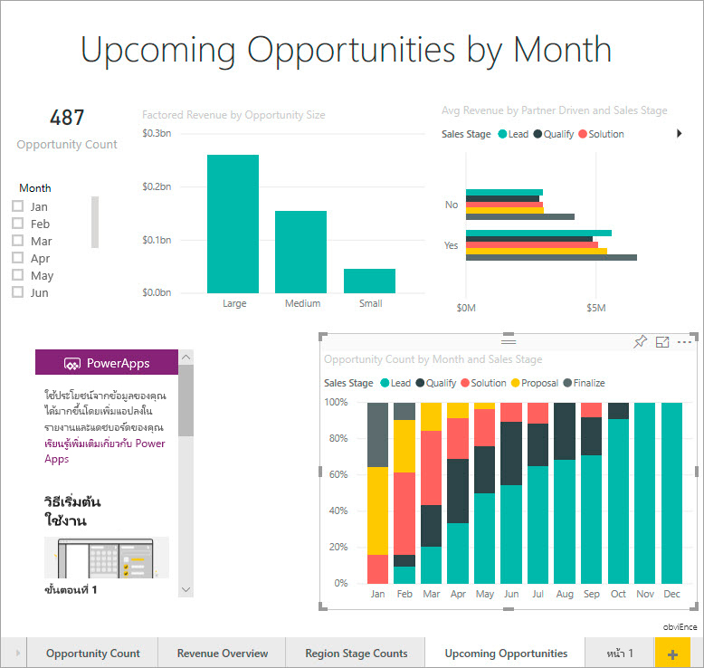

2. จากแผงการแสดงผลด้วยภาพ เลือกไอคอน Power Apps แล้วรปับขนาดวิชวลให้พอดีกับช่องว่างที่คุณสร้าง

    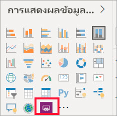

3. ในบานหน้าต่าง **เขตข้อมูล** ให้เลือก **ชื่อ** **รหัสผลิตภัณฑ์** และ **ขั้นตอนการขาย** 

    

4. ในวิชวล Power Apps เลือกสภาพแวดล้อม Power Apps ที่คุณต้องการสร้างแอป จากนั้นเลือก **สร้างขึ้นใหม่**.

    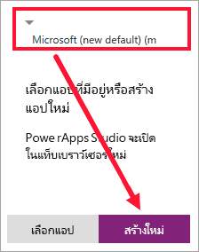

    ใน Power Apps Studio  คุณจะพบแอปเบื้องต้นที่สร้างไว้แล้ว ที่ *แกลเลอรี* ที่จะแสดงหนึ่งในเขตข้อมูลที่คุณเลือกใน Power BI.

    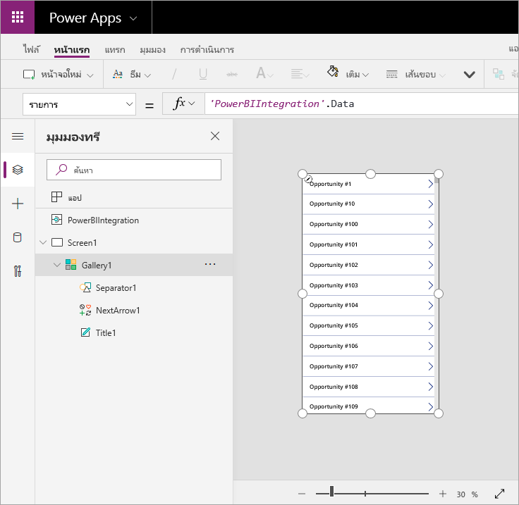

5.  ปรับขนาดแกลเลอรีเพื่อให้ใช้พื้นที่เพียงครึ่งหนึ่งของหน้าจอ 

6. ในแผงด้านซ้าย เลือก **หน้าจอ1** จากนั้นตั้งค่าคุณสมบัติ **การเพิ่ม** ของหน้าจอเป็น "แสงสีฟ้า" (ดังที่แสดงขึ้นในรายงาน)

    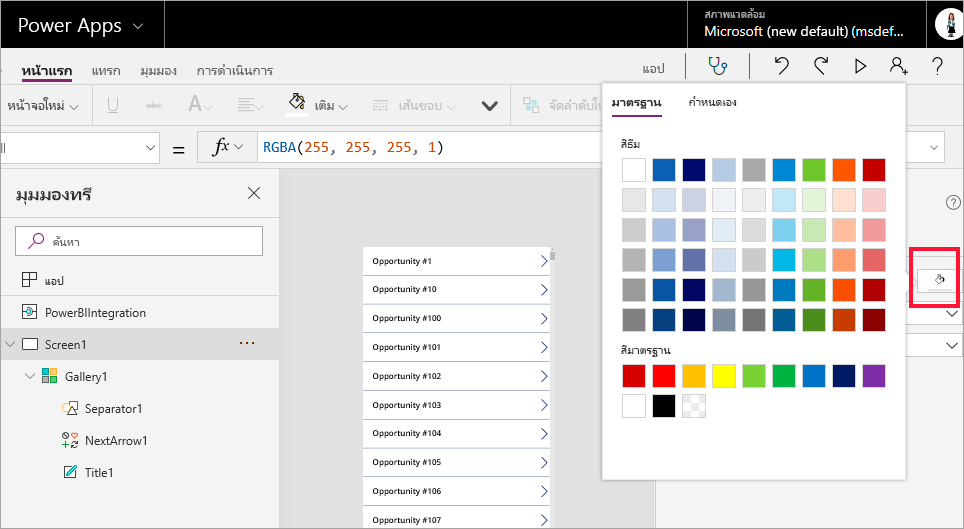

6. สร้างบางพื้นที่ว่างสำหรับการควบคุมป้าย 

    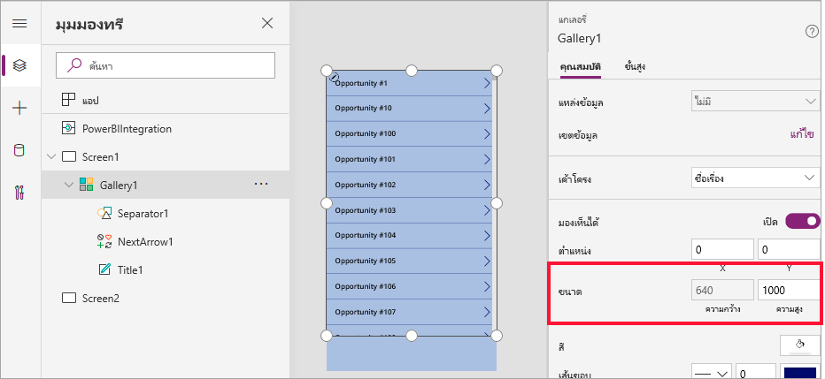

8. ใต้ **แกลเลอรี** ให้แทรกการควบคุมป้ายข้อความ

   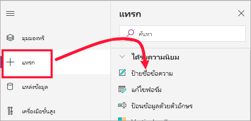

7. ลากป้ายไปยังด้านล่างของวิชวลของคุณ Set the **Text** property to `"Opportunity Count: " & CountRows(Gallery1.AllItems)`. ในตอนนี้ จะแสดงจำนวนโอกาสทั้งหมดในชุดข้อมูล

    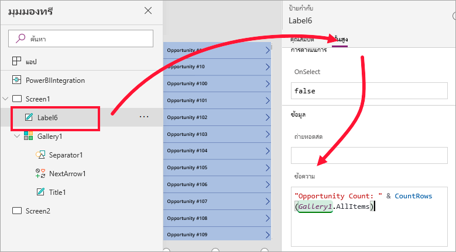

    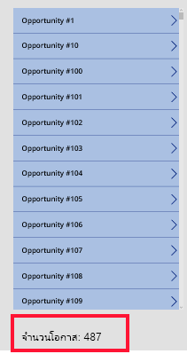

7. บันทึกแอปด้วยชื่อของ "แอปโอกาสทางการขาย" 

    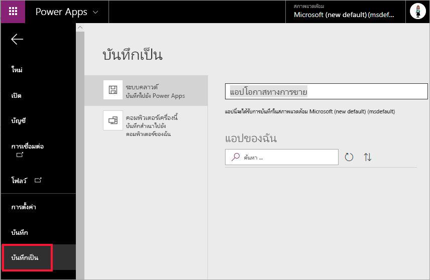

## ดูแอปในรายงาน
แอปสามารถใช้งานได้แล้วในรายงาน Power BI และสามารถโต้ตอบกับวิชวลอื่นๆ เพราะว่าสามารถแชร์แหล่งข้อมูลเดียวกันได้

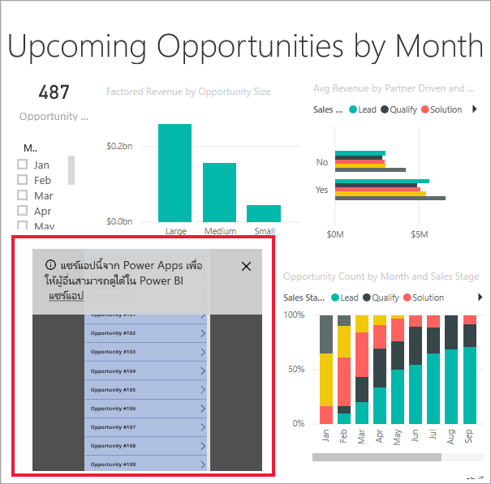

ในรายงาน Power BI ให้เลือก **ม.ค.** ในตัวแบ่งส่วนข้อมูล ซึ่งจะกรองทั้งหมด รวมถึงข้อมูลในแอป

โปรดสังเกตว่าจำนวนโอกาสในแอปจะตรงกับจำนวนที่มุมซ้ายบนของรายงาน คุณสามารถเลือกรายการอื่นๆ ในรายงาน และข้อมูลในแอปจะอัปเดต

## ล้างแหล่งข้อมูล
ถ้าคุณไม่ต้องการใช้ตัวอย่างการวิเคราะห์โอกาสทางการขายอีกต่อไป คุณสามารถลบแดชบอร์ด รายงาน และชุดข้อมูลได้

## ขั้นตอนถัดไป
[วิชวลระบบถามตอบ](power-bi-visualization-types-for-reports-and-q-and-a.md)
