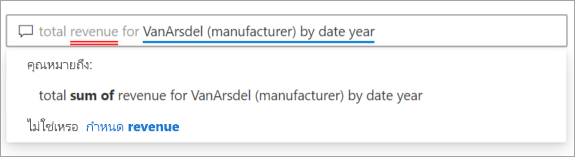

# บทนำเกี่ยวกับวิชวลถามตอบของ Power BI

[!INCLUDE [power-bi-service-new-look-include](../includes/power-bi-service-new-look-include.md)]

## วิชวลถามตอบคืออะไร

วิชวลถามตอบช่วยให้ผู้ใช้สามารถถามคำถามที่เป็นภาษาธรรมชาติและรับคำตอบในรูปแบบของวิชวลได้ 

[!INCLUDE [power-bi-visuals-desktop-banner](../includes/power-bi-visuals-desktop-banner.md)]

วิชวลถามตอบสามารถใช้เป็นเครื่องมือเพื่อช่วยให้ *ผู้ใช้งาน* ได้รับคำตอบสำหรับข้อมูลของพวกเขาอย่างรวดเร็ว และโดย*ผู้ออกแบบ* เพื่อสร้างวิชวลในรายงานโดยการคลิกสองครั้งที่ใดก็ได้บนรายงานและการใช้ภาษาธรรมชาติเพื่อเริ่มต้นใช้งาน เช่นเดียวกับวิชวลอื่นๆ วิชวลถามตอบสามารถทำการกรองข้าม/การไฮไลต์แบบเชื่อมโยง และยังสนับสนุนบุ๊กมาร์กได้ วิชวลถามตอบยังสนับสนุนธีมและตัวเลือกการจัดรูปแบบเริ่มต้นอื่น ๆ ที่พร้อมใช้งานภายใน Power BI

วิชวลถามตอบประกอบด้วยสี่องค์ประกอบหลัก

- กล่องคำถาม กล่องนี้เป็นตำแหน่งที่ผู้ใช้สามารถพิมพ์คำถามของตน และจะแสดงคำแนะนำเพื่อช่วยตอบคำถามของพวกเขา
- รายการของคำถามที่แนะนำที่มีการเติมข้อมูลไว้ล่วงหน้า
- ไอคอนเพื่อแปลงวิชวลถามตอบเป็นวิชวลมาตรฐาน 
- ไอคอนเพื่อเปิดเครื่องมือถามตอบที่ช่วยให้ผู้ออกแบบสามารถกำหนดค่ากลไกจัดการภาษาธรรมชาติเบื้องต้น

## ข้อกำหนดเบื้องต้น

1. บทช่วยสอนนี้ใช้[ไฟล์ PBIX ตัวอย่างการขายและการตลาด](https://download.microsoft.com/download/9/7/6/9767913A-29DB-40CF-8944-9AC2BC940C53/Sales%20and%20Marketing%20Sample%20PBIX.pbix) 

1. จากด้านบนซ้ายของแถบเมนู Power BI Desktop เลือก **ไฟล์** > **เปิด**
   
2. ค้นหาสำเนาของ **ไฟล์ PBIX ตัวอย่างการขายและการตลาด**

1. เปิดไฟล์ในมุมมองรายงาน .

1. เลือก  หากต้องการเพิ่มหน้าใหม่

ถ้าคุณเห็นข้อผิดพลาดเมื่อสร้างวิชวลถามตอบ ตรวจสอบให้แน่ใจว่าได้ดูส่วน[ข้อจำกัด](../natural-language/q-and-a-limitations.md) เพื่อดูว่าการกำหนดค่าแหล่งข้อมูลได้รับการสนับสนุนหรือไม่

## สร้างวิชวลถามตอบโดยใช้คำถามที่แนะนำ
ในแบบฝึกหัดนี้ เราจะเลือกหนึ่งในคำถามที่แนะนำเพื่อสร้างวิชวลถามตอบ 

1. เริ่มต้นบนหน้ารายงานที่ว่างเปล่าและเลือกไอคอนวิชวลถามตอบจากบานหน้าต่างการแสดงภาพ

    

2. ลากเส้นขอบเพื่อปรับขนาดวิชวล

    

3. หากต้องการสร้างวิชวล เลือกหนึ่งในคำถามที่แนะนำหรือเริ่มพิมพ์ลงในกล่องคำถาม ในตัวอย่างนี้ เราได้เลือก**รัฐทางภูมิศาสตร์ตามผลรวมของรายได้**. Power BI เหมาะที่สุดในการเลือกชนิดของวิชวลที่จะใช้ ในกรณีนี้ คือแผนที่

    

    แต่คุณสามารถบอก Power BI ว่าจะใช้วิชวลชนิดใดโดยการเพิ่มลงในคิวรีภาษาธรรมชาติของคุณ โปรดทราบว่าไม่ใช่วิชวลทุกชนิดที่จะทำงานหรือเข้ากับข้อมูลของคุณ ตัวอย่างเช่น ข้อมูลนี้จะไม่สร้างแผนภูมิแบบกระจายที่มีความหมาย แต่จะใช้เป็นแผนที่แบบเติม

    

## สร้างวิชวลถามตอบโดยใช้คิวรีภาษาธรรมชาติ
ในตัวอย่างข้างต้น เราได้เลือกหนึ่งในคำถามที่แนะนำเพื่อสร้างวิชวลถามตอบ  ในแบบฝึกหัดนี้ เราจะพิมพ์คำถามของเราเอง ในขณะที่เราพิมพ์คำถามของเรา Power BI จะช่วยเราด้วยการกรอกข้อมูลอัตโนมัติ การให้คำแนะนำ และคำติชม

ถ้าคุณไม่แน่ใจว่าคำถามชนิดใดที่ต้องถามหรือคำศัพท์ที่จะใช้ ให้ขยาย **แสดงคำแนะนำทั้งหมด** หรือค้นหาในบานหน้าต่างเขตข้อมูลซึ่งสามารถพบได้ตามด้านขวาของพื้นที่ทำงาน การดำเนินการนี้จะทำให้คุณคุ้นเคยกับศัพท์และเนื้อหาของชุดข้อมูลการตลาดและการขาย

1. พิมพ์คำถามในเขตข้อมูลถามตอบ Power BI เพิ่มขีดเส้นใต้สีแดงเป็นคำที่ไม่รู้จัก เมื่อใดก็ตามที่เป็นไปได้ Power BI จะช่วยกำหนดคำที่ไม่รู้จัก  ในตัวอย่างแรกด้านล่าง ให้เลือกคำแนะนำใดก็ตามที่จะใช้ได้กับเรา  

    

2. ในขณะที่เราพิมพ์คำถามเพิ่มเติม Power BI ช่วยให้เราทราบว่าระบบไม่เข้าใจคำถามและพยายามช่วยเหลือ ในตัวอย่างด้านล่าง Power BI จะถามเราว่า "คุณหมายถึง ..." และแสดงให้เห็นวิธีการที่แตกต่างกันในการตั้งคำถามของเราโดยใช้ศัพท์จากชุดข้อมูลของเรา 

    

5. ด้วยความช่วยเหลือของ Power BI เราสามารถตั้งคำถามด้วยศัพท์ที่เป็นที่รู้จักทั้งหมดได้ Power BI จะแสดงผลลัพธ์เป็นแผนภูมิเส้น 

    

6. ลองเปลี่ยนวิชวลเป็นแผนภูมิคอลัมน์ 

    

## จัดรูปแบบและปรับแต่งวิชวลถามตอบ
วิชวลถามตอบสามารถปรับแต่งได้โดยใช้บานหน้าต่างการจัดรูปแบบและโดยการใช้ธีม 

### นำธีมไปใช้
เมื่อคุณเลือกธีม ธีมดังกล่าวจะถูกนำไปใช้กับหน้ารายงานทั้งหมด มีธีมมากมายให้เลือก ลองใช้จนกว่าคุณจะได้รูปลักษณ์ที่คุณต้องการ 

1. ในแถบเมนู ให้เลือกแท็บ**หน้าแรก**และเลือก**สลับธีม**. 

    

    
    
2. ในตัวอย่างนี้ เราได้เลือก**ธีมเพิ่มเติม** > **ปลอดภัยสำหรับคนตาบอดสี**

    

### จัดรูปแบบวิชวลถามตอบ
จัดรูปแบบวิชวลถามตอบ เขตข้อมูลคำถาม และวิธีการแสดงคำแนะนำ คุณสามารถเปลี่ยนทุกอย่างจากพื้นหลังของชื่อเรื่องให้เป็นสีโฮเวอร์สำหรับคำที่ไม่รู้จัก ต่อไปนี้เราได้เพิ่มพื้นหลังสีเทาลงในกล่องคำถามและเปลี่ยนเส้นใต้เป็นสีเหลืองและสีเขียว ชื่อเรื่องอยู่กึ่งกลางและมีพื้นหลังสีเหลือง 

## แปลงวิชวลถามตอบเป็นวิชวลมาตรฐาน
เราได้จัดรูปแบบแผนภูมิคอลัมน์ที่ปลอดภัยสำหรับคนตาบอดสีแล้วเล็กน้อย - เพิ่มชื่อและเส้นขอบ ในตอนนี้ เราพร้อมที่จะแปลงเป็นวิชวลมาตรฐานในรายงานของเราและยังมีการปักหมุดไปยังแดชบอร์ดด้วย

เลือกไอคอน เพื่อ**เปลี่ยนผลการถามตอบนี้เป็นวิชวลมาตรฐาน**

วิชวลนี้ไม่ใช่วิชวลถามตอบอีกต่อไป แต่เป็นแผนภูมิคอลัมน์มาตรฐาน ซึ่งสามารถปักหมุดไปยังแดชบอร์ด ในรายงาน วิชวลนี้จะทำงานเหมือนกับวิชวลมาตรฐานอื่นๆ โปรดทราบว่าบานหน้าต่างการแสดงภาพจะแสดงไอคอนแผนภูมิคอลัมน์ที่เลือกไว้แทนไอคอนวิชวลถามตอบ

ถ้าคุณกำลังใช้***บริการของ Power BI*** คุณสามารถปักหมุดวิชวลไปยังแดชบอร์ดโดยการเลือกไอคอนปักหมุดได้ในขณะนี้ 

## คุณลักษณะขั้นสูงของวิชวลถามตอบ
การเลือกไอคอนรูปเฟืองจะเปิดบานหน้าต่างเครื่องมือวิชวลถามตอบ 

ใช้บานหน้าต่างเครื่องมือเพื่อสอนศัพท์ถามตอบที่เครื่องมือไม่รู้จัก จัดการกับศัพท์เหล่านั้น และจัดการคำถามที่แนะนำสำหรับชุดข้อมูลและรายงานนี้ ในบานหน้าต่างเครื่องมือ คุณยังสามารถตรวจสอบคำถามที่ได้รับการถามโดยใช้วิชวลถามตอบนี้ และดูคำถามที่ได้รับการตั้งค่าสถานะโดยผู้ใช้ หากต้องการเรียนรู้เพิ่มเติม ดู[ข้อมูลเครื่องมือถามตอบ](../natural-language/q-and-a-tooling-intro.md)

## ข้อควรพิจารณาและการแก้ไขปัญหา
วิชวลถามตอบจะทำงานร่วมกับ Office และ Bing เพื่อพยายามจับคู่คำทั่วไปที่ไม่รู้จักกับเขตข้อมูลในชุดข้อมูลของคุณ  

## ขั้นตอนถัดไป

มีหลายวิธีที่คุณสามารถรวมภาษาธรรมชาติได้ สำหรับข้อมูลเพิ่มเติม ให้ดูบทความต่อไปนี้:

* [เครื่องมือถามตอบ](../natural-language/q-and-a-tooling-intro.md)
* [แนวทางปฏิบัติที่ดีที่สุดของการถามตอบ](../natural-language/q-and-a-best-practices.md)
