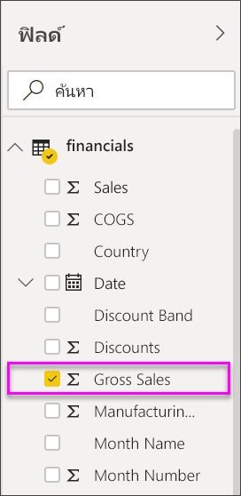
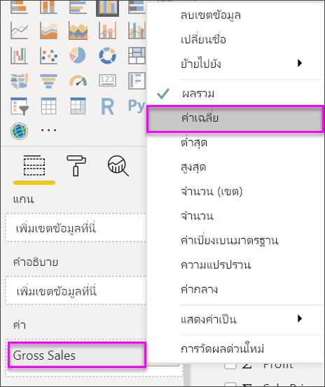
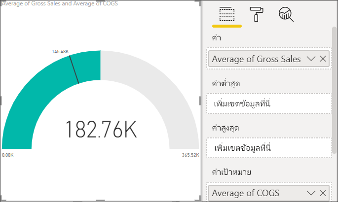
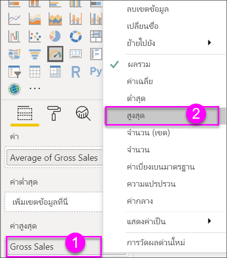
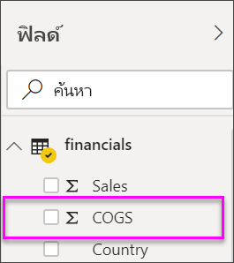
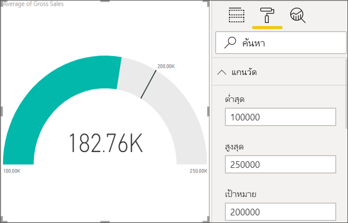

# แผนภูมิหน้าปัดความเร็วใน Power BI

[!INCLUDE [power-bi-visuals-desktop-banner](../includes/power-bi-visuals-desktop-banner.md)]

แผนภูมิหน้าปัดความเร็วมีโค้งวงกลมและแสดงเป็นค่าเดียวที่วัดความคืบหน้าตามเพื่อไปสู่เป้าหมาย Key Performance Indicator (KPI) เส้น (หรือ*เข็ม*) แทนค่าเป้าหมายหรือปลายทาง การแรเงาแทนด้วยความคืบหน้าสู่เป้าหมาย ค่าภายในส่วนโค้งแทนค่าความคืบหน้า Power BI แพร่ค่าที่เป็นไปได้ทั้งหมดจะกระจายเท่าๆ กันตามส่วนโค้ง จากค่าต่ำสุด (ค่าซ้ายสุด) ไปสู่ค่าสูงสุด (ค่าขวาสุด)

ในตัวอย่างนี้ เรามีผู้ค้าปลีกรถยนต์ที่กำลังติดตามการขายเฉลี่ยของทีมขายต่อเดือน เข็มแสดงเป้าหมายทางการขายรถยนต์ให้ได้ 140 คัน การขายเฉลี่ยที่เป็นไปได้น้อยที่สุดคือ 0 และสูงสุดเป็น 200 คัน  การแรเงาสีน้ำเงินแสดงว่า ตอนนี้เราประมาณการว่ามีการขาย 120 คันในเดือนนี้ โชคดี มีสัปดาห์อื่นยังที่สามารถไปถึงเป้าหมายได้

ดูวิธีที่คุณสามารถสร้างภาพการวัดตัวเดียว: ตัวประเมิน บัตร และ KPI
   > [!NOTE]
   > วิดีโอนี้ใช้ Power BI Desktop เวอร์ชันเก่า
   > 
   > 
<iframe width="560" height="315" src="https://www.youtube.com/embed/xmja6EpqaO0?list=PL1N57mwBHtN0JFoKSR0n-tBkUJHeMP2cP" frameborder="0" allowfullscreen></iframe>

## เมื่อต้องการใช้แผนภูมิหน้าปัดความเร็ว

แผนภูมิหน้าปัดความเร็วเป็นทางเลือกที่ดีสำหรับ

* แสดงความคืบหน้าเพื่อจะบรรลุเป้าหมาย

* แสดงการวัดร้อยละ เช่น KPI

* แสดงความสมบูรณ์ของการวัดเดี่ยว

* แสดงข้อมูลเพื่อที่คุณสามารถสแกนและทำความเข้าใจอย่างรวดเร็ว

## ข้อกำหนดเบื้องต้น

บทช่วยสอนนี้ใช้[ไฟล์ Excel ตัวอย่างทางการเงิน](https://download.microsoft.com/download/9/6/D/96DDC2FF-2568-491D-AAFA-AFDD6F763AE3/Retail%20Analysis%20Sample%20PBIX.pbix)

1. จากด้านบนซ้ายของแถบเมนู ให้เลือก **รับข้อมูล** > **Excel**
   
2. ค้นหาสำเนา**ไฟล์ Excel ตัวอย่างด้านการเงินของคุณ**

1. เปิด **ไฟล์ Excel ตัวอย่างด้านการเงิน**ในมุมมองรายงาน

1. เลือก **การเงิน** และ **Sheet1**

1. คลิก **โหลด**

1. เลือก  หากต้องการเพิ่มหน้าใหม่

## สร้างแผนภูมิหน้าปัดความเร็วแบบพื้นฐาน

### ขั้นตอนที่ 1: สร้างตัววัดแบบหน้าปัดความเร็วเพื่อติดตามยอดขายรวม

1. เริ่มต้นบน หน้ารายงานเปล่า

1. ในบานหน้าต่างของ**เขตข้อมูล** ให้เลือก**ยอดขายรวม**

   

1. เปลี่ยนการรวมข้อมูลเป็น**หาค่าเฉลี่ย**

   

1. เลือกไอคอนตัววัด  การแปลงแผนภูมิคอลัมน์ให้เป็นแผนภูมิตัววัด

    

    ขึ้นอยู่กับเมื่อคุณดาวน์โหลดไฟล์**ตัวอย่างการเงิน** คุณอาจเห็นตัวเลขที่ไม่ตรงกับตัวเลขเหล่านี้ได้

    > [!TIP]
    > ตามค่าเริ่มต้น Power BI สร้างแผนภูมหน้าปัดความเร็วที่คาดการณ์ตามค่าปัจจุบัน (ในกรณีนี้คือ**ค่าเฉลี่ยของผลรวมขาย**) จะถือว่าเป็นจุดกลิ่งกลางของหน้าปัด เนื่องจากค่า**ยอดขายรวมค่าเฉลี่ย**คือ $182.76K ค่าเริ่มต้น (ต่ำสุด) ถูกตั้งค่าเป็น 0 และค่าสิ้นสุด (สูงสุด) ถูกตั้งค่าเป็นคู่ค่าปัจจุบัน

### ขั้นตอนที่ 3: ตั้งค่าเป้าหมาย

1. ลาก**COGS**จากบานหน้าต่าง**เขตข้อมูล**เพื่อตั้ง**ค่าเป้าหมาย**ที่ดี

1. เปลี่ยนการรวมข้อมูลเป็น**หาค่าเฉลี่ย**

   Power BI เพิ่มเข็มเพื่อแสดงค่าเป้าหมาย **$145.48K**ของเรา

   

    โปรดสังเกตว่าเราได้เกินเป้าหมายของเราแล้ว

   > [!NOTE]
   > คุณสามารถใส่ค่าเป้าหมายด้วยตนเอง ดู [ใช้ตัวเลือกของการจัดรูปแบบเพื่อตั้งค่าต่ำสุด สูงสุด และส่วนของค่าเป้าหมาย](#use-manual-format-options-to-set-minimum-maximum-and-target-values)

### ขั้นตอนที่ 4: ตั้งค่าสูงสุด

ในขั้นตอนที่ 2 Power BI ให้ใช้เขตข้อมูลที่ตั้ง**ค่า**ต่ำสุด(เริ่มต้น) และค่าสูงสุด(สิ้นสุด)โดยอัตโนมัติ จะเกิดอะไรขึ้นถ้าคุณต้องการตั้งค่าสูงสุดของคุณเอง สมมติว่าแทนที่จะใช้่ค่าปัจจุบันคุณสองเป็นค่าที่เป็นไปได้สูงสุด คุณต้องการตั้งค่าเป็นตัวเลขยอดขายรวมสูงสุดในชุดข้อมูลของคุณหรือไม่

1. ลาก**ยอดขายรวม**จากหน้าต่าง**เขตข้อมูล**ไปยัง**ค่าสูงสุด**

1. เปลี่ยนการรวมข้อมูลเป็น**หาค่าสูงสุด**

   

   รูปฟน้าปัดวัดถูกวาดอีกครั้ง ด้วยค่าสุดท้ายใหม่ คือ 1.21 ล้านของยอดขายรวม

   

### ขั้นตอนที่ 5: บันทึกรายงานของคุณ

1. [บันทึกรายงาน](../service-report-save.md)

## ใช้ตัวเลือกของการจัดรูปแบบเพื่อตั้งค่าต่ำสุด สูงสุด และค่าเป้าหมาย

1. ลาก**ยอดขายรวมมากที่สุด**จาก**ค่าสูงสุด**

1. เลือกไอคอนแปรงลูกกลิ้งเพื่อเปิดแถบ**จัดรูปร่าง**

   

1. ขยาย**แกนตัววัด**และใส่ค่า**ต่ำสุด**และ**สูงสุด**

    

1. ล้างตัวเลือก**COGS**ในบานหน้าต่าง**เขตข้อมูล**เพื่อนำค่าเป้าหมายออก

    

1. เมื่อเขตข้อมูล**เป้าหมาย**ปรากฏภายใต้**แกนตัววัด** ให้ใส่ค่า

     

1. จัดรูปแบบแผนภูมหน้าปัดต่อไป ก็สามารถทำได้

เมื่อคุณทำเสร็จแล้วทำตามขั้นตอนเหล่านี้ คุณจะมีแผนภูมิตัววัดที่มีลักษณะดังนี้:

## ขั้นตอนถัดไป

* [Key Performance Indicator (KPI) วิชวล](power-bi-visualization-kpi.md)

* [ชนิดการแสดงภาพใน Power BI](power-bi-visualization-types-for-reports-and-q-and-a.md)

มีคำถามเพิ่มเติมหรือไม่ [ลองไปที่ชุมชน Power BI](https://community.powerbi.com/)
