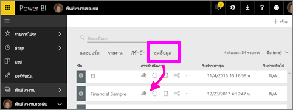
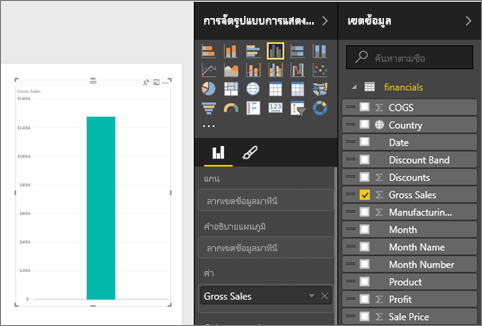
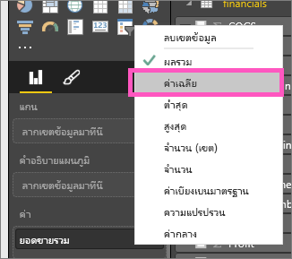
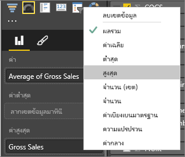
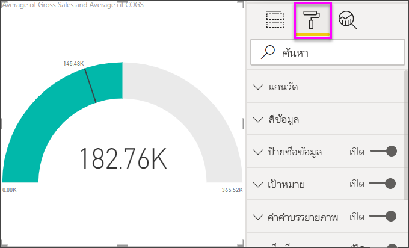
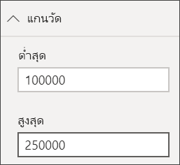
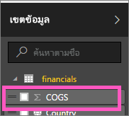
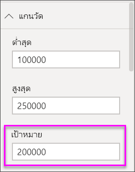

# แผนภูมิหน้าปัดความเร็วใน Power BI
แผนภูมิหน้าปัดความเร็วมีโค้งวงกลม และแสดงเป็นค่าเดียวที่วัดความคืบหน้าตามเพื่อไปสู่เป้าหมาย/KPI  เป้าหมาย หรือค่าเป้าหมาย ถูกแสดงทีละบรรทัด (needle) ความคืบสู่เป้าหมายที่ถูกแสดงด้วยการแรเงา  และค่าที่แสดงว่าความคืบหน้าจะแสดงในเป็นหนาภายในส่วนโค้ง ค่าที่เป็นไปได้ทั้งหมดจะกระจายเท่าๆ กันตามส่วนโค้ง จากค่าต่ำสุด (ค่าซ้ายสุด) ไปสู่ค่าสูงสุด (ค่าขวาสุด)

ในตัวอย่างด้านล่าง เรามีผู้ค้าปลีกรถยนต์กำลังติดตามการขายเฉลี่ยของทีมขายของเราต่อเดือน เป้าหมายของเราคือ 140 และแสดงด้วยเข็มสีดำ  การขายเฉลี่ยที่เป็นไปได้น้อยที่สุดคือ 0 และเราได้ตั้งค่าสูงสุดเป็น 200  การแรเงาสีน้ำเงินแสดงว่า ตอนนี้เราประมาณการว่ามีการขาย 120 ตัวในเดือนนี้ โชคดีทีี่เรายังคงมีสัปดาห์อื่นเพื่อจะทำให้ถึงเป้าหมาย

## เมื่อต้องการใช้แผนภูมิหน้าปัดความเร็ว
แผนภูมิหน้าปัดความเร็วเป็นทางเลือกที่ดีสำหรับ

* แสดงความคืบหน้าเพื่อจะบรรลุเป้าหมาย
* แสดงการวัดร้อยละ เช่น KPI
* แสดงความสมบูรณ์ของการวัดเด่ียว
* แสดงข้อมูลที่สามารถสแกนและทำความเข้าใจได้อย่างรวดเร็ว

### ข้อกำหนดเบื้องต้น
 - Power BI service หรือ Power BI Desktop
 - เวิร์กบุ๊ก Excel ตัวอย่างด้านการเงิน: [ดาวน์โหลดตัวอย่างโดยตรง](http://go.microsoft.com/fwlink/?LinkID=521962)

## สร้างแผนภูมิหน้าปัดความเร็วแบบพื้นฐาน
คำแนะนำเหล่านี้ใช้ Power BI service เพื่อติดตาม ลงชื่อเข้าใช้ Power BI และเปิดไฟล์ตัวอย่าง Excel เกี่ยวกับการเงิน  

หรือดู วิธีที่คุณสามารถสร้างภาพการวัดตัวเดียว: ตัวประเมิน บัตร และ KPI

<iframe width="560" height="315" src="https://www.youtube.com/embed/xmja6EpqaO0?list=PL1N57mwBHtN0JFoKSR0n-tBkUJHeMP2cP" frameborder="0" allowfullscreen></iframe>

### ขั้นตอนที่ 1: เปิดไฟล์ Excel ตัวอย่างการเงิน
1. [ดาวน์โหลดตัวอย่างไฟล์ Excel เกี่ยวกับการเงิน](../sample-financial-download.md) ถ้าคุณยังไมได้่โหลด จดจำตำแหน่งที่บันทึกไว้

2. เปิดไฟล์ใน***Power BI service*** โดยเลือก**รับไฟล์ข้อมูล\>** และเรียกดูตำแหน่งที่ตั้งที่คุณบันทึกไฟล์ เลือก**นำเข้า** ตัวอย่างทางการเงินจะถูกเพิ่มในพื้นที่ทำงานของคุณในฐานะชุดข้อมูล

3. จากรายการเนื้อหา**ชุดข้อมูล** ให้เลือก**ตัวอย่างทางการเงิน**เมื่อต้องเปิดในโหมด Explore

    

### ขั้นตอนที่ 2: สร้างตัววัดแบบหน้าปัดความเร็วเพื่อติดตามยอดขายรวม
1. ในบานหน้าต่าง**เขตข้อมูล** ให้เลือก**ยอดขายรวม**
   
   
2. เปลี่ยนการรวมข้อมูลเป็น**หาค่าเฉลี่ย**
   
   
3. เลือกไอคอนตัววัดแบบหน้าปัดความเร็วเพื่อแปลงแผนภูมิคอลัมน์เป็นตัววัด
   
   ตามค่าเริ่มต้น Power BI สร้างแผนภูมหน้าปัดความเร็วที่ค่าปัจจุบัน (ในกรณีนี้คือค่าเฉลี่ยของผลรวมขาย) จะถือว่าเป็นจุดกลิ่งกลางของหน้าปัด เนื่องจากยอดขายรวมค่าเฉลี่ยคือ $182.76K ค่าเริ่มต้น (ต่ำสุด) ถูกตั้งค่าเป็น 0 และค่าสิ้นสุด (สูงสุด) ถูกตั้งค่าเป็นคู่ค่าปัจจุบัน
   
   

### ขั้นตอนที่ 3: ตั้งค่าเป้าหมาย
1. ลาก**COGS**ไป**ค่าเป้าหมาย**
2. เปลี่ยนการรวมข้อมูลเป็น**หาค่าเฉลี่ย**
   Power BI เพิ่มเข็มเพื่อแสดงค่าเป้าหมาย **$145.48K**ของเรา โปรดสังเกตว่าเราได้เกินเป้าหมายของเราแล้ว
   
   
   
   > [!NOTE]
   > คุณสามารถใส่ค่าเป้าหมายด้วยตนเอง  ดู "ใช้ตัวเลือกของการจัดรูปแบบเพื่อตั้งค่าต่ำสุด สูงสุด และค่าเป้าหมาย" ตามด้านล่าง
   > 
   > 

### ขั้นตอนที่ 4: ตั้งค่าสูงสุด
ในขั้นตอนที่ 2 Power BI ให้ใช้เขตข้อมูลที่ตั้งค่าต่ำสุด(เริ่มต้น) และค่าสูงสุด(สิ้นสุด)โดยอัตโนมัติ  แต่จะเกิดอะไรขึ้นถ้าคุณต้องการตั้งค่าสูงสุดของคุณเอง  สมมติว่าแทนที่จะใช้่ค่าปัจจุบันคุณสองเป็นค่าที่เป็นไปได้สูงสุด คุณต้องการตั้งค่าเป็นตัวเลขยอดขายรวมสูงสุดในชุดข้อมูลของคุณหรือไม่ 

1. ลาก**ยอดขายรวม**จาก**เขตข้อมูล**รายการไปยัง**ค่าสูงสุด**
2. เปลี่ยนการรวมข้อมูลเป็น**หาค่าสูงสุด**
   
   
   
   รูปฟน้าปัดวัดถูกวาดอีกครั้ง ด้วยค่าสุดท้ายใหม่ คือ 1.21 ล้านของยอดขายรวม
   
   

### ขั้นตอนที่ 5: บันทึกรายงานของคุณ
1. [บันทึกรายงาน](../service-report-save.md)
2. [เพิ่มแผนภูมิแบบหน้าปัดความเร็วเป็นแดชบอร์ดไทล์](../service-dashboard-pin-tile-from-report.md) 

## ใช้ตัวเลือกของการจัดรูปแบบเพื่อตั้งค่าต่ำสุด สูงสุด และค่าเป้าหมาย
1. ลาก**ยอดขายรวมมากที่สุด**จาก**ค่าสูงสุด**
2. เปิดบานหน้าต่างจัดรูปแบบโดยเลือกไอคอนแปรงลูกกลิ้ง
   
   
3. ขยาย**แกนตัววัด**และใส่ค่า**Min**และ**Max**
   
    
4. ลบค่าเป้าหมายปัจจุบัน โดยการลบเครื่องหมายถูกถัดจาก**COGS**
   
    
5. เมื่อเขตข้อมูล**เป้าหมาย**ปรากฏภายใต้**แกนตัววัด** ให้ใส่ค่า
   
    
6. จัดรูปแบบแผนภูมหน้าปัดต่อไป ก็สามารถทำได้

## ขั้นตอนถัดไป

[ตัววัดใน Power BI](power-bi-visualization-kpi.md)

[ชนิดการแสดงภาพใน Power BI](power-bi-visualization-types-for-reports-and-q-and-a.md)
