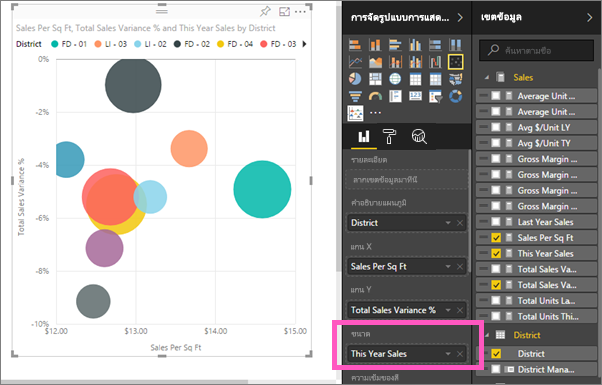

# แผนภูมิกระจายและแผนภูมิฟองใน Power BI
แผนภูมิกระจายจะมีแกนค่าสองแกนเสมอเพื่อแสดงข้อมูลตัวเลขหนึ่งชุดตามแกนแนวนอนและอีกชุดของค่าตัวเลขตามแกนแนวตั้ง แผนภูมิแสดงจุดที่จุดตัดของค่าตัวเลข x และ y เพื่อรวมค่าเหล่านี้ลงในจุดข้อมูลเดียว จุดข้อมูลเหล่านี้อาจถูกกระจายสม่ำเสมอกันหรืออาจไม่สม่ำเสมอกันตามแกนแนวนอน โดยขึ้นอยู่กับข้อมูลดังกล่าว

แผนภูมิฟองอากาศแทนที่จุดข้อมูลด้วยฟองอากาศ โดยที่ีมี*ขนาด*ฟองเป็นตัวแทนขนาดที่เพิ่มขึ้นของข้อมูล

คุณสามารถตั้งค่าจำนวนของจุดข้อมูลได้  

## เมื่อต้องใช้แผนภูมิกระจายหรือแผนภูมิฟองอากาศ
### แผนภูมิกระจายเป็นตัวเลือกที่ดีที่สุด:
* ในการแสดงความสัมพันธ์ระหว่างค่า**เป็นตัวเลข** 2 (กระจาย) หรือ 3 (ฟองอากาศ) ค่า
* ในการทำผังตัวเลขสองกลุ่มให้เป็นหนึ่งชุดข้อมูลของพิกัด xy
* แทนที่จะเป็นแผนภูมิเส้นเมื่อคุณต้องการเปลี่ยนมาตราส่วนของแกนแนวนอน    
* เมื่อต้องเปลี่ยนแกนแนวนอนเป็นมาตราส่วนลอการิทึม
* เมื่อต้องการแสดงข้อมูลในแผ่นงานซึ่งรวมถึงชุดค่าที่เป็นคู่หรือเป็นกลุ่ม ในแผนภูมิกระจาย คุณสามารถปรับระดับอิสระของแกนเพื่อเผยให้เห็นข้อมูลเพิ่มเติมเกี่ยวกับค่าที่จัดกลุ่มได้
* การแสดงรูปแบบสำหรับชุดข้อมูลจำนวนมากตัวอย่างเช่น โดยการแสดงแนวโน้มแบบเส้นตรง หรือที่ไม่ใช่เชิงเส้น แบบกลุ่ม และนอกขอบเขต
* เพื่อเปรียบเทียบตัวเลขขนาดใหญ่ของจุดข้อมูลโดยไม่คำนึงถึงเวลา  ยิ่งคุณใส่ข้อมูลเพิ่มเติมในแผนภูมิกระจายมากเท่าไหร่ คุณยิ่งสามารถทำการเปรียบเทียบได้ดีเท่านั้น

### แผนฟองอากาศเป็นตัวเลือกที่ดีที่สุด:
* ถ้าข้อมูลของคุณมีชุดข้อมูล 3 ชุดที่แต่ละชุดประกอบด้วยชุดของค่า
* การนำเสนอข้อมูลทางการเงิน  ฟองอากาศที่มีขนาดแตกต่างกันเป็นประโยชน์สำหรับการเน้นให้เห็นค่าเฉพาะบางค่า
* การใช้กับจตุภาค

## สร้างแผนภูมิกระจาย
ดูวิดีโอนี้เพื่อดูการสร้างแผนภูมิกระจาย จากนั้น ทำตามขั้นตอนด้านล่างเพื่อสร้างด้วยตนเอง

<iframe width="560" height="315" src="https://www.youtube.com/embed/PVcfPoVE3Ys?list=PL1N57mwBHtN0JFoKSR0n-tBkUJHeMP2cP" frameborder="0" allowfullscreen></iframe>

คำแนะนำเหล่านี้ใช้ตัวอย่างการวิเคราะห์ร้านค้าปลีก เพื่อทำตาม[ดาวน์โหลดตัวอย่าง](../sample-datasets.md)สำหรับบริการ Power BI (app.powerbi.com) หรือ Power BI Desktop   

1. เลือกสีเหลืองพร้อมไอคอนเพื่อสร้างเป็น[หน้ารายงานเปล่า](../power-bi-report-add-page.md)
 
2. จากพื้นที่ช่องข้อมูล เลือกช่องข้อมูลต่อไปนี้:
   - **ยอดขาย** > **ยอดขายต่อตารางฟุต**
   - **ยอดขาย** > **ร้อยละผลต่างยอดขายรวม**
   - **เขต** > **เขต**

     

     ถ้าคุณกำลังใช้บริการ Power BI ตรวจสอบให้แน่ใจว่าคุณเปิดรายงานใน[มุมมองการแก้ไข](../service-interact-with-a-report-in-editing-view.md)

3. แปลงเป็นแผนภูมิกระจาย ในพื้นที่การแสดงภาพ เลือกไอคอนแผนภูมิกระจาย

   .

4. ลาก**เขต**จาก**รายละเอียด**ไปยัง**คำอธิบายแผนภูมิ** ซึ่งจะแสดงแผนภูมิกระจายที่ทำผัง**ร้อยละผลต่างของยอดขายรวม**ตามแกน Y และทำผัง**ยอดขายต่อตารางฟุต**บนแกน X จุดสีข้อมูลแสดงถึงเขตต่าง ๆ:

    

ตอนนี้เรามาเพิ่มมิติที่สามกัน

## สร้างแผนภูมิฟองอากาศ

1. จากช่อง**ข้อมูล**ลาก**ยอดขาย** > **ค่ายอดขายของปีนี้** > **ไปยัง**พื้นที่ **ขนาด** จุดข้อมูลขยายไปยังปริมาณที่เป็นสัดส่วนกันกับมูลค่ายอดขาย
   
   

2. เลื่อนไปเหนือฟองอากาศ ขนาดของฟองอากาศแสดงค่าของ**ยอดขายของปีนี้**
   
    

3. ในการตั้งค่าจำนวนของจุดข้อมูลที่จะแสดงในแผนภูมิฟองอากาศ ในหัวข้อ**รูปแบบ**ของพื้นที่การ**แสดงภาพ** ขยายการ์ด**ทั่วไป**และปรับ**ปริมาณข้อมูล** คุณสามารถตั้งค่าปริมาณข้อมูลสูงสุดเป็นตัวเลขใด ๆ จนถึง 10,000 เมื่อคุณใช้ตัวเลขที่สูงขึ้น เราแนะนำให้ทดสอบก่อนเพื่อให้แน่ใจว่ายังมีประสิทธิภาพที่ดี 

     

   > [!NOTE]
   > เนื่องจากจุดข้อมูลที่มากกว่าอาจหมายถึงเวลาในการโหลดที่นานกว่า ถ้าคุณเลือกที่จะเผยแพร่รายงานด้วยขีดจำกัดที่จุดสิ้นสุดของสเกลที่สูงกว่า ตรวจสอบให้แน่ใจว่าคุณทดสอบรายงานของคุณทั่วทั้งเว็บและอุปกรณ์เคลื่อนที่ของคุณ เพื่อให้แน่ใจว่าประสิทธิภาพการทำงานตรงกับความคาดหวังของผู้ใช้ของคุณ โปรดทราบว่าสำหรับตัวเลขของจุดข้อมูลที่สูงกว่า คุณควรทดสอบผลลัพธ์ด้วยหลากหลายปัจจัยรูปแบบเพื่อให้แน่ใจถึงประสิทธิภาพ

4. คุณสามารถ[จัดรูปแบบสี ป้ายชื่อ ชื่อเรื่อง พื้นหลัง และอื่น ๆ ของการแสดงภาพ](service-getting-started-with-color-formatting-and-axis-properties.md)ได้ การ[ปรับปรุงการเข้าถึง](../desktop-accessibility.md) ให้พิจารณาเพิ่มรูปร่างเครื่องหมายไปยังแต่ละบรรทัด การใช้รูปร่างตัวทำเครื่องหมายที่แตกต่างกันสำหรับแต่ละบรรทัดทำให้ง่ายสำหรับผู้บริโภครายงานในการแยกความแตกต่างของแต่ละเส้น (หรือพื้นที่) การเลือกรูปร่างเครื่องหมาย ขยายการ์ด**รูปร่าง** จากนั้นเลือกรูปร่างตัวทำเครื่องหมาย

      

   นอกจากนี้ คุณยังสามารถเปลี่ยนรูปร่างเครื่องหมายเป็นข้าวหลามตัด สามเหลี่ยม หรือสี่เหลี่ยมจัตุรัสได้:

   

## ข้อควรพิจารณาและการแก้ไขปัญหา

### **แผนภูมิกระจายของคุณมีจุดข้อมูลเดียวเท่านั้น**
แผนภูมิกระจายของคุณที่มีจุดข้อมูลเดียวเท่านั้น เป็นแผนภูมิที่รวมค่าทั้งหมดบนแกน X และ Y หรือไม่?  หรืออาจเป็นแผนภูมิที่รวมค่าทั้งหมดตามเส้นแนวนอนหรือแนวตั้งเดียว?

เพิ่มเขตข้อมูลไปยังพื้นที่**รายละเอียด**ที่จะบอกวิธีการจัดกลุ่มค่า Power BI ช่องข้อมูลต้องไม่ซ้ำกันสำหรับแต่ละจุดที่คุณต้องการลรทำผัง  
เช่น ตัวเลขแถวอย่างง่ายหรือช่องข้อมูล ID:

หรือถ้าคุณไม่มีในข้อมูลของคุณ ให้สร้างช่องข้อมูลที่รวมค่า X และ Y เข้าด้วยกันลงในสิ่งที่ไม่ซ้ำกันสำหรับแต่ละจุด:

การสร้างเขตข้อมูลใหม่[ใช้ตัวแก้ไขแบบสอบถามของ Power BI Desktop เพืื่อเพิ่มคอลัมน์ดัชนี](../desktop-add-custom-column.md)ไปยังชุดข้อมูลของคุณ  จากนั้นเพิ่มคอลัมน์นี้ไปยังพื้นที่**รายละเอียด**ของการแสดงภาพของคุณ

## ขั้นตอนถัดไป
[ชนิดการแสดงภาพใน Power BI](power-bi-visualization-types-for-reports-and-q-and-a.md)

[ลงทะเบียนเพื่อขอรับรุ่นทดลองใช้ฟรี](https://powerbi.microsoft.com/get-started/)  

มีคำถามเพิ่มเติมหรือไม่ [ลองไปที่ชุมชน Power BI](http://community.powerbi.com/)

