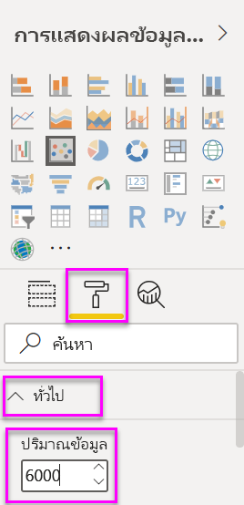
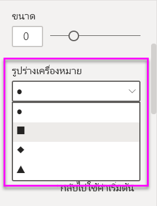
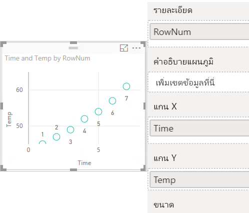
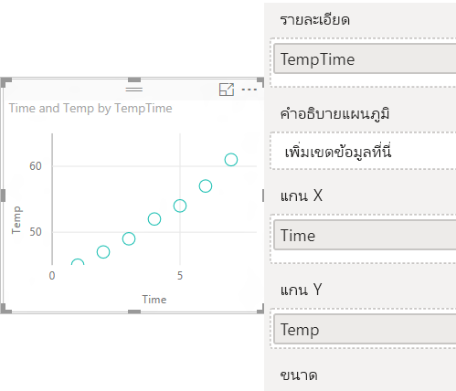

# แผนภูมิกระจาย แผนภูมิฟองอากาศ และแผนภูมิลงจุดใน Power BI

[!INCLUDE [power-bi-visuals-desktop-banner](../includes/power-bi-visuals-desktop-banner.md)]

แผนภูมิกระจายจะมีแกนค่าสองแกนเสมอเพื่อแสดงข้อมูลตัวเลขหนึ่งชุดตามแกนแนวนอนและอีกชุดของค่าตัวเลขตามแกนแนวตั้ง แผนภูมิแสดงจุดที่จุดตัดของค่าตัวเลข x และ y เพื่อรวมค่าเหล่านี้ลงในจุดข้อมูลเดียว Power BI อาจกระจายจุดข้อมูลสม่ำเสมอกันหรืออาจไม่สม่ำเสมอกันตามแกนแนวนอน ขึ้นอยู่กับข้อมูลที่แสดงในแผนภูมิ

ดูวิดีโอนี้เพื่อดูการสร้างแผนภูมิกระจาย จากนั้น ทำตามขั้นตอนด้านล่างเพื่อสร้างด้วยตนเอง
   > [!NOTE]
   > วิดีโอนี้ใช้ Power BI Desktop เวอร์ชั่นเก่า
   > 
   > 
<iframe width="560" height="315" src="https://www.youtube.com/embed/PVcfPoVE3Ys?list=PL1N57mwBHtN0JFoKSR0n-tBkUJHeMP2cP" frameborder="0" allowfullscreen></iframe>

คุณสามารถตั้งค่าจำนวนของจุดข้อมูลได้สูงสุดถึง 10,000 จุด  

## เมื่อต้องใช้แผนภูมิกระจายหรือแผนภูมิฟองอากาศหรือแผนภูมิการลงจุด

### แผนภูมิกระจายและแผนภูมิฟอง

แผนภูมิกระจายแสดงความสัมพันธ์ระหว่างสองค่าตัวเลข แผนภูมิฟองอากาศจะแทนที่จุดข้อมูลด้วยฟองอากาศ และ*ขนาด*ของฟองอากาศแสดงข้อมูลสามมิติเพิ่มเติม

แผนภูมิกระจายเป็นตัวเลือกที่ดีที่สุด:

* ในการแสดงความสัมพันธ์ระหว่างค่าตัวเลขสองค่า

* ในการทำผังตัวเลขสองกลุ่มให้เป็นหนึ่งชุดข้อมูลของพิกัด X และ Y

* แทนที่จะใช้เป็นแผนภูมิเส้นเมื่อคุณต้องการเปลี่ยนมาตราส่วนของแกนแนวนอน

* เมื่อต้องเปลี่ยนแกนแนวนอนเป็นมาตราส่วนลอการิทึม

* เมื่อต้องการแสดงข้อมูลในแผ่นงานซึ่งรวมถึงชุดค่าที่เป็นคู่หรือเป็นกลุ่ม

    > [!TIP]
    > ในแผนภูมิกระจาย คุณสามารถปรับระดับอิสระของแกนเพื่อเผยให้เห็นข้อมูลเพิ่มเติมเกี่ยวกับค่าที่จัดกลุ่มได้

* การแสดงรูปแบบสำหรับชุดข้อมูลจำนวนมากตัวอย่างเช่น โดยการแสดงแนวโน้มแบบเส้นตรง หรือที่ไม่ใช่เชิงเส้น แบบกลุ่ม และนอกขอบเขต

* เพื่อเปรียบเทียบตัวเลขขนาดใหญ่ของจุดข้อมูลโดยไม่คำนึงถึงเวลา  ยิ่งคุณใส่ข้อมูลเพิ่มเติมในแผนภูมิกระจายมากเท่าไหร่ คุณยิ่งสามารถทำการเปรียบเทียบได้ดีเท่านั้น

นอกเหนือจากสิ่งที่แผนภูมิกระจายสามารถให้คุณได้ แผนภูมิฟองถือเป็นตัวเลือกที่ดี:

* ถ้าข้อมูลของคุณมีชุดข้อมูล 3 ชุดที่แต่ละชุดประกอบด้วยชุดของค่า

* การนำเสนอข้อมูลทางการเงิน  ฟองอากาศที่มีขนาดแตกต่างกันเป็นประโยชน์สำหรับการเน้นให้เห็นค่าเฉพาะบางค่า

* การใช้กับจตุภาค

### แผนภูมิการลงจุด

แผนภูมิลงจุดนั้นเหมือนกันกับแผนภูมิฟองอากาศและแผนภูมิกระจาย แต่จะใช้เพื่อลงข้อมูลเชิงหมวดหมู่ตามแกน X

แผนภูมิการลงจุดเป็นตัวเลือกที่ดีในกรณีที่คุณต้องการลงข้อมูลเชิงหมวดหมู่ที่แกน X ด้วย

## ข้อกำหนดเบื้องต้น

บทช่วยสอนนี้ใช้[ไฟล์ PBIX ตัวอย่างการวิเคราะห์การค้าปลีก](https://download.microsoft.com/download/9/6/D/96DDC2FF-2568-491D-AAFA-AFDD6F763AE3/Retail%20Analysis%20Sample%20PBIX.pbix)

1. จากด้านบนซ้ายของแถบเมนู เลือก **ไฟล์** > **เปิด**
   
2. ค้นหาสำเนา**ไฟล์ PBIX ตัวอย่างการวิเคราะห์การค้าปลีก**

1. เปิด**ไฟล์ PBIX ตัวอย่างการวิเคราะห์การค้าปลีก**ในมุมมองรายงาน 

1. เลือก  หากต้องการเพิ่มหน้าใหม่

## สร้างแผนภูมิกระจาย

1. เริ่มจากหน้ารายงานเปล่า และจากแถบคำสั่ง **เขตข้อมูล** เลือกเขตข้อมูลต่อไปนี้

    * **ยอดขาย** > **ยอดขายต่อตารางฟุต**

    * **ยอดขาย** > **ร้อยละผลต่างยอดขายรวม**

    * **เขต** > **เขต**

    

1. ในพื้นที่**การแสดงภาพ** เลือก เมื่อต้องแปลงแผนภูมิคอลัมน์คลัสเตอร์เป็นแผนภูมิกระจาย

   

1. ลาก**เขต**จาก**รายละเอียด**ไปยัง**คำอธิบายแผนภูมิ**

    Power BI จะแสดงแผนภูมิกระจายที่ทำผัง**ร้อยละผลต่างของยอดขายรวม**ตามแกน Y และทำผัง**ยอดขายต่อตารางฟุต**บนแกน X จุดสีข้อมูลแสดงถึงเขตต่าง ๆ:

    

ตอนนี้เรามาเพิ่มมิติที่สามกัน

## สร้างแผนภูมิฟองอากาศ

1. จากช่อง**ข้อมูล**ลาก**ยอดขาย** > **ค่ายอดขายของปีนี้** > **ไปยัง**พื้นที่ **ขนาด** จุดข้อมูลขยายไปยังปริมาณที่เป็นสัดส่วนกันกับมูลค่ายอดขาย

   

1. เลื่อนไปเหนือฟองอากาศ ขนาดของฟองอากาศแสดงค่าของ**ยอดขายของปีนี้**

    

1. ในการตั้งค่าจำนวนของจุดข้อมูลที่จะแสดงในแผนภูมิฟองอากาศ ในหัวข้อ**รูปแบบ**ของพื้นที่การ**แสดงภาพ** ขยาย**ทั่วไป**และปรับ**ปริมาณข้อมูล**

    

    คุณสามารถตั้งค่าปริมาณข้อมูลสูงสุดเป็นตัวเลขใด ๆ จนถึง 10,000 เมื่อคุณใช้ตัวเลขที่สูงขึ้น เราแนะนำให้ทดสอบก่อนเพื่อให้แน่ใจว่ายังมีประสิทธิภาพที่ดี

    > [!NOTE]
    > จุดข้อมูลเพิ่มอาจหมายถึงเวลาการโหลดที่นานขึ้น ถ้าคุณเลือกที่จะเผยแพร่รายงาน ด้วยขีดจำกัดที่สูงกว่าจุดสิ้นสุดของสเกล คุณต้องแน่ใจว่าได้ทดสอบลางรายงานผลของคุณไปทั่วทั้งเว็บ และอุปกรณ์เคลื่อนที่แล้ว คุณต้องการยืนยันว่า ประสิทธิภาพการทำงานของแผนภูมิตรงกับความคาดหวังของผู้ใช้งานของคุณ

1. คุณสามารถ[จัดรูปแบบสี ป้ายชื่อ ชื่อเรื่อง พื้นหลัง และอื่น ๆ ของการแสดงภาพ](service-getting-started-with-color-formatting-and-axis-properties.md)ได้

    การ[ปรับปรุงการเข้าถึง](../desktop-accessibility.md) ให้พิจารณาเพิ่มรูปร่างเครื่องหมายไปยังแต่ละบรรทัด การเลือกรูปร่างเครื่องหมาย ขยาย**รูปร่าง** เลือก**รูปร่างตัวทำเครื่องหมาย** แล้วจึงเลือกรูปร่าง

    

    คุณสามารถเปลี่ยนรูปร่างเครื่องหมายเป็นข้าวหลามตัด สามเหลี่ยม หรือสี่เหลี่ยมจัตุรัสได้. ใช้รูปร่างเครื่องหมายที่แตกต่างกันสำหรับแต่ละเส้น ทำให้ง่ายสำหรับผู้บริโภครายงาน เพื่อแยกแยะเส้น (หรือพื้นที่) ออกจากกัน

## สร้างแผนภูมิการลงจุด

เมื่อต้องการสร้างแผนภูมิการลงจุดให้แทนที่เขตข้อมูล**แกน X** เชิงตัวเลขด้วยเขตข้อมูลเชิงหมวดหมู่

จากแผง**แกน X** ให้ลบ**ยอดขายต่อตารางฟุต** และแทนที่ด้วย**เขต**  > **ตัวจัดการเขต**

## ข้อควรพิจารณาและการแก้ไขปัญหา

### แผนภูมิกระจายของคุณมีจุดข้อมูลเดียวเท่านั้น

แผนภูมิกระจายของคุณที่มีจุดข้อมูลเดียวเท่านั้น เป็นแผนภูมิที่รวมค่าทั้งหมดบนแกน X และ Y หรือไม่?  หรืออาจเป็นแผนภูมิที่รวมค่าทั้งหมดตามเส้นแนวนอนหรือแนวตั้งเดียว?

เพิ่มเขตข้อมูลไปยัง**รายละเอียด**ได้ดีเพื่อที่จะบอกวิธีการจัดกลุ่มค่า Power BI ช่องข้อมูลต้องไม่ซ้ำกันสำหรับแต่ละจุดที่คุณต้องการลรทำผัง เตัวเลขแถวอย่างง่ายหรือช่องข้อมูล ID ที่จะสามารถทำได้

ถ้าคุณไม่มีในข้อมูลของคุณ ให้สร้างช่องข้อมูลที่รวมค่า X และ Y เข้าด้วยกันลงในสิ่งที่ไม่ซ้ำกันสำหรับแต่ละจุด:

การสร้างเขตข้อมูลใหม่[ใช้ตัวแก้ไขแบบสอบถามของ Power BI Desktop เพืื่อเพิ่มคอลัมน์ดัชนี](../desktop-add-custom-column.md)ไปยังชุดข้อมูลของคุณ จากนั้นเพิ่มคอลัมน์นี้ไปยังพื้นที่การแสดงภาพ**รายละเอียด**ของคุณได้ดี

## ขั้นตอนถัดไป

* [การสุ่มตัวอย่างความหนาแน่นสูงในแผนภูมิกระจาย Power BI](desktop-high-density-scatter-charts.md)

* [ชนิดการแสดงภาพใน Power BI](power-bi-visualization-types-for-reports-and-q-and-a.md)

มีคำถามเพิ่มเติมหรือไม่? [ลองไปที่ชุมชน Power BI](https://community.powerbi.com/)
