# ตัวแบ่งส่วนข้อมูลใน Power BI

[!INCLUDE [power-bi-visuals-desktop-banner](../includes/power-bi-visuals-desktop-banner.md)]

คุณต้องการให้ผู้อ่านรายงานของคุณ สามารถดูภาพรวมของเมตริกการขาย แต่ยังแสดงประสิทธิภาพของแต่ละผู้จัดการเขต และกรอบเวลาที่แตกต่างกัน คุณสามารถสร้างหลายรายงานแยกต่างหากกัน หรือแผนภูมิเปรียบเทียบ หรือคุณสามารถใช้ตัวแบ่งส่วนข้อมูล ตัวแบ่งส่วนข้อมูลเป็นอีกวิธีหนึ่งของการกรอง ที่จำกัดส่วนของชุดข้อมูลที่จะแสดงในการแสดงภาพอื่น ๆ ในรายงานให้แคบลง 

บทช่วยสอนนี้ใช้[ตัวอย่างการวิเคราะห์ด้านการขายปลีก](../sample-retail-analysis.md)ที่มีให้ฟรี เพื่อแนะนำให้คุณสร้าง, จัดรูปแบบ และการใช้ตัวแบ่งส่วนข้อมูล โดยใช้รายการและช่วงวันที่ ขอให้สนุกกับการค้นพบวิธีต่าง ๆ ในการจัดรูปแบบ และใช้ตัวแบ่งส่วนข้อมูล 

## เมื่อไรที่ควรใช้ตัวแบ่งส่วนข้อมูล
ตัวแบ่งส่วนข้อมูล คือตัวเลือกที่ดีที่สุดเมื่อคุณต้องการ:

* แสดงตัวกรองที่ใช้งานบ่อยหรือสำคัญ บนพื้นที่รายงานเพื่อให้ง่ายต่อการเข้าถึง
* ทำให้การดูสถานะตัวกรองปัจจุบันได้ง่ายขึ้น โดยไม่ต้องเปิดรายการดรอปดาวน์ 
* กรองตามคอลัมน์ที่ไม่จำเป็นและซ่อนอยู่ในตารางข้อมูล
* สร้างรายงานที่เฉพาะเจาะจงมากขึ้น โดยการใส่ตัวแบ่งส่วนข้อมูลข้างกับวิชวลที่สำคัญ

ตัวแบ่งส่วนข้อมูล Power BI มีข้อจำกัดดังต่อไปนี้:

- ตัวแบ่งส่วนข้อมูลไม่สนับสนุนเขตข้อมูลจากค่าที่ป้อน
- ตัวแบ่งส่วนข้อมูลไม่สนับสนุดการดูรายละเอียดแนวลึก

## สร้างตัวแบ่งส่วนข้อมูล

**สร้างตัวแบ่งส่วนข้อมูลใหม่เพื่อกรองข้อมูลด้วยตัวจัดการเขต**

บทช่วยสอนนี้ใช้[ไฟล์ PBIX ตัวอย่างการวิเคราะห์การค้าปลีก](https://download.microsoft.com/download/9/6/D/96DDC2FF-2568-491D-AAFA-AFDD6F763AE3/Retail%20Analysis%20Sample%20PBIX.pbix)

1. จากด้านบนซ้ายของแถบเมนู เลือก **ไฟล์** > **เปิด**
   
2. ค้นหาสำเนา**ไฟล์ PBIX ตัวอย่างการวิเคราะห์การค้าปลีก**

1. เปิด**ไฟล์ PBIX ตัวอย่างการวิเคราะห์การค้าปลีก**ในมุมมองรายงาน 

1. เลือก  หากต้องการเพิ่มหน้าใหม่

2. ในหน้าภาพรวม โดยที่ยังไม่ได้เลือกสิ่งใดใน Canvas ให้เลือกไอคอน**ตัวแบ่งส่วนข้อมูล** ในบานหน้าต่าง**การจัดรูปแบบการแสดงข้อมูล**เพื่อสร้างตัวแบ่งส่วนข้อมูลใหม่ 
3. เมื่อเลือกตัวแบ่งส่วนข้อมูลใหม่จากบานหน้าต่างเขตข้อมูล ให้เลือก **DM** > **เขต**เพื่อรวบรวมข้อมูลตัวแบ่งส่วนข้อมูล ตัวแบ่งส่วนข้อมูลใหม่ที่มีรายการกล่องตัวเลือกอยู่หน้าชื่อ 
    
    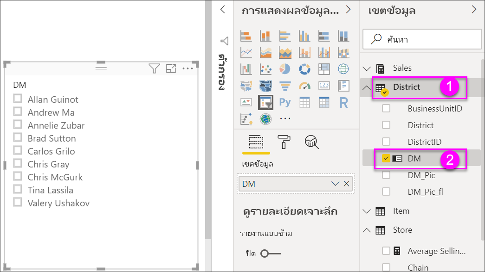
    
4. ปรับขนาด และลากตัวแบ่งส่วนข้อมูลและองค์ประกอบอื่น ๆ บนพื้นที่ทำงานเพื่อเพิ่มพื้นที่ให้ตัวแบ่งส่วนข้อมูล สังเกตว่ารายการในตัวแบ่งส่วนข้อมูลจะถูกตัดออกถ้าคุณปรับขนาดของตัวแบ่งส่วนข้อมูลให้เล็กเกินไป 
5. เลือกชื่อบนตัวแบ่งส่วนข้อมูล และดูผลที่มีต่อการแสดงภาพอื่น ๆ บนหน้า เลือกชื่ออีกครั้งเพื่อยกเลิกการเลือก และกดแป้น **Ctrl** ค้างไว้เพื่อเลือกมากกว่าหนึ่งชื่อ การเลือกชื่อทั้งหมดมีผลเหมือนกับการไม่เลือกเลย 

6. หรือเลือกไอคอนลูกกลิ้งทาสีเพื่อจัดรูปแบบตัวแบ่งส่วนข้อมูลของคุณ มีทางเลือกง่ายๆ มากมายเพื่อที่จะอธิบายสิ่งทั้งหมดที่นี่ - ดังนั้นให้ลองทดสอบและสร้างตัวแบ่งส่วนข้อมูลที่เหมาะกับคุณ จากตัวอย่างด้านล่าง ตัวแบ่งส่วนข้อมูลแรกจะใช้การวางแนวตามแนวนอนและใช้ภาพพื้นหลังแบบสีสำหรับรายการต่างๆ ตัวแบ่งส่วนข้อมูลที่สองถูกเก็บไว้ในแนวตั้งและใช้สีข้อความแทนสำหรับลักษณะที่เป็นมาตรฐานมากขึ้น

   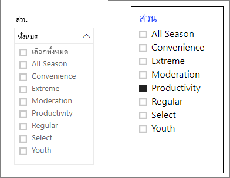
>[!TIP]
>รายการตัวแบ่งส่วนข้อมูลจะเรียงลำดับจากน้อยไปหามากตามค่าเริ่มต้น ในการกลับลำดับการจัดเรียงให้เป็นจากมากไปหาน้อย ให้เลือกจุดไข่ปลา ( **...** ) ในมุมขวาบนของตัวแบ่งส่วนข้อมูล แล้วเลือก**เรียงลำดับจากมากไปหาน้อย**

**เพื่อสร้างตัวแบ่งส่วนข้อมูลใหม่ เพื่อกรองข้อมูลตามช่วงวันที่**

1. เมื่อยังไม่ได้เลือกสิ่งใดใน Canvas ให้เลือกกล่องแบบหล่นลง**ร้านค้า**ในบานหน้าต่างเขตข้อมูล แล้ว**ลากเปิดวันที่**ไปยัง**ค่า**ในบานหน้าต่างการจัดรูปแบบการแสดงข้อมูล เพื่อสร้างการจัดรูปแบบการแสดงข้อมูลใหม่
2. เลือกที่การแสดงภาพใหม่ แล้วเลือกไอคอน**ตัวแบ่งส่วนข้อมูล** เพื่อแปลงการแสดงภาพใหม่ให้เป็นตัวแบ่งส่วนข้อมูล ตัวแบ่งส่วนข้อมูลนี้เป็น ตัวควบคุมแถบเลื่อน ที่มีช่วงวันที่เติมลงไป
    
    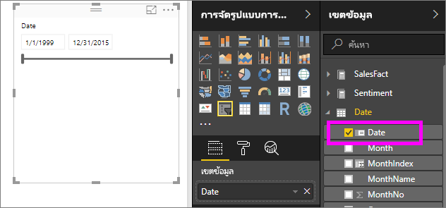

    
4. ปรับขนาด และลากตัวแบ่งส่วนข้อมูลและองค์ประกอบอื่น ๆ บนพื้นที่ทำงาน เพื่อให้มีพื้นที่สำหรับตัวแบ่งส่วนข้อมูลนี้ สังเกตว่าแถบเลื่อนจะปรับขนาดตามขนาดของตัวแบ่งส่วนข้อมูล แต่จะหายไปและวันที่ถูกตัดออก ถ้าคุณปรับขนาดของตัวแบ่งส่วนข้อมูลไว้เล็กเกินไป 
4. เลือกช่วงวันที่ที่แตกต่างกันด้วยแถบเลื่อน หรือเลือกเขตข้อมูลวันที่เพื่อพิมพ์ค่า หรือผุดปฏิทินขึ้นมาสำหรับการเลือกที่แม่นยำมากขึ้น สังเกตผลที่มีต่อการแสดงภาพอื่น ๆ บนหน้า
    
    >[!NOTE]
    >ข้อมูลชนิดตัวเลข และวันที่/เวลา จะสร้างตัวแบ่งส่วนข้อมูลช่วงเป็นแถบเลื่อนตามค่าเริ่มต้น เริ่มตั้งแต่การอัปเดตเดือนกุมภาพันธ์ 2018 ของ Power BI แถบเลื่อนช่วงที่เป็นชนิดจำนวนเต็ม จะจัดชิดเป็นจำนวนเต็มแทนที่จะแสดงตำแหน่งทศนิยม 

5. เพื่อเปลี่ยนชนิดของตัวแบ่งส่วนข้อมูล เลือกที่ตัวแบ่งส่วนข้อมูลก่อน แล้วโฮเวอร์เหนือพื้นที่มุมบนขวาของตัวแบ่งส่วนข้อมูล ลูกศรดรอปดาวน์จะปรากฏ และเลือกหนึ่งในตัวเลือกอื่น ๆ เช่น **รายการ** หรือ **ก่อน** สังเกตการเปลี่ยนแปลงของตัวแบ่งส่วนข้อมูล และตัวเลือกของการเลือกได้ 
 
    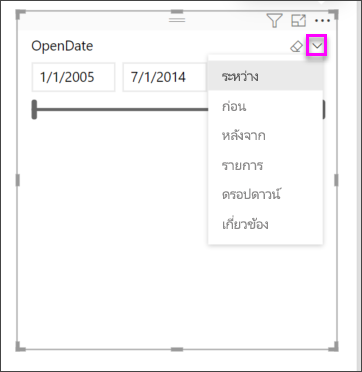

สำหรับข้อมูลเพิ่มเติมเกี่ยวกับการสร้างตัวแบ่งส่วนข้อมูลช่วงวันที่และตัวเลข ดูวิดีโอต่อไปนี้ และดู[ใช้ตัวแบ่งส่วนข้อมูลช่วงตัวเลขใน Power BI Desktop](../desktop-slicer-numeric-range.md)
   > [!NOTE]
   > วิดีโอนี้ใช้ Power BI Desktop เวอร์ชันเก่า
   > 
   > 
<iframe width="560" height="315" src="https://www.youtube.com/embed/zIZPA0UrJyA" frameborder="0" allowfullscreen></iframe> 

## ตัวควบคุมว่าวิชวลในหน้าไหนได้รับผลจากตัวแบ่งส่วนข้อมูล
ตามค่าเริ่มต้น ตัวแบ่งส่วนข้อมูลบนหน้ารายงานมีผลต่อการแสดงภาพอื่น ๆ บนหน้านั้น รวมถึงผลระหว่างตัวแบ่งส่วนข้อมูลด้วยกัน เมื่อคุณเลือกค่าในรายการและแถบเลื่อนวันที่ที่คุณเพิ่งสร้าง สังเกตผลที่มีต่อการแสดงภาพอื่น ๆ ข้อมูลกรองแล้วคือ จุดตัดของค่าที่เลือกในตัวแบ่งส่วนข้อมูลทั้งสอง 

คุณสามารถใช้**การโต้ตอบกับภาพ** เพื่อไม่รวมการแสดงภาพบางหน้าจากผลของตัวแบ่งส่วนในหน้าอื่นได้ บนหน้า**ภาพรวม** แผนภูมิ "ความแปรปรวนของยอดขายรวม ตามเดือนงบประมาณและผู้จัดการเขต" (Total Sales Variance by FiscalMonth and District Manager) แสดงข้อมูลเปรียบเทียบโดยรวมสำหรับผู้จัดการเขต ตามเดือน ซึ่งคุณต้องการให้ปรากฏอยู่ตลอดเวลา คุณสามารถใช้**การโต้ตอบกับภาพ** เพื่อให้เลือกตัวแบ่งส่วนข้อมูลกรองแผนภูมินี้ได้ 

1. ด้วยตัวแบ่งส่วนข้อมูลของตัวจัดการเขตในหน้า**ยอดขายรายเดือนของเขต**ที่เลือก:
    - ใน Power BI Desktop เลือกเมนู**รูปแบบ**ภายใต้**เครื่องมือภาพ**แล้วเลือก**แก้ไขการโต้ตอบ**
   
   ตัวควบคุมตัวกรอง  ปรากฏขึ้นเหนือการแสดงภาพอื่น ๆ บนหน้า ตอนแรก ไอคอน**ตัวกรอง**ทั้งหมดถูกเลือก
   
2. เลือกไอคอน**ไม่มี** ที่อยู่เหนือแผนภูมิ**ความแปรปรวนของยอดขายรวม ตามเดือนงบประมาณและผู้จัดการเขต** เพื่อทำให้ตัวแบ่งส่วนข้อมูลหยุดกรองแผนภูมินั้น 
3. เลือกตัวแบ่งส่วนข้อมูล**เดือน** และอีกครั้งเลือกไอคอน**ไม่มี** ที่ด้านบนของแผนภูมิ**ความแปรปรวนของยอดขายรวม ตามเดือนงบประมาณและผู้จัดการเขต** เพื่อทำให้ตัวแบ่งส่วนข้อมูลนี้หยุดกรองแผนภูมิดังกล่าว ตอนนี้ เมื่อคุณเลือกชื่อและช่วงวันที่ในตัวแบ่งส่วนข้อมูล แผนภูมิความแปรปรวนของยอดขายรวม ตามเดือนงบประมาณและผู้จัดการเขต จะไม่เปลี่ยนแปลง 

ดู[การการปฏิสัมพันธ์กับวิชวลในรายงาน Power BI](../service-reports-visual-interactions.md) สำหรับข้อมูลเพิ่มเติมเกี่ยวกับการแก้ไขการปฏิสัมพันธ์

## ซิงค์ และใช้ตัวแบ่งส่วนข้อมูลบนหน้าอื่น ๆ
เริ่มตั้งแต่การอัปเดต Power BI เดือนกุมภาพันธ์ 2018 คุณสามารถซิงค์ตัวแบ่งส่วนข้อมูล และใช้บนหน้าใด ๆ หรือทุกหน้าในรายงาน 

ในรายงานปัจจุบัน หน้า**ยอดขายรายเดือนของเขต**ยังมีตัวแบ่งส่วนข้อมูล**ตัวจัดการเขต** แต่ถ้าเรายังต้องการให้มีตัวแบ่งส่วนข้อมูลอยู่ในหน้า**ภาพรวม**ด้วยจะเป็นอย่างไร นอกจากนี้ หน้า**ร้านค้าใหม่**ยังมีชิ้นด้วยเช่นกัน แต่จะมีเฉพาะเมื่อให้ข้อมูล**ชื่อร้านค้า**เท่านั้น ด้วยบานหน้าต่าง**ซิงค์ตัวแบ่งส่วนข้อมูล** เราสามารถซิงค์ตัวแบ่งส่วนข้อมูล**ตัวจัดการเขต** เพื่อให้เลือกตัวแบ่งส่วนข้อมูลบนหน้าใด ๆ มีผลต่อแสดงภาพบนทั้งสามหน้าได้

1. ในเมนู**มุมมอง** ให้เลือก**ซิงค์ตัวแบ่งส่วนข้อมูล**ใน Power BI Desktop

    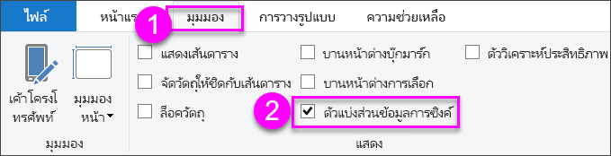

1.  บานหน้าต่าง**ซิงค์ตัวแบ่งส่วนข้อมูล**จะปรากฏขึ้นระหว่างบานหน้าต่าง**ตัวกรอง**และบานหน้าต่าง**การจัดรูปแบบการแสดงข้อมูล**  

    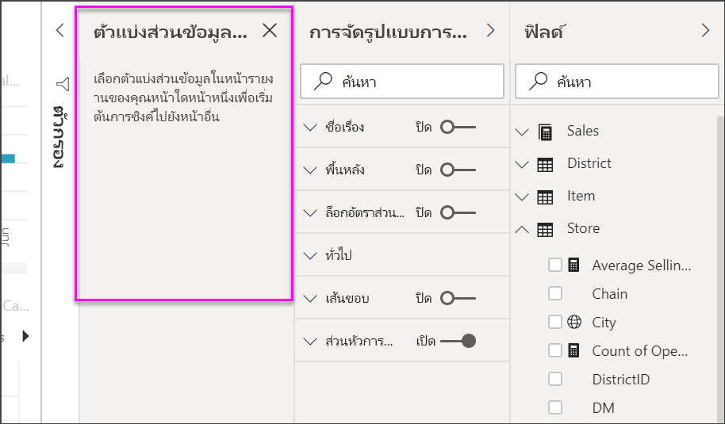

1. ในหน้า**ยอดขายรายเดือนของเขต** ให้เลือก ตัวแบ่งส่วนข้อมูล**ตัวจัดการเขต** 
    
    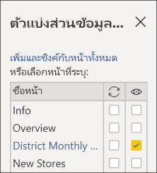
    
3. ในคอลัมน์**ซิงค์** เลือกหน้า**ร้านค้าใหม่**และหน้า**ภาพรวม**เพื่อซิงค์ตัวแบ่งส่วนข้อมูล**ยอดขายรายเดือนของเขต**ไปยังหน้าเหล่านั้น 
    
3. ในคอลัมน์**มองเห็นได้** เลือกหน้า**ร้านค้าใหม่**และหน้า**ภาพรวม** บานหน้าต่าง**ซิงค์ตัวแบ่งส่วนข้อมูล**ควรมีลักษณะเหมือนกับภาพด้านล่าง:

    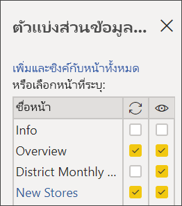

1. สังเกตผลของการซิงค์ตัวแบ่งส่วนข้อมูล และการทำให้มองเห็นได้บนหน้าอื่น ๆ บนหน้า**ยอดขายรายเดือนของเขต** ตัวแบ่งส่วนข้อมูล**ผู้จัดการเขต** ตอนนี้แสดงตัวเลือกเดียวกับตัวแบ่งส่วนข้อมูลบนหน้า**ภาพรวม** บนหน้า**ร้านค้าใหม่** ตัวเลือกในตัวแบ่งส่วนข้อมูล**ผู้จัดการเขต** มีผลต่อการเลือกที่มีในตัวแบ่งส่วนข้อมูล**ชื่อร้านค้า** 
    
    >[!TIP]
    >ถึงแม้ว่าตัวแบ่งส่วนข้อมูล จะปรากฏบนหน้าที่ซิงค์ด้วยขนาดและตำแหน่งที่เหมือนกับหน้าเดิมในตอนแรก คุณสามารถย้าย, ปรับขนาด และจัดรูปแบบตัวแบ่งส่วนข้อมูลที่ซิงค์บนหน้าต่าง ๆ ได้อิสระจากกัน 

>[!NOTE]
>ถ้าคุณซิงค์ตัวแบ่งส่วนข้อมูลไปยังหน้า แต่ไม่ทำให้มองเห็นได้บนหน้านั้น การเลือกตัวแบ่งส่วนข้อมูลบนหน้าอื่นยังคงกรองข้อมูลในหน้า
 
## จัดรูปแบบตัวแบ่งส่วนข้อมูล
ตัวเลือกการจัดรูปแบบที่มีจะแตกต่างตามชนิดของตัวแบ่งส่วนข้อมูล โดยใช้การจัดแนว**แนวนอน** เค้าโครง**ตอบสนอง** และการกำหนดสี**รายการ** คุณสามารถสร้างปุ่ม หรือไทล์แทนที่จะเป็นรายการมาตรฐาน และทำให้รายการในตัวแบ่งส่วนข้อมูล ปรับขนาดให้พอดีกับขนาดหน้าจอและเค้าโครงต่าง ๆ  

1. เมื่อเลือกตัวแบ่งส่วนข้อมูล**ตัวจัดการเขต**ในหน้าใด ๆ ในบานหน้าต่าง**การจัดรูปแบบการแสดงข้อมูล** ให้เลือกไอคอน**รูปแบบ** เพื่อแสดงตัวควบคุมการจัดรูปแบบ 
    
    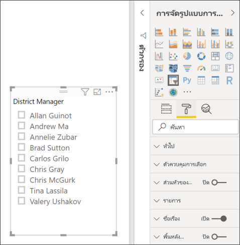
    
2. เลือกที่ลูกศรดรอปดาวน์ที่อยู่ถัดจากแต่ละประเภท เพื่อแสดงและแก้ไขตัวเลือก 

### ตัวเลือกทั่วไป
1. เลือกสีแดงภายใต้**สีเส้นขอบ** และเปลี่ยน**ความหนาของเส้นขอบ**เป็น "2" นี่เป็นการตั้งค่าสีและความหนาของ เส้นขอบของส่วนหัวและรายการ หรือการขีดเส้นใต้ เมื่อเปิดใช้งาน 
2. ภายใต้**การจัดแนว** **แนวตั้ง**เป็นค่าเริ่มต้น เลือก**แนวนอน**เพื่อสร้างตัวแบ่งส่วนข้อมูล ที่มีไทล์หรือปุ่มจัดเรียงอยู่ในแนวนอน และลูกศรเลื่อนเพื่อเข้าถึงรายการที่ไม่พอดีกับตัวแบ่งส่วนข้อมูล
    
    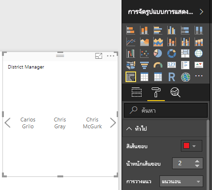
    
3. เปิดใช้งานเค้าโครง**ตอบสนอง** เพื่อเปลี่ยนขนาดและการจัดเรียงของรายการในตัวแบ่งส่วนข้อมูล ตามขนาดของหน้าจอและตัวแบ่งส่วนข้อมูล สำหรับตัวแบ่งส่วนข้อมูลรายการ เค้าโครงแบบตอบสนองมีเฉพาะการจัดแนวในแนวนอนเท่านั้น และป้องกันไม่ให้รายการถูกตัดออกบนหน้าจอขนาดเล็ก สำหรับตัวแบ่งส่วนข้อมูลแถบเลื่อนช่วง การจัดรูปแบบแบบตอบสนองจะเปลี่ยนสไตล์ของแถบเลื่อน และให้การปรับขนาดที่ยืดหยุ่นมากขึ้น ตัวแบ่งส่วนข้อมูลทั้งสองชนิด จะกลายเป็นไอคอนตัวกรอง เมื่อมีขนาดเล็กมาก 
    
    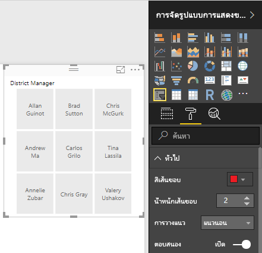
    
    >[!NOTE]
    >การเปลี่ยนแปลงเค้าโครงแบบตอบสนอง อาจเปลี่ยนการจัดรูปแบบหัวเรื่องหรือรายการที่คุณตั้งค่าไว้ได้ 
    
4. ตั้งค่าตำแหน่งและขนาดของตัวแบ่งส่วนข้อมูลที่ละเอียดระดับตัวเลขภายใต้ **ตำแหน่ง X**, **ตำแหน่ง Y**, **ความกว้าง**และ**ความสูง** หรือย้ายและปรับขนาดตัวแบ่งส่วนข้อมูลบนพื้นที่ทำงานโดยตรง ทดลองกับขนาดและการจัดเรียงรายการแบบต่าง ๆ และสังเกตการเปลี่ยนแปลงที่สอดคล้องกัน ของการจัดรูปแบบแบบตอบสนอง  

    

ดู[สร้างตัวแบ่งส่วนข้อมูลแบบตอบสนองที่คุณสามารถปรับขนาดใน Power BI](../power-bi-slicer-filter-responsive.md) สำหรับข้อมูลเพิ่มเติมเกี่ยวกับการจัดแนวแนวนอนและเค้าโครงแบบตอบสนอง

### ตัวเลือกตัวควบคุมการเลือก (ตัวแบ่งส่วนข้อมูลรายการเท่านั้น)
1. ตามค่าเริ่มต้น ตัวเลือก**แสดงการเลือกทั้งหมด**คือ**ปิด** เปลี่ยนไปเป็น**เปิด** เพื่อเพิ่มรายการ**เลือกทั้งหมด**ไปยังตัวแบ่งส่วนข้อมูล ที่เลือกหรือยกเลิกการเลือกทุกรายการเมื่อสลับค่า เมื่อเลือกรายการทั้งหมด การคลิกหรือแตะที่รายการในรายการหนึ่งจะเป็นการยกเลิกเฉพาะรายการนั้น ทำให้เป็นตัวกรองชนิด "ทุกอย่างยกเว้น" 
    
    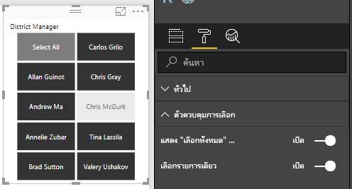
    
2. ตามค่าเริ่มต้น **เลือกรายการเดียว**จะ**เปิด** การคลิกหรือแตะที่แต่ละรายการ จะเป็นการเลือกรายการนั้น ถ้าต้องการเลือกหลายรายการ ให้กดแป้น **Ctrl** ค้างไว้ขณะที่คลิกหรือแตะ เปลี่ยนค่า**เลือกรายการเดียว**ให้เป็น**ปิด** ให้สามารถเลือกหลายรายการโดยไม่ต้องกดแป้น **Ctrl** ค้างไว้ คลิกหรือแตะที่แต่ละรายการอีกครั้งเพื่อยกเลิกการเลือก 

### ตัวเลือกสำหรับชื่อเรื่อง
ตามค่าเริ่มต้น **ชื่อเรื่อง**จะ**เปิด** ซึ่งจะแสดงชื่อเขตข้อมูลที่ด้านบนของตัวแบ่งส่วนข้อมูล 
1. จัดรูปแบบข้อความชื่อเรื่องเพื่อทำให้**สีแบบอักษร**เป็นสีแดง **ขนาดของข้อความ** 14 pt จัดแนว**กึ่งกลาง** **ตระกูลแบบอักษร** Arial Black 

### ตัวเลือกรายการ (ตัวแบ่งส่วนข้อมูลรายการเท่านั้น)
1. จัดรูปแบบข้อความรายการและพื้นหลังเพื่อทำให้**สีแบบอักษร**เป็นสีดำ **พื้นหลัง**เป็นสีแดงอ่อน **ขนาดของข้อความ** 10 pt และ**ตระกูลแบบอักษร** Arial 
2. ภายใต้**เค้าร่าง** เลือก**กรอบ** เพื่อวาดเส้นขอบรอบ ๆ แต่ละรายการ ด้วยขนาดและสีที่คุณตั้งค่าภายใต้ตัวเลือก**ทั่วไป** 
    
    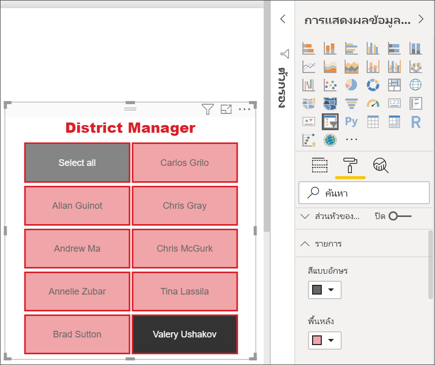
    
    >[!TIP]
    >- ด้วย **จัดแนว > แนวนอน** รายการที่ไม่ได้เลือก จะแสดงข้อความและสีพื้นหลังตามที่กำหนดไว้ ในขณะที่รายการที่เลือกใช้ค่าเริ่มต้นของระบบ ซึ่งมักจะเป็นพื้นหลังสีดำกับข้อความสีขาว
    >- ด้วย **จัดแนว > แนวตั้ง** รายการจะแสดงสีที่ตั้งค่าเสมอ และกล่องสำหรับเลือกจะเป็นสีดำเมื่อถูกเลือก 

### ตัวเลือก ป้อนข้อมูลวันที่/ตัวเลข และแถบเลื่อน (ตัวแบ่งส่วนข้อมูลแบบแถบเลื่อนช่วงเท่านั้น)
- ตัวเลือกสำหรับการป้อนค่า วันที่/ตัวเลข จะเหมือนกับในตัวเลือก**รายการ**สำหรับตัวแบ่งส่วนข้อมูลรายการ แต่ไม่มี**เค้าร่าง**หรือขีดเส้นใต้
- ตัวเลือกแถบเลื่อน อนุญาตให้คุณสามารถตั้งค่าสีของแถบเลื่อนช่วง หรือเลื่อนแถบเลื่อนให้เป็น**ปิด** เพื่อให้ป้อนข้อมูลตัวเลขได้อย่างเดียว

### ตัวเลือกการจัดรูปแบบอื่น ๆ
ตัวเลือกจัดรูปแบบอื่น ๆ จะปิดใช้งานตามค่าเริ่มต้น เมื่อเปลี่ยนค่าให้เป็น**เปิด**: 
- **พื้นหลัง:** เพิ่มสีพื้นหลังโดยรวมของตัวแบ่งส่วนข้อมูล และตั้งค่าความโปร่งใส
- **ล็อกอัตราส่วน:** รักษารูปร่างของตัวแบ่งส่วนข้อมูลถ้าถูกปรับขนาด
- **ขอบ:** เพิ่มขอบหนา 1 พิกเซล รอบ ๆ ตัวแบ่งส่วนข้อมูล และตั้งค่าสี (ขอบตัวแบ่งส่วนข้อมูลนี้แยกต่างหาก และไม่มีผลจากการตั้งค่า เค้าร่างทั่วไป) 

## ขั้นตอนถัดไป
[ชนิดการแสดงภาพใน Power BI](power-bi-visualization-types-for-reports-and-q-and-a.md)

[ตารางใน Power BI](power-bi-visualization-tables.md)

