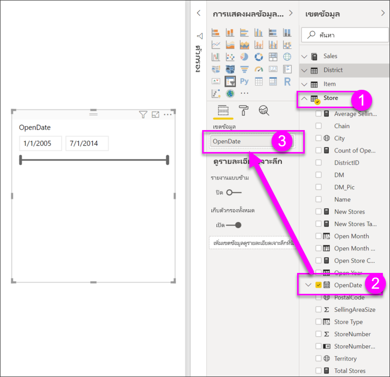

# ตัวแบ่งส่วนข้อมูลใน Power BI

[!INCLUDE [power-bi-visuals-desktop-banner](../includes/power-bi-visuals-desktop-banner.md)]

สมมติว่าคุณต้องการให้ผู้อ่านรายงานของคุณสามารถดูภาพรวมของเมทริกซ์การขาย แต่ยังเน้นประสิทธิภาพการทำงานของผู้จัดการเขตแต่ละคน และกรอบเวลาที่แตกต่างกัน คุณสามารถสร้างหลายรายงานแยกต่างหากกัน หรือแผนภูมิเปรียบเทียบ หรือคุณสามารถใช้ตัวแบ่งส่วนข้อมูล ตัวแบ่งส่วนข้อมูลเป็นอีกวิธีหนึ่งของการกรอง ที่จำกัดส่วนของชุดข้อมูลที่จะแสดงในการแสดงภาพอื่น ๆ ในรายงานให้แคบลง 

บทช่วยสอนนี้ใช้[ตัวอย่างการวิเคราะห์ด้านการขายปลีก](../sample-retail-analysis.md)ที่มีให้ฟรี เพื่อแนะนำให้คุณสร้าง, จัดรูปแบบ และการใช้ตัวแบ่งส่วนข้อมูล โดยใช้รายการและช่วงวันที่ ขอให้สนุกกับการค้นพบวิธีต่าง ๆ ในการจัดรูปแบบ และใช้ตัวแบ่งส่วนข้อมูล 

## เมื่อไรที่ควรใช้ตัวแบ่งส่วนข้อมูล
ตัวแบ่งส่วนข้อมูล คือตัวเลือกที่ดีที่สุดเมื่อคุณต้องการ:

* แสดงตัวกรองที่ใช้งานบ่อยหรือสำคัญบนพื้นที่รายงานเพื่อให้ง่ายต่อการเข้าถึง
* ทำให้การดูสถานะตัวกรองปัจจุบันได้ง่ายขึ้น โดยไม่ต้องเปิดรายการดรอปดาวน์ 
* กรองตามคอลัมน์ที่ไม่จำเป็นและซ่อนอยู่ในตารางข้อมูล
* สร้างรายงานที่เฉพาะเจาะจงมากขึ้น โดยการใส่ตัวแบ่งส่วนข้อมูลข้างกับวิชวลที่สำคัญ

ตัวแบ่งส่วนข้อมูล Power BI ไม่สนับสนุน:

- เขตข้อมูลป้อนเข้า
- ดูรายละเอียดแนวลึก

## สร้างตัวแบ่งส่วนข้อมูล

**สร้างตัวแบ่งส่วนข้อมูลใหม่เพื่อกรองข้อมูลตามผู้จัดการเขต**

1. ดาวน์โหลด[ไฟล์ PBIX ตัวอย่างการวิเคราะห์การขายปลีก](https://download.microsoft.com/download/9/6/D/96DDC2FF-2568-491D-AAFA-AFDD6F763AE3/Retail%20Analysis%20Sample%20PBIX.pbix)

1. จากแถบเมนู Power BI Desktop เลือก **ไฟล์** > **เปิด**
   
1. เรียกดูไฟล์**ตัวอย่างการวิเคราะห์ด้านการขายปลีก PBIX.pbix** จากนั้นเลือก**เปิด**

1. ในบานหน้าต่างด้านซ้าย เลือกไอคอน **รายงาน**  เพื่อเปิดไฟล์ในมุมมองรายงาน

1. บนหน้า **ภาพรวม** โดยไม่ได้เลือกอะไรบนพื้นที่ทำงาน เลือกไอคอน**ตัวแบ่งส่วนข้อมูล**  ในบานหน้าต่าง**การแสดงภาพ** เพื่อสร้างตัวแบ่งส่วนข้อมูลใหม่ 

1. เมื่อเลือกตัวแบ่งส่วนข้อมูลใหม่จากบานหน้าต่าง**เขตข้อมูล** ให้เลือก**เขต** > **DM** เพื่อรวบรวมข้อมูลตัวแบ่งส่วนข้อมูล 

    ในตอนนี้ ตัวแบ่งส่วนข้อมูลใหม่จะถูกเติมข้อมูลด้วยรายชื่อผู้จัดการเขตและกล่องการเลือกของพวกเขา
    
    
    
1. ปรับขนาด และลากองค์ประกอบต่าง ๆ บนพื้นที่ทำงาน เพื่อให้มีพื้นที่สำหรับตัวแบ่งส่วนข้อมูลนี้ โปรดทราบว่าถ้าคุณปรับขนาดของตัวแบ่งส่วนข้อมูลให้เล็กเกินไป หน่วยข้อมูลของตัวแบ่งส่วนข้อมูลจะถูกตัดออก 

1. เลือกชื่อบนตัวแบ่งส่วนข้อมูล และดูผลกระทบที่มีต่อการแสดงภาพอื่น ๆ บนหน้า เลือกชื่ออีกครั้งเพื่อยกเลิกการเลือก หรือกดแป้น **Ctrl** ค้างไว้เพื่อเลือกมากกว่าหนึ่งชื่อ การเลือกชื่อทั้งหมดมีผลเหมือนกับการไม่เลือกเลย 

1. อีกวิธีหนึ่งคือเลือก**รูปแบบ** (ไอคอนลูกกลิ้งทาสี) ในบานหน้าต่าง**การแสดงภาพ** เพื่อจัดรูปแบบตัวแบ่งส่วนข้อมูลของคุณ 

   มีทางเลือกมากเกินไปในการอธิบายสิ่งทั้งหมดที่นี่ ให้ลองทดสอบและสร้างตัวแบ่งส่วนข้อมูลที่เหมาะกับคุณ ในภาพต่อไปนี้ ตัวแบ่งส่วนข้อมูลแรกจะใช้การวางแนวตามแนวนอนและใช้ภาพพื้นหลังแบบสีสำหรับหน่วยข้อมูลต่าง ๆ ตัวแบ่งส่วนข้อมูลที่สองมีการวางแนวตามแนวตั้งและข้อความสีสำหรับการดูมาตรฐานมากขึ้น

   

   >[!TIP]
   >หน่วยข้อมูลรายการตัวแบ่งส่วนข้อมูลจะเรียงลำดับจากน้อยไปหามากตามค่าเริ่มต้น ในการกลับลำดับการจัดเรียงให้เป็นจากมากไปหาน้อย ให้เลือกจุดไข่ปลา (**...**) ในมุมขวาบนของตัวแบ่งส่วนข้อมูล แล้วเลือก**เรียงลำดับจากมากไปหาน้อย**

**สร้างตัวแบ่งส่วนข้อมูลใหม่เพื่อกรองข้อมูลตามช่วงวันที่**

1. เลือกหน้า**ภาพรวม**ของรายงาน ไม่มีสิ่งใดที่เลือกบนพื้นที่รายงาน ในบานหน้าต่าง**เขตข้อมูล** เลือก **Store** >  **OpenDate**

    การดำเนินการนี้จะเป็นการเติมข้อมูลกล่อง**ค่า**ในบานหน้าต่าง**การแสดงภาพ** เพื่อสร้างการแสดงภาพใหม่

1. ด้วยการแสดงภาพที่เลือกไว้ในรายงาน เลือกไอคอน**ตัวแบ่งส่วนข้อมูล**ในบานหน้าต่าง **การแสดงภาพ**เพื่อเปลี่ยนการแสดงภาพใหม่ให้เป็นตัวแบ่งส่วนข้อมูล ตัวแบ่งส่วนข้อมูล **OpenDate** นี้เป็นตัวควบคุมแถบเลื่อนที่มีช่วงวันที่ที่เติม
    
    

1. ปรับขนาด และลากตัวแบ่งส่วนข้อมูลและองค์ประกอบอื่น ๆ บนพื้นที่ทำงาน เพื่อให้มีพื้นที่สำหรับตัวแบ่งส่วนข้อมูลนี้ แม้ว่าแถบเลื่อนจะปรับขนาดตามขนาดของตัวแบ่งส่วนข้อมูล แต่จะหายไปและวันที่ถูกตัดออก ถ้าคุณปรับขนาดของตัวแบ่งส่วนข้อมูลไว้เล็กเกินไป 

1. เลือกช่วงวันที่ที่แตกต่างกันด้วยแถบเลื่อน หรือเลือกเขตข้อมูลวันที่เพื่อใส่วันที่หรือป๊อปอัพปฏิทินสำหรับการเลือกที่แม่นยำมากขึ้น สังเกตผลที่มีต่อการแสดงภาพอื่น ๆ บนหน้า
    
    >[!NOTE]
    >ข้อมูลชนิดตัวเลข และวันที่/เวลา จะสร้างตัวแบ่งส่วนข้อมูลช่วงเป็นแถบเลื่อนตามค่าเริ่มต้น เริ่มตั้งแต่การอัปเดตเดือนกุมภาพันธ์ 2018 ของ Power BI แถบเลื่อนช่วงที่เป็นชนิดจำนวนเต็ม จะจัดชิดเป็นจำนวนเต็มแทนที่จะแสดงตำแหน่งทศนิยม 

1. เพื่อเปลี่ยนชนิดของตัวแบ่งส่วนข้อมูล ด้วยตัวแบ่งส่วนข้อมูลที่เลือกไว้ ให้วางเมาส์เหนือพื้นที่มุมบนขวาของตัวแบ่งส่วนข้อมูล เลือกไอคอนกะรัตที่ปรากฏขึ้น และเลือกหนึ่งในตัวเลือกต่าง ๆ เช่น **รายการ** หรือ **ก่อน** สังเกตว่ามีการเปลี่ยนแปลงตัวเลือกที่ปรากฏของตัวแบ่งส่วนข้อมูลและการเลือกอย่างไร 
 
    

สำหรับข้อมูลเพิ่มเติมเกี่ยวกับการสร้างตัวแบ่งส่วนข้อมูลช่วงวันที่และตัวเลข ดูวิดีโอต่อไปนี้ และดู[ใช้ตัวแบ่งส่วนข้อมูลช่วงตัวเลขใน Power BI Desktop](../desktop-slicer-numeric-range.md)
   > [!NOTE]
   > วิดีโอนี้ใช้ Power BI Desktop เวอร์ชันเก่า
   > 
   > 

<iframe width="560" height="315" src="https://www.youtube.com/embed/zIZPA0UrJyA" frameborder="0" allowfullscreen></iframe> 

## ตัวควบคุมว่าวิชวลในหน้าไหนได้รับผลจากตัวแบ่งส่วนข้อมูล
ตามค่าเริ่มต้น ตัวแบ่งส่วนข้อมูลบนหน้ารายงานมีผลต่อการแสดงภาพอื่น ๆ บนหน้านั้น รวมถึงผลระหว่างตัวแบ่งส่วนข้อมูลด้วยกัน เมื่อคุณเลือกค่าในรายการและแถบเลื่อนวันที่ที่คุณเพิ่งสร้าง สังเกตผลที่มีต่อการแสดงภาพอื่น ๆ ข้อมูลกรองแล้วคือ จุดตัดของค่าที่เลือกในตัวแบ่งส่วนข้อมูลทั้งสอง 

ใช้การโต้ตอบกับภาพเพื่อแยกการแสดงภาพบางหน้าออกจากผลของตัวแบ่งส่วนในหน้าอื่น บนหน้า**ภาพรวม** แผนภูมิ **ผลต่างของยอดขายรวม ตาม FiscalMonth และผู้จัดการเขต** จะแสดงข้อมูลเปรียบเทียบโดยรวมสำหรับผู้จัดการเขตตามเดือน ซึ่งคุณต้องการให้ปรากฏอยู่ตลอดเวลา ใช้การโต้ตอบกับภาพเพื่อให้สามารถเลือกตัวแบ่งส่วนข้อมูลจากการกรองแผนภูมินี้ได้ 

1. ไปที่หน้า**ภาพรวม**ของรายงาน จากนั้นเลือกตัวแบ่งส่วนข้อมูล **DM** ที่คุณสร้างไว้ก่อนหน้านี้

1. ในเมนู Power BI Desktop เลือกเมนู**รูปแบบ**ภายใต้**เครื่องมือการแสดงผล**แล้วเลือก**แก้ไขการโต้ตอบ**
   
   ตัวควบคุมตัวกรอง  แต่ละตัวที่มีตัวกรองและตัวเลือก**ไม่มี** จะปรากฏเ**หนือวิชว**ลทั้งหมดในหน้า ในตอนเริ่มต้น ตัวเลือก **ตัวกรอง** จะถูกเลือกไว้ล่วงหน้าในตัวควบคุมทั้งหมด
   
1. เลือกตัวเลือก**ไม่มี** ในตัวควบคุมตัวกรองที่อยู่เหนือแผนภูมิ**ผลต่างของยอดขายรวมตาม FiscalMonth และผู้จัดการเขต** เพื่อทำให้ตัวแบ่งส่วนข้อมูล **DM** หยุดกรองแผนภูมินั้น 

1. เลือกตัวแบ่งส่วนข้อมูล**OpenDate** เพื่อเลือกตัวเลือก**ไม่มี** ที่อยู่เหนือแผนภูมิ**ผลต่างของยอดขายรวมตาม FiscalMonth และผู้จัดการเขต** เพื่อทำให้ตัวแบ่งส่วนข้อมูลนี้หยุดกรองแผนภูมินั้น 

   ตอนนี้ เมื่อคุณเลือกชื่อและช่วงวันที่ในตัวแบ่งส่วนข้อมูล แผนภูมิ**ผลต่างของยอดขายรวมตาม FiscalMonth และผู้จัดการเขต** จะไม่เปลี่ยนแปลง

สำหรับข้อมูลเพิ่มเติมเกี่ยวกับการแก้ไขการโต้ตอบ โปรดดู [เปลี่ยนวิธีการโต้ตอบของวิชวลในรายงาน Power BI](../service-reports-visual-interactions.md)

## ซิงค์ และใช้ตัวแบ่งส่วนข้อมูลบนหน้าอื่น ๆ
เริ่มตั้งแต่การอัปเดต Power BI เดือนกุมภาพันธ์ 2018 คุณสามารถซิงค์ตัวแบ่งส่วนข้อมูล และใช้บนหน้าใด ๆ หรือทุกหน้าในรายงาน 

ในรายงานปัจจุบัน หน้า**ยอดขายรายเดือนของเขต**ยังมีตัวแบ่งส่วนข้อมูล**ผู้จัดการเขต** แต่ถ้าเรายังต้องการให้มีตัวแบ่งส่วนข้อมูลอยู่ในหน้า**ร้านค้าใหม่**ด้วยจะเป็นอย่างไร หน้า**ร้านค้าใหม่**มีตัวแบ่งส่วนข้อมูล แต่จะมีเฉพาะข้อมูล**ชื่อร้านค้า**เท่านั้น ด้วยบานหน้าต่าง**ซิงค์ตัวแบ่งส่วนข้อมูล** คุณสามารถซิงค์ตัวแบ่งส่วนข้อมูล**ผู้จัดการเขต** เพื่อให้การเลือกตัวแบ่งส่วนข้อมูลบนหน้าใด ๆ มีผลต่อแสดงภาพบนทั้งสามหน้าได้

1. ในเมนู**มุมมอง**ของ Power BI Desktop ให้เลือก**ซิงค์ตัวแบ่งส่วนข้อมูล**

    

    บานหน้าต่าง**ซิงค์ตัวแบ่งส่วนข้อมูล**จะปรากฏขึ้นระหว่างบานหน้าต่าง**ตัวกรอง**และบานหน้าต่าง**การแสดงภาพ**

    

1. ในหน้า**ยอดขายรายเดือนของเขต**ของรายงาน ให้เลือกตัวแบ่งส่วนข้อมูล**ผู้จัดการเขต** 

    เนื่องจากคุณได้สร้างตัวแบ่งส่วน **ผู้จัดการเขต** (**DM**) บนหน้า **ภาพรวม** บานหน้าต่าง **ซิงค์ตัวแบ่งส่วนข้อมูล**จะปรากฏขึ้นดังนี้:
    
    
    
1. ในคอลัมน์**ซิงค์**ของบานหน้าต่าง **ซิงค์ตัวแบ่งส่วนข้อมูล** ให้เลือกหน้า**ภาพรวม** **ยอดขายรายเดือนของเขต** และ**ร้านค้าใหม่** 

    การเลือกนี้จะทำให้ตัวแบ่งส่วนข้อมูล**ยอดขายรายเดือนของเขต** ซิงค์ในสามหน้าเหล่านี้ 
    
1. ในคอลัมน์**ที่มองเห็นได้** ของบานหน้าต่าง **ซิงค์ตัวแบ่งส่วนข้อมูล** ให้เลือกหน้า **ร้านค้าใหม่** 

    การเลือกนี้จะทำให้สามารถมองเห็นตัวแบ่งส่วนข้อมูล**ยอดขายรายเดือนของเขต** ได้ในสามหน้าเหล่านี้ได้ ตอนนี้บานหน้าต่าง **ซิงค์ตัวแบ่งส่วนข้อมูล** ปรากฏขึ้นดังนี้:

    

1. สังเกตผลของการซิงค์ตัวแบ่งส่วนข้อมูล และการทำให้มองเห็นได้บนหน้าอื่น ๆ บนหน้า**ยอดขายรายเดือนของเขต** โปรดทราบว่าตัวแบ่งส่วนข้อมูล**ผู้จัดการเขต** ตอนนี้แสดงตัวเลือกเดียวกับตัวแบ่งส่วนข้อมูลบนหน้า**ภาพรวม** บนหน้า**ร้านค้าใหม่** ตอนนี้ตัวแบ่งส่วนข้อมูล**ผู้จัดการเขต** จะปรากฏขึ้นและการเลือกจะส่งผลกระทบต่อการเลือกที่สามารถมองเห็นได้ในตัวแบ่งส่วนข้อมูล **ชื่อร้านค้า** 
    
    >[!TIP]
    >ถึงแม้ว่าตัวแบ่งส่วนข้อมูล จะปรากฏบนหน้าที่ซิงค์ด้วยขนาดและตำแหน่งที่เหมือนกับหน้าเดิมในตอนแรก คุณสามารถย้าย, ปรับขนาด และจัดรูปแบบตัวแบ่งส่วนข้อมูลที่ซิงค์บนหน้าต่าง ๆ ได้อิสระจากกัน 

    >[!NOTE]
    >ถ้าคุณซิงค์ตัวแบ่งส่วนข้อมูลไปยังหน้า แต่ไม่ทำให้มองเห็นได้บนหน้านั้น การเลือกตัวแบ่งส่วนข้อมูลบนหน้าอื่นยังคงกรองข้อมูลในหน้า
 
## จัดรูปแบบตัวแบ่งส่วนข้อมูล
ตัวเลือกการจัดรูปแบบที่แตกต่างกันจะพร้อมใช้งาน โดยขึ้นอยู่กับชนิดตัวแบ่งส่วนข้อมูล โดยใช้การจัดแนว**แนวนอน** เค้าโครง**ตอบสนอง** และการกำหนดสี**รายการ** คุณสามารถสร้างปุ่ม หรือไทล์แทนที่จะเป็นรายการมาตรฐาน และทำให้รายการในตัวแบ่งส่วนข้อมูล ปรับขนาดให้พอดีกับขนาดหน้าจอและเค้าโครงต่าง ๆ  

1. เมื่อเลือกตัวแบ่งส่วนข้อมูล**ผู้จัดการเขต**ในหน้าใด ๆ ในบานหน้าต่าง**การแสดงภาพ** ให้เลือกไอคอน**รูปแบบ** เพื่อแสดงตัวควบคุมการจัดรูปแบบ 
    
    
    
1. เลือกที่ลูกศรดรอปดาวน์ที่อยู่ถัดจากแต่ละประเภท เพื่อแสดงและแก้ไขตัวเลือก 

### ตัวเลือกทั่วไป
1. ภายใต้**รูปแบบ** เลือก**ทั่วไป** เลือกสีแดงภายใต้ **สีแบบเส้นขอบ** และจากนั้นเปลี่ยน**ความหนาของเส้นขอบ**เป็น*2* 

    การตั้งค่านี้จะเปลี่ยนสีและความหนาของส่วนหัว รวมถึงเส้นกรอบและการขีดเส้นใต้ของหน่วยข้อมูล

1. ภายใต้**การจัดแนว** เลือก**แนวตั้ง**เป็นค่าเริ่มต้น เลือก**แนวนอน**เพื่อสร้างตัวแบ่งส่วนข้อมูลที่มีไทล์หรือปุ่มจัดเรียงอยู่ในแนวนอน และลูกศรเลื่อนเพื่อเข้าถึงหน่วยข้อมูลที่ไม่พอดีกับตัวแบ่งส่วนข้อมูล
    
    
    
1. **เปิดใช้งาน**เค้าโครง**แบบตอบสนอง**เพื่อเปลี่ยนขนาดและการจัดเรียงของหน่วยข้อมูลในตัวแบ่งส่วนข้อมูลตามขนาดของหน้าจอและตัวแบ่งส่วนข้อมูล 

    สำหรับตัวแบ่งส่วนข้อมูลรายการ เค้าโครงแบบตอบสนองป้องกันไม่ให้หน่วยข้อมูลถูกตัดออกบนหน้าจอขนาดเล็ก พร้อมใช้งานเฉพาะในแนวนอนเท่านั้น สำหรับตัวแบ่งส่วนข้อมูลแถบเลื่อนช่วง การจัดรูปแบบแบบตอบสนองจะเปลี่ยนสไตล์ของแถบเลื่อน และให้การปรับขนาดที่ยืดหยุ่นมากขึ้น ตัวแบ่งส่วนข้อมูลทั้งสองชนิดจะกลายเป็นไอคอนตัวกรองเมื่อมีขนาดเล็ก
    
    
    
    >[!NOTE]
    >การเปลี่ยนแปลงเค้าโครงแบบตอบสนองสามารถเปลี่ยนการจัดรูปแบบหัวเรื่องหรือหน่วยข้อมูลที่คุณตั้งค่าไว้ได้ 
    
1. ภายใต้ **ตำแหน่ง X**, **ตำแหน่ง Y**, **ความกว้าง**และ**ความสูง** หรือย้ายและปรับขนาดตัวแบ่งส่วนข้อมูลบนพื้นที่ทำงานโดยตรง 

    ทดลองกับขนาดและการจัดเรียงรายการแบบต่าง ๆ และสังเกตการเปลี่ยนแปลงที่สอดคล้องกัน ของการจัดรูปแบบแบบตอบสนอง ตัวเลือกเหล่านี้จะพร้อมใช้งานเฉพาะเมื่อคุณเลือกการวางแนวนอนเท่านั้น 

    

สำหรับข้อมูลเพิ่มเติมเกี่ยวกับแนวนอนและเค้าโครงแบบตอบสนอง ดู [สร้างตัวแบ่งส่วนข้อมูลแบบตอบสนองที่คุณสามารถปรับขนาดใน Power BI ได้ ](../power-bi-slicer-filter-responsive.md)

### ตัวเลือกตัวควบคุมการเลือก (ตัวแบ่งส่วนข้อมูลรายการเท่านั้น)
1. ภายใต้ **ตัวควบคุมการเลือก** ให้เปลี่ยน**แสดงตัวเลือก "เลือกทั้งหมด"** เป็น **เปิด** เพื่อเพิ่มหน่วยข้อมูล **เลือกทั้งหมด**ไปยังตัวแบ่งส่วนข้อมูล 

    **แสดงตัวเลือก "เลือกทั้งหมด"** เป็น **ปิด** ตามค่าเริ่มต้น เมื่อเปิดใช้งานแล้ว ตัวเลือกนี้เมื่อสลับ เลือกหรือยกเลิกเฉพาะหน่วยข้อมูลทั้งหมด หากคุณเลือกทุกหน่วยข้อมูล การเลือกหน่วยข้อมูลจะยกเลิกการเลือกหน่วยข้อมูลนั้น ซึ่งจะเป็นตัวกรองแบบ*is-not*
    
    
    
1. เปลี่ยน**เลือกรายการเดียว**ให้เป็น**ปิด** เพื่อให้คุณสามารถเลือกหลายรายการโดยไม่ต้องกดปุ่ม **Ctrl** ค้างไว้ 

    ตามค่าเริ่มต้น **เลือกรายการเดียว**จะ**เปิด** การเลือกหน่วยข้อมูลจะเป็นการเลือกหน่วยข้อมูลนั้น และการกดปุ่ม **Ctrl**ค้างไว้จะเป็นการเลือกหลายรายการ การเลือกหน่วยข้อมูลอีกครั้งจะยกเลิกการเลือกดังกล่าว

### ตัวเลือกสำหรับชื่อเรื่อง
**ชื่อ**เป็น**เปิด**ตามค่าเริ่มต้น การเลือกนี้แสดงชื่อเขตข้อมูลที่ด้านบนของตัวแบ่งส่วนข้อมูล 
- สำหรับบทช่วยสอนนี้ ให้จัดรูปแบบข้อความชื่อเรื่องดังนี้: 
   - **สีแบบอักษร**: สีแดง
   - **ขนาดของข้อความ**: **14 pt**
   - **การจัดแนว**: **กึ่งกลาง**
   - **ชุดแบบอักษร**: **Arial Black**

### ตัวเลือกหน่วยข้อมูล (ตัวแบ่งส่วนข้อมูลรายการเท่านั้น)
1. สำหรับบทช่วยสอนนี้ ให้จัดรูปแบบตัวเลือก**หน่วยข้อมูล**ดังนี้:
    - **สีแบบอักษร**: สีดำ
    - **พื้นหลัง**: สีแดงอ่อน
    - **ขนาดของข้อความ**: **10 pt**
    - **ชุดแบบอักษร**: **Arial**
 
1. ภายใต้**เส้นกรอบ** เลือก**กรอบ** เพื่อวาดเส้นขอบรอบ ๆ แต่ละหน่วยข้อมูลด้วยขนาดและสีที่คุณตั้งค่าภายใต้ตัวเลือก**ทั่วไป** 
    
    
    
    >[!TIP]
    >- ด้วย **ทั่วไป** > **การจัดแนว** > **แนวนอน**ที่เลือก หน่วยข้อมูลที่ไม่ได้เลือกจะแสดงข้อความและสีพื้นหลังตามที่กำหนดไว้ ในขณะที่หน่วยข้อมูลที่เลือกใช้ค่าเริ่มต้นของระบบ ซึ่งมักจะเป็นพื้นหลังสีดำกับข้อความสีขาว
    >- ด้วย **ทั่วไป** > **การจัดแนว > แนวตั้ง**ที่เลือก หน่วยข้อมูลจะแสดงสีที่เลือกและกล่องกาเครื่องหมายให้เป็นสีดำเสมอเมื่อเลือก 

### ตัวเลือกป้อนข้อมูลวันที่/ตัวเลขและแถบเลื่อน (เฉพาะตัวแบ่งส่วนข้อมูลแบบแถบเลื่อนช่วงเท่านั้น)
- สำหรับตัวแบ่งส่วนข้อมูลรายการ ตัวเลือกป้อนวันที่/ตัวเลข จะเหมือนกับในตัวเลือก**หน่วยข้อมูล** ยกเว้นไม่มีตัวเลือกเส้นกรอบหรือขีดเส้นใต้
- ตัวเลือก**แถบเลื่อน**อนุญาตให้คุณสามารถตั้งค่าสีของแถบเลื่อนช่วง หรือเลื่อนแถบเลื่อนให้เป็น**ปิด** เพื่อให้ป้อนข้อมูลตัวเลขได้อย่างเดียว

### ตัวเลือกการจัดรูปแบบอื่น ๆ
ตัวเลือกจัดรูปแบบอื่น ๆ เป็น**ปิด**ตามค่าเริ่มต้น **เปิด**ตัวเลือกเหล่านี้เพื่อควบคุมหน่วยข้อมูล: 
- **พื้นหลัง**: เพิ่มสีพื้นหลังไปยังตัวแบ่งส่วนข้อมูล และตั้งค่าความโปร่งใส
- **ล็อกอัตราส่วน:** รักษารูปร่างของตัวแบ่งส่วนข้อมูลถ้ามีการปรับขนาด
- **ขอบ:** เพิ่มขอบรอบ ๆ ตัวแบ่งส่วนข้อมูล และตั้งค่าสีขอบ ขอบตัวแบ่งส่วนข้อมูลนี้แยกต่างหาก และไม่มีผลจากการตั้งค่า**ทั่วไป** 

## ขั้นตอนถัดไป
สำหรับข้อมูลเพิ่มเติม ให้ดูบทความต่อไปนี้:

- [ชนิดการแสดงภาพใน Power BI](power-bi-visualization-types-for-reports-and-q-and-a.md)

- [ตารางใน Power BI](power-bi-visualization-tables.md)

