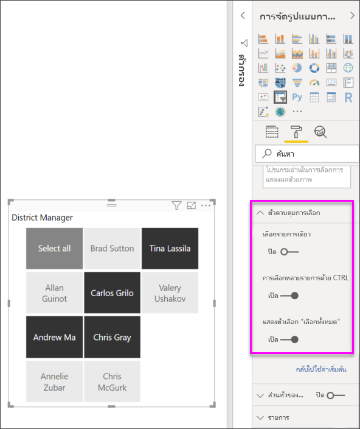

# ตัวแบ่งส่วนข้อมูลใน Power BI

[!INCLUDE [applies-to](../includes/applies-to.md)] [!INCLUDE [yes-desktop](../includes/yes-desktop.md)] [!INCLUDE [yes-service](../includes/yes-service.md)]

สมมติว่าคุณต้องการให้ผู้อ่านรายงานของคุณสามารถดูภาพรวมของเมทริกซ์การขาย แต่ยังเน้นประสิทธิภาพการทำงานของผู้จัดการเขตแต่ละคน และกรอบเวลาที่แตกต่างกัน คุณสามารถสร้างหลายรายงานแยกต่างหากกัน หรือแผนภูมิเปรียบเทียบ คุณสามารถเพิ่มตัวกรองในบานหน้าต่างตัวกรอง หรือคุณสามารถใช้ *ตัวแบ่งส่วนข้อมูล* ได้ ตัวแบ่งส่วนข้อมูลเป็นอีกวิธีหนึ่งของการกรอง ซึ่งจะจำกัดส่วนของชุดข้อมูลที่แสดงในการจัดรูปแบบรายงานอื่นๆ 

บทความนี้จะแสดงข้อมูลการสร้างและจัดรูปแบบตัวแบ่งส่วนข้อมูลพื้นฐาน โดยใช้ [ตัวอย่างการวิเคราะห์การค้าปลีก](../create-reports/sample-retail-analysis.md) ฟรี นอกจากนี้ยังครอบคลุมถึงการควบคุมวิชวลที่ได้รับผลกระทบจากตัวแบ่งส่วนข้อมูล การซิงค์กับแบ่งส่วนข้อมูลในหน้าอื่นๆ และการกรองและการจัดรูปแบบแบ่งส่วนข้อมูล

บทความอื่นๆ เหล่านี้อธิบายวิธีการสร้างประเภทเฉพาะของตัวแบ่งส่วนข้อมูล:

- [ตัวแบ่งส่วนข้อมูลช่วงตัวเลข](../create-reports/desktop-slicer-numeric-range.md)
- [ตัวแบ่งส่วนข้อมูลวันที่สัมพัทธ์](desktop-slicer-filter-date-range.md)
- [ตัวแบ่งส่วนเวลาแบบสัมพัทธ์](../create-reports/slicer-filter-relative-time.md)
- [ตัวแบ่งส่วนข้อมูลที่ปรับขนาด](../create-reports/power-bi-slicer-filter-responsive.md)และตอบสนองได้
- [ตัวแบ่งส่วนข้อมูลลำดับชั้น](../create-reports/power-bi-slicer-hierarchy-multiple-fields.md) ที่มีหลายเขตข้อมูล

## เมื่อไรที่ควรใช้ตัวแบ่งส่วนข้อมูล
ตัวแบ่งส่วนข้อมูล คือตัวเลือกที่ดีที่สุดเมื่อคุณต้องการ:

* แสดงตัวกรองที่ใช้งานบ่อยหรือสำคัญบนพื้นที่รายงานเพื่อให้ง่ายต่อการเข้าถึง
* ทำให้การดูสถานะตัวกรองปัจจุบันได้ง่ายขึ้น โดยไม่ต้องเปิดรายการดรอปดาวน์ 
* กรองตามคอลัมน์ที่ไม่จำเป็นและซ่อนอยู่ในตารางข้อมูล
* สร้างรายงานที่มุ่งเน้นมากขึ้นโดยใส่ตัวแบ่งส่วนข้อมูลถัดจากวิชวลที่สำคัญ

ตัวแบ่งส่วนข้อมูล Power BI ไม่สนับสนุน:

- เขตข้อมูลป้อนเข้า
- ดูรายละเอียดแนวลึก

## สร้างตัวแบ่งส่วนข้อมูล

ตัวแบ่งส่วนข้อมูลนี้จะกรองข้อมูล โดยแยกตามผู้จัดการเขต หากคุณต้องการปฏิบัติตามขั้นตอนนี้ ให้ดาวน์โหลด [ไฟล์ PBIX ตัวอย่างการวิเคราะห์การค้าปลีก](https://download.microsoft.com/download/9/6/D/96DDC2FF-2568-491D-AAFA-AFDD6F763AE3/Retail%20Analysis%20Sample%20PBIX.pbix)

1. เปิด Power BI Desktop และเลือก **ไฟล์** > **เปิด** จากแถบเมนู
   
1. เรียกดูไฟล์ **Retail Analysis sample PBIX.pbix** จากนั้นเลือก **เปิด**

1. ในบานหน้าต่างด้านซ้าย เลือกไอคอน**รายงาน**  วิธีเปิดไฟล์ในมุมมองรายงาน

1. ในหน้า**ภาพรวม**โดยไม่ได้เลือกอะไรบนพื้นที่ทำงาน เลือกไอคอน**ตัวแบ่งส่วนข้อมูล**  ในบานหน้าต่าง**การแสดงภาพ** เพื่อสร้างตัวแบ่งส่วนข้อมูลใหม่ 

1. เมื่อเลือกตัวแบ่งส่วนข้อมูลใหม่จากบานหน้าต่าง**เขตข้อมูล** ให้เลือก**เขต** > **DM** เพื่อรวบรวมข้อมูลตัวแบ่งส่วนข้อมูล 

    ในตอนนี้ ตัวแบ่งส่วนข้อมูลใหม่จะถูกเติมข้อมูลด้วยรายชื่อผู้จัดการเขตและกล่องการเลือกของพวกเขา
    
    
    
1. ปรับขนาด และลากองค์ประกอบต่าง ๆ บนพื้นที่ทำงาน เพื่อให้มีพื้นที่สำหรับตัวแบ่งส่วนข้อมูลนี้ โปรดทราบว่าถ้าคุณปรับขนาดของตัวแบ่งส่วนข้อมูลให้เล็กเกินไป หน่วยข้อมูลของตัวแบ่งส่วนข้อมูลจะถูกตัดออก 

1. เลือกชื่อบนตัวแบ่งส่วนข้อมูล และดูผลกระทบที่มีต่อการแสดงภาพอื่น ๆ บนหน้า เลือกชื่ออีกครั้งเพื่อยกเลิกการเลือก หรือกดแป้น **Ctrl** ค้างไว้เพื่อเลือกมากกว่าหนึ่งชื่อ การเลือกชื่อทั้งหมดมีผลเหมือนกับการไม่เลือกเลย 

1. อีกวิธีหนึ่งคือเลือก**รูปแบบ** (ไอคอนลูกกลิ้งทาสี) ในบานหน้าต่าง**การแสดงภาพ** เพื่อจัดรูปแบบตัวแบ่งส่วนข้อมูลของคุณ 

   มีทางเลือกมากเกินไปในการอธิบายสิ่งทั้งหมดที่นี่ ให้ลองทดสอบและสร้างตัวแบ่งส่วนข้อมูลที่เหมาะกับคุณ ในภาพต่อไปนี้ ตัวแบ่งส่วนข้อมูลแรกจะใช้การวางแนวตามแนวนอนและใช้ภาพพื้นหลังแบบสีสำหรับหน่วยข้อมูลต่าง ๆ ตัวแบ่งส่วนข้อมูลที่สองมีการวางแนวตามแนวตั้งและข้อความสีสำหรับการดูมาตรฐานมากขึ้น

   

   >[!TIP]
   >หน่วยข้อมูลรายการตัวแบ่งส่วนข้อมูลจะเรียงลำดับจากน้อยไปหามากตามค่าเริ่มต้น ในการกลับลำดับการจัดเรียงให้เป็นจากมากไปหาน้อย ให้เลือกจุดไข่ปลา ( **...** ) ในมุมขวาบนของตัวแบ่งส่วนข้อมูล แล้วเลือก**เรียงลำดับจากมากไปหาน้อย**

## ตัวควบคุมว่าวิชวลในหน้าไหนได้รับผลจากตัวแบ่งส่วนข้อมูล
ตามค่าเริ่มต้น ตัวแบ่งส่วนข้อมูลบนหน้ารายงานมีผลต่อการแสดงภาพอื่น ๆ บนหน้านั้น รวมถึงผลระหว่างตัวแบ่งส่วนข้อมูลด้วยกัน เมื่อคุณเลือกค่าในรายการและแถบเลื่อนวันที่ที่คุณเพิ่งสร้าง สังเกตผลที่มีต่อการแสดงภาพอื่น ๆ ข้อมูลกรองแล้วคือ จุดตัดของค่าที่เลือกในตัวแบ่งส่วนข้อมูลทั้งสอง 

ใช้การโต้ตอบกับภาพเพื่อแยกการแสดงภาพบางหน้าออกจากผลของตัวแบ่งส่วนในหน้าอื่น บนหน้า**ภาพรวม** แผนภูมิ **ผลต่างของยอดขายรวม ตาม FiscalMonth และผู้จัดการเขต** จะแสดงข้อมูลเปรียบเทียบโดยรวมสำหรับผู้จัดการเขตตามเดือน ซึ่งคุณต้องการให้ปรากฏอยู่ตลอดเวลา ใช้การโต้ตอบกับภาพเพื่อให้สามารถเลือกตัวแบ่งส่วนข้อมูลจากการกรองแผนภูมินี้ได้ 

1. ไปที่หน้า**ภาพรวม**ของรายงาน จากนั้นเลือกตัวแบ่งส่วนข้อมูล **DM** ที่คุณสร้างไว้ก่อนหน้านี้

1. ในเมนู Power BI Desktop เลือกเมนู**รูปแบบ**ภายใต้**เครื่องมือการแสดงผล**แล้วเลือก**แก้ไขการโต้ตอบ**
   
   ตัวควบคุมการกรอง แต่ละรายการที่มี**ตัวกรอง**และตัวเลือก**ไม่มี**จะปรากฎอยู่เหนือวิชวลทั้งหมดบนหน้า ในตอนเริ่มต้น ตัวเลือก **ตัวกรอง** จะถูกเลือกไว้ล่วงหน้าในตัวควบคุมทั้งหมด
   
1. เลือกตัวเลือก**ไม่มี** ในตัวควบคุมตัวกรองที่อยู่เหนือแผนภูมิ**ผลต่างของยอดขายรวมตาม FiscalMonth และผู้จัดการเขต** เพื่อทำให้ตัวแบ่งส่วนข้อมูล **DM** หยุดกรองแผนภูมินั้น 

1. เลือกตัวแบ่งส่วนข้อมูล**OpenDate** เพื่อเลือกตัวเลือก**ไม่มี** ที่อยู่เหนือแผนภูมิ**ผลต่างของยอดขายรวมตาม FiscalMonth และผู้จัดการเขต** เพื่อทำให้ตัวแบ่งส่วนข้อมูลนี้หยุดกรองแผนภูมินั้น 

   ตอนนี้ เมื่อคุณเลือกชื่อและช่วงวันที่ในตัวแบ่งส่วนข้อมูล แผนภูมิ**ผลต่างของยอดขายรวมตาม FiscalMonth และผู้จัดการเขต** จะไม่เปลี่ยนแปลง

สำหรับข้อมูลเพิ่มเติมเกี่ยวกับการแก้ไขการโต้ตอบ โปรดดู [เปลี่ยนวิธีการโต้ตอบของวิชวลในรายงาน Power BI](../create-reports/service-reports-visual-interactions.md)

## ซิงค์ และใช้ตัวแบ่งส่วนข้อมูลบนหน้าอื่น ๆ
คุณสามารถซิงค์ตัวแบ่งส่วนข้อมูลและใช้ได้ในทุกหน้าหรือทั้งหมดในรายงาน 

ในรายงานปัจจุบัน หน้า**ยอดขายรายเดือนของเขต**ยังมีตัวแบ่งส่วนข้อมูล**ผู้จัดการเขต** แต่ถ้าเรายังต้องการให้มีตัวแบ่งส่วนข้อมูลอยู่ในหน้า**ร้านค้าใหม่**ด้วยจะเป็นอย่างไร หน้า**ร้านค้าใหม่**มีตัวแบ่งส่วนข้อมูล แต่จะมีเฉพาะข้อมูล**ชื่อร้านค้า**เท่านั้น ด้วยบานหน้าต่าง**ซิงค์ตัวแบ่งส่วนข้อมูล** คุณสามารถซิงค์ตัวแบ่งส่วนข้อมูล**ผู้จัดการเขต** เพื่อให้การเลือกตัวแบ่งส่วนข้อมูลบนหน้าใด ๆ มีผลต่อแสดงภาพบนทั้งสามหน้าได้

1. ในเมนู**มุมมอง**ของ Power BI Desktop ให้เลือก**ซิงค์ตัวแบ่งส่วนข้อมูล**

    

    บานหน้าต่าง**ซิงค์ตัวแบ่งส่วนข้อมูล**จะปรากฏขึ้นระหว่างบานหน้าต่าง**ตัวกรอง**และบานหน้าต่าง**การแสดงภาพ**

    

1. ในหน้า**ยอดขายรายเดือนของเขต**ของรายงาน ให้เลือกตัวแบ่งส่วนข้อมูล**ผู้จัดการเขต** 

    เนื่องจากคุณได้สร้างตัวแบ่งส่วน **ผู้จัดการเขต** (**DM**) บนหน้า **ภาพรวม** บานหน้าต่าง **ซิงค์ตัวแบ่งส่วนข้อมูล**จะปรากฏขึ้นดังนี้:
    
    
    
1. ในคอลัมน์**ซิงค์**ของบานหน้าต่าง **ซิงค์ตัวแบ่งส่วนข้อมูล** ให้เลือกหน้า**ภาพรวม** **ยอดขายรายเดือนของเขต** และ**ร้านค้าใหม่** 

    การเลือกนี้จะทำให้ตัวแบ่งส่วนข้อมูล**ยอดขายรายเดือนของเขต** ซิงค์ในสามหน้าเหล่านี้ 
    
1. ในคอลัมน์**ที่มองเห็นได้** ของบานหน้าต่าง **ซิงค์ตัวแบ่งส่วนข้อมูล** ให้เลือกหน้า **ร้านค้าใหม่** 

    การเลือกนี้จะทำให้สามารถมองเห็นตัวแบ่งส่วนข้อมูล**ยอดขายรายเดือนของเขต** ได้ในสามหน้าเหล่านี้ได้ ตอนนี้บานหน้าต่าง **ซิงค์ตัวแบ่งส่วนข้อมูล** ปรากฏขึ้นดังนี้:

    

1. สังเกตผลของการซิงค์ตัวแบ่งส่วนข้อมูล และการทำให้มองเห็นได้บนหน้าอื่น ๆ บนหน้า**ยอดขายรายเดือนของเขต** โปรดทราบว่าตัวแบ่งส่วนข้อมูล**ผู้จัดการเขต** ตอนนี้แสดงตัวเลือกเดียวกับตัวแบ่งส่วนข้อมูลบนหน้า**ภาพรวม** บนหน้า**ร้านค้าใหม่** ตอนนี้ตัวแบ่งส่วนข้อมูล**ผู้จัดการเขต** จะปรากฏขึ้นและการเลือกจะส่งผลกระทบต่อการเลือกที่สามารถมองเห็นได้ในตัวแบ่งส่วนข้อมูล **ชื่อร้านค้า** 
    
    >[!TIP]
    >ถึงแม้ว่าตัวแบ่งส่วนข้อมูล จะปรากฏบนหน้าที่ซิงค์ด้วยขนาดและตำแหน่งที่เหมือนกับหน้าเดิมในตอนแรก คุณสามารถย้าย, ปรับขนาด และจัดรูปแบบตัวแบ่งส่วนข้อมูลที่ซิงค์บนหน้าต่าง ๆ ได้อิสระจากกัน 

    >[!NOTE]
    >ถ้าคุณซิงค์ตัวแบ่งส่วนข้อมูลไปยังหน้า แต่ไม่ทำให้มองเห็นได้บนหน้านั้น การเลือกตัวแบ่งส่วนข้อมูลบนหน้าอื่นยังคงกรองข้อมูลในหน้า
 
## ตัวแบ่งส่วนข้อมูลการกรอง
คุณสามารถนำตัวกรองระดับวิชวลไปใช้กับตัวแบ่งส่วนข้อมูลเพื่อลดรายการของค่าที่แสดงในตัวแบ่งส่วนข้อมูล ตัวอย่างเช่น คุณอาจกรองค่าว่างจากตัวแบ่งส่วนข้อมูลรายการ หรือกรองวันที่ที่แน่นอนจากตัวแบ่งส่วนข้อมูลช่วง เมื่อคุณทำเช่นนี้จะมีผลต่อ*ค่าที่แสดงในตัวแบ่งส่วนข้อมูล*เท่านั้นไม่ใช่ *ตัวกรองที่ใช้กับวิชวลอื่นๆ* เมื่อคุณทำการเลือก ตัวอย่างเช่น สมมติว่าคุณนำตัวกรองไปใช้กับตัวแบ่งส่วนข้อมูลเพื่อแสดงเฉพาะบางวันเท่านั้น การเลือกบนตัวแบ่งส่วนข้อมูลจะแสดงวันที่แรกและสุดท้ายจากช่วงนั้น แต่คุณยังคงสามารถดูวันที่อื่นๆ ในวิชวลอื่นๆ ได้ เมื่อคุณเปลี่ยนช่วงที่เลือกในตัวแบ่งส่วนข้อมูลแล้ว คุณจะเห็นการอัปเดตวิชวลอื่นๆ การล้างตัวแบ่งส่วนข้อมูลจะแสดงวันที่ทั้งหมดอีกครั้ง

โปรดดู [ชนิดตัวกรอง](../create-reports/power-bi-report-filter-types.md) สำหรับข้อมูลเพิ่มเติมเกี่ยวกับตัวกรองระดับวิชวล

## จัดรูปแบบตัวแบ่งส่วนข้อมูล
ตัวเลือกการจัดรูปแบบที่แตกต่างกันจะพร้อมใช้งาน โดยขึ้นอยู่กับชนิดตัวแบ่งส่วนข้อมูล โดยใช้การจัดแนว**แนวนอน** เค้าโครง**ตอบสนอง** และการกำหนดสี**รายการ** คุณสามารถสร้างปุ่ม หรือไทล์แทนที่จะเป็นรายการมาตรฐาน และทำให้รายการในตัวแบ่งส่วนข้อมูล ปรับขนาดให้พอดีกับขนาดหน้าจอและเค้าโครงต่าง ๆ  

1. เมื่อเลือกตัวแบ่งส่วนข้อมูล**ผู้จัดการเขต** บนหน้าใด ๆ ในบานหน้าต่าง**การจัดรูปแบบการแสดงข้อมูล** เลือกไอคอน**รูปแบบ**  วิธีแสดงตัวควบคุมการจัดรูปแบบ 
    
    
    
1. เลือกที่ลูกศรดรอปดาวน์ที่อยู่ถัดจากแต่ละประเภท เพื่อแสดงและแก้ไขตัวเลือก 

### ตัวเลือกทั่วไป
1. ภายใต้**รูปแบบ** เลือก**ทั่วไป** เลือกสีแดงภายใต้ **สีแบบเส้นขอบ** และจากนั้นเปลี่ยน**ความหนาของเส้นขอบ**เป็น*2* 

    การตั้งค่านี้จะเปลี่ยนสีและความหนาของส่วนหัว รวมถึงเส้นกรอบและการขีดเส้นใต้ของหน่วยข้อมูล

1. ภายใต้**การจัดแนว** เลือก**แนวตั้ง**เป็นค่าเริ่มต้น เลือก**แนวนอน**เพื่อสร้างตัวแบ่งส่วนข้อมูลที่มีไทล์หรือปุ่มจัดเรียงอยู่ในแนวนอน และลูกศรเลื่อนเพื่อเข้าถึงหน่วยข้อมูลที่ไม่พอดีกับตัวแบ่งส่วนข้อมูล
    
    
    
1. **เปิดใช้งาน**เค้าโครง**แบบตอบสนอง**เพื่อเปลี่ยนขนาดและการจัดเรียงของหน่วยข้อมูลในตัวแบ่งส่วนข้อมูลตามขนาดของหน้าจอและตัวแบ่งส่วนข้อมูล 

    สำหรับตัวแบ่งส่วนข้อมูลรายการ เค้าโครงแบบตอบสนองป้องกันไม่ให้หน่วยข้อมูลถูกตัดออกบนหน้าจอขนาดเล็ก พร้อมใช้งานเฉพาะในแนวนอนเท่านั้น สำหรับตัวแบ่งส่วนข้อมูลแถบเลื่อนช่วง การจัดรูปแบบแบบตอบสนองจะเปลี่ยนสไตล์ของแถบเลื่อน และให้การปรับขนาดที่ยืดหยุ่นมากขึ้น ตัวแบ่งส่วนข้อมูลทั้งสองชนิดจะกลายเป็นไอคอนตัวกรองเมื่อมีขนาดเล็ก
    
    
    
    >[!NOTE]
    >การเปลี่ยนแปลงเค้าโครงแบบตอบสนองสามารถเปลี่ยนการจัดรูปแบบหัวเรื่องหรือหน่วยข้อมูลที่คุณตั้งค่าไว้ได้ 
    
1. ภายใต้ **ตำแหน่ง X**, **ตำแหน่ง Y**, **ความกว้าง**และ**ความสูง** หรือย้ายและปรับขนาดตัวแบ่งส่วนข้อมูลบนพื้นที่ทำงานโดยตรง 

    ทดลองกับขนาดและการจัดเรียงรายการแบบต่าง ๆ และสังเกตการเปลี่ยนแปลงที่สอดคล้องกัน ของการจัดรูปแบบแบบตอบสนอง ตัวเลือกเหล่านี้จะพร้อมใช้งานเฉพาะเมื่อคุณเลือกการวางแนวนอนเท่านั้น 

    

สำหรับข้อมูลเพิ่มเติมเกี่ยวกับแนวนอนและเค้าโครงแบบตอบสนอง โปรดดู[สร้างตัวแบ่งส่วนข้อมูลแบบตอบสนองที่คุณสามารถปรับขนาดใน Power BI ได้](../create-reports/power-bi-slicer-filter-responsive.md)

### ตัวเลือกตัวควบคุมการเลือก (ตัวแบ่งส่วนข้อมูลรายการเท่านั้น)
1. ภายใต้ **ตัวควบคุมการเลือก** ให้เปลี่ยน**แสดงตัวเลือก "เลือกทั้งหมด"** เป็น **เปิด** เพื่อเพิ่มหน่วยข้อมูล **เลือกทั้งหมด**ไปยังตัวแบ่งส่วนข้อมูล 

    **แสดงตัวเลือก "เลือกทั้งหมด"** เป็น **ปิด** ตามค่าเริ่มต้น เมื่อเปิดใช้งานแล้ว ตัวเลือกนี้เมื่อสลับ เลือกหรือยกเลิกเฉพาะหน่วยข้อมูลทั้งหมด หากคุณเลือกทุกหน่วยข้อมูล การเลือกหน่วยข้อมูลจะยกเลิกการเลือกหน่วยข้อมูลนั้น ซึ่งจะเป็นตัวกรองแบบ*is-not*
    
    
    
1. เปลี่ยน**เลือกรายการเดียว**ให้เป็น**ปิด** เพื่อให้คุณสามารถเลือกหลายรายการโดยไม่ต้องกดปุ่ม **Ctrl** ค้างไว้ 

    ตามค่าเริ่มต้น **เลือกรายการเดียว**จะ**เปิด** การเลือกหน่วยข้อมูลจะเป็นการเลือกหน่วยข้อมูลนั้น และการกดปุ่ม **Ctrl**ค้างไว้จะเป็นการเลือกหลายรายการ การเลือกหน่วยข้อมูลอีกครั้งจะยกเลิกการเลือกดังกล่าว

### ตัวเลือกสำหรับชื่อเรื่อง
**ชื่อ**เป็น**เปิด**ตามค่าเริ่มต้น การเลือกนี้แสดงชื่อเขตข้อมูลที่ด้านบนของตัวแบ่งส่วนข้อมูล คุณสามารถแก้ไขชื่อได้เช่นกันซึ่งเป็นประโยชน์โดยเฉพาะอย่างยิ่งสำหรับตัวแบ่งส่วนลำดับชั้น โปรดดู[เปลี่ยนชื่อ](../create-reports/power-bi-slicer-hierarchy-multiple-fields.md#change-the-title)ในบทความ "เพิ่มหลายเขตข้อมูลลงในตัวแบ่งส่วนลำดับชั้น" สำหรับรายละเอียด

- สำหรับบทความนี้ ให้จัดรูปแบบข้อความชื่อเรื่องดังนี้: 
   - **สีแบบอักษร**: สีแดง
   - **ขนาดของข้อความ**: **14 pt**
   - **การจัดแนว**: **กึ่งกลาง**
   - **ชุดแบบอักษร**: **Arial Black**

### ตัวเลือกรายการ

ตัวเลือกรายการจะพร้อมใช้งานสำหรับตัวแบ่งส่วนข้อมูลรายการเท่านั้น

1. สำหรับบทความนี้ ให้จัดรูปแบบตัวเลือก **หน่วยข้อมูล** ดังนี้:
    - **สีแบบอักษร**: สีดำ
    - **พื้นหลัง**: สีแดงอ่อน
    - **ขนาดของข้อความ**: **10 pt**
    - **ชุดแบบอักษร**: **Arial**
 
1. ภายใต้**เส้นกรอบ** เลือก**กรอบ** เพื่อวาดเส้นขอบรอบ ๆ แต่ละหน่วยข้อมูลด้วยขนาดและสีที่คุณตั้งค่าภายใต้ตัวเลือก**ทั่วไป** 
    
    
    
    >[!TIP]
    >- เมื่อเลือก**การจัดแนว** > **ทั่วไป** > **แนวนอน** รายการที่ยกเลิกการเลือกจะแสดงข้อความและสีพื้นหลังที่เลือก รายการที่เลือกจะใช้ค่าเริ่มต้นของระบบซึ่งมักจะเป็นพื้นหลังสีดำกับข้อความสีขาว
    >- ด้วย **ทั่วไป** > **การจัดแนว > แนวตั้ง**ที่เลือก หน่วยข้อมูลจะแสดงสีที่เลือกและกล่องกาเครื่องหมายให้เป็นสีดำเสมอเมื่อเลือก 

### ตัวเลือกข้อมูลป้อนเข้าวันที่/ตัวเลขและแถบเลื่อน

ตัวเลือกป้อนข้อมูลวันที่/ตัวเลขและแถบเลื่อนพร้อมใช้งานสำหรับตัวแบ่งส่วนข้อมูลแถบเลื่อนช่วงเท่านั้น

- สำหรับตัวแบ่งส่วนข้อมูลรายการ ตัวเลือกป้อนวันที่/ตัวเลข จะเหมือนกับในตัวเลือก**หน่วยข้อมูล** ยกเว้นไม่มีตัวเลือกเส้นกรอบหรือขีดเส้นใต้
- ตัวเลือก**แถบเลื่อน**อนุญาตให้คุณสามารถตั้งค่าสีของแถบเลื่อนช่วง หรือเลื่อนแถบเลื่อนให้เป็น**ปิด** เพื่อให้ป้อนข้อมูลตัวเลขได้อย่างเดียว

### ตัวเลือกการจัดรูปแบบอื่น ๆ
ตัวเลือกจัดรูปแบบอื่น ๆ เป็น**ปิด**ตามค่าเริ่มต้น **เปิด**ตัวเลือกเหล่านี้เพื่อควบคุมหน่วยข้อมูล: 

- **พื้นหลัง**: เพิ่มสีพื้นหลังไปยังตัวแบ่งส่วนข้อมูล และตั้งค่าความโปร่งใส
- **ล็อกอัตราส่วน:** รักษาความสูงและความกว้างสัมพัทธ์ของตัวแบ่งส่วนข้อมูลถ้ามีการปรับขนาด
- **ขอบ:** เพิ่มขอบรอบ ๆ ตัวแบ่งส่วนข้อมูล และตั้งค่าสีขอบ ขอบตัวแบ่งส่วนข้อมูลนี้แยกต่างหาก และไม่มีผลจากการตั้งค่า**ทั่วไป**
- **เงา**: เพิ่มเงาแบบหล่นลงไปยังแถบเลื่อน

## ขั้นตอนถัดไป
สำหรับข้อมูลเพิ่มเติมเกี่ยวกับแบ่งส่วนข้อมูล โปรดดูบทความต่อไปนี้:

- [ตัวแบ่งส่วนข้อมูลช่วงตัวเลข](../create-reports/desktop-slicer-numeric-range.md)
- [ตัวแบ่งส่วนข้อมูลวันที่สัมพัทธ์](desktop-slicer-filter-date-range.md)
- [ตัวแบ่งส่วนข้อมูลเวลาที่สัมพันธ์กัน](../create-reports/slicer-filter-relative-time.md)
- [ตัวแบ่งส่วนข้อมูลที่ปรับขนาด](../create-reports/power-bi-slicer-filter-responsive.md)และตอบสนองได้
- [ตัวแบ่งส่วนลำดับชั้น](../create-reports/power-bi-slicer-hierarchy-multiple-fields.md)ที่มีหลายเขตข้อมูล
