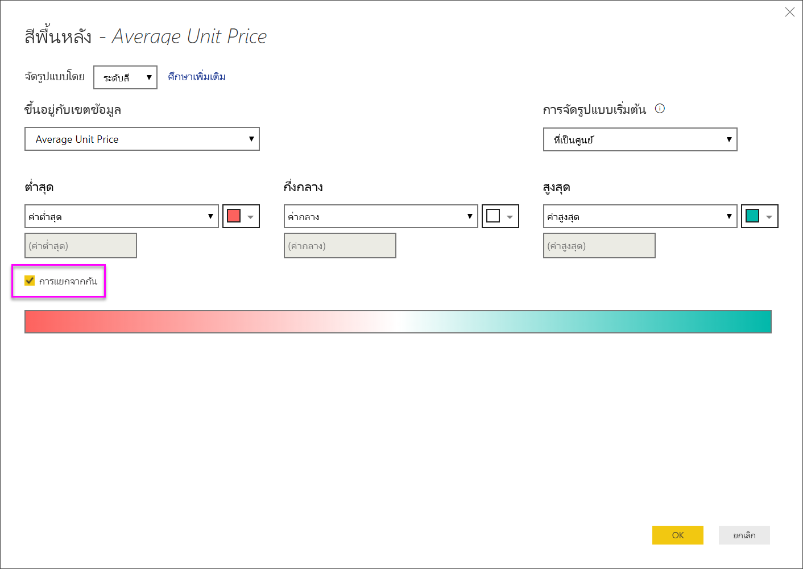
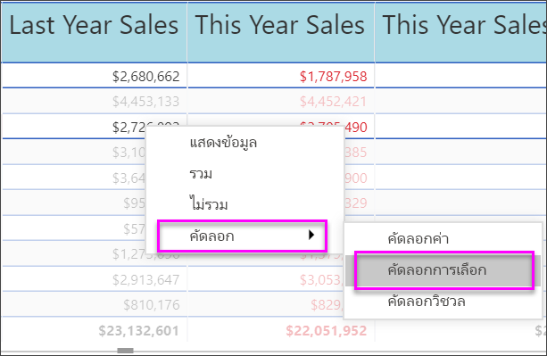

# การทำงานกับตารางในรายงานและแดชบอร์ด Power BI

[!INCLUDE [power-bi-visuals-desktop-banner](../includes/power-bi-visuals-desktop-banner.md)]

ตารางคือ เส้นตารางที่ประกอบด้วยข้อมูลที่เกี่ยวข้องในชุดที่สมเหตุผลของแถวและคอลัมน์ ซึ่งอาจยังประกอบด้วยส่วนหัวและแถวสำหรับผลรวมด้วย ตารางทำงานได้ดีกับข้อเปรียบเทียบเชิงปริมาณซึ่งเป็นการที่คุณดูหลายค่าสำหรับหนึ่งประเภท ตัวอย่างเช่น ตารางนี้แสดงการวัดที่แตกต่างกันห้าการวัดสำหรับ **ประเภท**

สร้างตารางในรายงานและองค์ประกอบการไฮไลต์เชื่อมโยงภายในตารางด้วยวิชวลอื่น ในหน้ารายงานหน้าเดียวกัน คุณสามารถเลือกแถว คอลัมน์ และแม้แต่ละเซลล์ และทำไฮไลต์เชื่อมโยง สามารถคัดลอกและวางเซลล์เดียวและหลายเซลล์ลงในแอปพลิเคชันอื่นได้

## เมื่อต้องการใช้ตาราง

ตารางเป็นตัวเลือกที่ดีมาก:

* เมื่อต้องการดูและเปรียบเทียบข้อมูลโดยละเอียดและค่าที่แน่นอน (แทนการนำเสนอแบบเป็นภาพ)

* เพื่อแสดงข้อมูลในรูปแบบตาราง

* เพื่อแสดงข้อมูลตัวเลขตามประเภท

## เงื่อนไขเบื้องต้น

บทช่วยสอนนี้ใช้[ไฟล์ PBIX ตัวอย่างการวิเคราะห์การค้าปลีก](https://download.microsoft.com/download/9/6/D/96DDC2FF-2568-491D-AAFA-AFDD6F763AE3/Retail%20Analysis%20Sample%20PBIX.pbix)

1. จากด้านบนซ้ายของแถบเมนู เลือก **ไฟล์** > **เปิด**
   
2. ค้นหาสำเนา**ไฟล์ PBIX ตัวอย่างการวิเคราะห์การค้าปลีก**

1. เปิด**ไฟล์ PBIX ตัวอย่างการวิเคราะห์การค้าปลีก**ในมุมมองรายงาน 

1. เลือก  หากต้องการเพิ่มหน้าใหม่

## สร้างตาราง

คุณจะสร้างตารางที่มีภาพแสดงอยู่บริเวณส่วนแรกของบทความเพื่อแสดงมูลค่ายอดขายตามประเภทรายการสินค้า

1. ในบานหน้าต่างของ **เขตข้อมูล** ให้เลือก **ประเภท** > **รายการสินค้า**

    Power BI จะสร้างตารางที่แสดงรายการทุกประเภทโดยอัตโนมัติ

    

1. เลือก **ยอดขาย > ราคาต่อหน่วยเฉลี่ย** และ **ยอดขาย > ยอดขายปีที่ผ่านมา**

1. จากนั้นเลือก **ยอดขาย > ยอดขายของปีนี้** และเลือกตัวเลือกทั้งสาม: **ค่า**, **เป้าหมาย** และ **สถานะ**

1. ในบานหน้าต่าง **การแสดงผลด้วยภาพ** ค้นหาแอ่ง **ค่า** แล้วเลือกค่าจนกว่าลำดับของคอลัมน์แผนภูมิของคุณตรงกับรูปภาพแรกในหน้านี้ ลากค่าดังกล่าวไปยังอ่างดังกล่าวตามความเหมาะสม **ค่า**ของคุณด้วยจะมีลักษณะดังนี้

    

## จัดรูปแบบตาราง

มีหลายวิธีในการจัดรูปแบบตาราง มีเพียงไม่กี่ส่วนที่ครอบคลุมในส่วนนี้ วิธีที่ยอดเยี่ยมในการเรียนรู้เกี่ยวกับตัวเลือกอื่น ๆ ในการจัดรูปแบบคือการเปิด **บานหน้าต่าง** การจัดรูปแบบ (ไอคอนลูกกลิ้ง ) และสำรวจ

* ลองจัดรูปแบบเส้นตาราง ที่นี่เราได้เพิ่มเส้นตารางแนวตั้งสีน้ำเงิน เพิ่มช่องว่างในแถว และเพิ่มเค้าโครง และขนาดข้อความ

    

    

* สำหรับส่วนหัวของคอลัมน์ เปลี่ยนสีพื้นหลัง เพิ่มเค้าโครง และเพิ่มขนาดฟอนต์

    

    

* คุณยังสามารถจัดรูปแบบกับ แต่ละคอลัมน์ และส่วนหัวของคอลัมน์ เริ่มต้นด้วยการขยาย **การจัดรูปแบบเขตข้อมูล** และเลือกคอลัมน์เพื่อจัดรูปแบบจากรายการดรอปดาวน์ ขึ้นอยู่กับค่าของคอลัมน์ **การจัดรูปแบบเขตข้อมูล** ช่วยให้คุณตั้งค่าสิ่งต่างๆ เช่น: หน่วยแสดงผล, สีฟอนต์, จำนวนตำแหน่งทศนิยม, พื้นหลัง, การจัดแนว และอื่นๆ เมื่อคุณได้ปรับการตั้งค่าแล้ว ตัดสินใจว่าจะใช้การตั้งค่าเหล่านั้นกับส่วนหัวและแถวผลรวมได้เช่นกัน

    

    

* หลังการปรับรูปแบบเพิ่มเติมบางส่วน ต่อไปนี้คือตารางขั้นสุดท้ายที่ได้

    

### การจัดรูปแบบแบบมีเงื่อนไข

*การจัดรูปแบบตามเงื่อนไข* คือการจัดรูปแบบชนิดหนึ่ง Power BI สามารถปรับใช้การจัดรูปแบบตามเงื่อนไขกับเขตข้อมูลใดๆ ที่คุณเพิ่มลงใน**ค่า** ของบานหน้าต่าง **การแสดงผล**

ด้วยการจัดรูปแบบตามเงื่อนไขสำหรับตาราง คุณสามารถระบุไอคอน URL สีพื้นหลังของเซลล์และสีฟอนต์ได้ด้วยตนเองโดยยึดตามค่าของเซลล์ รวมถึงการใช้สีไล่ระดับสี

1. ในบานหน้าต่าง **รูปแบบ** เปิดการ์ด **การจัดรูปแบบตามเงื่อนไข**

    

1. เลือกเขตข้อมูลที่จะจัดรูปแบบ และเลื่อนแถบเลื่อนสำหรับ **สีพื้นหลัง** เป็น เปิด Power BI ปรับใช้การไล่ระดับสีที่ยึดตามค่าในคอลัมน์ เมื่อต้องการเปลี่ยนสีเริ่มต้น ให้เลือก **ตัวควบคุมขั้นสูง**

    หากคุณเลือกตัวเลือก **แยกจากกัน** คุณสามารถกำหนดค่า **ศูนย์กลาง** ที่เป็นทางเลือกได้เช่นกัน

    

    เราลองใช้การจัดรูปแบบแบบกำหนดเองไปยังค่าของค่าเฉลี่ยราคาต่อหน่วยของเรา เลือก **แยกจากกัน** เพิ่มสีเล็กน้อย และเลือก **ตกลง**

    
1. เพิ่มเขตข้อมูลใหม่ไปยังตารางที่มีทั้งค่าบวกและค่าลบ เลือก**ยอดขาย > ผลต่างยอดขายรวม**

    

1. เพิ่มการจัดรูปแบบตามเงื่อนไขของแถบข้อมูลโดยการเลื่อนแถบเลื่อน **แถบข้อมูล** เป็น เปิด  

    

1. หากต้องการปรับแต่งแถบข้อมูล เลือก **ตัวควบคุมขั้นสูง** ในกล่องโต้ตอบที่ปรากฏขึ้น ตั้งค่าสีสำหรับ**แถบค่าบวก** และ **แถบค่าลบ** เลือกตัวเลือก **แสดงแถบเท่านั้น** และทำการเปลี่ยนแปลงอื่นๆ ที่คุณต้องการ

    

1. เลือก**ตกลง**

    แถบข้อมูลจะแทนค่าตัวเลขในตารางที่ทำให้ง่ายต่อการสแกน

    

1. เพิ่มการแสดงภาพลงในตารางของคุณด้วย *ไอคอนแบบมีเงื่อนไข*  ในการ์ด**การจัดรูปแบบตามเงื่อนไข** เลือก **ยอดขายของปีนี้** จากรายการแบบเลื่อนลง เลื่อนแถบเลื่อน **ไอคอน** เป็น **เปิด**  หากต้องการปรับแต่งไอคอนต่างๆ เลือก **ตัวควบคุมขั้นสูง**

    

## คัดลอกค่าจากตาราง Power BI เพื่อนำไปใช้ในแอปพลิเคชันอื่น

ตารางหรือเมทริกซ์ของคุณอาจมีเนื้อหาที่คุณต้องการใช้ในแอปพลิเคชันอื่น เช่น Dynamics CRM, Excel และแม้แต่รายงาน Power BI อื่นๆ ใน Power BI เมื่อคุณคลิกขวาในเซล คุณสามารถคัดลอกข้อมูลในเซลเดียวหรือเซลตามที่เลือกไปยังคลิปบอร์ดของคุณ และวางในแอปพลิเคชันอื่น

เมื่อต้องการคัดลอกค่าของเซลล์เดียว:

1. เลือกเซลล์คุณต้องการคัดลอก

1. คลิกขวาภายในเซลล์

1. เลือก **คัดลอก** > **คัดลอกค่า**

    

    คุณสามารถวางค่าที่คัดลอกลงในแอปพลิเคชันอื่นได้ โดยจะได้ค่าเซลล์ที่ไม่ได้จัดรูปแบบในคลิปบอร์ด

เมื่อต้องการคัดลอกมากกว่าเซลล์เดียว:

1. เลือกช่วงเซลล์ หรือใช้ปุ่ม **CTRL** เพื่อเลือกเซลล์อย่างน้อยหนึ่งเซลล์

1. คลิกขวาภายในหนึ่งเซลล์คุณเลือก

1. เลือก **คัดลอก** > **คัดลอกส่วนที่เลือก**

    

## ปรับความกว้างคอลัมน์ของตาราง

ในบางครั้ง Power BI จะตัดส่วนหัวของคอลัมน์ในรายงาน และแดชบอร์ดออก หากต้องการแสดงชื่อคอลัมน์ทั้งหมด เลื่อนพื้นที่ดังกล่าวไปทางด้านขวาของส่วนหัวเพื่อแสดงลูกศรคู่ เลือกแล้วลาก

## ข้อควรพิจารณาและการแก้ไขปัญหา

* เมื่อใช้การจัดรูปแบบคอลัมน์ คุณสามารถเลือกตัวเลือกการจัดแนวเพียงหนึ่งตัวเลือกต่อคอลัมน์: **อัตโนมัติ**, **ซ้าย**, **กึ่งกลาง**, **ขวา** โดยปกติแล้วจะ คอลัมน์ประกอบด้วยข้อความทั้งหมด หรือตัวเลขทั้งหมด และไม่ผสมกัน ในกรณีที่คอลัมน์ที่ประกอบด้วยทั้งตัวเลขและข้อความ **อัตโนมัติ** จะจัดชิดซ้ายสำหรับข้อความ และชิดขวาสำหรับตัวเลข พฤติกรรมนี้สนับสนุนภาษาที่คุณอ่านจากซ้ายไปขวา

* หากข้อมูลข้อความในเซลล์หรือส่วนหัวของตารางของคุณมีอักขระบรรทัดใหม่ อักขระเหล่านั้นจะถูกละเว้นถ้าคุณสลับตัวเลือก 'การตัดคำ' ในการ์ดบานหน้าต่างการจัดรูปแบบที่เกี่ยวข้องขององค์ประกอบ 

## ขั้นตอนถัดไป

* [แผนผังต้นไม้ใน Power BI](power-bi-visualization-treemaps.md)

* [ชนิดการแสดงภาพใน Power BI](power-bi-visualization-types-for-reports-and-q-and-a.md)
