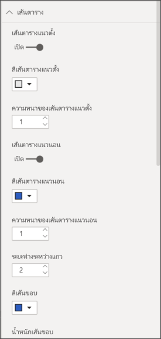
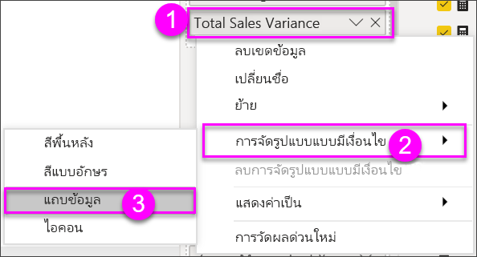
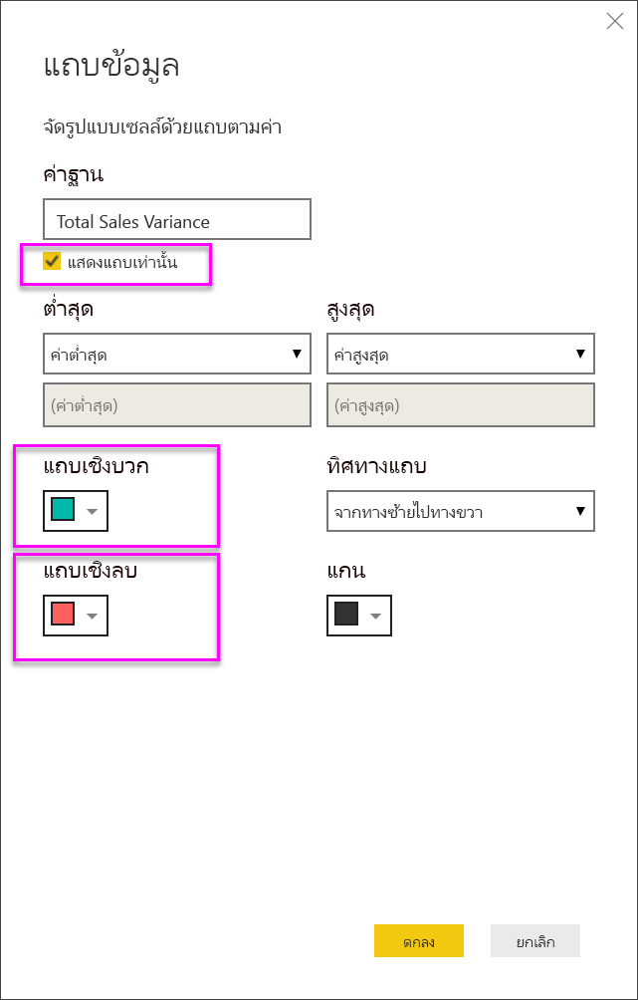

# การทำงานกับตารางในรายงานและแดชบอร์ด Power BI
ตารางคือ เส้นตารางที่ประกอบด้วยข้อมูลที่เกี่ยวข้องในชุดที่สมเหตุผลของแถวและคอลัมน์ ซึ่งอาจยังประกอบด้วยส่วนหัวและแถวสำหรับผลรวมด้วย ตารางทำงานได้ดีกับข้อเปรียบเทียบเชิงปริมาณซึ่งเป็นการที่คุณดูหลายค่าสำหรับหนึ่งประเภท ตัวอย่างเช่น ตารางนี้แสดงการวัดที่แตกต่างกัน 5 การวัดสำหรับ**ประเภท**

สร้างตารางในรายงานและองค์ประกอบการไฮไลต์เชื่อมโยงภายในตารางด้วยวิชวลอื่น ในหน้ารายงานหน้าเดียวกัน  นอกจากนี้ คุณยังสามารถเลือกแถว คอลัมน์ และแม้แต่ละเซลล์ และทำไฮไลต์เชื่อมโยง สามารถคัดลอกเซลล์เดียวและหลายเซลล์ และวางลงในแอปพลิเคชันอื่นได้

## เมื่อต้องการใช้ตาราง
ตารางเป็นตัวเลือกที่ดีมาก:

* เมื่อต้องการดูและเปรียบเทียบข้อมูลโดยละเอียดและค่าที่แน่นอน (แทนการนำเสนอแบบเป็นภาพ)
* เพื่อแสดงข้อมูลในรูปแบบตาราง
* เพื่อแสดงข้อมูลตัวเลขตามประเภท   

> [!NOTE]
> ถ้าตารางมีค่ามากเกินไป พิจารณาการแปลงเป็นเมทริกซ์ และ/หรือใช้การเจาะลึกข้อมูลแทน ตารางจะแสดงจุดข้อมูลสูงสุดคือ 3,500

## ข้อกำหนดเบื้องต้น
- บริการ Power BI หรือ Power BI Desktop
- ตัวอย่างการวิเคราะห์การค้าปลีก

## ลบตาราง
เราจะสร้างตารางที่มีภาพแสดงอยู่ด้านบนเพื่อแสดงมูลค่ายอดขายตามประเภทรายการสินค้า เมื่อต้องการทำตามคำแนะนำดังกล่าว ให้ลงชื่อเข้าใช้บริการของ Power BI แล้วเลือก**รับข้อมูล\>ตัวอย่าง\>ตัวอย่างการวิเคราะห์การค้าปลีก > เชื่อมต่อ** แล้วเลือก **ไปยังแดชบอร์ด** การสร้างภาพจำเป็นต้องมีสิทธิ์ในการแก้ไขสำหรับชุดข้อมูลและรายงาน โชคดีที่ตัวอย่าง Power BI ทั้งหมดสามารถแก้ไขได้ ถ้ามีการแชร์รายงานกับคุณ คุณจะไม่สามารถสร้างการแสดงภาพในรายงานได้

1. จากพื้นที่นำทางด้านซ้าย เลือก**พื้นที่ทำงาน > พื้นที่ทำงานของฉัน**    
2. เลือกแถบที่ชุดข้อมูลและเลื่อนลงไปยังชุดข้อมูลตัวอย่างการวิเคราะห์ร้านค้าปลีกที่คุณเพิ่งจะเพิ่มเข้ามา  เลือกไอคอน**สร้างรายงาน**

    
2. ในตัวแก้ไขรายงาน เลือก**รายการ** > **ประเภท**  Power BI จะสร้างตารางที่แสดงรายการทุกประเภทโดยอัตโนมัติ

    
3. เลือก**ยอดขาย > ราคาต่อหน่วยเฉลี่ย**และ**ยอดขาย > ยอดขายของปีล่าสุด**และ**ยอดขาย > ยอดขายของปีนี้**และเลือกทั้ง 3 ตัวเลือก (ค่า เป้าหมาย สถานะ)   
4. ในพื้นที่การแสดงภาพ ค้นหาแอ่ง**ค่า** และการลาก และปล่อยค่าจนกว่าลำดับของคอลัมน์แผนภูมิของคุณตรงกับรูปภาพแรกในหน้านี้  ค่าของคุณด้วยควรมีลักษณะดังนี้

    
5. ปักหมุดตารางไปยังแดชบอร์ดโดยการเลือกไอคอนปักหมุด  

     

## จัดรูปแบบตาราง
มีหลายวิธีในการจัดรูปแบบตาราง และที่นี่เราจะกล่าวถึงบางเพียงบางส่วนเท่านั้น วิธีที่ยอดเยี่ยมในการเรียนรู้เกี่ยวกับตัวเลือกอื่น ๆ ในการจัดรูปแบบคือการเปิดบานหน้าต่างการจัดรูปแบบ (ไอคอนลูกกลิ้ง ) และสำรวจ

* ลองจัดรูปแบบเส้นตาราง ที่นี่เราได้เพิ่มเส้นตารางแนวตั้งสีน้ำเงิน เพิ่มช่องว่างในแถว เพิ่มเค้าโครง และขนาดข้อความเล็กน้อย

    

    
* สำหรับส่วนหัวของคอลัมน์ เราเปลี่ยนสีพื้นหลัง เพิ่มเค้าร่าง และเพิ่มขนาดฟอนต์ 

    

    

* คุณยังสามารถจัดรูปแบบกับ แต่ละคอลัมน์ และส่วนหัวของคอลัมน์ เริ่มต้นด้วยการขยาย**การจัดรูปแบบเขตข้อมูล** และเลือกคอลัมน์เพื่อจัดรูปแบบจากรายการดรอปดาวน์ ขึ้นอยู่กับค่าของคอลัมน์ เขตข้อมูลที่จัดรูปแบบช่วยให้คุณตั้งค่าสิ่งต่าง ๆ เช่น: หน่วยแสดงผล, สีฟอนต์, จำนวนตำแหน่งทศนิยม, พื้นหลัง, การจัดแนว และอื่น ๆ เมื่อคุณได้ปรับการตั้งค่าแล้ว ตัดสินใจว่าจะใช้การตั้งค่าเหล่านั้นกับส่วนหัวและแถวผลรวมได้เช่นกัน

    

* และหลังการปรับรูปแบบเพิ่มเติมบางส่วน ต่อไปนี้คือตารางขั้นสุดท้ายที่ได้ เนื่องจากมีตัวเลือกการจัดรูปแบบมากมาย วิธีดีที่สุดในการเรียนรู้คือเริ่มจากรูปแบบค่าเริ่มต้น เปิดบานหน้าต่างการจัดรูปแบบ  และเริ่มการสำรวจ 

    

### การจัดรูปแบบแบบมีเงื่อนไข
อีกชนิดหนึ่งของการจัดรูปแบบจะเรียกว่า*จัดรูปแบบตามเงื่อนไข*และนำไปใช้กับเขตข้อมูลในแอ่ง**ค่า**ของพื้นที่**การแสดงภาพ**ในบริการ Power BI หรือ Desktop 

ด้วยการจัดรูปแบบตามเงื่อนไขสำหรับตาราง คุณสามารถระบุสีพื้นหลังของเซลล์และสีฟอนต์ได้ด้วยตนเองโดยยึดตามค่าของเซลล์ รวมถึงการใช้สีไล่ระดับสี 

1. ในแอ่ง**ช่องข้อมูล**ของพื้นที่**การแสดงภาพ**ในบริการ Power BI หรือ Desktop เลือกลูกศรชี้ลงข้าง ๆ ค่าในแอ่งค่าเดียวกับที่คุณต้องการจัดรูปแบบ (หรือคลิกขวาที่ช่องข้อมูล) คุณสามารถจัดการการจัดรูปแบบตามเงื่อนไขสำหรับช่องข้อมูลในพื้นที่**ค่า**ของแอ่ง**ช่องข้อมูล**ได้เท่านั้น

    
2. เลือก**ระดับสีพื้นหลัง** ในกล่องโต้ตอบที่ปรากฏขึ้น คุณสามารถกำหนดค่าสี รวมถึงค่า*ต่ำสุด*และ*สูงสุด*ได้ ถ้าคุณเลือกกล่อง**เลือกแยกจากกัน** คุณสามารถกำหนดค่า*ศูนย์กลาง*ที่เป็นทางเลือกได้เช่นกัน

    

    เราลองใช้การจัดรูปแบบแบบกำหนดเองไปยังค่าของค่าเฉลี่ยราคาต่อหน่วยของเรา เลือก**เลือกแยกจากกัน** เพิ่มสีบาง และเลือก**ตกลง** 

    
3. เพิ่มเขตข้อมูลใหม่ไปยังตารางที่มีทั้งค่าบวกและค่าลบ  เลือก**ยอดขาย > ผลต่างยอดขายรวม** 

    
4. เพิ่มการจัดรูปแบบตามเงื่อนไขแถบข้อมูลโดยการเลือกลูกศรชี้ลงที่ข้าง ๆ**ผลต่างยอดขายรวม**และเลือก**จัดรูปแบบตามเงื่อนไข > แถบข้อมูล**

    
5. ในกล่องโต้ตอบที่ปรากฏขึ้น ตั้งค่าสีสำหรับ**แถบค่าบวก** **แถบค่าลบ** ทำเครื่องหมายถูกถัดจาก**แสดงแถบเท่านั้น** และทำการเปลี่ยนแปลงอื่น ๆ ที่คุณต้องการ

    

    เมื่อคุณเลือก**ตกลง** แถบข้อมูลจะแทนค่าตัวเลขในตารางที่ทำให้ง่ายต่อการสแกน

    
6. เมื่อต้องลบการจัดรูปแบบตามเงื่อนไขออกจากการสร้างภาพ เพียงคลิกขวาที่ช่องข้อมูลอีกครั้ง แล้วเลือก**ลบรูปแบบตามเงื่อนไข**

> [!TIP]
> การจัดรูปแบบตามเงื่อนไขจะพร้อมใช้งานจากพื้นที่การจัดรูปแบบ (ไอคอนลูกกลิ้งทาสี) เลือกค่าที่จะจัดรูปแบบ จากนั้นตั้งค่า**สเกลสี**หรือ**แถบข้อมูล**ให้เป็น**เปิด** เพื่อใช้ค่าเริ่มต้น หรือหากต้องการปรับแต่งการตั้งค่า ให้เลือก**การควบคุมขั้นสูง**
> 
## คัดลอกค่าจากตาราง Power BI เพื่อนำไปใช้ในแอปพลิเคชันอื่น

ตารางหรือเมทริกซ์ของคุณอาจมีเนื้อหาที่คุณต้องการใช้ในแอปพลิเคชันอื่น เช่น Dynamics CRM, Excel และแม้แต่รายงาน Power BI อื่นๆ คุณสามารถคัดลอกเซลล์เดียวหรือหลายเซลล์ลงบนคลิปบอร์ดได้ด้วยการคลิกขวาที่ Power BI จากนั้นวางลงในแอปพลิเคชันอื่น

* เมื่อต้องการคัดลอกเซลล์เดียว ให้เลือกเซลล์นั้น คลิกขวา แล้วเลือก**คัดลอกค่า** ในตอนนี้คุณก็สามารถวางค่าที่คัดลอกลงในแอปพลิเคชันอื่นได้ โดยจะได้ค่าเซลล์ที่ไม่ได้จัดรูปแบบในคลิปบอร์ด

    

* เมื่อต้องการคัดลอกหลายเซลล์ ให้เลือกช่วงเซลล์ หรือใช้ปุ่ม CTRL เพื่อเลือกเซลล์อย่างน้อยหนึ่งเซลล์ ส่วนคัดลอกจะมีส่วนหัวของคอลัมน์และแถว

    

    ส่วนคัดลอกจะมีส่วนหัวของคอลัมน์และแถว

    

## ปรับความกว้างคอลัมน์ของตาราง
ในบางครั้ง Power BI จะตัดส่วนหัวของคอลัมน์ในรายงาน และแดชบอร์ดออก หากต้องการแสดงชื่อคอลัมน์ทั้งหมด เลื่อนพื้นที่ดังกล่าวไปทางด้านขวาของส่วนหัวเพื่อแสดงลูกศรคู่ เลือกแล้วลาก

## ข้อควรพิจารณาและการแก้ไขปัญหา
* เมื่อใช้การจัดรูปแบบคอลัมน์ คุณสามารถเลือกตัวเลือกการจัดแนวเพียงหนึ่งตัวเลือกต่อคอลัมน์: อัตโนมัติ, ซ้าย, กึ่งกลาง, ขวา โดยปกติแล้วจะ คอลัมน์ประกอบด้วยข้อความทั้งหมด หรือตัวเลขทั้งหมด และไม่ผสมกัน แต่ในกรณีที่คอลัมน์ที่ประกอบด้วยทั้งตัวเลขและข้อความ **อัตโนมัติ**จะจัดชิดซ้ายสำหรับข้อความ และชิดขวาสำหรับตัวเลข พฤติกรรมนี้สนับสนุนภาษาที่คุณอ่านจากซ้ายไปขวา   

## ขั้นตอนถัดไป

[แผนที่ต้นไม้ใน Power BI](power-bi-visualization-treemaps.md)

[ชนิดการแสดงภาพใน Power BI](power-bi-visualization-types-for-reports-and-q-and-a.md)