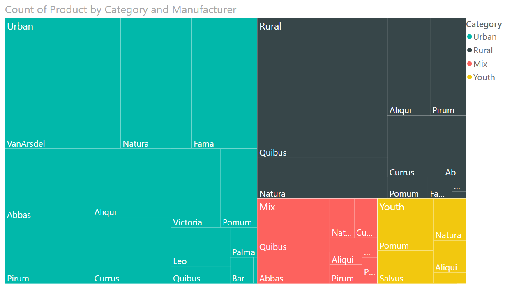
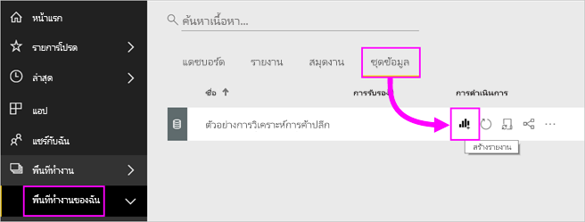

# แผนที่ต้นไม้ใน Power BI

ทรีแมปจะแสดงข้อมูลแบบลำดับชั้นเป็นชุดของสี่เหลี่ยมผืนผ้าที่วางเรียงต่อๆ กัน แต่ละระดับของลำดับชั้นจะแสดงเป็นสี่เหลี่ยมสีต่างๆ (กิ่ง) ซึ่งประกอบด้วยสี่เหลี่ยมเล็กๆ ("ใบ") Power BI จะกำหนดขนาดพื้นที่ด้านในรูปสี่เหลี่ยมแต่ละรูปตามค่าที่วัดไว้ สี่เหลี่ยมเรียงตัวกันตามขนาดจากซ้ายบน (ใหญ่ที่สุด) ไปจนถึงขวาล่าง (เล็กสุด)

เช่น หากคุณกำลังวิเคราะห์ยอดขายของคุณ คุณอาจใช้กิ่งระดับสูงๆ สำหรับประเภทเสื้อผ้า: **เขตเมือง** **ชนบท** **เยาวชน** และ **รวมกัน** Power BI จะแบ่งสี่เหลี่ยมบ่งบอกประเภทของคุณออกเป็นใบไม้หลายๆ ใบ สำหรับผู้ผลิตเสื้อผ้าในประเภทนั้นๆ ใบไม้เหล่านี้จะปรับขนาดและและขนาดตามจำนวนสินค้าที่ขายได้

ในกิ่ง **เขตเมือง** ด้านบน เสื้อผ้า **VanArsdel** ขายได้เป็นจำนวนมาก **Natura** และ **Fama** ขายได้จำนวนน้อยกว่า **Leo** ขายได้จำนวนเล็กน้อยเท่านั้น ดังนั้น กิ่ง **เขตเมือง** ในทรีแมปของคุณจึงมี:

* สี่เหลี่ยมอันใหญ่ที่สุดหมายถึง **VanArsdel** ในมุมซ้ายบน

* สี่เหลี่ยมอันเล็กกว่าเล็กน้อยหมายถึง  **Natura** และ **Fama**

* สี่เหลี่ยมอันอื่นๆ แทนเสื้อผ้าแบรนด์อื่นๆ ที่ขายได้

* สี่เหลี่ยมขนาดเล็กแทน  **Leo**

คุณสามารถนำจำนวนสินค้าที่ขายไปเปรียบเทียบกับเสื้อผ้าประเภทอื่นๆ ด้วยการเปรียบเทียบขนาดและเฉดสีของโหนดปลายสุด สี่เหลี่ยมที่ใหญ่กว่าและเข้มกว่าหมายถึงค่าที่สูงกว่า

ต้องการดูผู้อื่นสร้างทรีแมปเป็นครั้งแรกหรือไม่ ข้ามไปยังเวลาที่ 2:10 ในวิดีโอนี้เพื่อดู Amanda สร้างทรีแมป

<iframe width="560" height="315" src="https://www.youtube.com/embed/IkJda4O7oGs" frameborder="0" allowfullscreen></iframe>

## เราจะใช้ทรีแมปในกรณีใด

ทรีแมปเป็นทางเลือกที่เหมาะสมอย่างยิ่ง ในกรณีต่อไปนี้:

* เมื่อต้องการแสดงข้อมูลแบบลำดับชั้นเป็นจำนวนมาก

* เมื่อไม่สามารถใช้แผนภูมิแท่งในการนำเสนอข้อมูลจำนวนมากได้อย่างมีประสิทธิภาพ

* เมื่อต้องการแสดงสัดส่วนระหว่างแต่ละองค์ประกอบกับข้อมูลทั้งหมด

* เมื่อต้องการแสดงรูปแบบของการแจกแจงข้อมูลของข้อมูลตัวเลขในแต่ละระดับของประเภทในลำดับชั้น

* เมื่อต้องการแสดงแอตทริบิวต์ที่ใช้การแสดงรหัสด้วยสีและขนาด

* เมื่อต้องการกำหนดรูปแบบ ค่าผิดปกติ ปัจจัยสนับสนุนที่สำคัญอย่างยิ่งและและข้อยกเว้น

## ข้อกำหนดเบื้องต้น

* บริการ Power BI หรือ Power BI Desktop

* รายงานตัวอย่างการวิเคราะห์ร้านค้าปลีก

## รับรายงานตัวอย่างการวิเคราะห์ด้านการขายปลีก

คำแนะนำเหล่านี้จะใช้ตัวอย่างการวิเคราะห์การค้าปลีก การสร้างภาพจำเป็นต้องมีสิทธิ์ในการแก้ไขสำหรับชุดข้อมูลและรายงาน โชคดีที่ตัวอย่าง Power BI ทั้งหมดสามารถแก้ไขได้ หากมีคนแชร์รายงานกับคุณ คุณจะไม่สามารถสร้างการแสดงภาพในรายงาน หากต้องการติดตาม ให้เรียกดู [รายงานตัวอย่างวิเคราะห์ร้านค้าปลีก](../sample-datasets.md)

หลังจากที่คุณเรียกดูชุดข้อมูล **ตัวอย่างการวิเคราะห์ร้านค้าปลีก** คุณจะสามารถเริ่มใช้งานได้

## สร้างทรีแมปแบบพื้นฐาน

คุณจะสร้างรายงาน และเพิ่มทรีแมปแบบพื้นฐาน

1. จาก **My Workspace** เลือก **ชุดข้อมูล** > **สร้างรายงาน**

    

1. ในบานหน้าต่าง **เขตข้อมูล** ให้เลือกมาตรวัด**ยอดขาย** > **ยอดขายของปีที่ผ่านมา**

   

1. เลือกไอคอนทรีแมป  การแปลงแผนภูมิเป็นทรีแมป

   

1. ลาก**สินค้า** > **ประเภท** ไปยัง**กลุ่ม**ตามที่เหมาะสม

    Power BI จะสร้างแผนที่ต้นไม้ โดยที่ขนาดของสี่เหลี่ยมผืนผ้าจะแสดงถึงยอดขายรวม และสีจะแสดงถึงประเภท แท้จริงแล้ว คุณได้สร้างลำดับชั้นที่อธิบายขนาดสัมพัทธ์ของยอดขายรวมจำแนกตามประเภทได้อย่างชัดเจน ประเภท**ผู้ชาย**มียอดขายสูงสุด และ**ถุงเท้าและชุดชั้นใน**มียอดขายต่ำที่สุด

    

1. ลาก**ร้านค้า** > **ร้านเครือข่ายสาขา**ไปยัง**รายละเอียด**ตามที่เหมาะสม เพื่อให้ทรีแมปของคุณเสร็จสมบูรณ์ ตอนนี้คุณก็สามารถเปรียบเทียบยอดขายของปีล่าสุดจำแนกตามประเภทกับร้านค้าเครือข่ายสาขาได้แล้ว

   

   > [!NOTE]
   > ไม่สามารถใช้ความเข้มของสีและรายละเอียดในเวลาเดียวกันได้

1. โฮเวอร์เหนือพื้นที่**ร้านเครือข่ายสาขา** เพื่อดูคำแนะนำเครื่องมือสำหรับส่วนนั้นๆ ของ**ประเภท**

    ตัวอย่าง เหนือ**Fashions Direct**ใน**090 Home** สี่เหลี่ยมผืนผ้าแสดงคำแนะนำสำหรับสัดส่วนของ Fashions Direct ของประเภทของบ้าน

   

1. เพิ่มทรีแมปเป็น [ไทล์แดชบอร์ด (ปักหมุดภาพ)](../service-dashboard-tiles.md)

1. บันทึก[รายงาน](../service-report-save.md)

## การทำไฮไลท์และการกรองข้าม

สำหรับข้อมูลเกี่ยวกับการใช้บานหน้าต่าง **ตัวกรอง** โปรดดู [การเพิ่มตัวกรองไปยังรายงาน](../power-bi-report-add-filter.md)

การไฮไลต์ **ประเภท** หรือ **รายละเอียด** ในทรีแมปจะไฮไลต์ข้าม และกรองข้ามการแสดงภาพอื่นๆ บนหน้ารายงาน  และในทางกลับกันการยกเลิกการเน้นก็จะเป็นการยกเลิกการดำเนินการดังกล่าว เมื่อต้องการทำตามขั้นตอน เพิ่มภาพบางภาพไปยังหน้ารายงานนี้ หรือคัดลอกทรีแมปไปยังหน้าอื่นๆ ในรายงานนี้

1. ในทรีแมป ให้เลือก **ประเภท** หรือ **ร้านในเครือ** ภายใน **ประเภท** ซึ่งจะไฮไลต์ข้ามการแสดงภาพอื่นๆ บนหน้า ตัวอย่างเช่น การเลือก **050-Shoes** จะแสดงให้เห็นว่ายอดขายของรองเท้าของปีที่แล้วมีมูลค่า **3,640,471 ดอลลาร์** โดยที่ **การขายตรงสินค้าแฟชั่น** คิดเป็นมูลค่า **2,174,185 ดอลลาร์** ของยอดขายเหล่านั้น

   

1. ในแผนภูมิวงกลม**ยอดขายปีล่าสุดในร้านค้าเครือข่ายสาขา** เมื่อเลือกชิ้นวงกลม**การขายตรงสินค้าแฟชั่น** จะกรองข้ามทรีแมป
   

1. เมื่อต้องการจัดการวิธีการที่แผนภูมิไฮไลต์ข้ามและกรองข้ามระหว่างกัน โปรดดู [การเปลี่ยนแปลงวิธีการโต้ตอบของการแสดงภาพในรายงาน Power BI](../service-reports-visual-interactions.md)

## ขั้นตอนถัดไป

* [แผนภูมิแบบน้ำตกใน Power BI](power-bi-visualization-waterfall-charts.md)

* [ชนิดการแสดงภาพใน Power BI](power-bi-visualization-types-for-reports-and-q-and-a.md)
