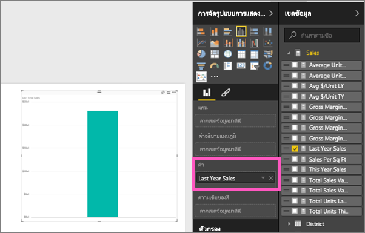
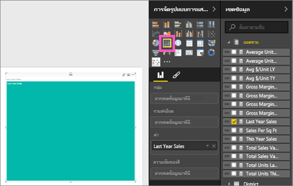
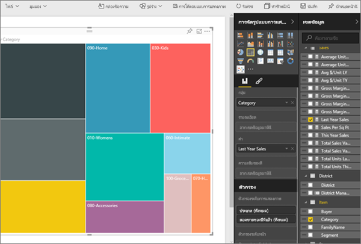
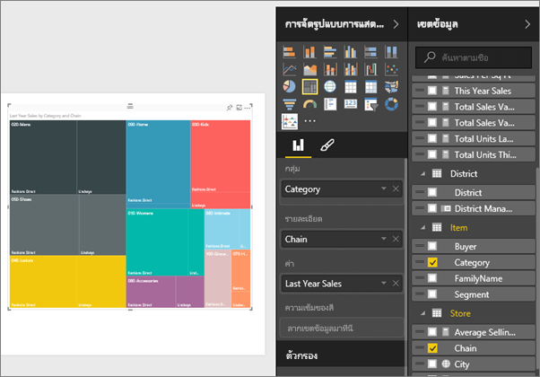
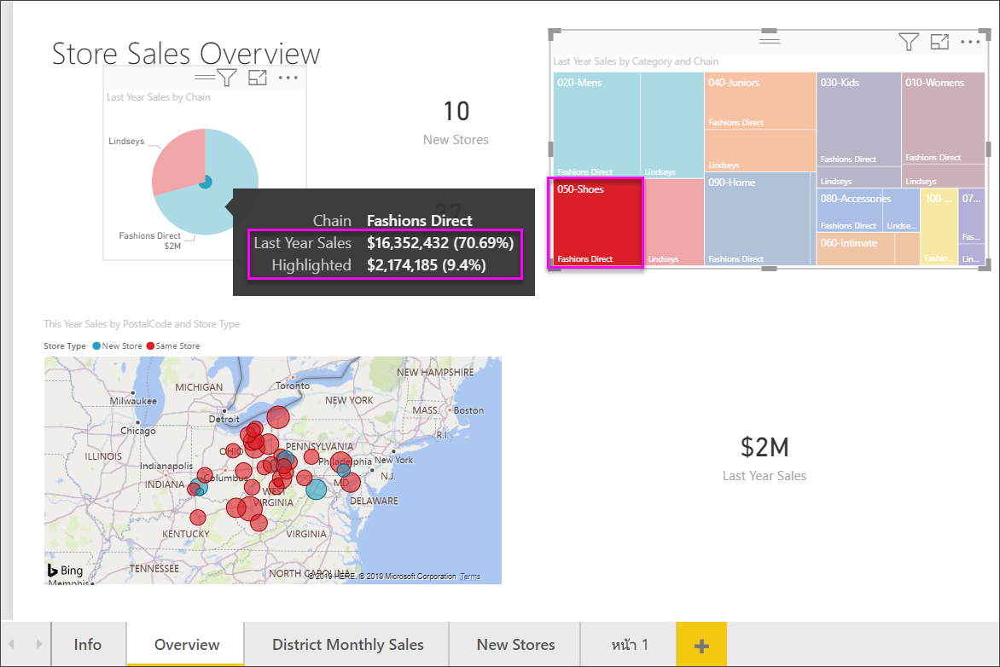

# แผนที่ต้นไม้ใน Power BI
ทรีแมปจะแสดงข้อมูลแบบลำดับชั้นเป็นชุดของสี่เหลี่ยมผืนผ้าที่วางเรียงต่อๆ กัน  แต่ละระดับของลำดับชั้นจะแสดงเป็นสี่เหลี่ยมผืนผ้าสีต่างๆ (มักจะเรียกว่า "กิ่ง") ซึ่งประกอบด้วยสี่เหลี่ยมผืนผ้าอื่นๆ ("ใบ")  พื้นที่ภายในสี่เหลี่ยมผืนผ้าแต่ละรูปจะได้รับการกำหนดขนาดตามค่าเชิงปริมาณที่วัดได้ โดยสี่เหลี่ยมผืนผ้าจะจัดเรียงตามขนาดไว้จากด้านบนซ้าย (ขนาดใหญ่ที่สุด) ไปจนถึงด้านล่างขวา (ขนาดเล็กที่สุด)

ตัวอย่างเช่น ถ้าฉันวิเคราะห์ยอดขายของตัวเอง ฉันอาจมีสี่เหลี่ยมผืนผ้าระดับสูงสุด (กิ่ง) สำหรับประเภทเสื้อผ้า: **เขตเมือง** **ชนบท** **วัยรุ่น** และ**ผสม**  สี่เหลี่ยมผืนผ้าแสดงประเภทของฉันจะประกอบด้วยสี่เหลี่ยมผืนผ้าขนาดเล็กกว่า (ใบ) ซึ่งแทนผู้ผลิตเสื้อผ้าภายในประเภทนั้นๆ และสี่เหลี่ยมผืนผ้าขนาดเล็กกว่าเหล่านี้จะมีขนาดเล็กลงและและแรเงาตามจำนวนที่ขายได้  ในกิ่ง**เขตเมือง**ด้านบน เสื้อผ้า Maximus ขายได้เป็นจำนวนมาก เสื้อผ้า Natura และ Fama ขายได้น้อยกว่า และเสื้อผ้า Leo ขายได้เพียงเล็กน้อย  ดังนั้น กิ่ง**เขตเมือง**ในทรีแมปของฉันจึงมีสี่เหลี่ยมผืนผ้าขนาดใหญ่ที่สุดสำหรับ Maximus (ในมุมบนซ้าย) สี่เหลี่ยมผืนผ้าขนาดเล็กกว่าเล็กน้อยสำหรับ Natura และ Fama สี่เหลี่ยมผืนผ้าอื่นๆ จำนวนมากแทนยอดขายเสื้อผ้าอื่นๆ ทั้งหมด และสี่เหลี่ยมผืนผ้าขนาดเล็กจิ๋วสำหรับ Leo  และฉันยังสามารถเปรียบเทียบสินค้าที่ขายเส้อผ้าประเภทอื่นๆ ได้ โดยเปรียบเทียบจากขนาด และการแรเงาของแต่ละโหนดใบ สี่เหลี่ยมผืนผ้ายิ่งมีขนาดใหญ่ และการแรเงายิ่งมีสีเข้มมากเท่าไหร่ ก็ยิ่งมีค่าสูงขึ้นมากเท่านั้น

## เราจะใช้ทรีแมปในกรณีใด
ทรีแมปเป็นทางเลือกที่เหมาะสมอย่างยิ่ง ในกรณีต่อไปนี้:

* เมื่อต้องการแสดงข้อมูลแบบลำดับชั้นเป็นจำนวนมาก
* เมื่อไม่สามารถใช้แผนภูมิแท่งในการนำเสนอข้อมูลจำนวนมากได้อย่างมีประสิทธิภาพ
* เมื่อต้องการแสดงสัดส่วนระหว่างแต่ละองค์ประกอบกับข้อมูลทั้งหมด
* เมื่อต้องการแสดงรูปแบบของการแจกแจงข้อมูลของข้อมูลตัวเลขในแต่ละระดับของประเภทในลำดับชั้น
* เมื่อต้องการแสดงแอตทริบิวต์ที่ใช้การแสดงรหัสด้วยสีและขนาด
* เมื่อต้องการกำหนดรูปแบบ ค่าผิดปกติ ปัจจัยสนับสนุนที่สำคัญอย่างยิ่งและและข้อยกเว้น

### ข้อกำหนดเบื้องต้น
 - บริการ Power BI หรือ Power BI Desktop
 - ตัวอย่างการวิเคราะห์การค้าปลีก

## สร้างทรีแมปแบบพื้นฐาน
ต้องการดูผู้อื่นสร้างทรีแมปเป็นครั้งแรกหรือไม่  ข้ามไปยังเวลาที่ 2:10 ในวิดีโอนี้เพื่อดู Amanda สร้างทรีแมป

<iframe width="560" height="315" src="https://www.youtube.com/embed/IkJda4O7oGs" frameborder="0" allowfullscreen></iframe>

หรือ สร้างทรีแมปของคุณเอง คำแนะนำเหล่านี้จะใช้ตัวอย่างการวิเคราะห์การค้าปลีก เมื่อต้องการทำตามคำแนะนำดังกล่าว ให้ลงชื่อเข้าใช้บริการของ Power BI (ไม่ใช่ Desktop) แล้วเลือก**รับข้อมูล\>ตัวอย่าง\>ตัวอย่างการวิเคราะห์การค้าปลีก \> เชื่อมต่อ \> ไปยังแดชบอร์ด** การสร้างการแสดงภาพในรายงานจะต้องมีสิทธิ์ในการแก้ไขไปยังชุดข้อมูลและรายงาน โชคดีที่ตัวอย่าง Power BI สามารถแก้ไขได้ แต่ถ้ามีบางคนแชร์รายงานกับคุณ คุณก็จะไม่สามารถเพิ่มการแสดงภาพใหม่ได้

1. เลือกไทล์ "รวมร้านค้า" เพื่อเปิดรายงานตัวอย่างการวิเคราะห์การค้าปลีก    
2. เปิด[มุมมองการแก้ไข](../service-interact-with-a-report-in-editing-view.md) แล้วเลือกข้อมูลตัวเลข **ยอดขาย** > **ยอดขายปีล่าสุด**   
      
3. แปลงแผนภูมิเป็นทรีแมป  
      
4. ลาก**สินค้า** > **ประเภท** ไปยัง**กลุ่ม**ตามที่เหมาะสม Power BI จะสร้างทรีแมป โดยที่ขนาดของสี่เหลี่ยมผืนผ้าจะแสดงถึงยอดขายรวม และสีจะแสดงถึงประเภท  แท้จริงแล้ว คุณได้สร้างลำดับชั้นที่อธิบายขนาดสัมพัทธ์ของยอดขายรวมจำแนกตามประเภทได้อย่างชัดเจน  ประเภท**ผู้ชาย**มียอดขายสูงสุด และ**ถุงเท้าและชุดชั้นใน**มียอดขายต่ำที่สุด   
      
5. ลาก**ร้านค้า** > **ร้านเครือข่ายสาขา**ไปยัง**รายละเอียด**ตามที่เหมาะสม เพื่อให้ทรีแมปของคุณเสร็จสมบูรณ์ ตอนนี้คุณก็สามารถเปรียบเทียบยอดขายของปีล่าสุดจำแนกตามประเภทกับร้านค้าเครือข่ายสาขาได้แล้ว   
   
   
   > [!NOTE]
   > ไม่สามารถใช้ความเข้มของสีและรายละเอียดในเวลาเดียวกันได้
   > 
   > 
5. โฮเวอร์เหนือพื้นที่**ร้านเครือข่ายสาขา** เพื่อดูคำแนะนำเครื่องมือสำหรับส่วนนั้นๆ ของ**ประเภท**  ตัวอย่างเช่น การโฮเวอร์เหนือ**Lindseys**ในสี่เหลี่ยมผืนผ้า **040 เด็กโต** จะแสดงคำแนะนำเครื่องมือสำหรับส่วนของ Lindsey ของประเภทเด็กโต  
   
6. [เพิ่มทรีแมปเป็นไทล์แดชบอร์ด (ปักหมุดภาพ)](../consumer/end-user-tiles.md) 
7. [บันทึกรายงาน](../service-report-save.md)

## การทำไฮไลท์และการกรองข้าม
สำหรับข้อมูลเกี่ยวกับการใช้บานหน้าต่างตัวกรอง โปรดดู[เพิ่มตัวกรองไปยังรายงาน](../power-bi-report-add-filter.md)

การเน้นประเภทหรือรายละเอียดในทรีแมปจะเน้นข้าม และ กรองข้ามการแสดงภาพอื่นๆ บนหน้ารายงาน... และในทางกลับกันการยกเลิกการเน้นก็จะเป็นการยกเลิกการดำเนินการดังกล่าว เมื่อต้องการทำตามขั้นตอนดังกล่าว ให้เพิ่มภาพบางภาพไปในหน้าเดียวกัน หรือคัดลอก/วางทรีแมปในหน้ารายงานที่มีภาพอื่นๆ อยู่แล้ว

1. ในทรีแมป ให้เลือกประเภทหรือร้านเครือข่านสาขาภายในประเภท  วิธีการนี้จะเน้นข้ามการแสดงภาพอื่นๆ ที่เหลืออยู่ในหน้านั้น ตัวอย่างเช่น การเลือก **050-รองเท้า** จะแสดงให้เห็นว่า ยอดขายรองเท้าของปีล่าสุดมีมูลค่า 3,640,471 ดอลลาร์ โดยที่ 2,174,185 ดอลลาร์มาจากการขายตรงสินค้าแฟชั่น  
   

2. ในแผนภูมิวงกลม**ยอดขายปีล่าสุดในร้านค้าเครือข่ายสาขา** เมื่อเลือกชิ้นวงกลม**การขายตรงสินค้าแฟชั่น** จะกรองข้ามทรีแมป  
       

3. เมื่อต้องการจัดการวิธีการที่แผนภูมิเน้นข้ามและกรองข้ามระหว่างกัน โปรดดู[การโต้ตอบแบบการแสดงภาพในรายงาน Power BI](../consumer/end-user-interactions.md)

## ขั้นตอนถัดไป
[ปักหมุดการแสดงภาพไปยังแดชบอร์ด](../service-dashboard-pin-tile-from-report.md)  
[Power BI - แนวคิดพื้นฐาน](../consumer/end-user-basic-concepts.md)  

มีคำถามเพิ่มเติมหรือไม่ [ลองไปที่ชุมชน Power BI](http://community.powerbi.com/)  

