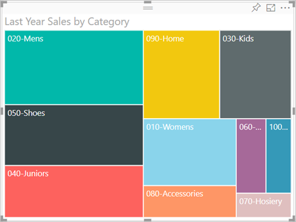
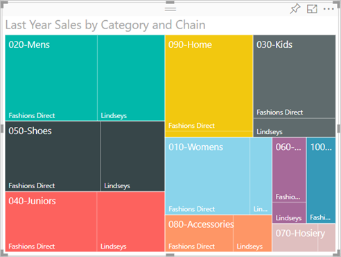

# แผนที่ต้นไม้ใน Power BI
ทรีแมปจะแสดงข้อมูลแบบลำดับชั้นเป็นชุดของสี่เหลี่ยมผืนผ้าที่วางเรียงต่อๆ กัน  แต่ละระดับของลำดับชั้นจะแสดงเป็นสี่เหลี่ยมผืนผ้าสีต่างๆ (มักจะเรียกว่า "กิ่ง") ซึ่งประกอบด้วยสี่เหลี่ยมผืนผ้าอื่นๆ ("ใบ")  ช่องว่างภายในสี่เหลี่ยมผืนผ้าแต่ละจัดไว้ตามค่าที่วัด และสี่เหลี่ยมผืนผ้าจัดเรียงในขนาดจากด้านบนซ้าย (มากที่สุด) ไปด้านล่างขวา (น้อยที่สุด)

ตัวอย่างเช่น ถ้าฉันวิเคราะห์ยอดขายของตัวเอง ฉันอาจมีสี่เหลี่ยมผืนผ้าระดับสูงสุด ที่เรียกว่า *สาขา*สำหรับประเภทของเสื้อผ้า: **เขตเมือง** **ชนบท** **เยาวชน** และ **รวมกัน**  สี่เหลี่ยมผืนผ้าประเภทของฉันจะถูกแยกออกเป็นขนาดเล็กสี่เหลี่ยมผืนผ้า หรือที่ เรียกว่า*ออกจาก*ผู้ผลิตเสื้อผ้าภายในประเภทนั้น และสี่เหลี่ยมผืนผ้าขนาดเล็กเหล่านี้จะปรับขนาด และแรเงาตามจำนวนที่ขาย  

ในสาขา **เขตเมือง**ด้านบน มี `Maximus`เสื้อผ้าจำนวนมาก ถูกขาย `Natura`และ`Fama`และสองสามชิ้น`Leo`  ดังนั้น สาขา **เขตเมือง**แผนที่ต้นไม้ของฉันจะมี:
* สี่เหลี่ยมผืนผ้าที่ใหญ่ที่สุดสำหรับ `Maximus` ที่มุมซ้ายบน
* สี่เหลี่ยมผืนผ้าขนาดเล็กกว่าเล็กน้อย สำหรับ`Natura`และ `Fama`
* สี่เหลี่ยมผืนผ้าอื่นๆ สำหรับเสื้อผ้าอื่นๆ มากมายถูกขาย และ 
* สี่เหลี่ยมผืนผ้าขนาดเล็กสำหรับ`Leo`  

และฉันยังสามารถเปรียบเทียบจำนวนสินค้าที่ขายกับประเภทเสื้อผ้าอื่นๆ ได้โดยการเปรียบเทียบขนาดและการแรเงาของโหนดปลายสุด สี่เหลี่ยมผืนผ้าที่ยิ่งมีขนาดใหญ่และเข้มมากเท่าใด ก็ยิ่งมาค่ามากขึ้นเท่านั้น

## เราจะใช้ทรีแมปในกรณีใด
ทรีแมปเป็นทางเลือกที่เหมาะสมอย่างยิ่ง ในกรณีต่อไปนี้:

* เมื่อต้องการแสดงข้อมูลแบบลำดับชั้นเป็นจำนวนมาก
* เมื่อไม่สามารถใช้แผนภูมิแท่งในการนำเสนอข้อมูลจำนวนมากได้อย่างมีประสิทธิภาพ
* เมื่อต้องการแสดงสัดส่วนระหว่างแต่ละองค์ประกอบกับข้อมูลทั้งหมด
* เมื่อต้องการแสดงรูปแบบของการแจกแจงข้อมูลของข้อมูลตัวเลขในแต่ละระดับของประเภทในลำดับชั้น
* เมื่อต้องการแสดงแอตทริบิวต์ที่ใช้การแสดงรหัสด้วยสีและขนาด
* เมื่อต้องการกำหนดรูปแบบ ค่าผิดปกติ ปัจจัยสนับสนุนที่สำคัญอย่างยิ่งและและข้อยกเว้น

### ข้อกำหนดเบื้องต้น
 - บริการ Power BI หรือ Power BI Desktop
 - ตัวอย่างการวิเคราะห์การค้าปลีก

## สร้างทรีแมปแบบพื้นฐาน
ต้องการดูผู้อื่นสร้างทรีแมปเป็นครั้งแรกหรือไม่  ข้ามไปยังเวลาที่ 2:10 ในวิดีโอนี้เพื่อดู Amanda สร้างทรีแมป

<iframe width="560" height="315" src="https://www.youtube.com/embed/IkJda4O7oGs" frameborder="0" allowfullscreen></iframe>

หรือ สร้างทรีแมปของคุณเอง คำแนะนำเหล่านี้จะใช้ตัวอย่างการวิเคราะห์การค้าปลีก เมื่อต้องการทำตามคำแนะนำดังกล่าว ให้ลงชื่อเข้าใช้บริการ Power BI แล้วเลือก**รับข้อมูล\> ตัวอย่าง \> ตัวอย่างการวิเคราะห์ร้านค้าปลีก \> การเชื่อมต่อ \> ไปที่แดชบอร์ด** การสร้างการแสดงภาพในรายงานจะต้องมีสิทธิ์ในการแก้ไขไปยังชุดข้อมูลและรายงาน โชคดีที่ตัวอย่าง Power BI สามารถแก้ไขได้ แต่คุณไม่สามารถเพิ่มการแสดงภาพไปยังรายงานที่มีบุคคลอื่นแชร์กับคุณได้  

1. เลือกไทล์ "รวมร้านค้า" เพื่อเปิดรายงานตัวอย่างการวิเคราะห์การค้าปลีก    
2. เปิด[มุมมองการแก้ไข](../service-interact-with-a-report-in-editing-view.md) แล้วเลือกข้อมูลตัวเลข **ยอดขาย** > **ยอดขายปีล่าสุด**   
      
3. แปลงแผนภูมิเป็นทรีแมป  
      
4. ลาก**สินค้า** > **ประเภท** ไปยัง**กลุ่ม**ตามที่เหมาะสม Power BI จะสร้างแผนที่ต้นไม้ โดยที่ขนาดของสี่เหลี่ยมผืนผ้าจะแสดงถึงยอดขายรวม และสีจะแสดงถึงประเภท  แท้จริงแล้ว คุณได้สร้างลำดับชั้นที่อธิบายขนาดสัมพัทธ์ของยอดขายรวมจำแนกตามประเภทได้อย่างชัดเจน  ประเภท**ผู้ชาย**มียอดขายสูงสุด และ**ถุงเท้าและชุดชั้นใน**มียอดขายต่ำที่สุด   
      
5. ลาก**ร้านค้า** > **ร้านเครือข่ายสาขา**ไปยัง**รายละเอียด**ตามที่เหมาะสม เพื่อให้ทรีแมปของคุณเสร็จสมบูรณ์ ตอนนี้คุณก็สามารถเปรียบเทียบยอดขายของปีล่าสุดจำแนกตามประเภทกับร้านค้าเครือข่ายสาขาได้แล้ว   
   
   
   > [!NOTE]
   > ไม่สามารถใช้ความเข้มของสีและรายละเอียดในเวลาเดียวกันได้
   > 
   > 
5. โฮเวอร์เหนือพื้นที่**ร้านเครือข่ายสาขา** เพื่อดูคำแนะนำเครื่องมือสำหรับส่วนนั้นๆ ของ**ประเภท**  ตัวอย่าง เหนือ**Fashions Direct**ใน**090 Home** สี่เหลี่ยมผืนผ้าแสดงคำแนะนำสำหรับสัดส่วนของ Fashions Direct ของประเภทของบ้าน  
   
6. [เพิ่มทรีแมปเป็นไทล์แดชบอร์ด (ปักหมุดภาพ)](../service-dashboard-tiles.md) 
7. [บันทึกรายงาน](../service-report-save.md)

## การทำไฮไลท์และการกรองข้าม
สำหรับข้อมูลเกี่ยวกับการใช้บานหน้าต่างตัวกรอง โปรดดู[เพิ่มตัวกรองไปยังรายงาน](../power-bi-report-add-filter.md)

การเน้นประเภทหรือรายละเอียดในแผนที่ต้นไม้จะเน้นข้าม และกรองข้ามการแสดงภาพอื่นๆ บนหน้ารายงาน... และในทางกลับกันการยกเลิกการเน้นก็จะเป็นการยกเลิกการดำเนินการดังกล่าว เมื่อต้องการทำตามขั้นตอน เพิ่มภาพบางภาพไปยังหน้ารายงานนี้ หรือคัดลอกแผนที่ต้นไม้ไปไม่ว่างหน้าอื่น ๆ ในรายงานนี้

1. ในทรีแมป ให้เลือกประเภทหรือร้านเครือข่านสาขาภายในประเภท  วิธีการนี้จะเน้นข้ามการแสดงภาพอื่นๆ ที่เหลืออยู่ในหน้านั้น ตัวอย่างเช่น การเลือก **050-รองเท้า** จะแสดงให้เห็นว่า ยอดขายรองเท้าของปีล่าสุดมีมูลค่า 3,640,471 ดอลลาร์ โดยที่ 2,174,185 ดอลลาร์มาจากการขายตรงสินค้าแฟชั่น  
   

2. ในแผนภูมิวงกลม**ยอดขายปีล่าสุดในร้านค้าเครือข่ายสาขา** เมื่อเลือกชิ้นวงกลม**การขายตรงสินค้าแฟชั่น** จะกรองข้ามทรีแมป  
       

3. เมื่อต้องการจัดการวิธีการที่แผนภูมิเน้นข้ามและกรองข้ามระหว่างกัน โปรดดู[การโต้ตอบแบบการแสดงภาพในรายงาน Power BI](../service-reports-visual-interactions.md)

## ขั้นตอนถัดไป

[แผนภูมิแบบน้ำตกใน Power BI](power-bi-visualization-waterfall-charts.md)

[ชนิดการแสดงภาพใน Power BI](power-bi-visualization-types-for-reports-and-q-and-a.md)