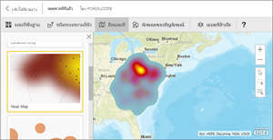
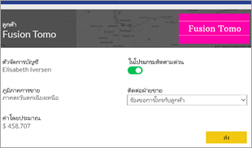
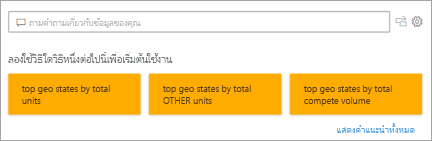
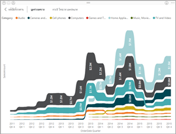
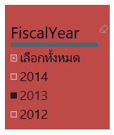
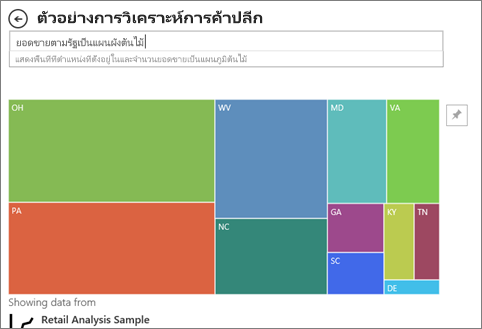

# ชนิดการแสดงภาพใน Power BI
## การแสดงภาพ Power BI
เราจะเพิ่มการแสดงภาพใหม่ โปรดติดตามต่อไป!

และดูที่[Microsoft AppSource](https://appsource.microsoft.com/marketplace/apps?product=power-bi-visuals) ซึ่งคุณจะพบรายการ[ภาพแบบกำหนดเอง](../developer/power-bi-custom-visuals.md)ที่ขยายเพิ่มขึ้นเรื่อย ๆ คุณสามารถดาวน์โหลดและใช้ในแดชบอร์ดและรายงานของคุณเองได้ รู้สึกมีความคิดสร้างสรรค์? [เรียนรู้วิธีการสร้างและเพิ่มภาพของคุณเองไปยังเว็บไซต์ชุมชนนี้](../developer/office-store.md)  

## รายการของการแสดงภาพที่พร้อมใช้งานใน Power BI
การแสดงภาพเหล่านี้ทั้งหมดสามารถถูกเพิ่มลงในรายงาน Power BI ที่ระบุในการถามตอบ และปักหมุดไปยังแดชบอร์ดได้

### แผนภูมิพื้นที่: พื้นฐาน (เป็นชั้น) และแบบเรียงซ้อน

>[!TIP]
>แผนภูมิพื้นที่พื้นฐานจะยึดตามแผนภูมิเส้นที่มีพื้นที่ระหว่างแกนและเส้นเป็นบริเวณทึบ

สำหรับข้อมูลเพิ่มเติม ดู[แผนภูมิพื้นที่พื้นฐาน](power-bi-visualization-basic-area-chart.md)

### แผนภูมิแท่งและแผนภูมิคอลัมน์

 

>[!TIP]
>แผนภูมิแท่งเป็นมาตรฐานสำหรับการดูที่ีค่าเฉพาะในแต่ละประเภท

### การ์ด: หลายแถว

### การ์ด: หมายเลขเดียว

สำหรับข้อมูลเพิ่มเติม ดู[สร้างการ์ด (ไทล์ตัวเลขขนาดใหญ่)](power-bi-visualization-card.md)

### แผนภูมิผสม

>[!TIP]
>แผนภูมิผสมรวมแผนภูมิคอลัมน์และแผนภูมิเส้นไว้ด้วยกัน เลือกจาก*เส้นและคอลัมน์แบบเรียงซ้อน*และ*เส้นและแผนภูมิคอลัมน์กลุ่ม*

สำหรับข้อมูลเพิ่มเติม ดู[แผนภูมิผสมใน Power BI](power-bi-visualization-combo-chart.md)

### แผนภูมิโดนัท

>[!TIP]
>แผนภูมิโดนัทจะคล้ายกับแผนภูมิวงกลม  โดยที่จะแสดงความสัมพันธ์ของส่วนต่าง ๆ ต่อส่วนทั้งหมด

สำหรับข้อมูลเพิ่มเติม ดู [แผนภูมิโดนัทใน Power BI](power-bi-visualization-doughnut-charts.md)

### แผนภูมิกรวย

>[!TIP]
>แผนภูมิกรวยช่วยในการสร้างภาพของกระบวนการที่มีลำดับขั้น และรายการต่าง ๆ ให้จัดเรียงตามลำดับจากขั้นหนึ่งไปยังอีกขั้น  ใช้แผนภูมิกรวยเมื่อมีโฟลว์ลำดับระหว่างขั้นตอนต่าง ๆ เช่นกระบวนการขายที่เริ่มต้นด้วยลูกค้าเป้าหมาย และลงท้ายด้วยการขาย

สำหรับข้อมูลเพิ่มเติม ดู [แผนภูมิกรวยใน Power BI](power-bi-visualization-funnel-charts.md)

### แผนภูมิตัววัด

>[!TIP]
>แสดงสถานะปัจจุบันในบริบทของเป้าหมาย

สำหรับข้อมูลเพิ่มเติม ดู [แผนภูมิวัดความเร็วใน Power BI](power-bi-visualization-radial-gauge-charts.md)

### แผนภูมิผู้มีอิทธิพลหลัก

แผนภูมิผู้มีอิทธิพลหลักแสดงผู้สนับสนุนหลักไปยังผลลัพธ์หรือค่าที่เลือก

สำหรับข้อมูลเพิ่มเติม ดู[แผนภูมิผู้มีอิทธิพลหลักใน Power BI](power-bi-visualization-influencers.md)

### KPI

>[!TIP]
>แสดงความคืบหน้าของการบรรลุเป้าหมายที่วัดได้

สำหรับข้อมูลเพิ่มเติม ดู [KPI ใน Power BI](power-bi-visualization-kpi.md)

### แผนภูมิเส้น

>[!TIP]
>เน้นรูปร่างโดยรวมของชุดข้อมูลค่าทั้งหมด โดยปกติแล้วจะดูเทียบกับเวลาที่ผ่านไป

### แผนที่: แผนที่พื้นฐาน

>[!TIP]
>ใช้เพื่อเชื่อมโยงข้อมูลเชิงหมวดหมู่และข้อมูลเชิงปริมาณเข้ากับตำแหน่งที่ตั้งเชิงพื้นที่

สำหรับข้อมูลเพิ่มเติม ดู[คำแนะนำและเคล็ดลับสำหรับภาพแผนที่](power-bi-map-tips-and-tricks.md)

### แผนที่: แผนที่ ArcGIS

สำหรับข้อมูลเพิ่มเติม ดู [แผนที่ ArcGIS ใน Power BI](power-bi-visualization-arcgis.md)

### แผนที่: แผนที่แถบสี (Choropleth)

>[!TIP]
>ยิ่งมีีสีเข้มเท่าไหร่ ค่านั้นยิ่งมากขึ้นเท่านัั้น

สำหรับข้อมูลเพิ่มเติม ดู [แผนที่แถบสีใน Power BI](power-bi-visualization-filled-maps-choropleths.md)

### แผนที่: แผนที่รูปร่าง

>[!TIP]
>เปรียบเทียบภูมิภาคตามสี

สำหรับข้อมูลเพิ่มเติม ดู [แผนที่รูปร่างใน Power BI](desktop-shape-map.md)

### เมทริกซ์

>[!TIP]
>ตารางสนับสนุนการใช้งานแบบสองมิติ แต่เมทริกซ์ทำให้การแสดงข้อมูลง่ายและมีความหมายในทั้งหลายมิติและเมทริกซ์สนับสนุนการจัดวางอย่างเป็นขั้นเป็นตอน เมทริกซ์จะรวมข้อมูลโดยอัตโนมัติและสามารถเจาะลึกลงไป 

สำหรับข้อมูลเพิ่มเติม ดู [การแสดงผลด้วยภาพแบบเมทริกซ์ใน Power BI](desktop-matrix-visual.md)

### แผนภูมิวงกลม

>[!TIP]
>แผนภูมิวงกลมจะแสดงความสัมพันธ์ของส่วนต่าง ๆ ต่อส่วนทั้งหมด 

### วิชวล Power Apps

นักออกแบบรายงานสามารถสร้าง Power App และฝังลงในรายงาน Power BI เป็นวิชวลได้ ลูกค้าสามารถโต้ตอบกับวิชวลด้วยรายงาน Power BI ได้ 

สำหรับข้อมูลเพิ่มเติม ดู [เพิ่มวิชวล Power Apps ไปยังรายงานของคุณ](power-bi-visualization-powerapp.md)

### วิชวลถามตอบ

>[!TIP]
>คล้ายกับ [ประสบการณ์ถามตอบเกี่ยวกับแดชบอร์ด](../power-bi-tutorial-q-and-a.md) วิชวลถามตอบช่วยให้คุณสามารถถามคำถามเกี่ยวกับข้อมูลของคุณโดยใช้ภาษาธรรมชาติ 

สำหรับข้อมูลเพิ่มเติม โปรดดู[วิชวลถามตอบใน Power BI](power-bi-visualization-q-and-a.md)

### ภาพสคริปต์ R

>[!TIP]
>ภาพที่สร้างขึ้นด้วยสคริปต์ R มักเรียกว่า*ภาพ R* ซึ่งสามารถนำเสนอการปรับรูปร่างข้อมูลและการวิเคราะห์ขั้นสูง เช่น การทำนายโดยใช้การวิเคราะห์ที่มีข้อมูลเต็มเปี่ยมและพลังของการแสดงภาพ R ภาพ R สามารถถูกสร้างขึ้นใน Power BI Desktop และเผยแพร่ไปยังบริการ Power BI   

สำหรับข้อมูลเพิ่มเติม ดู[การแสดงผลด้วยภาพแบบ R ใน Power BI](service-r-visuals.md)

### แผนภูมิริบบอน

>[!TIP]
>แผนภูมิ Ribbon แสดงประเภทข้อมูลที่มีอันดับสูงสุด (ค่ามากที่สุด) แผนภูมิ Ribbon เหมาะกับการแสดงการเปลี่ยนแปลงอันดับ โดยที่ค่าอันดับสูงสุดจะแสดงอยู่ด้านบนสุดของแต่ละช่วงเวลาเสมอ

สำหรับข้อมูลเพิ่มเติม ดู[การใช้แผนภูมิ Ribbon ใน Power BI](desktop-ribbon-charts.md)

### แผนภูมิกระจายและแผนภูมิฟอง

>[!TIP]
>แสดงความสัมพันธ์ระหว่างหน่วยวัดเชิงปริมาณ 2 หน่วย (กระจาย) หรือ 3 หน่วย (แผนภูมิฟอง) โดยไม่คำนึงถึงลำดับและอื่น ๆ

สำหรับข้อมูลเพิ่มเติม ดู[แผนภูมิกระจายใน Power BI](power-bi-visualization-scatter.md)

### ความหนาแน่นสูงกระจาย

>[!TIP]
>จุดข้อมูลมากเกินไปบนการแสดงผลด้วยภาพสามารถทำให้หยุดชะงักได้ เพื่อใช้อัลกอริทึมการสุ่มตัวอย่างที่ซับซ้อนเพื่อให้แน่ใจความแม่นยำของการแสดงภาพ

สำหรับข้อมูลเพิ่มเติม ดู[แผนภูมิกระจายความหนาแน่นสูงใน Power BI](desktop-high-density-scatter-charts.md)

### ตัวแบ่งส่วนข้อมูล

สำหรับข้อมูลเพิ่มเติม ดู[ตัวแบ่งส่วนข้อมูลใน Power BI](power-bi-visualization-slicers.md)

### รูปภาพเดี่ยว

สำหรับข้อมูลเพิ่มเติม ดู[เพิ่มรูปภาพวิดเจ็ตไปยังแดชบอร์ด](../service-dashboard-add-widget.md)

### ตาราง

>[!TIP]
>ทำงานได้ดีกับการเปรียบเทียบเชิงปริมาณระหว่างรายการต่าง ๆ ที่มีหลากลายประเภท

สำหรับข้อมูลเพิ่มเติม ดู[การทำงานกับตารางใน Power BI](power-bi-visualization-tables.md)

### แผนภูมิต้นไม้

สำหรับข้อมูลเพิ่มเติม ดู[แผนภูมิต้นไม้ใน Power BI](power-bi-visualization-treemaps.md)

>[!TIP]
>แผนภูมิพื้นที่ที่มีสี่เหลี่ยมผืนผ้าเติมสีจะมีค่าที่เป็นตัวแทนขนาด  แผนภูมิเหล่านี้อาจเป็นแบบชั้นโดยที่มีสี่เหลี่ยมผืนผ้าที่ซ้อนกันภายในสี่เหลี่ยมผืนผ้าหลัก

### แผนภูมิแบบน้ำตก

>[!TIP]
>แผนภูมิแบบน้ำตกจะแสดงผลรวมสะสมเป็นค่าที่เพิ่มขึ้นหรือลดลง

สำหรับข้อมูลเพิ่มเติม ดู[แผนภูมิน้ำตกใน Power BI](power-bi-visualization-waterfall-charts.md)

## บอกการถามตอบว่าต้องใช้การแสดงภาพแบบใด
เมื่อพิมพ์คิวรี่ด้วยภาษาธรรมชาติในการถามตอบของ Power BI A คุณสามารถระบุชนิดการแสดงภาพในคิวรี่ของคุณได้  ตัวอย่างเช่น:

"***ยอดขายตามรัฐเป็นแผนผังต้นไม้***"

## ขั้นตอนถัดไป
[การแสดงภาพในรายงาน Power BI](power-bi-report-visualizations.md)    
[อ้างอิงภาพที่ถูกต้องจาก sqlbi.com](https://www.sqlbi.com/wp-content/uploads/videotrainings/dashboarddesign/visuals-reference-may2017-A3.pdf)