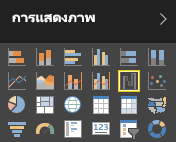
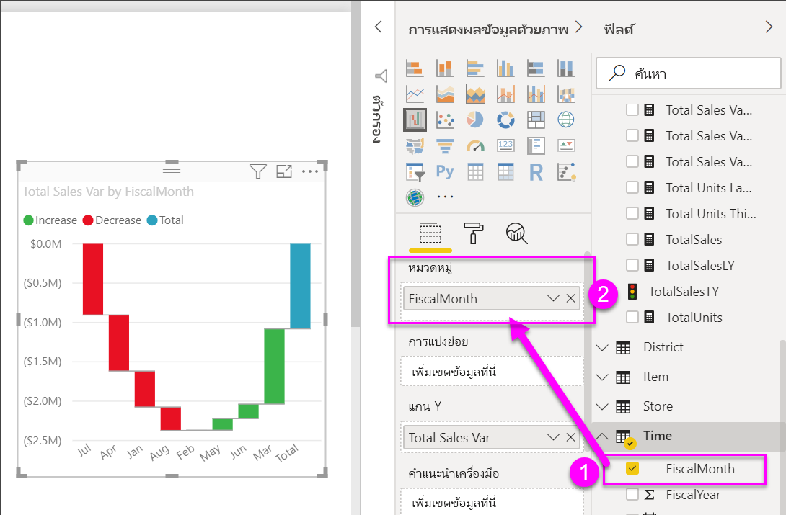
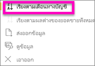
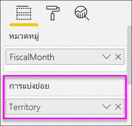
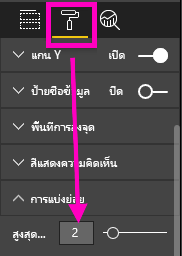

# แผนภูมิแบบน้ำตกใน Power BI
แผนภูมิแบบน้ำตกจะแสดงผลรวมสะสมเป็นค่าที่เพิ่มขึ้นหรือลดลง แผนภูมินี้มีประโยชน์สำหรับการวิเคราะห์ว่าค่าเริ่มต้น (ตัวอย่างเช่น กำไรสุทธิ) ได้รับผลกระทบอย่างไร เมื่อมีการเปลี่ยนแปลงเชิงบวก และเชิงลบที่เกิดขึ้นอย่างต่อเนื่องในช่วงระยะเวลาหนึ่ง

คอลัมน์เป็นสีที่่แสดงรหัส เพื่อให้คุณสามารถระบุการเพิ่มขึ้นและการลดลงได้อย่างรวดเร็ว คอลัมน์ค่าเริ่มต้นและคอลัมน์ค่าสุดท้ายมัก[เริ่มต้นบนแกนนอน](https://support.office.com/article/Create-a-waterfall-chart-in-Office-2016-for-Windows-8de1ece4-ff21-4d37-acd7-546f5527f185#BKMK_Float "เริ่มต้นบนแกนนอน") ขณะที่ค่ากลางจะเป็นคอลัมน์แบบลอยตัว เนื่องจากมี "รูปร่าง" แบบนี้ จึงยังเรียกแผนภูมิแบบน้ำตกอีกชื่อหนึ่งว่าแผนภูมิแบบสะพาน

<iframe width="560" height="315" src="https://www.youtube.com/embed/qKRZPBnaUXM" frameborder="0" allow="autoplay; encrypted-media" allowfullscreen></iframe>

## เมื่อต้องการใช้แผนภูมิแบบน้ำตก
แผนภูมิแบบน้ำตกเป็นตัวเลือกที่เหมาะสมอย่างยิ่ง ในกรณีต่อไปนี้:

* เมื่อคุณมีการเปลี่ยนแปลงข้อมูลตัวเลขตลอดช่วงระยะเวลาหนึ่งหรือตามประเภทต่างๆ
* เมื่อต้องการตรวจสอบการเปลี่ยนแปลงหลักที่ส่งผลให้เกิดค่าผลรวม
* เมื่อต้องการลงจุดกำไรรายปีของบริษัทคุณ โดยแสดงแหล่งข้อมูลต่างๆ ของรายได้ และจนถึงกำไร (หรือขาดทุน) รวม
* เมื่อต้องการแสดงจำนวนพนักงานตอนต้นปีและปลายปีในบริษัทของคุณในหนึ่งปี
* เมื่อต้องการแสดงภาพจำนวนเงินที่หาได้และใช้จ่ายในแต่ละเดือน และยอดคงเหลือสะสมสำหรับบัญชีของคุณ 

## สร้างแผนภูมิแบบน้ำตก
เราจะสร้างแผนภูมิแบบน้ำตกที่แสดงผลต่างของยอดขาย (ประมาณการยอดขายเทียบกับยอดขายจริง) เป็นรายเดือน เมื่อต้องการใช้งานตามลักษณะการใช้งานดังกล่าว ให้ลงชื่อเข้าใช้ Power BI แล้วเลือก**รับข้อมูล\>ตัวอย่าง\>ตัวอย่างการวิเคราะหการค้าปลีก** 

1. เลือกแท็บ**ชุดข้อมูล** แล้วเลื่อนไปยังชุดข้อมูล "ตัวอย่างการวิเคราะห์การค้าปลีก" ใหม่  เลือกไอคอน**สร้างรายงาน** เพื่อเปิดชุดข้อมูลในมุมมองการแก้ไขรายงาน 
   
    
2. ในส่วนบานหน้าต่าง**เขตข้อมูล** ให้เลือก**ยอดขาย\> ผลต่างของยอดขายรวม** ถ้า**ผลต่างของยอดขายรวม**ไม่ได้อยู่ในพื้นที่ของ**แกน Y** ให้ลากไปไว้ในส่วนนั้น
3. แปลงแผนภูมิเป็น**แบบน้ำตก** 
   
    
4. เลือก**เวลา** \> **เดือนตามรอบบัญชี** เพื่อเพิ่มไปยัง**ประเภท** ตามที่เหมาะสม 
   
    
5. เรียงลำดับแผนภูมิแบบน้ำตกตามลำดับเวลา ในส่วนมุมบนขวาของแผนภูมิ ให้เลือกจุดไข่ปลา (...) แล้วเลือก **เดือนตามรอบบัญชี**
   
    
   
    
6. ดูรายละเอียดเพิ่มเติมอีกเล็กน้อย เพื่อดูว่าอะไรคือปัจจัยที่สนับสนุนให้เกิดการเปลี่ยนแปลงมากที่สุดในแต่ละเดือน ลาก**ร้านค้า** > **เขตการขาย**ไปยังบักเก็ต **การแบ่งย่อย**
   
    
7. ตามค่าเริ่มต้น Power BI จะเพิ่มปัจจัยสนับสนุน 5 อันดับแรกที่จะเพิ่ม หรือลดในแต่ละเดือน แต่เราสนใจเฉพาะปัจจัยสนับสนุน 2 อันดับแรก  ในบานหน้าต่างการจัดรูปแบบ ให้เลือก**การแบ่งย่อย** แล้วตั้งค่า**สูงสุด**เป็น 2
   
    
   
    การตรวจสอบอย่างรวดเร็วแสดงให้เห็นว่าเขตโอไฮโอ และเพนซิลเวเนียเป็นปัจจัยสนับสนุนที่มีอิทธิพลมากที่สุดที่ทำให้เกิดการเปลี่ยนแปลงทั้งในเชิงบวกและเชิงลบในแผนภูมิแบบน้ำตกของเรา 
   
    
8. นี่คือข้อมูลจากการตรวจสอบที่น่าสนใจ โอไฮโอและเพนซิลเวเนียได้รับผลกระทบดังกล่าว เนื่องจากเขตการขาย 2 เขตนี้มียอดขายสูงกว่าเขตการขายอื่น ๆ เป็นอย่างมากใช่หรือไม่  เราสามารถตรวจสอบข้อมูลดังกล่าวได้ สร้างแผนที่ตรวจสอบยอดขายตามเขตการขาย  
   
    
   
    แผนที่ของเราสนับสนุนทฤษฎีของเรา  โดยแสดงให้เห็นว่าเขตการขาย 2 เขตนี้มียอดขายสูงสุดในปีที่ผ่านมา (ขนาดฟอง) และปีนี้ (แรเงาฟอง)

## การเน้นและการกรองข้าม
สำหรับข้อมูลเกี่ยวกับการใช้บานหน้าต่างตัวกรอง โปรดดู[เพิ่มตัวกรองไปยังรายงาน](../power-bi-report-add-filter.md)

การเน้นคอลัมน์ในแผนภูมิแบบน้ำตกจะกรองข้ามการแสดงภาพอื่นๆ ในหน้ารายงาน และในทางกลับกัน การยกเลิกการเน้นก็จะเป็นการยกเลิกการดำเนินการดังกล่าว อย่างไรก็ตาม คอลัมน์ผลรวมจะไม่ทริกเกอร์การเน้น หรือตอบสนองกับการกรองข้าม

## ขั้นตอนถัดไป
[รายงานใน Power BI](../consumer/end-user-reports.md)

[ชนิดการแสดงภาพใน Power BI](power-bi-visualization-types-for-reports-and-q-and-a.md)

[การแสดงภาพในรายงาน Power BI](power-bi-report-visualizations.md)

[Power BI - แนวคิดพื้นฐาน](../consumer/end-user-basic-concepts.md)

มีคำถามเพิ่มเติมหรือไม่ [ลองไปที่ชุมชน Power BI](http://community.powerbi.com/)

