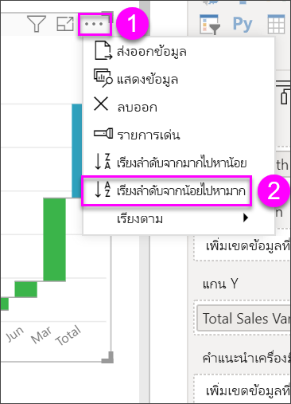

# แผนภูมิแบบน้ำตกใน Power BI

[!INCLUDE [power-bi-visuals-desktop-banner](../includes/power-bi-visuals-desktop-banner.md)]

แผนภูมิแบบน้ำตกจะแสดงผลรวมสะสมเป็นค่าของ Power BI ที่เพิ่มขึ้นหรือลดลง แผนภูมิเหล่านี้มีประโยชน์สำหรับการวิเคราะห์ว่าค่าเริ่มต้น (ตัวอย่างเช่น กำไรสุทธิ) ได้รับผลกระทบอย่างไร เมื่อมีการเปลี่ยนแปลงเชิงบวก และเชิงลบที่เกิดขึ้นอย่างต่อเนื่องในช่วงระยะเวลาหนึ่ง

คอลัมน์เป็นสีที่แสดงรหัส เพื่อให้คุณสามารถสังเกตการเพิ่มขึ้นและการลดลงได้อย่างรวดเร็ว คอลัมน์ค่าเริ่มต้นและคอลัมน์ค่าสุดท้ายมัก[เริ่มต้นบนแกนนอน](https://support.office.com/article/Create-a-waterfall-chart-in-Office-2016-for-Windows-8de1ece4-ff21-4d37-acd7-546f5527f185#BKMK_Float "เริ่มต้นบนแกนนอน") ขณะที่ค่ากลางจะเป็นคอลัมน์แบบลอยตัว เนื่องจากมี "สไตล์" แบบนี้ จึงยังเรียกแผนภูมิแบบน้ำตกอีกชื่อหนึ่งว่าแผนภูมิแบบสะพาน

   > [!NOTE]
   > วิดีโอนี้ใช้ Power BI Desktop เวอร์ชั่นเก่า
   > 
   > 

<iframe width="560" height="315" src="https://www.youtube.com/embed/qKRZPBnaUXM" frameborder="0" allow="autoplay; encrypted-media" allowfullscreen></iframe>

## เมื่อต้องการใช้แผนภูมิแบบน้ำตก

แผนภูมิแบบน้ำตกเป็นตัวเลือกที่เหมาะสมอย่างยิ่ง ในกรณีต่อไปนี้:

* เมื่อคุณมีการเปลี่ยนแปลงข้อมูลตัวเลขตลอดช่วงระยะเวลาหนึ่งหรือตามประเภทต่างๆ

* เมื่อต้องการตรวจสอบการเปลี่ยนแปลงหลักที่ส่งผลให้เกิดค่าผลรวม

* เมื่อต้องการลงจุดกำไรรายปีของบริษัทคุณ โดยแสดงแหล่งข้อมูลต่างๆ ของรายได้ และจนถึงกำไร (หรือขาดทุน) รวม

* เมื่อต้องการแสดงจำนวนพนักงานตอนต้นปีและปลายปีในบริษัทของคุณในหนึ่งปี

* เมื่อต้องการแสดงภาพจำนวนเงินที่หาได้และใช้จ่ายในแต่ละเดือน และยอดคงเหลือสะสมสำหรับบัญชีของคุณ

## เงื่อนไขเบื้องต้น

บทช่วยสอนนี้ใช้[ไฟล์ PBIX ตัวอย่างการวิเคราะห์การค้าปลีก](http://download.microsoft.com/download/9/6/D/96DDC2FF-2568-491D-AAFA-AFDD6F763AE3/Retail%20Analysis%20Sample%20PBIX.pbix)

1. จากด้านบนซ็ายของแถบเมนู เลือก **ไฟล์** > **เปิด**
   
2. ค้นหาสำเนา**ไฟล์ PBIX ตัวอย่างการวิเคราะห์การค้าปลีก**

1. เปิด**ไฟล์ PBIX ตัวอย่างการวิเคราะห์การค้าปลีก**ในมุมมองรายงาน 

1. เลือก  หากต้องการเพิ่มหน้าใหม่

## สร้างแผนภูมิแบบน้ำตก

คุณจะสร้างแผนภูมิแบบน้ำตกที่แสดงผลต่างของยอดขาย (ประมาณการยอดขายเทียบกับยอดขายจริง) เป็นรายเดือน

1. ในส่วนบานหน้าต่าง **เขตข้อมูล** ให้เลือก**ยอดขาย** >  **ผลต่างของยอดขายรวม**

   

1. เลือกไอคอนน้ำตก 

    

1. เลือก**เวลา**  >  **เดือนตามรอบบัญชี** เพื่อเพิ่มไปยังแอ่ง **ประเภท**

    

1. ตรวจสอบให้แน่ใจว่า Power BI เรียงลำดับแผนภูมิแบบน้ำตกตามลำดับวลา เลือกจุดไข่ปลา (...) ที่มุมขวาบนของแผนภูมิ

    ในตัวอย่างนี้เราจะเลือก **เรียงลำดับจากน้อยไปมาก**

    ตรวจสอบว่า มีตัวบ่งชี้สีเหลืองอยู่ถัดจากด้านซ้ายของตัวเลือก **การเรียงลำดับจากน้อยไปมาก** ซึ่งเป็นการระบุว่าตัวเลือกที่คุณเลือกกำลังถูกปรับใช้

    

    จากนี้ เราจะคลิกที่ **เรียงจาก** แล้วเลือก **เดือนในรอบปีบัญชี** เหมือนกับขั้นตอนก่อนหน้า ส่วนแสดงสถานะสีเหลืองติดกับรายการที่คุณเลือกใช้ระบุเวลาที่มีการปรับใช้ตัวเลือกในการเลือกรายการของคุณ

    

    คุณยังสามารถดูที่ค่าแกน x และเห็นได้ว่าค่าเหล่านั้นเรียงลำดับจาก **ม.ค.** ถึง **ส.ค.**

    ดูรายละเอียดเพิ่มเติมอีกเล็กน้อย เพื่อดูว่าอะไรคือปัจจัยที่สนับสนุนให้เกิดการเปลี่ยนแปลงมากที่สุดในแต่ละเดือน

1.  เลือก **ร้านค้า** > **พื้นที่** ซึ่งจะเป็นการเพิ่ม **พื้นที่** ไปยังบักเก็ต **แยกย่อย**

    

    ตามค่าเริ่มต้น Power BI จะเพิ่มปัจจัยสนับสนุนห้าอันดับแรกที่จะเพิ่ม หรือลดในแต่ละเดือน ภาพด้านล่างมีการขยายแถบคำสั่งการแสดงผลของเราเพื่อให้รวมข้อมูลได้มากขึ้น 

    

    แต่เราสนใจเฉพาะปัจจัยสนับสนุน 2 อันดับแรก

1. ในบานหน้าต่าง**การจัดรูปแบบ** ให้เลือก **การแบ่งย่อย** แล้วตั้ง**การแบ่งย่อยสูงสุดเป็น** **2**

    

    การตรวจสอบอย่างรวดเร็วแสดงให้เห็นว่าเขตโอไฮโอ และเพนซิลเวเนียเป็นปัจจัยสนับสนุนที่มีอิทธิพลมากที่สุดที่ทำให้เกิดการเปลี่ยนแปลงทั้งในเชิงบวกและเชิงลบในแผนภูมิแบบน้ำตกของเรา

    

## ขั้นตอนถัดไป

* [เปลี่ยนวิธีการที่การแสดงผลด้วยภาพโต้ตอบในรายงาน Power BI](../service-reports-visual-interactions.md)

* [ชนิดการแสดงภาพใน Power BI](power-bi-visualization-types-for-reports-and-q-and-a.md)
