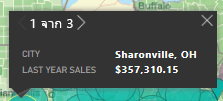
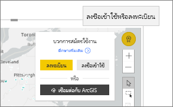

# โต้ตอบกับ ArcGIS maps ใน Power BI
หัวข้อนี้เขียนขึ้นจากมุมมองของบุคคลที่ใช้แผนที่ ArcGIS ในบริการ Power BI เดสก์ท็อป หรืออุปกรณ์เคลื่อนที่ เมื่อผู้ออกแบบแชร์แผนที่ ArcGIS สำหรับวิชวล Power BI กับคุณ มีหลายวิธีในการโต้ตอบกับวิชวลนั้น  เมื่อต้องการเรียนรู้เพิ่มเติมเกี่ยวกับการสร้างแผนที่ ArcGIS ดู[แผนที่ ArcGIS โดยบทช่วยสอน Esri](../visuals/power-bi-visualization-arcgis.md)

การรวมกันระหว่างแผนที่ ArcGIS และ Power BI ทำให้การนำเสนอจุดต่าง ๆ บนแผนที่ก้าวขึ้นไปอีกระดับ ผู้ออกแบบรายงานเริ่มต้นด้วยแผนที่ และแนบเลเยอร์ข้อมูลประชากรเข้ากับแผนที่นั้น ชุดข้อมูลของเลเยอร์ข้อมูลที่ยึดตามตำแหน่งนี้ (เช่น ข้อมูลประชากร) บนแผนที่ด้วยการวิเคราะห์เชิงพื้นที่สื่อความเข้าใจข้อมูลอย่างลึกซึ้งในการแสดงภาพของคุณ

> [!TIP]
> GIS ย่อมาจากระบบข้อมูลทางภูมิศาสตร์
> 

แผนที่ ArcGIS สำหรับวิชวล Power BI แสดงยอดขายของปีที่แล้วตามเมือง และใช้แผนที่พื้นฐานของถนนและเลเยอร์การอ้างอิงรายได้ครัวเรือนโดยเฉลี่ย แผนที่มีสองหมุด (แดงและเหลือง) และหนึ่งรัศมีเวลาในการขับขี่ (เป็นสีม่วง)

> [!TIP]
> เยี่ยมชม[หน้าของ Esri บน Power BI](https://www.esri.com/powerbi)เพื่อดูตัวอย่างมากมาย และอ่านคำบอกเล่าจากผู้ใช้ แล้วดู[หน้าเริ่มต้นใช้งาน ArcGIS Maps for Power BI ](https://doc.arcgis.com/en/maps-for-powerbi/get-started/about-maps-for-power-bi.htm)ของ Esri
> 
> 

## ความยินยอมของผู้ใช้

ในครั้งแรกที่เพื่อนร่วมงานที่แชร์แผนที่ ArcGIS กับคุณ Power BI จะแสดงพร้อมท์ความยินยอม ArcGIS Maps for Power BI จะมีให้โดย Esri (https://www.esri.com) และการใช้ ArcGIS Maps for Power BI ต้องอยู่ภายใต้ข้อกำหนดและนโยบายความเป็นส่วนตัวของ Esri Power BI ผู้ขอเมื่อต้องใช้ ArcGIS Maps for Power BI ภาพจำเป็นต้องยอมรับกล่องโต้ตอบได้รับความยินยอม

## ทำความเข้าใจเลเยอร์

วิชวล ArcGIS Maps for Power BI อาจมีเลเยอร์ของข้อมูลตำแหน่งที่ตั้งหลายชนิดที่แตกต่างกัน

### แผนที่พื้นฐาน

วิชวล ArcGIS Maps for Power BI แต่ละรายการเริ่มต้นด้วยแผนที่พื้นฐาน คิดว่าแผนที่พื้นฐานเป็นพื้นที่ทำงานสำหรับข้อมูล แผนที่พื้นฐานอาจเป็นพื้นที่เข้มหรือสว่างโดยพื้นฐาน

 

หรือพื้นที่ทำงานที่มีรายละเอียดถนนและการขนส่ง 

  

แผนที่พื้นฐานจะถูกนำไปใช้กับพื้นที่ทำงานทั้งหมด เมื่อคุณเลื่อนและย่อ/ขยาย แผนที่จะอัปเดต ซูมเข้าเพื่อดูรายละเอียดเพิ่มเติมเกี่ยวกับถนนและข้อมูลการขนส่ง เลื่อนจากทวีปหนึ่งไปยังอีกทวิปหนึ่ง และระดับของรายละเอียดยังคงคงที่ ที่นี่ เราได้เลื่อนจากปอร์โตไปยังปักกิ่ง

  

### เลเยอร์การอ้างอิง

*ผู้ออกแบบ*รายงานสามารถเพิ่มเลเยอร์การอ้างอิงได้หนึ่งเลเยอร์ เลเยอร์การอ้างอิงจะได้รับการโฮสต์โดย Esri และมีเลเยอร์ของข้อมูลประชากรเพิ่มเติมเกี่ยวกับตำแหน่งที่ตั้ง ตัวอย่างด้านล่างมีเลเยอร์การอ้างอิงสำหรับความหนาแน่นของประชากร สีเข้มขึ้นแสดงความหนาแน่นสูง

  

### อินโฟกราฟิก

*ผู้ออกแบบ*รายงานสามารถเพิ่มเลเยอร์อินโฟกราฟิกจำนวนมากได้ อินโฟกราฟิกเป็นตัวบ่งชี้วิชวลด่วนที่จะปรากฏทางด้านขวาของพื้นที่ทำงานของวิชวล อินโฟกราฟิกจะได้รับการโฮสต์โดย Esri และมีเลเยอร์ของข้อมูลประชากรเพิ่มเติมเกี่ยวกับตำแหน่งที่ตั้ง ตัวอย่างด้านล่างมีสามอินโฟกราฟิกที่นำไปใช้ ซึ่งจะไม่แสดงบนแผนที่ แต่แสดงบนการ์ด การ์ดอินโฟกราฟิกจะอัปเดตเมื่อคุณซูม เลื่อน และเลือกพื้นที่บนแผนที่

  

### หมุด

หมุดแสดงตำแหน่งที่ตั้งที่แม่นยำเช่น เมือง หรือที่อยู่ บางครั้ง*ผู้ออกแบบ*รายงานจะใช้หมุดกับรัศมีเวลาในการขับรถ ตัวอย่างนี้แสดงร้านค้าภายในรัศมี 50 ไมล์ของ Charlotte, North Carolina

 

## โต้ตอบกับ ArcGIS Maps สำหรับวิชวล Power BI
คุณลักษณะที่คุณใช้ได้จะขึ้นอยู่กับวิธีการแชร์รายงาน และประเภทบัญชี Power BI ตรวจสอบกับผู้ดูแลระบบหากคุณมีข้อสงสัย วิชวล ArcGIS Maps for Power BI ทำงานเหมือนกับวิชวลอื่น ๆ ในรายงาน คุณจะสามารถ [แสดงข้อมูลที่ใช้ในการสร้างการแสดงภาพ](../consumer/end-user-show-data.md)ดูแผนที่ใน[โหมดโฟกัสและโหมดเต็มหน้าจอ](../consumer/end-user-focus.md)[เพิ่มข้อคิดเห็น](../consumer/end-user-comment.md)[โต้ตอบกับตัวกรองที่](../consumer/end-user-report-filter.md)ตั้งค่าโดย*ผู้ออกแบบ*รายงาน และ อื่น ๆ อีกมากมาย วิชวล ArcGIS สามารถกรองข้ามวิชวลอื่น ๆ บนหน้ารายงานและในทางกลับกัน

วางเมาส์เหนือตำแหน่งแผนที่พื้นฐาน (ตัวอย่างเช่น ฟอง) เพื่อแสดงคำแนะนำเครื่องมือ นอกจากนี้ให้ใช้เครื่องมือการเลือกวิชวล ArcGIS เพื่อแสดงคำแนะนำเครื่องมือเพิ่มเติม และเพื่อทำการเลือกเฉพาะบนแผนที่พื้นฐานหรือเลเยอร์การอ้างอิง  

### เติมรายการที่เลือก

ArcGIS Maps for Power BI มีโหมดการเลือกห้าโหมด คุณสามารถเลือกจุดข้อมูลได้สูงสุด 250 จุดในแต่ละครั้ง

#### เครื่องมือที่เลือกเพียงครั้งเดียว

 

เลือกจุดข้อมูล ฟองน้ำ หมุด หรือจุดข้อมูลแต่ละจุดจากเลเยอร์การอ้างอิง Power BI จะแสดงคำแนะนำเครื่องมือที่มีรายละเอียดเกี่ยวกับการเลือกของคุณ การเลือกเพียงครั้งเดียวจะกรองข้ามวิชวลอื่น ๆ ในหน้ารายงานตามการเลือกของคุณ และอัปเดตการ์ดอินโฟกราฟิกสำหรับพื้นที่ที่เลือก 

ที่นี่เราได้เลือกจุดข้อมูลฟองสีน้ำตาลจากแผนที่พื้นฐานของเรา Power BI:
- ไฮไลท์การเลือกของเรา
- แสดงคำแนะนำเครื่องมือสำหรับจุดข้อมูลนั้น 
- อัปเดตการ์ดอินโฟกราฟิกเพื่อแสดงข้อมูลสำหรับการเลือก และ
- ไฮไลท์แผนภูมิคอลัมน์แบบเชื่อมโยง

ถ้าแผนที่มีเลเยอร์การอ้างอิง การเลือกตำแหน่งที่ตั้งจะแสดงรายละเอียดในคำแนะนำเครื่องมือ ที่นี่เราได้เลือกประเทศ Seneca และดูข้อมูลจากเลเยอร์การอ้างอิง (ความหนาแน่นของประชากร) ที่*่ผู้ออกแบบ*รายงานเพิ่มลงในแผนที่ ในตัวอย่างนี้ จุดข้อมูลของเรามีสองประเทศที่แตกต่างกัน ดังนั้นคำแนะนำเครื่องมือของเราจึงมีสองหน้า แต่ละหน้ามีแผนภูมิ เลือกแถบบนแผนภูมิเพื่อแสดงรายละเอียดเพิ่มเติม 

> [!TIP]
  > ในบางครั้ง คุณสามารถลดจำนวนหน้าคำแนะนำเครื่องมือได้โดยการย่อ/ขยายเพื่อเลือกตำแหน่งที่ตั้งที่ระบุ  มิฉะนั้น ถ้ามีจะซ้อนทับตำแหน่งที่ตั้ง Power BI อาจนำเสนอคุณแนะนำเครื่องมือมากกว่า 1 ในแต่ละครั้ง เลือกลูกศรเพื่อย้ายไปมาระหว่างคำแนะนำเครื่องมือ
  > 
  > 

#### เครื่องมือเลือกหลายรายการ

 

วาดสี่เหลี่ยมผืนผ้าบนแผนที่ และเลือกจุดข้อมูลที่อยู่ภายใน ใช้ CTRL เพื่อเลือกพื้นที่สี่เหลี่ยมผืนผ้ามากกว่าหนึ่งรายการ การเลือกหลายรายการจะอัปเดตการ์ดอินโฟกราฟิกสำหรับพื้นที่ที่เลือก และจะกรองข้ามวิชวลอื่น ๆ ในหน้ารายงานตามการเลือกของคุณ

 

#### เครื่องเลเยอร์การอ้างอิง

 

ใช้ขอบเขตหรือรูปหลายเหลี่ยมภายในเลเยอร์อ้างอิง เพื่อใช้เลือกจุดข้อมูลที่อยู่ภายใน มันยากที่จะเห็นแต่มีเค้าร่างสีเหลืองบนเลเยอร์การอ้างอิง ซึ่งแตกต่างจากเครื่องมือที่เลือกเพียงครั้งเดียว เราจะไม่ได้รับคำแนะนำเครื่องมือ แต่เราจะได้รับข้อมูลเกี่ยวกับจุดข้อมูลใด ๆ ที่อยู่ภายในเส้นขอบของเค้าร่างนั้น ในตัวอย่างนี้ การเลือกของเราจะประกอบด้วยจุดข้อมูล สำหรับร้านค้า Lindseys ใน Winston Salem

 

#### เครื่องมือบัฟเฟอร์

 

อนุญาตให้เลือกจุดข้อมูลโดยใช้เลเยอร์บัฟเฟอร์ ตัวอย่างเช่น ใช้เครื่องมือนี้เพื่อเลือกรัศมีในเวลาการขับรถ และยังคงโต้ตอบกับรายงานที่เหลือ รัศมีเวลาในการขับรถยังคงใช้งานอยู่และการ์ดอินโฟกราฟิกยังคงแสดงรัศมีเวลาในการขับรถ แต่เลือกจุดข้อมูลอื่น ๆ บนแผนที่จะกรองข้ามวิชวลอื่น ๆ บนหน้ารายงาน

 

#### เครื่องมือค้นหาที่คล้ายกัน

 

ช่วยให้คุณสามารถค้นหาตำแหน่งที่ตั้งที่มีแอตทริบิวต์ที่คล้ายกัน คุณเริ่มต้นโดยการเลือกจุดที่น่าสนใจหรือสถานที่อ้างอิงอย่างน้อยหนึ่งรายการ โดยกำหนดได้มากถึงห้าขนาดที่คุณต้องการใช้ในการวิเคราะห์ ค้นหาที่คล้ายกันจากนั้นคำนวณตำแหน่งที่ตั้ง 10 จุดบนแผนที่ที่เหมือนกับตำแหน่งการอ้างอิงที่คุณกำหนดไว้ จากนั้นคุณสามารถใช้การ์ดอินโฟกราฟิกเพื่อเรียนรู้เพิ่มเติมเกี่ยวกับข้อมูลประชากรผ่านผลลัพธ์แต่ละรายการของคุณ สร้างพื้นที่เวลาในการขับรถเพื่อให้เข้าใจถึงสิ่งที่อยู่ภายในระยะทางการขับรถของแต่ละตำแหน่งที่ตั้งเหล่านี้ หรือแม้กระทั่งใช้เครื่องมือค้นหาที่คล้ายกันเพื่อกรองรายงานของคุณและรับข้อมูลเชิงลึกเพิ่มเติม สิ่งสำคัญที่สุดคือการคำนวณทั้งหมดจะทำภายในเครื่องของคุณ ดังนั้นคุณจึงมั่นใจได้ว่าข้อมูลที่เป็นความลับของคุณยังคงได้รับการป้องกัน

## ข้อควรพิจารณาและข้อจำกัด
ArcGIS Maps for Power BI มีให้ใช้งานในบริการและแอปพลิเคชันต่อไปนี้:

|บริการ/แอป  |ความพร้อมใช้งาน  |
|---------|---------|
|Power BI Desktop     |     ใช่    |
|บริการ power BI (app.powerbi.com)     |    ใช่     |
|แอปพลิเคชัน Power BI สำหรับอุปกรณ์เคลื่อนที่     |  ใช่      |
|Power BI ที่เผยแพร่ไปยังเว็บ     |  ไม่ใช่       |
|Power BI Embedded     |     ไม่ใช่    |
|บริการของ power BI ที่ฝังตัว (PowerBI.com)  | ไม่ใช่ |

## ArcGIS Maps for Power BI ทำงานร่วมกันอย่างไร
ArcGIS Maps for Power BI ให้บริการโดย Esri (https://www.esri.com) การใช้ ArcGIS Maps for Power BI ของคุณ ต้องอยู่ภายใต้[ข้อกำหนด](https://go.microsoft.com/fwlink/?LinkID=8263222)และ[นโยบายความเป็นส่วนตัว](https://go.microsoft.com/fwlink/?LinkID=826323)ของ Esri ผู้ใช้ Power BI ที่ต้องการใช้วิชวล ArcGIS Maps for Power BI จำเป็นต้องตอบรับในกล่องโต้ตอบความยินยอม (ดู ความยินยอมของผู้ใช้ สำหรับรายละเอียด)  การใช้ ArcGIS Maps for Power BI ของ Esri ต้องอยู่ภายใต้ข้อกำหนดและนโยบายความเป็นส่วนตัวของ Esri ซึ่งเชื่อมโยงไปยังจากกล่องโต้ตอบความยินยอม แต่ละผู้ใช้ต้องยินยอมก่อนที่จะใช้ ArcGIS Maps for Power BI เป็นครั้งแรก ทันทีที่ผู้ใช้ตอบรับความยินยอม ข้อมูลที่ผูกไว้กับวิชวล จะถูกส่งไปยังบริการของ Esri อย่างน้อยสำหรับการกำหนดรหัสพิกัด ซึ่งหมายถึงการแปลงข้อมูลตำแหน่งที่ตั้ง ไปเป็นข้อมูลละติจูดและลองจิจูดที่สามารถแสดงบนแผนที่ได้ คุณควรถือว่า ข้อมูลใด ๆ ที่ผูกอยู่กับการแสดงภาพข้อมูล สามารถถูกส่งไปยังบริการของ Esri Esri มีบริการต่าง ๆ เช่น แผนที่พื้นฐาน การวิเคราะห์เชิงพื้นที่ กำหนดรหัสพิกัด เป็นต้น วิชวล ArcGIS Maps for Power BI โต้ตอบกับบริการเหล่านี้โดยใช้การเชื่อมต่อ SSL ที่ป้องกันโดยใบรับรองที่ให้และดูแลรักษาโดย Esri สามารถรับข้อมูลเพิ่มเติมเกี่ยวกับ ArcGIS Maps for Power BI จาก[หน้าผลิตภัณฑ์ ArcGIS Maps for Power BI](https://www.esri.com/powerbi) ของ Esri ได้

### Power BI Plus

เมื่อผู้ใช้ลงทะเบียนสมัครใช้บริการ Plus ที่ให้บริการโดย Esri ผ่านทาง ArcGIS Maps for Power BI พวกเขากำลังติดต่อโดยตรงกับทาง Esri Power BI ไม่ส่งข้อมูลส่วนบุคคลเกี่ยวกับผู้ใช้ไปให้ Esri ผู้ใช้ลงชื่อเข้าใช้ และเชื่อถือแอปพลิเคชัน AAD ของ Esri ด้วยข้อมูลประจำตัว AAD ของพวกเขาเอง จากการทำเช่นนั้น ผู้ใช้ที่จะแชร์ข้อมูลส่วนบุคคลของพวกเขาโดยตรงกับ Esri เมื่อผู้ใช้เพิ่มเนื้อหา Plus ลงในวิชวล ArcGIS Maps for Power BI เพื่อนร่วมงานที่ต้องการดูหรือแก้ไขวิชวลนั้นจะต้องเป็นสมาชิก Plus จาก Esri ด้วย 

สำหรับการคำถามทางเทคนิคโดยละเอียด เกี่ยวกับวิธีการทำงานของ ArcGIS Maps for Power BI ของ Esri สื่อสารผ่านไซต์ฝ่ายสนับสนุนของ Esri

## ข้อควรพิจารณาและการแก้ไขปัญหา

**ไม่สามารถแสดงแผนที่ ArcGIS**    
ในบริการหรือแอปพลิเคชันที่ไม่มี ArcGIS Maps for Power BI ให้ใช้งาน การแสดงภาพจะแสดงเป็นวิชวลว่าง ที่มีโลโก้ Power BI

**ฉันไม่เห็นข้อมูลของฉันทั้งหมดบนแผนที่**    
เมื่อทำการระบุตำแหน่งละติจูด/ลองติจูดบนแผนที่ จะมีจุดข้อมูลสูงสุด 30,000 จุดแสดงขึ้น เมื่อทำการระบุตำแหน่งจุดข้อมูลเช่น รหัสไปรษณีย์หรือที่อยู่ จะมีการระบุตำแหน่งจุดข้อมูลแรก 15,000 จุดเท่านั้น การกำหนดรหัสพิกัด ชื่อสถานที่ หรือประเทศ ไม่อยู่ในข้อจำกัด 1500 สถานที่

**มีค่าธรรมเนียมใด ๆ สำหรับการใช้ ArcGIS Maps for Power BI หรือไม่**

แผนที่ ArcGIS สำหรับ Power BI มีให้สำหรับผู้ใช้ Power BI ทั้งหมดโดยไม่มีค่าใช้จ่ายเพิ่มเติม ซึ่งเป็นคอมโพเนนต์ที่ให้โดย **Esri** และการใช้งานจะขึ้นอยู่กับข้อกำหนดและนโยบายความเป็นส่วนตัวที่ให้โดย **Esri** ตามที่ระบุไว้ก่อนหน้านี้ในบทความ ถ้าคุณสมัครใช้งาน ArcGIS **Plus**จะมีค่าใช้จ่าย

**ฉันได้รับข้อผิดพลาดเกี่ยวกับแคของฉันกำลังแบบเต็ม**

ลักษณะการทำงานนี้เป็นข้อผิดพลาดที่จะได้รับการแก้ไข  ในระหว่างนี้ เลือกลิงก์ที่ปรากฏในข้อความข้อผิดพลาดสำหรับคำแนะนำในการล้างแคช Power BI ของคุณ

**ฉันสามารถดู ArcGIS maps ของฉันแบบออฟไลน์ได้หรือไม่**

ไม่ Power BI จำเป็นต้องเชื่อมต่อเครือข่ายเมื่อต้องแสดงแผนที่แบบ

## ขั้นตอนถัดไป
การขอความช่วยเหลือ: **Esri** มี[เอกสารประกอบที่ครอบคลุม](https://go.microsoft.com/fwlink/?LinkID=828772)ชุดคุณลักษณะของ **ArcGIS Maps for Power BI**

คุณสามารถถามคำถาม ค้นหาข้อมูลล่าสุด รายงานปัญหา และค้นหาคำตอบใน[กระทู้ ชุมชน Power BI ที่เกี่ยวข้องกับ **ArcGIS Maps for Power BI**](https://go.microsoft.com/fwlink/?LinkID=828771) ได้

[หน้าผลิตภัณฑ์ ArcGIS Maps for Power BI](https://www.esri.com/powerbi)
