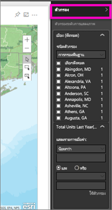
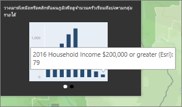

# โต้ตอบกับ ArcGIS แมปใน Power BI
หัวข้อนี้ถูกเขียนจากมุมมองของจุดของบุคคล*ใช้*แผน ArcGIS ในบริการ Power BI เดสก์ท็อป หรืออุปกรณ์เคลื่อนที่ เมื่อผู้สร้างการแชร์การแมป ArcGIS กับคุณ มีหลายวิธีในการโต้ตอบกับแผนผังนั้น  เมื่อต้องการเรียนรู้เพิ่มเติมเกี่ยวกับการสร้างแผนผังมี ArcGIS ดู[ArcGIS แมป โดยบทช่วยสอนทาง esri](../visuals/power-bi-visualization-arcgis.md)

ชุดข้อมูลของ ArcGIS แผนที่ และ Power BI นำการแมปนอกเหนือจากงานนำเสนอของจุดบนแผนที่ไปยังระดับใหม่ทั้งหมด ตัวเลือกที่พร้อมใช้งานสำหรับแผนที่พื้นฐาน ชนิดตำแหน่งที่ตั้ง ธีม สไตล์สัญลักษณ์ และเลเยอร์อ้างอิงสร้างการแสดงภาพของแผนที่มีข้อมูลครบครัน gorgeous ชุดข้อมูลของเลเยอร์ข้อมูลอย่างเป็นทางการ (เช่นข้อมูล census) บนแผนที่ด้วยการวิเคราะห์เชิงพื้นที่บ่งบอกเพิ้อทำความเข้าใจของข้อมูลในการแสดงภาพของคุณ

> [!TIP]
> GIS ย่อมาจากระบบข้อมูลทางภูมิศาสตร์
> 

ตัวอย่างที่เราใช้การดูที่ยอดขายของปีที่แล้วเรียงลำดับตามเมือง และใช้ basemap ถนน สัญลักษณ์ฟองเพื่อแสดงขนาด และชั้นที่อ้างอิงสำหรับรายได้ภายในบ้านโดยเฉลี่ย แผนที่ประกอบด้วยหมุด 3 และรัศมีไดรฟ์หนึ่งครั้ง (เป็นสีม่วง)

> [!TIP]
> เยี่ยมชม[หน้าของทาง esri บน Power BI](https://www.esri.com/powerbi)เพื่อดูตัวอย่างมาก และอ่านคำบอกเล่าจาก แล้วดู[หน้าเริ่มต้นใช้งาน ArcGIS Maps for Power BI ](https://doc.arcgis.com/en/maps-for-powerbi/get-started/about-maps-for-power-bi.htm)ของทาง esri
> 
> 

 

## ความยินยอมของผู้ใช้
ในครั้งแรกที่เพื่อนร่วมงานที่ใช้ร่วมกันแผน ArcGIS กับคุณ Power BI จะแสดงพร้อมท์ใน ArcGIS Maps for Power BI จะมีให้ทาง Esri (www.esri.com) และการใช้ ArcGIS Maps for Power BI เป็นชื่อเรื่อง โดยข้อกำหนดและนโยบายความเป็นส่วนตัวของทาง Esri Power BI ผู้ขอเมื่อต้องใช้ ArcGIS Maps for Power BI ภาพจำเป็นต้องยอมรับกล่องโต้ตอบได้รับความยินยอม

## เติมรายการที่เลือก
ArcGIS Maps for Power BI ให้ 3 โหมดตัวเลือก คุณสามารถเลือกสูงสุดของจุดข้อมูล 250 ในแต่ละครั้ง

 เลือกแต่ละจุดข้อมูล

 วาดสี่เหลี่ยมผืนผ้าบนแผนที่ และเลือกจุดข้อมูลที่มีอยู่ ใช้ CTRL เพื่อเลือกพื้นที่สี่เหลี่ยมผืนผ้ามากกว่าหนึ่งรายการ

 อนุญาตให้ขอบเขตหรือรูปหลายเหลี่ยมภายในเลเยอร์อ้างอิงที่จะใช้เมื่อต้องเลือกจุดข้อมูลที่มีอยู่

 

## โต้ตอบกับแผน ArcGIS
ฟีเจอร์พร้อมใช้งานคุณขึ้นอยู่กับว่าคุณเป็น*creator* (บุคคลที่ทำการแมป) หรือ*ผู้บริโภค*(บุคคลที่ใช้ร่วมกันแผน ArcGIS กับคุณ) ถ้าคุณโต้ตอบกับแผน ArcGIS ที่เป็นผู้บริโภค (หรือ[มุมมองการอ่าน](../consumer/end-user-reading-view.md)ต่อไปนี้เป็นการกระทำที่คุณใช้งาน

* ถ้าคุณเป็นผู้ใช้พรีเมียม และได้สิทธิ์*มุมมอง* คุณจะสามารถ[ดูข้อมูลที่ใช้เพื่อสร้างการแสดงภาพ](../consumer/end-user-show-data.md) [สมัครใช้งาน](../consumer/end-user-subscribe.md) ดูแผนที่ใน[โหมดโฟกัสและโหมดเต็มหน้าจอ](../consumer/end-user-focus.md) [ดูเนื้อหาที่เกี่ยวข้อง](../consumer/end-user-related.md) [โต้ตอบกับตัวกรอง](../consumer/end-user-report-filter.md)ที่ตั้งค่าไว้โดย*ผู้สร้างรายงาน* [แชร์รายงาน](../service-share-reports.md) และอื่นๆ

* ด้วยการแสดงภาพประเภทอื่น ผู้ใช้ของ Power BI **Pro** สามารถทำได้ทุกอย่างที่ผู้ใช้พรีเมียมทำได้ รวมทั้ง [ส่งออกข้อมูลที่จำเป็น](../visuals/power-bi-visualization-export-data.md) [รับเมทริกซ์การใช้งาน](../service-usage-metrics.md) บันทึกสำเนาและ[เผยแพร่ไปยังเว็บ](../service-publish-to-web.md) และอื่นๆ

    
* ขยายการ**ตัวกรอง**บานหน้าต่างเพื่อสำรวจแมปโดยใช้ตัวกรอง   
      
* ถ้าแผนที่คุณมีเลเยอร์อ้างอิง เลือกตำแหน่งที่ตั้งเมื่อต้องแสดงรายละเอียดในคำแนะนำ ต่อไปนี้เราได้เลือกเขตเอี่ยมศิริ และดูข้อมูลจากการอ้างอิงรายได้ภายในบ้านเฉลี่ยเลเยอร์ creator ที่เพิ่มลงในแผนผัง
  
      
  
    ในกรณีนี้ เรายังได้รับแผนภูมิ เลือกแท่งในแผนภูมิเพื่อเจาะลึกลงในข้อมูล ต่อไปนี้เราเห็นว่า ครอบครัว 79 ตัวซึ่งในเขตเอี่ยมศิริราย $200,000 ต่อ หรือมากกว่า
  
    
  
    เลือกลูกศรเมื่อต้องแสดงแผนภูมิใด ๆ เพิ่มเติม
* โฮเวอร์เหนือสัญลักษณ์ตำแหน่งที่ตั้ง basemap เมื่อต้องแสดงรายละเอียดในคำแนะนำ     
  
  
  > [!TIP]
  > คุณอาจต้องการย่อ/ขยายในเมื่อต้องเลือกตำแหน่งที่ตั้งที่เฉพาะเจาะจง  มิฉะนั้น ถ้ามีจะซ้อนทับตำแหน่งที่ตั้ง Power BI อาจนำเสนอคุณแนะนำเครื่องมือมากกว่า 1 ในแต่ละครั้ง เลือกลูกศรเพื่อย้ายไปมาระหว่างคำแนะนำเครื่องมือ
  > 
  > 
  > 
  > 
* ถ้าผู้สร้างมีเพิ่มเลเยอร์โฟร์มีการแมป ArcGIS คุณจะเห็นข้อมูลเพิ่มเติมที่แสดงในมุมขวาบนของแมป  ตัวอย่างเช่น นี่ผู้สร้างแผนผังเพิ่ม “เด็กอายุไม่เกิน 14 ปี”
  
    

## ข้อควรพิจารณาและข้อจำกัด
ArcGIS Maps for Power BI มีให้ใช้งานในบริการและแอปพลิเคชันต่อไปนี้:

<table>
<tr><th>บริการ/แอป</th><th>ความพร้อมใช้งาน</th></tr>
<tr>
<td>Power BI Desktop</td>
<td>ใช่</td>
</tr>
<tr>
<td>บริการ power BI (app.powerbi.com)</td>
<td>ใช่</td>
</tr>
<tr>
<td>แอปพลิเคชัน Power BI สำหรับอุปกรณ์เคลื่อนที่</td>
<td>ใช่</td>
</tr>
<tr>
<td>Power BI ที่เผยแพร่ไปยังเว็บ</td>
<td>ไม่ใช่</td>
</tr>
<tr>
<td>Power BI ที่ฝังตัว</td>
<td>ไม่ใช่</td>
</tr>
<tr>
<td>บริการของ power BI ที่ฝังตัว (PowerBI.com)</td>
<td>ไม่ใช่</td>
</tr>
</table>

**วิธีทำ ArcGIS Maps for Power BI ทำงานร่วมกันอย่างไร**
ArcGIS Maps for Power BI ให้บริการโดย Esri (www.esri.com) การใช้ ArcGIS Maps for Power BI ของคุณ ต้องอยู่ภายใต้[ข้อกำหนด](https://go.microsoft.com/fwlink/?LinkID=8263222)และ[นโยบายความเป็นส่วนตัว](https://go.microsoft.com/fwlink/?LinkID=826323)ของ Esri ผู้ใช้ Power BI ที่ต้องการใช้วิชวล ArcGIS Maps for Power BI จำเป็นต้องตอบรับในกล่องโต้ตอบความยินยอม (ดู ความยินยอมของผู้ใช้ สำหรับรายละเอียด)  การใช้ ArcGIS Maps for Power BI ต้องอยู่ภายใต้ข้อกำหนดและนโยบายความเป็นส่วนตัวของ Esri ซึ่งยังได้เชื่อมโยงจากกล่องโต้ตอบความยินยอม แต่ละผู้ใช้ต้องยินยอมก่อนที่จะใช้ ArcGIS Maps for Power BI เป็นครั้งแรก ทันทีที่ผู้ใช้ตอบรับความยินยอม ข้อมูลที่ผูกไว้กับวิชวล จะถูกส่งไปยังบริการของ Esri อย่างน้อยสำหรับการกำหนดรหัสพิกัด ซึ่งหมายถึงการแปลงข้อมูลตำแหน่งที่ตั้ง ไปเป็นข้อมูลละติจูดและลองจิจูดที่สามารถแสดงบนแผนที่ได้ คุณควรถือว่า ข้อมูลใด ๆ ที่ผูกอยู่กับการแสดงภาพข้อมูล สามารถถูกส่งไปยังบริการของ Esri Esri มีบริการต่าง ๆ เช่น แผนที่พื้นฐาน การวิเคราะห์เชิงพื้นที่ กำหนดรหัสพิกัด เป็นต้น วิชวล ArcGIS Maps for Power BI โต้ตอบกับบริการเหล่านี้โดยใช้การเชื่อมต่อ SSL ที่ป้องกันโดยใบรับรองที่ให้และดูแลรักษาโดย Esri สามารถรับข้อมูลเพิ่มเติมเกี่ยวกับ ArcGIS Maps for Power BI จาก[หน้าผลิตภัณฑ์ ArcGIS Maps for Power BI](https://www.esri.com/powerbi) ของ Esri ได้

**Power BI Plus**    

เมื่อผู้ใช้ลงทะเบียนสมัครใช้บริการ Plus ที่ให้บริการโดย Esri ผ่านทาง ArcGIS Maps for Power BI พวกเขากำลังติดต่อโดยตรงกับทาง Esri Power BI ไม่ส่งข้อมูลส่วนบุคคลเกี่ยวกับผู้ใช้ไปให้ Esri ผู้ใช้ลงชื่อเข้าใช้ และเชื่อถือแอปพลิเคชัน AAD ของ Esri ด้วยข้อมูลประจำตัว AAD ของพวกเขาเอง จากการทำเช่นนั้น ผู้ใช้ที่จะแชร์ข้อมูลส่วนบุคคลของพวกเขาโดยตรงกับ Esri เมื่อผู้ใช้เพิ่มเนื้อหา Plus ลงในวิชวล ArcGIS Maps for Power BI ผู้ใช้ Power BI อื่นต้องเป็นสมาชิก Plus ด้วย ถึงดูหรือแก้ไขเนื้อหานั้นได้ 

สำหรับการคำถามโดยละเอียดทางเทคนิคเกี่ยวกับวิธีการทำงานของ ArcGIS Maps for Power BI ของทาง Esri สื่อสารกับทาง Esri ผ่านไซต์ฝ่ายสนับสนุนของพวกเขา

**ไม่สามารถแสดงแผนที่ ArcGIS**    
ในบริการหรือแอปพลิเคชันที่ไม่มี ArcGIS Maps for Power BI ให้ใช้งาน การแสดงภาพจะแสดงเป็นวิชวลว่าง ที่มีโลโก้ Power BI

**ฉันไม่เห็นข้อมูลของฉันทั้งหมดบนแผนที่**    
เมื่อทำการระบุตำแหน่งละติจูด/ลองติจูดบนแผนที่ จะมีจุดข้อมูลสูงสุด 30,000 จุดแสดงขึ้น เมื่อทำการระบุตำแหน่งจุดข้อมูลเช่นรหัสไปรษณีย์หรือที่อยู่ จะมีการระบุตำแหน่งจุดข้อมูลแรก 15,000 จุดเท่านั้น การกำหนดรหัสพิกัด ชื่อสถานที่ หรือประเทศ ไม่อยู่ในข้อจำกัด 1500 สถานที่

**มีค่าธรรมเนียมใด ๆ สำหรับการใช้ ArcGIS Maps for Power BI หรือไม่**

แผนที่ ArcGIS สำหรับ Power BI มีให้สำหรับผู้ใช้ Power BI ทั้งหมดโดยไม่มีค่าใช้จ่ายเพิ่มเติม ซึ่งเป็นคอมโพเนนต์ที่ให้โดย **Esri** และการใช้งานจะขึ้นอยู่กับข้อกำหนดและนโยบายความเป็นส่วนตัวที่ให้โดย **Esri** ตามที่ระบุไว้ก่อนหน้านี้ในบทความ ถ้าคุณสมัครใช้งาน ArcGIS **Plus**จะมีค่าใช้จ่าย

**ฉันได้รับข้อผิดพลาดเกี่ยวกับแคของฉันกำลังแบบเต็ม**

นี่คือข้อบกพร่องที่กำลังส่ง  ในระหว่างนี้ เลือกลิงก์ที่ปรากฏในข้อความข้อผิดพลาดสำหรับคำแนะนำในการล้างแคช Power BI ของคุณ

**ฉันสามารถดู ArcGIS maps ของฉันแบบออฟไลน์ได้หรือไม่**

ไม่ Power BI จำเป็นต้องเชื่อมต่อเครือข่ายเมื่อต้องแสดงแผนที่แบบ

## ขั้นตอนถัดไป
การขอความช่วยเหลือ: **Esri** มี[เอกสารประกอบที่ครอบคลุม](https://go.microsoft.com/fwlink/?LinkID=828772)ชุดคุณลักษณะของ **ArcGIS Maps for Power BI**

คุณสามารถถามคำถาม ค้นหาข้อมูลล่าสุด รายงานปัญหา และค้นหาคำตอบใน[กระทู้ ชุมชน Power BI ที่เกี่ยวข้องกับ **ArcGIS Maps for Power BI**](https://go.microsoft.com/fwlink/?LinkID=828771) ได้

[หน้าผลิตภัณฑ์ ArcGIS Maps for Power BI](https://www.esri.com/powerbi)
