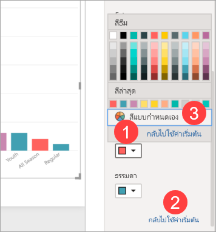

# เริ่มต้นใช้งานบานหน้าต่างการจัดรูปแบบ
หากคุณมีสิทธิ์แก้ไขสำหรับรายงาน มีตัวเลือกการจัดรูปแบบมากมายให้พร้อมใช้งาน ในรายงาน Power BI คุณสามารถเปลี่ยนสีของชุดข้อมูล จุดข้อมูล และแม้แต่พื้นหลังของการแสดงผลข้อมูลด้วยภาพได้ คุณสามารถเปลี่ยนวิธีการแสดงแกน x และแกน y คุณยังสามารถจัดรูปแบบคุณสมบัติแบบอักษรของการแสดงภาพ รูปร่าง และชื่อเรื่องได้ Power BI ช่วยให้คุณสามารถควบคุมวิธีที่รายงานของคุณปรากฏได้อย่างเต็มที่

ในการเริ่มต้น ให้เปิดรายงานใน Power BI Desktop หรือบริการ Power BI ทั้งสองมีตัวเลือกการจัดรูปแบบเกือบเหมือนกัน เมื่อคุณเปิดรายงานในบริการของ Power BI โปรดตรวจสอบให้แน่ใจว่าได้เลือก **แก้ไข** จากแถบเมนู 

เมื่อคุณกำลังแก้ไขรายงาน และคุณมีการแสดงภาพที่เลือกไว้ บานหน้าต่าง**การแสดงภาพ**จะปรากฏขึ้น ใช้บานหน้าต่างนี้เพื่อเปลี่ยนการแสดงภาพ ด้านล่างของบานหน้าต่าง **การแสดงภาพ** จะมีไอคอนสามไอคอน: ไอคอน **เขตข้อมูล** (แถบเรียงซ้อน) ไอคอน **รูปแบบ** (แปรงลูกกลิ้ง) และไอคอน **การวิเคราะห์** (แว่นขยาย) ในรูปด้านล่าง ไอคอน **เขตข้อมูล** ถูกเลือกไว้ โดยสังเกตได้จากแถบสีเหลืองที่อยู่ด้านล่างไอคอน

เมื่อคุณเลือก **รูปแบบ** พื้นที่ด้านล่างไอคอนจะแสดงการกำหนดรูปแบบที่พร้อมใช้งานสำหรับการแสดงภาพที่เลือกไว้ในปัจจุบัน  

คุณสามารถกำหนดองค์ประกอบของแต่ละการแสดงภาพเองได้มากมาย ตัวเลือกที่พร้อมใช้งานขึ้นอยู่กับประเภทของการแสดงภาพที่เลือก บางตัวเลือกเหล่านั้นคือ:

* คำอธิบายแผนภูมิ
* แกน X
* แกน Y
* สีข้อมูล
* ป้ายชื่อข้อมูล
* รูปร่าง
* พื้นที่การลงจุด
* ชื่อเรื่อง
* พื้นหลัง
* ล็อกอัตราส่วน
* เส้นขอบ
* คำแนะนำเครื่องมือ
* ส่วนหัวของวิชวล
* รูปร่าง
* ตำแหน่ง    
และอีกมากมาย

> [!NOTE]
>  
> คุณจะไม่เห็นองค์ประกอบเหล่านี้ทั้งหมดรวมทั้งการแสดงภาพแต่ละชนิด การแสดงภาพที่คุณเลือกไว้จะมีผลต่อรูปแบบการกำหนดเองที่พร้อมใช้งาน ตัวอย่างเช่น คุณจะไม่เห็นแกน X ถ้าคุณมีแผนภูมิวงกลมที่เลือกไว้ เนื่องจากแผนภูมิวงกลมไม่มีแกน X

นอกจากนี้ โปรดทราบว่า ถ้าคุณไม่มีการแสดงภาพที่เลือกไว้ **ตัวกรอง**ก็จะปรากฏขึ้นแทนไอคอนซึ่งจะช่วยให้คุณสามารถนำตัวกรองไปใช้กับการแสดงภาพทั้งหมดในหน้าได้

วิธีที่ดีที่สุดในการเรียนรู้วิธีการใช้ตัวเลือกการจัดรูปแบบคือการลองใช้เครื่องมือเหล่านั้นดู คุณสามารถยกเลิกการเปลี่ยนแปลงของคุณหรือแปลงกลับเป็นค่าเริ่มต้นได้เสมอ มีตัวเลือกมากมายที่พร้อมใช้งานและมีการเพิ่มรายการใหม่ตลอดเวลา ซึ่งเป็นไปไม่ได้ที่จะอธิบายตัวเลือกการจัดรูปแบบทั้งหมดในหนึ่งบทความ แต่เพื่อให้คุณได้เริ่มต้นใช้งาน มาลองทบทวนด้วยกันสักสองสามรายการ 

1. เปลี่ยนสีที่ใช้ในวิชวล   
2. ใช้งานลักษณะ    
3. การเปลี่ยนแปลงคุณสมบัติแกน    
4. เพิ่มป้ายชื่อข้อมูล    

## การใช้งานแบบมีสีสัน

ลองทำตามขั้นตอนสำคัญที่จะต้องใช้ในการกำหนดรูปแบบสีบนการแสดงภาพ

1. เลือกการแสดงภาพเพื่อเปิดใช้งาน

2. เลือกไอคอนแปรงลูกกลิ้งเพื่อเปิดแท็บการจัดรูปแบบ แท็บการจัดรูปแบบจะแสดงองค์ประกอบของการจัดรูปแบบทั้งหมดที่พร้อมใช้งานสำหรับวิชวลที่เลือก

    

3. เลือก **สีข้อมูล** เพื่อขยายการกำหนดเองที่พร้อมใช้งาน  

    

4. เปลี่ยน **แสดงทั้งหมด** เป็นเปิด และเลือกสีที่แตกต่างกันสำหรับคอลัมน์

    

ต่อไปนี้คือเคล็ดลับบางอย่างที่มีประโยชน์สำหรับการทำงานกับสี ตัวเลขในรายการต่อไปนี้จะยังปรากฏอยู่ในหน้าจอต่อไปนี้ โดยจะระบุว่าคุณจะสามารถเข้าใข้งานหรือเปลี่ยนแปลงองค์ประกอบใดบ้างในองค์ประกอบที่มีประโยขน์เหล่านี้

1. ไม่ชอบสีสันใช่ไหม ไม่มีปัญหา เพียงเลือก**แปลงกลับเป็นค่าเริ่มต้น** และสิ่งที่คุณเลือกจะเปลี่ยนกลับเป็นการตั้งค่าเริ่มต้น 

2. ไม่ชอบสีที่เปลี่ยนใช่ไหม เลือก **แปลงกลับเป็นค่าเริ่มต้น** จากด้านล่างของส่วน   **สีข้อมูล**และสีของคุณแปลงกลับเป็นการตั้งค่าเริ่มต้น 

3. ต้องการสีที่คุณไม่เห็นในชุดแบบสีหรือไม่ เพียงเลือก**สีแบบกำหนดเอง** และเลือกจากแถบสเปกตรัมสี  

   

ไม่ได้ชื่นชอบกับการเปลี่ยนแปลงที่คุณเพิ่งทำใช่หรือไม่ ใช ้**CTRL + Z** เมื่อต้องการเลิกทำ ในลักษณะเดียวกับที่คุณใช้ดำเนินการ

## ใช้งานลักษณะกับตาราง
การแสดงภาพ Power BI บางรายการจะมีตัวเลือก **ลักษณะ** ด้วยการคลิกเพียงครั้งเดียว จะมีการใช้ตัวเลือกการจัดรูปแบบเต็มรูปแบบกับการแสดงภาพของคุณทั้งหมดในครั้งเดียว 

1. เลือกตารางหรือเมทริกซ์เพื่อเปิดใช้งาน   
1. เปิดบานหน้าต่างการจัดรูปแบบ และเลือก **ลักษณะ**

   

1. เลือกลักษณะจากรายการดรอปดาวน์ 

   

แม้ว่าหลังจากที่คุณนำลักษณะไปใช้แล้ว คุณสามารถดำเนินการจัดรูปแบบคุณสมบัติต่อได้ ซึ่งรวมถึง สี สำหรับการแสดงภาพนั้น

## การเปลี่ยนแปลงคุณสมบัติแกน

มักจะมีประโยชน์ในการปรับเปลี่ยนแกน X หรือแกน Y คล้ายกับการใช้งานแบบมีสีสัน คุณสามารถปรับเปลี่ยนแกนได้โดยเลือกไอคอนลูกศรชี้ลงทางด้านซ้ายของแกนคุณต้องการเปลี่ยนแปลง ดังที่แสดงในรูปต่อไปนี้  

ในตัวอย่างด้านล่าง เราได้จัดรูปแบบแกน Y โดย:
- ย้ายป้ายชื่อไปยังด้านขวาของการแสดงภาพ

- เปลี่ยนค่าเริ่มต้นเป็นศูนย์

- เปลี่ยนสีตัวอักษรของป้ายชื่อเป็นสีดำ

- เพิ่มขนาดแบบอักษรของป้ายชื่อเป็น 12

- เพิ่มชื่อเรื่องแกน Y

    

คุณสามารถนำป้ายชื่อแกน X ออกได้ ทั้งหมด โดยสลับปุ่มตัวเลือกที่อยู่ด้านข้าง**แกน X** หรือ **แกน Y** คุณยังสามารถเลือกได้ว่าจะเปิดหรือปิดใช้งานชื่อแกนได้ โดยเลือกปุ่มตัวเลือกที่อยู่ถัดจาก**ชื่อเรื่อง**ได้  

## เพิ่มป้ายชื่อข้อมูล    

อีกหนึ่งตัวอย่างสุดท้ายของการจัดรูปแบบก่อนที่คุณจะเริ่มต้นลองทำด้วยตัวคุณเอง  ลองเพิ่มป้ายชื่อข้อมูลลงในแผนภูมิพื้นที่ 

ต่อไปนี้คือรูปภาพ *ก่อน* 

และนี่คือรูปภาพ *หลัง*

เราเลือกการแสดงภาพเพื่อทำให้ใช้งานได้และเปิดแท็บการจัดรูปแบบ  เราเลือก **ป้ายชื่อข้อมูล**และเปิดใช้งาน และเรายังเพิ่มขนาดตัวอักษรเป็น 12 เปลี่ยนตระกูลแบบอักษรเป็น Arial Black เปิด **แสดงพื้นหลัง** และเปลี่ยนพื้นหลังเป็นสีขาวที่มีความโปร่งใส 5%

นี่เป็นเพียงบางส่วนของการจัดรูปแบบที่สามารถทำได้ เปิดรายงานในโหมดการแก้ไขและสนุกกับการสำรวจบานหน้าต่างการจัดรูปแบบเพื่อสร้างการแสดงภาพที่สวยงามและให้ข้อมูล

## ขั้นตอนถัดไป
สำหรับข้อมูลเพิ่มเติม โปรดดูบทความต่อไปนี้:  

* [คำแนะนำและเคล็ดลับในการจัดรูปแบบสีใน Power BI](service-tips-and-tricks-for-color-formatting.md)  
* [การจัดรูปแบบตามเงื่อนไขในตาราง](../desktop-conditional-table-formatting.md)

