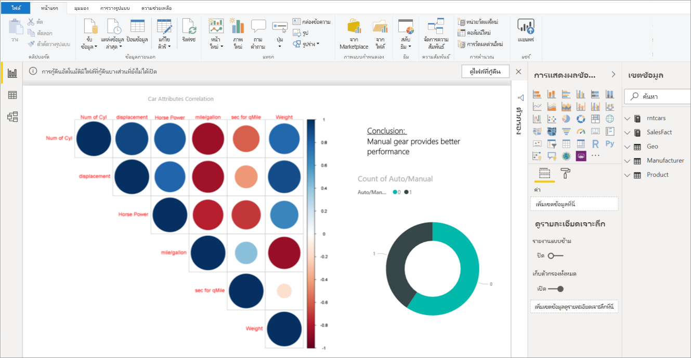
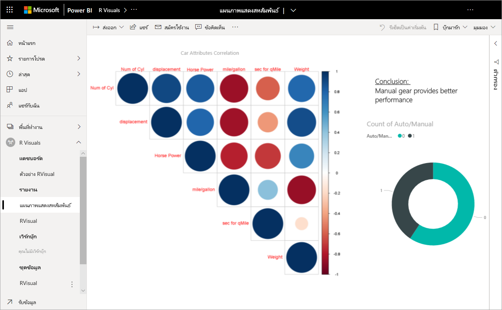
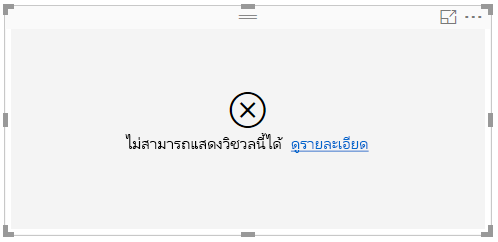
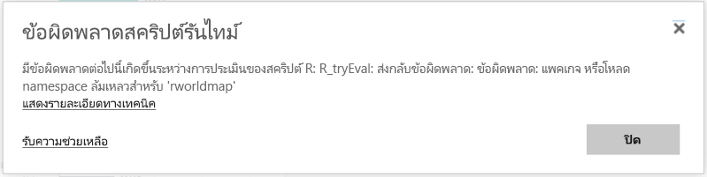

# วิชวล R ใน Power BI
ในปัจจุบันสามารถสร้างภาพ R ได้ใน **Power BI Desktop**เท่านั้น จากนั้นเผยแพร่ไปยังบริการ Power BI สำหรับข้อมูลเพิ่มเติมเกี่ยวกับการสร้างวิชวล R โปรดดู [สร้างวิชวล Power BI โดยใช้ภาษา R ](../desktop-r-visuals.md)

## การดูวิชวล R ในบริการ Power BI
บริการ Power BI สนับสนุนการดูและโต้ตอบกับภาพที่สร้างขึ้น ด้วยสคริปต์ R ภาพที่สร้างขึ้นด้วยสคริปต์ R มักเรียกว่า*ภาพ R* ซึ่งสามารถนำเสนอการปรับรูปร่างข้อมูลและการวิเคราะห์ขั้นสูง เช่น การทำนายโดยใช้การวิเคราะห์ที่มีข้อมูลเต็มเปี่ยมและพลังของการแสดงภาพ R

> [!NOTE]
> [ภาษาการเขียนโปรแกรม R](https://www.r-project.org/)เป็นหนึ่งในภาษาที่ใช้กันอย่างแพร่หลายที่สุดโดยนักสถิติ นักวิทยาศาสตร์ข้อมูล และนักวิเคราะห์ทางธุรกิจในการเขียนโปรแกรม ภาษา R มีชุมชนทรัพยากรเปิดที่นำเสนอแพคเกจที่เพิ่มเข้ามากกว่า 7,000 แพคเกจ รวมถึงแพคเกจที่ใช้งานอย่างแพร่หลายในกลุ่มผู้ใช้ R เวอร์ชัน R ที่ปรับใช้ในบริการ Power BI เป็น *Microsoft R 3.4.4.*
> 
> 

รูปต่อไปนี้แสดงแดชบอร์ด Power BI ที่มีคอลเลกชันของภาพ R ที่ใช้สำหรับการวิเคราะห์ขั้นสูง

ภาพ R จะถูกสร้างขึ้นใน[รายงาน Power BI Desktop](../desktop-get-the-desktop.md) เช่นรายงานที่แสดงในรูปต่อไปนี้

เมื่อสร้างรายงานใน**Power BI Desktop** แล้ว คุณสามารถเผยแพร่รายงานที่ประกอบด้วยอย่างน้อยหนึ่งภาพ R ไปยังบริการ Power BI ได้ 

 ในบริการนี้ไม่ได้รองรับแพ็คเกจ R ทุกแพ็คเกจ ดูแพคเกจที่สนับสนุนที่ส่วนท้ายของบทความนี้สำหรับรายการแพคเกจที่สนับสนุนในบริการ Power BI ในปัจจุบัน

คุณสามารถดาวน์โหลด[ตัวอย่างไฟล์ Power BI Desktop](https://download.microsoft.com/download/D/9/A/D9A65269-D1FC-49F8-8EC3-1217E3A4390F/RVisual_correlation_plot_sample%20SL.pbix) (ไฟล์ .pbix) นี้ที่ประกอบด้วยบางภาพ R เพื่อดูวิธีการทำงานและทดลองใช้ได้

ภาพ R ที่สร้างขึ้นใน**Power BI Desktop** จากนั้นเผยแพร่ไปยังบริการ Power BI ส่วนใหญ่แล้วจะทำงานเหมือนภาพอื่น ๆ ในบริการ Power BI คุณสามารถโต้ตอบ กรอง แบ่งส่วน และปักหมุดภาพเหล่านั้นไปยังแดชบอร์ด หรือแชร์ไฟล์เหล่านั้นกับผู้อื่นได้ สำหรับข้อมูลเพิ่มเติมเกี่ยวกับการแชร์แดชบอร์ดและรูปภาพ ดู[แชร์แดชบอร์ดกับเพื่อนร่วมงานและผู้อื่น](../service-share-dashboards.md) สิ่งหนึ่งที่แตกต่างจากภาพอื่น ๆ คือภาพ R ไม่สามารถแสดงเคล็ดลับเครื่องมือได้ และไม่สามารถใช้เพื่อกรองภาพอื่น ๆ ได้

ดังที่คุณจะเห็นในรูปต่อไปนี้ ภาพ R ในบริการ Power BI ในแดชบอร์ดหรือในรายงาน ส่วนใหญ่แล้วจะปรากฏขึ้นและทำงานเหมือนกับภาพอื่น ๆ และผู้ใช้ไม่จำเป็นทราบสคริปต์ R พื้นฐานที่สร้างภาพนั้นขึ้น

## การรักษาความปลอดภัยสคริปต์ R
ภาพ R ถูกสร้างขึ้นจากสคริปต์ R ซึ่งอาจประกอบด้วยโค้ดที่มีความเสี่ยงต่อความปลอดภัยหรือความเป็นส่วนตัว

ความเสี่ยงเหล่านี้มีอยู่ในขั้นตอนการเขียนเมื่อผู้เขียนสคริปต์เรียกใช้สคริปต์บนคอมพิวเตอร์ของตนเป็นหลัก

บริการ Power BI นำเทคโนโลยี *sandbox* มาใช้เพื่อปกป้องผู้ใช้และบริการจากความเสี่ยงด้านความปลอดภัย

ซึ่ง*sandbox*จะทำให้มีข้อจำกัดบางอย่างบนสคริปต์ R ที่ทำงานในบริการ Power BI เช่น การเข้าถึงอินเทอร์เน็ต หรือการเข้าถึงแหล่งข้อมูลอื่น ๆ ที่ไม่จำเป็นต้องมีสำหรับการสร้างภาพ R

## ประสบการณ์การใช้งานข้อผิดพลาดสคริปต์ R
เมื่อสคริปต์ R พบข้อผิดพลาด ภาพ R จะไม่มีการลงจุดและระบบจะแสดงข้อผิดพลาดขึ้น สำหรับรายละเอียดเกี่ยวกับข้อผิดพลาด เลือก**ดูรายละเอียด**จากข้อผิดพลาดวิชวล R บนพื้นที่ทำงานดังแสดงในรูปภาพดังต่อไปนี้

อีกหนึ่งตัวอย่าง รูปต่อไปนี้แสดงข้อผิดพลาดที่ปรากฏขึ้นเมื่อสคริปต์ R ล้มเหลวในการทำงานอย่างถูกต้องเนื่องจากแพคเกจ R ใน Azure ขาดหายไป

## สิทธิ์การใช้งาน
วิชวล R จำเป็นต้องมีสิทธิ์การใช้งาน [Power BI Pro](../service-self-service-signup-for-power-bi.md) เพื่อแสดงในรายงาน รีเฟรช กรอง และกรองข้าม สำหรับข้อมูลเพิ่มเติมเกี่ยวกับสิทธิ์การใช้งาน Power BI Pro และความแตกต่างจากสิทธิ์การใช้งานฟรี ดู[เนื้อหา Power BI Pro - นี่คืออะไร?](../service-admin-purchasing-power-bi-pro.md)

ผู้ใช้ที่ใช้งาน Power BI ฟรีสามารถใช้ไทล์ที่แชร์กับตนได้เท่านั้นในพื้นที่ทำงานระดับ Premium สำหรับข้อมูลเพิ่มเติม ดู[ซื้อ Power BI Pro](../service-admin-purchasing-power-bi-pro.md)

ตารางต่อไปนี้อธิบายเกี่ยวกับความสามารถของภาพ R ตามสิทธิ์การใช้งาน

|  |ผู้เขียน R วิชวลใน Power BI Desktop  | สร้างรายงานบริการ PBI ด้วยวิชวล R |ดูวิชวล R ในรายงาน  | มุมมองไทล์ R ในแดชบอร์ด |
|---------|---------|---------|---------|--------|
|**ผู้เยี่ยมชม** Power BI Embedded     |  สนับสนุน|  ไม่ได้รับการสนับสนุน      | ได้รับการสนับสนุนในความจุ Premium/Azure เท่านั้น  | ได้รับการสนับสนุนในความจุ Premium/Azure เท่านั้น |
|**ผู้เช่าที่ไม่มีการจัดการ**(ไม่ได้ยืนยันโดเมน) | สนับสนุน | ไม่ได้รับการสนับสนุน |  ไม่ได้รับการสนับสนุน |ได้รับการสนับสนุน (สถานการณ์ B2B) |
|**ผู้เช่าที่ได้รับการจัดการ**ซึ่งมีใบอนุญาตฟรี    |  สนับสนุน       |  ไม่ได้รับการสนับสนุน       |    ได้รับการสนับสนุนในความจุ Premium เท่านั้น    | สนับสนุน |
**ผู้เช่าที่ได้รับการจัดการ**ซึ่งมีใบอนุญาต Pro     |   สนับสนุน      | สนับสนุน      | สนับสนุน    |สนับสนุน|

## ข้อจำกัดที่ทราบ
ภาพ R ในบริการ Power BI มีข้อจำกัดบางอย่าง:

* การสนับสนุนวิชวล R จะถูกจำกัดสำหรับแพคเกจที่ระบุ [ในการเรียนรู้เรื่อง แพคเกจ R ตัวใดบ้างที่ได้รับการสนับสนุน](../service-r-packages-support.md) ในขณะนี้ยังไม่สนับสนุนสำหรับแพคเกจแบบกำหนดเอง
* ข้อจำกัดของขนาดข้อมูล – ข้อมูลที่ใช้โดยภาพ R สำหรับการลงจุดจะถูกจำกัดไว้ที่ 150,000 แถว ถ้าเลือกมากกว่า 150,000 แถว จะมีการใช้งานเฉพาะ 150,000 แถวบนสุด และข้อความจะแสดงบนรูปภาพ
* ข้อจำกัดด้านเวลาคำนวณ – ถ้าการคำนวณภาพ R เกิน 60 วินาทีซึ่งหมดเวลาการดำเนินการสคริปต์ จะส่งผลให้เกิดข้อผิดพลาด
* ภาพ R ได้รับการรีเฟรชเมื่อมีการปรับปรุงข้อมูล การกรอง และการทำไฮไลท์ อย่างไรก็ตาม รูปภาพนั้นไม่ได้เป็นแบบโต้ตอบและไม่สนับสนุนเคล็ดลับเครื่องมือ
* ภาพ R ตอบสนองต่อการทำไฮไลท์ภาพอื่น ๆ แต่คุณไม่สามารถคลิกที่องค์ประกอบในภาพ R เพื่อกรองข้ามองค์ประกอบอื่น ๆ ได้
* ปัจจุบัน ภาพ R ยังไม่สนับสนุนสำหรับชนิดข้อมูลที่เป็น*เวลา* โปรดใช้วันที่/เวลาแทน
* ภาพ R ไม่แสดงเมื่อใช้**เผยแพร่ไปยังเว็บ**
* ในขณะนี้ ภาพ R ไม่สามารถพิมพ์ได้ด้วยการพิมพ์แดชบอร์ดหรือรายงาน
* ภาพ R ไม่สนับสนุนสำหรับโหมด DirectQuery ของ Analysis Services
* วิชวล R มีความสามารถในการแปลงป้ายชื่อข้อความเป็นองค์ประกอบกราฟิก การทำเช่นนี้ในบริการ Power BI ต้องการขั้นตอนเพิ่มเติมต่อไปนี้:
  
  * เพิ่มบรรทัดต่อไปนี้ที่ตอนต้นของสคริปต์ R:
    
        powerbi_rEnableShowText =  1
* ฟอนต์ภาษาจีน ญี่ปุ่น และภาษาเกาหลีจำเป็นต้องดำเนินการตามขั้นตอนต่อไปนี้ทั้งหมดเพื่อให้สามารถทำงานได้อย่างถูกต้องในบริการ Power BI:
  
  * ก่อนอื่น ติดตั้งแพคเกจ R *showtext*และอ้างอิงที่เกี่ยวเนื่องทั้งหมด คุณสามารถดำเนินการนี้ได้โดยการเรียกใช้สคริปต์ต่อไปนี้:
    
        *install.packages("showtext")*
  * ถัดไป เพิ่มบรรทัดต่อไปนี้ที่จุดเริ่มต้นของสคริปต์ R:
    
        powerbi_rEnableShowTextForCJKLanguages =  1

## ภาพรวมของแพคเกจ R
แพคเกจ R เป็นคอลเลกชันของ R ฟังก์ชัน ข้อมูล และการรวมกันของโค้ดที่จะถูกรวมในรูปแบบที่กำหนดไว้อย่างดี เมื่อมีการติดตั้ง R แพคเกจจะมาพร้อมกับชุดมาตรฐาน และแพคเกจอื่น ๆ จะพร้อมสำหรับการดาวน์โหลดและติดตั้ง เมื่อติดตั้งแล้ว คุณจะต้องโหลดแพคเกจ R ลงในเซสชันที่จะใช้ แหล่งข้อมูลหลักของแพคเกจ R ฟรีคือ CRAN [Comprehensive R Archive Network](https://cran.r-project.org/web/packages/available_packages_by_name.html)

**Power BI Desktop**สามารถใช้แพคเกจ R ประเภทใดก็ได้โดยไม่มีข้อจำกัด คุณสามารถติดตั้งแพคเกจ R สำหรับใช้ใน**Power BI Desktop**ด้วยตนเอง (ยกตัวอย่างเช่น โดยใช้[RStudio IDE](https://www.rstudio.com/))

ภาพ R ในการ**บริการ Power BI**สนับสนุนโดยแพคเกจที่พบในส่วน**แพคเกจที่สนับสนุน**ที่ดูได้ใน[บทความนี้](../service-r-packages-support.md) ถ้าคุณไม่พบแพคเกจที่คุณสนใจในรายการแพคเกจที่สนับสนุน คุณสามารถร้องขอการสนับสนุนแพคเกจได้ สำหรับข้อมูลเกี่ยวกับวิธีการขอรับการสนับสนุน ดู[แพคเกจ R ในบริการ Power BI](../service-r-packages-support.md)

### แพ็คเกจข้อกำหนดและขีดจำกัดของ R
มีข้อกำหนดและขีดจำกัดสำหรับแพคเกจ R อยู่เล็กน้อยดังนี้:

* บริการ Power BI ส่วนใหญ่สนับสนุนแพคเกจ R ที่มีใบอนุญาตซอฟต์แวร์แบบเปิดและฟรี เช่น GPL-2 GPL-3 MIT+ และอื่น ๆ
* บริการ Power BI สนับสนุนแพคเกจที่เผยแพร่ใน CRAN บริการไม่สนับสนุนแพคเกจ R ส่วนตัว หรือแบบกำหนดเอง เราแนะนำให้ผู้ใช้งานทำให้แพ็คเกจส่วนตัวของพวกเขาพร้อมใช้งานบน CRAN ก่อนที่จะร้องขอแพ็คเกจที่มีอยู่ในบริการ Power BI
* สำหรับ**Power BI Desktop**มีแพ็คเกจ R ที่แตกต่างกันสองแพ็คเกจ:
  
  * สำหรับภาพ R คุณสามารถติดตั้งแพคเกจใดก็ได้ รวมถึงแพคเกจ R แบบกำหนดเอง
  * สำหรับภาพ R แบบกำหนดเอง เฉพาะแพ็คเกจ CRAN สาธารณะที่สนับสนุนสำหรับการติดตั้งโดยอัตโนมัติของแพคเกจ
* สำหรับเหตุผลทางด้านความปลอดภัยและความเป็นส่วนตัว ปัจจุบันเรายังไม่สนับสนุนแพคเกจ R ที่มีการสอบถามจากไคลเอนต์-เซิร์ฟเวอร์ทั่วเครือข่ายเวิลด์ไวด์เว็บ (เช่น RgoogleMaps) ในบริการ ระบบเครือข่ายบล็อกการกระทำดังกล่าว ดู[แพคเกจ R ในบริการ Power BI](../service-r-packages-support.md)สำหรับรายการของแพคเกจ R ที่สนับสนุนและไม่สนับสนุน
* กระบวนการอนุมัติเพื่อรวมแพ็คเกจ R ใหม่มีแผนภูมิต้นไม้ของความสัมพันธ์ โดยที่บางความสัมพันธ์ต้องมีการติดตั้งในการบริการที่ไม่สนับสนุนก่อน

### แพคเกจ R ที่สนับสนุน:
สำหรับรายการของแพคเกจ R ที่สนับสนุน (และรายการสั้น ๆ ของแพคเกจที่่สนับสนุน) โปรดดูบทความต่อไปนี้:

* [แพคเกจ R ในบริการ Power BI](../service-r-packages-support.md)

