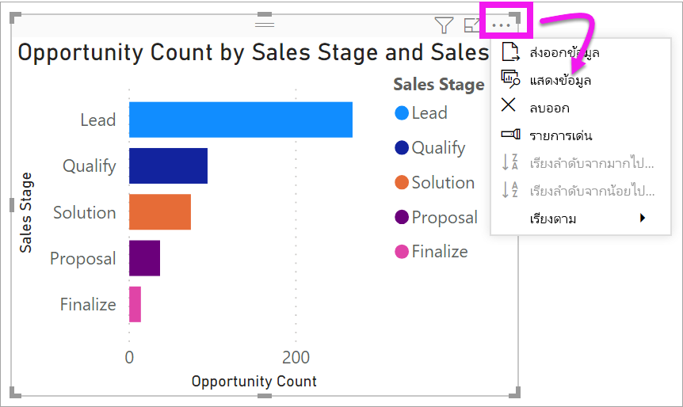
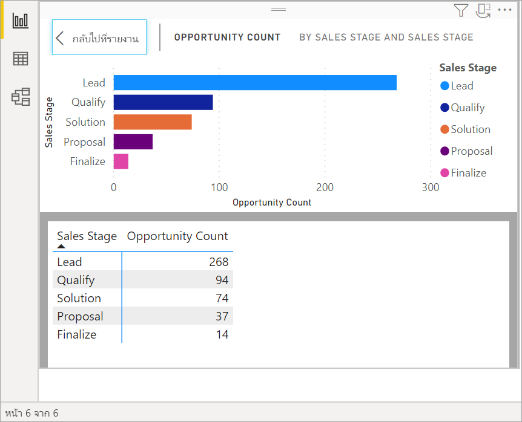
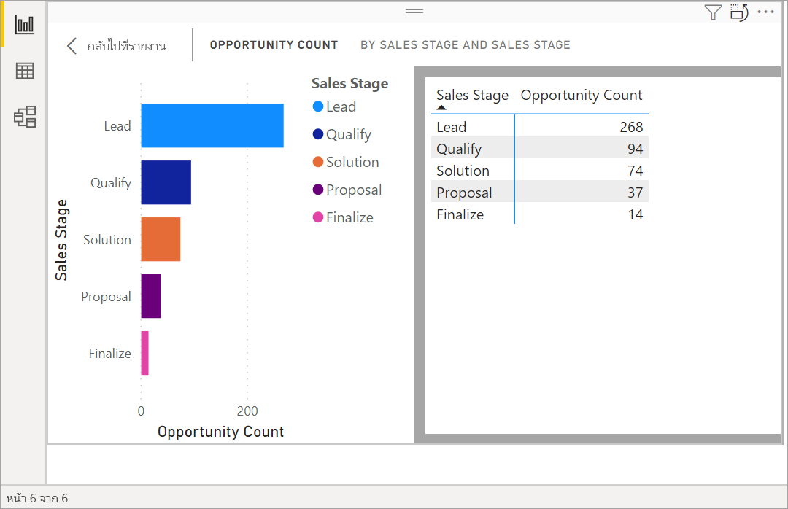
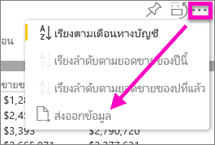
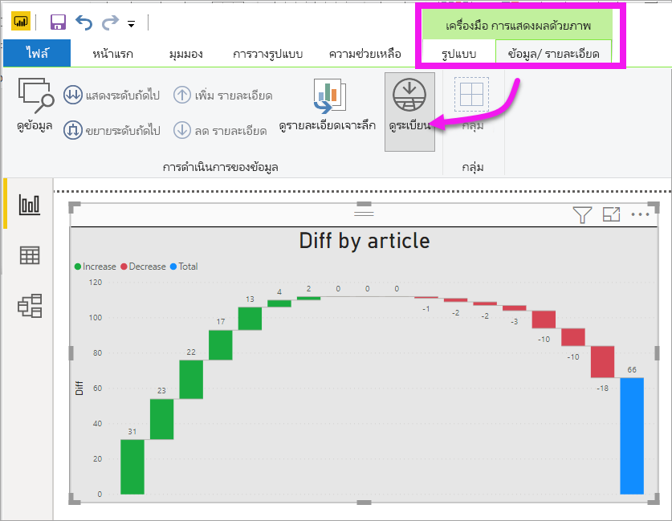
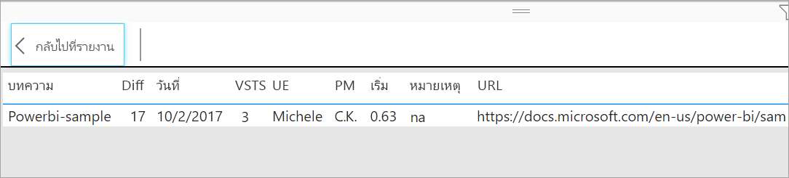

# แสดงข้อมูลเบื้องต้นของการจัดรูปแบบการแสดงข้อมูล

## แสดงข้อมูล
การแสดงภาพ Power BI จะถูกสร้างขึ้นโดยใช้ข้อมูลจากชุดข้อมูลของคุณ หากคุณสนใจที่เห็นเบื้องหลัง Power BI ให้คุณสามารถ*แสดง*ข้อมูลที่กำลังกำลังมีการใช้เพื่อสร้างภาพดังกล่าว เมื่อคุณเลือก**แสดงข้อมูล** Power BI แสดงข้อมูลด้านล่าง (หรือถัดจาก) การแสดงภาพ

นอกจากนี้ คุณยังสามารถส่งออกข้อมูลที่กำลังมีการใช้งานเพื่อสร้างการแสดงภาพเป็นไฟล์ .xlsx หรือ .csv และดูใน Excel สำหรับข้อมูลเพิ่มเติม ดู[ส่งออกข้อมูลจากการแสดงภาพ Power BI](power-bi-visualization-export-data.md)

> [!NOTE]
> ทั้ง*แสดงข้อมูล*และ*ส่งออกข้อมูล*มีใช้งานในบริการ Power BI และ Power BI Desktop อย่างไรก็ตาม Power BI Desktop มีรายละเอียดเพิ่มเติมอีกหนึ่งขั้น [*แสดงบันทึก*จะแสดงแถวจริงจากชุดข้อมูล](../desktop-see-data-see-records.md)
> 
> 

## ใช้*แสดงข้อมูล* 
1. ใน Power BI Desktop ให้เลือกการแสดงผลข้อมูลด้วยภาพเพื่อเปิดใช้งาน

2. เลือก **การดำเนินการเพิ่มเติม** (...) และเลือก **แสดงข้อมูล** 
    

3. ตามค่าเริ่มต้น ข้อมูลจะแสดงที่ด้านล่างภาพ
   
   

4. หากต้องการเปลี่ยนการวางแนว โปรดเลือกเค้าโครงแนวตั้ง  บริเวณมุมบนขวาของการแสดงผลภาพ
   
   
5. เมื่อต้องการส่งออกข้อมูลไปยังไฟล์ .csv เลือกจุดไข่ปลาแล้วเลือก**ส่งออกข้อมูล**
   
    
   
    สำหรับข้อมูลเพิ่มเติมในการส่งออกข้อมูลไปยัง Exel ดู[ส่งออกข้อมูลจากการแสดงภาพ Power BI](power-bi-visualization-export-data.md)
6. เมื่อต้องซ่อนข้อมูล ยกเลิกเลือก**สำรวจ** > **แสดงข้อมูล**

## ใช้แสดงเรกคอร์ด
คุณยังสามารถโฟกัสไปที่ข้อมูลหนึ่งระเบียนในวิชวล และเจาะลึกลงข้อมูลข้างใน 

1. หากต้องการใช้ **ดูเรกคอร์ด** ให้เลือกการแสดงผลข้อมูลด้วยภาพเพื่อเปิดใช้งาน 

2. ในริบบอน Desktop ให้เลือกแท็บสำหรับ **เครื่องมือวิชวล** > **ข้อมูล/เจาะรายละเอียด** > **ดูเรกคอร์ด** 

    

3. เลือกจุดข้อมูลหรือแถวบนการแสดงผลข้อมูลด้วยภาพ ในตัวอย่างนี้ เราได้เลือกคอลัมน์ที่สี่จากด้านซ้าย Power BI แสดงเรกคอร์ดชุดข้อมูลสำหรับจุดข้อมูลนี้ให้เรา

    

4. เลือก **กลับไปยังรายงาน** เพื่อกลับไปยังพื้นที่รายงานบน Desktop 

## ข้อควรพิจารณาและการแก้ไขปัญหา

- ถ้าปุ่ม **ดูเรกคอร์ด** ในริบบอนถูกปิดใช้งาน และแสดงเป็นสีเทา แสดงว่า การแสดงผลข้อมูลด้วยภาพที่เลือกไม่สนับสนุน ดูเรกคอร์ด
- คุณไม่สามารถเปลี่ยนข้อมูลในมุมมอง ดูเรกคอร์ด และบันทึกกลับไปยังรายงานได้
- คุณไม่สามารถใช้ ดูเรกคอร์ด เมื่อวิชวลของคุณใช้หน่วยวัดจากการคำนวณ
- คุณไม่สามารถใช้ ดูเรกคอร์ด เมื่อคุณเชื่อมต่อกับแบบจำลองสดแบบหลายมิติ (MD)  

## ขั้นตอนถัดไป
[ส่งออกข้อมูลจากการแสดงผลข้อมูลด้วยภาพของ Power BI](power-bi-visualization-export-data.md)    

มีคำถามเพิ่มเติมหรือไม่ [ลองไปที่ชุมชน Power BI](https://community.powerbi.com/)

