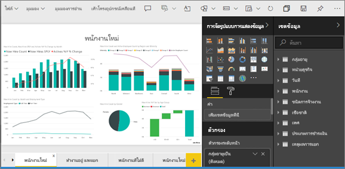
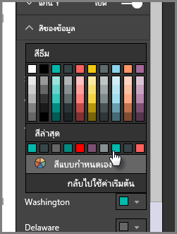
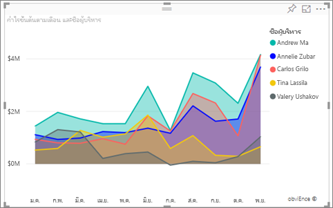
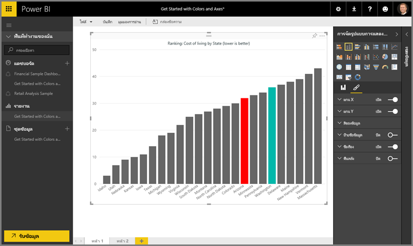
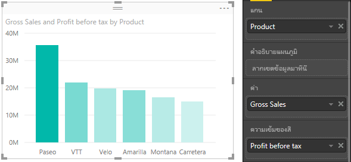
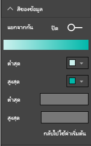
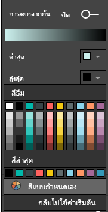
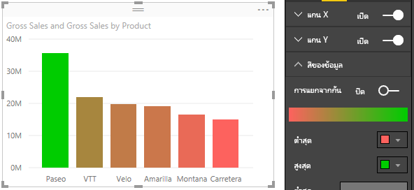
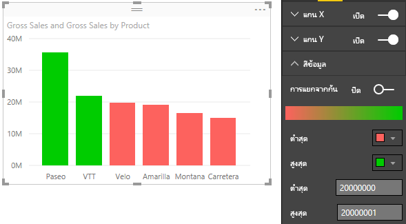
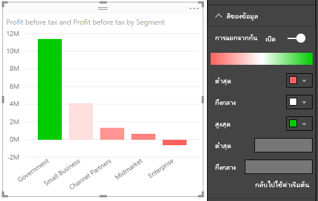

# เคล็ดลับและลูกเล่นในการจัดรูปแบบสีใน Power BI
Power BI มีหลายวิธีในการปรับแต่งแดชบอร์ดและรายงานของคุณ บทความนี้ให้รายละเอียดคอลเลกชันของเคล็ดลับที่สามารถทำให้การแสดงภาพ Power BI ของคุณดึงดูดใจ น่าสนใจ และตรงตามความต้องการของคุณมากขึ้น

มีเคล็ดลับต่อไปนี้ให้ มีเคล็ดลับที่ดีอื่น ๆ หรือไม่? เยี่ยม! ส่งมาที่เราและเราจะดูว่าสามารถเพิ่มลงในรายการนี้ได้หรือไม่

* เปลี่ยนสีของจุดข้อมูลเดียว
* ยึดตามสีของแผนภูมิสำหรับค่าตัวเลข
* ยึดตามสีของจุดข้อมูลค่าสำหรับเขตข้อมูล
* กำหนดสีที่ใช้ในระดับสีเอง
* ใช้ระดับสีที่แยกออกจากกัน
* วิธีการยกเลิกการกระทำใน Power BI

เมื่อต้องทำการเปลี่ยนแปลงโดยที่คุณต้องแก้ไขรายงาน: เลือก**รายงาน**ของคุณจาก**พื้นที่ทำงานของฉัน** แล้วเลือก**แก้ไขรายงาน**จากพื้นที่เมนูด้านบนดังที่แสดงในรูปต่อไปนี้ ตัวอย่างนี้ใช้ **ตัวอย่างทรัพยากรมนุษย์**

เมื่อพื้นที่**การแสดงภาพ**ปรากฏทางด้านขวาของพื้นที่**รายงาน** ตอนนี้คุณก็พร้อมที่จะเริ่มการกำหนดค่าเองได้

## เปลี่ยนสีของจุดข้อมูลเดียว
ในบางครั้งคุณต้องการไฮไลท์จุดข้อมูลจุดใดจุดหนึ่ง อาจมีตัวเลขยอดขายของผลิตภัณฑ์ใหม่ที่เพิ่งเปิดตลาด หรือคะแนนคุณภาพที่เพิ่มขึ้นหลังจากเปิดใช้งานโปรแกรมใหม่ ด้วย Power BI และสำหรับประเภทวิชวลส่วนใหญ่ คุณสามารถไฮไลท์จุดข้อมูลเฉพาะได้โดยการเปลี่ยนสี

การสร้างภาพต่อไปนี้แสดงระยะห่างการขายจากพนักงานโดยใช้สีเริ่มต้น 

แต่มันยากที่จะเห็นพื้นที่สำหรับ Annelie ดังนั้นลองมาใช้สีเพื่อทำให้มันโดดเด่นขึ้น ต่อไปนี้คือขั้นตอน:

ขยายส่วน**สีข้อมูล** รายการต่อไปนี้จะปรากฏขึ้น

ในกรณีนี้ให้เลือกสีเข้ม แต่สีสว่างที่ไม่คล้ายกับสีที่ใช้สำหรับ Valery เลือกลูกศรลงภายในกล่องสีของ Annelie เลือก **สีที่กำหนดเอง** แล้วเลือกสีฟ้าสดใส

เมื่อเลือกแล้ว การแยกความแตกต่างระหว่างพื้นที่สำหรับ Annelie และพนักงานคนอื่นนั้นจะง่ายกว่ามาก 

แม้ว่าคุณจะเปลี่ยนชนิดการแสดงภาพ จากเมื่อคุณนั้นกลับไป Power BI จะจดจำสิ่งที่คุณเลือกและทำให้**วอชิงัน**ยังคงเป็นสีเขียวอยู่

คุณสามารถเปลี่ยนสีของจุดข้อมูลหนึ่งสำหรับองค์ประกอบข้อมูลที่มากกว่าหนึ่งรายการได้เช่นกัน ในรูปต่อไปนี้ **แอริโซนา**เป็นสีแดง และ**วอชิงตัน**ยังคงเป็นสีเขียว

มีหลากหลายสิ่งที่คุณสามารถทำได้ด้วยสี ในส่วนถัดไป เราโปรดดูที่ไล่ระดับสี

## ยึดตามสีของแผนภูมิสำหรับค่าตัวเลข
แผนภูมิมักจะได้รับประโยชน์จากการตั้งค่าสีที่ยึดตามค่าตัวเลขของเขตข้อมูลแบบไดนามิก ด้วยการทำเช่นนี้ คุณสามารถแสดงค่าที่แตกต่างจากค่าที่เคยใช้ได้สำหรับขนาดของแถบ และแสดงค่าสองค่าในกราฟเดียวได้ หรือคุณสามารถใช้ขั้นตอนนี้เพื่อไฮไลท์จุดข้อมูลเหนือ (หรือใต้) ค่าบางค่าได้ โดยอาจไฮไลท์พื้นที่ของกาทำกำไรที่ต่ำ

ส่วนต่อไปนี้สาธิตวิธีการที่แตกต่างกันในการยึดสีตามค่าตัวเลข

## ยึดตามสีของจุดข้อมูลสำหรับค่าหนึ่ง
เมื่อต้องการเปลี่ยนสีที่ยึดตามค่า ลากเขตข้อมูลที่คุณต้องการยึดตามสีลงในพื้นที่**ความเข้มของสี**ในพื้นที่**เขตข้อมูล** ในรูปต่อไปนี้ **กำไรก่อนภาษี**ถูกลากลงใน**ความเข้มของสี** ดังที่คุณเห็น แม้ว่า**Velo**มี**ยอดขายรวม**ที่สูงกว่า (คอลัมน์ที่สูงกว่า) **Amarilla**มี**กำไรก่อนภาษี**ที่มากกว่า (คอลัมน์มีความเข้มของสีที่มากกว่า)

## กำหนดสีที่ใช้ในระดับสีเอง
คุณสามารถกำหนดสีที่ใช้ในระดับสีเองได้ ขยาย**สีข้อมูล**และคุณจะเห็นการไล่ระดับสีของสีที่ใช้สำหรับการแสดงข้อมูลของคุณ ตามค่าเริ่มต้น ค่าต่ำสุดในข้อมูลของคุณถูกแมปเข้ากับสีที่มีความเข้มน้อยที่สุด และค่าสูงสุดไปยังสีที่มีความเข้มมากที่สุด

ช่วงสีจะแสดงในแถบการไล่ระดับสีที่แสดงสเปกตรัม ระหว่างค่าสี**ต่ำสุด**และ**สูงสุด** โดยสีที่มีค่า**ต่ำสุด**อยู่ที่ด้านซ้าย และสีที่มีค่า **สูงสุด**อยู่ทางด้านขวา

เมื่อต้องการเปลี่ยนมาตราส่วนเพื่อใช้ช่วงต่าง ๆ ของสี เลือกสีในรายการแบบเลื่อนลงที่ด้านข้าง**ต่ำสุด**หรือ**สูงสุด** จากนั้นเลือกสี รูปภาพต่อไปนี้แสดงสี**สูงสุด**เปลี่ยนเป็นสีดำ และแถบไล่ระดับสีแสดงสเปกตรัมสีใหม่ระหว่าง**ต่ำสุด**และ**สูงสุด**

คุณยังสามารถเปลี่ยนวิธีที่ค่าแมปไปยังสีเหล่านี้ได้ ในรูปต่อไปนี้ สีสำหรับ**ต่ำสุด**และ**สูงสุด**จะถูกตั้งค่าเป็นสีส้มและสีเขียวตามลำดับ

ในรูปภาพแรกนี้โปรดสังเกตว่า แท่งในแผนภูมิแสดงการไล่ระดับสีที่แสดงในแถบดังกล่าว โดยที่ค่าสูงสุดเป็นสีเขียว ค่าต่ำสุดเป็นสีส้ม และแต่ละแถบในระหว่างนี้จะเป็นหนึ่งสีในสเปกตรัมระหว่างสีเขียวและสีส้ม

ตอนนี้เรามาดูกันว่าเกิดอะไรขึ้นถ้าเรามีค่าตัวเลขในกล่องค่า**ต่ำสุด**และ**สูงสุด** ซึ่งอยู่ด้านล่างตัวเลือกสี**ต่ำสุด**และ**สูงสุด** (่แสดงในรูปต่อไปนี้) ลองตั้งค่า**ต่ำสุด**เป็น 20,000,000 และตั้งค่า**สูงสุด**เป็น 20,000,001

ด้วยการตั้งค่าเหล่านั้น จะไม่นำการไล่ระดับสีไปใช้กับค่าบนแผนภูมิที่อยู่ด้านล่าง**ต่ำสุด**หรือสูงกว่า**สูงสุด**อีกต่อไป แถบใดที่มีค่าเหนือค่า**สูงสุด**จะเป็นสีเขียว และแถบใดที่มีค่าที่อยู่ต่ำกว่าค่า**ต่ำสุด**จะเป็นสีแดง

## ใช้ระดับสีที่แยกออกจากกัน
ในบางครั้งข้อมูลของคุณอาจมีมาตราส่วนแยกออกจากกันอย่างเป็นธรรมชาติ ตัวอย่างเช่น ช่วงอุณหภูมิมีศูนย์กลางที่เป็นธรรมชาติที่จุดการเยือกแข็ง และมีคะแนนกำไรจากจุดกลาง (ศูนย์) ที่เป็นธรรมชาติ

เมื่อต้องการใช้ระดับสีที่แยกออกจากกัน เลื่อนตัวเลื่อน**เลือกแยกจากกัน**เพื่อ**เปิดใช้งาน** เมื่อเปิดใช้งาน**เลือกแยกจากกัน**แล้ว ตัวเลือกสีเพิ่มเติมและกล่องค่า โดยที่ทั้งสองเรียกว่า**ศูนย์** จะปรากฏขึ้น ดังที่แสดงในรูปต่อไปนี้

เมื่อเปิดใช้งานตัวเลื่อน**เลือกแยกจากกัน**แล้ว คุณสามารถตั้งค่าสีต่าง ๆ สำหรับ**ต่ำสุด**, **สูงสุด**และ**ศูนย์**แยกกันได้ ในรูปต่อไปนี้ **ศูนย์**ถูกตั้งค่าเป็นหนึ่ง ดังนั้น แถบที่มีค่ามากกว่าหนึ่งจะมีสีไล่ระดับเป็นสีเขียว และแถบที่น้อยกว่าหนึ่งจะมีสีไล่ระดับเป็นสีแดง

## วิธีการยกเลิกการกระทำใน Power BI
เช่นเดียวกับบริการและซอฟต์แวร์อื่น ๆ อีกมากมายของ Microsoft, Power BI มีวิธีง่าย ๆ ในการยกเลิกคำสั่งล่าสุดของคุณ ตัวอย่างเช่น สมมติว่าคุณเปลี่ยนสีของจุดข้อมูลหรือชุดของจุดข้อมูล และคุณไม่ชอบสีดังกล่าวเมื่อปรากฏขึ้นในการแสดงภาพ คุณจำไม่ได้แน่ชัดว่าสีใดที่ใช้ก่อนหน้านี้ คุณรู้แค่ว่าคุณต้องการให้สีนั้นกลับมา

ในการ**เลิกทำ**การกระทำล่าสุดหรือสองสามการกระทำล่าสุด สิ่งที่คุณต้องทำคือ:

- พิมพ์ CTRL + Z

## คำติชม
คุณมีคำแนะนำที่คุณต้องการแชร์หรือไม่? โปรดส่งมาหาเรา และเราจะดูว่าสามารถรวมไว้ที่นี่ได้หรือไม่

>[!NOTE]
>สี แกน และการกำหนดเองที่เกี่ยวข้องเหล่านี้จะพร้อมใช้งาน เมื่อเลือกไอคอน**รูปแบบ**ไว้ และพร้อมใช้งานใน Power BI Desktop

## ขั้นตอนถัดไป
[เริ่มใช้งานด้วยคุณสมบัติแกนและการจัดรูปแบบสี](service-getting-started-with-color-formatting-and-axis-properties.md)

