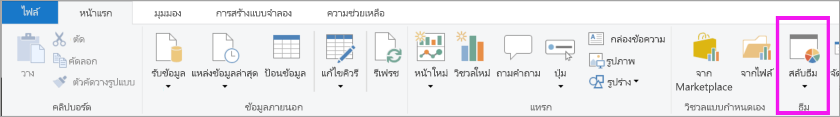
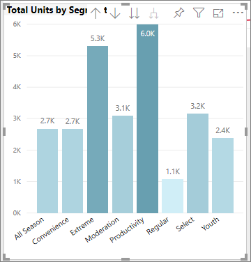
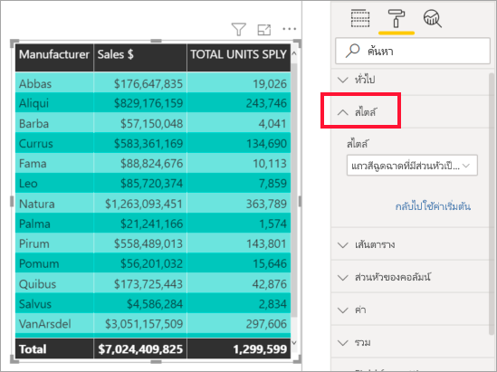
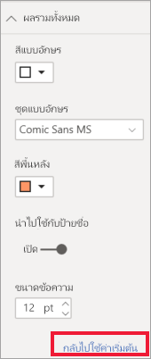

# เคล็ดลับและลูกเล่นในการจัดรูปแบบสีใน Power BI
Power BI มีหลายวิธีในการปรับแต่งแดชบอร์ดและรายงานของคุณ บทความนี้ให้รายละเอียดคอลเลกชันของเคล็ดลับที่สามารถทำให้การแสดงภาพ Power BI ของคุณดึงดูดใจ น่าสนใจ และตรงตามความต้องการของคุณมากขึ้น

มีเคล็ดลับต่อไปนี้ให้ มีเคล็ดลับที่ดีอื่น ๆ หรือไม่? เยี่ยม! ส่งมาที่เราและเราจะดูว่าสามารถเพิ่มลงในรายการนี้ได้หรือไม่

* นำธีมไปใช้กับรายงานทั้งหมด
* เปลี่ยนสีของจุดข้อมูลเดียว
* การจัดรูปแบบแบบมีเงื่อนไข
* ยึดตามสีของแผนภูมิสำหรับค่าตัวเลข
* ยึดตามสีของจุดข้อมูลค่าสำหรับเขตข้อมูล
* กำหนดสีที่ใช้ในระดับสีเอง
* ใช้ระดับสีที่แยกออกจากกัน
* เพิ่มสีให้แถวตาราง
* วิธีการยกเลิกการกระทำใน Power BI

เพื่อทำการเปลี่ยนแปลง คุณต้องแก้ไขสิทธิ์สำหรับรายงาน ใน Power BI Desktop เปิดรายงานในมุมมอง **รายงาน** ในบริการของ Power BI นั่นหมายความว่าเปิดรายงานและเลือก **แก้ไข** จากแถบเมนูดังที่แสดงในรูปต่อไปนี้

เมื่อบานหน้าต่าง **ตัวกรอง** และ **การแสดงผลข้อมูลด้วยภาพ** ปรากฏทางด้านขวาของพื้นที่รายงาน คุณก็พร้อมที่จะเริ่มการกำหนดค่าเองได้ ถ้าบานหน้าต่างเมนูไม่ปรากฏ เลือกลูกศร จากมุมบนขวา เพื่อเปิด

## นำธีมไปใช้
ด้วยธีมรายงาน คุณสามารถใช้การเปลี่ยนแปลงการออกแบบกับรายงานทั้งหมดของคุณได้ เช่น การใช้สีสำหรับองค์กร การเปลี่ยนชุดไอคอน หรือการใช้การจัดรูปแบบภาพตามค่าเริ่มต้นใหม่ เมื่อคุณใช้ธีมรายงาน การแสดงผลด้วยภาพทั้งหมดในรายงานของคุณจะใช้สีและการจัดรูปแบบจากธีมที่คุณเลือก เมื่อต้องการเรียนรู้เพิ่มเติม โปรดดู [ใช้ธีมรายงาน](../desktop-report-themes.md)

ที่นี่ เราได้ใช้ธีม **Innovate** กับรายงานยอดขายและการตลาด

## เปลี่ยนสีของจุดข้อมูลเดียว
ในบางครั้งคุณต้องการไฮไลท์จุดข้อมูลจุดใดจุดหนึ่ง อาจเป็นตัวเลขยอดขายสำหรับการเปิดตัวผลิตภัณฑ์ใหม่ หรือคะแนนคุณภาพที่เพิ่มขึ้นหลังจากเปิดตัวโปรแกรมใหม่ ด้วย Power BI คุณสามารถไฮไลท์จุดข้อมูลเฉพาะได้โดยการเปลี่ยนสี

แสดงการจัดลำดับภาพต่อไปนี้ของหน่วยที่ขายตามส่วนของผลิตภัณฑ์ 

ตอนนี้สมมติว่า คุณต้องการเรียกใช้เซกเมนต์**ความสะดวกสบาย**เพื่อจะดูว่าเซกเมนต์ใหม่นี้แสดงผลโดยใช้สีออกมาได้ดี ต่อไปนี้คือขั้นตอน:

ขยายการ์ด**สีข้อมูล** และเปิดแถบเลื่อนสำหรับ **แสดงทั้งหมด** ขั้นตอนนี้จะแสดงสีต่าง ๆ สำหรับแต่ละองค์ประกอบข้อมูลในการแสดงภาพ ตอนนี้คุณสามารถปรับเปลี่ยนจุดข้อมูลใดก็ตาม

ตั้งค่า **ความสะดวกสบาย** ให้เป็นสีส้ม 

เมื่อเลือกแล้ว จุดข้อมูล**ความสะดวกสบาย**จะเป็นสีส้มสวยงามและโดดเด่นมาก

แม้ว่าคุณจะเปลี่ยนชนิดการแสดงภาพ Power BI จะยังคงจดจำสิ่งที่คุณเลือกและทำให้**ความสะดวกสบาย**ยังคงเป็นสีส้มอยู่

คุณสามารถเปลี่ยนสีของจุดข้อมูลสำหรับจุดเดียว หลายๆ จุด หรือองค์ประกอบข้อมูลทั้งหมดในการแสดงภาพได้ บางทีคุณอาจต้องการให้วิชวลของคุณมีสีเหมือนกับสีขององค์กรคุณ สีเหลือง สีเขียว และสีน้ำเงิน 

มีหลากหลายสิ่งที่คุณสามารถทำได้ด้วยสี ในส่วนถัดไป เราจะไปดูที่การจัดรูปแบบแบบมีเงื่อนไข

## การจัดรูปแบบตามเงื่อนไขสำหรับการแสดงผลข้อมูลด้วยภาพ
การแสดงผลข้อมูลด้วยภาพมักจะได้รับประโยชน์จากการตั้งค่าสีแบบไดนามิกที่ยึดตามค่าตัวเลขของเขตข้อมูล ด้วยการทำเช่นนี้ คุณสามารถแสดงค่าที่แตกต่างจากค่าที่เคยใช้ได้สำหรับขนาดของแถบ และแสดงค่าสองค่าในกราฟเดียวได้ หรือคุณสามารถใช้ขั้นตอนนี้เพื่อไฮไลท์จุดข้อมูลเหนือ (หรือใต้) ค่าบางค่าได้ โดยอาจไฮไลท์พื้นที่ของกาทำกำไรที่ต่ำ

ส่วนต่อไปนี้สาธิตวิธีการที่แตกต่างกันในการยึดสีตามค่าตัวเลข

### ยึดตามสีของจุดข้อมูลสำหรับค่าหนึ่ง
หากต้องการเปลี่ยนสีตามค่า ให้เลือกการแสดงผลข้อมูลด้วยภาพเพื่อทำให้ใช้งานได้ เปิดบานหน้าต่างจัดรูปแบบโดยเลือกไอคอนแปรงลูกกลิ้ง และเปิดการ์ด **สีข้อมูล** วางเมาท์เหนือการ์ด และเลือกจุดแนวตั้งสามจุดที่ปรากฏขึ้นและเลือก **การจัดรูปแบบตามเงื่อนไข**  

ในบานหน้าต่าง**สีเริ่มต้น** ใช้ดรอปดาวน์เพื่อระบุเขตข้อมูลที่จะใช้การจัดรูปแบบตามเงื่อนไข ในตัวอย่างนี้ เราได้เลือกเขตข้อมูล **ข้อเท็จจริงเกี่ยวกับยอดขาย** > **ผลรวมหน่วย**และเลือกสีฟ้าอ่อนสำหรับการ**ค่าต่ำสุด**และสีน้ำเงินเข้มสำหรับ**ค่าสูงสุด** 

คุณยังสามารถจัดรูปแบบสีของภาพโดยใช้เขตข้อมูลที่ไม่ได้อยู่ในภาพ ในรูปต่อไปนี้ มีการใช้ **%Market Share SPLY YTD** 

อย่างที่คุณเห็น แม้ว่าเราขายต่อหน่วยได้มากกว่าทั้งในแง่ของ**ประสิทธิภาพ** และ **ระดับสุดยอด** (คอลัมน์ของทั้งคู่ขึ้นสูงกว่า) แต่**การจัดการดูแล**มี **%Market Share SPLY YTD** ที่ใหญ่กว่า (คอลัมน์มีความเข้มของสีมากกว่า)

### กำหนดสีที่ใช้ในระดับสีเอง
คุณยังสามารถเปลี่ยนวิธีที่ค่าแมปไปยังสีเหล่านี้ได้ ในรูปต่อไปนี้ สีสำหรับ**ต่ำสุด**และ**สูงสุด**จะถูกตั้งค่าเป็นสีส้มและสีเขียวตามลำดับ

ในรูปภาพแรกนี้โปรดสังเกตว่า แท่งในแผนภูมิแสดงการไล่ระดับสีที่แสดงในแถบดังกล่าว โดยที่ค่าสูงสุดเป็นสีเขียว ค่าต่ำสุดเป็นสีส้ม และแต่ละแถบในระหว่างนี้จะเป็นหนึ่งสีในสเปกตรัมระหว่างสีเขียวและสีส้ม

ตอนนี้ มาดูว่าจะเกิดอะไรขึ้นถ้าเรามีค่าตัวเลขในกล่องค่า**ต่ำสุด** และ **สูงสุด** เลือก **กำหนดเอง** จากดรอปบ็อกซ์สำหรับทั้ง **ต่ำสุด** และ **สูงสุด** และตั้งค่า **ต่ำสุด** เป็น 3,500 และตั้งค่า **สูงสุด** เป็น 6,000

ด้วยการตั้งค่าเหล่านั้น จะไม่นำการไล่ระดับสีไปใช้กับค่าบนแผนภูมิที่อยู่ด้านล่าง**ต่ำสุด**หรือสูงกว่า**สูงสุด**อีกต่อไป แถบใดที่มีค่าเหนือค่า**สูงสุด**จะเป็นสีเขียว และแถบใดที่มีค่าที่อยู่ต่ำกว่าค่า**ต่ำสุด**จะเป็นสีแดง

### ใช้ระดับสีที่แยกออกจากกัน
ในบางครั้งข้อมูลของคุณอาจมีมาตราส่วนแยกออกจากกันอย่างเป็นธรรมชาติ ตัวอย่างเช่น ช่วงอุณหภูมิมีศูนย์กลางที่เป็นธรรมชาติที่จุดการเยือกแข็ง และมีคะแนนกำไรจากจุดกลาง (ศูนย์) ที่เป็นธรรมชาติ

หากต้องการใช้ระดับสีที่แยกออกจากกัน ให้เลือกช่องทำเครื่องหมายสำหรับ**เลือกแยกจากกัน** เมื่อเปิดใช้งาน**เลือกแยกจากกัน**แล้ว ตัวเลือกสีเพิ่มเติมที่เรียกว่า**ศูนย์** จะปรากฏขึ้น ดังที่แสดงในรูปต่อไปนี้

เมื่อเปิดใช้งานตัวเลื่อน**เลือกแยกจากกัน**แล้ว คุณสามารถตั้งค่าสีต่าง ๆ สำหรับ**ต่ำสุด**, **สูงสุด**และ**ศูนย์**แยกกันได้ ในรูปต่อไปนี้ **ศูนย์**ถูกตั้งค่าเป็น .2 สำหรับ **% Market Share SPLY YTD** ดังนั้น แถบที่มีค่ามากกว่า .2 จะมีสีไล่ระดับเป็นสีเขียว และแถบที่น้อยกว่าหนึ่งจะมีสีไล่ระดับเป็นสีแดง

## เพิ่มสีให้แถวตาราง
ตารางและเมทริกซ์มีตัวเลือกมากมายสำหรับการจัดรูปแบบสี 

หนึ่งในวิธีที่เร็วที่สุดในการนำสีไปใช้กับตารางหรือเมทริกซ์คือการเปิดแท็บการจัดรูปแบบและเลือก**ลักษณะ**  ในรูปด้านล่างเราได้เลือก **แถวสีฉูดฉาดที่มีส่วนหัวเป็นตัวหนา**

ทดลองใช้ตัวเลือกการจัดรูปแบบสีอื่นๆ ในรูปนี้เราได้เปลี่ยนสีพื้นหลังภายใต้ **ส่วนหัวของคอลัมน์** และเปลี่ยนทั้ง **สีพื้นหลัง** และ **สีพื้นหลังสำรอง** สำหรับ **ค่า** (แถว)

## วิธีการยกเลิกการกระทำใน Power BI
เช่นเดียวกับบริการและซอฟต์แวร์อื่น ๆ อีกมากมายของ Microsoft, Power BI มีวิธีง่าย ๆ ในการยกเลิกคำสั่งล่าสุดของคุณ ตัวอย่างเช่น สมมติว่าคุณเปลี่ยนสีของจุดข้อมูลหรือชุดของจุดข้อมูล และคุณไม่ชอบสีดังกล่าวเมื่อปรากฏขึ้นในการแสดงภาพ คุณจำไม่ได้แน่ชัดว่าสีใดที่ใช้ก่อนหน้านี้ คุณรู้แค่ว่าคุณต้องการให้สีนั้นกลับมา

หากต้องการ **เลิกทำ** การกระทำล่าสุด หรือสองสามการกระทำล่าสุด สิ่งที่คุณต้องทำคือพิมพ์ CTRL + Z

หากต้องการละทิ้งการเปลี่ยนแปลงทั้งหมดที่คุณทำบนการ์ดการจัดรูปแบบ ให้เลือก **แปลงกลับเป็นค่าเริ่มต้น**

## คำติชม
คุณมีคำแนะนำที่คุณต้องการแชร์หรือไม่? โปรดส่งมาหาเรา และเราจะดูว่าสามารถรวมไว้ที่นี่ได้หรือไม่

## ขั้นตอนถัดไป
[เริ่มใช้งานด้วยคุณสมบัติแกนและการจัดรูปแบบสี](service-getting-started-with-color-formatting-and-axis-properties.md)

