# กระจายเนื้อหา Power BI ให้กับผู้ใช้ที่เป็นผู้เยี่ยมชมภายนอก โดยใช้ Azure Active Directory B2B

**สรุป:** นี่เป็นเอกสารทางเทคนิคที่สรุปวิธีการกระจายเนื้อหาไปยังผู้ใช้ภายนอกองค์กรโดยใช้การรวมกันของ Azure Active Directory Business-to-business (AAD B2B)

**ผู้เขียน:** Lukasz Pawlowski, Kasper de Jonge

**ผู้ตรวจสอบทางเทคนิค:** Adam Wilson, Sheng Liu, Qian Liang, Sergei Gundorov, Jacob Grimm, Adam Saxton, Maya Shenhav, Nimrod Shalit, Elisabeth Olson

> [!NOTE]
> คุณสามารถบันทึกหรือพิมพ์เอกสารทางเทคนิคนี้ โดยการเลือก**พิมพ์**จากเบราว์เซอร์ของคุณแล้วเลือก**บันทึกเป็น PDF**ได้

## บทนำ

Power BI ช่วยให้องค์กรมีมุมมอง 360 องศาในธุรกิจของพวกเขา และเพิ่มศักยภาพของทุกคนในองค์กรเหล่านี้ให้ทำการตัดสินใจอย่างชาญฉลาดโดยใช้ข้อมูล หลายองค์กรเหล่านี้มีความสัมพันธ์ที่แข็งแกร่งและเชื่อถือได้กับคู่ค้าภายนอก ผู้รับบริการ และผู้รับเหมา องค์กรเหล่านี้จำเป็นต้องให้การเข้าถึงที่ปลอดภัยไปยังแดชบอร์ดและรายงานของ Power BI แก่ผู้ใช้ที่อยู่ในกลุ่มคู่ค้าภายนอกเหล่านี้

Power BI รวมเข้ากับ [Azure Active Directory เพื่อธุรกิจ (Azure AD B2B)](https://docs.microsoft.com/azure/active-directory/b2b/what-is-b2b) เพื่ออนุญาตให้กระจายเนื้อหา Power BI ไปยังผู้ใช้ที่เป็นผู้เยี่ยมชมภายนอกองค์กร ในขณะที่ยังคงรักษาการควบคุมและดูแลการเข้าถึงไปยังข้อมูลภายใน

เอกสารนี้ครอบคลุมรายละเอียดทั้งหมดที่คุณจำเป็นในการทำความเข้าใจการรวมกันของ Power BI กับ Azure Active Directory B2B เราครอบคลุมกรณีใช้งานทั่วไปส่วนใหญ่ การตั้งค่า สิทธิ์การใช้งาน และการรักษาความปลอดภัยระดับแถว

> [!NOTE]
> ตลอดทั้งเอกสารนี้ เรากล่าวถึง Azure Active Directory เป็น Azure AD และ Azure Active Directory Business to Business เป็น Azure AD B2B

## สถานการณ์สมมติ

Contoso คือ ผู้ผลิตที่รถยนต์ และทำงานกับผู้จำหน่ายหลากหลายจำนวนมาก ซึ่งเป็นผู้จัดเตรียมองค์ประกอบ วัสดุ และบริการที่จำเป็นให้บริษัทเพื่อดำเนินการผลิตของบริษัท Contoso ต้องการปรับปรุงประสิทธิภาพลอจิสติกส์ห่วงโซ่อุปทานและวางแผนที่จะใช้ Power BI เพื่อตรวจสอบเมตริกประสิทธิภาพของห่วงโซ่อุปทานของบริษัท Contoso ต้องการแชร์ผลการวิเคราะห์ให้แก่คู่ค้าในห่วงโซ่อุปทานภายนอกในวิธีจัดการได้และปลอดภัย

Contoso สามารถเปิดใช้งานประสบการณ์การใช้งานต่อไปนี้สำหรับผู้ใช้ภายนอกโดยใช้ Power BI และ Azure AD B2B

### การแชร์รายการแบบเฉพาะกิจ

Contoso ทำงานกับซัพพลายเออร์ที่ผลิตหม้อน้ำรถยนต์สำหรับรถยนต์ของ Contoso บ่อยครั้ง พวกเขาจำเป็นต้องปรับความน่าเชื่อถือของหม้อน้ำรถยนต์โดยใช้ข้อมูลจากรถยนต์ทั้งหมดของ Contoso นักวิเคราะห์ที่ Contoso ใช้ Power BI เพื่อแชร์รายงานความน่าเชื่อถือของหม้อน้ำรถยนต์กับวิศวกรของซัพพลายเออร์ วิศวกรได้รับอีเมลที่มีลิงก์เพื่อดูรายงาน

ตามที่อธิบายไว้ด้านบน การแชร์เฉพาะกิจนี้จะดำเนินการ โดยผู้ใช้ทางธุรกิจบนเซลล์ที่จำเป็น ลิงก์ที่ส่งโดย Power BI ไปยังผู้ใช้ภายนอกคือลิงก์การเชิญ Azure AD B2B เมื่อผู้ใช้ภายนอกเปิดลิงก์ พวกเขาจะถูกขอให้เข้าร่วมองค์กร Azure AD ของ Contoso ในฐานะผู้ใช้ที่เป็นผู้เยี่ยมชม หลังจากที่ยอมรับคำเชิญแล้ว ลิงก์จะเปิดรายงานหรือแดชบอร์ดที่เจาะจง ผู้ดูแลระบบ Azure Active Directory มอบหมายสิทธิ์ให้เชิญผู้ใช้ภายนอกไปยังองค์กร และเลือกว่าผู้ใช้เหล่านั้นสามารถทำอะไรได้บ้างเมื่อพวกเขายอมรับคำเชิญตามที่อธิบายไว้ในส่วนการกำกับดูแลของเอกสารนี้ นักวิเคราะห์ Contoso สามารถเชิญผู้ใช้ที่เป็นผู้เยี่ยมชมเท่านั้น เนื่องจากผู้ดูแลระบบ Azure AD อนุญาตการดำเนินการนั้นและผู้ดูแลระบบ Power BI อนุญาตให้ผู้ใช้เชิญผู้เยี่ยมชมให้ดูเนื้อหาในการตั้งค่าของผู้เช่า Power BI ได้

1. กระบวนการเริ่มต้นจากผู้ใช้ภายใน Contoso แชร์แดชบอร์ดหรือรายงานกับผู้ใช้ภายนอก ถ้าผู้ใช้ภายนอกยังไม่ได้เป็นผู้เยี่ยมชมใน Azure AD ของ Contoso พวกเขาจะได้รับเชิญ อีเมลพร้อมกับคำเชิญไปยัง Azure AD ของ Contoso จะถูกส่งไปยังอีเมลแอดเดรสของพวกเขา
2. ผู้รับยอมรับคำเชิญไปยัง Azure AD ของ Contoso และจะถูกเพิ่มเป็นผู้ใช้ที่เป็นผู้เยี่ยมชมในของ Azure AD ของ Contoso
3. จากนั้น ระบบจะนำผู้รับไปยังแดชบอร์ด รายงาน หรือแอป ของ Power BI ซึ่งเป็นแบบอ่านอย่างเดียวสำหรับผู้ใช้

กระบวนการนี้ถือว่าเป็นเฉพาะกิจเนื่องจากผู้ใช้ทางธุรกิจใน Contoso ดำเนินการเชิญตามความจำเป็นเพื่อวัตถุประสงค์ทางธุรกิจของพวกเขา แต่ละรายการที่แชร์จะเป็นลิงก์เดี่ยวที่ผู้ใช้ภายนอกสามารถเข้าถึงเพื่อดูเนื้อหาได้

เมื่อผู้ใช้ภายนอกได้รับเชิญให้เข้าถึงทรัพยากร Contoso บัญชีเงาอาจถูกสร้างขึ้นสำหรับพวกเขาใน Contoso Azure AD และพวกเขาไม่จำเป็นต้องได้รับเชิญอีกครั้ง  ในครั้งแรกที่พวกเขาพยายามเข้าถึงทรัพยากร Contoso เช่น แดชบอร์ด Power BI พวกเขาจะต้องผ่านกระบวนการขอความยินยอม เพื่อแลกใช้คำเชิญ  ถ้าพวกเขาไม่ดำเนินการขอความยินยอมให้เสร็จ พวกเขาจะไม่สามารถเข้าถึงเนื้อหาใด ๆ ของ Contoso  ถ้าพวกเขามีปัญหาในการแลกใช้คำเชิญของพวกเขาผ่านทางลิงก์เดิมที่มีให้ ผู้ดูแลระบบ Azure AD สามารถส่งลิงก์เชิญเฉพาะสำหรับพวกเขาเพื่อทำการแลกใช้สิทธิ์

### การแชร์รายการแบบวางแผนไว้

Contoso ทำงานกับผู้รับเหมาย่อยเพื่อดำเนินการวิเคราะห์ความน่าเชื่อถือของหม้อน้ำรถยนต์ ผู้รับเหมาย่อยมีทีมงาน 10 คนที่ต้องการเข้าถึงข้อมูลในสภาพแวดล้อม Power BI ของ Contoso ผู้ดูแลระบบ Contoso Azure AD มีหน้าที่ในการเชิญผู้ใช้ทั้งหมด และ จัดการเพิ่ม/แก้ไขใด ๆ ตามการแก้ไขของบุคลากรจากผู้รับเหมาย่อย ผู้ดูแลระบบ Azure AD สร้างกลุ่มปลอดภัยสำหรับพนักงานทั้งหมดที่ผู้รับเหมาย่อย การใช้กลุ่มปลอดภัย พนักงานของ Contoso สามารถจัดการการเข้าถึงรายงาน และมั่นใจว่าบุคลากรผู้รับเหมาย่อยที่จำเป็นทั้งหมดสามารถเข้าถึงรายงาน แดชบอร์ด และแอป Power BI ทั้งหมดที่จำเป็นต้องมี ผู้ดูแลระบบ Azure AD ยังสามารถหลีกเลี่ยงการเกี่ยวข้องกับกระบวนการเชิญทั้งหมด โดยเลือกที่จะมอบหมายสิทธิ์การเชิญให้แก่พนักงานที่เชื่อถือได้ ที่ Contoso หรือ ที่ผู้รับเหมาย่อยที่เพื่อให้มั่นใจในการบริหารจัดการบุคลากรอย่างทันเวลา

บางองค์กรจำเป็นต้องมีการควบคุมมากขึ้น เมื่อมีการเพิ่มผู้ใช้ภายนอก มีการเชิญผู้ใช้จำนวนมากจากองค์กรภายนอก หรือมีองค์กรภายนอกจำนวนมาก ในกรณีเหล่านี้ สามารถใช้การแชร์ที่วางแผนไว้แล้วเพื่อจัดการมาตราส่วนของการแชร์ เพื่อบังคับใช้นโยบายขององค์กร และแม้กระทั่งเพื่อมอบหมายสิทธิ์ให้บุคคลที่เชื่อถือได้สามารถเชิญและจัดการผู้ใช้ภายนอก Azure AD B2B รองรับการเชิญที่วางแผนไว้เพื่อส่งโดยตรง[จากพอร์ทัล Azure โดยผู้ดูแลระบบ IT](https://docs.microsoft.com/azure/active-directory/b2b/add-users-administrator) หรือผ่านทาง [PowerShell โดยใช้ระบบจัดการคำเชิญ API](https://docs.microsoft.com/azure/active-directory/b2b/customize-invitation-api) ที่สามารถเชิญชุดของผู้ใช้ได้ในการดำเนินการเดียว การใช้การวางแผนคำเชิญที่วางแผนไว้ ช่วยให้องค์กรสามารถควบคุมว่าใครสามารถเชิญผู้ใช้ และดำเนินกระบวนการอนุมัติ Azure AD ขั้นสูงมีคุณสมบัติรองรับกลุ่มขนาดใหญ่ ทำให้ง่ายต่อการรักษาความปลอดภัยของสมาชิกกลุ่มโดยอัตโนมัติ

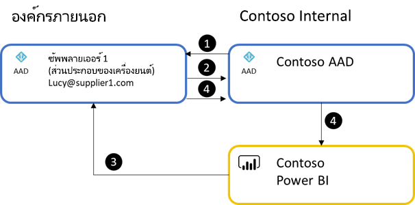

1. กระบวนการเริ่มต้นจากผู้ดูแลระบบเชิญผู้ใช้ที่เป็นผู้เยี่ยมชมอาจโดยการกำหนดเอง หรือผ่านทาง API ที่ได้มาจาก Azure Active Directory
2. ผู้ใช้ยอมรับคำเชิญไปยังองค์กร
3. เมื่อผู้ใช้ยอมรับคำเชิญแล้ว ผู้ใช้ใน Power BI สามารถแชร์รายงานหรือแดชบอร์ดกับผู้ใช้ภายนอก หรือในกลุ่มปลอดภัยของพวกเขา เช่นเดียวกับการแชร์ทั่วไปใน Power BI ผู้ใช้ภายนอกจะได้รับอีเมลที่ มีลิงก์ไปยังรายการ
4. เมื่อผู้ใช้ภายนอกเข้าถึงลิงก์ การรับรองความถูกต้องของพวกเขาในไดเรกทอรีของพวกเขาจะถูกส่งไปยัง Azure AD ของ Contoso เพื่อขออนุญาตเข้าสู่เนื้อหา Power BI

### การแชร์เฉพาะกิจหรือวางแผนของแอป Power BI

Contoso มีชุดของรายงานและแดชบอร์ดที่พวกเขาต้องการแชร์กับซัพพลายเออร์หนึ่งรายหรือมากกว่า เพื่อให้แน่ใจว่าผู้ใช้ภายนอกที่จำเป็นทั้งหมดสามารถเข้าถึงเนื้อหานี้ เนื้อหาดังกล่าวจะถูกจัดทำเป็นแพ็คเกจแอป Power BI ผู้ใช้ภายนอกจะถูกเพิ่มไปยังรายการเข้าถึงแอปโดยตรง หรือผ่านทางกลุ่มปลอดภัยด้วยวิธีใดวิธีหนึ่ง จากนั้นใครบางคนจาก Contoso ก็ส่ง URL ของแอปไปยังผู้ใช้ภายนอกทั้งหมด ตัวอย่างเช่น ในอีเมล เมื่อผู้ใช้ภายนอกเปิดลิงก์ พวกเขาจะเห็นเนื้อหาทั้งหมดในประสบการณ์นำทางเดียวที่ง่าย

การใช้แอป Power BI ทำให้ Contoso สร้างพอร์ทัล BI สำหรับซัพพลายเออร์ของตนได้ง่าย รายการเข้าถึงเดียวควบคุมการเข้าถึงไปยังเนื้อหาที่จำเป็นทั้งหมด ทำให้ช่วยลดเวลาการตรวจสอบและการตั้งค่าการอนุญาตระดับรายการ Azure AD B2B รักษาความปลอดภัยการเข้าถึงโดยใช้ข้อมูลประจำตัวเดิมของซัพพลายเออร์ ดังนั้นผู้ใช้จึงไม่จำเป็นต้องใช้ข้อมูลประจำตัวในการเข้าสู่ระบบเพิ่มเติม ถ้าใช้การเชิญที่วางแผนไว้กับกลุ่มปลอดภัย เข้าถึงการจัดการไปยังแอปเมื่อเปลี่ยนบุคลากรเข้าหรือออกจากโครงการนั้นเป็นเรื่องที่ทำได้ง่าย กำหนดสมาชิกในกลุ่มปลอดภัยแบบแมนวล หรือโดยใช้ [กลุ่มไดนามิก](https://docs.microsoft.com/azure/active-directory/b2b/use-dynamic-groups) เพื่อให้ผู้ใช้ภายนอกทั้งหมดจากซัพพลายเออร์ถูกเพิ่มโดยอัตโนมัติลงในกลุ่มปลอดภัยอย่างเหมาะสม

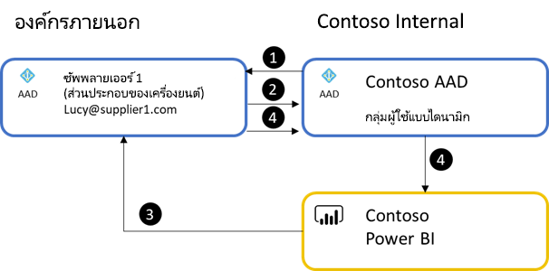

1. กระบวนการเริ่มต้นโดยผู้ใช้ได้รับการเชิญไปยังองค์กรของ Azure AD ของ Contoso ผ่านพอร์ทัล Azure หรือ PowerShell
2. ผู้ใช้สามารถเพิ่มไปยังกลุ่มผู้ใช้ใน Azure AD สามารถใช้กลุ่มผู้ใช้แบบคงที่ หรือแบบไดนามิก แต่กลุ่มแบบไดนามิกช่วยลดการทำงานแบบแมนวล
3. ผู้ใช้ภายนอกที่มีสิทธิ์เข้าถึงแอป Power BI ผ่านกลุ่มผู้ใช้ URL ของแอปควรส่งตรงไปยังผู้ใช้ภายนอก หรือวางบนไซต์ที่พวกเขาสามารถเข้าถึง Power BI ใช้ความพยายามอย่างดีที่สุดเมื่อต้องส่งอีเมลที่มีลิงก์แอปไปยังผู้ใช้ภายนอก แต่เมื่อใช้กลุ่มผู้ใช้ที่สามารถเปลี่ยนแปลงสมาชิกภาพแล้ว ทาง Power BI ก็จะไม่สามารถส่งไปยังผู้ใช้ภายนอกทั้งหมดที่จัดการโดยใช้กลุ่มผู้ใช้
4. เมื่อผู้ใช้ภายนอกเข้าถึง URL ของแอป Power BI พวกเขาได้รับการรับรองโดย Azure AD ของ Contoso และแอปถูกติดตั้งสำหรับผู้ใช้ และผู้ใช้สามารถดูรายงานและแดชบอร์ดที่มีอยู่ทั้งหมดภายในแอป

แอปยังมีคุณลักษณะไม่ซ้ำกันที่ช่วยให้ผู้เขียนแอปติดตั้งแอปพลิเคชันสำหรับผู้ใช้ได้โดยอัตโนมัติเพื่อให้พร้อมใช้งานเมื่อผู้ใช้เข้าสู่ระบบ คุณลักษณะนี้ถูกติดตั้งโดยอัตโนมัติเฉพาะสำหรับผู้ใช้ภายนอกที่เป็นส่วนหนึ่งขององค์กรของ Contoso แล้วในเวลาที่มีการเผยแพร่หรือปรับปรุงแอปพลิเคชันแล้ว ดังนั้น การใช้คำเชิญที่มีการวางแผนเป็นการดีที่สุด และขึ้นอยู่กับแอปที่ได้เผยแพร่ หรืออัปเดต หลังจากผู้ใช้เพิ่มเข้าไปใน Contoso Azure AD ผู้ใช้ภายนอกสามารถติดตั้งแอปโดยใช้ลิงก์แอปได้เสมอ

### การแสดงข้อคิดเห็นและการสมัครใช้งานเนื้อหาทั่วทั้งองค์กร

ในขณะที่ Contoso ยังคงทำงานกับผู้รับเหมาหรือซัพพลายเออร์ วิศวกรภายนอกจำเป็นต้องทำงานอย่างใกล้ชิดกับนักวิเคราะห์ของ Contoso Power BI มีคุณลักษณะการทำงานร่วมกันมากมายที่ช่วยให้ผู้ใช้ติดต่อสื่อสารเกี่ยวกับเนื้อหาที่พวกเขาสามารถใช้ได้ การแสดงข้อคิดเห็นในแดชบอร์ด (และการแสดงข้อคิดเห็นในรายงานเร็ว ๆ นี้) อนุญาตให้ผู้ใชพูดคุยเกี่ยวกับประเด็นข้อมูลที่พวกเขาเห็น และสื่อสารกับผู้เขียนรายงานเพื่อถามคำถาม

ในปัจจุบัน ผู้ใช้ที่เป็นผู้เยี่ยมชมภายนอกสามารถเข้าร่วมในข้อคิดเห็น โดยแสดงความคิดเห็น และอ่านการตอบกลับ อย่างไรก็ตาม จะต่างจากผู้ใช้ภายใน โดยผู้ใช้ที่เป็นผู้เยี่ยมชมจะไม่สามารถเป็น @mentioned และไม่ได้รับการแจ้งเตือนว่าพวกเขาได้รับข้อคิดเห็นได้ ผู้ใช้ที่เป็นผู้เยี่ยมชมไม่สามารถใช้คุณลักษณะการสมัครใช้งานภายใน Power BI ในช่วงเวลาการเขียน ในรุ่นถัดไป ข้อจำกัดเหล่านั้นจะถูกยกเลิก และผู้ใช้ที่เป็นผู้เยี่ยมชมจะได้รับอีเมลเมื่อข้อคิดเห็น @mentions พวกเขา หรือเมื่อการสมัครใช้งานถูกส่งไปยังอีเมลของพวกเขาที่ประกอบด้วยการเชื่อมโยงไปยังเนื้อหาใน Power BI

### เข้าถึงเนื้อหาในแอป Power BI สำหรับอุปกรณ์เคลื่อนที่

ในรุ่นถัดไป เมื่อผู้ใช้ของ Contoso แชร์รายงานหรือแดชบอร์ดลงของพวกเขากับผู้เยี่ยมชมภายนอก Power BI จะส่งอีเมลแจ้งผู้เยี่ยมชม เมื่อผู้ใช้ที่เป็นผู้เยี่ยมชมเปิดลิงก์ไปยังรายงานหรือแดชบอร์ดบนอุปกรณ์เคลื่อนที่ของพวกเขา เนื้อหาจะเปิดในแอป Power BI ดั้งเดิมสำหรับอุปกรณ์เคลื่อนบนอุปกรณ์ของพวกเขา ถ้าพวกเขาเคยติดตั้งไว้ จากนั้นผู้ใช้ที่เป็นผู้เยี่ยมชมจะสามารถนำทางระหว่างเนื้อหาที่แชร์กับพวกเขาในผู้เช่าภายนอก และกลับไปยังเนื้อหาของพวกเขาจากผู้เช่าหน้าหลักของพวกเขา

> [!NOTE]
> ผู้ใช้ที่เป็นผู้เยี่ยมชมไม่สามารถเปิดแอปสำหรับอุปกรณ์เคลื่อน Power BI และนำทางไปยังผู้เช่าภายนอกทันที พวกเขาต้องเริ่มต้นด้วยลิงก์ไปยังรายการในผู้เช่าภายนอก วิธีแก้ไขปัญหาทั่วไปจะอธิบายไว้ใน [การกระจายลิงก์ไปยังเนื้อหาใน Power BI ขององค์กรหลัก](#distributing-links-to-content-in-the-parent-organizations-power-bi) ในส่วนอื่น ๆ ของเอกสารนี้

### การแก้ไขและการจัดการเนื้อหา Power BI แบบข้ามองค์กร

Contoso และซัพพลายเออร์ของเขา และผู้รับเหมาทำงานร่วมกันอย่างใกล้ชิดมากขึ้น บ่อยครั้ง นักวิเคราะห์จากผู้รับเหมาย่อยต้องการเมตริกเพิ่มเติมหรือเพิ่มการแสดงผลด้วยภาพของข้อมูลลงในรายงานที่ Contoso แชร์กับพวกเขา ข้อมูลควรอยู่ภายในผู้เช่า Power BI ของ Contoso แต่ผู้ใช้ภายนอกควรสามารถแก้ไข สร้างเนื้อหาใหม่ และแม้แต่แจกจ่ายให้กับบุคคลที่เหมาะสม

Power BI มีตัวเลือกที่เปิดใช้งานให้ **ผู้ใช้ที่เป็นผู้เยี่ยมชมภายนอกสามารถแก้ไข และจัดการเนื้อหา** ในองค์กรได้ ตามค่าเริ่มต้น ผู้ใช้ภายนอกมีประสบการณ์การใช้งานแบบอ่านเท่านั้น อย่างไรก็ตาม การตั้งค่าใหม่นี้อนุญาตให้ผู้ดูแลระบบ Power BI เลือกว่าผู้ใช้ภายนอกคนใดสามารถแก้ไขและจัดการเนื้อหาภายในองค์กรของพวกเขาได้ เมื่ออนุญาตแล้ว ผู้ใช้ภายนอกสามารถแก้ไขรายงาน แดชบอร์ด เผยแพร่ หรืออัปเดตแอป ทำงานในพื้นที่ทำงาน และเชื่อมต่อกับข้อมูลที่พวกเขามีสิทธิ์การใช้

สถานการณ์สมมตินี้จะอธิบายไว้ในรายละเอียดในส่วนการเปิดใช้งานผู้ใช้ภายนอกเพื่อแก้ไข และจัดการเนื้อหาภายใน Power BI ภายหลังในเอกสารนี้

## ความสัมพันธ์ขององค์กรโดยใช้ Power BI และ Azure AD B2B

เมื่อผู้ใช้ทั้งหมดของ Power BI อยู่ภายในองค์กร คุณจะไม่จำเป็นต้องใช้ Azure AD B2B อย่างไรก็ตาม เมื่อองค์กรสององค์กรหรือมากกว่า ต้องการทำงานร่วมกันบนข้อมูลและข้อมูลเชิงลึกแล้ว การสนับสนุนของ Power BI สำหรับ Azure AD B2B ทำได้ง่าย และคุ้มราคาด้วยเช่นกัน

ด้านล่างนี้คือโครงสร้างองค์กรที่ทำงานร่วมกันโดยทั่วไปซึ่งเหมาะสมสำหรับการทำงานร่วมกันแบบข้ามองค์กรในรูปแบบ Azure AD B2B ใน Power BI Azure AD B2B ทำงานได้ดีในกรณีส่วนใหญ่ แต่ในบางสถานการณ์ ทางเลือกทั่วไปอื่น ๆ ที่อยู่ในส่วนท้ายของเอกสารนี้ก็คู่ควรสำหรับการนำไปพิจารณา

### กรณีที่ 1: ทำงานร่วมกันโดยตรงระหว่างองค์กร

ความสัมพันธ์ของ Contoso กับซัพพลายเออร์หม้อน้ำรถยนต์ เป็น ตัวอย่างของการทำงานร่วมกันโดยตรงระหว่างองค์กร เนื่องจากมีจำนวนผู้ใช้น้อยที่ Contoso และซัพพลายเออร์ต้องการเข้าถึงข้อมูลความน่าเชื่อถือของหม้อน้ำรถยนต์ ดังนั้นการใช้ Azure AD B2B ที่อาศัยการแชร์ภายนอกจะเหมาะสมที่สุด ใช้งานง่าย และง่ายต่อการจัดการ นี่ยังเป็นแพทเทิร์นทั่วไปในบริการให้คำปรึกษาที่ผู้ให้คำปรึกษาอาจจำเป็นต้องสร้างเนื้อหาสำหรับองค์กร

โดยทั่วไปแล้ว แชร์นี้เกิดขึ้นเริ่มแรกโดยการใช้การแชร์รายการแบบเฉพาะกิจ อย่างไรก็ตาม เมื่อทีมเติบโตหรือความสัมพันธ์ลึกมากขึ้น การแชร์รายการแบบวางแผนไว้กลายเป็นวิธีที่น่าพอใจในการลดค่าใช้จ่ายในการดำเนินงานการจัดการ นอกจากนี้ การแชร์แบบเฉพาะกิจ หรือแบบวางแผนไว้ของแอป Power BI การแสดงข้อคิดเห็น และการสมัครใช้งานไปยังเนื้อหาทั่วทั้งองค์กร การเข้าถึงเนื้อหาในแอปสำหรับอุปกรณ์เคลื่อนที่ สามารถนำมาเล่นได้เช่นกัน และการแก้ไขและการจัดการเนื้อหา Power BI แบบข้ามองค์กร สิ่งสำคัญ ถ้าผู้ใช้ขององค์กรทั้งสองมีสิทธิ์การใช้งาน Power BI Pro ในองค์กรที่พวกเขาเกี่ยวข้อง พวกเขาสามารถใช้สิทธิ์การใช้งาน Pro เหล่านั้นในสภาพแวดล้อม Power BI ของกันและกัน ซึ่งให้สิทธิ์การใช้งานที่เป็นประโยชน์เนื่องจากองค์กรที่เชิญอาจไม่จำเป็นต้องชำระเงินสำหรับสิทธิ์การใช้งาน Power BI Pro สำหรับผู้ใช้ภายนอก โดยจะกล่าวถึงรายละเอียดเพิ่มเติมของเรื่องนี้ในส่วนของสิทธิ์การใช้งานในภายหลังในเอกสารนี้

### กรณีที่ 2: บริษัทหลัก และบริษัทสาขา หรือบริษัทในเครือ

โครงสร้างบางองค์กรจะซับซ้อนมากขึ้น รวมถึงบริษัทสาขา บริษัทในเครือที่เป็นเจ้าของบางส่วนหรือทั้งหมด หรือความสัมพันธ์ที่จัดการโดยผู้ให้บริการ องค์กรเหล่านี้มีองค์กรหลัก เช่น บริษัทโฮลดิ้ง แต่องค์กรที่อยู่เบื้องหลังดำเนินการแบบกึ่งปกครองตัวเอง บางครั้งอยู่ภายใต้ข้อกำหนดในภูมิภาคอื่น ซึ่งทำให้แต่ละองค์กรมีสภาพแวดล้อมทาง Azure AD ของตนเอง และแยกจากผู้เช่า Power BI

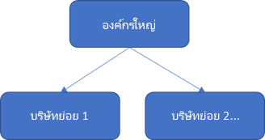

ในโครงสร้างนี้ องค์กรหลักโดยทั่วไปแล้วจำเป็นต้องแจกจ่ายข้อมูลเชิงลึกที่เป็นมาตรฐานให้กับบริษัทสาขา โดยทั่วไปแล้ว การแชร์นี้เกิดขึ้นโดยใช้การแชร์ที่วางแผนไว้ หรือเฉพาะกิจของแอป Power BI ดังที่แสดงในรูปต่อไปนี้ เนื่องจากจะทำให้การแจกจ่ายเนื้อหาอย่างเป็นมาตรฐานให้กับผู้ชมที่กว้างขวาง ในทางปฏิบัติ ใช้การรวมกันของสถานการณ์สมมติทั้งหมดที่กล่าวถึงก่อนหน้านี้ในเอกสารนี้

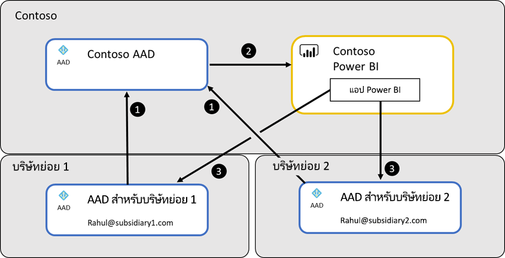

โดยปฏิบัติตามขั้นตอนต่อไปนี้:

1. ผู้ใช้จากแต่ละบริษัทสาขาได้รับเชิญไปยัง Azure AD ของ Contoso
2. จากนั้นแอป Power BI จะถูกเผยแพร่เพื่อให้ผู้ใช้เหล่านี้เข้าถึงข้อมูลที่จำเป็น
3. สุดท้าย ผู้ใช้เปิดแอปผ่านลิงก์ที่พวกเขาได้รับเพื่อดูรายงาน

ความท้าทายต่าง ๆ ที่สำคัญที่องค์กรเผชิญในโครงสร้างนี้:

- วิธีการแจกจ่ายลิงก์ไปยังเนื้อหาในองค์กรหลักของ Power BI
- วิธีการอนุญาตให้ผู้ใช้ในบริษัทสาขาเข้าถึงแหล่งข้อมูลที่โฮสต์โดยองค์กรหลัก

#### การแจกจ่ายลิงก์ไปยังเนื้อหาในองค์กรหลักของ Power BI

สามวิธีที่ใช้บ่อยในการแจกจ่ายลิงก์ไปยังเนื้อหา วิธีแรกและใช้ทั่วไปมากที่สุดคือส่งลิงก์ไปยังแอปของผู้ใช้ที่ต้องการ หรือวางไว้ในไซต์ SharePoint Online จากสถานที่ที่สามารถเปิดลิงก์ได้ จากนั้น ผู้ใช้สามารถบุ๊กมาร์กลิงก์ในเบราว์เซอร์ของพวกเขาเพื่อเข้าถึงข้อมูลที่พวกเขาต้องการได้เร็วขึ้น

วิธีที่สองอาศัยการแก้ไขและการจัดการความสามารถของเนื้อหา Power BI แบบข้ามองค์กร องค์กรหลักอนุญาตผู้ใช้จากบริษัทสาขาให้เข้าถึง Power BI ของตน และควบคุมสิ่งที่พวกเขาสามารถเข้าถึงผ่านทางการอนุญาต การดำเนินการนี้ให้การเข้าถึงหน้าแรกของ Power BI ซึ่งเป็นที่ที่ผู้ใช้จากบริษัทสาขาเห็นรายการทั้งหมดของเนื้อหาที่แบ่งปันให้กับพวกเขาในผู้เช่าขององค์กรหลัก จากนั้นส่ง URL ไปยังสภาพแวดล้อม Power BI ขององค์กรหลักให้กับผู้ใช้จากบริษัทสาขา

วิธีสุดท้ายคือใช้แอป Power BI ที่สร้างขึ้นภายในผู้เช่า Power BI สำหรับแต่ละบริษัทสาขา แอป Power BI ได้แก่ แดชบอร์ดที่มี [ไทล์ที่กำหนดค่าด้วยตัวเลือกลิงก์ภายนอก](https://docs.microsoft.com/power-bi/service-dashboard-edit-tile#hyperlink) เมื่อผู้ใช้กดไทล์ พวกเขาจะถูกนำไปยังรายงาน แดชบอร์ด หรือแอปที่เหมาะสมใน Power BI ขององค์กรหลัก วิธีนี้มีประโยชน์เพิ่มเติมคือแอปสามารถติดตั้งโดยอัตโนมัติสำหรับผู้ใช้ทั้งหมดในบริษัทสาขา และพร้อมใช้งานได้ทุกเวลาเมื่อพวกเขาลงชื่อเข้าใช้ลงในสภาพแวดล้อม Power BI ของตนเอง ประโยชน์เพิ่มเติมของวิธีการนี้คือทำงานได้ดีกับแอปสำหรับอุปกรณ์เคลื่อนที่ Power BI ที่สามารถเปิดลิงก์ได้แบบธรรมชาติ คุณยังสามารถรวมวิธีนี้กับวิธีที่สองเพื่อให้ง่ายต่อการสลับระหว่างสภาพแวดล้อม Power BI

#### อนุญาตให้ผู้ใช้ในบริษัทสาขาเข้าถึงแหล่งข้อมูลที่โฮสต์โดยองค์กรหลัก

บ่อยครั้งที่นักวิเคราะห์ที่บริษัทสาขาจำเป็นต้องสร้างการวิเคราะห์ของตนเองโดยใช้ข้อมูลที่ให้มาโดยองค์กรหลัก ในกรณีนี้ โดยทั่วไปจะใช้แหล่งข้อมูลระบบคลาวด์เพื่อจัดการความท้าทาย

วิธีแรกใช้ [Azure Analysis Services](https://docs.microsoft.com/azure/analysis-services/analysis-services-overview) เพื่อสร้างคลังข้อมูลระดับองค์กรที่ทำหน้าที่บริการความต้องการของนักวิเคราะห์ทั่วทั้งบริษัทหลักและบริษัทสาขาตามที่แสดงในรูปด้านล่าง Contoso สามารถโฮสต์ข้อมูล และใช้ความสามารถ เช่น ความปลอดภัยระดับแถวเพื่อให้แน่ใจว่าผู้ใช้ในแต่ละบริษัทสาขาสามารถเข้าถึงเฉพาะข้อมูลของพวกเขาเท่านั้น นักวิเคราะห์ที่แต่ละองค์กรสามารถเข้าถึงคลังข้อมูลผ่านทาง Power BI Desktop และเผยแพร่ผลการวิเคราะห์ไปยังผู้เช่า Power BI ที่เกี่ยวข้องของพวกเขา

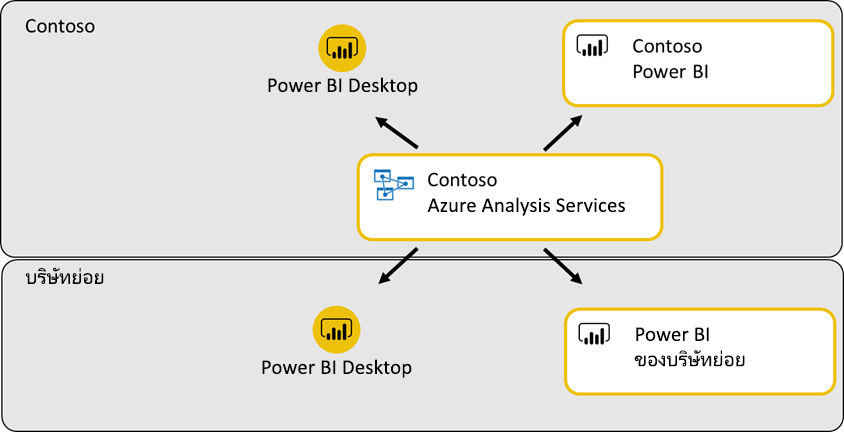

วิธีที่สองใช้ [ฐานข้อมูล SQL Azure](https://azure.microsoft.com/services/sql-database/) เพื่อสร้างคลังข้อมูลเชิงสัมพันธ์เพื่อให้การเข้าถึงข้อมูล ซึ่งทำงานคล้ายคลึงกับวิธี Azure Analysis Services แต่ความสามารถบางอย่าง เช่น ความปลอดภัยระดับแถวอาจจะยากขึ้นเพื่อ ปรับใช้และรักษาไว้ทั่วทั้งบริษัทสาขา

อย่างไรก็ตาม สามารถทำให้วิธีการซับซ้อนมากขึ้นไปอีกได้ ซึ่งวิธีการที่มากกว่านี้ไม่ค่อยจะนิยมนัก

### กรณีที่ 3: สภาพแวดล้อมที่แชร์ทั่วทั้งคู่ค้า

Contoso อาจเข้าสู่ความร่วมมือกับคู่แข่งเพื่อสร้างรถยนต์ร่วมกันในสายการประกอบร่วมกัน แต่เพื่อกระจายยานพาหนะภายใต้แบรนด์ที่ต่างกัน หรือในภูมิภาคที่ต่างกัน การดำเนินการนี้จำเป็นต้องมีการทำงานร่วมกันที่ครอบคลุมและมีความเป็นเจ้าของร่วมของข้อมูล ข่าวกรอง และการวิเคราะห์ทั่วทั้งองค์กร โครงสร้างนี้ยังใช้ทั่วไปในอุตสาหกรรมบริการให้คำปรึกษาที่ทีมผู้ให้คำปรึกษาอาจทำการวิเคราะห์โดยอ้างอิงโครงการสำหรับผู้รับบริการ

ในทางปฏิบัติ โครงสร้างเหล่านี้มีความซับซ้อนดังที่แสดงในรูปต่อไปนี้ และต้องมีพนักงานบำรุงรักษา การใช้งานโครงสร้างนี้ขึ้นอยู่กับความสามารถในการแก้ไขและการจัดการเนื้อหา Power BI แบบข้ามองค์กร เนื่องจากจะช่วยให้องค์กรสามารถนำสิทธิ์การใช้งาน Power BI Pro ที่ซื้อสำหรับผู้เช่า Power BI ที่เกี่ยวข้องของพวกเขามาใช้ใหม่ได้

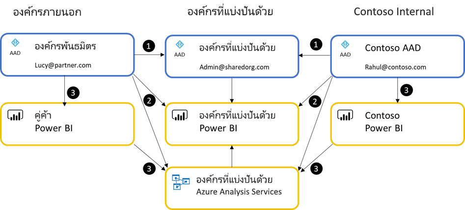

หากต้องการสร้างผู้เช่า Power BI ที่แชร์ Azure Active Directory จำเป็นต้องสร้าง และจำเป็นต้องซื้อบัญชีผู้ใช้ Power BI Pro อย่างน้อยหนึ่งรายสำหรับเป็นผู้ใช้ในไดเรกทอรีที่ใช้งานอยู่ ผู้ใช้รายนี้เชิญผู้ใช้ที่จำเป็นสำหรับองค์กรที่แชร์ สิ่งสำคัญ ในสถานการณ์นี้ ผู้ใช้ของ Contoso จะถือว่าเป็นผู้ใช้ภายนอกเมื่อพวกเขาทำงานภายใน Power BI ขององค์กรที่แชร์

กระบวนการมีดังนี้:

1. องค์กรที่แชร์ถูกสร้างขึ้นเป็น Azure Active Directory ใหม่ และมีบัญชีผู้ใช้อย่างน้อยหนึ่งรายถูกสร้างขึ้นในองค์กรใหม่ ผู้ใช้นั้นควรมีสิทธิการใช้งาน Power BI Pro ที่มอบหมายให้พวกเขา
2. จากนั้น ผู้ใช้นี้จะสร้างผู้เช่า Power BI และเชิญผู้ใช้ที่จำเป็นจาก Contoso และองค์กรคู่ค้า ผู้ใช้ยังสร้างแอสเซทข้อมูลแชร์ เช่น Azure Analysis Services Contoso และผู้ใช้ของคู่ค้าสามารถเข้าถึง Power BI ขององค์กรที่แชร์ในฐานะผู้ใช้ที่เป็นผู้เยี่ยมชม ถ้าได้รับอนุญาตให้แก้ไข และจัดการเนื้อหาใน Power BI ผู้ใช้ภายนอกสามารถใช้หน้าแรกของ Power BI ใช้พื้นที่ทำงาน อัปโหลด หรือแก้ไขเนื้อหา และแชร์รายงาน โดยทั่วไปแล้ว แอสเซทที่แชร์จะถูกจัดเก็บและเข้าถึงได้จากองค์กรที่แชร์
3. ทั้งนี้ขึ้นอยู่กับวิธีการที่คู่ค้าตกลงในการทำงานร่วมกัน อาจเป็นไปได้ที่จะให้แต่ละองค์กรพัฒนาข้อมูลกรรมสิทธิ์และการวิเคราะห์ของตนเองโดยใช้แอสเซทคลังข้อมูลที่แชร์ พวกเขาสามารถแจกจ่ายให้กับผู้ใช้ภายในที่เกี่ยวข้องของพวกเขาโดยใช้ผู้เช่า Power BI ภายในของพวกเขา

### กรณีที่ 4: แจกจ่ายไปยังหลายร้อยหรือพันคู่ค้าภายนอก

ในขณะที่ Contoso สร้างรายงานความน่าเชื่อถือของหม้อน้ำรถยนต์สำหรับซัพพลายเออร์รายหนึ่ง เวลานี้ Contoso ต้องการสร้างชุดรายงานที่เป็นมาตรฐานสำหรับซัพพลายเออร์จำนวนร้อยราย การดำเนินการนี้ช่วยให้ Contoso แน่ใจว่าซัพพลายเออร์ทั้งหมดมีข้อมูลวิเคราะห์ที่พวกเขาต้องการเพื่อพัฒนาหรือแก้ไขข้อบกพร่องในการผลิต

เมื่อองค์กรต้องการแจกจ่ายข้อมูลและข้อมูลเชิงลึกให้เป็นมาตรฐานแก่ผู้ใช้/องค์กรภายนอกจำนวนมาก พวกเขาสามารถใช้สถานการณ์การแชร์เฉพาะกิจหรือวางแผนของแอป Power BI เพื่อสร้างพอร์ทัล BI อย่างรวดเร็ว และไม่มีค่าใช้จ่ายการพัฒนาที่ใหญ่โต กระบวนการสร้างพอร์ทัลดังกล่าวโดยใช้แอป Power BI ครอบคลุมอยู่ในกรณีตัวอย่าง: การสร้างพอร์ทัล BI โดยใช้ Power BI + Azure AD B2B – คำแนะนำทีละขั้นตอนในภายหลังในเอกสารนี้

ตัวแปรทั่วไปของกรณีนี้คือเมื่อองค์กรพยายามแชร์ข้อมูลเชิงลึกกับผู้บริโภค โดยเฉพาะอย่างยิ่งเมื่อต้องการใช้ Azure B2C กับ Power BI Power BI ไม่สนับสนุน Azure B2C โดยธรรมชาติ ถ้าคุณกำลังประเมินตัวเลือกสำหรับกรณีนี้ พิจารณาการใช้ตัวเลือกที่ 2 ในวิธีการอื่นทั่วไปในภายหลังของเอกสารนี้

## กรณีศึกษา: การสร้างพอร์ทัล BI โดยใช้ Power BI + Azure AD B2B – คำแนะนำทีละขั้นตอน

Power BI รวมเข้ากับ Azure AD B2B ให้ Contoso มีวิธีการอย่างราบรื่น แสนง่ายดายเพื่อให้ผู้ใช้ที่เป็นผู้เยี่ยมชมเข้าถึงพอร์ทัลของ BI อย่างปลอดภัย Contoso สามารถตั้งค่านี้ในสามขั้นตอน:

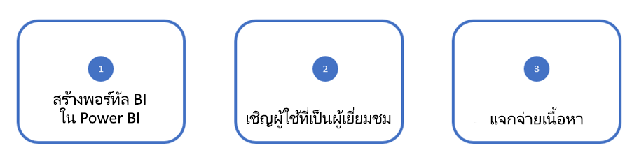

1. สร้างพอร์ทัล BI ใน Power BI

    งานแรกสำหรับ Contoso คือการสร้างพอร์ทัล BI ของพวกเขาใน Power BI พอร์ทัล BI ของ Contoso จะประกอบด้วยคอลเลกชันของแดชบอร์ดและรายงานที่สร้างขึ้นอย่างมีวัตถุประสงค์ที่พร้อมสำหรับผู้ใช้ภายในและที่เป็นผู้เยี่ยมชมมากมาย วิธีที่แนะนำสำหรับการทำเช่นนี้ใน Power BI คือการ สร้างแอป Power BI เรียนรู้เพิ่มเติมเกี่ยวกับ [แอปใน Power BI](https://powerbi.microsoft.com/blog/distribute-to-large-audiences-with-power-bi-apps/)

- ทีม BI ของ Contoso สร้างพื้นที่ทำงานแอปใน Power BI

    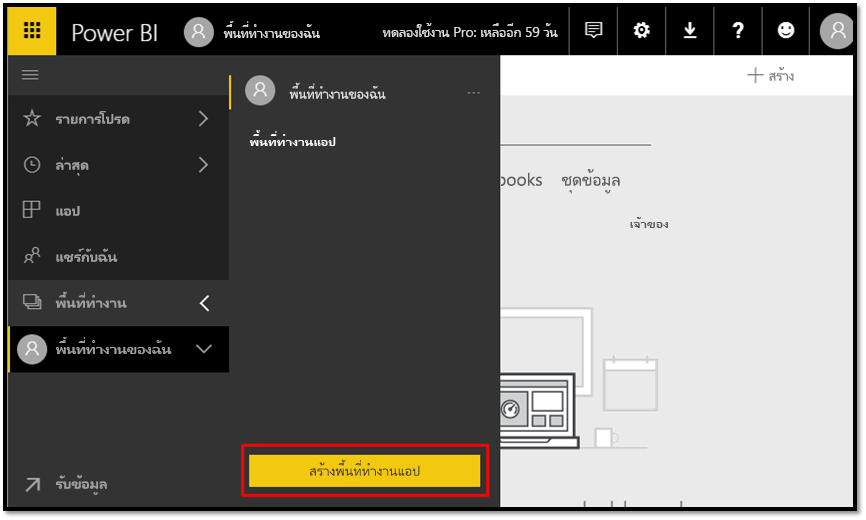
    

- ผู้เขียนอื่น ๆ จะถูกเพิ่มไปยังพื้นที่ทำงาน

    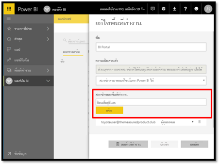

- เนื้อหาจะถูกสร้างขึ้นภายในพื้นที่ทำงาน

    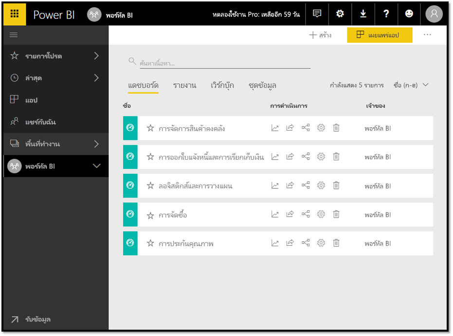

    เวลานี้หลังจากที่สร้างเนื้อหาในพื้นที่ทำงานของแอปแล้ว Contoso ก็พร้อมที่จะเชิญผู้ใช้ที่เป็นผู้เยี่ยมชมในองค์กรของคู่ค้าให้ใช้เนื้อหานี้

2. เชิญผู้ใช้ที่เป็นผู้เยี่ยมชม

    มีสองวิธีสำหรับ Contoso ในการเชิญผู้เยี่ยมชมไปยังพอร์ทัลของ BI ใน Power BI ของเขา:

    * คำเชิญที่วางแผน
    * คำเชิญเฉพาะกิจ

    **คำเชิญที่วางแผน**

    ในวิธีนี้ Contoso เชิญผู้ใช้ที่เป็นผู้เยี่ยมชมไปยัง Azure AD ของเขาล่วงหน้า และจากนั้นแจกจ่ายเนื้อหา Power BI ไปให้พวกเขา Contoso สามารถเชิญผู้ใช้ที่เป็นผู้เยี่ยมชมจากพอร์ทัล Azure หรือใช้ PowerShell นี่คือขั้นตอนในการเชิญผู้ใช้ที่เป็นผู้เยี่ยมชมจากพอร์ทัล Azure:

    - ผู้ดูแลระบบ Azure AD ของ Contoso นำทางไปยัง**พอร์ทัล Azure > Azure Active Directory > ผู้ใช้และกลุ่ม > ผู้ใช้ทั้งหมด > ผู้ใช้ที่เป็นผู้เยี่ยมชมใหม่**

    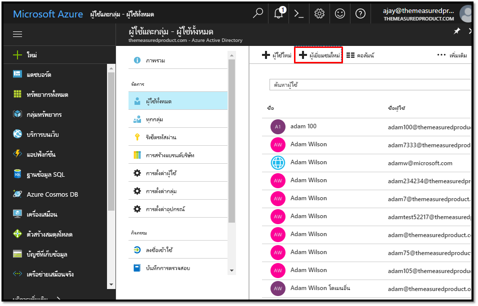

    - เพิ่มข้อความเชิญสำหรับผู้ใช้ที่เป็นผู้เยี่ยมชม แล้วคลิกเชิญ

    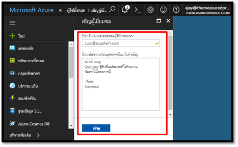

    > [!NOTE]
    > หากต้องการเชิญผู้ใช้ที่เป็นผู้เยี่ยมชมจากพอร์ทัล Azure คุณจำเป็นต้องเป็นผู้ดูแลระบบสำหรับ Azure Active Directory ของผู้เช่าของคุณ

    หาก Contoso ต้องการเชิญผู้ใช้ที่เป็นผู้เยี่ยมชมจำนวนมาก พวกเขาสามารถทำได้โดยใช้ PowerShell ผู้ดูแลระบบ Azure AD ของ Contoso จัดเก็บอีเมลแอดเดรสของผู้ใช้ที่เป็นผู้เยี่ยมชมทั้งหมดในไฟล์ CSV ในที่นี้มี [โค้ดร่วมกันของ Azure Active Directory B2B และตัวอย่างของ PowerShell](https://docs.microsoft.com/azure/active-directory/b2b/code-samples) และคำแนะนำ

    หลังจากเชิญ ผู้ใช้ที่เป็นผู้เยี่ยมชมจะได้รับอีเมลที่มีลิงก์การเชิญ

    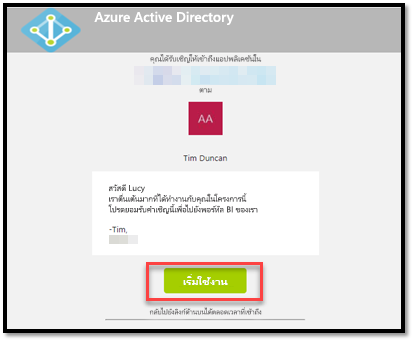

    เมื่อผู้ใช้ที่เป็นผู้เยี่ยมชมคลิกที่ลิงก์ เขา/เธอสามารถเข้าถึงเนื้อหาในผู้เช่า Contoso Azure AD

    > [!NOTE]
    > สามารถเปลี่ยนเค้าโครงของอีเมลคำเชิญได้โดยใช้คุณลักษณะแบรนด์ Azure AD ตามที่อธิบายไว้ [ที่นี่](https://docs.microsoft.com/azure/active-directory/active-directory-b2b-invitation-email)

    **คำเชิญเฉพาะกิจ**

    เกิดอะไรขึ้นถ้า Contoso ไม่รู้จักผู้ใช้ที่เป็นผู้เยี่ยมชมทั้งหมดที่ต้องการเชิญล่วงหน้า หรือเกิดอะไรขึ้นถ้านักวิเคราะห์ใน Contoso ซึ่งเป็นผู้ที่สร้างพอร์ทัล BI ต้องการแจกจ่ายเนื้อหาให้กับผู้ใช้ที่เป็นผู้เยี่ยมชมด้วยตัวเธอเอง เรายังสนับสนุนสถานการณ์สมมตินี้ใน Power BI ด้วยคำเชิญเฉพาะกิจ

    นักวิเคราะห์เพียงแค่เพิ่มผู้ใช้ภายนอกไปยังรายการเข้าถึงของแอปเมื่อเธอจะเผยแพร่ ผู้ใช้ที่เป็นผู้เยี่ยมชมได้รับคำเชิญ และเมื่อพวกเขายอมรับ พวกเขามีเส้นทางอัตโนมัตินำไปยังเนื้อหา Power BI

    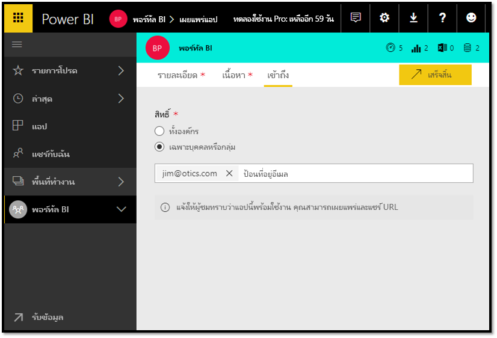

    > [!NOTE]
    > การเชิญจำเป็นต้องมีการเชิญผู้ใช้ภายนอกไปยังองค์กรของคุณในครั้งแรกเท่านั้น

3. แจกจ่ายเนื้อหา

    เวลานี้หลังจากที่ทีม BI ของ Contoso ได้สร้างพอร์ทัล BI และเชิญผู้ใช้ที่เป็นผู้เยี่ยมชมแล้ว พวกเขาสามารถแจกจ่ายพอร์ทัลของพวกเขาแก่ผู้ใช้ของพวกเขา โดยการให้ผู้ใช้ที่เป็นผู้เยี่ยมชมเข้าไปยังแอป และเผยแพร่ Power BI กรอกชื่ออัตโนมัติให้กับผู้ใช้ที่เป็นผู้เยี่ยมชมที่เพิ่มเข้ามาในผู้เช่า Contoso ก่อนหน้านี้ การเชิญเฉพาะกิจไปยังผู้ใช้ที่เป็นผู้เยี่ยมชมอื่น ยังสามารถเพิ่มได้ในจุดนี้เช่นกัน

    > [!NOTE]
    > ถ้าใช้กลุ่มปลอดภัยเพื่อจัดการการเข้าถึงแอปสำหรับผู้ใช้ภายนอก ให้ใช้วิธีการเชิญที่วางแผนไว้ และแชร์ลิงก์แอปโดยตรงกับผู้ใช้ภายนอกแต่ละคนที่จำเป็นต้องเข้าถึง มิฉะนั้นแล้ว ผู้ใช้ภายนอกอาจไม่สามารถติดตั้ง หรือดูเนื้อหาจากภายในแอปได้

    ผู้ใช้ที่เป็นผู้เยี่ยมชมได้รับอีเมลที่มีลิงก์ไปยังแอป

    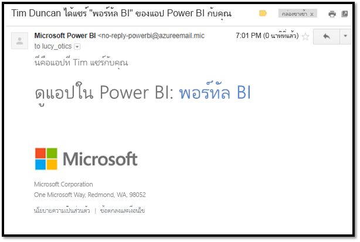

    เมื่อคลิกที่ลิงก์นี้ ผู้ใช้ที่เป็นผู้เยี่ยมชมจะถูกขอให้รับรองความถูกต้อง ด้วยข้อมูลประจำตัวขององค์กรของตนเอง

    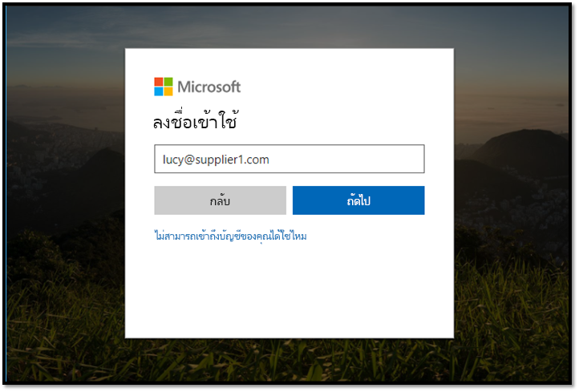

    เมื่อพวกเขารับรองความถูกต้องเรียบร้อยแล้ว ระบบจะเปลี่ยนเส้นทางไปยังแอปของ BI ของ Contoso

    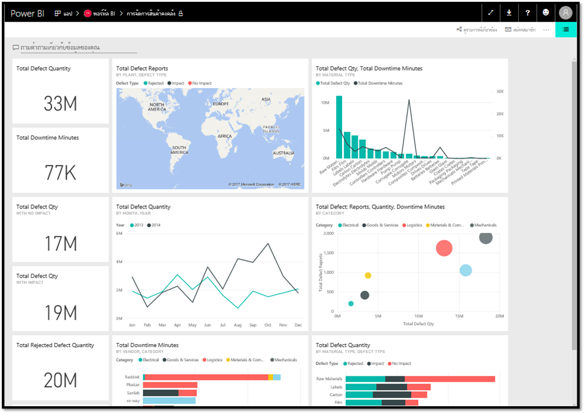

    ผู้ใช้ที่เป็นผู้เยี่ยมชมสามารถเข้าถึงแอปของ Contoso ภายหลัง โดยคลิกลิงก์ในอีเมล หรือบุ๊กมาร์กลิงก์ Contoso ยังสามารถยังทำให้ง่ายขึ้นสำหรับผู้ใช้ที่เป็นผู้เยี่ยมชม โดยการเพิ่มลิงก์นี้ไปยังพอร์ทัลเอ็กซ์ทราเน็ตใด ๆ ที่มีอยู่ที่ผู้ใช้ที่เป็นผู้เยี่ยมชมใช้งานอยู่แล้ว

4. ขั้นตอนถัดไป

    การใช้แอป Power BI และ Azure AD B2B ทำให้ Contoso สามารถสร้างพอร์ทัล BI สำหรับซัพพลายเออร์ของตนได้โดยไม่ต้องใช้โค้ด การดำเนินการนี้ช่วยให้แจกจ่ายข้อมูลการวิเคราะห์มาตรฐานแก่ซัพพลายเออรทั้งหมด์ที่ต้องการได้ง่าย

    ในขณะที่ตัวอย่างแสดงวิธีการแจกจ่ายรายงานเดี่ยวทั่วไประหว่างซัพพลายเออร์ โดย Power BI สามารถดำเนินการอีกจำนวนมาก เพื่อให้แน่ใจว่า คู่ค้าแต่ละรายเห็นเฉพาะข้อมูลที่เกี่ยวข้องกับพวกเขา ดังนั้นจึงสามารถเพิ่มการรักษาความปลอดภัยระดับแถวอย่างง่ายดายลงในรูปแบบข้อมูลและรายงาน การรักษาความปลอดภัยของข้อมูลสำหรับคู่ค้าภายนอกมีรายละเอียดอธิบายในภายหลังในเอกสารนี้

    บ่อยครั้งที่แดชบอร์ดและรายงานเดี่ยวจำเป็นต้องฝังลงในพอร์ทัลที่มีอยู่แล้ว ซึ่งยังสามารถดำเนินการได้โดยนำเทคนิคต่าง ๆ ตามที่แสดงนี้มาใช้ใหม่ได้ อย่างไรก็ตาม ในสถานการณ์เหล่านั้น การฝังรายงานหรือแดชบอร์ดโดยตรงจากพื้นที่ทำงานอาจเป็นการง่ายกว่า ขั้นตอนสำหรับการเชิญและการให้อนุญาตที่ปลอดภัยไปยังผู้ใช้ที่ต้องการยังคงเหมือนเดิม

## ในเบื้องหลัง: Lucy จากซัพพลายเออร์1 เข้าถึงเนื้อหา Power BI จากผู้เช่าของ Contoso ได้อย่างไร

ตอนนี้เราได้เห็นวิธีที่ Contoso สามารถแจกจ่ายเนื้อหา Power BI ไปยังผู้ใช้ที่เป็นผู้เยี่ยมชมในองค์กรคู่ค้าได้อย่างราบรื่น มาดูว่าการดำเนินการนี้ทำงานอย่างไรในเบื้องหลัง

เมื่อ Contoso ได้เชิญ [ lucy@supplier1.com ](mailto:lucy@supplier1.com) ไปยังไดเรกทอรีของตน Azure AD จะสร้างลิงก์ระหว่าง [ Lucy@supplier1.com ](mailto:Lucy@supplier1.com) และผู้เช่า Contoso Azure AD ลิงก์นี้ช่วยให้ Azure AD ทราบว่า Lucy@supplier1.com สามารถเข้าถึงเนื้อหาในผู้เช่า Contoso ได้

เมื่อ Lucy พยายามเข้าถึงแอป Power BI ของ Contoso ทาง Azure AD จะตรวจสอบว่า Lucy สามารถเข้าถึงผู้เช่า Contoso ได้หรือไม่ และจากนั้นจะให้ Power BI แสดงโทเค็นที่บ่งชี้ว่า Lucy ได้รับการรับรองความถูกต้องเพื่อเข้าถึงเนื้อหาในผู้เช่า Contoso Power BI ใช้โทเค็นนี้ในการให้อนุญาต และตรวจสอบให้แน่ใจว่า Lucy มีสิทธิ์เข้าถึงแอป Power BI ของ Contoso

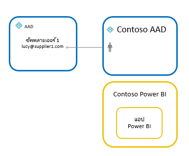

Power BI รวมเข้ากับ Azure AD B2B โดยทำงานกับอีเมลแอดเดรสธุรกิจทั้งหมด ถ้าผู้ใช้ไม่มีข้อมูลประจำตัว Azure AD พวกเขาอาจได้รับข้อความแจ้งให้สร้าง รูปภาพต่อไปนี้แสดงโฟลว์อย่างละเอียด:

เป็นสิ่งสำคัญที่ต้องรับทราบว่า บัญชี Azure AD จะใช้หรือสร้างขึ้นใน Azure AD ของบุคคลภายนอก ซึ่งการดำเนินการนี้จะทำให้ Lucy สามารถใช้ชื่อผู้ใช้และรหัสผ่านของตนเอง และข้อมูลประจำตัวของเธอจะหยุดการทำงานในผู้เช่ารายอื่น ๆ โดยอัตโนมัติเมื่อใดก็ตามเธอ ออกจากบริษัทเมื่อองค์กรของเธอก็ใช้ Azure AD ด้วยเช่นกัน

## สิทธิ์การใช้งาน

Contoso สามารถเลือกหนึ่งในสามวิธีในการให้สิทธิ์การใช้งานแก่ผู้ใช้ที่เป็นผู้เยี่ยมชมจากซัพพลายเออร์และองค์กรคู่ค้าเพื่อให้สามารถเข้าถึงเนื้อหา Power BI

> [!NOTE]
> _ระดับฟรีของ Azure AD B2B เพียงพอสำหรับใช้ Power BI กับ Azure AD B2B คุณลักษณะ Azure AD B2B ขั้นสูงบางอย่าง เช่น กลุ่มแบบไดนามิกจำเป็นต้องมีสิทธิ์การใช้งานเพิ่มเติม โปรดดูเอกสารประกอบของ Azure AD B2B สำหรับข้อมูลเพิ่มเติม:_ [_https://docs.microsoft.com/azure/active-directory/b2b/licensing-guidance_](https://docs.microsoft.com/azure/active-directory/b2b/licensing-guidance)

### วิธีที่ 1: Contoso ใช้ Power BI Premium

วิธีนี้ Contoso ซื้อความจุ Power BI Premium และกำหนดเนื้อหาพอร์ทัล BI ไปยังความจุนี้ การดำเนินการนี้อนุญาตให้ผู้ใช้ที่เป็นผู้เยี่ยมชมจากองค์กรคู่ค้าเข้าถึงแอป Power BI ของ Contoso ได้โดยไม่ต้องมีสิทธิ์การใช้งาน Power BI

ผู้ใช้ภายนอกยังถูกกำหนดให้ใช้ประสบการณ์รับข้อมูลเท่านั้น ซึ่งนำเสนอให้ผู้ใช้ "ฟรี" ใน Power BI เมื่อใช้งานเนื้อหาภายใน Power BI Premium

Contoso ยังสามารถใช้ประโยชน์จากความสามารถของ Power BI Premium สำหรับแอปของตนเอง เช่น เพิ่มอัตรารีเฟรช กำหนดความจุ และเพิ่มขนาดโมเดล

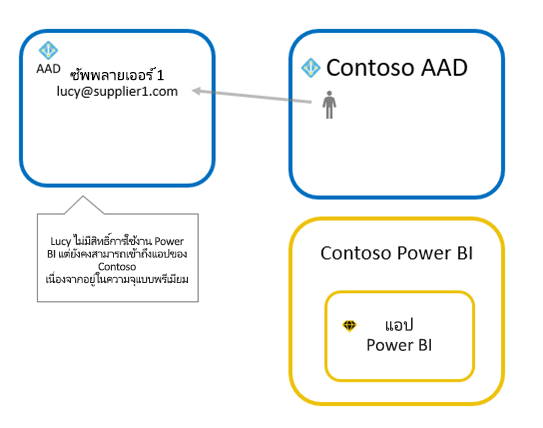

### วิธีที่ 2: Contoso มอบหมายสิทธิ์การใช้งาน Power BI Pro ให้กับผู้ใช้ที่เป็นผู้เยี่ยมชม

ด้วยวิธีนี้ Contoso สามารถมอบหมายสิทธิ์การใช้งาน pro ให้ผู้ใช้ที่เป็นผู้เยี่ยมชมจากองค์กรคู่ค้า – ซึ่งสามารถทำได้จากศูนย์ดูแลระบบ Microsoft 365 ของ Contoso การดำเนินการนี้อนุญาตให้ผู้ใช้ที่เป็นผู้เยี่ยมชมจากองค์กรคู่ค้าเข้าถึงแอป Power BI ของ Contoso ได้โดยไม่ต้องซื้อสิทธิ์การใช้งานด้วยตนเอง ซึ่งอาจเหมาะสมสำหรับการแชร์กับผู้ใช้ภายนอกที่องค์กรยังไม่ได้ปรับใช้ Power BI

> [!NOTE]
> _สิทธิ์การใช้งาน pro ของ Contoso มีผลกับผู้ใช้ที่เป็นผู้เยี่ยมชมเฉพาะเมื่อพวกเขาเข้าถึงเนื้อหาในผู้เช่า Contoso เท่านั้น สิทธิ์การใช้งาน pro เปิดใช้งานการเข้าถึงเนื้อหาที่ไม่ได้อยู่ในความจุ Power BI Premium อย่างไรก็ตาม ผู้ใช้ภายนอกที่มีสิทธิ์การใช้งาน Pro จะถูกจำกัดตามค่าเริ่มต้นให้มีเฉพาะประสบการณ์การรับข้อมูล การดำเนินการนี้เปลี่ยนแปลงได้โดยใช้วิธีการที่อธิบายไว้ในส่วน_ _การเปิดใช้งานผู้ใช้ภายนอกเพื่อแก้ไข และจัดการเนื้อหาภายใน Power BI_ _ภายหลังในเอกสารนี้_

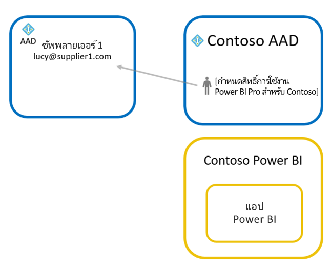

### วิธีที่ 3: ผู้ใช้ที่เป็นผู้เยี่ยมชมนำสิทธิ์การใช้งาน Power BI Pro ของพวกเขามาใช้

ด้วยวิธีนี้ ซัพพลายเออร์ 1 มอบหมายสิทธิ์การใช้งาน Power BI Pro ให้กับ Lucy จากนั้น เธอสามารถเข้าถึงแอป Power BI ของ Contoso ด้วยสิทธิ์การใช้งานนี้ เนื่องจาก Lucy สามารถใช้สิทธิ์การใช้งาน Pro ของเธอจากองค์กรของตนเองเมื่อเข้าถึงสภาพแวดล้อม Power BI ภายนอก วิธีนี้ในบางครั้งเรียกว่า _นำสิทธิ์การใช้งานของคุณมาเอง_ (BYOL) ถ้าทั้งสององค์กรใช้ Power BI วิธีนี้มีประโยชน์จากสิทธิ์การใช้งานสำหรับโซลูชันการวิเคราะห์โดยรวม และช่วยลดค่าใช้จ่ายการกำหนดสิทธิ์การใช้งานให้ผู้ใช้ภายนอก

> [!NOTE]
> _สิทธิ์การใช้งาน pro ที่กำหนดให้ Lucy โดยซัพพลายเออร์ 1 มีผลกับผู้เช่า Power BI ใด ๆ ที่ Lucy เป็นผู้ใช้ที่เป็นผู้เยี่ยมชม สิทธิ์การใช้งาน pro เปิดใช้งานการเข้าถึงเนื้อหาที่ไม่ได้อยู่ในความจุ Power BI Premium อย่างไรก็ตาม ผู้ใช้ภายนอกที่มีสิทธิ์การใช้งาน Pro จะถูกจำกัดตามค่าเริ่มต้นให้มีเฉพาะประสบการณ์การรับข้อมูล การดำเนินการนี้เปลี่ยนแปลงได้โดยใช้วิธีการที่อธิบายไว้ในส่วน_ _การเปิดใช้งานผู้ใช้ภายนอกเพื่อแก้ไข และจัดการเนื้อหาภายใน Power BI_ _ภายหลังในเอกสารนี้_

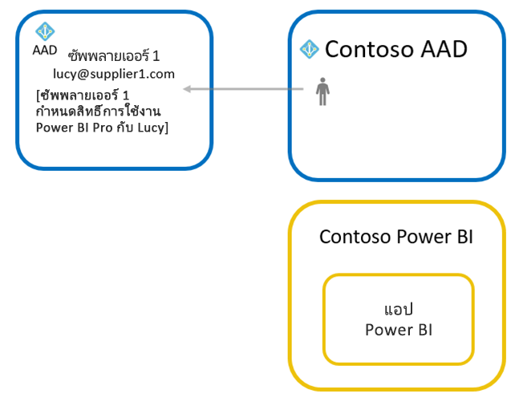

## ความปลอดภัยของข้อมูลสำหรับคู่ค้าภายนอก

โดยทั่วไปเมื่อทำงานกับซัพพลายเออร์ภายนอกจำนวนมาก Contoso จำเป็นต้องตรวจสอบให้แน่ใจว่า ซัพพลายเออร์แต่ละรายเห็นเฉพาะข้อมูลเกี่ยวกับผลิตภัณฑ์ของตนเองเท่านั้น การรักษาความปลอดภัยตามผู้ใช้และการรักษาความปลอดภัยระดับแถวแบบไดนามิกทำได้ง่ายโดยใช้ Power BI

### การรักษาความปลอดภัยตามผู้ใช้

หนึ่งในคุณลักษณะที่มีประสิทธิภาพที่สุดของ Power BI คือการรักษาความปลอดภัยระดับแถว คุณลักษณะนี้ช่วยให้ Contoso สร้างรายงานและชุดข้อมูล แต่ยังคง ใช้กฎความปลอดภัยที่แตกต่างกันสำหรับผู้ใช้แต่ละราย สำหรับคำอธิบายโดยละเอียด ดู [การรักษาความปลอดภัยระดับแถว (RLS)](https://powerbi.microsoft.com/documentation/powerbi-admin-rls/)

Power BI รวมเข้ากับ Azure AD B2B อนุญาตให้ Contoso กำหนดกฎการรักษาความปลอดภัยระดับแถวให้แก่ผู้ใช้ที่เป็นผู้เยี่ยมชมทันทีที่พวกเขาได้รับเชิญไปยังผู้เช่า Contoso ขณะที่เราเคยเห็นมาก่อน Contoso สามารถเพิ่มผู้ใช้ที่เป็นผู้เยี่ยมชมผ่านการเชิญแบบวางแผนหรือเฉพาะกิจอย่างใดอย่างหนึ่ง ถ้า Contoso ต้องการเสริมความปลอดภัยระดับแถว ขอแนะนำการใช้คำเชิญที่วางแผนไว้เพื่อเพิ่มผู้ใช้ที่เป็นผู้เยี่ยมชมก่อนเวลาและกำหนดพวกเขาไปยังบทบาทการรักษาความปลอดภัยก่อนที่จะแชร์เนื้อหา ถ้าในทางกลับกัน Contoso คำเชิญแบบเฉพาะกิจ อาจเป็นระยะเวลาสั้น ๆ ที่ผู้เยี่ยมชมจะไม่สามารถดูข้อมูลใด ๆ

> [!NOTE]
> วิธีการนี้ทำให้เกิดความล่าช้าในการเข้าถึงข้อมูลที่มีการป้องกันโดย RLS เมื่อใช้คำเชิญแบบเฉพาะกิจ อาจทำให้ต้องร้องขอการสนับสนุนจากทีม IT ของคุณ เนื่องจากผู้ใช้จะเห็นรายงาน/แดชบอร์ดเป็นหน้าว่างหรือเสีย เมื่อพวกเขาเปิดลิงก์ที่แชร์ในอีเมลที่พวกเขาได้รับ ดังนั้น ซึ่งจะแนะนำอย่างยิ่งให้ใช้คำเชิญที่วางแผนไว้ในสถานการณ์นี้* *

เรามาดูขั้นตอนนี้ด้วยตัวอย่างกัน

ตามที่กล่าวถึงก่อนหน้า Contoso มีซัพพลายเออร์ทั่วโลก และพวกเขาต้องการตรวจสอบให้แน่ใจว่า ผู้ใช้จากองค์กรซัพพลายเออร์ของพวกเขาได้รับข้อมูลเชิงลึกจากข้อมูลจากอาณาเขตของพวกเขาเท่านั้น  แต่ผู้ใช้จาก Contoso สามารถเข้าถึงข้อมูลทั้งหมด แทนที่จะสร้างรายงานที่แตกต่างกันหลายฉบับ Contoso สร้างรายงานเดียว และใช้ตัวกรองข้อมูลตามผู้ใช้ที่ดูข้อมูลนั้น

เพื่อให้แน่ใจว่า Contoso สามารถกรองข้อมูลตามบุคคลที่จะเชื่อมต่อ จึงมีการสร้างบทบาทสองบทบาทขึ้นในเดสก์ท็อป Power BI หนึ่งเพื่อกรองข้อมูลทั้งหมดจาก SalesTerritory "ยุโรป" และอีกตัวกรองสำหรับ "อเมริกา"

เมื่อใดก็ตามที่กำหนดบทบาทในรายงาน ผู้ใช้ต้องกำหนดบทบาทเฉพาะเจาะจงสำหรับพวกเขาเพื่อเข้าถึงข้อมูลใด ๆ การมอบหมายบทบาทเกิดขึ้นภายในบริการ Power BI ( **ชุดข้อมูล > ความปลอดภัย**)

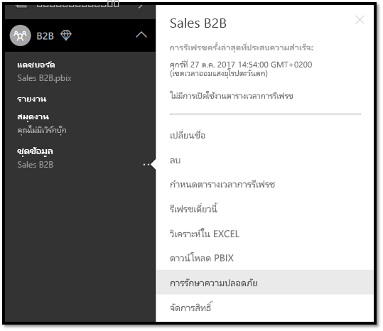

ซึ่งเปิดหน้าที่ทีม BI ของ Contoso สามารถดูสองบทบาทที่พวกเขาสร้างขึ้น  ตอนนี้ทีม BI ของ Contoso สามารถกำหนดผู้ใช้ให้กับบทบาทแล้ว

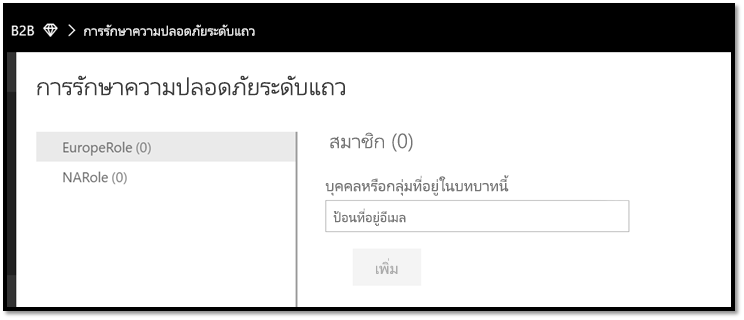

ในตัวอย่าง Contoso จะเพิ่มผู้ใช้ในองค์กรคู่ค้ากับอีเมลแอดเดรส "[adam@themeasuredproduct.com](mailto:adam@themeasuredproduct.com)" ลงในบทบาทยุโรป:

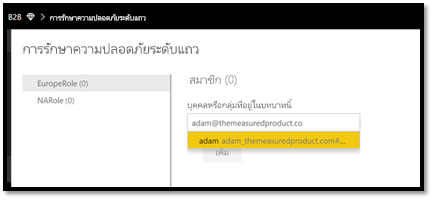

เมื่อ Azure AD แก้ไขเรื่องนี้แล้ว Contoso สามารถดูชื่อที่แสดงในหน้าต่างที่พร้อมที่จะเพิ่ม:

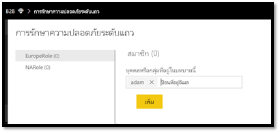

เวลานี้ เมื่อผู้ใช้นี้เปิดแอปที่ถูกแชร์กับเขา เขาจะเห็นเฉพาะรายงานที่ มีข้อมูลจากยุโรป:

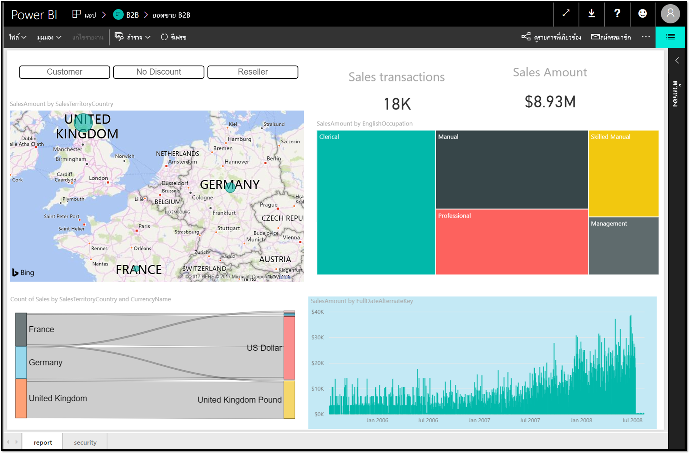

### การรักษาความปลอดภัยระดับแถวแบบไดนามิก

หัวข้ออื่นที่น่าสนใจคือการดูวิธีการรักษาความปลอดภัยระดับแถวแบบไดนามิก (RLS) ที่ทำงานด้วย Azure AD B2B

สรุป ความปลอดภัยระดับแถวแบบไดนามิกทำงาน โดยการกรองข้อมูลในแบบจำลองที่ยึดตามชื่อผู้ใช้ของบุคคลที่เชื่อมต่อกับ Power BI แทนที่จะเพิ่มหลายบทบาทสำหรับกลุ่มของผู้ใช้ คุณสามารถกำหนดผู้ใช้ในแบบจำลอง เราจะไม่อธิบายแพทเทิร์นแบบรายละเอียดในที่นี้ Kasper de Jong เสนอการเขียนโดยละเอียดขึ้นในการรักษาความปลอดภัยระดับแถวทั้งหมดใน [เอกสารข้อมูลสรุปการรักษาความปลอดภัย Power BI Desktop แบบไดนามิก](https://www.kasperonbi.com/power-bi-desktop-dynamic-security-cheat-sheet/) และใน [เอกสารทางเทคนิคนี้](https://msdn.microsoft.com/library/jj127437.aspx)

มาดูตัวอย่างขนาดเล็ก - Contoso มีรายงานอย่างง่ายเกี่ยวกับยอดขายตามกลุ่ม:

ขณะนี้รายงานนี้จำเป็นต้องแชร์กับผู้ใช้ที่เป็นผู้เยี่ยมชมสองรายและผู้ใช้ภายในหนึ่งราย โดยผู้ใช้ภายในสามารถดูทุกอย่าง แต่ผู้ใช้ที่เป็นผู้เยี่ยมชมสามารถดูเฉพาะกลุ่มที่พวกเขาสามารถเข้าถึงเท่านั้น ซึ่งหมายความว่า เราต้องกรองข้อมูลสำหรับผู้ใช้ที่เป็นผู้เยี่ยมชมเท่านั้น การกรองข้อมูลอย่างเหมาะสม Contoso ใช้รูปแบบ RLS แบบไดนามิกตามที่อธิบายไว้ในเอกสารทางเทคนิคและบล็อกโพสต์ ซึ่งหมายความว่า Contoso เพิ่มชื่อผู้ใช้ที่ลงตัวข้อมูลเอง:

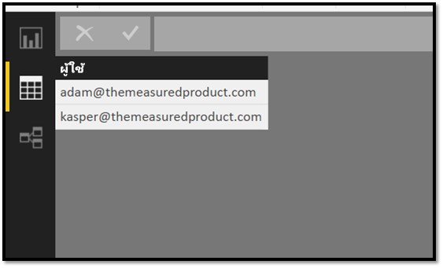

จากนั้น Contoso สร้างแบบจำลองข้อมูลที่ถูกต้องที่กรองข้อมูลอย่างเหมาะสมกับความสัมพันธ์ที่ถูกต้อง:

เมื่อต้องกรองข้อมูลโดยอัตโนมัติตามบุคคลที่จะเข้าสู่ระบบ Contoso จำเป็นต้องสร้างบทบาทที่ส่งผ่านในผู้ใช้ที่จะเชื่อมต่อ ในกรณีนี้ Contoso สร้างบทบาทสองบทบาท บทบาทแรกคือ "securityrole" ที่กรองตารางผู้ใช้ที่มีชื่อผู้ใช้ปัจจุบันของผู้ใช้ที่เข้าสู่ระบบ Power BI (ซึ่งสามารถใช้ได้แม้แต่กับผู้ใช้ที่เป็นผู้เยี่ยมชม Azure AD B2B)

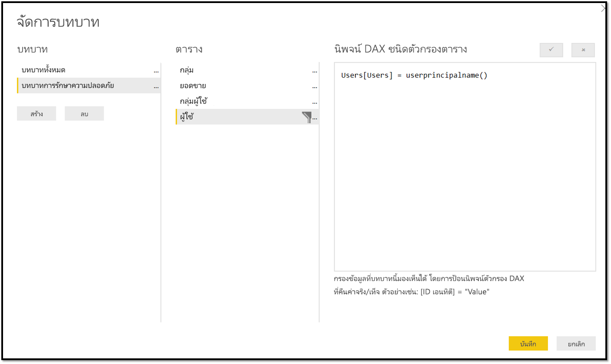

Contoso ยังสร้างอื่น "AllRole" อีกรายการสำหรับผู้ใช้ภายในที่สามารถดูทุกอย่าง โดยบทบาทนี้ไม่ได้ตั้งอยู่บนพื้นฐษนการรักษาความปลอดภัยใด ๆ

หลังจากอัปโหลดไฟล์เดสก์ท็อป Power BI ไปยังบริการแล้ว Contoso สามารถกำหนดให้ผู้ใช้ที่เป็นผู้เยี่ยมชมเป็น "SecurityRole" และผู้ใช้ภายในเป็น "AllRole"

ตอนนี้ เมื่อผู้ใช้ที่เป็นผู้เยี่ยมชมเปิดรายงานในเวลานี้ เขาจะเห็นเฉพาะยอดขายจากกลุ่ม A:

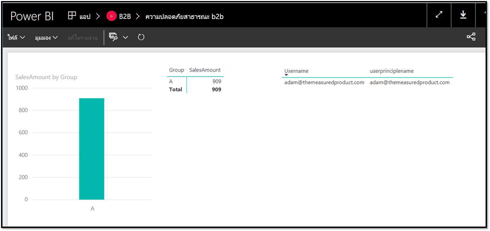

ในเมทริกซ์ไปทางด้านขวา คุณสามารถดูผลลัพธ์ของฟังก์ชัน USERNAME() และ USERPRINCIPALNAME() ทั้งคู่ตอบกลับอีเมลแอดเดรสของผู้ใช้ที่เป็นผู้เยี่ยมชม

ตอนนี้ ผู้ใช้ภายในได้รับเพื่อดูข้อมูลทั้งหมด:

ตามที่คุณเห็น RLS แบบไดนามิกทำงานกับผู้ใช้ภายใน หรือผู้ใช้ที่เป็นผู้เยี่ยมชม

> [!NOTE]
> สถานการณ์สมมตินี้ยังทำงานเมื่อใช้แบบจำลองใน Azure Analysis Services โดยปกติแล้ว Azure Analysis Service ของคุณเชื่อมต่อกับ Azure AD เดียวกันเป็น Power BI ของคุณ ในกรณีดังกล่าว Azure Analysis Services ยังทราบผู้ใช้ที่เป็นผู้เยี่ยมชมที่ได้รับเชิญผ่าน Azure AD B2B

## การเชื่อมต่อกับแหล่งข้อมูลภายในองค์กรของคุณ

Power BI นำเสนอความสามารถให้ Contoso ใช้ประโยชน์จากแหล่งข้อมูลภายในองค์กรของตน เช่น [SQL Server Analysis Services](https://powerbi.microsoft.com/documentation/powerbi-gateway-enterprise-manage-ssas/) หรือ [SQL Server](https://powerbi.microsoft.com/documentation/powerbi-gateway-kerberos-for-sso-pbi-to-on-premises-data/) ทั้งหมดนี้เป็นเพราะมี [เกตเวย์ข้อมูลภายในองค์กร](https://powerbi.microsoft.com/documentation/powerbi-gateway-onprem/) นอกจากนี้ยังสามารถลงชื่อเข้าใช้ไปยังแหล่งข้อมูลเหล่านั้นมีข้อมูลประจำตัวเดียวกันเหมือนที่ใช้กับ Power BI

> [!NOTE]
> เมื่อติดตั้งเกตเวย์เพื่อเชื่อมต่อกับผู้เช่า Power BI ของคุณ คุณต้องใช้ผู้ใช้ที่สร้างขึ้นภายในผู้เช่าของคุณ ผู้ใช้ภายนอกไม่สามารถติดตั้งเกตเวย์และเชื่อมต่อเข้ากับผู้เช่าของคุณ

สำหรับผู้ใช้ภายนอก เรื่องนี้อาจซับซ้อนมากขึ้นเนื่องจากผู้ใช้ภายนอกโดยปกติแล้วจะไม่ทราบ AD ภายในองค์กร Power BI เสนอวิธีการแก้ปัญหานี้ โดยการอนุญาตให้ผู้ดูแลระบบ Contoso แมปชื่อผู้ใช้ภายนอกไปยังชื่อผู้ใช้ภายในตามที่อธิบายไว้ใน [จัดการแหล่งข้อมูลของคุณ - Analysis Services](https://powerbi.microsoft.com/documentation/powerbi-gateway-enterprise-manage-ssas/) ตัวอย่าง [ lucy@supplier1.com ](mailto:lucy@supplier1.com) สามารถแมปไปยัง [lucy\_supplier1\_com #EXT@contoso.com](mailto:lucy_supplier1_com)ได้

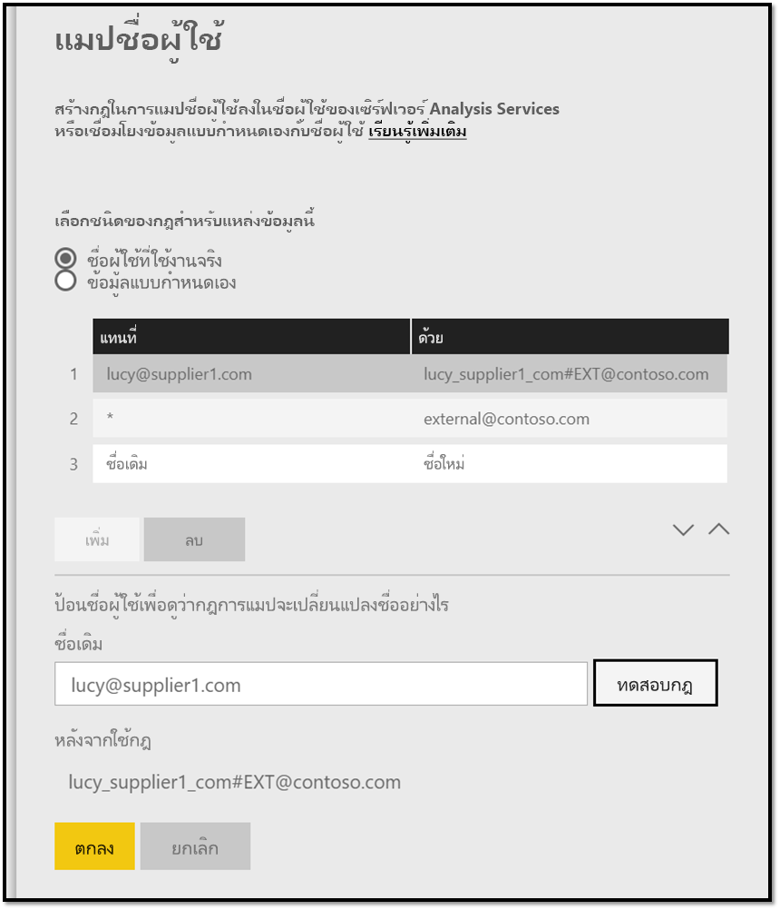

วิธีนี้ทำได้ถ้า Contoso มีผู้ใช้เพียงเล็กน้อย หรือถ้า Contoso สามารถแมปผู้ใช้ภายนอกทั้งหมดไปเป็นบัญชีภายในบัญชีเดียว สำหรับสถานการณ์ที่ซับซ้อนกว่าที่ผู้ใช้แต่ละรายต้องมีข้อมูลประจำตัวของตนเอง ไม่มีวิธีการแบบขั้นสูงกว่าที่ใช้ [แอตทริบิวต์แบบกำหนดเองของ AD](https://technet.microsoft.com/library/cc961737.aspx) เพื่อทำการแมปตามที่อธิบายไว้ใน [จัดการแหล่งข้อมูลของคุณ - Analysis Services](https://powerbi.microsoft.com/documentation/powerbi-gateway-enterprise-manage-ssas/) ซึ่งจะช่วยให้ผู้ดูแลระบบ Contoso กำหนดแมปสำหรับผู้ใช้ทุกคนใน Azure AD (และ B2B ผู้ใช้ภายนอก)  แอตทริบิวต์เหล่านี้สามารถตั้งค่าผ่านรูปแบบวัตถุ AD โดยใช้สคริปต์หรือโค้ดเพื่อให้ Contoso สามารถแมปในขณะเชิญหรือในช่วงเวลาที่กำหนดได้อย่างอัตโนมัติ

## ทำให้ผู้ใช้ภายนอกแก้ไข และจัดการเนื้อหาภายใน Power BI ได้

Contoso สามารถอนุญาตให้ผู้ใช้ภายนอกสนับสนุนเนื้อหาภายในองค์กรตามที่อธิบายไว้ก่อนหน้านี้ในส่วนของการแก้ไขและการจัดการเนื้อหา Power BI ข้ามองค์กร

> [!NOTE]
> เมื่อต้องแก้ไข และจัดการเนื้อหาภายใน Power BI ขององค์กรของคุณ ผู้ใช้ต้องมีสิทธิ์การใช้งาน Power BI Pro ในพื้นที่ทำงานอื่นที่ไม่ใช่พื้นที่ทำงานของฉัน ผู้ใช้สามารถขอรับสิทธิ์การใช้งาน Pro ตามที่ครอบคลุมในส่วนของ _สิทธิ์การใช้งาน ของเอกสารนี้ได้_

พอร์ทัลผู้ดูแลระบบ Power BI มีการตั้งค่า **อนุญาตผู้ใช้ที่เป็นผู้เยี่ยมชมภายนอกให้แก้ไข และจัดการเนื้อหาในองค์กร** ในการตั้งค่าผู้เช่า ตามค่าเริ่มต้น การตั้งค่าถูกตั้งค่าเป็นปิดใช้งาน ซึ่งหมายความว่า ผู้ใช้ภายนอกได้รับประสบการณ์แบบอ่านอย่างเดียวที่มีข้อจำกัดตามค่าเริ่มต้น การตั้งค่ามีผลกับผู้ใช้ที่มี UserType (ประเภทผู้ใช้) ตั้งค่าเป็น Guest (ผู้เยี่ยมชม) ใน Azure AD ตารางด้านล่างนี้อธิบายพฤติกรรมที่ผู้ใช้มีประสบการณ์โดยขึ้นอยู่กับ UserType (ประเภทผู้ใช้) ของพวกเขาและวิธีการกำหนดค่าการตั้งค่า

| **ประเภทผู้ใช้ใน Azure AD** | **อนุญาตให้ผู้ใช้ที่เป็นผู้เยี่ยมชมภายนอกแก้ไขและจัดการการตั้งค่าเนื้อหา** | **พฤติกรรม** |
| --- | --- | --- |
| แขก | ปิดใช้งานสำหรับผู้ใช้ (ค่าเริ่มต้น) | มุมมองปริมาณการใช้งานต่อรายการเท่านั้น อนุญาตให้เข้าถึงแบบอ่านอย่างเดียวไปยังรายงาน แดชบอร์ด และแอปเมื่อดูผ่าน URL ที่ส่งไปยังผู้ใช้ที่เป็นผู้เยี่ยมชม แอปสำหรับอุปกรณ์มือถือ Power BI ให้มุมมองแบบอ่านอย่างเดียวแก่ผู้ใช้ที่เป็นผู้เยี่ยมชม |
| แขก | เปิดใช้งานสำหรับผู้ใช้ | ผู้ใช้ภายนอกสามารถเข้าถึงประสบการณ์เต็มรูปแบบของ Power BI แม้ว่าคุณลักษณะบางอย่างจะไม่พร้อมใช้งานสำหรับพวกเขา ผู้ใช้ภายนอกต้องเข้าสู่ระบบ Power BI โดยใช้ URL บริการ Power BI ที่มีข้อมูลของผู้เช่ารวมอยู่ ผู้ใช้รับประสบการณ์หน้าแรก พื้นที่ทำงานของฉัน และขึ้นอยู่กับสิทธิ์อนุญาต สามารถเรียกดู ดู และสร้างเนื้อหา    แอปสำหรับอุปกรณ์มือถือ Power BI ให้มุมมองแบบอ่านอย่างเดียวแก่ผู้ใช้ที่เป็นผู้เยี่ยมชม |

> [!NOTE]
> นอกจากนี้ผู้ใช้ภายนอกใน Azure AD ยังสามารถตั้งค่าเป็นสมาชิกประเภทผู้ใช้ ซึ่งปัจจุบันยังไม่รองรับใน Power BI

ในพอร์ทัลผู้ดูแลระบบ Power BI การตั้งค่าจะแสดงในรูปต่อไปนี้

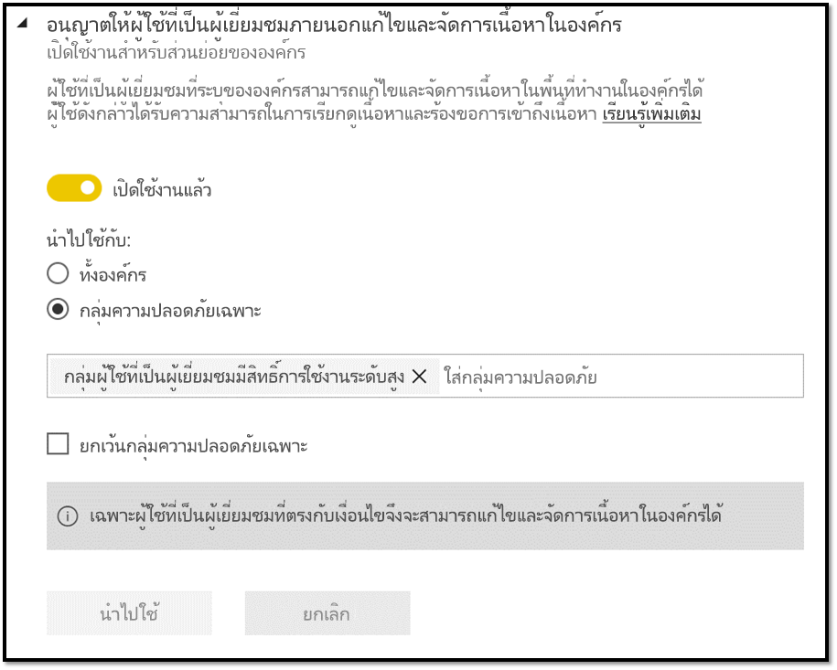

ผู้ใช้ที่เป็นผู้เยี่ยมชมได้รับประสบการณ์เริ่มต้นแบบอ่านอย่างเดียวและที่สามารถแก้ไข และจัดการเนื้อหาได้ ค่าเริ่มต้นถูกปิดใช้งาน ซึ่งหมายความว่า ผู้ใช้ที่เป็นผู้เยี่ยมชมทั้งหมดมีประสบการณ์แบบอ่านอย่างเดียว ผู้ดูแลระบบ Power BI สามารถจะเปิดใช้งานการตั้งค่าสำหรับผู้เยี่ยมชมทั้งหมดในองค์กร หรือกลุ่มปลอดภัยเฉพาะที่กำหนดไว้ใน Azure AD ในรูปต่อไปนี้ ผู้ดูแลระบบ Contoso Power BI สร้างกลุ่มปลอดภัยใน Azure AD เพื่อจัดการว่าผู้ใช้ภายนอกรายใดสามารถแก้ไข และจัดการเนื้อหาในผู้เช่า Contoso

เพื่อช่วยให้ผู้ใช้เหล่านี้ลงชื่อเข้าใช้ใน Power BI ให้จัดเตรียม URL ผู้เช่าให้แก่พวกเขา เมื่อต้องการค้นหา URL ของผู้เช่า กรุณาทำตามขั้นตอนเหล่านี้

1. ในบริการของ Power BI ที่เมนูด้านบน ให้เลือกความช่วยเหลือ (**?** ) จากนั้น **เกี่ยวกับ Power BI**
2. ค้นหาค่าที่อยู่ถัดจาก **URL ผู้เช่า** นี่คือ URL ของผู้เช่าที่คุณสามารถแบ่งปันกับผู้ใช้ที่เป็นผู้เยี่ยมชมของคุณได้

    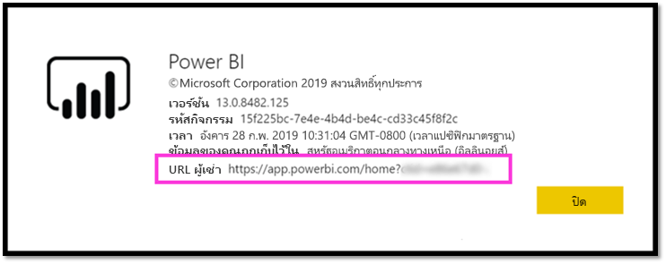

เมื่อใช้ อนุญาตผู้ใช้ที่เป็นผู้เยี่ยมชมภายนอกให้แก้ไข และจัดการเนื้อหาภายในองค์กร ผู้ใช้ที่เป็นผู้เยี่ยมชมที่ระบุจะได้รับสิทธิ์เข้าถึง Power BI ขององค์กรคุณและดูเนื้อหาใด ๆ ที่พวกเขาได้รับอนุญาต พวกเขาสามารถเข้าถึงหน้าแรก เรียกดู และมีส่วนร่วมในเนื้อหาไปยังพื้นที่ทำงาน ติดตั้งแอปที่อยู่ในรายการเข้าถึง และมีพื้นที่ทำงานของฉัน พวกเขาสามารถสร้าง หรือเป็นผู้ดูแลระบบของพื้นที่ทำงานที่ใช้ประสบการณ์พื้นที่ทำงานใหม่

> [!NOTE]
> เมื่อใช้ตัวเลือกนี้ ตรวจสอบให้แน่ใจว่าได้ตรวจทานส่วนกำกับดูแลของเอกสารนี้เนื่องจากค่าเริ่มต้นการตั้งค่า Azure AD ป้องกันไม่ให้ผู้ใช้ที่เป็นผู้เยี่ยมชมใช้คุณลักษณะบางอย่างเช่นตัวเลือกบุคคลที่สามารถทำให้ประสบการณ์ลดลง* *

สำหรับผู้ใช้ที่เป็นผู้เยี่ยมชม ผู้ใช้ดังกล่าวสามารถเปิดใช้งานผ่านทาง อนุญาตผู้ใช้ที่เป็นผู้เยี่ยมชมภายนอกให้แก้ไข และจัดการเนื้อหา ในการตั้งค่าผู้เช่าองค์กร โดยประสบการณ์การใช้งานบางอย่างจะไม่พร้อมใช้งานสำหรับพวกเขา หากต้องการอัปเดตหรือเผยแพร่รายงาน ผู้ใช้ที่เป็นผู้เยี่ยมชมจำเป็นต้องใช้ UI ของเว็บบริการ Power BI รวมถึง รับข้อมูล เพื่ออัปโหลดไฟล์ Power BI Desktop ประสบการณ์การใช้งานต่อไปนี้ไม่ได้รับการสนับสนุน:

- เผยแพร่จาก Power BI desktop ไปยังบริการ Power BI โดยตรง
- ผู้ใช้ที่เป็นผู้เยี่ยมชมไม่สามารถใช้ Power BI desktop เพื่อเชื่อมต่อกับชุดข้อมูลบริการในบริการ Power BI ได้
- พื้นที่ทำงานแบบคลาสสิกที่ผูกกับกลุ่ม Office 365: ผู้ใช้ที่เป็นผู้เยี่ยมชมไม่สามารถสร้าง หรือเป็นผู้ดูแลระบบของพื้นที่ทำงานเหล่านี้ พวกเขาสามารถเป็นสมาชิก
- ส่งคำเชิญเข้าร่วมกิจไม่ได้รับการสนับสนุนสำหรับรายการเข้าถึงพื้นที่ทำงาน
- Power BI Publisher สำหรับ Excel ไม่ได้รับการสนับสนุนสำหรับผู้ใช้ที่เป็นผู้เยี่ยมชม
- ผู้ใช้ที่เป็นผู้เยี่ยมชมไม่สามารถติดตั้ง Power BI Gateway และเชื่อมต่อกับองค์กรของคุณ
- ผู้ใช้ที่เป็นผู้เยี่ยมชมไม่สามารถติดตั้งแอปที่เผยแพร่ไปยังทั้งองค์กร
- ผู้ใช้ที่เป็นผู้เยี่ยมชมไม่สามารถใช้ สร้าง อัปเด หรือติดตั้งชุดเนื้อหาองค์กร
- ผู้ใช้ที่เป็นผู้เยี่ยมชมไม่สามารถใช้การวิเคราะห์ใน Excel
- ผู้ใช้ที่เป็นผู้เยี่ยมชมไม่สามารถอยู่@mentionedในการแสดงข้อคิดเห็น (ฟังก์ชันนี้จะถูกเพิ่มในรุ่นถัดไป)
- ผู้ใช้ที่เป็นผู้เยี่ยมชมไม่สามารถใช้การสมัครใช้งาน (ฟังก์ชันนี้จะถูกเพิ่มในรุ่นถัดไป)
- ผู้ใช้ที่เป็นผู้เยี่ยมชมที่ใช้ความสามารถนี้ควรมีบัญชีที่ทำงาน หรือโรงเรียน ผู้ใช้ที่เป็นผู้เยี่ยมชมที่ใช้บัญชีส่วนบุคคลพบข้อจำกัดเพิ่มเติมเนื่องจากข้อจำกัดการลงชื่อเข้าใช้

## การควบคุมดูแล

### การตั้งค่า Azure AD เพิ่มเติมที่มีผลต่อประสบการณ์ใน Power BI ที่เกี่ยวข้องกับ Azure AD B2B

เมื่อใช้การแชร์ Azure AD B2B ผู้ดูแลระบบ Azure Active Directory ควบคุมลักษณะของประสบการณ์ของผู้ใช้ภายนอก สิ่งต่อไปนี้จะถูกควบคุมบนหน้าการตั้งค่าการทำงานร่วมกันภายนอกในการตั้งค่า Azure Active Directory สำหรับผู้เช่าของคุณ

รายละเอียดเกี่ยวกับการตั้งค่ามีดังนี้:

[https://docs.microsoft.com/azure/active-directory/b2b/delegate-invitations](https://docs.microsoft.com/azure/active-directory/b2b/delegate-invitations)

> [!NOTE]
> ตามค่าเริ่มต้น สิทธิ์ผู้ใช้ที่เป็นผู้เยี่ยมชมจะถูกตั้งค่าตัวเลือกจำกัดเป็นใช่ ดังนั้นผู้ใช้ที่เป็นผู้เยี่ยมชมภายใน Power BI จึงมีประสบการณ์จำกัดโดยเฉพาะอย่างยิ่ง การแชร์รอบ ๆ เมื่อ UI ตัวเลือกบุคคลไม่ทำงานสำหรับผู้ใช้เหล่านั้น เป็นสิ่งสำคัญที่ต้องทำงานกับผู้ดูแลระบบ Azure AD ของคุณเพื่อตั้งค่าเป็นไม่ใช่ ดังที่แสดงด้านล่างเพื่อให้ได้รับประสบการณ์ดี* *

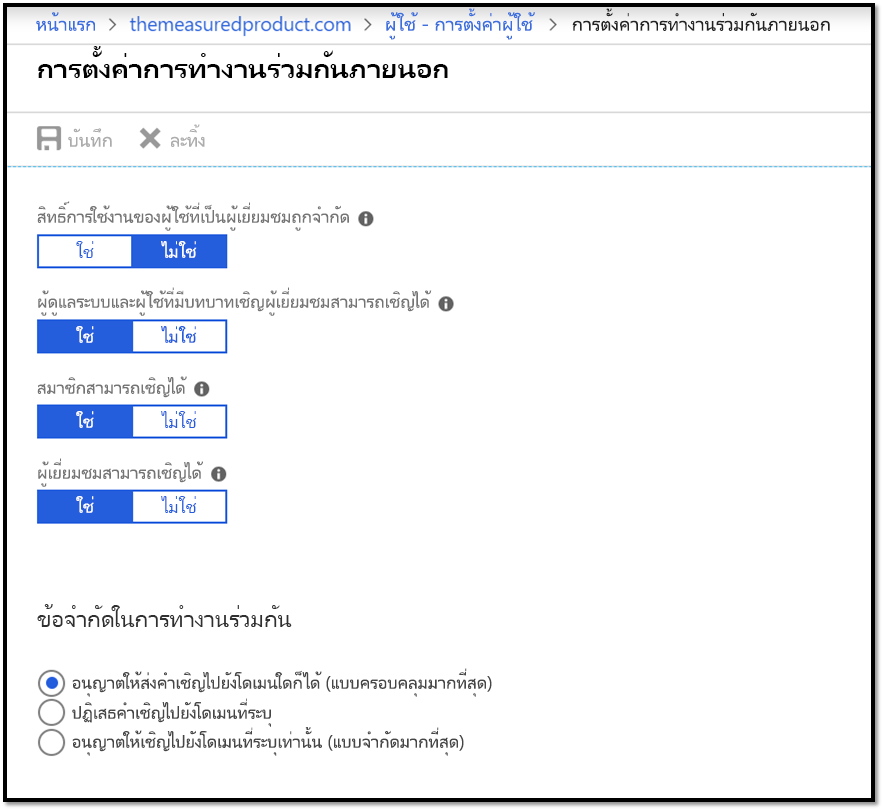

### การควบคุมการเชิญผู้เยี่ยมชม

ผู้ดูแลระบบ power BI สามารถควบคุมการแชร์ภายนอกสำหรับ Power BI โดยไปที่พอร์ทัลผู้ดูแลระบบ Power BI แต่ผู้ดูแลระบบผู้เช่ายังสามารถควบคุมการแชร์ภายนอกด้วยนโยบาย Azure AD ต่าง ๆ  นโยบายเหล่านี้ช่วยให้ผู้ดูแลระบบผู้เช่า

- ปิดคำเชิญโดยผู้ใช้ปลายทาง
- เฉพาะผู้ดูแลระบบและผู้ใช้ที่มีบทบาทผู้เชิญผู้เยี่ยมชมสามารถเชิญได้
- ผู้ดูแลระบบ บทบาทผู้เชิญผู้เยี่ยมชม และสมาชิกสามารถเชิญได้
- ผู้ใช้ทั้งหมด รวมถึงผู้เยี่ยมชม สามารถเชิญได้

คุณสามารถอ่านเพิ่มเติมเกี่ยวกับนโยบายเหล่านี้ใน [มอบสิทธิ์คำเชิญสำหรับทำงานร่วมกันของ Azure Active Directory B2B](https://docs.microsoft.com/azure/active-directory/active-directory-b2b-delegate-invitations)

การดำเนินการ Power BI ทั้งหมดโดยผู้ใช้ภายนอกยัง [ถูกตรวจสอบในพอร์ทัลการตรวจสอบของเรา](https://powerbi.microsoft.com/documentation/powerbi-admin-auditing/)

### นโยบายการเข้าถึงตามเงื่อนไขสำหรับผู้ใช้ที่เป็นผู้เยี่ยมชม

Contoso สามารถบังคับใช้นโยบายการเข้าถึงตามเงื่อนไขสำหรับผู้ใช้ที่เป็นผู้เยี่ยมชมที่เข้าถึงเนื้อหาจากผู้เช่า Contoso คุณสามารถค้นหาคำแนะนำโดยละเอียดใน [การเข้าถึงตามเงื่อนไขสำหรับผู้ใช้ทำงานร่วมกัน B2B](https://docs.microsoft.com/azure/active-directory/active-directory-b2b-mfa-instructions)

## วิธีอื่นทั่วไป

ในขณะที่ Azure AD B2B ทำให้ง่ายต่อการแชร์ข้อมูลและรายงานทั่วทั้งองค์กรแล้ว ยังมีวิธีอื่น ๆ มากมายที่ใช้บ่อย และอาจเป็นระดับสูงในบางกรณี

### ตัวเลือกที่ 1: สร้างข้อมูลประจำตัวที่ซ้ำกันสำหรับผู้ใช้ที่เป็นคู่ค้า

ด้วยตัวเลือกนี้ Contoso มีการสร้างข้อมูลประจำตัวที่ซ้ำกันแบบแมนวลสำหรับผู้ใช้ที่เป็นคู่ค้าแต่ละรายในผู้เช่า Contoso ดังที่แสดงในรูปต่อไปนี้ จากนั้น ภายใน Power BI ทาง Contoso สามารถแชร์เพื่อกำหนดข้อมูลประจำตัวสำหรับรายงาน แดชบอร์ด หรือแอปที่เหมาะสม

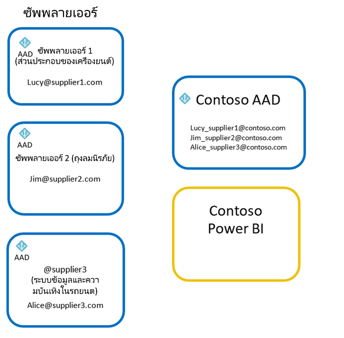

เหตุผลในการเลือกตัวเลือกนี้:

- เนื่องจากข้อมูลประจำตัวของผู้ใช้จะถูกควบคุม โดยองค์กรของคุณ บริการใด ๆ ที่เกี่ยวข้อง เช่นอีเมล SharePoint ฯลฯ ก็อยู่ภายในการควบคุมขององค์กรของคุณด้วยเช่นกัน ผู้ดูแลระบบ IT ของคุณสามารถรีเซ็ตรหัสผ่าน ปิดใช้งานการเข้าถึงบัญชี หรือตรวจสอบกิจกรรมในบริการเหล่านี้
- ผู้ใช้ที่ใช้บัญชีส่วนบุคคลสำหรับธุรกิจของพวกเขามักจะถูกจำกัดการเข้าถึงจากบริการบางอย่าง ดังนั้นจึงอาจต้องมีบัญชีขององค์กร
- บริการบางอย่างทำงานผ่านผู้ใช้ขององค์กรของคุณเท่านั้น ตัวอย่าง ใช้ Intune เพื่อจัดการเนื้อหาบนอุปกรณ์มือถือ/ส่วนบุคคลของผู้ใช้ภายนอกโดยใช้ Azure B2B อาจไม่สามารถทำได้

เหตุผลที่ไม่เลือกตัวเลือกนี้:

- ผู้ใช้จากองค์กรคู่ค้าต้องจดจำข้อมูลประจำตัว – หนึ่งสองชุด หนึ่งคือเพื่อเข้าถึงเนื้อหาจากองค์กรของพวกเขาเอง และอีกชุดเพื่อเข้าถึงเนื้อหาจาก Contoso นี่เป็นเรื่องยุ่งยากสำหรับผู้ใช้ที่เป็นผู้เยี่ยมชมเหล่านี้ และผู้ใช้ที่เป็นผู้เยี่ยมชมจำนวนมากสับสนเกี่ยวกับประสบการณ์การใช้งานนี้
- Contoso ต้องซื้อ และกำหนดสิทธิ์การใช้งานให้แก่ผู้ใช้เหล่านี้ ถ้าผู้ใช้จำเป็นต้องได้รับอีเมล หรือใช้แอปพลิเคชันสำนักงาน พวกเขาจำเป็นต้องมีสิทธิ์การใช้งานที่เหมาะสม รวมถึง Power BI Pro เพื่อแก้ไขและแชร์เนื้อหาใน Power BI
- Contoso อาจต้องการบังคับใช้นโยบายการกำกับดูแลและการให้อนุญาตที่เข้มงวดมากขึ้นสำหรับผู้ใช้ภายนอกเมื่อเทียบกับผู้ใช้ภายใน เพื่อให้บรรลุสิ่งนี้ Contoso จำเป็นต้องสร้างการตั้งชื่อภายในองค์กรสำหรับผู้ใช้ภายนอก และผู้ใช้ทั้งหมดของ Contoso จำเป็นต้องศึกษาเกี่ยวกับการตั้งชื่อนี้
- เมื่อผู้ใช้ออกจากองค์กรของพวกเขา พวกเขายังคงสามารถเข้าถึงทรัพยากรของ Contoso จนกว่าผู้ดูแลระบบ Contoso จะลบบัญชีของพวกเขาออกแบบแมนวล
- ผู้ดูแลระบบ Contoso จำเป็นต้องจัดการข้อมูลประจำตัวสำหรับผู้เยี่ยมชม รวมถึงการสร้าง รีเซ็ตรหัสผ่าน และอื่น ๆ

### ตัวเลือกที่ 2: สร้างแอปพลิเคชัน Power BI Embedded แบบกำหนดเองโดยใช้การรับรองความถูกต้องแบบกำหนดเอง

อีกทางเลือกสำหรับ Contoso คือ สร้างแอปพลิเคชัน Power BI แบบฝังตัวที่กำหนดเองด้วยการรับรองความถูกต้องแบบกำหนดเอง (['แอปเป็นเจ้าของข้อมูล'](https://docs.microsoft.com/power-bi/developer/embed-sample-for-customers)) ในขณะที่องค์กรจำนวนมากไม่มีเวลาหรือแหล่งข้อมูลเพื่อสร้างแอปพลิเคชันแบบกำหนดเองเพื่อแจกจ่ายเนื้อหา Power BI ให้กับคู่ค้าภายนอกของพวกเขา สำหรับบางองค์กรนี่จึงเป็นวิธีดีที่สุด และสมควรต่อการพิจารณาอย่างจริงจัง

บ่อยครั้งที่องค์กรมีพอร์ทัลคู่ค้าที่มีอยู่ที่รวมการเข้าถึงทรัพยากรขององค์กรทั้งหมดสำหรับคู่ค้า โดยแยกออกจากแหล่งข้อมูลขององค์กรภายใน และมอบประสบการณ์การใช้งานที่ราบรื่นสำหรับคู่ค้าเพื่อสนับสนุนคู่ค้าจำนวนมาก และผู้ใช้แต่ละรายการ

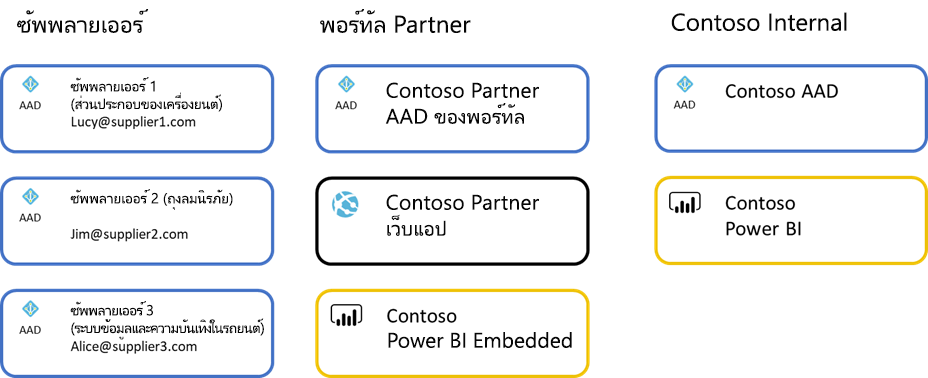

ในตัวอย่างด้านบน ผู้ใช้จากซัพพลายเออร์แต่ละแห่งเข้าสู่ระบบพอร์ทัลคู่ค้าของ Contoso ที่ใช้ AAD เป็นผู้ให้บริการข้อมูลประจำตัว โดยอาจใช้ AAD B2B, Azure B2C ข้อมูลประจำตัวเดิม หรือร่วมกับผู้ให้บริการข้อมูลประจำตัวอื่น ๆ จำนวนเท่าใดก็ได้ ผู้ใช้จะเข้าสู่ระบบ และเข้าถึงพอร์ทัลคู่ค้าที่สร้างขึ้นโดยใช้ Azure Web App หรือโครงสร้างพื้นฐานที่คล้ายกัน

ภายในเว็บแอป รายงาน Power BI จะฝังตัวจากการปรับใช้ Power BI Embedded เว็บแอปจะปรับปรุงประสิทธิภาพการเข้าถึงรายงานและบริการใด ๆ ที่เกี่ยวข้องในประสบการณ์ที่สอดคล้องกันโดยมีเป้าหมายเพื่อให้ซัพพลายเออร์ปฏิสัมพันธ์กับ Contoso ง่ายขึ้น สภาพแวดล้อมพอร์ทัลนี้จะถูกแยกออกจาก AAD ภายใน Contoso และสภาพแวดล้อม Power BI ภายใน Contoso เพื่อให้แน่ใจว่าซัพพลายเออร์จะไม่สามารถเข้าถึงแหล่งข้อมูลเหล่านั้น โดยทั่วไปแล้ว ข้อมูลจะถูกจัดเก็บไว้ในคลังข้อมูลของคู่ค้าที่แยกต่างหากเพื่อให้แน่ใจข้อมูลถูกแยกออกจากกันเช่นกัน การแยกนี้มีประโยชน์เนื่องจากจะจำกัดจำนวนผู้ใช้ภายนอกที่เข้าถึงข้อมูลขององค์กรของคุณโดยตรง จำกัดว่าข้อมูลอาจพร้อมใช้งานสำหรับผู้ใช้ภายนอก และจำกัดการแชร์กับผู้ใช้ภายนอกโดยไม่ตั้งใจ

การใช้ Power BI Embedded พอร์ทัลสามารถใช้ประโยชน์จากสิทธิ์การใช้งานที่เป็นประโยชน์ โดยใช้โทเค็นแอป หรือผู้ใช้มาสเตอร์ บวกกับความจุ Premium ที่ซื้อมาในแบบจำลอง Azure ซึ่งทำให้พิจารณาเกี่ยวกับการกำหนดสิทธิ์การใช้งานให้กับผู้ใช้ปลายทางได้ง่ายขึ้น และสามารถปรับสัดส่วนขึ้น/ลงตามการใช้งานที่คาดไว้ พอร์ทัลสามารถนำเสนอคุณภาพที่สูงกว่าโดยรวมและประสบการณ์ที่สอดคล้องกันเนื่องจากคู่ค้าเข้าถึงพอร์ทัลเดียวที่ออกแบบมาเพื่อความต้องการของคู่ค้าทั้งหมด สุดท้าย เนื่องจากโซลูชันที่อาศัย Power BI Embedded ถูกออกแบบมาเป็นผู้เช่าหลายราย จึงทำให้ง่ายต่อการแยกกันระหว่างองค์กรของคู่ค้า

เหตุผลในการเลือกตัวเลือกนี้:

- จัดการได้ง่ายกว่าเมื่อองค์กรคู่ค้ามีจำนวนเพิ่มขึ้น เนื่องจากคู่ค้าถูกเพิ่มเข้ามาในไดเรกทอรีที่แยกต่างหากจากไดเรกทอรี AAD ภายในของ Contoso จึงทำให้ง่ายต่อการกำกับดูแลของ IT และช่วยป้องกันไม่ให้แชร์ข้อมูลภายในผู้ใช้ภายนอกโดยไม่ตั้งใจ
- พอร์ทัลคู่ค้าทั่วไปเป็นประสบการณ์แบรนด์ระดับสูงที่มีประสบการณ์สอดคล้องระหว่างคู่ค้าและ ปรับปรุงให้มีประสิทธิภาพเพื่อตอบสนองความต้องการของคู่ค้าทั่วไป ดังนั้น Contoso จึงสามารถเสนอประสบการณ์รวมที่ดียิ่งขึ้นให้แก่คู่ค้าโดยการรวมบริการที่จำเป็นทั้งหมดลงในพอร์ทัลเดียว
- ค่าใช้จ่ายสิทธิ์การใช้งานสำหรับสถานการณ์สมมติขั้นสูง เช่น การแก้ไขเนื้อหาภายใน Power BI Embedded จะครอบคลุม โดย Azure ที่ซื้อ Power BI Premium และไม่จำเป็นต้องกำหนดสิทธิ์การใช้งาน Power BI Pro ให้ผู้ใช้เหล่านั้น
- มีการแยกทั่วทั้งคู่ค้าได้ดีขึ้นถ้ามีโครงสร้างเป็นโซลูชันแบบหลายผู้เช่า
- พอร์ทัลคู่ค้ามักจะมีเครื่องมืออื่น ๆ สำหรับคู่ค้านอกเหนือจากรายงาน แดชบอร์ด และแอป Power BI

เหตุผลที่ไม่เลือกตัวเลือกนี้:

- จำเป็นต้องใช้ความพยายามที่สำคัญในการสร้าง ดำเนินการ และบำรุงรักษาพอร์ทัลดังกล่าว ทำให้มีการลงทุนที่สำคัญในด้านทรัพยากรและเวลา
- เวลาในโซลูชันจะใช้เวลานานกว่าการใช้การแชร์ B2B เนื่องจากมีการวางแผนอย่างรอบคอบ และจำเป็นต้องมีการดำเนินการผ่านหลายกระบวนงาน
- เมื่อมีจำนวนคู่ค้าที่น้อยกว่า การลงทุนที่จำเป็นสำหรับตัวเลือกนี้มีแนวโน้มว่าสูงเกินจริง
- การทำงานร่วมกันด้วยการแชร์แบบเฉพาะกิจคือ สถานการณ์สมมติหลักที่องค์กรของคุณเผชิญ
- รายงานและแดชบอร์ดสำหรับคู่ค้าแต่ละรายแตกต่างกัน ตัวเลือกนี้แนะนำการจัดการค่าใช้จ่ายเกินโดยแค่แชร์กับคู่ค้าโดยตรง

## คำถามที่ถามบ่อย

**Contoso ส่งคำเชิญที่แลกใช้สิทธิ์ได้โดยอัตโนมัติ เพื่อให้ผู้ใช้ "พร้อมใช้งาน" ได้เลย ได้หรือไม่ หรือผู้ใช้จำเป็นต้องคลิกผ่าน URL แลกสิทธิ์เสมอหรือไม่**

ผู้ใช้ปลายทางต้องคลิกผ่านการให้ความยินยอมก่อนที่พวกเขาสามารถเข้าถึงเนื้อหา

ถ้าคุณจะเชิญผู้ใช้ที่เป็นผู้เยี่ยมชมจำนวนมาก เราขอแนะนำให้คุณมอบสิทธิ์นี้จากผู้ดูแลระบบ Azure AD หลักของคุณ โดย [เพิ่มผู้ใช้ลงในบทบาทเชิญผู้เชิญผู้เยี่ยมชมในองค์กรทรัพยากร](https://docs.microsoft.com/azure/active-directory/active-directory-b2b-add-guest-to-role) ผู้ใช้นี้สามารถเชิญผู้ใช้อื่น ๆ ในองค์กรคู่ค้า โดยใช้ UI ลงชื่อเข้าใช้ สคริปต์ PowerShell หรือ Api ได้ วิธีนี้ช่วยลดภาระของผู้ดูแลระบบ Azure AD ของคุณในการเชิญ หรือส่งคำเชิญซ้ำไปยัง่ผู้ใช้ในองค์กรคู่ค้า

**Contoso บังคับให้รับรองความถูกต้องแบบหลายปัจจัยสำหรับผู้ใช้ที่เป็นผู้เยี่ยมชมได้หรือไม่ ถ้าคู่ค้าไม่มีการรับรองความถูกต้องแบบหลายปัจจัย**

ใช่ สำหรับข้อมูลเพิ่มเติม ดู [เข้าถึงตามเงื่อนไขสำหรับผู้ใช้ทำงานร่วมกัน B2B](https://docs.microsoft.com/azure/active-directory/active-directory-b2b-mfa-instructions)

**การทำงานร่วมกันแบบ B2B ทำงานอย่างไรเมื่อคู่ค้าที่ได้รับเชิญนั้นใช้กลุ่มรวมในการเพิ่มการรับรองความถูกต้องภายในองค์กรของพวกเขา**

ถ้าคู่ค้าที่มีผู้เช่า Azure AD ที่รวมกลุ่มกันในโครงสร้างพื้นฐานการรับรองความถูกต้องภายในองค์กร จะได้รับการลงชื่อเข้าระบบครั้งเดียวภายในองค์กร (SSO) โดยอัตโนมัติ ถ้าคู่ค้าไม่มีผู้เช่า Azure AD อาจสร้างบัญชีผู้ใช้ Azure AD สำหรับผู้ใช้ใหม่

**ฉันสามารถเชิญผู้ใช้ที่เป็นผู้เยี่ยมชมที่มีบัญชีอีเมลของผู้บริโภคหรือไม่**

การเชิญผู้ใช้ที่เป็นผู้เยี่ยมชมที่มีบัญชีอีเมลของผู้บริโภคได้รับการสนับสนุนใน Power BI ซึ่งรวมถึงโดเมน เช่น hotmail.com, outlook.com และ gmail.com อย่างไรก็ตาม ผู้ใช้เหล่านั้นอาจประสบกับข้อจำกัดมากกว่าที่ผู้ใช้ที่มีบัญชีที่ทำงานหรือโรงเรียนประสบ