# การปรับใช้งานและการจัดการความจุของ Power BI Premium

**สรุป:** Power BI Premium มีประสิทธิภาพการทำงานที่สอดคล้องกันมากขึ้น การสนับสนุนสำหรับปริมาณข้อมูลขนาดใหญ่ และความยืดหยุ่นของการบริการตนเองแบบรวมและแพลตฟอร์ม BI ขององค์กรสำหรับทุกคนในองค์กรของคุณ เอกสารทางเทคนิคระดับ 300 ฉบับนี้เขียนขึ้นเป็นพิเศษเฉพาะสำหรับผู้ดูแลระบบ Power BI และผู้เขียนเนื้อหา และผู้เผยแพร่ เอกสารฉบับนี้มีวัตถุประสงค์เพื่อช่วยให้บุคคลเหล่านี้เข้าใจศักยภาพของ Power BI Premium และเรียนรู้วิธีการออกแบบ ปรับใช้ ตรวจสอบ และแก้ไขปัญหาโซลูชันที่ปรับขนาดได้

**ผู้เขียน:** [Peter Myers](https://www.linkedin.com/in/peterjsmyers) (MVP แพลตฟอร์มข้อมูล และผู้เชี่ยวชาญ BI อิสระด้วยโซลูชันแบบ Bitwise)

**ผู้ตรวจสอบทางเทคนิค:** Adam Saxton, Akshai Mirchandani, Bhavik Merchant, David Magar, Josh Caplan, Michael Blythe, Nimrod Shalit, Olivier Matrat, Swati Gupta

**นำไปใช้กับ:** บริการ Power BI, ความจุของ Power BI Premium และ Azure Power BI Embedded

> [!NOTE]
> คุณสามารถบันทึกหรือพิมพ์เอกสารทางเทคนิคนี้ โดยการเลือก**พิมพ์**จากเบราว์เซอร์ของคุณแล้วเลือก**บันทึกเป็น PDF**ได้

## แนะนำ Power BI

Power BI เป็นบริการการวิเคราะห์ธุรกิจที่ออกแบบมาเพื่อให้ข้อมูลเชิงลึกที่ช่วยให้สามารถตัดสินใจได้อย่างรวดเร็วและมีข้อมูลที่เป็นปัจจุบัน ตั้งแต่การวางจำหน่ายในปี 2015 นั้น บริการนี้ได้กลายเป็นบริการยอดนิยมอย่างรวดเร็วที่นำมาใช้เพื่อถ่ายทอดโซลูชันสำหรับองค์กรขนาดเล็กสุดไปจนถึงองค์กรขนาดใหญ่สุด

ซึ่งจะสามารถใช้งานได้ในสองวิธีได้แก่ เป็นบริการระบบคลาวด์ และเป็นโซลูชันการรายงานในองค์กรที่ชื่อว่า**เซิร์ฟเวอร์รายงาน Power BI** \[[1](#endnote-01)\]

Power BI ที่เป็นบริการคลาวด์เป็น Software-as-a-Service (SaaS) \[[2](#endnote-02)\] ซึ่งแสดงชุดของบริการและแอปพลิเคชันที่ช่วยให้องค์กรสามารถพัฒนา ปรับใช้ จัดการ แชร์โซลูชันเพื่อตรวจดูธุรกิจของพวกเขา

เอกสารทางเทคนิคนี้ไม่ได้มีจุดประสงค์เพื่อให้คำอธิบายเกี่ยวกับบริการ Power BI ที่ครอบคลุม แต่เน้นไปที่หัวข้อต่าง ๆ ที่เกี่ยวกับหัวเรื่องของ Power BI Premium สำหรับข้อมูลทั่วไปเกี่ยวกับ Power BI ดูที่[เอกสาร Power BI](service-admin-premium-multi-geo.md) ที่ครอบคลุม สำหรับคำอธิบายโดยละเอียดเพิ่มเติมของบริการ Power BI ซึ่งเน้นการปรับใช้ระดับองค์กรที่มีประสิทธิภาพและบรรลุผลสำเร็จ ดูที่เอกสารทางเทคนิค[การวางแผนการปรับใช้ Power BI Enterprise](https://aka.ms/pbienterprisedeploy)

ภายในบริบทของหัวเรื่องของเอกสารทางเทคนิคนี้ หัวข้อส่วนนี้จะแนะนำ และอธิบายความจุ ชนิดเนื้อหาของ Power BI โหมดที่เก็บข้อมูลแบบจำลอง และสิทธิ์การใช้งาน การทำความเข้าใจเกี่ยวกับหัวข้อเหล่านี้เป็นสิ่งจำเป็นเมื่อต้องการปรับใช้ และจัดการ Power BI Premium จนเป็นผลสำเร็จ

### ความจุ

**ความจุ**มีแนวคิด Power BI หลักแสดงถึงชุดของทรัพยากร (ที่เก็บข้อมูล ตัวประมวลผล และหน่วยความจำ) ที่ใช้เพื่อโฮสต์ และนำเสนอเนื้อหาของ Power BI ความจุเป็นได้ทั้งความจุที่ใช้ร่วมกันหรือความจุเฉพาะ **ความจุที่ใช้ร่วมกัน**คือความจุที่ใช้ร่วมกับลูกค้าคนอื่น ๆ ของ Microsoft ขณะที่**ความจุเฉพาะ**เป็นความจุที่ใช้กับลูกค้าคนเดียว ความจุเฉพาะจะนำเสนออยู่ในหัวข้อ[ความจุแบบพรีเมียม](#premium-capacities)

ในความจุที่ใช้ร่วมกัน ปริมาณงานจะทำงานบนแหล่งทรัพยากรเชิงคำนวณที่ใช้ร่วมกับลูกค้าคนอื่น ๆ เมื่อความจุต้องใช้ทรัพยากรร่วมกัน ขีดจำกัดจะถูกกำหนดไว้เพื่อให้แน่ใจว่า "fair play" เช่น ขนาดแบบจำลองสูงสุด (1 GB) และความถี่ในการรีเฟรชรายวันสูงสุด (แปดครั้งต่อวัน)

### พื้นที่ทำงาน

พื้นที่ทำงาน Power BI อยู่ภายในความจุ และแสดงถึงความปลอดภัย การทำงานร่วมกัน และการปรับใช้คอนเทนเนอร์ ผู้ใช้ Power BI แต่ละคนมีพื้นที่ทำงานส่วนบุคคลเรียกว่า**พื้นที่ทำงานของฉัน** สามารถสร้างพื้นที่ทำงานเพิ่มเติมเพื่อช่วยในการทำงานร่วมกันและการปรับใช้ และพื้นที่เหล่านี้เรียกว่า**พื้นที่ทำงานของแอป** ตามค่าเริ่มต้น พื้นที่ทำงาน รวมถึงพื้นที่ทำงานส่วนบุคคลจะถูกสร้างขึ้นในความจุที่ใช้ร่วมกัน

### ชนิดเนื้อหาของ Power BI

เมื่อต้องนำหัวข้อต่าง ๆ ของ Power BI Premium มาใช้ จำเป็นต้องเริ่มต้นด้วยการสนทนาโดยละเอียดเกี่ยวกัยสถาปัตยกรรมของ Power BI รวมถึงชนิดเนื้อหาพื้นฐาน

เนื้อหา Power BI ทั้งหมดถูกจัดเก็บ และจัดการภายในพื้นที่ทำงานซึ่งเป็นคอนเทนเนอร์สำหรับเนื้อหา Power BI ผู้ใช้ Power BI แต่ละคนมีพื้นที่ทำงานส่วนบุคคลของตนเอง แต่แนวทางปฏิบัติทั่วไปคือการสร้างพื้นที่ทำงานของแอป พื้นที่ทำงานของแอปเปิดใช้งานการเป็นเจ้าของร่วมของเนื้อหาและความสามารถในการทำงานร่วมกันในเนื้อหา นอกจากนี้ยังมีสามารถในการกำหนดลำดับขั้น และกระจายเนื้อหาไปยังผู้ชมทั่วไปกว้าง เช่นเดียวกับแอป

เนื้อหา Power BI ต่อไปนี้ถูกเก็บไว้ในพื้นที่ทำงาน:

- กระแสข้อมูล
- ชุดข้อมูล
- เวิร์กบุ๊ก
- รายงาน
- แดชบอร์ด

#### กระแสข้อมูล

กระแสข้อมูลของ Power BI ช่วยให้องค์กรสามารถรวมข้อมูลจากแหล่งข้อมูลที่แตกต่าง ข้อมูลเหล่านั้นถือเป็นข้อมูลที่จัดเตรียมและกำหนดลำดับขั้นสำหรับใช้ในแบบจำลอง อย่างไรก็ตามไม่สามารถใช้เป็นแหล่งข้อมูลโดยตรงสำหรับการรายงาน ซึ่งใช้ประโยชน์จากคอลเลกชันที่ครอบคลุมของตัวเชื่อมต่อข้อมูล Microsoft การเปิดใช้งานการเพิ่มข้อมูลจากแหล่งข้อมูลภายในองค์กรและแหล่งข้อมูลบนระบบคลาวด์

กระแสข้อมูลสามารถสร้างและจัดการเฉพาะในพื้นที่ทำงานของแอป และถูกเก็บไว้เป็นเอนทิตีใน Common Data Model (CDM) ใน Azure Data Lake Storage รุ่น2 โดยทั่วไปแล้ว กระแสข้อมูลเหล่านี้ถูกจัดกำหนดให้รีเฟรชเป็นประจำเพื่อจัดเก็บข้อมูลที่เป็นปัจจุบัน

สำหรับข้อมูลเพิ่มเติม ดูที่เอกสาร[บริการเตรียมข้อมูลด้วยตนเองใน Power BI (ตัวอย่าง)](service-dataflows-overview.md)

#### ชุดข้อมูล

ชุดข้อมูล Power BI แสดงแหล่งข้อมูลที่พร้อมสำหรับการรายงานและการแสดงภาพ มีชุดข้อมูลหลายชนิดที่สร้างโดย:

- การเชื่อมต่อกับตัวแบบจำลองข้อมูลที่มีอยู่ซึ่งไม่ได้โฮสต์ในความจุ Power BI
- อัปโหลดไฟล์ Power BI Desktop ที่ประกอบด้วยแบบจำลอง
- อัปโหลดเวิร์กบุ๊ก Excel (ที่ประกอบด้วยตาราง Excel และ/หรือแบบจำลองข้อมูลเวิร์กบุ๊ก) หรืออัปโหลดไฟล์ Comma-Separated Value (CSV)
- การใช้บริการของ Power BI เพื่อสร้างชุดข้อมูลการสตรีมแบบไฮบริด ชุดข้อมูลสตรีมมิ่ง หรือชุดข้อมูลแบบพุช

ยกเว้นชุดข้อมูลสตรีมมิ่ง\[[3](#endnote-03)\]ชุดข้อมูลแสดงรูปแบบข้อมูลที่ใช้งานเทคโนโลยีการจำลองแบบที่สมบูรณ์แบบของ Analysis Services

โปรดทราบว่าในเอกสาร บางครั้งชุดข้อมูลและแบบจำลองของคำศัพท์สามารถเปลี่ยนสลับกันได้ โดยทั่วไปแล้ว จากมุมมองบริการของ Power BI ที่เรียกว่า**ชุดข้อมูล**และจากนั้นจากมุมมองการพัฒนาที่เรียกว่า**แบบจำลอง** ในบริบทของเอกสารทางเทคนิคนี้ คำศัพท์เหล่านี้มีความหมายเหมือนกันมาก

##### แบบจำลองที่เป็นโฮสต์ภายนอก

การเชื่อมต่อกับแบบจำลองที่เป็นโฮสต์ภายนอกเกี่ยวข้องกับการติดตั้ง[เกตเวย์ข้อมูลภายในองค์กร](service-gateway-onprem.md)เพื่อเชื่อมต่อกับ SQL Server Analysis Services ไม่ว่าจะเป็น Infrastructure-as-a-Service (IaaS) ที่เป็นโฮสต์ของเครื่องเสมือนหรือภายในองค์กร Azure Analysis Services ไม่จำเป็นต้องใช้เกตเวย์ สถานการณ์นี้มักจะเหมาะสมเมื่อมีการลงทุนแบบจำลองที่มีอยู่ โดยทั่วไปเป็นการจัดรูปแบบส่วนของ Enterprise Data Warehouse (EDW) ซึ่งอนุญาตให้ Power BI ดำเนินการ **Live Connection** (LC) กับ Analysis Services และทำเช่นนนั้นได้โดยการบังคับใช้สิทธิ์ในข้อมูลโดยใช้ข้อมูลประจำตัวของผู้ใช้รายงาน Power BI สำหรับ SQL Server Analysis Services รองรับทั้งแบบจำลองหลายมิติ (คิวบ์) และแบบจำลองแบบตาราง ดังที่แสดงในรูปต่อไปนี้ ชุดข้อมูล Live Connection จะผ่านคิวรีไปยังแบบจำลองที่เป็นโฮสต์ภายนอก

##### โมเดลที่ผ่านการพัฒนาของ Power BI Desktop

สามารถใช้ Power BI Desktop -โปรแกรมไคลเอ็นต์ที่ระบุไว้สำหรับการพัฒนา Power BI ในการพัฒนาแบบซึ่งเป็นแบบจำลองแบบตาราง Analysis Services ได้อย่างมีประสิทธิภาพ แบบจำลองสามารถพัฒนาได้โดยการนำเข้าข้อมูลจากกระแสข้อมูล ซึ่งสามารถรวมกับแหล่งข้อมูลอื่น ๆ ขณะที่รายละเอียดเกี่ยวกับวิธีสร้างแบบจำลองสามารถทำได้นอกขอบเขตของเอกสารทางเทคนิคนี้ แต่คุณจะต้องเข้าใจว่าโหมดหรือชนิดของแบบจำลองมีสามแบบที่แตกต่างกันที่สามารถพัฒนาได้โดยใช้ Power BI Desktop โหมดเหล่านี้กำหนดว่าจะนำเข้าข้อมูลลงในแบบจำลอง หรือจะยังคงไว้อยู่ในแหล่งข้อมูล สามโหมดคือ: นำเข้า, DirectQuery และแบบผสม การสนทนาทั้งหมดของแต่ละโหมดจะอธิบายไว้ในหัวข้อ[โหมดที่เก็บข้อมูลแบบจำลอง](#model-storage-modes)

แบบจำลองที่เป็นโฮสต์ภายนอกและแบบจำลองที่พัฒนาขึ้นใน Power BI desktop สามารถบังคับใช้ Row-Level Security (RLS) เมื่อต้องจำกัดข้อมูลที่สามารถดึงข้อมูลสำหรับผู้ใช้บางราย ตัวอย่างเช่น ผู้ใช้ที่กำหนดไว้ในกลุ่มความปลอดภัยสำหรับพนักงานขายสามารถดูข้อมูลรายงานได้เฉพาะในภูมิภาคการขายที่กำหนดไว้เท่านั้น บทบาท RLS อาจเป็นได้ทั้งแบบไดนามิก หรือแบบคงที่ **บทบาทแบบไดนามิก**กรองโดยผู้ใช้รายงาน ขณะที่**บทบาทแบบคงที่**ใช้ตัวกรองเดียวกันสำหรับผู้ใช้ทั้งหมดที่กำหนดไว้สำหรับบทบาทนั้น

##### แบบจำลองเวิร์กบุ๊ก Excel

การสร้างชุดข้อมูลตามเวิร์กบุ๊ก Excel หรือไฟล์ CSV จะเป็นผลให้มีการสร้างแบบจำลองโดยอัตโนมัติ ตาราง Excel และข้อมูล CSV จะถูกนำเข้าเพื่อสร้างตารางแบบในขณะที่แบบจำลองข้อมูลเวิร์กบุ๊ก Excel จะถูกสลับเปลี่ยนแถวกับคอลัมน์เพื่อสร้างแบบจำลอง Power BI ในกรณีทั้งหมด ไฟล์ข้อมูลจะถูกนำเข้าไปในแบบจำลอง

จากนั้น ความแตกต่างสามารถเกิดขึ้นได้เกี่ยวกับชุดข้อมูล Power BI ที่แสดงแบบจำลอง:

- ซึ่งจะถูกโฮสต์ในบริการของ Power BI หรือโฮสต์ภายนอกโดย Analysis Services
- โดยสามารถจัดเก็บข้อมูลที่นำเข้า หรือสามารถปล่อยคำขอคิวรีแบบพาสทรูไปยังแหล่งข้อมูลพื้นฐาน หรือการผสมของทั้งสองอย่าง

นี่คือข้อมูลสรุปของข้อมูลสำคัญเกี่ยวกับชุดข้อมูล Power BI ที่แสดงแบบจำลอง:

- แบบจำลองที่เป็นโฮสต์ของ SQL Server Analysis Services ต้องใช้เกตเวย์ในการดำเนินการตามคิวรีต่าง ๆ ของ LC
- แบบจำลองที่เป็นโฮสต์ของ Power BI ที่นำเข้าข้อมูล
  - ต้องโหลดข้อมูลทั้งหมดลงในหน่วยความจำเพื่อที่จะสามารถคิวรีได้
  - จำเป็นต้องรีเฟรชเพื่อให้ข้อมูลเป็นปัจจุบัน และต้องเกี่ยวข้องกับเกตเวย์เมื่อไม่สามารถเข้าถึงแหล่งข้อมูลได้โดยตรงผ่านทางอินเทอร์เน็ต
- แบบจำลองที่เป็นโฮสต์ของ Power BI ที่ใช้โหมดที่เก็บข้อมูล DirectQuery (DQ) ต้องมีการเชื่อมต่อกับแหล่งข้อมูล เมื่อมีการคิวรีแบบจำลอง Power BI จะปล่อยคิวรีไปยังแหล่งข้อมูลเพื่อเรียกใช้ข้อมูลที่เป็นปัจจุบัน โหมดนี้ต้องเกี่ยวข้องกับเกตเวย์เมื่อไม่สามารถเข้าถึงแหล่งข้อมูลได้โดยตรงผ่านทางอินเทอร์เน็ต
- แบบจำลองอาจบังคับใช้กฎ RLS โดยการบังคับใช้ตัวกรองเพื่อจำกัดการเข้าถึงข้อมูลสำหรับผู้ใช้บางราย

เพื่อให้การปรับใช้และการจัดการ Power BI Premium สมบูรณ ์คุณจะต้องเข้าใจตำแหน่งที่แบบจำลองถูกโฮสต์ไว้ โหมดที่เก็บข้อมูลของแบบจำลอง ความเชื่อมโยงกันบนเกตเวย์ ขนาดของข้อมูลที่นำเข้า และชนิดและความถี่ในการรีเฟรช สิ่งเหล่านี้สามารถส่งผลกระทบอย่างมีนัยสำคัญต่อทรัพยากร Power BI Premium นอกจากนี้ ยังสามารถเพิ่มการออกแบบแบบจำลองของตัวเอง รวมถึงคิวรีการเตรียมข้อมูลและการคำนวณได้ในการผสมผสานการพิจารณา

นอกจากนี้ คุณยังต้องเข้าใจว่าแบบจำลองการนำเข้าที่เป็นโฮสต์ของ Power BI สามารถรีเฟรชตามได้กำหนดเวลา หรือถูกทริกเกอร์ตามความต้องการโดยผู้ใช้ในบริการของ Power BI

การออกแบบแบบจำลองที่ปรับให้เหมาะสมถูกกล่าวถึงในภายหลังในเอกสารทางเทคนิคนี้ภายในหัวข้อ[การปรับแบบจำลองให้เหมาะสม](#optimizing-models)

#### เวิร์กบุ๊ก

เวิร์กบุ๊ก Power BI เป็นหนึ่งในชนิดเนื้อหาของ Power BI \[ [4](#endnote-04)\] เวิร์กบุ๊กเหล่านี้เป็นเวิร์กบุ๊ก Excel ที่มีการอัปโหลดไปยังบริการของ Power BI และไม่ควรสับสนกับเวิร์กบุ๊ก Excel ที่อัปโหลดแล้วที่สร้างชุดข้อมูล (แบบจำลอง) ชนิดเนื้อหาของเวิร์กบุ๊กแสดงการเชื่อมต่อไปยังเวิร์กบุ๊ก ซึ่งจะสามารถอัปโหลดไปยังบริการของ Power BI หรือยังคงอยู่ในที่เก็บข้อมูลบนระบบคลาวด์บน OneDrive หรือ SharePoint Online

คุณจะต้องเข้าใจว่าชนิดเนื้อหานี้ไม่สามารถใช้เป็นแหล่งข้อมูลสำหรับการแสดงข้อมูลเป็นภาพของ Power BI แต่สามารถเปิดเป็นเวิร์กบุ๊กในบริการของ Power BI โดยใช้ Excel Online จุดประสงค์หลักของชนิดเนื้อหานี้คือการอนุญาตให้สามารถเข้าถึงเวิร์กบุ๊ก Excel แบบดั้งเดิมได้จากภายในบริการ Power BI และการอนุญาตให้มีการปักหมุดการแสดงข้อมูลเป็นภาพในแดชบอร์ด Power BI

สำหรับข้อมูลเพิ่มเติม ดูที่เอกสาร[รับข้อมูลจากไฟล์เวิร์กบุ๊ก Excel](service-excel-workbook-files.md)

#### รายงาน

รายงานมีสองชนิดได้แก่: รายงาน Power BI และรายงานที่มีการแบ่งหน้า

**รายงาน Power BI** มีประสบการณ์การใช้งานการแสดงข้อมูลเป็นภาพแบบโต้ตอบที่เชื่อมต่อกับชุดข้อมูลเดียวเท่านั้น บ่อยครั้งที่รายงานมักถูกออกแบบมาเพื่อแนะนำให้ผู้ใช้เข้าร่วม โดยอนุญาตให้พวกเขาสามารถโต้ตอบกับอาร์เรย์พิเศษของขีดความสามารถ รวมถึงการกรอง การแบ่งส่วน การข้ามกรอง และการเน้น การดูรายละเอียดแนวลึก การเข้าถึงรายละเอียด การถามตอบด้วยภาษาที่เข้าใจได้ การมุ่งเน้น การนำทางในหน้า การดึงดูดความสนใจ การดูบุ๊กมาร์ก และอื่น ๆ

ในบริบทของเอกสารทางเทคนิคนี้ คุณจะต้องเข้าใจว่าสถาปัตยกรรม Power BI, การออกแบบรายงาน Power BI และการโต้ตอบของผู้ใช้สามารถส่งผลกระทบต่อทรัพยากรบริการของ Power BI ทั้งหมดได้อย่างไร

- หากต้องการโหลดและโต้ตอบกับรายงานตามแบบจำลองการนำเข้า ต้องโหลดแบบจำลองทั้งหมดลงในหน่วยความจำ (ไม่ว่าจะเป็นโฮสต์ในบริการของ Power BI หรือเป็นโฮสต์ภายนอก)
- วิชวลการรายงานแต่ละรายการจะปล่อยคิวรีเพื่อดึงข้อมูลโดยการคิวรีแบบจำลอง
- โดยทั่วไปแล้ว การโต้ตอบตัวกรองและตัวแบ่งส่วนข้อมูลจะเกี่ยวข้องกับการคิวรีแบบจำลอง ตัวอย่างเช่น โดยค่าเริ่มต้น การเปลี่ยนการเลือกตัวแบ่งส่วนข้อมูลจำเป็นต้องโหลดวิชวลแต่ละรายการบนหน้า\[[5](#endnote-05)\] ใหม่
- รายงาน Power BI ไม่รับประกันการแสดงข้อมูลที่เป็นปัจจุบัน และผู้ใช้อาจจำเป็นต้องรีเฟรชรายงานเพื่อโหลดหน้ารายงานและวิชวลใหม่
- ผู้ใช้อาจใช้คุณลักษณะถามตอบด้วยภาษาที่เข้าใจได้เพื่อถามคำถาม โดยมีการออกแบบรายงาน Power BI ที่อนุญาตให้ทำเช่นนั้น และชุดข้อมูลแสดงแบบจำลองการนำเข้าข้อมูลที่เป็นโฮสต์ของ Power BI หรือชุดข้อมูล LC ที่กำหนดค่าเพื่อเปิดใช้งานถามตอบ

**รายงานที่มีการแบ่งหน้า**ซึ่งอนุญาตการเผยแพร่ และการแสดงภาพของรายงาน SQL Server Reporting Services (SSRS) (\*รูปแบบ.rdl) รายงานที่มีการแบ่งหน้ามักจะนำมาใช้บ่อยเมื่อข้อกำหนดระบุความจำเป็นสำหรับการพิมพ์ในขนาดหน้าแบบคงที่ หรือเมื่อมีรายการข้อมูลที่ต้องขยายเต็มรูปแบบตามชื่อแนะนำ ตัวอย่างเช่น ใบแจ้งหนี้ที่ออกแบบมาสำหรับการแสดงภาพแบบหลายหน้า (แทนที่เลื่อนภายในวิชวล) และพิมพ์

ชนิดรายงานที่สนับสนุนสองชนิดมีตัวเลือกสำหรับผู้เขียนรายงาน เพื่อให้สามารถเลือกชนิดตามความต้องการ และการใช้งานตามวัตถุประสงค์ โดยทั่วไปแล้ว รายงาน Power BI จะเหมาะสมสำหรับประสบการณ์การใช้งานแบบโต้ตอบ ซึ่งอนุญาตให้ผู้ใช้สามารถสำรวจและค้นหาข้อมูลเชิงลึกจากข้อมูล ขณะที่รายงานที่มีการแบ่งหน้ารายงานเหมาะสมกับเค้าโครงหน้าแบบพารามิเตอร์มากกว่า

ความสำเร็จในการโหลดรายงานการตอบสนองและการอัปเดตข้อมูล (เมื่อเปลี่ยนตัวกรองหรือพารามิเตอร์) มีความสำคัญต่อการส่งมอบประสบการณ์ของผู้ใช้ที่เชื่อถือได้ และมีประสิทธิภาพโดยไม่คำนึงถึงชนิดของรายงาน

#### แดชบอร์ด

แดชบอร์ด Power BI มีจุดประสงค์เพื่อสร้างประสบการณ์การตรวจสอบและมีความแตกต่างทางแนวคิดอย่างมากจากรายงาน Power BI แดชบอร์ดได้รับการออกแบบมาสำหรับการแสดงผลบนมุมมองบานหน้าต่างเดียวที่แสดงค่าและข้อมูลการแสดงภาพในไทล์ โดยทั่วไปแล้ว แดชบอร์ดมีประสบการณ์การโต้ตอบน้อยกว่ารายงาน Power BI โดยมีการออกแบบแดชบอร์ดบางอย่างที่คาดว่าจะไม่มีการโต้ตอบ ตัวอย่างเช่น แดชบอร์ดแบบผู้ใช้ไม่ต้องใส่ข้อมูลที่แสดงบนหน้าจอที่ไม่ได้สัมผัสในห้องเซิร์ฟเวอร์ ความแตกต่างที่สำคัญอีกอย่างคือการที่แดชบอร์ดอาจนำเสนอไทล์ที่แหล่งข้อมูลมาจากหลายชุดข้อมูล ขณะที่รายงาน Power BI อาจยึดตามชุดข้อมูลเดียวเท่านั้น

คุณจะต้องเข้าใจว่าแดชบอร์ดถูกออกแบบมาเพื่อโหลดข้อมูลอย่างรวดเร็ว และแสดงข้อมูลล่าสุด (ที่เรียกว่าบริการของ Power BI) ตลอดเวลา ซึ่งบรรลุผลได้โดยการแคชผลลัพธ์การคิวรีของไทล์ และทำได้สำหรับแต่ละแดชบอร์ด อันที่จริงแล้ว จะต้องดำเนินการเช่นนี้สำหรับผู้ใช้แต่ละรายที่มีสิทธิ์เข้าถึงแดชบอร์ดตามแบบจำลองที่บังคับใช้ RLS แบบไดนามิก

บริการของ Power BI จะอัปเดตการแคชของคิวรีแดชบอร์ดโดยอัตโนมัติทันทีหลังจากรีเฟรชแบบจำลองการนำเข้าที่เป็นโฮสต์ของ Power BI ในกรณีของแบบจำลอง LC และ DQ เจ้าของชุดข้อมูลมีสิทธิ์ในการควบคุมความถี่การอัปเดตแคชของบริการของ Power BI ซึ่งสามารถกำหนดให้รีเฟรชบ่อยที่สุดทุก 15 นาที หรือไม่บ่อยมากนักสัปดาห์ละครั้ง โปรดทราบว่าการอัปเดตแคชของคิวรี LC จะคิวรีเมตาดาต้าของแบบจำลองก่อนเพื่อตรวจสอบว่ามีการรีเฟรชแบบจำลองหลังจากการอัปเดตแคชล่าสุดแล้วหรือไม่ และจะไม่ดำเนินการอัปเดตแคชต่อหากยังไม่มีการรีเฟรช การประเมินนี้ไม่สามารถใช้งานสำหรับแบบจำลอง DQ และการอัปเดตดังกล่าวจะเกิดขึ้นไม่ว่าจะมีการเปลี่ยนแปลงข้อมูลต้นฉบับหรือไม่

การอัปเดตแคชของคิวรีแดชบอร์ดตามแบบจำลอง DQ และแบบจำลอง LC อาจส่งผลต่อทั้งทรัพยากรบริการของ Power BI และแหล่งข้อมูลภายนอกอย่างมีนัยสำคัญ พิจารณาแดชบอร์ดพร้อมไทล์ 20 รายการ โดยทั้งหมดยึดตามแบบจำลอง Azure Analysis Services ที่บังคับใช้ RLS แบบไดนามิกและมีการรีเฟรชทุกชั่วโมง และแดชบอร์ดนี้ถูกใช้งานร่วมกับผู้ใช้ 100 ราย ถ้าชุดข้อมูลถูกกำหนดค่าให้รีเฟรชทุกชั่วโมง การดำเนินการนี้จะส่งผลต่อคิวรี LC อย่างน้อย 2000 (20 x 100) รายการ ซึ่งอาจมีปริมาณการโหลดเป็นจำนวนมากในบริการของ Power BI และแหล่งข้อมูลภายนอก รวมถึงอาจเกินขีดจำกัดที่กำหนดไว้สำหรับทรัพยากรที่มีอยู่ ทรัพยากรและขีดจำกัดของความจุจะอธิบายไว้ในหัวข้อ[โหนดความจุ](#capacity-nodes)

ผู้ใช้สามารถโต้ตอบกับแดชบอร์ดในวิธีต่าง ๆ ซึ่งจำเป็นต้องใช้ทรัพยากรบริการของ Power BI โดยเฉพาะ ผู้ใช้สามารถที่จะ:

- ทริกเกอร์การรีเฟรชของไทล์แดชบอร์ด ซึ่งสามารถทำการรีเฟรชตามความต้องการของแบบจำลองการนำเข้าที่เป็นโฮสต์ของ Power BI ที่เกี่ยวข้องทั้งหมด
- ใช้คุณลักษณะถามตอบด้วยภาษาที่เข้าใจได้เพื่อถามคำถาม (โดยมีการออกแบบแดชบอร์ดที่อนุญาตให้ทำเช่นนั้น และชุดข้อมูลเป็นแบบจำลองการนำเข้าข้อมูลที่เป็นโฮสต์ของ Power BI หรือชุดข้อมูล LC ที่กำหนดค่าเพื่อเปิดใช้งานถามตอบ)
- ใช้คุณลักษณะข้อมูลเชิงลึกด่วนเพื่อให้ Power BI สามารถค้นหาข้อมูลเชิงลึกจากชุดข้อมูลเบื้องต้น และตอบกลับด้วยวิชวลที่แสดง และอธิบายรายละเอียดข้อมูล (โดยที่ไทล์ยึดตามชุดข้อมูลที่เป็นแบบจำลองการนำเข้าข้อมูลที่เป็นโฮสต์ของ Power BI)
- กำหนดค่าการแจ้งเตือนบนไทล์แดชบอร์ด ซึงจำเป็นต้องมีบริการของ Power BI เพื่อเปรียบเทียบค่าเกณฑ์กับค่าของไทล์ โดยอาจเป็นตามความถี่ต่อชั่วโมง และแจ้งเตือนผู้ใช้เมื่อเกินขีดจำกัด (โดยที่ไทล์แสดงค่าตัวเลขเดียว และจะยึดตามชุดข้อมูลที่เป็นแบบจำลองการนำเข้าข้อมูลที่เป็นโฮสต์ของ Power BI)

### โหมดที่เก็บข้อมูลแบบจำลอง

โปรดทราบ Power BI Desktop สามารถช่วยในการพัฒนาแบบจำลองในหนึ่งในสามโหมด คุณจะต้องเข้าใจเหตุผลสำหรับโหมดที่เก็บข้อมูลแต่ละโหมดและผลกระทบที่อาจเกิดขึ้นกับทรัพยากรบริการของ Power BI ส่วนนี้นำทั้งสามโหมดมาใช้ โดยจะกล่าวถึงรายละเอียดเพิ่มเติมในภายหลังในเอกสารทางเทคนิคนี้ภายใต้หัวข้อการปรับแบบจำลองให้เหมาะสม

#### โหมดการนำเข้า :

โหมดการนำเข้าเป็นโหมดทั่วไปที่ใช้ในการพัฒนาแบบจำลองเนื่องเพราะมีประสิทธิภาพการทำงานที่อย่างรวดเร็วมากที่เชื่อมโยงกับการคิวรีในหน่วยความจำ ความสะดวกในการออกแบบที่พร้อมใช้งานสำหรับผู้สร้างแบบจำลอง และการสนับสนุนสำหรับขีดความสามารถของบริการของ Power BI ที่เฉพาะเจาะจง (ถามตอบ ข้อมูลเชิงลึกด่วน และอื่น ๆ) โหมดนี้เป็นโหมดค่าเริ่มต้นเมื่อสร้างโซลูชัน Power BI Desktop ใหม่

คุณจะต้องเข้าใจว่าข้อมูลที่เข้าข้อมูลถูกเก็บไว้ในดิสก์เสมอ และต้องโหลดข้อมูลทั้งหมดลงในหน่วยความจำเพื่อที่จะคิวรีหรือรีเฟรช เมื่ออยู่ในหน่วยความจำแล้ว แบบจำลองการนำเข้าจะได้ผลลัพธ์การคิวรีที่รวดเร็วอย่างยอดเยี่ยม คุณจะต้องเข้าใจว่าไม่มีแนวคิดเกี่ยวกับแบบจำลองการนำเข้าที่โหลดบางส่วนลงในหน่วยความจำ

เมื่อรีเฟรช ข้อมูลจะถูกบีบอัดและปรับให้เหมาะสม จากนั้นจึงเก็บข้อมูลลงในดิสก์โดยกลไกที่จัดเก็บข้อมูล VertiPaq เมื่อโหลดจากดิสก์ไปยังหน่วยความจำ จำเป็นต้องทำการบีบอัด 10 เท่า ดังนั้นจึงเป็นเรื่องสมเหตุสมผลที่ว่าข้อมูลต้นฉบับ 10 GB สามารถบีบอัดให้มีขนาดประมาณ 1 GB ขนาดที่เก็บข้อมูลบนดิสก์สามารถลดลงได้ 20% จากการดำเนินการข้างต้น \[[6](#endnote-06)\]

ความยืดหยุ่นในการออกแบบสามารถทำได้ในสามวิธี ผู้สร้างแบบจำลองข้อมูลสามารถที่จะ:

- รวมข้อมูลโดยการแคชข้อมูลจากหลายแหล่งข้อมูล โดยไม่คำนึงถึงชนิดและรูปแบบของแหล่งข้อมูล
- ใช้ประโยชน์จากการตั้งค่าของฟังก์ชัน Power Query Formula Language (เรียกอย่างไม่เป็นทางการว่า M) ทั้งหมดเมื่อสร้างคิวรีการเตรียมข้อมูล
- ใช้ประโยชน์จากการตั้งค่าทั้งหมดของฟังก์ชัน Data Analysis Expressions (DAX) เมื่อปรับปรุงแบบจำลองที่มีตรรกะทางธุรกิจ ด้วยคอลัมน์จากการคำนวณ ตารางจากการคำนวณ และหน่วยวัด

ดังที่แสดงในรูปต่อไปนี้ แบบจำลองการนำเข้าสามารถรวมข้อมูลจากแหล่งข้อมูลที่สนับสนุนชนิดต่าง ๆ จำนวนเท่าใดก็ได้

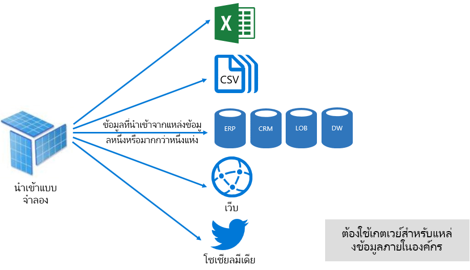

อย่างไรก็ตาม ถึงแม้จะมีข้อได้เปรียบที่น่าสนใจที่เกี่ยวข้องกับแบบจำลองการนำเข้า แต่ก็มีข้อเสียเช่นกัน:

- ต้องโหลดแบบจำลองทั้งหมดลงในหน่วยความจำก่อน Power BI จึงสามารถคิวรีแบบจำลองได้ ซึ่งสามารถสร้างแรงกดดันต่อทรัพยากรที่มีอยู่เมื่อจำนวนและขนาดของแบบจำลองขยายขึ้น
- ข้อมูลแบบจำลองจะเป็นปัจจุบันเฉพาะในการรีเฟรชครั้งล่าสุดเท่านั้นดังนั้นจึงจำเป็นต้องรีเฟรชแบบจำลองการนำเข้าตามกำหนดเวลา
- การรีเฟรชเต็มรูปแบบจะลบข้อมูลทั้งหมดออกจากตารางทั้งหมด และโหลดจากแหล่งข้อมูลใหม่ ซึ่งอาจใช้ทรัพยากรสูงมากในแง่ของเวลาและทรัพยากรสำหรับบริการของ Power BI และแหล่งข้อมูล Power BI รองรับการรีเฟรชแบบเพิ่มทีละส่วนที่สามารถหลีกเลี่ยงการตัดทอน และการโหลดตารางทั้งหมดใหม่ และซึ่งจะอธิบายไว้ในหัวข้อ[การปรับแบบจำลองที่เป็นโฮสต์ของ Power BI ให้เหมาะสม](#optimizing-power-bi-hosted-models)

จากมุมมองแหล่งข้อมูลบริการ Power BI นำเข้าโมเดลจำเป็นต้องใช้:

- หน่วยความจำที่เพียงพอในการโหลดแบบจำลองเมื่อทำการคิวรีหรือรีเฟรช
- ทรัพยากรการประมวลผลและทรัพยากรหน่วยความจำเพิ่มเติมเพื่อรีเฟรชข้อมูล

#### โหมด DirectQuery

แบบจำลองที่พัฒนาขึ้นในโหมด DirectQuery (DQ) ไม่นำเข้าข้อมูล แต่จะมีเพียงเมตาดาต้าเท่านั้นที่เมื่อมีการคิวรีแล้วจะปล่อยคิวรีในระบบไปยังแหล่งข้อมูลพื้นฐาน

มีสองเหตุผลหลักในการพิจารณาพัฒนาแบบจำลอง DQ เหตุผลข้อแรกคือเมื่อปริมาณข้อมูลมีขนาดใหญ่เกินไป แม้ว่าจะใช้วิธีการลดข้อมูล เพื่อโหลดข้อมูลลงในแบบจำลอง หรือเพื่อรีเฟรชในทางปฏิบัติ เหตุผลข้อสองคือเมื่อรายงานและแดชบอร์ดต้องการนำเสนอข้อมูล "ที่ใกล้เคียงกับเวลาจริง" นอกเหนือจากสิ่งที่สามารถทำได้ภายในขีดจำกัดการรีเฟรชตามกำหนดเวลา ( 48 ครั้งต่อวันสำหรับความจุเฉพาะ)

มีข้อดีหลายอย่างที่เกี่ยวข้องกับแบบจำลอง DQ:

- ไม่มีข้อจำกัดด้านขนาดของแบบจำลองการนำเข้า
- แบบจำลองไม่จำเป็นต้องรีเฟรช
- ผู้ใช้รายงานจะดูข้อมูลล่าสุดเมื่อโต้ตอบกับตัวกรองรายงานและตัวแบ่งส่วนข้อมูล และสามารถรีเฟรชรายงานทั้งหมดเพื่อเรียกใช้ข้อมูลที่เป็นปัจจุบัน
- ไทล์แดชบอร์ดที่เมื่อยึดตามแบบจำลอง DQ สามารถอัปเดตโดยอัตโนมัติ บ่อยที่สุดทุก 15 นาที

อย่างไรก็ตามก็มีข้อเสียและข้อจำกัดมากมายเกี่ยวกับแบบจำลอง DQ:

- แบบจำลองต้องยึดตามแหล่งข้อมูลที่สนับสนุนแหล่งเดียว และดังนั้นการผนวกข้อมูลใด ๆ ต้องอยู่ภายในแหล่งข้อมูล แหล่งข้อมูลที่สนับสนุนคือระบบเชิงสัมพันธ์และระบบวิเคราะห์ที่มีการสนับสนุนสำหรับที่เก็บข้อมูลยอดนิยมมากมาย\[[7](#endnote-07)\]
- ประสิทธิภาพการทำงานอาจช้าโดยอาจส่งผลเสียต่อบริการของ Power BI (คิวรีอาจมีการใช้ CPU มาก) และในแหล่งข้อมูล (ซึ่งอาจไม่ได้รับการปรับให้เหมาะสมกับคิวรีการวิเคราะห์)
- คิวรี Power Query ต้องไม่ซับซ้อนเกินไป และถูกจำกัดไว้สำหรับนิพจน์ M และฟังก์ชันที่สามารถสลับเปลี่ยนแถวกับคอลัมน์ได้สำหรับคิวรีในระบบที่เข้าใจได้โดยแหล่งข้อมูล
- ฟังก์ชัน DAX ถูกจำกัดไว้สำหรับฟังก์ชันต่าง ๆ ที่สามารถสลับเปลี่ยนแถวกับคอลัมน์ได้สำหรับคิวรีในระบบที่เข้าใจได้โดยแหล่งข้อมูล และไม่มีการสนับสนุนสำหรับตารางจาการคำนวณหรือขีดความสามารถต่าง ๆ ของตัวแสดงเวลาภายในระบบ
- ตามค่าเริ่มต้น คิวรีแบบจำลองที่จำเป็นต้องมีการเรียกข้อมูลมากกว่าหนึ่งล้านแถวจะล้มเหลว
- รายงานและแดชบอร์ดที่มีหลายภาพสามารถแสดงผลลัพธ์ที่ไม่สอดคล้องกัน โดยเฉพาะเมื่อแหล่งข้อมูลเปลี่ยนแปลงได้ง่าย
- คุณลักษณะถามตอบและข้อมูลเชิงลึกด่วนไม่ได้รับการสนับสนุน

จากมุมมองทรัพยากรบริการของ Power BI แบบจำลอง DQ จำเป็นต้องใช้:

- หน่วยความจำน้อยที่สุดในการโหลดแบบจำลอง (เมตาดาต้าเท่านั้น) เมื่อมีการคิวรีแล้ว
- ทรัพยากรตัวประมวลผลที่สำคัญในการสร้างและประมวลผลคิวรีที่ส่งไปยังแหล่งข้อมูลในบางครั้ง

สำหรับข้อมูลเพิ่มเติม ดูที่เอกสาร[ใช้ Direct Query ใน Power BI Desktop](desktop-use-directquery.md)

#### โหมดแบบรวม

แบบจำลองที่พัฒนาขึ้นในโหมดแบบรวมสามารถกำหนดค่าโหมดการจัดเก็บข้อมูลสำหรับตารางแบบจำลองแต่ละอย่าง ดังนั้นจึงรองรับการผสมผสานกันของตารางการนำเข้าและตาราง DQ และยังสนับสนุนตารางจากการคำนวณ (กำหนดด้วย DAX) และแหล่งข้อมูล DQ ต่าง ๆ

โหมดตารางที่เก็บข้อมูลสามารถกำหนดค่าเป็นการจัดเก็บข้อมูลแบบนำเข้า, แบบ DirectQuery หรือแบบคู่ ตารางที่กำหนดให้เป็นโหมดที่เก็บข้อมูลแบบคูู่มีทั้งการจัดเก็บแบบนำเข้าและแบบ DirectQuery และช่วยให้บริการของ Power BI สามารถได้ระบุว่าโหมดใดมีประสิทธิภาพมากที่สุดที่จะใช้ในแต่ละคิวรี

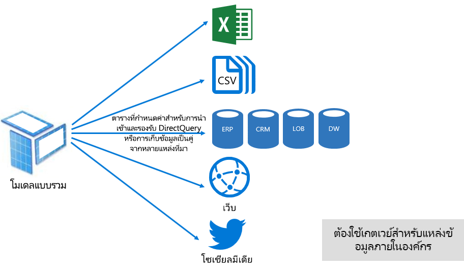

แบบจำลองแบบรวมจะนำเสนอสิ่งที่ดีสุดของโหมดการนำเข้าและ DirectQuery เมื่อกำหนดค่าอย่างเหมาะสม โหมดเหล่านี้สามารถรวมประสิทธิภาพการคิวรีระดับสูงของแบบจำลองในหน่วยความจำเข้ากับความสามารถในการเรียกใช้ข้อมูลที่ใกล้เคียงกับเวลาจริงจากแหล่งข้อมูล

ผู้สร้างแบบจำลองที่พัฒนาแบบจำลองแบบรวมมีแนวโน้มที่จะกำหนดค่าตารางชนิดขนาดในโหมดที่เก็บข้อมูลแบบนำเข้าหรือแบบคู่ และตารางชนิดข้อเท็จจริงในโหมด DirectQuery ตัวอย่างเช่น พิจารณาแบบจำลองตามตารางชนิดขนาดของผลิตภัณฑ์ในโหมดแบบคู่ และตารางชนิดข้อเท็จจริงของยอดขายในโหมด DirectQuery สามารถคิวรีตารางผลิตภัณฑ์ได้อย่างมีประสิทธิภาพ และรวดเร็วจากในหน่วยความจำเพื่อแสดงตัวแบ่งส่วนข้อมูลรายงาน จากนั้นสามารถคิวรีตารางยอดขายในโหมด DirectQuery ที่เชื่อมโยงไปตารางผลิตภัณฑ์ที่เกี่ยวข้อง คิวรีลำดับถัดมาสามารถเปิดใช้งานการสร้างคิวรีในระบบที่มีประสิทธิภาพและใช้ได้กับทั้งหมดเพื่อเชื่อมโยงกับตารางผลิตภัณฑ์และยอดขายและการกรองตามค่าตัวแบ่งส่วนข้อมูล

โดยทั่วไป สามารถพิจารณาข้อดีและข้อเสียที่เกี่ยวข้องโยงกับโหมดแบบจำลองแต่ละโหมดเพื่อนำไปใช้โหมดตารางที่เก็บข้อมูลในแบบจำลองแบบรวม

สำหรับข้อมูลเพิ่มเติม ดูที่เอกสาร[ใช้แบบจำลองแบบรวมใน Power BI Desktop](desktop-composite-models.md)

### สิทธิ์การใช้งาน

Power BI มีสิทธิ์การใช้งานสามแบบได้แก่:

- Power BI ฟรี
- Power BI Pro
- Power BI Premium

สิทธิ์การใช้งาน **Power BI Free** อนุญาตให้บุคคลสามารถลงชื่อเข้าใช้บริการของ Power BI และทำงานภายในพื้นที่ทำงานส่วนบุคคลของตนโดยการเผยแพร่แบบจำลองและรายงาน คุณจะต้องเข้าใจว่าไม่สามารถแชร์เนื้อหาของ Power BI โดยใช้สิทธิ์การใช้งานนี้ สิทธิ์การใช้งานตามชื่อแนะนำเป็นบริการฟรี

สิทธิ์การใช้งาน **Power BI Pro** อนุญาตให้บุคคลสามารถสร้างและทำงานร่วมกันภายในพื้นที่ทำงานของแอป และแชร์รวมถึงแจกจ่ายเนื้อหาของ Power BI นอกจากนี้ยังสามารถกำหนดค่าการรีเฟรชสำหรับชุดข้อมูลเพื่อทำให้ข้อมูลเป็นปัจจุบันโดยอัตโนมัติ รวมถึงจากแหล่งข้อมูลภายในองค์กร และพวกเขาสามารถตรวจสอบ และควบคุมวิธีการเข้าถึงและการใช้ข้อมูล สิทธิ์การใช้งานนี้จำเป็นต้องมีเพื่อรับเนื้อหาที่แชร์จากบุคคลอื่น เว้นแต่ว่าผู้ใช้จะเชื่อมโยงกับความจุเฉพาะของ Power BI Premium

สิทธิ์การใช้งาน**Power BI Premium**เป็นสิทธิ์การใช้งานระดับผู้เช่า ซึ่งจะกล่าวถึงในส่วน[การนำ Power BI Premium ไปใช้งาน](#introducing-power-bi-premium)

สำหรับข้อมูลเพิ่มเติมเกี่ยวกับสิทธิ์การใช้งาน Power BI ดูที่หน้า [Power BI Pricing](https://powerbi.microsoft.com/pricing/)

## การนำ Power BI Premium ไปใช้งาน

Power BI Premium มีแพลตฟอร์มการบริการตนเองและ BI สำหรับองค์กรแบบครบวงจรพร้อมด้วยการปรับมาตราส่วน ประสิทธิภาพที่เชื่อถือได ้และต้นทุนที่คาดการณ์ได้ ซึ่งส่วนใหญ่ทำได้โดยการจัดให้มีแหล่งข้อมูลเฉพาะเพื่อเรียกใช้บริการของ Power BI สำหรับองค์กรของคุณ

นอกจากนี้ Power BI Premium ยังมีคุณลักษณะสำหรับองค์กรจำนวนมาก:

- การกระจายเนื้อหาที่ประหยัดต้นทุน ซึ่งช่วยให้สามารถแชร์เนื้อหาของ Power BI กับผู้ใช้ Power BI Free โดยไม่จำกัด รวมถึงผู้ใช้ภายนอก
- การสนับสนุนสำหรับชุดข้อมูลขนาดใหญ่ \[[8](#endnote-08)\]
- อัตราการรีเฟรชของกระแสข้อมูลและชุดข้อมูล (สูงสุด 48 ครั้งต่อวัน)
- การรีเฟรชของกระแสข้อมูลและชุดข้อมูลแบบเพิ่มทีละส่วน
- เอนทิตีที่เชื่อมต่อไว้กับกระแสข้อมูลและการดำเนินการแบบขนานของการแปลง
- รายงานที่มีการแบ่งหน้า
- เซิร์ฟเวอร์รายงาน Power BI สำหรับการรายงานภายในองค์กร
- ความสามารถในการฝังเนื้อหาในแอปในนามของผู้ใช้แอป (PaaS)

คุณสมบัติมากมายเหล่านี้สามารถนำมาใช้ประโยชน์เพื่อส่งต่อโซลูชันระดับองค์กรที่มีประสิทธิภาพและปรับขนาดได้ ซึ่งอธิบายไว้ในส่วน[การปรับความจุ Premium ให้เหมาะสม](#optimizing-premium-capacities)

### การสมัครใช้งานและสิทธิ์การใช้งาน

Power BI Premium คือการสมัครใช้งาน Office 365 ระดับผู้เช่าที่มีอยู่ในสองกลุ่ม SKU (Stock-Keeping Unit) ได้แก่:

- **EM** Sku (EM1-EM3) สำหรับการฝัง ซึ่งมีสัญญาผูกมัดรายปี และมีการเรียกเก็บเงินรายเดือน
- **P** Sku (P1 P3) สำหรับการฝังและคุณลักษณะสำหรับองค์กร ซึ่งมีสัญญาผูกมัดแบบรายเดือนหรือรายปี มีการเรียกเก็บเงินรายเดือน และมีสิทธิ์การใช้งานการติดตั้งเซิร์ฟเวอร์รายงาน Power BI ภายในองค์กร

วิธีการทางเลือกคือการซื้อการสมัครใช้งาน Azure Power BI Embedded ซึ่งมี SKU กลุ่มเดียวได้แก่: **A** Sku (A1 A6) สำหรับวัตถุประสงค์การฝังและการทดสอบความจุเท่านั้น

SKU ทั้งหมดจะส่งต่อวี-คอร์เพื่อสร้างความจุ\[ [9](#endnote-09)\]แต่ EM SKU จะถูกจำกัดไว้สำหรับการฝังมาตราส่วนขนาดเล็ก ในขณะที่เอกสารทางเทคนิคนี้เน้นไปที่ P SKUs แต่สิ่งที่กล่าวถึงส่วนใหญ่นั้นเกี่ยวข้องกับ A SKUs ด้วยเช่นกัน

Azure SKU ไม่มีสัญญาผูกมัดด้านเวลาและมีการเรียกเก็บเงินเป็นรายชั่วโมง ซึ่งตรงกันข้ามกับ SKUs ของการสมัครใช้งานระดับ Premium ซึ่งมีความยืดหยุ่นเต็มที่โดยช่วยให้สามารถขยายขนาด ลดขนาด หยุดชั่วคราว ดำเนินต่อ และลบได้

Azure Power BI Embedded ส่วนใหญ่อยู่นอกขอบเขตสำหรับเอกสารทางเทคนิคนี้ แต่มีการกล่าวถึงในหัวข้อวิธีการทดสอบเป็นตัวเลือกทางปฏิบัติและประหยัดเพื่อทดสอบและวัดปริมาณงาน

สำหรับข้อมูลเพิ่มเติมเกี่ยวกับ Azure SKUs ดูที่[เอกสารประกอบของ Azure Power BI Embedded](/azure/power-bi-embedded/)

ผู้ดูแลระบบในศูนย์การจัดการ Microsoft 365 จะซื้อการสมัครใช้งาน Power BI Premium เฉพาะผู้ดูแลระบบส่วนกลาง Office 365 หรือผู้ดูแลระบบการเรียกเก็บเงินเท่านั้นที่สามารถซื้อ SKUs

เมื่อซื้อแล้ว ผู้เช่าจะได้รับหมายเลขที่สอดคล้องกันของวี-คอร์เพื่อกำหนดความจุ ซึ่งเรียกว่า**การจัดทำแหล่งรวมวี-คอร์** ตัวอย่างเช่น การซื้อ P3 SKU มีผู้เช่าที่มี 32 วี-คอร์

สำหรับข้อมูลเพิ่มเติม ดูที่เอกสาร[วิธีการซื้อ Power BI Premium](service-admin-premium-purchase.md)

### ความจุแบบพรีเมียม

**ความจุเฉพาะ**สำหรับใช้งานที่เฉพาะเจาะจงในองค์กร ซึ่งตรงกันข้ามกับความจุที่ใช้ร่วมกันที่ปริมาณงานจะเรียกใช้งานบนทรัพยากรการคำนวณที่ใช้ร่วมกับลูกค้ารายอื่น โดยจะแยกจากกันกับทรัพยากรการคำนวณแบบเฉพาะที่มีประสิทธิภาพที่เชื่อถือได้ และสอดคล้องกันสำหรับเนื้อหาที่เป็นโฮสต์

เอกสารทางเทคนิคนี้จะเน้นไปที่**ความจุแบบพรีเมียม**ซึ่งหมายความว่าความจุจะถูกเชื่อมโยงกับ EM หรือ P SKUs ต่าง ๆ

#### โหนดความจุ

ตามที่อธิบายไว้ในหัวข้อการสมัครใช้งานและสิทธิ์การใช้งานหัวข้อ Power BI Premium SKU มีสองกลุ่มได้แก่: Power BI Premium SKUs ทั้งหมดของ P. และ EM สามารถใช้เป็นโหนดความจุที่แต่ละ SKU แสดงถึงจำนวนชุดทรัพยากรที่ประกอบด้วยตัวประมวลผล หน่วยความจำ และที่เก็บข้อมูล นอกเหนือจากทรัพยากร SKU แต่ละรายการมีขีดจำกัดในการใช้งานเกี่ยวกับจำนวนการเชื่อมต่อ DirectQuery (DQ) และ Live Connection (LC) ต่อวินาที และจำนวนการรีเฟรชของแบบจำลองแบบขนาน

ตัวประมวลผลจะทำตามจำนวนชุดของวี-คอร์ ซึ่งแบ่งออกเท่า ๆ กันระหว่าง Frontend และ Backend

**วี-คอร์ Backend** รับผิดชอบสำหรับฟังก์ชันการทำงานของ Power BI รวมถึงการประมวลผลคิวรี การจัดการแคช การเรียกใช้การบริการ R การรีเฟรชแบบจำลอง การประมวลผลภาษาธรรมชาติ (ถามตอบ) และการแสดงผลฝั่งเซิร์ฟเวอร์ในรูปแบบรายงานและรูป วี-คอร์ Backend จะกำหนดจำนวนหน่วยความจำแบบคงที่ที่นำมาใช้ในการโฮสต์แบบจำลองเป็นหลัก ซึ่งจะเรียกว่าชุดข้อมูลที่ใช้งานอยู่

**วี-คอร์ Frontend** รับผิดชอบบริการเว็บ แดชบอร์ด และการจัดการเอกสารรายงาน การจัดการสิทธิ์การเข้าถึง การจัดกำหนดการ API การอัปโหลดและการดาวน์โหลด และโดยทั่วไปนั้นเพื่อทุกอย่างที่เกี่ยวกับประสบการณ์การใช้งานของผู้ใช้วี-คอร์ Frontend รับผิดชอบบริการเว็บ แดชบอร์ด และการจัดการเอกสารรายงาน การจัดการสิทธิ์การเข้าถึง การจัดกำหนดการ API การอัปโหลดและการดาวน์โหลด และโดยทั่วไปนั้นเพื่อทุกอย่างที่เกี่ยวกับประสบการณ์การใช้งานของผู้ใช้

ที่เก็บข้อมูลถูกตั้งค่าเป็น 100 TB ต่อโหนดความจุ

ทรัพยากรและข้อจำกัดของ SKU พรีเมียมแต่ละรายการ (และขนาดที่เทียบเท่า A SKU) มีการอธิบายไว้ในตารางต่อไปนี้

| โหนดความจุ | วี-คอร์รวม | Backend v-cores | RAM (GB) | Frontend v-cores | DQ/LC (ต่อวินาที) | การรีเฟรชแบบจำลองแบบคู่ขนาน |
| --- | --- | --- | --- | --- | --- | --- |
| EM1/A1 | 1 | 0.5 | 2.5 | 0.5 | 3.75 | 1 |
| EM2/A2 | 2 | 1 | 5 | 1 | 7.5 | 2 |
| EM3/A3 | 4 | 2 | 10 | 2 | 15 | 3 |
| P1/A4 | 8 | 4 | 25 | 4 | 30 | 6 |
| P2/A5 | 16 | 8 | 50 | 8 | 60 | 12 |
| P3/A6 | 32 | 16 | 100 | 16 | 120 | 24 |
| | | | | | | |

#### ปริมาณงานสำหรับความจุ

ปริมาณงานสำหรับความจุเป็นบริการที่กำหนดไว้สำหรับผู้ใช้ โดยค่าเริ่มต้นแล้ว ความจุแบบพรีเมียมและ Azure จะรองรับเฉพาะปริมาณงานของชุดข้อมูลที่เชื่อมโยงกับการเรียกใช้คิวรี Power BI ซึ่งไม่สามารถปิดใช้งานได้

ปริมาณงานเพิ่มเติมสามารถเปิดใช้งานสำหรับรายงานที่มีการแบ่งหน้า กระแสข้อมูล และ AI ปริมาณงานเพิ่มเติมแต่ละรายการต้องกำหนดค่าหน่วยความจำสูงสุด (เป็นเปอร์เซ็นต์ของผลรวมหน่วยความจำที่พร้อมใช้งาน) ที่สามารถใช้ได้ตามปริมาณงาน

#### วิธีการทำงานของความจุ

บริการของ Power BI จะพยายามทำให้การใช้งานทรัพยากรความจุมีประสิทธิภาพสูงสุดโดยที่ไม่เกินขีดจำกัดที่กำหนดไว้สำหรับความจุ

การทำงานของความจุจะถูกจัดประเภทเป็นการทำงานแบบโต้ตอบ หรือการทำงานแบบเบื้องหลัง การทำงานแบบโต้ตอบประกอบด้วยการแสดงคำขอ และการตอบสนองโต้ตอบกับผู้ใช้ (การกรอง การคิวรีถามตอบ และอื่น ๆ) โดยทั่วไปแล้ว การคิวรีแบบจำลองการนำเข้าจะใช้ทรัพยากรหน่วยความจำมากในขณะที่การคิวรีแบบจำลอง LC/DQ จะใช้ CPU สูง การทำงานแบบเบื้องหลังประกอบด้วยกระแสข้อมูลและการรีเฟรชแบบจำลองการนำเข้า และการแคชคิวรีของแดชบอร์ด

คุณจะต้องเข้าใจว่าการทำงานแบบโต้ตอบจะมีความสำคัญมากกว่าการทำงานแบบเบื้องหลัง เพื่อให้แน่ใจว่าผู้ใช้จะได้รับประสบการณ์การใช้งานที่ดีที่สุด ถ้ามีทรัพยากรไม่เพียงพอ การทำงานแบบเบื้องหลังจะถูกเพิ่มไปยังคิวสำหรับการประมวลผลเมื่อเพิ่มแหล่งข้อมูล การทำงานแบบเบื้องหลังเช่น การรีเฟรชชุดข้อมูลและฟังก์ชัน AI สามารถหยุดกลางกระบวนการได้โดยบริการของ Power BI และเพิ่มลงในคิว

ต้องโหลดแบบจำลองการนำเข้าทั้งหมดลงในหน่วยความจำเพื่อที่จะสามารถคิวรีหรือรีเฟรชได้ บริการของ Power BI จะจัดการการใช้งานหน่วยความจำโดยใช้อัลกอริทึมที่ซับซ้อน เพื่อให้แน่ใจว่าจะสามารถใช้งานหน่วยความจำที่มีอยู่ให้ได้มากที่สุด และสามารถใช้งานได้เกินความจุ: ในขณะที่อาจเป็นไปได้สำหรับความจุในการจัดเก็บข้อมูลแบบจำลองการนำเข้าหลายแบบ (สูงสุด 100 TB ต่อความจุแบบพรีเมียม) เมื่อที่เก็บข้อมูลของดิสก์รวมเกินหน่วยความจำที่สนับสนุน (และหน่วยความจำเพิ่มเติมจำเป็นสำหรับการคิวรีและรีเฟรช) จากนั้นจะไม่สามารถโหลดแบบจำลองทั้งหมดลงในหน่วยความจำพร้อมกันได้

ดังนั้นแบบจำลองการนำเข้าจะถูกโหลดลงและลบออกจากหน่วยความจำตามการใช้งาน แบบจำลองการนำเข้าจะถูกโหลดลงเมื่อมีการคิวรีแล้ว (การทำงานแบบโต้ตอบ) และยังไม่ได้โหลดลงในหน่วยความจำ หรือเมื่อต้องทำการรีเฟรช (การทำงานแบบเบื้องหลัง)

การลบแบบจำลองจากหน่วยความจำจะเรียกว่า**การลดสัดส่วน**และเป็นการดำเนินการที่ Power BI สามารถทำได้อย่างรวดเร็วโดยขึ้นอยู่กับขนาดของแบบจำลอง หากความจุนั้นไม่พบความต้องการใช้งานหน่วยความจำใด ๆ แบบจำลองถูกโหลดลงในหน่วยความจำและยังคงอยู่ที่นั่น \[[10](#endnote-10) \]อย่างไรก็ตาม เมื่อมีหน่วยความจำไม่เพียงพอในการโหลดแบบจำลอง บริการของ Power BI จะต้องเพิ่มหน่วยความจำก่อน ซึ่งจะเพิ่มหน่วยความจำโดยการตรวจสอบแบบจำลองที่ไม่ได้ใช้งาน โดยการค้นหาแบบจำลองซึ่งยังไม่ได้ใช้งานในสามนาทีที่ผ่านมา\[ [11](#endnote-11)\]และจากนั้นลดสัดส่วนแบบจำลองเหล่านั้น ถ้าไม่มีแบบจำลองที่ไม่ได้ใช้งานที่จะลดสัดส่วน บริการของ Power BI จะค้นหาเพื่อลดสัดส่วนแบบจำลองที่โหลดสำหรับการทำงานแบบเบื้องหลัง ซึ่งอาจรวมถึงการลดข้อมูลปริมาณงานเบื้องหลังเช่น ปริมาณงานของ AI วิธีสุดท้ายหลังจาก 30 วินาทีของความพยายามที่ล้มเหลว\[ [11](#endnote-11)\]คือการทำให้การทำงานแบบโต้ตอบไม่เป็นผล ในกรณีนี้ ผู้ใช้รายงานได้รับแจ้งเกี่ยวกับความล้มเหลวอย่างสุภาพ พร้อมด้วยคำแนะนำให้ลองอีกครั้งในอีกสักครู่

สิ่งสำคัญคือต้องเน้นว่าการลดสัดส่วนชุดข้อมูลนั้นเป็นลักษณะการทำงานตามปกติและคาดว่าจะเกิดขึ้น ซึ่งเป็นความพยายามที่จะเพิ่มการใช้งานหน่วยความจำให้สูงสุดโดยการโหลดและการยกเลิกการโหลดแบบจำลองที่มีขนาดรวมกันเกินกว่าหน่วยความจำที่มีอยู่ โดยเป็นไปตามการออกแบบและเปิดเผยอย่างตรงไปตรงมาต่อผู้ใช้รายงาน อัตราการลดสัดส่วนข้อมูลสูงไม่ได้หมายความว่าความจุมีปริมาณไม่เพียงพอ อย่างไรก็ตามอาจกลายเป็นข้อจำกัดได้หากการตอบสนองของการคิวรีและการรีเฟรชจะได้รับผลกระทบเนื่องจากอัตราการลดสัดส่วนข้อมูลสูง

การรีเฟรชของแบบจำลองการนำเข้าจะต้องใช้หน่วยความจำมากเนื่องจากต้องโหลดแบบจำลองลงในหน่วยความจำและจำเป็นต้องใช้หน่วยความจำเพิ่มเติมสำหรับการประมวลผล การรีเฟรชเต็มรูปแบบอาจใช้จำนวนหน่วยความจำเป็นสองเท่าโดยประมาณตามที่แบบจำลองกำหนด ซึ่งต้องให้แน่ใจว่าแบบจำลองสามารถคิวรีได้แม้ในขณะที่กำลังประมวลผล (คิวรีจะถูกส่งไปยังแบบจำลองที่มีอยู่จนกว่าการรีเฟรชจะเสร็จสมบูรณ์ และข้อมูลแบบจำลองใหม่พร้อมใช้งาน) โปรดทราบว่าการรีเฟรชแบบเพิ่มทีละส่วนจะต้องการหน่วยความจำน้อยกว่า และอาจทำให้เสร็จสมบูรณ์ได้อย่างรวดเร็ว และจึงสามารถลดแรงกดดันบนแหล่งทรัพยากรความจุ นอกจากนี้ การรีเฟรชยังอาจใช้ CPU สูงสำหรับแบบจำลอง โดยเฉพาะการรีเฟรชที่มีการเปลี่ยนแปลงของ Power Query ซับซ้อน หรือตาราง/คอลัมน์จากการคำนวณที่ซับซ้อนหรือยึดตามตารางขนาดใหญ่ได้

การรีเฟรชเช่น คิวรี จำเป็นต้องโหลดแบบจำลองลงในหน่วยความจำ ถ้ามีหน่วยความจำไม่เพียงพอ บริการของ Power BI จะพยายามทำการลดสัดส่วนแบบจำลองที่ไม่ได้ใช้งาน และถ้าไม่เป็นไปได้ (แบบจำลองทั้งหมดมีการใช้งานอยู่) งานการรีเฟรชถูกจัดคิวไว้ การรีเฟรชโดยทั่วไปใช้งาน CPU สูง มากยิ่งกว่าการคิวรี ด้วยเหตุนี้จึงมีข้อจำกัดด้านความจุของจำนวนการรีเฟรชพร้อมกัน ซึ่งตั้งค่าเป็น 1.5 x จำนวนวี-คอร์ Backend โดยการปัดเศษขึ้น ถ้ามีการรีเฟรชพร้อมกันมากเกินไป การรีเฟรชตามกำหนดเวลาจะถูกจัดคิวไว้ เมื่อสถานการณ์เหล่านี้เกิดขึ้น การรีเฟรชจะใช้เวลานานจึงจะเสร็จสมบูรณ์ โปรดทราบว่าการรีเฟรชตามความต้องการ (ทริกเกอร์ตามคำขอของผู้ใช้หรือการเรียกใช้ API) จะลองอีกสามครั้ง\[ [11](#endnote-11)\]และจากนั้นจะล้มเหลวถ้ายังไม่มีทรัพยากรเพียงพอ

## การจัดการ Power BI Premium

การจัดการ Power BI Premium เกี่ยวข้องกับการซื้อการสมัครใช้งาน การสร้าง การจัดการ และการตรวจสอบความจุแบบพรีเมียม

### การสร้างและการจัดการความจุ

หน้า**การตั้งค่าความจุ**ของพอร์ทัล**ผู้ดูแลระบบ Power BI**จะแสดงจำนวนวี-คอร์ที่ซื้อและพร้อมใช้งาน (เช่น ยังไม่ได้กำหนดความจุ) และแสดงรายการความจุแบบพรีเมียม หน้านี้ช่วยให้ผู้ดูแลระบบส่วนกลาง Office 365 หรือผู้ดูแลระบบบริการของ Power BI สามารถสร้างความจุแบบพรีเมียมจากวี-คอร์ที่พร้อมใช้งาน หรือปรับเปลี่ยนความจุแบบพรีเมียมที่มีอยู่

เมื่อสร้างความจุแบบพรีเมียม ผู้ดูแลระบบจะต้องกำหนด:

- ชื่อความจุ (ที่ไม่ซ้ำกันภายในผู้เช่า)
- ผู้ดูแลระบบความจุ
- ขนาดความจุ
- ภูมิภาคสำหรับที่อยู่ข้อมูล \[[12](#endnote-12)\]

ต้องกำหนดผู้ดูแลระบบความจุอย่างน้อยหนึ่งคน ผู้ใช้ที่เป็นผู้ดูแลระบบความจุสามารถ:

- กำหนดพื้นที่ทำงานสำหรับความจุ
- จัดการสิทธิ์ของผู้ใช้ เพื่อเพิ่มผู้ดูแลระบบความจุเพิ่มเติมหรือผู้ใช้ที่มีสิทธิ์ในการกำหนด (เพื่อให้พวกเขาสามารถกำหนดพื้นที่ทำงานของความจุ)
- จัดการปริมาณงาน เพื่อกำหนดค่าการใช้หน่วยความจำสูงสุดสำหรับรายงานที่มีการแบ่งหน้าและปริมาณงานของกระแสข้อมูล
- รีสตาร์ทความจุ เพื่อรีเซ็ตการทำงานทั้งหมดในกรณีที่ระบบโอเวอร์โหลด \[[13](#endnote-13)\]

ผู้ดูแลระบบความจุไม่สามารถเข้าถึงเนื้อหาของพื้นที่ทำงาน (เว้นแต่ว่ากำหนดสิทธิ์การใช้พื้นที่ทำงานไว้อย่างชัดเจน) และพวกเขาไม่สามารถเข้าถึงพื้นที่ของผู้ดูแลระบบ Power BI ทั้งหมด (เว้นแต่ว่ากำหนดไว้อย่างชัดเจน) เช่น เมตริกการใช้งาน บันทึกการตรวจสอบ หรือการตั้งค่าของผู้เช่า ที่สำคัญ ผู้ดูแลระบบความจุไม่มีสิทธิ์ในการสร้างความจุใหม่ หรือปรับขนาดความจุที่มีอยู่ นอกจากนี้ ผู้ดูแลระบบยังได้รับมอบหมายตามข้อมูลพื้นฐานของความจุเพื่อให้มั่นใจว่าจะสามารถดูและจัดการความจุตามที่ได้รับมอบหมายเท่านั้น

ต้องเลือกขนาดความจุจากรายการที่มีของตัวเลือก SKU ซึ่งถูกจำกัดด้วยจำนวนของวี-คอร์ที่พร้อมใช้งานในกลุ่ม โดยมีความเป็นไปได้ที่จะสร้างความจุหลายอย่างจากกลุ่ม ซึ่งสามารถจัดหาได้จาก SKU ที่ซื้ออย่างน้อยหนึ่งรายการ ตัวอย่างเช่น P3 SKU (32 วี-คอร์) สามารถใช้เพื่อสร้างความจุสามแบบได้แก่ P2 หนึ่ง (16 วี-คอร์), และ P1 สอง (2 x 8 วี-คอร์) ได้ ประสิทธิภาพที่เพิ่มขึ้นและการปรับมาตราส่วนอาจสามารถทำได้โดยการสร้างความจุที่มีขนาดเล็กกว่า และหัวข้อนี้จะกล่าวถึงในส่วน[การปรับความจุแบบพรีเมียมให้เหมาะสม](#optimizing-premium-capacities) ภาพต่อไปนี้แสดงตัวอย่างการตั้งค่าสำหรับองค์กร Contoso ที่สมมติขึ้น ซึ่งประกอบด้วยความจุแบบพรีเมียมห้าแบบ (3 x P1 และ 2 x P3) โดยแต่ละความจุประกอบด้วยพื้นที่ทำงานของแอป และพื้นที่ทำงานหลายแห่งในความจุที่ใช้ร่วมกัน

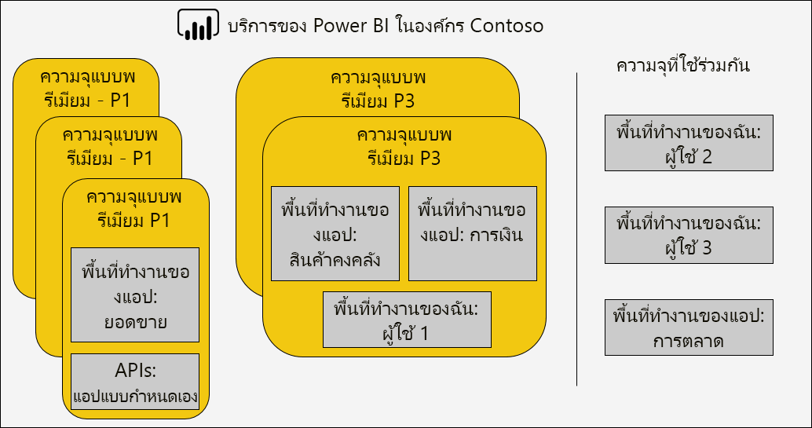

คุณสามารถกำหนดความจุแบบพรีเมียมสำหรับกับภูมิภาคอื่นนอกเหนือจากภูมิภาคหลักของผู้เช่า Power BI โดยมีสิทธิ์ในการควบคุมดูแลจัดการศูนย์ข้อมูลใด ๆ (ภายในภูมิภาคทางภูมิศาสตร์ที่ระบุ) ที่มีเนื้อหาของ Power BI อยู่ \[[12](#endnote-12)\]

ผู้ดูแลระบบบริการของ Power BI และผู้ดูแลระบบส่วนกลาง Office 365 สามารถปรับเปลี่ยนความจุแบบพรีเมียม โดยเฉพาะ ผู้ใช้สามารถที่จะ:

- เปลี่ยนขนาดความจุเพื่อขยายหรือลดแหล่งทรัพยากร อย่างไรก็ตามไม่สามารถดาวน์เกรด P SKU เป็น EM SKU หรืออัปเกรดในทางกลับกัน
- เพิ่มหรือลบผู้ดูแลระบบความจุ
- เพิ่มหรือลบผู้ใช้ที่มีสิทธิ์ในการกำหนด
- เพิ่มหรือลบปริมาณงานเพิ่มเติม
- เปลี่ยนภูมิภาค

ต้องใช้สิทธิ์ในการกำหนดเพื่อกำหนดพื้นที่ทำงานของความจุแบบพรีเมียมที่เฉพาะเจาะจง สิทธิ์สามารถมอบให้กับทั้งองค์กร ผู้ใช้ หรือกลุ่มที่เฉพาะเจาะจง

ตามค่าเริ่มต้น ความจุแบบพรีเมียมจะสนับสนุนปริมาณงานที่เชื่อมโยงกับการเรียกใช้คิวรี Power BI และยังสนับสนุนปริมาณงานเพิ่มเติมสามรายการได้แก่: **รายงานที่มีการแบ่งหน้า**, **กระแสข้อมูล**, และ **AI** ปริมาณงานแต่ละรายการต้องกำหนดค่าหน่วยความจำสูงสุด (เป็นเปอร์เซ็นต์ของผลรวมหน่วยความจำที่พร้อมใช้งาน) ที่สามารถใช้ได้ตามปริมาณงาน คุณจะต้องเข้าใจว่าการเพิ่มการปันส่วนหน่วยความจำสูงสุดอาจมีผลกระทบต่อจำนวนของแบบจำลองที่ใช้งานที่สามารถกำหนดเป็นโฮสต์ และอัตราความเร็วของการรีเฟรช

ระบบได้จัดสรรหน่วยความจำให้กับกระแสข้อมูลเชิงไดนามิก แต่ในเชิงสแตติกแล้วระบบได้จัดสรรหน่วยความจำนั้นให้กับรายงานแบบแบ่งหน้า เหตุผลสำหรับการปันส่วนหน่วยความจำสูงสุดแบบคงที่คือรายงานที่มีการแบ่งแบ่งหน้าจะทำงานภายในพื้นที่ความจุที่มีความปลอดภัย ควรใช้ความระมัดระวังเมื่อตั้งค่าหน่วยความจำของรายงานที่มีการแบ่งหน้าเนื่องจากจะลดหน่วยความจำที่มีอยู่สำหรับโหลดแบบจำลอง

|                     | EM3                      | P1                       | P2                      | P3                       |
|---------------------|--------------------------|--------------------------|-------------------------|--------------------------|
| รายงานที่มีการแบ่งหน้า | N/A | ค่าเริ่มต้น 20% ค่าต่ำสุด 10% | ค่าเริ่มต้น 20% ค่าต่ำสุด 5% | ค่าเริ่มต้น 20% ค่าต่ำสุด 2.5% |
| กระแสข้อมูล | ค่าเริ่มต้น 20% ค่าต่ำสุด 8%  | ค่าเริ่มต้น 20% ค่าต่ำสุด 4%  | ค่าเริ่มต้น 20% ค่าต่ำสุด 2% | ค่าเริ่มต้น 20% ค่าต่ำสุด 1%  |
| AI | N/A | ค่าเริ่มต้น 20% ค่าต่ำสุด 20%  | ค่าเริ่มต้น 20% ค่าต่ำสุด 10% | ค่าเริ่มต้น 20% ค่าต่ำสุด 5%  |
| | | | | |

การลบความจุแบบพรีเมียมสามารถทำได้และจะไม่ส่งผลให้มีการลบพื้นที่ทำงานและเนื้อหาของความจุ แต่จะย้ายพื้นที่ทำงานที่กำหนดไว้ต่าง ๆ ไปยังความจุที่ใช้ร่วมกัน เมื่อความจุแบบพรีเมียมถูกสร้างขึ้นในภูมิภาคอื่น พื้นที่ทำงานจะถูกย้ายไปยังความจุที่ใช้ร่วมกันของภูมิภาคหลัก

### การกำหนดพื้นที่ทำงานในความจุ

คุณสามารถกำหนดพื้นที่ทำงานสำหรับความจุแบบพรีเมียมในพอร์ทัล**ผู้ดูแลระบบ Power BI** **** หรือสำหรับพื้นที่ทำงานของแอปในบานหน้าต่างของ**พื้นที่ทำงาน**

ผู้ดูแลระบบความจุ ตลอดจนผู้ดูแลระบบส่วนกลาง Office 365 หรือผู้ดูแลระบบบริการของ Power BI สามารถกำหนดพื้นที่ทำงานในพอร์ทัล**ผู้ดูแลระบบ Power BI** **ได้** กลุ่มที่กำหนดไว้สามารถนำไปใช้กับ:

- **พื้นที่ทำงานโดยผู้ใช้** พื้นที่ทำงานทั้งหมดที่ผู้ใช้เหล่านั้นเป็นเจ้าของ รวมถึงพื้นที่ทำงานส่วนบุคคลได้รับการกำหนดไว้สำหรับความจุแบบพรีเมียม ซึ่งจะรวมถึงการกำหนดพื้นที่ทำงานใหม่เมื่อพื้นที่ทำงานเหล่านั้นถูกกำหนดไว้สำหรับความจุแบบพรีเมียมอื่นแล้ว นอกจากนี้ ผู้ใช้ยังจะได้รับสิทธิ์ในการกำหนดพื้นที่ทำงาน

- **พื้นที่ทำงานเฉพาะ**
- **พื้นที่ทำงานของทั้งองค์กร** พื้นที่ทำงานทั้งหมด รวมถึงพื้นที่ทำงานส่วนบุคคลได้รับการกำหนดไว้สำหรับความจุแบบพรีเมียม นอกจากนี้ ผู้ใช้ปัจจุบันและผู้ใช้ในอนาคตทั้งหมดยังจะได้รับสิทธิ์ในการกำหนดพื้นที่ทำงาน \[[14](#endnote-14)\]

สามารถเพิ่มพื้นที่ทำงานในความจุแบบพรีเมียมโดยใช้บานหน้าต่างของ**พื้นที่ทำงาน**โดยผู้ใช้เป็นทั้งผู้ดูแลระบบพื้นที่ทำงานและมีสิทธิ์ในการกำหนด

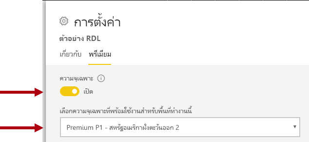

ผู้ดูแลระบบพื้นที่ทำงานสามารถลบพื้นที่ทำงานจากความจุ (สำหรับความจุที่ใช้ร่วมกัน) โดยไม่จำเป็นต้องมีสิทธิ์ในการกำหนด การลบพื้นที่ทำงานออกจากความจุเฉพาะที่เป็นผลจะย้ายตำแหน่งพื้นที่ทำงานไปยังความจุที่ใช้ร่วมกัน โปรดทราบว่าการลบพื้นที่ทำงานออกจากความจุแบบพรีเมียมอาจมีผลกระทบด้านลบ ตัวอย่างเช่น ในเนื้อหาที่แชร์จะไม่สามารถใช้งานได้กับผู้ใช้ที่ได้รับสิทธิ์ Power BI Free หรือการระงับการรีเฟรชตามกำหนดเวลาเมื่อเกินค่าเผื่อที่รองรับโดยความจุที่ใช้ร่วมกัน

ในบริการของ Power BI พื้นที่ทำงานที่กำหนดไว้สำหรับความจุแบบพรีเมียมสามารถระบุได้ง่ายโดยไอคอนข้าวหลามตัดที่ติดชื่อของพื้นที่ทำงาน

### การตรวจสอบความจุ

การตรวจสอบความจุแบบพรีเมียมช่วยให้ผู้ดูแลระบบเข้าใจถึงวิธีการทำงานของความจุ สามารถตรวจสอบความจุได้โดยใช้พอร์ทัล**ผู้ดูแลระบบ Power BI**  **** หรือแอป**เมตริก Power BI Premium** (Power BI)

#### พอร์ทัลผู้ดูแลระบบ Power BI

พอร์ทัล**ผู้ดูแลระบบ Power BI**  **** อนุญาตให้มีการตรวจสอบไทล์ข้อมูลสรุปสี่อย่างที่ซึ่งมีรายงานเกี่ยวกับการโหลดบนแหล่งทรัพยากรความจุ ไทล์ข้อสรุปสี่อย่างประกอบด้วย:

- **CPU** : จำนวนครั้งที่ CPU ใช้งานเกิน 80%
- **การแธรชชิ่งหน่วยความจำ** : จำนวนครั้งที่เกิน 80% แสดงว่าหน่วยความจำบนวี-คอร์ Backend ไม่เพียงพอ โดยเฉพาะเป็นการวัดจำนวนครั้งที่ชุดข้อมูลถูกลบออกจากหน่วยความจำเนื่องจากหน่วยความจำไม่เพียงพอ และความต้องการสำหรับชุดข้อมูลที่ใช้งานอยู่เพิ่มเติม
- **การใช้หน่วยความจำ**: การใช้หน่วยความจำโดยเฉลี่ย (ใน GB)
- **Direct Query** : จำนวนครั้งที่มีการคิวรี DQ และ LC วัดต่อวินาทีโดยเกิน 80% ของขีดจำกัด

ค่าไทล์จะถูกคำนวณตามกรอบเวลาต่อชั่วโมงเพื่อระบุจำนวนชั่วโมงในช่วงเจ็ดวันที่สอดคล้องกันค่าเกณฑ์ของเมตริก คุณจะต้องเข้าใจว่าการเกินค่าเกณฑ์ไม่จำเป็นต้องเป็นสถานการณ์เลวร้าย แต่อาจเป็นการบ่งชี้ถึงประสิทธิภาพการทำงานที่ลดลง

เมื่อคลิกที่ไทล์ข้อมูลสรุป คุณสามารถคลิกผ่านไปยังรายงานเพื่อดูเมตริกเป็นแผนภูมิเส้นในช่วงเจ็ดวันที่ผ่านมา ข้อมูลที่แสดงในแผนภูมิเป็นข้อมูลสรุปของผลลัพธ์รายชั่วโมงที่ช่วยให้คุณสามารถข้าใจสิ่งที่เกิดขึ้นในช่วงเวลาที่เฉพาะเจาะจง

การตรวจสอบขีดความสามารถในพอร์ทัล**ผู้ดูแลระบบ Power BI** จะข้อมูลพื้นฐาน และได้รับการออกแบบมาเพื่อช่วยให้สามารถทำความเข้าใจเกี่ยวกับเมตริก์ของระบบหลักได้อย่างรวดเร็ว สำหรับรายละเอียดเพิ่มเติมเกี่ยวกับการตรวจสอบ แนะนำให้คุณใช้แอป**เมตริกความจุ Power BI Premium**

#### แอปเมตริกความจุ Power BI Premium

แอป**เมตริกความจุ Power BI Premium** คือแอป Power BI ที่สามารถใช้ได้สำหรับผู้ดูแลระบบความจุ และติดตั้งเช่นเดียวกับแอป Power BI อื่น ๆ \[[15](#endnote-15)\] ซึ่งประกอบด้วยแดชบอร์ดและรายงาน

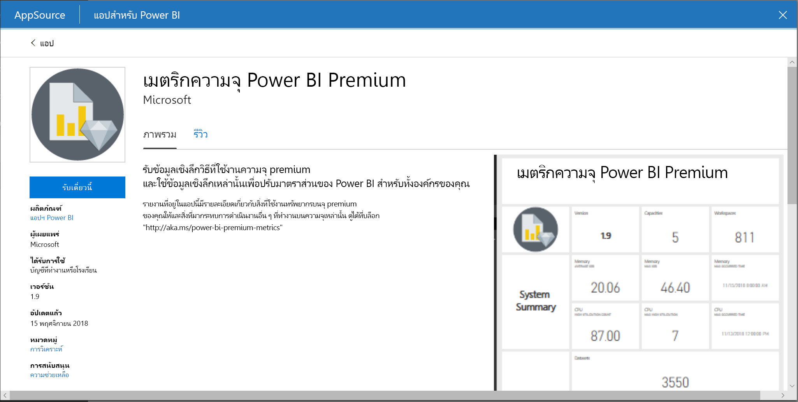

เมื่อแอปเปิดขึ้น แดชบอร์ดจะถูกโหลดเพื่อแสดงไทล์จำนวนมากที่แสดงมุมมองโดยรวมของความจุทั้งหมดที่ผู้ใช้เป็นผู้ดูแลระบบความจุ เค้าโครงแดชบอร์ดประกอบด้วยส่วนหลักต่อไปนี้:

- **ภาพรวม**: เวอร์ชันแอป จำนวนของความจุและพื้นที่ทำงาน
- **ข้อมูลสรุปของระบบ**: เมตริกหน่วยความจำและ CPU
- **ข้อมูลสรุปของชุดข้อมูล**: จำนวนของชุดข้อมูล, DQ/LC, เมตริกการรีเฟรชและการคิวรี
- **ข้อมูลสรุปของกระแสข้อมูล**: จำนวนกระแสข้อมูล และเมตริกชุดข้อมูล
- **สรุปรายงานที่มีการแบ่งหน้า**: เมตริกการรีเฟรชและมุมมอง
- **สรุป AI**: จำนวนของการดำเนินการและเมตริกชุดข้อมูล

รายงานเบื้องต้น (จากแดชบอร์ดที่ปักหมุดไว้) สามารถเข้าถึงได้โดยคลิกที่ไทล์แดชบอร์ดต่าง ๆ ซึ่งแสดงมุมมองรายละเอียดเพิ่มเติมของแต่ละส่วนแดชบอร์ด และสนับสนุนการกรองแบบโต้ตอบ การกรองสามารถทำได้โดยการตั้งค่าตัวแบ่งส่วนข้อมูลตามช่วงวัน ความจุ พื้นที่ทำงาน และปริมาณงาน (รายงาน ชุดข้อมูล กระแสข้อมูล) และโดยการเลือกองค์ประกอบภายในวิชวลการรายงานเพื่อกรองข้ามหน้ารายงาน การกรองข้ามเป็นเทคนิคที่มีประสิทธิภาพเพื่อจำกัดช่วงเวลา ความจุพื้นที่ทำงาน ชุดข้อมูล และอื่น ๆ ที่เฉพาะเจาะจงให้แคบลง และจะมีประโยชน์มากเมื่อทำการวิเคราะห์สาเหตุของปัญหา

รายงานประกอบด้วยหน้าต่อไปนี้:

- **ชุดข้อมูล**: แสดงเมตริกโดยละเอียดเกี่ยวกับสถานภาพของชุดข้อมูล การเลือกปุ่มแสดงมุมมองที่แตกต่างกัน: ข้อมูลสรุป, การรีเฟรช, ระยะเวลาของคิวรี, การรอคิวรี และชุดข้อมูล
- **รายงานที่มีการแบ่งหน้า**: แสดงเมตริกโดยละเอียดเกี่ยวกับสถานภาพของรายงานที่มีการแบ่งหน้า
- **กระแสข้อมูล**: แสดงเมตริกโดยละเอียดเกี่ยวกับสถานภาพของกระแสข้อมูล
- **AI**: แสดงเมตริกโดยละเอียดเกี่ยวกับสถานภาพของปริมาณงาน AI
- **ระบบ**: แสดงเมตริกความจุโดยรวม รวมทั้งหน่วยความจำและการใช้งาน CPU
- **แสดงชื่อและรหัส**: แสดงชื่อ รหัส และเจ้าของของความจุ พื้นที่ทำงาน และปริมาณงาน

หน้ารายงานมีมุมมองอื่นสามารถเข้าถึงได้โดยการคลิกปุ่ม วิชวลการรายงานช่วยให้สามารถตรวจสอบเมตริกได้ตลอดเวลาเพื่อเปรียบเทียบกับการใช้ทรัพยากรระบบ

เอกสารทางเทคนิคนี้จะไม่อธิบายแต่ละหน้าและมุมมอง แต่จะแสดงรายการเมตริกที่มีอยู่ในรายงานพร้อมกับจุดประสงค์ รายงานแสดงหลายหน้าและวิชวลที่ยึดตามเมตริกต่อไปนี้ก่อนตามด้วยแหล่งทรัพยากร ดังที่แสดงในตารางต่อไปนี้

##### เอนทิตี (ซึ่งผู้ใช้เป็นผู้ดูแลระบบความจุ)

| เมตริก | คำอธิบาย |
| --- | --- |
| ความจุ | จำนวนของความจุ |
| พื้นที่ทำงาน | จำนวนของพื้นที่ทำงานในความจุของคุณที่เป็นเมตริกการรายงานในช่วงเวลาเจ็ดวันที่ผ่านมา |
| ชุดข้อมูล | จำนวนของชุดข้อมูลในพื้นที่ทำงานทั้งหมดในความจุของคุณ |
| กระแสข้อมูล | จำนวนของกระแสข้อมูลในพื้นที่ทำงานทั้งหมดในความจุของคุณ |
| รายงานที่มีการแบ่งหน้า | จำนวนรวมของรายงานที่มีการแบ่งหน้าในพื้นที่ทำงานทั้งหมดในความจุของคุณ |
| |

##### หน่วยความจำ

| เมตริก | คำอธิบาย |
| --- | --- |
| หน่วยความจำโดยเฉลี่ย | การใช้หน่วยความจำโดยเฉลี่ยในช่วงเจ็ดวันที่ผ่านมา |
| หน่วยความจำโดยเฉลี่ยตามปริมาณงาน: ชุดข้อมูล กระแสข้อมูล รายงานที่มีการแบ่งหน้า | การใช้หน่วยความจำโดยเฉลี่ยในช่วงเจ็ดวันที่ผ่านมา (ใน GB) ตามปริมาณงาน: ชุดข้อมูล กระแสข้อมูล รายงานที่มีการแบ่งหน้า |
| การใช้งานสูงสุด | ปริมาณการใช้หน่วยความจำสูงสุด (ใน GB) ในช่วงเจ็ดวันที่ผ่านมา ซึ่งแบ่งออกเป็นช่วงเวลาสามนาทีในบักเก็ต 1 ชั่วโมง |
| |

##### CPU

| เมตริก | คำอธิบาย |
| --- | --- |
| จำนวนการใช้งานสูง | จำนวนครั้งที่ CPU เกิน 80% ของค่าเกณฑ์ในเจ็ดวันที่ผ่านมา ซึ่งแบ่งออกเป็นช่วงเวลาสามนาทีในบักเก็ต 1 ชั่วโมง |
| |

##### การเชื่อมต่อ DQ/LC

| เมตริก | คำอธิบาย |
| --- | --- |
| จำนวนการใช้งานสูง | จำนวนครั้งที่การเชื่อมต่อ DQ/LC เกิน 80% ของค่าเกณฑ์ในเจ็ดวันที่ผ่านมา ซึ่งแบ่งออกเป็นช่วงเวลา 3 นาทีในบักเก็ต 1 ชั่วโมง |
| |

ตารางต่อไปนี้แสดงเมตริกที่เกี่ยวกับปริมาณงาน

##### การรีเฟรชชุดข้อมูล

| เมตริก | คำอธิบาย |
| --- | --- |
| รีเฟรช | จำนวนของการรีเฟรชในช่วงเจ็ดวันที่ผ่านมา |
| การรีเฟรชที่สำเร็จ | จำนวนของการรีเฟรชสำเร็จในช่วงเจ็ดวันที่ผ่านมา |
| การรีเฟรชที่ล้มเหลว | จำนวนของการรีเฟรชที่ล้มเหลวในช่วงเจ็ดวันที่ผ่านมา |
| ระยะเวลาการรีเฟรชโดยเฉลี่ย | ระยะเวลาการรีเฟรชโดยเฉลี่ยในหน่วยเป็นนาทีในช่วงเจ็ดวันที่ผ่านมา |
| ระยะเวลาการรีเฟรชสูงสุด | ระยะเวลาของการรีเฟรชที่ทำงานนานที่สุดในหน่วยเป็นนาที |
| เวลารอโดยเฉลี่ย | เวลารอรีเฟรชเฉลี่ย (การหน่วงเวลาระหว่างเวลาที่กำหนดไว้และเวลาเริ่มต้น) ในหน่วยเป็นนาที \[[16](#endnote-16)\] |
| เวลารอสูงสุด | เวลารอรีเฟรชสูงสุด (การหน่วงเวลาระหว่างเวลาที่กำหนดไว้และเวลาเริ่มต้น) ในหน่วยเป็นนาที |
| ความน่าเชื่อถือของการรีเฟรช | เปอร์เซ็นต์ของการรีเฟรชที่เสร็จสมบูรณ์ภายในช่วงเจ็ดวันที่ผ่านมา |
| |

##### คิวรีชุดข้อมูล

| เมตริก | คำอธิบาย |
| --- | --- |
| คิวรี | จำนวนของคิวรีที่เรียกใช้ในช่วงเจ็ดวันที่ผ่านมา |
| คิวรีที่ประสบความสำเร็จ | จำนวนของคิวรีที่ประสบความสำเร็จในช่วงเจ็ดวันที่ผ่านมา |
| คิวรีที่ล้มเหลว | จำนวนของคิวรีที่ล้มเหลวในช่วงเจ็ดวันที่ผ่านมา |
| ระยะเวลาคิวรีโดยเฉลี่ย | ระยะเวลาคิวรีโดยเฉลี่ย (ในหน่วยเป็นมิลลิวินาที) ในช่วงเจ็ดวันที่ผ่านมา สามารถใช้เพื่อกำหนดการกระจายคิวรีต่อชั่วโมงร่วมกับปริมาณการใช้หน่วยความจำ โดยแบ่งออกเป็นบักเก็ต 1 ชั่วโมง |
| ระยะเวลาคิวรีสูงสุด | ระยะเวลาคิวรีสูงสุด (ในหน่วยเป็นมิลลิวินาที) ในช่วงเจ็ดวันที่ผ่านมา |
| จำนวนเวลารอคิวรี | จำนวนคิวรีที่มีการรอเวลาบางหรือ 7 วันล่าสุด |
| เวลารอคิวรีโดยเฉลี่ย | เวลารอคิวรีโดยเฉลี่ย (ในหน่วยเป็นมิลลิวินาที) ในช่วงเจ็ดวันที่ผ่านมา สามารถใช้เพื่อกำหนดการกระจายเวลารอคิวรีต่อชั่วโมงร่วมกับปริมาณการใช้หน่วยความจำ โดยแบ่งออกเป็นบักเก็ต 1 ชั่วโมง |
| เวลารอคิวรีสูงสุด | เวลารอคิวรีสูงสุด (ในหน่วยเป็นมิลลิวินาที) ในช่วงเจ็ดวันที่ผ่านมา |
| |

##### การโหลดชุดข้อมูล

| เมตริก | คำอธิบาย |
| --- | --- |
| ขนาดชุดข้อมูลโดยเฉลี่ย | ขนาดโดยเฉลี่ย (ใน MB) ของชุดข้อมูลในหน่วยความจำ \[[17](#endnote-17)\] |
| ชุดข้อมูลที่ใช้งานอยู่ที่โหลดในหน่วยความจำ | จำนวนของชุดข้อมูลที่โหลดลงในหน่วยความจำต่อชั่วโมง |
| การลดสัดส่วนชุดข้อมูล | จำนวนของชุดข้อมูลที่ลดสัดส่วนเนื่องจากหน่วยความจำไม่เพียงพอ |
| การลดสัดส่วนชุดข้อมูลและปริมาณการใช้หน่วยความจำ | จำนวนของชุดข้อมูลที่ลบออกจากหน่วยความจำต่อชั่วโมง |
| หน่วยความจำที่ใช้งานอยู่ | หน่วยความจำที่ใช้งานอยู่แสดงจำนวนรวมของหน่วยความจำที่ไม่สามารถลบออกได้เนื่องจากมีการใช้อยู่ ความแตกต่างระหว่างหน่วยความจำที่ใช้งานอยู่และหน่วยความจำทั้งหมดคือผลรวมของหน่วยความจำที่ชุดข้อมูลใช้ซึ่งอยู่ในหน่วยความจำ แต่ยังไม่ได้ใช้ใน 3 นาทีล่าสุด |
| |

##### กระแสข้อมูล

| เมตริก | คำอธิบาย |
| --- | --- |
| รีเฟรช | จำนวนของการรีเฟรชกระแสข้อมูลในช่วงเจ็ดวันที่ผ่านมา |
| ระยะเวลาการรีเฟรชโดยเฉลี่ย | ระยะเวลาการรีเฟรชกระแสข้อมูลโดยเฉลี่ย (ในหน่วยเป็นนาที) ในช่วงเจ็ดวันที่ผ่านมา |
| ระยะเวลาการรีเฟรชสูงสุด | ระยะเวลาการรีเฟรชกระแสข้อมูลสูงสุด (ในหน่วยเป็นนาที) ในช่วงเจ็ดวันที่ผ่านมา |
| เวลารอรีเฟรชโดยเฉลี่ย | เวลารอรีเฟรชกระแสข้อมูลโดยเฉลี่ย (การหน่วงเวลาระหว่างเวลาที่กำหนดไว้และเวลาเริ่มต้น ในหน่วยเป็นนาที) |
| เวลารอรีเฟรชสูงสุด | เวลารอรีเฟรชกระแสข้อมูลสูงสุด (การหน่วงเวลาระหว่างเวลาที่กำหนดไว้และเวลาเริ่มต้น ในหน่วยเป็นนาที) |
| ความน่าเชื่อถือของการรีเฟรช | เปอร์เซ็นต์ของการรีเฟรชกระแสข้อมูลที่เสร็จสมบูรณ์ภายในช่วงเจ็ดวันที่ผ่านมา |
| |

##### รายงานที่มีการแบ่งหน้า

| เมตริก | คำอธิบาย |
| --- | --- |
| มุมมอง | จำนวนของมุมมองรายงาน |
| จำนวนแถว | จำนวนแถวของข้อมูลในรายงาน |
| การเรียกข้อมูลโดยเฉลี่ย | ระยะเวลาการเรียกข้อมูลโดยเฉลี่ย (ในหน่วยเป็นมิลลิวินาที) ในช่วงเจ็ดวันที่ผ่านมา |
| การประมวลผลโดยเฉลี่ย | ระยะเวลาการประมวลผลโดยเฉลี่ย (ในหน่วยเป็นมิลลิวินาที) ในช่วงเจ็ดวันที่ผ่านมา |
| การแสดงภาพโดยเฉลี่ย | ระยะเวลาการแสดงภาพโดยเฉลี่ย (ในหน่วยเป็นมิลลิวินาที) ในช่วงเจ็ดวันที่ผ่านมา |
| ระยะเวลาโดยเฉลี่ย | เวลารวมโดยเฉลี่ยในการดำเนินการตามขั้นตอนทั้งหมดของมุมมองรายงาน (ในหน่วยเป็นมิลลิวินาที) ในช่วงเจ็ดวันที่ผ่านมา |
| |

##### AI

| เมตริก | คำอธิบาย |
| --- | --- |
|    การเรียกใช้    |    จำนวนการเรียกใช้ฟังก์ชัน AI ตามชนิดของฟังก์ชันในช่วงเจ็ดวันที่ผ่านมา    |
|    จำนวนแถวโดยเฉลี่ย    |    จำนวนของแถวโดยเฉลี่ยสำหรับการเรียกใช้แต่ละครั้งในช่วงเจ็ดวันที่ผ่านมา    |
|    ขนาดการป้อนข้อมูลโดยเฉลี่ย    |    ขนาดโดยเฉลี่ยของข้อมูลการป้อนเข้าในหน่วยเป็นไบต์ในช่วงเจ็ดวันที่ผ่านมา    |
|    ขนาดผลลัพธ์โดยเฉลี่ย    |    ขนาดโดยเฉลี่ยของข้อมูลผลลัพธ์ในหน่วยเป็นไบต์ในช่วงเจ็ดวันที่ผ่านมา    |
|    ระยะเวลาโดยเฉลี่ย    |    ระยะเวลาโดยเฉลี่ยของการเรียกใช้ API (ในหน่วยเป็นมิลลิวินาที) ในช่วงเจ็ดวันที่ผ่านมา    |
|    เวลารอโดยเฉลี่ย    |    เวลารอโดยเฉลี่ย (ในหน่วยเป็นมิลลิวินาที) สำหรับการเรียกใช้ AI ในช่วงเจ็ดวันที่ผ่านมา    |
|    ความสำเร็จ/ล้มเหลว    |    จำนวนของความสำเร็จและความล้มเหลวในช่วงเจ็ดวันที่ผ่านมา    |
|         |         |

แอปอาจมีการอัปเดตเวอร์ชันบ่อยครั้ง สำหรับข้อมูลล่าสุด ดูที่เอกสาร[ตรวจสอบ Power BI Premium และ Power BI Embedded](service-admin-premium-monitor-capacity.md)

#### เมตริกการแปล

เมตริกควรได้รับการตรวจสอบเพื่อสร้างความเข้าใจพื้นฐานเกี่ยวกับกิจกรรมการใช้งานแหล่งทรัพยากรและปริมาณงาน หากความจุช้าลง คุณจะต้องเข้าใจว่าเมตริกใดที่จะตรวจสอบและข้อสรุปที่คุณสามารถทำได้

โดยปกติ คิวรีควรจะเสร็จสมบูรณ์ภายในเสี้ยววินาทีเพื่อส่งมอบประสบการณ์การตอบสนองแก่ผู้ใช้รายงาน และช่วยให้อัตราความเร็วของการคิวรีสูงขึ้น โดยปกติแล้ว ข้อจำกัดจะน้อยลงเมื่อการประมวลผลเบื้องหลัง รวมถึงการรีเฟรช ใช้เวลานานขึ้นในการดำเนินการให้เสร็จสมบูรณ์

โดยทั่วไป รายงานช้าอาจเป็นการบ่งชี้ว่าความจุกำลังจะมีอุณหภูมิสูง เมื่อรายงานไม่สามารถโหลดได้ ลักษณะเช่นนี้ก็ถือเป็นการบ่งชี้ว่าความจุมีอุณหภูมิสูงแล้ว ในทั้งสองสถานการณ์ สาเหตุที่แท้จริงอาจเกิดจากปัจจัยหลายประการรวมถึง:

- **คิวรีล้มเหลว**ระบุอย่างชัดเจนว่าหน่วยความจำไม่เพียงพอและไม่สามารถโหลดแบบจำลองลงในหน่วยความจำได้ บริการของ Power BI จะพยายามโหลดแบบจำลองเป็นเวลา 30 วินาทีก่อนล้มเหลว

- **เวลารอคิวรีมากเกินไป**อาจเนื่องจากหลายสาเหตุ:
  - ความจำเป็นสำหรับบริการของ Power BI เพื่อลดสัดส่วนแบบจำลองก่อนจากนั้นโหลดแบบจำลองที่จะคิวรี (โปรดทราบว่าอัตราการลดสัดส่วนชุดข้อมูลสูงขึ้นเพียงอย่างเดียวไม่บ่งชี้ถึงปัญหาความจุ เว้นแต่จะมาพร้อมกับเวลารอคิวที่นานที่ระบุการแธรชชิ่งหน่วยความจำ)
  - เวลาการโหลดแบบจำลอง (โดยเฉพาะอย่างยิ่งการรอโหลดแบบจำลองขนาดใหญ่ลงในหน่วยความจำ)
  - คิวรีการเรียกใช้ที่นาน
  - การเชื่อมต่อ LC\DQ มากเกินไป (เกินขีดจำกัดของความจุ)
  - ความอิ่มตัวของ CPU
  - การออกแบบรายงานที่ซับซ้อนพร้อมด้วยจำนวนวิชวลบนหน้าที่มากเกินไป (โปรดทราบว่าแต่ละวิชวลคือคิวรี)
- **ระยะเวลาการคิวรีที่นาน**สามารถระบุได้ว่าการออกแบบแบบจำลองจะไม่เหมาะสม โดยเฉพาะอย่างยิ่งเมื่อใช้งานชุดข้อมูลหลายชุดในความจุ และเพียงหนึ่งชุดข้อมูลก็ทำให้ระยะเวลาการคิวรีนาน ซึ่งขอแนะนำให้จัดหาความจุให้เพียงพอและชุดข้อมูลที่มีปัญหานั้นไม่เหมาะสมหรือช้า คิวรีการเรียกใช้ที่นานอาจมีปัญหาขณะที่อาจบล็อกการเข้าถึงแหล่งข้อมูลที่จำเป็นต้องใช้ในกระบวนการอื่น ๆ
- **เวลารอรีเฟรชหรือเวลารอการเรียกใช้ AI ที่นาน**ระบุหน่วยความจำไม่เพียงพอเนื่องจากแบบจำลองที่ใช้งานอยู่มากมายกำลังใช้หน่วยความจำ หรือการรีเฟรชที่เป็นปัญหากำลังบล็อกการรีเฟรชอื่น ๆ (เกินขีดจำกัดการรีเฟรชแบบขนาน)

คำอธิบายโดยละเอียดเพิ่มเติมเกี่ยวกับวิธีการใช้เมตริกจะอธิบายไว้ในส่วน[การปรับความจุแบบพรีเมียมให้เหมาะสม](#optimizing-premium-capacities)

## การปรับความจุแบบพรีเมียมให้เหมาะสม

เมื่อเกิดปัญหาเกี่ยวกับประสิทธิภาพของความจุแบบพรีเมียม แนวทางแรกทั่วไปคือการปรับหรือปรับแต่งโซลูชันที่ปรับใช้แล้วเพื่อคืนค่าเวลาการตอบสนองที่ยอมรับได้ เหตุผลที่สำคัญคือการหลีกเลี่ยงการซื้อความจุแบบพรีเมียมเพิ่มเติม เว้นแต่จะได้รับการพิสูจน์

เมื่อจำเป็นต้องใช้ความจุแบบพรีเมียมเพิ่มเติม มีสองตัวเลือกซึ่งจะกล่าวถึงในภายหลังในส่วนนี้:

- เพิ่มขนาดความจุแบบพรีเมียม
- เพิ่มความจุแบบพรีเมียมใหม่

สุดท้าย การทดสอบวิธีการและการปรับขนาดความจุแบบพรีเมียมจะรวบรวมไว้ในส่วนนี้

### แนวทางปฏิบัติที่ดีที่สุดทั่วไป

เมื่อพยายามที่จะใช้ประโยชน์ให้ได้มากที่สุดและมีประสิทธิภาพสูงสุด มีแนวทางปฏิบัติที่ดีที่สุดบางประการซึ่งเป็นที่เข้าใจตรงกันว่าเป็นคำแนะนำทั่วไป สิ่งเหล่านี้รวมถึง:

- การใช้พื้นที่ทำงานของแอปแทนพื้นที่ทำงานส่วนบุคคล
- การแยกความสำคัญทางธุรกิจและ Self-Service BI (SSBI) ลงในความจุอื่น

  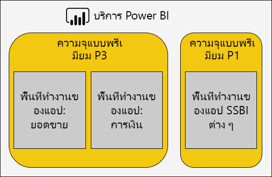

- ถ้ามีการแชร์เนื้อหากับผู้ใช้ Power BI Pro เท่านั้น อาจไม่จำเป็นต้องจัดเก็บเนื้อหาในความจุเฉพาะ
- ใช้ความจุเฉพาะเมื่อต้องการเวลาการรีเฟรชที่เฉพาะเจาะจง หรือเมื่อจำเป็นต้องใช้คุณลักษณะเฉพาะ ตัวอย่างเช่น ชุดข้อมูลขนาดใหญ่หรือรายงานที่มีการแบ่งหน้า

### การกำหนดคำถามทั่วไป

การปรับใช้ Power BI Premium ให้เหมาะสมเป็นหัวข้อที่ซับซ้อนที่เกี่ยวข้องกับการทำความเข้าใจข้อกำหนดของปริมาณงาน ทรัพยากรที่มีอยู่ และการใช้งานอย่างมีประสิทธิภาพ

หัวข้อนี้เน้นคำถามการสนับสนุนโดยทั่วไปเจ็ดข้อ ซึ่งอธิบายปัญหาที่อาจเกิดขึ้นและคำอธิบาย รวมถึงข้อมูลเกี่ยวกับวิธีการระบุและแก้ไขปัญหา

#### ทำไมความจุจึงช้าลง และฉันสามารถทำอะไรได้บ้าง

มีหลายเหตุผลที่สามารถทำให้ความจุแบบพรีเมียมช้าลง คำถามนี้ต้องการข้อมูลเพิ่มเติมเพื่อทำความเข้าใจกับสิ่งที่ทำให้ช้าลง รายงานโหลดช้าหรือไม่ หรือไม่สามารถโหลดรายงานได้ใช่หรือไม่ วิชวลการรายงานโหลดช้าหรืออัปเดตเมื่อผู้ใช้โต้ตอบกับรายงานใช่หรือไม่ การรีเฟรชใช้เวลานานกว่าจะเสร็จสมบูรณ์ซึ่งนานกว่าที่คาดไว้หรือเคยมีประสบการณ์มาก่อนหรือไม่

เมื่อเข้าใจเหตุผลแล้ว คุณสามารถเริ่มตรวจสอบได้ คำตอบสำหรับคำถามหกข้อต่อไปนี้จะช่วยให้คุณสามารถแก้ไขปัญหาที่เฉพาะเจาะจงได้มากขึ้น

#### เนื้อหาใดที่ใช้ความจุของฉันหมด

คุณสามารถใช้แอป**เมตริกความจุ Power BI Premium**เพื่อกรองตามความจุ และตรวจสอบเมตริกประสิทธิภาพการทำงานสำหรับเนื้อหาของพื้นที่ทำงานได้ โดยต้องตรวจสอบเมตริกประสิทธิภาพการทำงานและการใช้งานทรัพยากรต่อชั่วโมงในช่วงเจ็ดวันที่ผ่านมาสำหรับเนื้อหาทั้งหมดที่จัดเก็บไว้ภายในความจุแบบพรีเมียม ซึ่งมักจะเป็นขั้นตอนแรกจะดำเนินการเมื่อแก้ไขปัญหาข้อกังวลทั่วไปเกี่ยวกับประสิทธิภาพการทำงานของความจุแบบพรีเมียม

เมตริกหลักที่จะต้องตรวจสอบรวมถึง:

- CPU โดยเฉลี่ยและจำนวนการใช้งานสูง
- หน่วยความจำโดยเฉลี่ย และจำนวนการใช้งานสูง และการใช้หน่วยความจำสำหรับชุดข้อมูลที่เฉพาะเจาะจง กระแสข้อมูล และรายงานที่มีการแบ่งหน้า
- ชุดข้อมูลที่ใช้งานอยู่ที่โหลดในหน่วยความจำ
- ระยะเวลาการคิวรีโดยเฉลี่ยและสูงสุด
- เวลารอคิวรีโดยเฉลี่ย
- เวลาการรีเฟรชชุดข้อมูลและกระแสข้อมูลโดยเฉลี่ย
- เวลารอและเวลาการเรียกใช้ AI โดยเฉลี่ย

นอกจากนี้ในแอปเมตริกความจุ Power BI Premium หน่วยความจำที่ใช้งานอยู่จะแสดงจำนวนหน่วยความจำทั้งหมดที่ปันส่วนให้กับรายงานที่ไม่ได้ถูกลบเนื่องจากมีการใช้งานในสามนาทีที่ผ่านมา อัตราการเพิ่มขึ้นสูงในระยะเวลารอการรีเฟรชอาจมีความสัมพันธ์กับชุดข้อมูลขนาดใหญ่และ/หรือชุดข้อมูลที่ใช้งานอยู่

แผนภูมิ "ระยะเวลาเฉลี่ยสูงสุด 5 อันดับแรก" เน้นชุดข้อมูล รายงานที่มีการแบ่งหน้า กระแสข้อมูล และการเรียกใช้ AI ที่ใช้ทรัพยากรความจุห้าอันดับแรก เนื้อหาในรายการห้าอันดับแรกเป็นตัวเลือกสำหรับการตรวจสอบและการเพิ่มประสิทธิภาพที่เป็นไปได้

#### ทำไมรายงานจึงช้า

ตารางต่อไปนี้แสดงปัญหาที่เป็นไปได้และวิธีการระบุและแก้ไขปัญหาเหล่านั้น

##### ทรัพยากรความจุไม่เพียงพอ

| คำอธิบายที่เป็นไปได้ | วิธีการระบุ | วิธีการแก้ไข |
| --- | --- | --- |
| หน่วยความจำที่ใช้งานอยู่โดยรวมแล้วมีปริมาณสูง (แบบจำลองไม่สามารถลบออกได้เนื่องจากมีการใช้งานในสามนาทีล่าสุด)   อัตราการเพิ่มขึ้นอย่างรวดเร็วทันทีทันใดสูงหลายเท่าในเวลารอคิวรี   อัตราการเพิ่มขึ้นอย่างรวดเร็วทันทีทันใดสูงหลายเท่าในเวลารอรีเฟรช | ตรวจสอบเมตริกหน่วยความจำ \[[18](#endnote-18)\]และจำนวนการลดสัดส่วน \[[19](#endnote-19)\] | ลดขนาดของแบบจำลอง หรือแปลงเป็นโหมด DirectQuery - ดูที่หัวข้อ[การปรับแบบจำลองให้เหมาะสม](#optimizing-models)ในส่วนนี้   เพิ่มขนาดความจุ   กำหนดเนื้อหาไปยังความจุอื่น |

##### การออกแบบรายงานที่ไม่มีประสิทธิภาพ

| คำอธิบายที่เป็นไปได้ | วิธีการระบุ | วิธีการแก้ไข |
| --- | --- | --- |
| หน้ารายงานประกอบด้วยวิชวลมากมาย (การกรองแบบโต้ตอบสามารถทริกเกอร์อย่างน้อยหนึ่งคิวรีต่อวิชวล)   วิชวลดึงข้อมูลที่มากกว่าที่จำเป็น | ตรวจสอบการออกแบบรายงาน   สัมภาษณ์ผู้ใช้รายงานเพื่อทำความเข้าใจวิธีการที่พวกเขาโต้ตอบกับรายงาน   ตรวจสอบเมตริกคิวรีของชุดข้อมูล \[[20](#endnote-20)\] | การออกแบบรายงานใหม่ที่มีวิชวลที่น้อยลงสำหรับแต่ละหน้า |

##### ชุดข้อมูลช้า (โดยเฉพาะอย่างยิ่งเมื่อรายงานก่อนหน้านี้ทำได้ดี)

| คำอธิบายที่เป็นไปได้ | วิธีการระบุ | วิธีการแก้ไข |
| --- | --- | --- |
| ปริมาณข้อมูลการนำเข้าเพิ่มขึ้นเรื่อย ๆ เป็นจำนวนมาก   ตรรกะการคำนวณที่ซับซ้อนหรือไม่มีประสิทธิภาพ รวมถึงบทบาท RLS   แบบจำลองไม่ได้รับการปรับให้เหมาะสม   เวลาแฝงเกตเวย์ (DQ/LC)   เวลาการตอบสนองของคิวรีต้นทาง DQ ช้า | ตรวจสอบการออกแบบแบบจำลอง   ตรวจสอบตัวนับประสิทธิภาพของเกตเวย์ | ดูที่หัวข้อ[การปรับแบบจำลองให้เหมาะสม](#optimizing-models)ในส่วนนี้ |

##### การใช้รายงานพร้อมกันสูง

| คำอธิบายที่เป็นไปได้ | วิธีการระบุ | วิธีการแก้ไข |
| --- | --- | --- |
| เวลารอคิวรีสูง   ความอิ่มตัวของ CPU   เกินขีดจำกัดการเชื่อมต่อ DQ/LC | ตรวจสอบการใช้งาน CPU \[[21](#endnote-21)\], เวลารอคิวรี และการใช้งาน DQ/LC \[[22](#endnote-22)\]เมตริก + ระยะเวลาการคิวรี ถ้ามีความผันผวนสามารถระบุได้ว่ามีปัญหาเกิดพร้อมกัน | เพิ่มขนาดความจุหรือกำหนดเนื้อหาไปยังความจุอื่น   การออกแบบรายงานใหม่ที่มีวิชวลที่น้อยลงสำหรับแต่ละหน้า |

#### เหตุใดรายงานจึงไม่โหลด

เมื่อรายงานไม่สามารถโหลดได้ ซึ่งเป็นสถานการณ์ที่เลวร้ายที่สุด และเป็นสัญญาณเตือนว่าความจุนั้นมีหน่วยความจำไม่เพียงพอและมีอุณหภูมิสูงเกินไป สิ่งนี้สามารถเกิดขึ้นได้เมื่อแบบจำลองที่โหลดทั้งหมดกำลังถูกคิวรีอย่างแข็งขันและไม่สามารถลบออกไล่ได ้และการดำเนินการรีเฟรชใด ๆ ได้ถูกหยุดชั่วคราวหรือล่าช้า บริการของ Power BI จะพยายามโหลดชุดข้อมูลเป็น 30 วินาที และผู้ใช้ได้รับแจ้งเตือนอย่างสุภาพถึงความล้มเหลว พร้อมด้วยคำแนะนำให้ลองอีกครั้งในอีกสักครู่

ในขณะนี้ ไม่มีเมตริกสำหรับตรวจสอบความล้มเหลวในการโหลดรายงาน คุณสามารถระบุความเป็นไปได้ของปัญหานี้ได้โดยการตรวจสอบหน่วยความจำระบบ โดยเฉพาะการใช้งานสูงสุดและเวลาที่มีการใช้งานสูงสุด การลดสัดส่วนชุดข้อมูลสูงและเวลารอเฉลี่ยในการรีเฟรชชุดข้อมูลที่นานแสดงว่าปัญหานี้กำลังเกิดขึ้น

หากเหตุการณ์เกิดขึ้นเพียงแค่นาน ๆ ครั้ง อาจไม่ถือว่าเป็นปัญหาที่มีความสำคัญ ผู้ใช้รายงานจะได้รับแจ้งว่าบริการไม่ว่างและควรลองอีกครั้งหลังจากนั้นสักครู่ หากเหตุการณ์นี้เกิดขึ้นบ่อยเกินไป ปัญหาสามารถแก้ไขได้ด้วยการเพิ่มขนาดความจุแบบพรีเมียมหรือโดยการกำหนดเนื้อหาไปยังความจุอื่น

ผู้ดูแลระบบความจุ (และผู้ดูแลระบบบริการของ Power BI) สามารถตรวจสอบเมตริก**ความล้มเหลวของคิวรี**เพื่อกำหนดช่วงเวลาที่เหตุการณ์นี้จะเกิดขึ้น นอกจากนี้ พวกเขายังสามารถรีสตาร์ทความจุ โดยการรีเซ็ตการทำงานทั้งหมดในกรณีที่ระบบโอเวอร์โหลด

#### ทำไมการรีเฟรชจึงไม่เริ่มต้นตามกำหนดเวลา

ไม่รับประกันเวลาเริ่มต้นการรีเฟรชตามกำหนดเวลา โปรดทราบว่าบริการของ Power BI จะจัดลำดับความสำคัญของการทำงานแบบโต้ตอบเหนือกว่าการทำงานแบบเบื้องหลังเสมอ การรีเฟรชเป็นการทำงานแบบเบื้องหลังที่สามารถเกิดขึ้นเมื่อตรงตามเงื่อนไขสองประการได้แก่:

- มีหน่วยความจำเพียงพอ
- ไม่เกินจำนวนการรีเฟรชที่เกิดขึ้นพร้อมกันที่ความจุแบบพรีเมียมรองรับ

เมื่อไม่ตรงตามเงื่อนไข การรีเฟรชจะถูกจัดคิวไว้จนกว่าเงื่อนไขจะมีผล

สำหรับการรีเฟรชเต็มรูปแบบ โปรดทราบว่าต้องมีขนาดหน่วยความจำของชุดข้อมูลปัจจุบันอย่างน้อยสองเท่า หากหน่วยความจำไม่เพียงพอ การรีเฟรชไม่สามารถเริ่มได้จนกว่าการลดสัดส่วนแบบจำลองจะทำให้หน่วยความจำว่าง นั่นหมายถึงความล่าช้าจนกว่าชุดข้อมูลตั้งแต่หนึ่งชุดขึ้นไปจะไม่ทำงานและสามารถลบออกได้

โปรดทราบว่าจำนวนการรีเฟรชที่เกิดขึ้นพร้อมกันสูงสุดที่รองรับถูกตั้งไว้ที่ 1.5 เท่าของวี-คอร์ Backend โดยปัดเศษขึ้น

การรีเฟรชตามกำหนดเวลาจะล้มเหลวเมื่อไม่สามารถเริ่มได้ก่อนที่การรีเฟรชตามกำหนดเวลาครั้งต่อไปจะเกิดขึ้น การรีเฟรชตามความต้องการที่ทริกเกอร์ด้วยตนเองจาก UI จะพยายามเรียกใช้งานได้ถึงสามครั้งก่อนที่จะล้มเหลว

ผู้ดูแลระบบของความจุ (และผู้ดูแลระบบบริการของ Power BI) สามารถตรวจสอบเมตริก**เวลารอรีเฟรชโดยเฉลี่ย (นาที)** เพื่อกำหนดว่าการหน่วงเวลาเฉลี่ยระหว่างเวลาที่กำหนดไว้และจุดเริ่มต้นของการดำเนินการ

แม้ว่าโดยปกติจะไม่ให้ความสำคัญกับการดูแลระบบเพื่อให้มีผลต่อการรีเฟรชข้อมูลตรงเวลา แต่ต้องให้แน่ใจว่ามีหน่วยความจำเพียงพอ ซึ่งอาจเกี่ยวข้องกับการแยกชุดข้อมูลกับความจุที่มีทรัพยากรเพียงพอที่เป็นที่รู้จัก นอกจากนี้ยังเป็นไปได้ว่าผู้ดูแลระบบสามารถประสานงานกับเจ้าของชุดข้อมูล เพื่อช่วยสลับหรือลดเวลาการรีเฟรชข้อมูลตามกำหนดเวลาเพื่อลดการชน โปรดทราบว่าผู้ดูแลระบบไม่สามารถดูคิวการรีเฟรชหรือดึงข้อมูลตารางเวลาของชุดข้อมูลได้

#### ทำไมการรีเฟรชจึงช้า

การรีเฟรชอาจช้าหรือรับรู้ได้ว่าจะช้า (ตามที่กล่าวถึงในคำถามทั่วไปก่อนหน้านี้)

เมื่อการรีเฟรชช้าลง อาจเป็นเพราะสาเหตุหลายประการ:

- CPU ไม่เพียงพอ (การรีเฟรชอาจใช้งาน CPU สูงมาก)
- หน่วยความจำไม่เพียงพอส่งผลให้หยุดการรีเฟรช (ซึ่งต้องรีเฟรชเพื่อเริ่มต้นใหม่เมื่อตรงตามเงื่อนไขที่มีผลให้เริ่มต้น)
- เหตุผลที่ไม่ใช่ความจุ รวมถึงการตอบสนองของระบบแหล่งข้อมูล เวลาแฝงของเครือข่าย สิทธิ์ที่ไม่ถูกต้อง หรืออัตราความเร็วของเกตเวย์
- ปริมาณข้อมูล - เหตุผลที่ดีในการกำหนดค่าการรีเฟรชแบบเพิ่มทีละส่วนตามที่อธิบายไว้ด้านล่าง

ผู้ดูแลระบบความจุ (และผู้ดูแลระบบบริการของ Power BI) สามารถตรวจสอบเมตริก **ระยะเวลาการรีเฟรชโดยเฉลี่ย (นาที)** เพื่อกำหนดเกณฑ์มาตรฐานสำหรับการเปรียบเทียบเมื่อเวลาผ่านไปและเมตริก **เวลารอรีเฟรชโดยเฉลี่ย (นาที)** เพื่อกำหนดการหน่วงเวลาเฉลี่ยระหว่างเวลาที่กำหนดไว้และจุดเริ่มต้นของการดำเนินการ

การรีเฟรชแบบเพิ่มทีละส่วนสามารถลดระยะเวลาการรีเฟรชข้อมูลได้อย่างมาก โดยเฉพาะอย่างยิ่งสำหรับตารางแบบจำลองขนาดใหญ่ มีข้อดีสี่ประการที่เกี่ยวข้องกันการรีเฟรชแบบเพิ่มทีละส่วนได้แก่:

- **การรีเฟรชเร็วยิ่งขึ้น** : เฉพาะชุดย่อยของตารางที่ต้องการโหลด ซึ่งลดการใช้ CPU และหน่วยความจำ และการทำงานแบบขนานสามารถเพิ่มขึ้นได้เมื่อรีเฟรชหลายพาร์ติชัน
- **การรีเฟรชเกิดขึ้นเฉพาะเมื่อจำเป็น** : สามารถกำหนดค่านโยบายการรีเฟรชแบบเพิ่มทีละส่วนซึ่งจะโหลดเฉพาะเมื่อข้อมูลมีการเปลี่ยนแปลงเท่านั้น
- **การรีเฟรชมีความน่าเชื่อถือมากขึ้น** : การเรียกใช้การเชื่อมต่อกับระบบแหล่งข้อมูลที่เปลี่ยนแปลงง่ายสั้นลงมีความเสี่ยงต่อการตัดการเชื่อมต่อน้อย
- **แบบจำลองยังคงต้องปรับแต่ง** : สามารถกำหนดค่านโยบายการรีเฟรชแบบเพิ่มทีละส่วนเพื่อลบประวัตินอกเหนือจากหน้าต่างบานเลื่อนของเวลาโดยอัตโนมัติ

สำหรับข้อมูลเพิ่มเติม ดูที่เอกสาร[การรีเฟรชแบบเพิ่มทีละส่วนใน Power BI Premium](service-premium-incremental-refresh.md)

#### ทำไมการรีเฟรชข้อมูลจึงไม่เสร็จสมบูรณ์

เมื่อการรีเฟรชข้อมูลเริ่มขึ้นแต่ไม่สำเร็จ อาจเป็นเพราะสาเหตุหลายประการ:

- หน่วยความจำไม่เพียงพอแม้ว่าจะมีเพียงหนึ่งแบบจำลองในความจุแบบพรีเมียมเท่านั้น นั่นคือขนาดของแบบจำลองมีใหญ่มาก
- เหตุผลที่ไม่ใช่ความจุ รวมถึงการตัดการเชื่อมต่อระบบแหล่งข้อมูล สิทธิ์ที่ไม่ถูกต้อง หรือข้อผิดพลาดของเกตเวย์

ผู้ดูแลระบบความจุ (และผู้ดูแลระบบบริการของ Power BI) สามารถตรวจสอบเมตริก**การรีเฟรชล้มเหลวเนื่องจากหน่วยความจำไม่เพียงพอ**

#### ทำไมการเรียกใช้ AI จึงล้มเหลว

การเรียกใช้ AI อาจล้มเหลวเนื่องจากสาเหตุหลายประการ หน่วยความจำขั้นต่ำที่ต้องใช้เพื่อเริ่มต้นปริมาณงาน AI คือ 5 GB แต่อาจไม่เพียงพอสำหรับชุดข้อมูลป้อนข้อมูลบางชุด ตัวอย่างเช่น การฝึกอบรมแบบจำลองการเรียนรู้ของเครื่องอัตโนมัติต้องมีอย่างน้อยสองครั้ง และบางครั้งก็มีขนาดชุดข้อมูลที่ป้อนเข้าหลายเท่า นอกจากนี้ การเรียกใช้ AI จะสิ้นสุดลงหากใช้เวลานานกว่าสองชั่วโมง สำหรับการเรียกใช้แบบจำลองการเรียนรู้ของเครื่องแบบอัตโนมัติที่ไม่เสร็จสมบูรณ์ในสองชั่วโมง แบบจำลองที่ดีที่สุดที่พบในสองชั่วโมงนั้นจะถูกส่งกลับคืน  การเรียกใช้ AI สามารถถูกขัดจังหวะได้โดยคำขอแบบโต้ตอบ ซึ่งมีความสำคัญกว่า

ผู้ดูแลระบบควรตรวจสอบเวลารอของ AI สำหรับสัญญาณของคำขออื่นที่มีความสำคัญกว่า ผู้ดูแลระบบยังสามารถมั่นใจได้ว่ามีหน่วยความจำเพียงพอสำหรับปริมาณงาน AI ที่สัมพันธ์กับขนาดข้อมูลป้อนเข้า ซึ่งอาจเกี่ยวข้องกับการแยกปริมาณงาน AI กับความจุที่ทราบว่ามีทรัพยากรเพียงพอ นอกจากนี้ยังเป็นไปได้ว่าผู้ดูแลระบบสามารถประสานงานกับเจ้าของกระแสข้อมูล เพื่อช่วยสลับหรือลดเวลาการรีเฟรชกระแสข้อมูลเพื่อลดการชน โปรดทราบว่าผู้ดูแลระบบไม่สามารถดูการจัดคิวการเรียกใช้ AI

### การปรับแบบจำลองให้เหมาะสม

การออกแบบแบบจำลองที่เหมาะสมเป็นสิ่งสำคัญอย่างยิ่งในการส่งต่อโซลูชันที่มีประสิทธิภาพและปรับขนาดได้ อย่างไรก็ตาม สิ่งนี้อยู่นอกขอบเขตของเอกสารทางเทคนิคนี้เพื่อกำหนดการสนทนาที่สมบูรณ์ แต่ในส่วนนี้จะมีประเด็นสำคัญสำหรับการพิจารณาเมื่อทำการปรับแบบจำลองให้เหมาะสม

#### การปรับแบบจำลองที่เป็นโฮสต์ของ Power BI ให้เหมาะสม

การปรับแบบจำลองที่เป็นโฮสต์ให้เหมาะสมในความจุแบบพรีเมียมสามารถทำได้ที่แหล่งข้อมูลและเลเยอร์ของแบบจำลอง

พิจารณาความเป็นไปได้ในการปรับให้เหมาะสมที่สุดสำหรับแบบจำลองการนำเข้า:

ในเลเยอร์ของแหล่งข้อมูล:

- แหล่งข้อมูลเชิงสัมพันธ์สามารถปรับให้เหมาะสมเพื่อให้แน่ใจว่าการรีเฟรชสามารถทำได้่เร็วที่สุดที่เป็นไปได้โดยการรวมข้อมูลล่วงหน้า การใช้ดัชนีที่เหมาะสม การกำหนดพาร์ทิชันตารางที่สอดคล้องกับช่วงเวลาการรีเฟรชแบบเพิ่มทีละส่วน และการแสดงการคำนวณ (แทนตารางและคอลัมน์แบบจำลองจาการคำนวณ) หรือการเพิ่มการคำนวณในมุมมอง
- แหล่งข้อมูลที่ไม่สัมพันธ์กันสามารถรวมเข้ากับร้านค้าเชิงสัมพันธ์ล่วงหน้าได้
- ตรวจสอบให้แน่ใจว่าเกตเวย์มีทรัพยากรเพียงพอโดยเฉพาะอย่างยิ่งบนเครื่องเฉพาะที่มีแบนด์วิดท์เครือข่ายเพียงพอและอยู่ใกล้กับแหล่งข้อมูล

ในเลเยอร์แบบจำลอง:

- การออกแบบคิวรี Power Query สามารถลดหรือลบการแปลงข้อมูลที่ซับซ้อนและโดยเฉพาะอย่างยิ่งที่รวมแหล่งข้อมูลที่แตกต่างกัน (คลังข้อมูลสามารถดำเนินการตามขั้นตอนนี้ได้ในช่วง Extract-Transform-Load) นอกจากนี้เพื่อให้มั่นใจว่ามีการตั้งค่าระดับความเป็นส่วนตัวของแหล่งข้อมูลที่เหมาะสม ซึ่งสามารถหลีกเลี่ยงได้โดยต้องใช้ Power BI ในการโหลดผลลัพธ์เต็มรูปแบบเพื่อสร้างผลลัพธ์แบบรวมทั่วทั้งการคิวรี
- โครงสร้างแบบจำลองจะกำหนดข้อมูลที่จะโหลดและมีผลกระทบโดยตรงต่อขนาดของแบบจำลอง ซึ่งสามารถออกแบบมาเพื่อหลีกเลี่ยงการโหลดข้อมูลที่ไม่จำเป็นโดยการลบคอลัมน์ การลบแถว (โดยเฉพาะข้อมูลประวัติ) หรือโดยการโหลดข้อมูลสรุป (มีค่าใช้จ่ายในการโหลดข้อมูลรายละเอียด) การลดขนาดแบบพิเศษสามารถทำได้โดยการลบคอลัมน์ที่มีคาร์ดินาลลิตี้สูง (โดยเฉพาะคอลัมน์ข้อความ) ซึ่งไม่ได้จัดเก็บหรือบีบอัดอย่างมีประสิทธิภาพ
- สามารถปรับปรุงประสิทธิภาพของการคิวรีแบบจำลองได้โดยการกำหนดค่าความสัมพันธ์ทิศทางเดียว เว้นแต่ว่ามีเหตุผลที่น่าสนใจเพื่อให้สามารถกรองแบบสองทิศทางได้ ลองใช้ฟังก์ชัน CROSSFILTER แทนการกรองแบบสองทิศทาง
- ตารางการรวมสามารถตอบสนองการคิวรีได้อย่างรวดเร็วโดยการโหลดข้อมูลที่สรุปไว้ล่วงหน้า อย่างไรก็ตามการดำเนินการนี้จะเพิ่มขนาดของแบบจำลองและส่งผลให้เวลาการรีเฟรชนานขึ้น โดยทั่วไป ตารางการรวมควรสำรองไว้สำหรับแบบจำลองที่มีขนาดใหญ่มากหรือการออกแบบแบบจำลองรวม
- ตารางและคอลัมน์จากการคำนวณจะเพิ่มขนาดของแบบจำลอง และทำให้เวลาการรีเฟรชนานขึ้น โดยทั่วไปขนาดของที่เก็บข้อมูลที่เล็กลงและเวลาการรีเฟรชที่รวดเร็วขึ้นสามารถเกิดขึ้นได้เมื่อมีการแสดงหรือการคำนวณข้อมูลในแหล่งข้อมูล หากไม่สามารถทำได้ การใช้คอลัมน์ที่กำหนดเองของ Power Query สามารถนำเสนอการบีบอัดที่เก็บข้อมูลที่ดีขึ้น
- อาจมีโอกาสในการปรับแต่งนิพจน์ DAX สำหรับหน่วยวัดและกฎ RLS ซึ่งอาจเขียนตรรกะใหม่เพื่อหลีกเลี่ยงสูตรราคาแพง
- การรีเฟรชแบบเพิ่มทีละส่วนสามารถลดเวลาการรีเฟรชได้อย่างมาก รวมถึงประหยัดหน่วยความจำและ CPU การรีเฟรชแบบเพิ่มทีละส่วนยังสามารถกำหนดค่าเพื่อลบข้อมูลประวัติที่มีข้อมูลการปรับแต่งขนาดของแบบจำลอง
- แบบจำลองไม่สามารถออกแบบใหม่เป็นสองแบบจำลองที่มีรูปแบบการคิวรีต่างกันและขัดแย้งกัน ตัวอย่างเช่น รายงานบางฉบับจะแสดงการรวมระดับสูงในทุก ๆ ประวัติและสามารถยอมรับเวลาแฝงใน 24 ชั่วโมง รายงานอื่น ๆ เกี่ยวข้องกับข้อมูลของวันนี้และต้องการการเข้าถึงธุรกรรมแต่ละรายการอย่างละเอียด ให้สร้างแบบจำลองสองแบบที่ปรับให้หมาะสมสำหรับแต่ละความต้องการแทนการออกแบบแบบจำลองเดียวเพื่อให้ตรงกับรายงานทั้งหมด

พิจารณาความเป็นไปได้ในการปรับให้เหมาะสมที่สุดสำหรับแบบจำลอง DirectQuery เนื่องจากแบบจำลองจะส่งคำขอคิวรีไปยังแหล่งข้อมูลพื้นฐาน การปรับแหล่งข้อมูลให้เหมาะสมจึงมีความสิ่งสำคัญต่อการส่งมอบคิวรีแบบจำลองที่ตอบสนอง

 

ในเลเยอร์ของแหล่งข้อมูล:

- แหล่งข้อมูลสามารถปรับให้เหมาะสมเพื่อให้แน่ใจว่าการคิวรีสามารถทำได้เร็วที่สุดเท่าที่เป็นไปได้ โดยการรวมข้อมูลล่วงหน้า (ซึ่งไม่สามารถทำได้ที่เลเยอร์แบบจำลอง) การใช้ดัชนีที่เหมาะสม การกำหนดพาร์ติชัน การแสดงข้อมูลสรุป (พร้อมมุมมองที่จัดทำดัชนี) และการลดจำนวนการคำนวณ ประสบการณ์ที่ดีที่สุดนั้นเกิดขึ้นได้เมื่อคิวรีแบบพาส-ทรู ต้องการเฉพาะตัวกรองเท่านั้น และดำเนินการรวมภายในระหว่างตารางที่จัดทำดัชนีหรือมุมมอง
- ตรวจสอบให้แน่ใจว่าเกตเวย์มีทรัพยากรเพียงพอโดยเฉพาะอย่างยิ่งบนเครื่องเฉพาะที่มีแบนด์วิดท์เครือข่ายเพียงพอและอยู่ใกล้กับแหล่งข้อมูล

ในเลเยอร์แบบจำลอง:

- การออกแบบคิวรี Power Query ควรนำหลักการไม่มีการแปลงข้อมูลมาใช้ มิฉะนั้นแล้วต้องพยายามทำให้การแปลงข้อมูลอยู่ในระดับต่ำที่สุด
- สามารถปรับปรุงประสิทธิภาพของการคิวรีแบบจำลองได้โดยการกำหนดค่าความสัมพันธ์ทิศทางเดียว เว้นแต่ว่ามีเหตุผลที่น่าสนใจเพื่อให้สามารถกรองแบบสองทิศทางได้ นอกจากนี้ยังควรกำหนดค่าความสัมพันธ์ของแบบจำลองเพื่อแสดงการบังคับใช้ Referential Integrity (เมื่อเป็นกรณีนี้) และจะส่งผลให้มีการคิวรีแหล่งข้อมูลโดยใช้การรวมภายในที่มีประสิทธิภาพมากขึ้น (แทนการรวมภายนอก)
- หลีกเลี่ยงการสร้างคอลัมน์แบบกำหนดเองของ คิวรี Power Query หรือคอลัมน์จากการคำนวณของแบบจำลอง โดยแสดงคอลัมน์เหล่านี้ในแหล่งข้อมูลเมื่อเป็นไปได้
- อาจมีโอกาสในการปรับแต่งนิพจน์ DAX สำหรับหน่วยวัดและกฎ RLS ซึ่งอาจเขียนตรรกะใหม่เพื่อหลีกเลี่ยงสูตรราคาแพง

พิจารณาความเป็นไปได้ในการปรับให้เหมาะสมที่สุดสำหรับแบบจำลองแบบรวม โปรดทราบว่าแบบจำลองแบบรวมจะทำให้เกิดการผสมกันระหว่างตารางการรนำเข้าและตาราง DirectQuery

- โดยทั่วไป หัวข้อการปรับให้เหมาะสมสำหรับแบบจำลองการนำเข้าและ DirectQuery จะใช้กับตารางแบบจำลองแบบรวมที่ใช้โหมดที่เก็บข้อมูลเหล่านี้
- โดยปกติแล้ว พยายามออกแบบให้มีความสมดุลโดยการกำหนดค่าตารางชนิดขนาด (แสดงถึงเอนทิตีธุรกิจ) เป็นโหมดที่เก็บข้อมูลคู่และตารางชนิดข้อเท็จจริง (มักเป็นตารางขนาดใหญ่ซึ่งแสดงถึงข้อเท็จจริงในการปฏิบัติงาน) เป็นโหมดที่เก็บข้อมูลของ DirectQuery โหมดที่เก็บข้อมูลแบบคู่หมายถึงทั้งโหมดที่เก็บข้อมูลแบบนำเข้าและ DirectQuery และโหมดนี้ทำให้บริการของ Power BI สามารถกำหนดโหมดที่เก็บข้อมูลที่มีประสิทธิภาพมากที่สุดที่จะใช้เมื่อสร้างคิวรีในระบบสำหรับพาส-ทรู
- ตรวจสอบให้แน่ใจว่าเกตเวย์มีทรัพยากรเพียงพอโดยเฉพาะอย่างยิ่งบนเครื่องเฉพาะที่มีแบนด์วิดท์เครือข่ายเพียงพอและอยู่ใกล้กับแหล่งข้อมูล
- ตารางการรวมที่กำหนดค่าเป็นโหมดที่เก็บข้อมูลแบบนำเข้าสามารถมีผลต่อการปรับปรุงประสิทธิภาพของคิวรีอย่างมากเมื่อใช้เพื่อสรุปตารางชนิดข้อเท็จจริงของโหมดที่เก็บข้อมูลของ DirectQuery ในกรณีนี้ ตารางการรวมจะเพิ่มขนาดของแบบจำลอง และเพิ่มเวลาการรีเฟรช และมักจะเป็นการแลกเปลี่ยนที่ยอมรับได้สำหรับการคิวรีที่เร็วขึ้น

#### การปรับแบบจำลองที่เป็นโฮสต์ภายนอกให้เหมาะสม

นอกจากนี้ สามารถยังนำความเป็นไปได้มากมายในการปรับให้เหมาะสมที่กล่าวถึงในหัวข้อ[การปรับแบบจำลองที่เป็นโฮสต์ของ Power BI ให้เหมาะสม](#optimizing-power-bi-hosted-models) ไปใช้กับแบบจำลองที่พัฒนาขึ้นมา โดย Azure Analysis Services และ SQL Server Analysis Services ข้อยกเว้นที่ชัดเจนคือคุณสมบัติบางอย่างที่ไม่รองรับในปัจจุบัน รวมถึงแบบจำลองแบบรวมและตารางการรวม

ข้อพิจารณาเพิ่มเติมสำหรับชุดข้อมูลที่เป็นโฮสต์ภายนอกคือการโฮสต์ฐานข้อมูลที่เกี่ยวข้องกับบริการของ Power BI สำหรับ Azure Analysis Services หมายถึงการสร้างทรัพยากร Azure ในภูมิภาคเดียวกับผู้เช่า Power BI (ภูมิภาคหลัก) สำหรับ SQL Server Analysis Services หมายถึงการโฮสต์ VM ในภูมิภาคเดียวกันสำหรับ IaaS และหมายถึงการรับประกันการตั้งค่าเกตเวย์ที่มีประสิทธิภาพภายในองค์กร

นอกจากนี้ยังควรที่จะทราบว่าฐานข้อมูล Azure Analysis Services และฐานข้อมูลแบบตาราง SQL Server Analysis Services ต้องการให้โหลดแบบจำลองทั้งหมดลงในหน่วยความจำ และเก็บข้อมูลแบบจำลองเหล่านั้นไว้ในหน่วยความจำตลอดเวลาเพื่อรองรับการคิวรี เหมือนกับบริการของ Power BI ต้องมีหน่วยความจำเพียงพอสำหรับการรีเฟรชหากแบบจำลองยังคงต้องออนไลน์ในระหว่างการรีเฟรช แตกต่างจากบริการของ Power BI ไม่มีแนวคิดว่าแบบจำลองจะคำนวณอายุโดยอัตโนมัติ ทั้งในและนอกหน่วยความจำตามการใช้งาน Power BI Premium จึงเสนอวิธีการมีประสิทธิภาพมากกว่าในการเพิ่มการคิวรีแบบจำลองที่มีการใช้หน่วยความจำต่ำ

### การวางแผนความจุ

ขนาดความจุแบบพรีเมียมจะกำหนดหน่วยความจำที่มีอยู่และทรัพยากรตัวประมวลผล รวมถึงขีดจำกัดที่กำหนดไว้ในความจุ จำนวนของความจุแบบพรีเมียมยังเป็นข้อควรพิจารณาเนื่องจากการสร้างความจุแบบพรีเมียมหลายตัวสามารถช่วยแยกปริมาณงานจากกันได้ โปรดทราบว่าที่เก็บข้อมูลคือ 100 TB ต่อโหนดความจ ุและน่าจะเพียงพอสำหรับปริมาณงานต่าง ๆ

การกำหนดขนาดและจำนวนของความจุแบบพรีเมียมสามารถทำได้ยาก โดยเฉพาะสำหรับความจุเริ่มต้นที่คุณสร้าง ขั้นตอนแรกเมื่อการกำหนดขนาดความจุคือการทำความเข้าใจปริมาณงานเฉลี่ยที่แสดงถึงการใช้งานแบบวันต่อวันที่คาดไว้ สิ่งสำคัญคือต้องเข้าใจว่าไม่ใช่ปริมาณงานทั้งหมดจะเท่ากัน ตัวอย่างเช่น ที่ปลายด้านหนึ่งของสเปกตรัม ผู้ใช้พร้อมกัน 100 คนที่เข้าถึงรายงานหน้าเดียวที่มีวิชวลเดียวสามารถทำได้อย่างง่ายดาย ขณะที่อีกปลายด้านหนึ่งของสเปกตรัม ผู้ใช้พร้อมกัน 100 คนที่เข้าถึงรายงานที่แตกต่างกัน 100 ฉบับที่มีวิชวล 100 รายการบนหน้ารายงาน จะส่งผลให้ความต้องการใช้ทรัพยากรความจุแตกต่างกันอย่างมาก

ดังนั้นผู้ดูแลระบบความจุจะต้องพิจารณาปัจจัยหลายอย่างที่เฉพาะเจาะจงกับสภาพแวดล้อม เนื้อหา และการใช้งานที่คาดหวัง วัตถุประสงค์ที่สำคัญคือการเพิ่มการใช้งานความจุให้ได้มากที่สุดในขณะที่เวลาการคิวรี เวลารอที่ยอมรับได้ และอัตราการลดสัดส่วนสอดคล้องกัน ปัจจัยในการพิจารณาอาจรวมถึง

- **ขนาดของแบบจำลองและคุณสมบัติของข้อมูล** : ต้องโหลดแบบจำลองการนำเข้าทั้งหมดลงในหน่วยความจำเพื่อให้สามารถทำการคิวรีหรือรีเฟรชได้ ชุดข้อมูล LC/DQ สามารถใช้เวลาของตัวประมวลผลที่สำคัญ และอาจต้องมีหน่วยความจำที่สำคัญในการประเมินการวัดผลที่ซับซ้อนหรือกฎ RLS หน่วยความจำ และขนาดของตัวประมวลผล และอัตราความเร็วของการคิวรี LC/DQ ถูกจำกัดโดยขนาดความจุ
- **แบบจำลองที่ใช้งานอยู่พร้อมกัน**: การคิวรีพร้อมกันของแบบจำลองการนำเข้าที่แตกต่างกันจะมีการตอบสนองและประสิทธิภาพการทำงานที่ดีที่สุดเมื่อแบบจำลองเหล่านั้นยังคงอยู่ในหน่วยความจำ ควรมีหน่วยความจำเพียงพอที่จะโฮสต์แบบจำลองที่มีการคิวรีอย่างหนักทั้งหมด พร้อมหน่วยความจำเพิ่มเติมเพื่ออนุญาตให้มีการรีเฟรช
- **การรีเฟรชแบบจำลองการนำเข้า** : ชนิดการรีเฟรช (เต็มรูปแบบหรือเพิ่มทีละส่วน) ระยะเวลาและความซับซ้อนของคิวรี Power Query และตรรกะของตาราง/คอลัมน์จากการคำนวณสามารถส่งผลกระทบต่อหน่วยความจำและการใช้งานตัวประมวลผลโดยเฉพาะ การรีเฟรชพร้อมกันจะจำกัดตามขนาดความจุ (1.5 x วี-คอร์ Backend โดยปัดเศษขึ้น)
- **คิวรีพร้อมกัน** : คิวรีที่เกิดขึ้นพร้อมกันหลายแห่งอาจส่งผลให้รายงานไม่ตอบสนองเมื่อการเชื่อมต่อตัวประมวลผลหรือ LC/DQ เกินขีดจำกัดความจุ โดยเฉพาะอย่างยิ่งกรณีสำหรับหน้ารายงานที่มีวิชวลจำนวนมาก
- **กระแสข้อมูล รายงานที่มีการแบ่งหน้า และฟังก์ชัน AI** : สามารถกำหนดค่าความจุเพื่อรองรับกระแสข้อมูล รายงานที่มีการแบ่งหน้า และฟังก์ชัน AI โดยแต่ละรายการต้องใช้ค่าเปอร์เซ็นต์สูงสุดของหน่วยความจำความจุที่สามารถกำหนดค่าได้ ระบบได้จัดสรรหน่วยความจำให้กับกระแสข้อมูลเชิงไดนามิก แต่ในเชิงสแตติกแล้วระบบได้จัดสรรหน่วยความจำนั้นให้กับรายงานที่มีการแบ่งหน้าและปริมาณ AI

นอกเหนือจากปัจจัยเหล่านี้ ผู้ดูแลระบบความจุสามารถพิจารณาการสร้างความจุหลายอย่าง ความจุหลายอย่างช่วยให้สามารถแยกปริมาณงานได้ และสามารถกำหนดค่าเพื่อให้แน่ใจว่าปริมาณงานที่สำคัญมีแหล่งทรัพยากรที่รับประกัน ตัวอย่างเช่น คุณสามารถสร้างความจุสองอย่างเพื่อแยกปริมาณงานทางธุรกิจที่สำคัญออกจากปริมาณงาน BI แบบบริการตนเอง (SSBI) ความจุทางธุรกิจที่สำคัญสามารถนำมาใช้เพื่อแยกแบบจำลองขององค์กรขนาดใหญ่ที่มีแหล่งทรัพยากรที่รับประกัน โดยการกำหนดสิทธิ์การเข้าถึงที่มอบเฉพาะกับแผนก IT เท่านั้น ความจุ SSBI สามารถใช้เพื่อโฮสต์แบบจำลองขนาดเล็กกว่าที่มีจำนวนเพิ่มขึ้น พร้อมด้วยสิทธิ์การเข้าถึงที่มอบให้กับนักวิเคราะห์ธุรกิจ ความจุ SSBI ในบางครั้งอาจมีการรอคิวรีหรือรีเฟรชที่ยอมรับได้

เมื่อเวลาผ่านไป ผู้ดูแลระบบความจุสามารถปรับสมดุลพื้นที่ทำงานทั่วทั้งความจุโดยการย้ายเนื้อหาระหว่างพื้นที่ทำงานหรือพื้นที่ทำงานระหว่างความจุและโดยการเพิ่มหรือลดขนาดของขนาด โดยทั่วไป ในการโฮสต์แบบจำลองขนาดใหญ่ขึ้น คุณต้องเพิ่มขยาย และสำหรับกระบวนการทำงานพร้อมกันสูง คุณต้องขยายระบบแนวราบ

โปรดทราบการซื้อสิทธิ์การใช้งานจะมีวี-คอร์ให้กับผู้เช่า การซื้อการสมัครใช้งาน **P3** สามารถใช้เพื่อสร้างความจุแบบพรีเมียมหนึ่งแบบหรือสูงสุดสี่แบบ เช่น 1 x P3 หรือ 2 x P2 หรือ 4 x P1 ได้ นอกจากนี้ ก่อนที่จะเพิ่มขนาดความจุ P2 เป็นความจุ P3 คุณสามารถพิจารณาการแยกวี-คอร์เพื่อสร้างความจุ P1 สองแบบ

### การทดสอบวิธีการ

เมื่อตัดสินใจเลือกขนาดความจุแล้ว การทดสอบสามารถทำได้โดยการสร้างสภาพแวดล้อมที่มีการควบคุม ตัวเลือกที่ใช้ได้จริงและประหยัดคือการสร้างความจุ Azure (A SKUs) โดยสังเกตว่าความจุ P1 มีขนาดเท่ากับความจุ A4 ขณะที่ความจุ P2 และ P3 มีขนาดเท่ากับความจุ A5 และ A6 ตามลำดับ ความจุ Azure สามารถสร้างได้อย่างรวดเร็วและมีการเรียกเก็บเงินเป็นรายชั่วโมง ดังนั้นเมื่อการทดสอบเสร็จสิ้น สามารถลบความจุเหล่านี้ได้อย่างง่ายดายเพื่อหยุดค่าใช้จ่ายที่เกิดขึ้น

สามารถเพิ่มเนื้อหาการทดสอบลงในพื้นที่ทำงานที่สร้างขึ้นบนความจุ Azure จากนั้นในฐานะผู้ใช้รายเดียวสามารถเรียกใช้รายงานเพื่อสร้างปริมาณงานที่เป็นจริงและเป็นตัวแทนของคิวรี ถ้ามีแบบจำลองการนำเข้า ควรดำเนินการรีเฟรชสำหรับแต่ละแบบจำลองด้วย จากนั้นสามารถใช้เครื่องมือการตรวจสอบในการตรวจสอบเมตริกทั้งหมดเพื่อทำความเข้าใจการใช้ทรัพยากร

เป็นสิ่งสำคัญที่จะต้องทำการทดสอบซ้ำ: ควรทำการทดสอบหลายครั้งและควรให้ผลลัพธ์ประมาณเดียวกันในแต่ละครั้ง ค่าเฉลี่ยของผลลัพธ์เหล่านี้สามารถใช้เพื่อคาดการณ์และประเมินปริมาณงานภายใต้เงื่อนไขการผลิตจริง

หากต้องสร้างการทดสอบปัญหา ให้ลองพัฒนาแอปพลิเคชันการทดสอบโหลดเพื่อจำลองปริมาณงานจริง รายละเอียดของวิธีการนี้อยู่นอกขอบเขตของเอกสารทางเทคนิคนี้ สำหรับข้อมูลเพิ่มเติมรวมถึงตัวอย่างโค้ด ดูที่การสัมมนาผ่านเว็บ [การทดสอบโหลดของแอปพลิเคชัน Power BI ด้วยการทดสอบการโหลด Visual Studio](https://blogs.msdn.microsoft.com/charles_sterling/2018/04/04/webinar-load-testing-power-bi-applications-with-visual-studio-load-test/)

## การสำรวจสถานการณ์จริง

ในส่วนนี้ สถานการณ์จริงหลายอย่างจะถูกนำมาใช้เพื่ออธิบายปัญหาหรือความท้าทายทั่วไป วิธีการระบุและวิธีแก้ไขปัญหาเหล่านี้:

- [การปรับปรุงชุดข้อมูลให้เป็นปัจจุบัน](#keeping-datasets-up-to-date)
- [การระบุชุดข้อมูลที่ตอบสนองช้า](#identifying-slow-responding-datasets)
- [การระบุสาเหตุสำหรับชุดข้อมูลที่ตอบสนองช้าเป็นระยะ ๆ ](#identifying-causes-for-sporadically-slow-responding-datasets)
- [การตรวจสอบว่ามีหน่วยความจำเพียงพอหรือไม่](#determining-whether-there-is-enough-memory)
- [การตรวจสอบว่ามี CPU เพียงพอหรือไม่](#determining-whether-there-is-enough-cpu)

ขั้นตอน พร้อมกับตัวอย่างแผนภูมิและตารางมาจาก **แอปเมตริกความจุ Power BI Premium** (แอป) ที่ผู้ดูแลระบบ Power BI จะสามารถเข้าถึงได้

### การปรับปรุงชุดข้อมูลให้เป็นปัจจุบัน

ในสถานการณ์นี้ การตรวจสอบถูกทริกเกอร์เมื่อผู้ใช้ร้องเรียนว่าข้อมูลรายงานในบางครั้งดูเหมือนว่าเก่าหรือ “ไม่เป็นปัจจุบัน”

ในแอป ผู้ดูแลระบบโต้ตอบกับวิชวล**รีเฟรช** จากนั้นเรียงลำดับชุดข้อมูลโดยสถิติ**เวลารอสูงสุด**จากมากไปน้อย ซึ่งช่วยให้พวกเขาแสดงชุดข้อมูลที่มีเวลารอนานที่สุด ซึ่งจัดกลุ่มตามชื่อพื้นที่ทำงาน

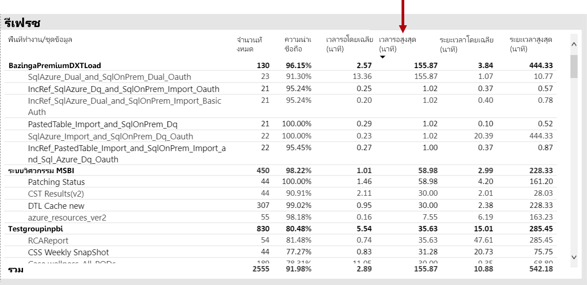

นอกจากนี้ ในวิชวล**เวลารอรีเฟรชโดยเฉลี่ยต่อชั่วโมง** พวกเขาจะสังเกตเห็นว่าเวลารอรีเฟรชสูงสุดสูงประมาณ 16.00 น. ในแต่ละวันอย่างสม่ำเสมอ

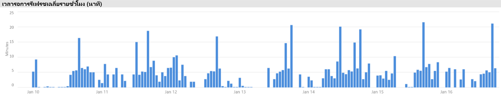

มีคำอธิบายที่เป็นไปได้มากมายสำหรับผลลัพธ์เหล่านี้:

- มีการพยายามรีเฟรชหลายครั้งเกินไปในเวลาเดียวกัน ซึ่งเกินขีดจำกัดที่โหนดความจุกำหนดไว้ (การรีเฟรชหกรายการพร้อมกันบน P1 ที่มีการปันส่วนหน่วยความจำตามค่าเริ่มต้น)

- ชุดข้อมูลที่จะรีเฟรชอาจใหญ่เกินไปที่จะพอดีกับหน่วยความจำที่มีอยู่ (ต้องใช้หน่วยความจำอย่างน้อย 2 เท่าสำหรับการรีเฟรชเต็มรูปแบบ)
- ตรรกะ Power Query ที่ไม่มีประสิทธิภาพอาจส่งผลให้อัตราการใช้งานหน่วยความจำเพิ่มขึ้นอย่างรวดเร็วทันทีทันใดในระหว่างการรีเฟรชชุดข้อมูล ในความจุที่ไม่ว่างบางครั้งอาจถึงขีดจำกัดทางกายภาพ ความล้มเหลวในการรีเฟรชและอาจส่งผลต่อการดำเนินการดูรายงานอื่น ๆ
- ชุดข้อมูลที่มีการคิวรีบ่อยครั้งที่จำเป็นต้องอยู่ในหน่วยความจำอาจส่งผลต่อความสามารถของชุดข้อมูลอื่นในการรีเฟรชเนื่องจากหน่วยความจำที่มีอยู่แบบจำกัด

ในการตรวจสอบเรื่องนี้ ผู้ดูแลระบบ Power BI สามารถค้นหา:

- หน่วยความจำเหลือน้อยในขณะที่รีเฟรชข้อมูลเมื่อหน่วยความจำที่มีอยู่มีขนาดน้อยกว่า 2 เท่าของชุดข้อมูลที่จะรีเฟรช
- ชุดข้อมูลที่ไม่ได้ถูกรีเฟรชและไม่ได้อยู่ในหน่วยความจำก่อนการรีเฟรช อย่างไรก็ตามได้เริ่มต้นแสดงปริมาณการใช้งานแบบโต้ตอบในช่วงเวลาที่มีการรีเฟรชมาก เมื่อต้องการดูชุดข้อมูลที่โหลดลงในหน่วยความจำในเวลาที่กำหนดต่าง ๆ ผู้ดูแลระบบ Power BI สามารถดูพื้นที่ชุดข้อมูลของแท็บ**ชุดข้อมูล**ในแอปและตัวกรองข้ามในเวลาที่กำหนดโดยคลิกที่แถบใดแถบหนึ่งใน**จำนวนชุดข้อมูลที่โหลดต่อชั่วโมง** อัตราการเพิ่มขึ้นอย่างรวดเร็วทันทีทันใดภายใน (แสดงในภาพด้านล่าง) ระบุหนึ่งชั่วโมงเมื่อโหลดชุดข้อมูลหลายชุดลงในหน่วยความจำ ซึ่งอาจชะลอการเริ่มต้นการรีเฟรชตามกำหนดเวลา
- การลดสัดส่วนชุดข้อมูลที่เพิ่มขึ้นโดยเกิดขึ้นเมื่อมีการกำหนดเวลาการเริ่มต้นรีเฟรชข้อมูล ซึ่งแสดงว่ามีหน่วยความจำที่ไม่เพียงพอสูงโดยมีสาเหตุจากการให้บริการรายงานเชิงโต้ตอบที่แตกต่างกันมากเกินไปก่อนช่วงเวลาของการรีเฟรช วิชวล**การลดสัดส่วนข้อมูลต่อชั่วโมงและปริมาณการใช้หน่วยความจำ** สามารถระบุอัตราการลดสัดส่วนที่เพิ่มขึ้นอย่างรวดเร็วทันทีทันใดได้อย่างชัดเจน

รูปต่อไปนี้แสดงการเพิ่มขึ้นภายในในชุดข้อมูลที่โหลด ซึ่งบ่งบอกว่าการคิวรีแบบโต้ตอบจะเริ่มต้นการรีเฟรชช้า การเลือกระยะเวลาในวิชวล**จำนวนชุดข้อมูลที่โหลดต่อชั่วโมง**จะกรองข้ามวิชวล**ขนาดของชุดข้อมูล**

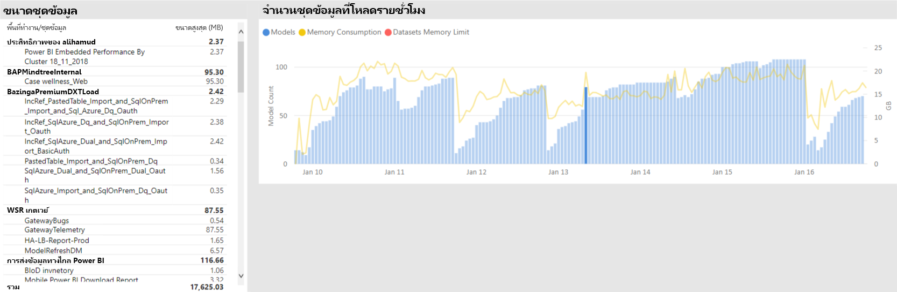

ผู้ดูแลระบบ Power BI อาจจะพยายามแก้ไขปัญหาโดยทำตามขั้นตอนเพื่อให้แน่ใจว่ามีหน่วยความจำเพียงพอสำหรับการรีเฟรชข้อมูลที่จะเริ่มต้นโดย:

- การติดต่อเจ้าของชุดข้อมูลและการขอให้พวกเขาสลับและเว้นระยะเวลาในการรีเฟรชข้อมูล
- การลดการโหลดคิวรีชุดข้อมูลโดยการลบแดชบอร์ดหรือไทล์แดชบอร์ดที่ไม่จำเป็นออก โดยเฉพาะอย่างยิ่งการบังคับใช้การรักษาความปลอดภัยระดับแถว
- การเพิ่มความเร็วในการรีเฟรชข้อมูลโดยปรับตรรกะ Power Query ให้เหมาะสม คอลัมน์หรือตารางจากการคำนวณของแบบจำลอง การลดขนาดของชุดข้อมูล หรือการกำหนดค่าชุดข้อมูลขนาดใหญขึ้น่เพื่อดำเนินการรีเฟรชข้อมูลแบบเพิ่มทีละส่วน

### การระบุชุดข้อมูลที่ตอบสนองช้า

ในสถานการณ์นี้ การตรวจสอบถูกทริกเกอร์เมื่อผู้ใช้ร้องเรียนว่ารายงานบางฉบับใช้เวลานานในการเปิด และในบางครั้งจะก็ค้าง

ในแอป ผู้ดูแลระบบ Power BI สามารถใช้วิชวล**ระยะเวลาคิวรี**เพื่อระบุชุดข้อมูลแย่ที่สุด โดยเรียงลำดับชุดข้อมูลตาม**ระยะเวลาเฉลี่ย**จากมากไปหาน้อย วิชวลนี้ยังแสดงจำนวนคิวรีของชุดข้อมูล ดังนั้นคุณสามารถดูความถี่ของการคิวรีชุดข้อมูลได้

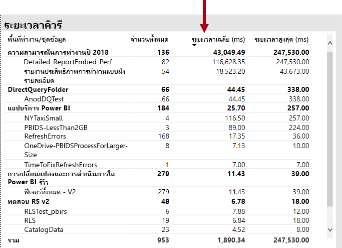

ผู้ดูแลระบบ Power BI สามารถดูวิชวล**การกระจายระยะเวลาคิวรี** ซึ่งแสดงการกระจายประสิทธิภาพคิวรีแบบจัดกลุ่มโดยภาพรวม (< = 30ms, 0-100ms และอื่น ๆ) สำหรับช่วงเวลาที่กรองแล้ว โดยทั่วไปแล้ว คิวรีที่ใช้เวลาหนึ่งวินาทีหรือน้อยกว่าจะถือเป็นการตอบสนองของผู้ใช้ส่วนใหญ่ แต่คิวรีที่ใช้เวลานานขึ้นทำให้เกิดการรับรู้ประสิทธิภาพที่ไม่ดี

วิชวล**การกระจายระยะเวลาคิวรีต่อชั่วโมง**ช่วยให้ผู้ดูแลระบบ Power BI สามารถระบุช่วงเวลาหนึ่งชั่วโมงเมื่อประสิทธิภาพการทำงานของความจุอาจถูกมองว่าไม่ดี ยิ่งกลุ่มแถบมีขนาดใหญ่ขึ้นซึ่งแสดงถึงระยะเวลาคิวรีมากกว่าหนึ่งวินาที ยิ่งมีความเสียงว่าผู้ใช้จะรับรู้ประสิทธิภาพที่แย่ลง

วิชวลเป็นแบบโต้ตอบ และเมื่อเลือกกลุ่มของแถบ วิชวลตาราง**ระยะเวลาคิวรี**ที่สอดคล้องกันบนหน้ารายงานจะถูกกรองข้ามเพื่อแสดงชุดข้อมูลที่วิชวลแสดง การกรองข้ามช่วยให้ผู้ดูแลระบบ Power BI สามารถระบุชุดข้อมูลที่ตอบสนองช้าได้อย่างง่ายดาย

รูปต่อไปนี้แสดงวิชวลที่กรองตาม**การกระจายระยะเวลาคิวรีต่อชั่วโมง** โดยเน้นชุดข้อมูลที่มีประสิทธิภาพแย่ลงในบักเก็ตหนึ่งชั่วโมง 

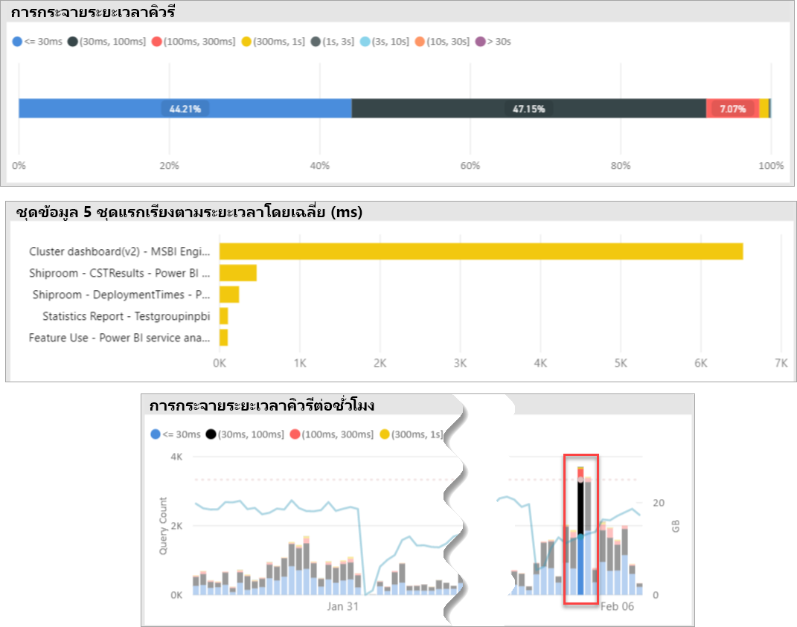

เมื่อระบุชุดข้อมูลที่มีประสิทธิภาพไม่ดีในช่วงเวลา 1 ชั่วโมงแล้ว ผู้ดูแลระบบ Power BI สามารถตรวจสอบว่าประสิทธิภาพที่ไม่ดีนั้นเกิดจากความจุที่โหลดมากเกินไป หรือเนื่องจากชุดข้อมูลหรือรายงานที่ออกแบบมาไม่ดี เพื่อให้บรรลุเป้าหมายนี้ พวกเขาสามารถดูวิชวล**เวลารอคิวรี** และเรียงลำดับชุดข้อมูลเรียงลำดับตามเวลารอคิวรีโดยเฉลี่ยจากมากไปหาน้อยได้ ถ้าเปอร์เซ็นต์ของคิวรีที่กำลังรอสูง ความต้องการสำหรับชุดข้อมูลสูงอาจเป็นสาเหตุของการรอคิวรีมากมาย ถ้าเวลารอคิวรีโดยเฉลี่ยเป็นจริง (> 100ms), อาจคุ้มค่าที่จะตรวจทานชุดข้อมูลและรายงานเพื่อดูว่าสามารถปรับให้เหมาะสมได้หรือไม่ ตัวอย่างเช่น อาจมีวิชวลน้อยลงในหน้ารายงานที่กำหนดหรือการปรับนิพจน์ DAX ให้เหมาะสม

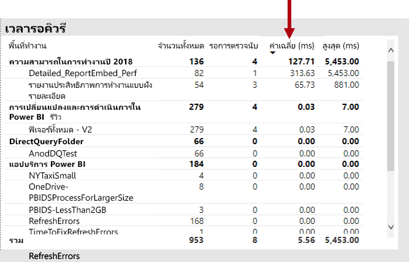

มีสาเหตุที่เป็นไปได้หลายประการสำหรับเวลารอคิวรีที่สร้างขึ้นในชุดข้อมูล:

- การออกแบบแบบจำลองที่ไม่เหมาะสม นิพจน์หน่วยวัด หรือแม้แต่การออกแบบรายงาน - สถานการณ์ทั้งหมดที่สามารถนำไปสู่การคิวรีที่ใช้เวลานานซึ่งใช้ CPU ระดับสูง ซึ่งบังคับให้คิวรีใหม่ต้องรอจนกว่าเธรด CPU จะพร้อมใช้งานและสามารถสร้างเอฟเฟ็กต์การป้องกัน (เหมือนกับการจราจรติดขัด) ซึ่งมักพบได้ในช่วงเวลาทำการสูงสุด หน้า**การรอคิวรี**จะเป็นทรัพยากรหลักที่จะตรวจสอบว่าชุดข้อมูลมีเวลารอคิวรีโดยเฉลี่ยสูงหรือไม่
- จำนวนผู้ใช้งานความจุพร้อมกันสูง (หลายร้อยถึงหลายพัน) ซึ่งใช้รายงานหรือชุดข้อมูลเดียวกัน แม้แต่ชุดข้อมูลที่ออกแบบมาอย่างดีก็อาจทำงานได้ไม่ดีหากเกินค่าเกณฑ์กระบวนการการทำงานพร้อมกัน ซึ่งมักจะถูกระบุด้วยชุดข้อมูลเดียว ซึ่งแสดงค่าที่สูงขึ้นอย่างรวดเร็วสำหรับจำนวนคิวรีมากกว่าที่ชุดข้อมูลอื่น ๆ แสดง (เช่น 300K คิวรีสำหรับชุดข้อมูลหนึ่งชุดเปรียบเทียบกับ <30K คิวรีสำหรับชุดข้อมูลอื่นทั้งหมด) ในบางจุดที่การรอคิวรีสำหรับชุดข้อมูลนี้จะเริ่มจัดสลับ และจะเห็นได้ในวิชวล**ระยะเวลาคิวรี**
- ชุดข้อมูลที่แตกต่างกันจำนวนมากที่คิวรีพร้อมกันทำให้เกิดการแธรชชิ่งเนื่องจากชุดข้อมูลมักจะวนเข้าและออกจากหน่วยความจำ ซึ่งส่งผลให้ผู้ใช้ประสบปัญหาประสิทธิภาพการทำงานช้าเมื่อโหลดชุดข้อมูลลงในหน่วยความจำ เมื่อต้องยืนยัน ผู้ดูแลระบบ Power BI สามารถอ้างอิงไปยังวิชวล**การลดสัดส่วนชุดข้อมูลต่อชั่วโมงและปริมาณการใช้หน่วยความจำ** ซึ่งอาจบ่งบอกว่าชุดข้อมูลจำนวนมากที่โหลดเข้าสู่หน่วยความจำนั้นถูกสัดส่วนซ้ำ ๆ

### การระบุสาเหตุสำหรับชุดข้อมูลที่ตอบสนองช้าเป็นระยะ ๆ

ในสถานการณ์นี้ การตรวจสอบจะถูกทริกเกอร์เมื่อผู้ใช้อธิบายว่าบางครั้งวิชวลรายงานตอบสนองช้าหรืออาจไม่ตอบสนอง แต่ในช่วงเวลอื่น การตอบสนองเป็นที่ยอมรับได้้

ภายในแอป ส่วน**ระยะเวลาคิวรี**ถูกนำมาใช้เพื่อค้นหาชุดข้อมูลที่เป็นสาเหตุในวิธีต่อไปนี้:

- ในวิชวล**ระยะเวลาคิวรี** ผู้ดูแลระบบจะกรองชุดข้อมูลโดยชุดข้อมูล (เริ่มต้นจากชุดข้อมูลด้านบนที่คิวรีแล้ว) และตรวจสอบแถบที่กรองข้ามในวิชวล**การกระจายคิวรีต่อชั่วโมง**
- เมื่อแถบเวลาหนึ่งชั่วโมงแถบเดียวที่แสดงการเปลี่ยนแปลงที่สำคัญในอัตราส่วนระหว่างกลุ่มระยะเวลาการคิวรีทั้งหมดกับแถบหนึ่งชั่วโมงแถบอื่นสำหรับชุดข้อมูลนั้น (นั่นคืออัตราส่วนระหว่างสีที่เปลี่ยนไปอย่างมาก) ซึ่งหมายถึงชุดข้อมูลนี้แสดงการเปลี่ยนแปลงด้านประสิทธิภาพเป็นระยะ ๆ
- แถบเวลาหนึ่งชั่วโมง ซึ่งแสดงส่วนของคิวรีที่มีประสิทธิภาพต่ำผิดปกติซึ่งระบุช่วงเวลาที่ชุดข้อมูลนั้นได้รับผลกระทบจากเอฟเฟ็กต์ Noisy Neighbor ซึ่งเกิดจากกิจกรรมของชุดข้อมูลอื่น

ภาพด้านล่างแสดงระยะเวลาหนึ่งชั่วโมงในวันที่ 30 มกราคม ซึ่งเกิดความล้มเหลวอย่างมีนัยสำคัญในประสิทธิภาพของชุดข้อมูลที่ระบุโดยขนาดของบักเก็ตระยะเวลาการเรียกใช้งาน "(3,10s)" การคลิกที่แถบหนึ่งชั่วโมงจะแสดงชุดข้อมูลทั้งหมดที่โหลดเข้าสู่หน่วยความจำในช่วงเวลานั้น ซึ่งจะเป็นการตัดชุดข้อมูลรุ่นทดสอบที่เป็นสาเหตุของปัญหาที่ทำให้เกิดเอฟเฟ็กต์ Noisy Neighbor

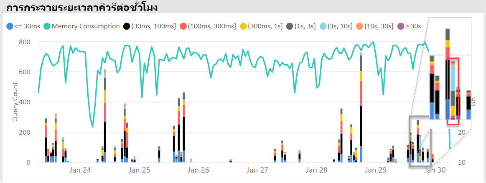

เมื่อระบุช่วงเวลาที่มีปัญหา (เช่น ระหว่างวันที่ 30 มกราคมในภาพด้านบน) ผู้ดูแลระบบ Power BI สามารถลบตัวกรองชุดข้อมูลทั้งหมดแล้วกรองเฉพาะช่วงเวลานั้นเพื่อพิจารณาว่าชุดข้อมูลใดจะถูกคิวรีอย่างแข็งขันในช่วงเวลานี้ ชุดข้อมูลที่เป็นสาเหตุสำหรับเอฟเฟ็กต์ Noisy Neighbor มักจะเป็นชุดข้อมูลที่ถูกคีวรีสูงสุดหรือชุดข้อมูลที่มีระยะเวลาการคิวรีโดยเฉลี่ยนานที่สุด

วิธีการแก้ไขปัญหานี้อาจเป็นการกระจายชุดข้อมูลที่เป็นสาเหตุผ่านพื้นที่ทำงานที่แตกต่างกันในความจุแบบพรีเมียมที่แตกต่างกัน หรือในความจุที่ใช้ร่วมกันถ้าขนาดของชุดข้อมูล ข้อกำหนดการใช้งาน และรูปแบบการรีเฟรชข้อมูลได้รับการสนับสนุน

การย้อนกลับอาจเป็นจริงเช่นกัน ผู้ดูแลระบบ Power BI สามารถระบุเวลาที่ประสิทธิภาพการคิวรีของชุดข้อมูลดีขึ้นเป็นอย่างมากแล้วมองหาสิ่งที่หายไป ถ้าข้อมูลบางอย่างหายไปที่จุดนั้น อาจเป็นการช่วยบ่งชี้ปัญหาที่เกิดขึ้น

### การตรวจสอบว่ามีหน่วยความจำเพียงพอหรือไม่

เมื่อต้องการตรวจสอบว่าหน่วยความจำมีเพียงพอสำหรับที่จะรองรับความจุของปริมาณงานหรือไม่ ผู้ดูแลระบบ Power BI สามารถดูที่วิชวล**เปอร์เซ็นต์หน่วยความจำที่ใช้แล้ว**ในแท็บ**ชุดข้อมูล**ของแอปได้ หน่วยความ**ทั้งหมด** (รวม) แสดงหน่วยความจำที่ใช้โดยชุดข้อมูลที่โหลดลงในหน่วยความจำ โดยไม่คำนึงถึงว่าชุดข้อมูลเหล่านี้ถูกคิวรีหรือประมวลผลอย่างแข็งขันหรือไม่ หน่วยความจำ**ที่ใช้งานอยู่**แสดงหน่วยความจำที่ใช้โดยชุดข้อมูลที่กำลังถูกประมวลผลอย่างแข็งขัน

ในความจุที่สภาพพร้อมใช้งาน ภาพจะมีลักษณะดังนี้ แสดงช่องว่างระหว่างหน่วยความจำทั้งหมด (รวม) และหน่วยความจำที่ใช้งานอยู่:

ในความจุที่หน่วยความจำไม่เพียงพอ วิชวลเดียวกันจะแสดงการบรรจบกันของหน่วยความจำที่ใช้งานอยู่และหน่วยความจำทั้งหมดอย่างชัดเจน ซึ่งหมายความว่าคุณจะไม่สามารถโหลดชุดข้อมูลเพิ่มเติมลงในหน่วยความจำในช่วงเวลานั้น ในกรณีนี้ ผู้ดูแลระบบ Power BI สามารถคลิก**รีสตาร์ทความจุ** (ใน**ตัวเลือกขั้นสูง**ของพื้นที่การตั้งค่าความจุของพอร์ทัลผู้ดูแลระบบ) ได้ การรีสตาร์ทความจุจะส่งผลให้ชุดข้อมูลทั้งหมดถูกล้างออกจากหน่วยความจำและอนุญาตให้โหลดซ้ำลงในหน่วยความจำได้ตามต้องการ (โดยการคิวรีหรือการรีเฟรชข้อมูล)

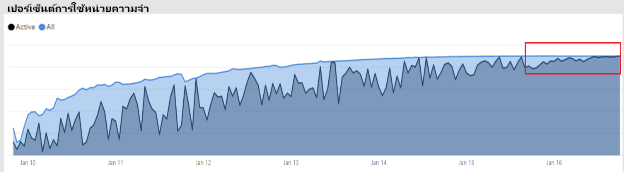

### การตรวจสอบว่ามี CPU เพียงพอหรือไม่

โดยทั่วไป การใช้งาน CPU โดยเฉลี่ยของความจุควรต่ำกว่า 80% การใช้งานเกินค่านี้หมายความว่าความจุกำลังใกล้ถึงความอิ่มตัวของ CPU

ผลกระทบจากความอิ่มตัวของ CPU จะเห็นได้จากการทำงานที่ใช้เวลานานกว่าที่ควรจะเป็นเนื่องจากความจุที่ใช้บริบทของ CPU จำนวนมากจะสลับขณะที่พยายามประมวลผลการทำงานทั้งหมด ในความจุแบบพรีเมียมที่มีจำนวนคิวรีที่เกิดขึ้นพร้อมกันสูง นั่นหมายถึงเวลารอคิวรีสูง ผลที่ตามมาจากเวลารอคิวรีสูงคือการตอบสนองช้าลงกว่าปกติ ผู้ดูแลระบบ Power BI สามารถระบุได้อย่างง่ายดายเมื่อ CPU มีความอิ่มตัวแล้วโดยดูที่วิชวล**การกระจายเวลารอคิวรีต่อชั่วโมง**้ จำนวนเวลารอคิวรีที่ถึงระดับสูงสุดเป็นระยะ ๆ แสดงถึงความอิ่มตัวของ CPU ที่อาจเกิดขึ้น

ในบางครั้งสามารถตรวจหารูปแบบที่คล้ายกันได้ในการทำงานแบบเบื้องหลังหากการทำงานเหล่านั้นมีส่วนทำให้เกิดความอิ่มต้วของ CPU ผู้ดูแลระบบ Power BI สามารถค้นหาอัตราการเพิ่มขึ้นอย่างรวดเร็วทันทีทันใดเป็นระยะ ๆ ในช่วงเวลาการรีเฟรชสำหรับชุดข้อมูลเฉพาะ ซึ่งสามารถระบุความอิ่มตัวของ CPU ในเวลานั้น (อาจเป็นเพราะชุดข้อมูลอื่น ๆ ที่กำลังดำเนินการรีเฟรช และ/หรือคิวรีแบบโต้ตอบ) ในอินสแตนซ์นี้ การอ้างอิงไปยังมุมมอง**ระบบ**ในแอปอาจไม่จำเป็นต้องแสดงว่า CPU อยู่ในระดับ 100% มุมมอง**ระบบ**แสดงค่าเฉลี่ยต่อชั่วโมง แต่ CPU อาจจะอิ่มตัวเป็นเวลาหลายนาทีจากการทำงานหนัก ซึ่งแสดงเป็นอัตราเวลารอที่เพิ่มขึ้นอย่างรวดเร็วทันทีทันใด

มีรายละเอียดปลีกย่อยเพิ่มเติมในการดูผลกระทบจากความอิ่มตัวของ CPU ในขณะที่จำนวนคิวรีที่รอเป็นสิ่งสำคัญ แต่เวลารอคิวรีจะเกิดขึ้นในระดับหนึ่งเสมอโดยไม่ทำให้ประสิทธิภาพการทำงานลดลง ชุดข้อมูลบางชุด (ที่มีเวลาคิวรีโดยเฉลี่ยที่ยาวกว่า แสดงถึงความซับซ้อนหรือขนาด) มีแนวโน้มที่จะทำให้เกิดความอิ่มตัวของ CPU มากกว่าชุดอื่น หากต้องการระบุชุดข้อมูลเหล่านี้ได้อย่างง่ายดาย ผู้ดูแลระบบ Power BI สามารถดูการเปลี่ยนแปลงในส่วนประกอบสีของแถบในวิชวล**การกระจายเวลารอต่อชั่วโมง** หลังจากตรวจพบแถบค่าผิดปกติ ผู้ดูแลระบบสามารถค้นหาชุดข้อมูลที่มีการรอคิวรีอยู่ในช่วงเวลานั้น และดูเวลารอคิวรีโดยฉลี่ยโดยเปรียบเทียบกับระยะเวลาคิวรีโดยเฉลี่ย ทเมื่อทั้งสองเมตริกมีขนาดเท่ากันและปริมาณงานของคิวรีสำหรับชุดข้อมูลนั้นมีความสำคัญ อาจเป็นไปได้ว่าชุดข้อมูลนั้นได้รับผลกระทบจาก CPU ไม่เพียงพอ

ผลกระทบนี้สามารถเห็นได้ชัดโดยเฉพาะอย่างยิ่งเมื่อชุดข้อมูลถูกใช้งานในช่วงการส่งชุดข้อมูลสั้น ๆ จากการคิวรีที่มีความถี่สูงโดยผู้ใช้หลายคน (เช่น ในช่วงการฝึกอบรม) ซึ่งส่งผลให้เกิดความอิ่มตัวของ CPU ในแต่ละครั้ง ในกรณีนี้ เวลารอคิวรีที่สำคัญในชุดข้อมูลนี้อาจได้รับผลกระทบ รวมถึงมีผลกระทบต่อชุดข้อมูลอื่น ๆ ในความจุ (เอฟเฟ็กต์ Noisy Neighbor)

ในบางกรณี ผู้ดูแลระบบ Power BI สามารถขอให้เจ้าของชุดข้อมูลสร้างปริมาณงานของคิวรีที่มีความผันผวนน้อยลงโดยการสร้างแดชบอร์ด (ซึ่งจะทำการคิวรีเป็นระยะ ๆ กับการรีเฟรชชุดข้อมูลใด ๆ สำหรับไทล์ที่แคช) แทนรายงาน ซึ่งสามารถช่วยป้องกันอัตราการเพิ่มขึ้นอย่างรวดเร็วทันทีทันใดเมื่อโหลดแดชบอร์ด โซลูชันนี้อาจไม่สามารถทำได้สำหรับความต้องการทางธุรกิจที่กำหนดไว้ อย่างไรก็ตามอาจเป็นวิธีที่มีประสิทธิภาพในการหลีกเลี่ยงความอิ่มตัวของ CPU โดยไม่มีการเปลี่ยนแปลงชุดข้อมูล

## บทสรุป

Power BI Premium มีประสิทธิภาพการทำงานที่สอดคล้องกันมากขึ้น การสนับสนุนสำหรับปริมาณข้อมูลขนาดใหญ่ และความยืดหยุ่นของการบริการตนเองแบบรวมและแพลตฟอร์ม BI ขององค์กรสำหรับทุกคนในองค์กรของคุณ เอกสารทางเทคนิคระดับ 300 ฉบับนี้เขียนขึ้นเป็นพิเศษเฉพาะสำหรับผู้ดูแลระบบ Power BI และผู้เขียนเนื้อหา และผู้เผยแพร่ เอกสารฉบับนี้มีวัตถุประสงค์เพื่อช่วยให้บุคคลเหล่านี้เข้าใจศักยภาพของ Power BI Premium และเรียนรู้วิธีการออกแบบ ปรับใช้ ตรวจสอบ และแก้ไขปัญหาโซลูชันที่ปรับขนาดได้

ในการปรับใช้และจัดการความจุ Power BI Premium ผู้ดูแลระบบและผู้พัฒนาแบบจำลองจะต้องมีความเข้าใจที่ดีเกี่ยวกับความสามารถในการทำงานของความจุ วิธีการจัดการและตรวจสอบ และวิธีการปรับแบบจำลองให้เหมาะสมเพื่อตอบสนองต่อปัญหาด้านประสิทธิภาพและปัญหาคอขวดที่เกิดขึ้น

## บันทึกย่อสิ้นสุด

\[1\]เอกสารทางเทคนิคนี้เกี่ยวข้องกับ Power BI Premium ซึ่งรองรับโดยบริการคลาวด์ Power BI เท่านั้น ดังนั้นเซิร์ฟเวอร์ Power BI Report จึงไม่อยู่ในขอบเขต ยกเว้นระบุว่ามีใบอนุญาตที่จำเป็นในการติดตั้งเซิร์ฟเวอร์ Power BI Report ที่มาพร้อมกับPower BI Premium SKUs บางตัว

\[2\]Power BI เป็นบริการคลาวด์เมื่อใช้เพื่อฝังเนื้อหาในนามของผู้ใช้แอปพลิเคชันคือ Platform-as-a-Service (PaaS) การฝังแบบนี้สามารถทำได้ด้วยสองผลิตภัณฑ์ที่แตกต่างกัน ซึ่งหนึ่งในนั้นคือ Power BI Premium

\[3\]ชุดข้อมูลแบบพุช แบบสตรีมมิ่ง และแบบไฮบริดจะไม่ถูกจัดเก็บในความจุแบบพรีเมียม ดังนั้นจึงไม่ใช่ข้อควรพิจารณาเมื่อปรับใช้ จัดการ และตรวจสอบความจุแบบพรีเมียม

\[4\] เวิร์กบุ๊ก Excel เป็นชนิดเนื้อหา Power BI จะไม่ถูกจัดเก็บในความจุแบบพรีเมียม ดังนั้นจึงไม่ใช่ข้อควรพิจารณาเมื่อปรับใช้ จัดการ และตรวจสอบความจุแบบพรีเมียม

\[5\] วิชวลสามารถกำหนดค่าให้ละเว้นการโต้ตอบกับตัวแบ่งส่วนข้อมูลได้ สำหรับข้อมูลเพิ่มเติม ดูที่เอกสาร [การโต้ตอบการแสดงภาพในรายงาน Power BI](service-reports-visual-interactions.md)

\[6\] ความแตกต่างในขนาดสามารถกำหนดได้โดยการเปรียบเทียบขนาดไฟล์ Power BI Desktop กับหน่วยความจำตัวจัดการงานที่ใช้สำหรับไฟล์ได้

\[7\] การสนับสนุนสำหรับแหล่งข้อมูลของ Microsoft ได้แก่ SQL Server, Azure Data Bricks, Azure HDInsight Spark (Beta), Azure SQL Database และ Azure SQL Data Warehouse สำหรับข้อมูลเกี่ยวกับแหล่งข้อมูลเพิ่มเติม โปรดดูที่เอกสาร [แหล่งข้อมูลที่ได้รับการสนับสนุนโดย Direct Query ใน Power BI](desktop-directquery-data-sources.md)

\[8\] Power BI Premium รองรับการอัปโหลดไฟล์ Power BI Desktop (.pbix) ขนาดสูงสุด 10 GB เมื่ออัปโหลดแล้ว ชุดข้อมูลสามารถขยายได้สูงสุดถึง 12 GB ขนาดเนื่องจากการรีเฟรช ขนาดการอัปโหลดสูงสุดแตกต่างกันไปตาม SKU สำหรับข้อมูลเพิ่มเติม ดูที่เอกสาร [การสนับสนุนของ Power BI Premium สำหรับชุดข้อมูลขนาดใหญ่](service-premium-large-datasets.md)

\[9\] SKU ที่มีน้อยกว่าสี่วี-คอร์ไม่ได้ทำงานบนโครงสร้างพื้นฐานเฉพาะ ซึ่งรวมถึง EM1, EM2, A1 และ A2 SKUs

\[10\] กรณีที่ไม่ค่อยเกิดขึ้น แบบจำลองอาจถูกยกเลิกการโหลดจากหน่วยความจำเนื่องจากการดำเนินการบริการ

\[11\] การกำหนดเวลาเหล่านี้อาจเปลี่ยนแปลงได้ตลอดเวลา

\[12\] ดูที่ตัวอย่างในหลายภูมิภาค เหตุผลสำหรับการปรับใช้ในหลายภูมิศาสตร์นั้น โดยทั่วไปแล้วสำหรับการปฏิบัติตามกฎระเบียบขององค์กรหรือรัฐบาลมากกว่าประสิทธิภาพและขนาด การโหลดรายงานและแดชบอร์ดยังเกี่ยวข้องกับคำขอในภูมิภาคหลักสำหรับเมตาดาต้า สำหรับข้อมูลเพิ่มเติม ดูที่เอกสาร [การสนับสนุนในหลายภูมิภาคของ Power BI Premium (ตัวอย่าง)](service-admin-premium-multi-geo.md)

\[13\] อาจเป็นไปได้ที่ผู้ใช้สามารถทำให้เกิดปัญหาประสิทธิภาพการทำงานโดยการโหลดบริการ Power BI ด้วยงานจำนวนมากเกินไป เขียนคิวรี่ที่ซับซ้อนมากเกินไป สร้างการอ้างอิงแบบวงกลมและอื่น ๆ

\[14\] ไม่แนะนำให้ใช้ตัวเลือกในการกำหนดพื้นที่ทำงานทั้งหมดขององค์กร และต้องการวิธีการที่ตรงเป้าหมายยิ่งขึ้น โดยทั่วไป ไม่ควรใช้พื้นที่ทำงานส่วนบุคคลสำหรับเนื้อหาการผลิต

\[15\] อาจเป็นไปได้ที่จะตรวจสอบ SKU ในแอปหรือในพอร์ทัล Azure แต่ไม่อยู่ใน Power BI Admin Portal ในการตรวจสอบ A SKUs การรีเฟรชรายงานจะล้มเหลวหากไม่ได้เพิ่มแอปลงในบทบาทผู้อ่านของทรัพยากร สำหรับข้อมูลล่าสุด ดูที่เอกสาร[ ตรวจสอบความจุของ Power BI Premium และ Power BI Embedded](service-admin-premium-monitor-capacity.md)

\[16\] การรีเฟรชสามารถรอได้เมื่อ CPU หรือหน่วยความจำไม่เพียงพอที่จะเริ่ม

\[17\] ขนาดชุดข้อมูลในหน่วยความจำสามารถใหญ่กว่าขนาดของดิสก์ได้มากถึง 20%

\[18\] การใช้หน่วยความจำเฉลี่ย (GB) และปริมาณการใช้หน่วยความจำสูงสุด (GB)

\[19\] การลดสัดส่วนชุดข้อมูล

\[20\] คิวรีชุดข้อมูล, ระยะเวลาการคิวรีโดยเฉลี่ยของชุดข้อมูล (มิลลิวินาที), จำนวนชุดข้อมูล และเวลารอของชุดข้อมูลโดยเฉลี่ย (มิลลิวินาที)

\[21\] จำนวนการใช้งาน CPU สูง และเวลาในการใช้งาน CPU สูงสุด (เจ็ดวันที่ผ่านมา)

\[22\] จำนวนการใช้งาน DQ/LC สูง และเวลาในการใช้งาน DQ/LC สูงสุด (เจ็ดวันที่ผ่านมา)