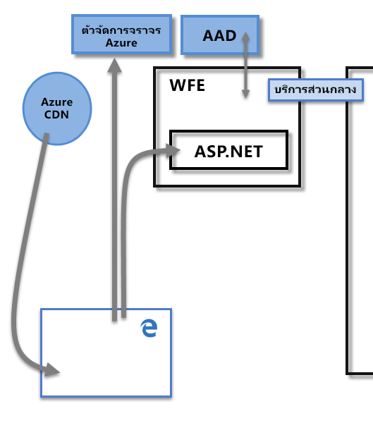
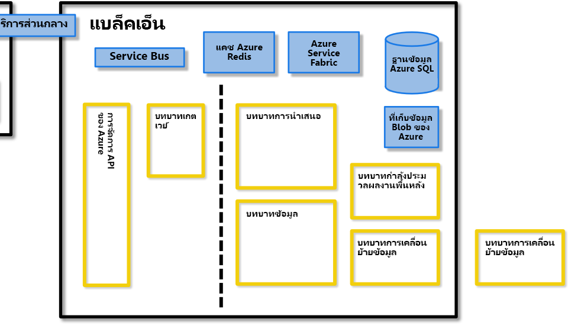
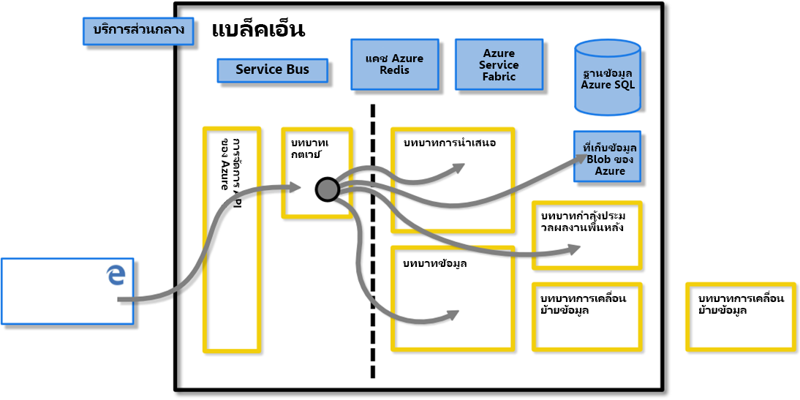
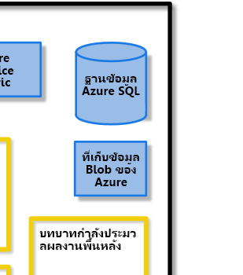
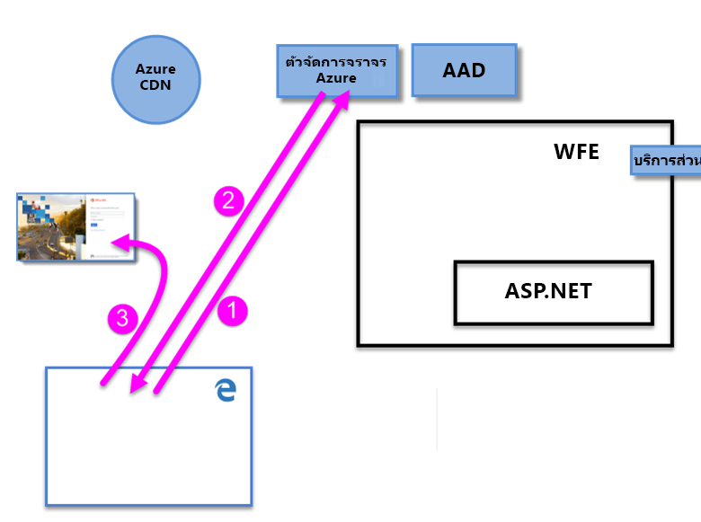
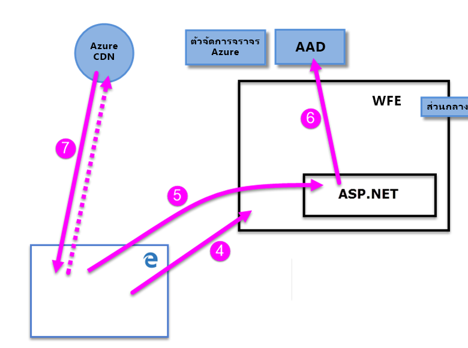
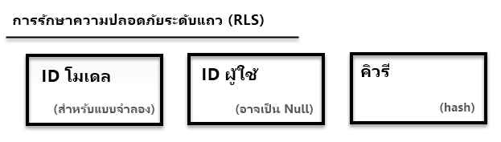

# เอกสารทางเทคนิคเรื่องความปลอดภัยของPower BI

**ข้อมูลสรุป:** Power BI คือบริการซอฟต์แวร์ออนไลน์ (*SaaS*หรือซอฟต์แวร์ในฐานะบริการ) จาก Microsoft ที่ช่วยให้คุณสามารถสร้างแดชบอร์ดข่าวกรองธุรกิจแบบบริการตนเองรายงานชุดข้อมูลและการแสดงภาพได้อย่างรวดเร็ว ด้วย Power BI คุณสามารถเชื่อมต่อกับแหล่งข้อมูลที่หลากหลาย รวบรวมและจัดรูปแบบข้อมูลจากการเชื่อมต่อนั้นๆ จากนั้นก็สร้างรายงานและแดชบอร์ดที่สามารถใช้ร่วมกับผู้อื่นได้

ผู้**เขียน:** เดวิดชอบๆ

ผู้ตรวจ**ทานด้านเทคนิค:** Pedram Rezaei, Cristian Petculescu, ศิ Harinath, Tod แมน, Haydn ริชาร์ดสัน, อดัมวิลสัน, เบ็นมาจอร์ก้า, โรเบิร์ต Bruckner, Sergei Gundorov, Kasper de Jonge

**นำไปใช้กับ:** Power BI SaaS, Power BI Desktop, Power BI Embedded, Power BI Premium

> [!NOTE]
> คุณสามารถบันทึกหรือพิมพ์เอกสารทางเทคนิคนี้ โดยการเลือก**พิมพ์**จากเบราว์เซอร์ของคุณแล้วเลือก**บันทึกเป็น PDF**ได้

## บทนำ

**Power BI**คือบริการซอฟต์แวร์ออนไลน์ (_SaaS_หรือซอฟต์แวร์ตามที่ให้บริการ) ที่เปิดให้บริการจาก Microsoft ที่ช่วยให้คุณสร้างแดชบอร์ดข่าวกรองธุรกิจ รายงาน ชุดข้อมูล และการแสดงภาพแบบบริการตนเอง ด้วย Power BI คุณสามารถเชื่อมต่อกับแหล่งข้อมูลที่หลากหลาย รวบรวมและจัดรูปแบบข้อมูลจากการเชื่อมต่อนั้นๆ จากนั้นก็สร้างรายงานและแดชบอร์ดที่สามารถใช้ร่วมกับผู้อื่นได้

บริการ Power BI ถูกควบคุมโดย[เงื่อนไขบริการออนไลน์ของ Microsoft ](https://www.microsoftvolumelicensing.com/DocumentSearch.aspx?Mode=3&amp;DocumentTypeId=31)และ[คำชี้แจ้งสิทธิส่วนบุคคลขององค์ของ Microsoft](https://www.microsoft.com/privacystatement/OnlineServices/Default.aspx) สำหรับตำแหน่งที่ตั้งของการประมวลผลข้อมูล โปรดอ้างอิงเงื่อนไขตำแหน่งที่ตั้งของข้อมูลในเงื่อนไขบริการออนไลน์ของ Microsoft สำหรับข้อมูลการปฏิบัติตามกฎระเบียบ [ศูนย์ความเชื่อถือของ Microsoft](https://www.microsoft.com/trustcenter)เป็นทรัพยากรหลักสำหรับ Power BI ทีมงาน Power BI จะทำงานอย่างหนักเพื่อให้ลูกค้าได้เข้าถึงนวัตกรรมและการปรับปรุงประสิทธิภาพการทำงานล่าสุด Power BI อยู่ในระดับ D ของโครงสร้างการ[ปฏิบัติตามกฎระเบียบของ Office ๓๖๕](https://go.microsoft.com/fwlink/p/?LinkID=618494)

บทความนี้อธิบายความปลอดภัย Power BI โดยให้คำอธิบายของสถาปัตยกรรมPower BI นั้นอธิบายว่าผู้ใช้รับรองความถูกต้อง Power BI และข้อมูลการเชื่อมต่อถูกสร้างขึ้น และอธิบายวิธีที่ Power BI จัดเก็บ และย้ายข้อมูลผ่านทาง service แล้ว ส่วนสุดท้ายมุ่งเน้นการคำถามเกี่ยวกับความปลอดภัย ด้วยคำตอบที่ระบุไว้สำหรับแต่ละรายการ

## สถาปัตยกรรมของ Power BI

**Power BI** service ถูกสร้างบน**Azure**ซึ่งเป็นโครงสร้างพื้นฐานและแพลตฟอร์มการประมวลผลของ[Microsoft cloud](https://azure.microsoft.com/overview/what-is-azure/) ในขณะนี้มีการปรับใช้ power BI ในศูนย์ข้อมูลมากมายทั่วโลก – มีการปรับใช้ที่ใช้งานอยู่มากมายที่พร้อมใช้งานสำหรับลูกค้าในภูมิภาคที่ใช้ โดยศูนย์ข้อมูลเหล่านั้น และจำนวนของการปรับใช้แบบ passiveที่เท่ากันซึ่งทำหน้าที่เป็นข้อมูลสำรองสำหรับการปรับใช้ที่ใช้งานอยู่แต่ละครั้ง

การใช้งาน Power BI แต่ละรายการประกอบด้วยคลัสเตอร์สองตัว คลัสเตอร์ Web Front End (**WFE**) และคลัสเตอร์**Back End** คลัสเตอร์สองเหล่านี้จะแสดงในรูปต่อไปนี้ และให้พื้นหลังสำหรับส่วนเหลือของบทความนี้ 

Power BI ใช้ Azure Active Directory (**AAD**) สำหรับการรับรองความถูกต้องของบัญชีผู้ใช้และการจัดการ Power BI ยังใช้**Azure Traffic Manager** (ATM) โดยตรงกับปริมาณการใช้งานของผู้ใช้ที่ใกล้ที่สุดกับศูนย์ข้อมูล โดยขึ้นอยู่กับการบันทึก DNS ของไคลเอ็นต์ที่พยายามเชื่อมต่อกับกระบวนการรับรองตัวตนและเมื่อต้องดาวน์โหลดเนื้อหาแบบคงที่หรือไฟล์ Power BI ใช้ WFE เชิงภูมิศาสตร์ที่ใกล้ที่สุดเพื่อกระจายเนื้อหาแบบคงที่ที่จำเป็น และไฟล์ไปยังผู้ใช้อย่างมีประสิทธิภาพ ยกเว้นวิชวลแบบกำหนดเองที่ถูกส่งโดยการใช้**Azure Content Delivery Network (CDN)**

### The WFE Cluster

คลัสเตอร์**WFE**จัดการกระบวนการเชื่อมต่อและรับรองตัวตนเริ่มต้นสำหรับ Power BI โดยใช้ AAD ในการรับรองตัวตนของไคลเอ็นต์ และใส่โทเค็นสำหรับไคลเอ็นต์ถัดๆไป ซึ่งเชื่อมต่อ Power BI service.

เมื่อผู้ใช้พยายามเชื่อมต่อกับบริการ Power BI บริการ DNS ของไคลเอ็นต์อาจสื่อสารกับ**Azure Traffic Manager**เพื่อค้นหาศูนย์ข้อมูลที่ใกล้ที่สุดเกี่ยวกับการปรับใช้ Power BI ได้ สำหรับข้อมูลเพิ่มเติมเกี่ยวกับกระบวนการนี้ ดู[ประสิทธิภาพก็รับส่งข้อมูลวิธีการกำหนดเส้นทางสำหรับ Azure Traffic Manager](https://azure.microsoft.com/documentation/articles/traffic-manager-routing-methods/#performance-traffic-routing-method)

คลัสเตอร์ WFE ใกล้กับมากผู้ใช้จัดการลำดับเข้าสู่ระบบและการรับรองความถูกต้อง (อธิบายไว้ในบทความนี้), และมีโทเค็น AAD ผู้ใช้เมื่อมีการรับรองความถูกต้องจะเสร็จสมบูรณ์ คอมโพเนนต์ ASP.NET ภายในคลัสเตอร์ WFE วิเคราะห์คำขอเพื่อกำหนดองค์กรที่ผู้ใช้เป็นสมาชิก แล้ว ปรึกษา Power BI **Global Service** บริการส่วนกลางเป็นตาราง Azure เดียวที่ใช้ร่วมกันในคลัสเตอร์ WFE และ Back-End ทั่วโลกทั้งหมดที่แมปผู้ใช้และองค์กรลูกค้ากับศูนย์ข้อมูลที่เป็นที่ตั้งของผู้เช่า Power BI WFE ระบุไปยังเบราว์เซอร์ใดคลัสเตอร์ Back-End ที่บ้านผู้เช่าขององค์กร เมื่อผู้ใช้ผ่านการรับรองความถูกต้อง การโต้ตอบกับลูกค้าอื่น ๆ ที่ตามมาเกิดขึ้นกับคลัสเตอร์ Back-End โดยตรง ซึ่งไม่ต้องการ WFE เป็นตัวกลางสำหรับคำขอเหล่านั้น

### คลัสเตอร์ Power BI Back-End

คลัสเตอร์**Back End**คือวิธีการที่ไคลเอนต์การรับรองตัวตนแล้วโต้ตอบกับ Power BI service คลัสเตอร์**Back End**จัดการการแสดงภาพ แดชบอร์ดผู้ใช้ ชุดข้อมูล รายงาน ที่เก็บข้อมูล การเชื่อมต่อข้อมูล การรีเฟรชข้อมูล และลักษณะอื่น ๆ ของโต้ตอบกับบริการ Power BI

**บทบาทเกตเวย์**ทำหน้าที่เป็นเกตเวย์ระหว่างผู้ใช้ที่ร้องขอและ Power BI service ผู้ใช้ไม่โต้ตอบโดยตรงกับบทบาทใดๆ นอกเหนือจากบทบาทเกตเวย์

**สิ่งสำคัญ:** ซึ่งเป็นสิ่งจำเป็นที่จะต้องทราบว่าบทบาทเฉพาะของ Azure API Management (**APIM**) และ Gateway (**GW**)_เท่านั้น_ที่สามารถเข้าถึงได้ผ่านทางอินเทอร์เน็ตสาธารณะ พวกเขาให้รับรองตัวตน การอนุญาต DDoS protection Throttling ปรับสมดุลการโหลด กำหนดเส้นทาง และความสามารถอื่น ๆ

เส้นไข่ปลาในรูปภาพคลัสเตอร์ **Back-End** ข้างต้น ชี้ให้เห็นขอบระหว่างสองส่วนที่สามารถเข้าถึงได้โดยผู้ใช้ (ทางด้านซ้ายของเส้นไข่ปลา) และบทบาทจะสามารถเข้าถึงได้โดยระบบเท่านั้น เมื่อผู้ใช้ที่รับรองความถูกต้องเชื่อมต่อไปยังบริการ Power BI การเชื่อมต่อและการร้องขอใดๆโดยไคลเอ็นต์จะถูกยอมรับและจัดการโดย**บทบาทเกตเวย์** (ในท้ายที่สุดจะจัดการโดย **Azure API Management**) ซึ่งโต้ตอบในนามของผู้ใช้กับส่วนเหลือของบริการ Power BI ตัวอย่างเช่น เมื่อไคลเอ็นต์พยายามดูแดชบอร์ด **บทบาทเกตเวย์**จะยอมรับการร้องขอดังกล่าวจาก นั้นส่งการร้องขอแบบเพื่อแยกกันไปยัง**บทบาทงานนำเสนอ** เพื่อดึงข้อมูลจำเป็นที่เบราว์เซอร์ต้องใช้เพื่อแสดงแดชบอร์ด

### Power BI Premium

**Power BI Premium**มีบริการเฉพาะ เตรียมใช้งาน และพาร์ติชันพื้นที่ทำงานสำหรับผู้สมัครใช้งานที่ต้องการแหล่งข้อมูลเฉพาะสำหรับกิจกรรม Power BI เมื่อลูกค้าที่ลงทะเบียนสำหรับการสมัครใช้งาน Power BI Premium ความจุPremiumถูกสร้างขึ้นผ่านการ**Azure Resource Manager** การเผยแพร่ของการสมัครใช้งานกำหนดชุดของเครื่องเสมือน commensurateกับระดับการสมัครใช้งาน ในศูนย์ข้อมูลที่ผู้เช่าPower BI ถูกโฮสต์ (ยกเว้นสิ่งแวดล้อมแบบmulti-geo ตามที่อธิบายไว้ในภายหลังในเอกสารนี้), เริ่มต้นเป็นการปรับใช้ปรับใช้ **Azure Service Fabric**

เมื่อสร้าง ติดต่อสื่อสารทั้งหมดกับคลัสเตอร์ Premium ถูกส่งผ่านคลัสเตอร์ Power BI Back-End ที่มุ่งเน้นการเชื่อมต่อกับลูกค้าของ **Power BI Premium** สร้างเครื่องเสมือนสมัครใช้งาน

### สถาปัตยกรรมของพื้นที่จัดเก็บข้อมูล

Power BI ใช้เก็บข้อมูลหลักที่สองตัว สำหรับจัดเก็บและจัดการข้อมูล ข้อมูลที่อัปโหลดจากผู้ใช้โดยทั่วไปจะถูกส่งไปยังตัวเก็บ**Azure BLOB** และเมตาดาต้าทั้งหมดเช่นเดียวกับวัตถุของระบบเองจะถูกจัดเก็บใน **ฐานข้อมูล azure SQL**

ตัวอย่าง เมื่อผู้ใช้นำเข้าสมุดงานExcelลงในบริการ Power BI ในหน่วยความจำ Analysis Services แบบตารางฐานข้อมูลถูกสร้างขึ้น และข้อมูลจัดเก็บไว้ในหน่วยความจำ สำหรับถึงหนึ่งชั่วโมง(หรือจน กว่าหน่วยเกิดขึ้นในระบบ) ข้อมูลจะถูกส่งไปยัง**ที่เก็บข้อมูลAzure Blob**

เมตาดาต้าเกี่ยวกับการสมัครใช้ Power BIของผู้ใช้ เช่นแดชบอร์ด รายงาน แหล่งข้อมูลล่าสุด พื้นที่ทำงาน ข้อมูลองค์กร ผู้เช่าข้อมูล และเมตาดาต้าอื่นๆเกี่ยวกับระบบถูกจัดเก็บ และการปรับปรุงใน**ฐานข้อมูล Azure SQL**. ข้อมูลทั้งหมดที่จัดเก็บไว้ในฐานข้อมูล SQL Azure ถูกเต็มรูปแบบเข้ารหัสลับโดยใช้[เทคโนโลยีTransparent Data Encryption(TDE)](https://msdn.microsoft.com/library/dn948096.aspx)ของAzure SQL ยังมีการเข้ารหัสลับข้อมูลทั้งหมดที่ถูกเก็บไว้ในที่เก็บข้อมูล Azure Blob ข้อมูลเพิ่มเติมเกี่ยวกับกระบวนการการโหลด จัดเก็บ และย้ายข้อมูลอธิบายไว้ในหมวด**จัดเก็บข้อมูลและการเคลื่อนไหว**

## สร้างผู้เช่า

ผู้เช่าอินสแตนซ์เฉพาะของบริกา Azure ADที่องค์กรได้รับและเป็นเจ้าของเมื่อลงทะเบียนสำหรับบริการระบบคลาวด์ Microsoft เช่น Azure, Microsoft Intune, Power BI หรือ Office 365 ผู้เช่า Azure AD แต่ละรายจะแตกต่างกันและแยกต่างหากจากผู้เช่า Azure AD อื่น ๆ

ผู้ใช้งานที่เป็นผู้เช่าในบริษัทและข้อมูลเกี่ยวกับผู้เช่า - รหัสผ่าน ข้อมูลโปรไฟล์ผู้ใช้ สิทธิ์ และอื่นๆ ซึ่งยังประกอบด้วยกลุ่ม แอปพลิเคชัน และข้อมูลอื่น ๆ ที่เกี่ยวข้องกับองค์กรและความปลอดภัย สำหรับข้อมูลเพิ่มเติม ดู[ผู้เช่า Azure ADคืออะไร](https://msdn.microsoft.com/library/azure/jj573650.aspx#BKMK_WhatIsAnAzureADTenant)

สร้างผู้เช่า Power BI ในศูนย์ข้อมูลถือว่าเป็นใกล้เคียงที่สุดไปยังประเทศ (หรือภูมิภาค) และข้อมูลสถานะที่ระบุไว้สำหรับผู้เช่าใน Azure Active Directory ซึ่งถูกกำหนดเมื่อบริการ Office 365 หรือ Power BI ถูกเตรียมใช้งานเบื้องต้น ผู้เช่า Power BI ไม่ย้ายจากตำแหน่งที่ตั้งศูนย์ข้อมูลปัจจุบัน

### Multiple Geographies (Multi-geo)

บางองค์กรจำเป็นต้องมีสถานะ Power BI ในหลากหลายภูมิภาคหรือหลายพื้นที่ ยึดตามความต้องการทางธุรกิจ ตัวอย่างเช่นธุรกิจอาจมีผู้เช่า Power BI ในสหรัฐอเมริกาแต่ยังอาจทำธุรกิจในพื้นที่ทางภูมิศาสตร์อื่นๆเช่นออสเตรเลียและจำเป็นต้องมีข้อมูล Power BI บางอย่างเพื่อยังคงอยู่ในส่วนที่เหลือในภูมิภาคระยะไกลดังกล่าวเพื่อให้สอดคล้องกับกฎข้อบังคับท้องถิ่น เริ่มต้นในครึ่งหลังของ๒๐๑๘องค์กรที่มีผู้เช่าบ้านของพวกเขาในภูมิศาสตร์หนึ่งยังสามารถจัดเตรียมและเข้าถึงแหล่งข้อมูล Power BI ที่อยู่ในภูมิศาสตร์อื่นได้ คุณลักษณะนี้จะเรียกว่า**multi-geo**สำหรับความสะดวกสบายและการอ้างอิงตลอดทั้งเอกสารนี้

บทความล่าสุดและหลักสำหรับข้อมูลแบบหลายภูมิศาสตร์คือการ[กำหนดค่าการสนับสนุนหลายภูมิศาสตร์สำหรับบทความ POWER BI Premium](service-admin-premium-multi-geo.md) 

มีรายละเอียดทางเทคนิคหลายอย่างที่ควรได้รับการประเมินในบริบทของกฎหมายและข้อบังคับในท้องถิ่นเมื่อทำงานในภูมิศาสตร์ที่แตกต่างกัน รายละเอียดเหล่านี้มีดังต่อไปนี้:

- เลเยอร์การดำเนินการแบบสอบถามระยะไกลได้รับการโฮสต์ในภูมิภาคความจุระยะไกลเพื่อให้แน่ใจว่ารูปแบบข้อมูลแคชและการประมวลผลข้อมูลส่วนใหญ่ยังคงอยู่ในภูมิภาคความจุระยะไกล มีข้อยกเว้นบางอย่างตามรายละเอียดในแบบ[หลายภูมิศาสตร์สำหรับบทความ POWER BI Premium](service-admin-premium-multi-geo.md)
- ข้อความแบบสอบถามที่แคชไว้และผลลัพธ์ที่สอดคล้องกันที่จัดเก็บไว้ในภูมิภาคระยะไกลจะยังคงอยู่ในภูมิภาคนั้นในส่วนที่เหลือแต่ข้อมูลอื่นๆในการส่งต่ออาจย้อนกลับไปมาระหว่างหลายภูมิศาสตร์ได้
- ไฟล์ .PBIX หรือ .XLSX ที่มีการเผยแพร่ (อัปโหลด) ไปยังความจุแบบหลายทางภูมิศาสตร์ของบริการของ Power BI อาจส่งผลให้มีการจัดเก็บสำเนาชั่วคราวในพื้นที่เก็บข้อมูล Azure Blob ในภูมิภาคผู้เช่าของ Power BI ในกรณีดังกล่าวข้อมูลถูกเข้ารหัสลับโดยใช้ Azure Storage Service การเข้ารหัสลับ (SSE) และมีการกำหนดเวลาสำเนาสำหรับคอลเลกชันเบจทันทีที่การประมวลผลเนื้อหาของไฟล์และการถ่ายโอนไปยังภูมิภาคระยะไกลเสร็จสมบูรณ์ 
- เมื่อย้ายข้อมูลข้ามภูมิภาคในสภาพแวดล้อมแบบหลายทางภูมิศาสตร์อินสแตนซ์ของข้อมูลในขอบเขตแหล่งที่มาจะถูกลบภายใน7-30 วัน 

### ศูนย์ข้อมูลและตำแหน่งที่ตั้ง

Power BI จะให้บริการในบางภูมิภาค ตามที่การปรับใช้คลัสเตอร์ Power BI ในภูมิภาคศูนย์ข้อมูล แผน Microsoft เมื่อต้องขยายโครงสร้างพื้นฐานของ Power BI ลงในศูนย์ข้อมูลเพิ่มเติม

ลิงก์ต่อไปนี้ให้ข้อมูลเพิ่มเติมเกี่ยวกับศูนย์ข้อมูล Azure

- [ภูมิภาค azure](https://azure.microsoft.com/regions/) – ข้อมูลเกี่ยวกับสถานะส่วนกลางของ Azure และตำแหน่งที่ตั้ง
- [บริการ azure ตามภูมิภาค](https://azure.microsoft.com/regions/#services)– รายการของบริการ Azure (ทั้งบริการโครงสร้างพื้นฐานและแพลตฟอร์มการบริการ) พร้อมใช้งานจาก Microsoft ในแต่ละภูมิภาค

ในขณะนี้บริการของ Power BI พร้อมใช้งานในภูมิภาคที่เฉพาะเจาะจงที่ให้บริการโดยศูนย์ข้อมูลตามที่อธิบายไว้ใน[ศูนย์ความเชื่อถือ Microsoft](https://www.microsoft.com/TrustCenter/CloudServices/business-application-platform/data-location) การเชื่อมโยงต่อไปนี้แสดงแผนผังของศูนย์ข้อมูล Power BI คุณสามารถเลื่อนไปเหนือขอบเขตเพื่อดูศูนย์ข้อมูลมีอยู่:

* [ศูนย์ข้อมูล Power BI](https://www.microsoft.com/TrustCenter/CloudServices/business-application-platform/data-location)

Microsoft ยังมีศูนย์ข้อมูลสำหรับ sovereignties สำหรับข้อมูลเพิ่มเติมเกี่ยวกับความพร้อมใช้งานของบริการคลาวด์แห่งชาติ ดู[บริการคลาวด์แห่งชาติของ Power BI](https://powerbi.microsoft.com/clouds/)

สำหรับข้อมูลเพิ่มเติมเกี่ยวกับที่เก็บข้อมูลของคุณและวิธีใช้ โปรดดู [Microsoft Trust Center](https://www.microsoft.com/TrustCenter/Transparency/default.aspx#_You_know_where) พันธสัญญาเกี่ยวกับตำแหน่งที่ตั้งของข้อมูลลูกค้าส่วนที่เหลือถูกระบุใน**เงื่อนไขการประมวลผลข้อมูล**ของ[เงื่อนไขบริการออนไลน์ของMicrosoft ](https://www.microsoftvolumelicensing.com/DocumentSearch.aspx?Mode=3&amp;DocumentTypeId=31)

## การรับตัวตนผู้ใช้

การรับรองความถูกต้องผู้ใช้ไปยังบริการ Power BI ประกอบด้วยชุดของคำร้องขอ ตอบกลับ และเปลี่ยนเส้นทางระหว่างเบราว์เซอร์ของผู้ใช้และบริการของPower BI หรือบริการAzureที่ใช้โดย Power BI ลำดับการอธิบายกระบวนการรับรองความถูกต้องของผู้ใช้ใน Power BI สำหรับข้อมูลเพิ่มเติมเกี่ยวกับตัวเลือกสำหรับแบบจำลองการรับรองความถูกต้องผู้ใช้ขององค์กร (ลงชื่อเข้าใช้แบบจำลอง), ดู[เลือกแบบลงชื่อเข้าใช้สำหรับ Office 365](https://blogs.office.com/2014/05/13/choosing-a-sign-in-model-for-office-365/)

### การรับรองความถูกต้อง

ลำดับการรับรองความถูกต้องผู้ใช้สำหรับบริการ Power BI เกิดขึ้นตามที่อธิบายไว้ในขั้นตอนต่าง ๆ ต่อไปนี้ ซึ่งแสดงในรูปต่อไปนี้

1. ผู้ใช้เริ่มต้นการเชื่อมต่อไปยังบริการ Power BI จากเบราว์เซอร์ โดยพิมพ์ในPower BIที่อยู่ในแถบที่อยู่(เช่น https://app.powerbi.com) หรือ โดยการเลือก_ลงชื่อเข้าใช้_จากเพจเริ่มต้นของPower BI (https://powerbi.microsoft.com) สร้างการเชื่อมต่อโดยใช้ TLS 1.2 และ HTTPS และติดต่อสื่อสารอื่นๆ ที่ตามมาทั้งหมดระหว่างเบราว์เซอร์และบริการของ Power BI ใช้ HTTPS คำขอจะถูกส่งไปยัง**Azure Traffic Manager**

2. การ**Azure Traffic Manager**ตรวจสอบระเบียน DNS ของผู้ใช้เพื่อกำหนดศูนย์ข้อมูลที่ใกล้ที่สุดที่ถูกปรับใช้ Power BI และตอบสนองต่อการ DNS ด้วยอยู่ IP WFE คลัสเตอร์ที่ผู้ใช้ควรส่ง

3. WFE เปลี่ยนเส้นทางผู้ใช้ไปยังหน้าการเข้าสู่ระบบบริการออนไลน์ของ Microsoft แล้ว

    

1. เมื่อผู้ใช้จะรับรองความถูกต้อง หน้าเข้าสู่ระบบเปลี่ยนเส้นทางผู้ใช้ที่กำหนดไว้ก่อนหน้านี้ใกล้ที่สุดบริการของ Power BI **คลัสเตอร์ WFE**

2. เบราว์เซอร์ส่งได้รับจากการเข้าสู่ระบบสำเร็จไปยัง Microsoft Online Services ซึ่งจะมีการตรวจสอบโดย**บริการ ASP.NET**ภายใน**คลัสเตอร์ WFE**

3. คลัสเตอร์ WFE ตรวจสอบด้วยการ **Azure Active Directory** (**AAD**) บริการรับรองความถูกต้องของผู้ใช้การสมัครใช้งานบริการ Power BI และเพื่อรับโทเค็นความปลอดภัย AAD เมื่อ AAD ส่งกลับค่าการรับรองความถูกต้องของผู้ใช้สำเร็จและส่งกลับโทเค็นความปลอดภัย AAD คลัสเตอร์ WFE ปรึกษา **Power BI **** Global Service** ซึ่งทำรายการของผู้เช่าและตำแหน่งที่ตั้งของคลัสเตอร์ Power BI Back-End และ กำหนดคลัสเตอร์บริการ Power BI ที่ประกอบด้วยผู้เช่าของผู้ใช้ คลัสเตอร์ WFE แล้วกำหนดให้ผู้ใช้คลัสเตอร์ Power BI ที่ของผู้เช่าอยู่ และส่งกลับคอลเลกชันของรายการกับเบราว์เซอร์ของผู้ใช้:

      - **โทเค็นรักษาความปลอดภัย**
      - **ข้อมูลเซสชัน**
      - ที่อยู่เว็บของคลัสเตอร์ **Back-End** ที่ผู้ใช้สามารถสื่อสารและโต้ตอบกับ

1. เบราว์เซอร์ของผู้ใช้ที่ติดต่อแล้วระบุ Azure CDN หรือสำหรับบางแฟ้ม WFE ดาวน์โหลดคอลเลกชันของระบุไฟล์ทั่วไปที่จำเป็นต้องเปิดใช้งานการโต้ตอบของเบราว์เซอร์กับบริการ Power BI หน้าเบราว์เซอร์แล้วมีโทเค็น AAD ข้อมูลเซสชัน ตำแหน่งที่ตั้งของคลัสเตอร์ Back-End ที่เกี่ยวข้องและการรวบรวมของไฟล์ที่ดาวน์โหลดจากคลัสเตอร์ WFE และ Azure CDN สำหรับระยะเวลาของการรวบรวมของเบราว์เซอร์บริการ Power BI

เมื่อรายการเหล่านั้นจะเสร็จสมบูรณ์ เบราว์เซอร์เริ่มติดต่อกับคลัสเตอร์ Back-End ระบุและเริ่มต้นของผู้ใช้โต้ตอบกับบริการ Power BI จากจุดนั้นไปข้างหน้า โทรทั้งหมดไปยังบริการ Power BI กับคลัสเตอร์ Back-End ระบุ และเรียกใช้ทั้งหมดมีโทเค็น AAD ของผู้ใช้ โทเค็น AAD ได้หมดเวลาหนึ่งชั่วโมง WFE การรีเฟรชโทเค็นเป็นระยะ ๆ ถ้าเซสชันของผู้ใช้ยังคงเปิด เพื่อรักษาการเข้าถึง

## จัดเก็บข้อมูลและการเคลื่อนไหว

ในบริการ Power BI ข้อมูลคือ_ทั้งหมด_ (ข้อมูลพร้อมใช้งานให้กับผู้ใช้ Power BI ที่จะไม่อยู่ในขณะนี้กำลังดำเนินการ), หรือไม่_ในกระบวนการ_(ตัวอย่าง: แบบสอบถามที่กำลังเรียกใช้ การเชื่อมต่อข้อมูลและแบบจำลอง กำลังดำเนินการ ข้อมูลและ/หรือแบบจำลองที่กำลังอัปโหลดลงในบริการ Power BI และการดำเนินการอื่น ๆ ที่อาจใช้เวลาผู้ใช้หรือบริการของ Power BI กับข้อมูลที่กำลังเข้าถึง หรืออัปเด) ข้อมูลที่อยู่ในการประมวลผลจะเรียกว่า_ข้อมูลในประมวลผล_ ข้อมูลทั้งหมดในPower BIถูกเข้ารหัสลับ ยังมีการเข้ารหัสลับข้อมูลที่อยู่ในการส่งต่อ ซึ่งหมายความว่าข้อมูลถูกส่งหรือได้รับโดยบริการPower BI

บริการ Power BI ยังจัดการข้อมูลที่แตกต่างกันขึ้นอยู่กับว่ามีการเข้าถึงข้อมูลด้วย **DirectQuery** หรือนำเข้า เพื่อให้มีอยู่สองประเภทข้อมูลผู้ใช้สำหรับ Power BI: ข้อมูลที่มีการเข้าถึงด้วยDirectQuery และข้อมูลที่ไม่ได้เข้าถึงด้วย DirectQuery

A **DirectQuery**เป็นแบบสอบถามที่คิวรีของผู้ใช้ Power BI ได้รับการแปลจากของ Microsoft Data Analysis Expressions (DAX) ภาษา – ซึ่งเป็นภาษาที่ใช้ โดย Power BI และผลิตภัณฑ์ Microsoft อื่น ๆ เพื่อสร้างคิวรี – ในข้อมูล ภาษาข้อมูลดั้งเดิมของต้นฉบับ (เช่น T SQL หรือภาษาอื่น ๆ ฐานข้อมูลดั้งเดิม) ข้อมูลเกี่ยวข้องกับ DirectQuery จัดเก็บไว้ โดยอ้างอิงเท่านั้น ซึ่งหมายความว่า แหล่งข้อมูลถูกเก็บไว้ในPower BI เมื่อไม่ได้ใช้งาน DirectQuery(ยกเว้นการแสดงภาพข้อมูลที่ใช้แสดงแดชบอร์ดและรายงาน ตามที่อธิบายไว้ใน_หมวดข้อมูลในกระบวนการ(การย้ายข้อมูล)_ ด้านล่าง) อยาก อ้างอิงไปยังข้อมูล DirectQuery จะถูกเก็บไว้ซึ่งอนุญาตให้เข้าถึงข้อมูลนั้นเมื่อเรียกใช้ DirectQuery DirectQuery ประกอบด้วยข้อมูลที่จำเป็นทั้งหมดแบบสอบถาม รวมถึงสตริงการเชื่อมต่อและข้อมูลประจำตัวที่ใช้เพื่อเข้าถึงแหล่งข้อมูล ซึ่งอนุญาตให้ใช้ DirectQuery เพื่อเชื่อมต่อกับแหล่งข้อมูลรวมสำหรับรีเฟรชโดยอัตโนมัติ ด้วย DirectQuery ข้อมูลแบบจำลองข้อมูลพื้นฐานจะรวมอยู่ใน DirectQuery

คิวรีสำหรับชุดข้อมูลนำเข้าประกอบด้วยคอลเลกชั่นของคิวรี DAX ที่ _ไม่_ แปลเป็นภาษาแม่ของแหล่งข้อมูลต้นแบบโดยตรง คิวรีนำเข้า ไม่ใช่ไม่ต้องใส่ข้อมูลประจำตัวสำหรับข้อมูลเบื้องต้น และข้อมูลเบื้องต้นถูกโหลดลงในบริการ Power BI ยกเว้นว่าเป็นองค์กรเข้าถึงข้อมูล [Power BI Gateway](service-gateway-onprem.md) ในกรณีคิวรี่เท่านั้น จัดเก็บการอ้างอิงไปยังข้อมูลในองค์กร

ตารางต่อไปนี้อธิบายข้อมูล Power BI ที่ยึดตามชนิดของคิวรี่ที่ถูกใช้ **X** ระบุสถานะของข้อมูล Power BI เมื่อใช้ชนิดคิวรี่ที่เกี่ยวข้อง

|  |นำเข้า  |DirectQuery  |เชื่อมต่อแบบสด  |
|---------|---------|---------|---------|
|Schema     |     X    |    X     |         |
|แถวข้อมูล     |    X     |         |         |
|การแคชข้อมูลด้วยภาพ     |    X     |     X    |    X     |

ความแตกต่างระหว่างการ DirectQuery และคิวรีอื่นกำหนดวิธีจัดการข้อมูลที่เหลือของบริการ Power BI และว่าคิวรีนั้นถูกเข้ารหัสลับ ส่วนต่อไปนี้อธิบายข้อมูลทั้งหมด และ ในการย้าย และอธิบายเข้ารหัสลับ ตำแหน่ง และกระบวนการสำหรับการจัดการข้อมูล

### ข้อมูลที่เหลือ

เมื่อข้อมูลอยู่ที่ส่วนที่เหลือ บริการ Power BI จะเก็บไทล์ชุดข้อมูล รายงาน และไทล์แดชบอร์ดตามวิธีที่อธิบายไว้ในส่วนย่อยต่อไปนี้ ตามที่กล่าวถึงก่อนหน้านี้ ข้อมูลทั้งหมดในPower BIถูกเข้ารหัสลับ ETL หมายถึงแยก แปลง และโหลดในส่วนต่อไปนี้

#### การเข้ารหัสลับ

- แป้นการเข้ารหัสลับ Azure Blob แป้นจะถูกจัดเก็บ รหัส Azure Key Vault
- แป้นการเข้ารหัสลับสำหรับเทคโนโลยีTDE ฐานข้อมูลSQL Azure จะถูกจัดการโดยSQL Azureเอง
- คีย์การเข้ารหัสสำหรับการย้ายข้อมูลภายในองค์กรและบริการเกตเวย์ข้อมูลจะถูกเก็บไว้:
  - ในเกตเวย์ข้อมูลภายในองค์กรบนโครงสร้างพื้นฐานของลูกค้า – สำหรับแหล่งข้อมูลภายในองค์กร
  - ในบทบาทย้ายข้อมูล – สำหรับแหล่งข้อมูลบนระบบคลาวด์

ในเนื้อหาเข้ารหัสลับคีย์ (CEK) ใช้เพื่อเข้ารหัส Windows Azure Blob Storage เป็นคีย์ 256 บิตขึ้นแบบสุ่ม อัลกอริทึมที่ CEK ใช้เพื่อเข้ารหัสลับเนื้อหาคือ AES\_CBC\_256

ในคีย์การเข้ารหัสลับคีย์ (KEK) ที่ใช้ในการเข้ารหัสลับ CEK แล้ว เป็นคีย์ 256 บิตที่กำหนดไว้ล่วงหน้า อัลกอริทึมโดยKEKเข้ารหัสลับCEKคือA256KW

คีย์การเข้ารหัสลับเกตเวย์ที่ยึดตามคีย์การกู้คืนไม่ปล่อยให้มีโครงสร้างพื้นฐานภายในองค์กร Power BI ไม่สามารถเข้าถึงค่าข้อมูลประจำตัวเข้ารหัสภายในองค์กร และไม่สามารถดักข้อมูลประจำตัวเหล่านั้น ไคลเอ็นต์เว็บเข้ารหัสลับข้อมูลประจำตัวกับคีย์สาธารณะที่เชื่อมโยงกับเกตเวย์เฉพาะที่จะเป็นการสื่อสาร

สำหรับแหล่งข้อมูลบนระบบคลาวด์ บทบาทย้ายข้อมูลเข้ารหัสลับโดยใช้คีย์การเข้ารหัสลับ[Always Encrypted](https://msdn.microsoft.com/library/mt163865.aspx)วิธี คุณสามารถเรียนรู้เพิ่มเติมเกี่ยวกับการ[ คุณลักษณะฐานข้อมูลที่ถูกเข้ารหัสลับบ่อยๆ](https://msdn.microsoft.com/library/mt163865.aspx)ได้

#### ชุดข้อมูล

1. เมตาดาต้า (ตาราง คอลัมน์ หน่วยวัด คำนวณ การเชื่อมต่อสตริง และอื่น ๆ)

    ก. สำหรับ Analysis Services ภายในองค์กร ที่ไม่มีสิ่งใดถูกเก็บไว้ในบริการยกเว้นการอ้างอิงไปยังฐานข้อมูลที่จัดเก็บที่เข้ารหัสลับใน Azure SQL

    ข. Metadata อื่นๆทั้งหมดสำหรับ ETL, DirectQuery และส่งข้อมูลถูกเข้ารหัสลับและจัดเก็บไว้ในที่เก็บข้อมูล Azure Blob

1. ข้อมูลประจำตัวไปยังแหล่งข้อมูลต้นฉบับ
  
      ก. Analysis Services ภายในองค์กร – ไม่มีข้อมูลประจำตัวที่จำเป็นและ ดังนั้นจึงไม่มีข้อมูลประจำตัวจะถูกเก็บไว้

      ข. DirectQuery – ซึ่งขึ้นอยู่กับว่า แบบจำลองถูกสร้างขึ้นในบริการโดยตรงในกรณีดังกล่าวถูกจัดเก็บในสตริงการเชื่อมต่อ และเข้ารหัสลับใน Azure Blob หรือถ้าแบบจำลองจะถูกนำเข้าจาก Power BI Desktop ซึ่ง จะถูกจัดเก็บข้อมูลประจำตัวเข้ารหัสลับในข้อมูล ฐานข้อมูล Azure SQL ของเคลื่อนไหว คีย์การเข้ารหัสลับจะถูกเก็บไว้ในเครื่องที่ทำงานGateway บนโครงสร้างพื้นฐานของลูกค้า

      c. Pushed data – ไม่สามารถใช้งานได

      d. ETL

      - สำหรับ**Salesforce**หรือ**OneDrive** – โทเค็นรีเฟรชจะถูกจัดเก็บเข้ารหัสลับในฐานข้อมูล SQL Azure ของบริการ Power BI
      - มิฉะนั้น
        - ถ้าชุดข้อมูลถูกตั้งค่าสำหรับการรีเฟรช ข้อมูลประจำตัวถูกเก็บไว้ในฐานข้อมูล SQL Azure ย้ายข้อมูลการเข้ารหัสลับ คีย์การเข้ารหัสลับจะถูกเก็บไว้ในเครื่องที่ทำงานGateway บนโครงสร้างพื้นฐานของลูกค้า
        - ถ้าชุดข้อมูลถูกตั้งค่าสำหรับการรีเฟรช ไม่มีข้อมูลประจำตัวไม่ถูกเก็บไว้สำหรับแหล่งข้อมูล

1. ข้อมูล

    ก. Analysis Services ในองค์กร และ DirectQuery – ไม่มีอะไรถูกเก็บไว้ในบริการ Power BI

    ข. ETL – เข้ารหัสลับในการเก็บข้อมูล Azure Blob แต่ข้อมูลทั้งหมดในที่เก็บข้อมูล Azure Blob ของใช้บริการ Power BI ในขณะนี้[เข้ารหัสลับบริการเก็บข้อมูล Azure(SSE)](https://docs.microsoft.com/azure/storage/common/storage-service-encryption)ยังเรียกว่าการเข้ารหัสลับฝั่งเซิร์ฟเวอร์ Multi-geoใช้ SSE ได้เช่นกัน

    c. v1 ของข้อมูลพุช - การเข้ารหัสที่เก็บไว้ในที่จัดเก็บข้อมูล Azure Blob แต่ข้อมูลทั้งหมดในปัจจุบันของที่จัดเก็บข้อมูล Azure Blob ในบริการ Power BI ใช้ [Azure Storage Service Encryption (SSE)](https://docs.microsoft.com/azure/storage/common/storage-service-encryption) หรือที่เรียกว่าการเข้ารหัสฝั่งเซิร์ฟเวอร์ Multi-geoใช้ SSE ได้เช่นกัน เลิกใช้งาน v1 ของข้อมูลพุชตั้งแต่ปี 2016 

    d. Push data v2 – จัดเก็บเข้ารหัสลับใน Azure SQL

Power BI ใช้วิธีการเข้ารหัสลับฝั่งไคลเอ็นต์ ใช้เชื่อมโหมด(CBC)กับขั้นสูงเข้ารหัสลับมาตรฐาน(AES), การเข้ารหัสเก็บข้อมูล Azure Blob บล็อกการเข้ารหัส คุณสามารถ[เรียนรู้เพิ่มเติมเกี่ยวกับการเข้ารหัสลับฝั่งไคลเอ็นต์](https://azure.microsoft.com/documentation/articles/storage-client-side-encryption/)ได้

Power BI มีข้อมูลตรวจสอบความถูกต้องในวิธีต่อไปนี้:

* สำหรับข้อมูลที่เหลือใน Azure SQL, Power BIใช้dbcc, TDE และ checksum หน้าคงที่เป็นส่วนหนึ่งของข้อเสนอดั้งเดิมของ SQL

* สำหรับข้อมูลทั้งหมดในที่เก็บข้อมูล Azure Blob, Power BI ใช้การเข้ารหัสลับฝั่งไคลเอ็นต์และ HTTPS เพื่อถ่ายโอนข้อมูลลงในที่เก็บซึ่งรวมถึงการตรวจสอบความถูกต้องในระหว่างการเรียกข้อมูล คุณสามารถ[เรียนรู้เพิ่มเติมเกี่ยวกับความปลอดภัยการเก็บข้อมูล Azure Blob](https://azure.microsoft.com/documentation/articles/storage-security-guide/)ได้

#### รายงาน

1. การสร้างข้อกำหนดของรายงาน

   ก. รายงานสามารถเป็นExcelสำหรับรายงานOffice 365หรือรายงาน Power BI ต่อไปนี้นำไปใช้สำหรับเมตาดาต้าที่ยึดตามชนิดของรายงาน:
        
    &ensp; &ensp; a. เมตาดาต้ารายงาน Excel จะมีการเข้ารหัสลับและจัดเก็บใน SQL Azure นอกจากนี้ยังมีการจัดเก็บเมตาดาต้าไว้ใน Office 365 อีกด้วย

    &ensp; &ensp; b. รายงาน power BI จะถูกเข้ารหัสลับและจัดเก็บในฐานข้อมูล Azure SQL

2. ข้อมูลแบบคงที่

   ข้อมูลแบบคงที่มีวัตถุเช่นรูปภาพพื้นหลังและรูปภาพแบบกำหนดเอง

    &ensp; &ensp; a. สำหรับรายงานที่สร้างขึ้นด้วยExcelสำหรับ Office 365 ไม่มีสิ่งใดถูกเก็บไว้

    &ensp; &ensp; b. สำหรับรายงานPower BI ข้อมูลแบบคงถูกจัดเก็บ และเข้ารหัสลับในการเก็บข้อมูล Azure Blob

3. แคช

    &ensp; &ensp; a. สำหรับรายงานที่สร้างขึ้นด้วยExcelสำหรับOffice 365 ไม่มีสิ่งใดถูกเก็บไว้

    &ensp; &ensp; b. สำหรับรายงาน Power BI ข้อมูลสำหรับภาพจะถูกแคเข้ารหัสลับในฐานข้อมูล SQL Azure
 

4. Power BI Desktop เดิม (.pbix) หรือไฟล์ Excel (.xlsx) ที่เผยแพร่ไปยัง Power BI

    ในบางครั้งการจัดเก็บไว้ในที่เก็บข้อมูล Azure Blob ของ Power BI สำเนาหรือสำเนาเงาของไฟล์.xlsx หรือ.pbix และเมื่อเกิดกรณีข้อมูลถูกเข้ารหัสลับ ใช้รายงานดังกล่าวจัดเก็บไว้ในบริการของPower BIในที่เก็บข้อมูล Azure Blob, [การเข้ารหัสลับบริการเก็บข้อมูล Azure (SSE)](https://docs.microsoft.com/azure/storage/common/storage-service-encryption)ยังเรียกว่าการเข้ารหัสลับฝั่งเซิร์ฟเวอร์ Multi-geoใช้ SSE ได้เช่นกัน

#### แดชบอร์ดและไทล์แดชบอร์ด

1. แคชข้อมูล – ข้อมูลจำเป็น โดยภาพบนแดชบอร์ดโดยปกติแล้วจะมีการแคช และจัดเก็บเข้ารหัสลับในฐานข้อมูล SQL Azure ไทล์อื่น ๆ เช่นภาพปักหมุดจาก Excel หรือ SQL Server Reporting Services (SSRS) ถูกจัดเก็บใน Azure Blob เป็นรูปภาพ ถูกเข้ารหัสลับ

2. ข้อมูลแบบคงที่ – ที่มีวัตถุเช่นรูปภาพพื้นหลังและรูปภาพแบบกำหนดเองที่จัดเก็บ การเข้ารหัสลับในที่เก็บข้อมูล Azure Blob

โดยไม่คำนึงถึงวิธีการเข้ารหัสลับที่ใช้ Microsoft จัดการการเข้ารหัสลับคีย์ในนามของลูกค้า ใดลับร้านค้า หรือ ใน Azure Key Vault

### ข้อมูลที่จัดเก็บTransientlyบนอุปกรณ์ที่ไม่เปลี่ยนแปลงได้

อุปกรณ์ที่มีหน่วยความจำถาวรในตัวคือ อุปกรณ์ที่มีหน่วยความจำที่สามารถทำงานได้โดยไม่ต้องใช้พลังงานต่อเนื่อง ต่อไปนี้อธิบายข้อมูลที่ถูกเก็บไว้บนอุปกรณ์ที่ไม่เปลี่ยนแปลงได้ transiently 

#### ชุดข้อมูล

1. เมตาดาต้า (ตาราง คอลัมน์ หน่วยวัด คำนวณ การเชื่อมต่อสตริง และอื่น ๆ)

2. Schema บางอย่างที่เกี่ยวข้องกับวัตถุสามารถจัดเก็บในดิสก์ของโหนดคำนวณสำหรับระยะเวลาที่จำกัด สิ่งประดิษฐ์บางอย่างยังสามารถเก็บไว้ได้ใน Azure REDIS Cache โดยไม่ต้องเข้ารหัสสำหรับระยะเวลาที่จำกัด

3. ข้อมูลประจำตัวไปยังแหล่งข้อมูลต้นฉบับ

    ก. Analysis Services ภายในองค์กร – ไม่มีสิ่งใดถูกเก็บไว้

    ข. DirectQuery – ซึ่งขึ้นอยู่กับว่าแบบจำลองถูกสร้างขึ้นในบริการโดยตรงในกรณีดังกล่าวถูกจัดเก็บในสตริงการเชื่อมต่อและเข้ารหัสลับใน Azure Blob หรือถ้าแบบจำลองจะถูกนำเข้าจาก Power BI Desktop ซึ่ง จะถูกจัดเก็บข้อมูลประจำตัวเข้ารหัสลับในข้อมูลฐานข้อมูล Azure SQL ของเคลื่อนไหว

    > [!NOTE]
    > มีการยกเลิกการใช้งานคุณลักษณะการสร้างแบบจำลองด้านบริการเริ่มต้นในปี 2017

    c. Pushed data – ไม่มี(ไม่สามารถใช้ได้)

    d. ETL – ไม่มี (ไม่มีสิ่งใดถูกเก็บไว้ในโหนคำนวณหรือแตกต่างจากที่อธิบายไว้ในการ**ข้อมูลที่เหลือ**ส่วน ข้างต้น)
4. ข้อมูล

    วัตถุข้อมูลบางอย่างสามารถจัดเก็บในดิสก์ของโหนดคำนวณสำหรับระยะเวลาที่จำกัด

### อยู่ระหว่างดำเนินการ

ข้อมูลอยู่ในกระบวนการเมื่อเป็นกำลังถูกใช้ หรือเข้าถึงได้โดยผู้ใช้ ตัวอย่าง ข้อมูลอยู่ในกระบวนการเมื่อผู้ใช้เข้าถึงชุดข้อมูลrevises หรือปรับเปลี่ยนแดชบอร์ดหรือรายงาน เมื่อรีเฟรชเกิดหรือกิจกรรมการเข้าถึงข้อมูลอื่นๆที่อาจเกิดขึ้น เมื่อเหตุการณ์เหล่านั้นที่เกิดขึ้นและใส่ข้อมูลในการประมวลผล บทบาทข้อมูล**ใน Power BI service** สร้างฐานข้อมูล Analysis Services (AS) ในหน่วยความจำและชุดข้อมูลถูกโหลดลงในฐานข้อมูล Analysis Services ในหน่วยความจำ ไม่ว่าชุดข้อมูลจะขึ้นอยู่กับ DirectQuery หรือไม่ ข้อมูลที่โหลดในฐานข้อมูล AS ถูกเข้ารหัสลับเพื่อให้สามารถเข้าถึงโดย **บทบาทข้อมูล** และเก็บไว้ในหน่วยความจำสำหรับการเข้าถึงเพิ่มเติมจนกว่าบริการ Power BI ไม่ต้องต้องใช้ชุดข้อมูลอีกต่อไป สำหรับลูกค้าที่มีการสมัครใช้งาน Power BI Premium, Power BI สร้างฐานข้อมูล Analysis Services (AS) ในหน่วยความจำในคอลเลกชันแยกต่างหากเตรียมใช้งานของลูกค้าของเครื่องเสมือน Power BI

เมื่อข้อมูลถูกดำเนินการ ซึ่งรวมถึงเบื้องต้นการโหลดข้อมูลลงใน Power BI บริการของ Power BI อาจแคชแสดงภาพข้อมูลในการเข้ารหัสลับ **ฐานข้อมูล SQL Azure** คำนึงว่าชุดข้อมูลจะยึดตาม DirectQuery ได้

เมื่อต้องการตรวจสอบความสมบูรณ์ของข้อมูลสำหรับข้อมูลในกระบวนการ Power BI ใช้ HTTPS, TCP/IP และ TLS เพื่อให้แน่ใจว่า ข้อมูลถูกเข้ารหัสลับและรักษาความสมบูรณ์ในระหว่างการขนส่ง

## การรับรองความถูกต้องผู้ใช้ไปยังแหล่งข้อมูล

ด้วยแต่ละแหล่งข้อมูลผู้ใช้จะสร้างการเชื่อมต่อโดยยึดตามการเข้าสู่ระบบของพวกเขาและถึงข้อมูลที่มีข้อมูลประจำตัวเหล่านั้น ผู้ใช้สามารถสร้างแบบสอบถาม แดชบอร์ด และรายงานที่ยึดตามข้อมูลเบื้องต้นแล้ว

เมื่อผู้ใช้แชร์คิวรี แดชบอร์ด รายงาน หรือการแสดงภาพใดๆเข้าถึงไปยังข้อมูลนั้นและการแสดงภาพเหล่านั้นจะขึ้นอยู่กับแหล่งข้อมูลพื้นฐานสนับสนุนบทบาทระดับความปลอดภัย (RLS)

ถ้าแหล่งข้อมูลต้นแบบคือความสามารถของ**Power BI's**** Role Level Security (RLS)** การบริการของ Power BI จะนำไปใช้นั้นบทบาทระดับความปลอดภัยและผู้ใช้ที่มีข้อมูลประจำตัวไม่เพียงพอที่จะเข้าถึงข้อมูลพื้นฐาน(ซึ่งอาจ สามารถสอบถามที่ใช้ในแดชบอร์ด รายงานหรือวัตถุอื่นๆของข้อมูล) จะไม่เห็นข้อมูลเนื่องจากผู้ใช้ไม่มีสิทธิ์เพียงพอ ถ้ามีการเข้าถึงข้อมูลเบื้องต้นของผู้ใช้โดยผู้ใช้ที่ไม่ใช่ผู้ใช้ที่สร้างแดชบอร์ด หรือรายงาน แสดงภาพ และวัตถุอื่นๆจะแสดงเฉพาะข้อมูลพื้นฐานตามระดับการเข้าถึงข้อมูลของผู้ใช้

ถ้าแหล่งข้อมูลไม่**ไม่**นำ RLS จาก นั้นข้อมูลประจำตัวการเข้าสู่ระบบ Power BI จะนำไปใช้กับแหล่งข้อมูลต้นแบบ หรือถ้าข้อมูลประจำตัวอื่น ๆ ไว้ในระหว่างการเชื่อมต่อ ข้อมูลประจำตัวที่ให้มาเหล่านั้นจะนำไปใช้ เมื่อผู้ใช้โหลดข้อมูลลงในบริการ Power BI จากแหล่งข้อมูลที่ไม่ใช่ RLS เก็บข้อมูลใน Power BI ตามที่อธิบายไว้ในการ**จัดเก็บข้อมูลและการเคลื่อนไหว**ส่วนที่พบในเอกสารนี้ สำหรับแหล่งข้อมูลของ RLS ที่ไม่ใช่ เมื่อข้อมูลถูกแชร์กับผู้ใช้อื่น (เช่นผ่านแดชบอร์ดหรือรายงาน) หรือรีเฟรชข้อมูลเกิดขึ้น ข้อมูลประจำตัวเดิมถูกใช้เพื่อเข้าถึง หรือแสดงข้อมูล

สำหรับตัวอย่างด่วนเพื่อความคมชัด RLS และแหล่งข้อมูลที่ไม่ใช่ RLS สมมติว่า Sam สร้างรายงานและแดชบอร์ด จากนั้นใช้ร่วมกับ Abby และ Ralph ถ้าแหล่งข้อมูลแหล่งข้อมูลที่ใช้ในรายงานและแดชบอร์ดมาจากข้อมูลที่**ไม่**สนับสนุน RLS ทั้ง Abby และราล์ฟจะสามารถดูข้อมูลที่ Sam รวมอยู่ในแดชบอร์ด (ซึ่งถูกอัปโหลดลงในบริการ Power BI) และทั้งสองอย่าง Abby และราล์ฟสามารถแล้วโต้ตอบกับข้อมูล ในทางกลับกัน ถ้า Sam สร้างรายงานและแดชบอร์ดจากแหล่งข้อมูลที่สนับสนุน RLS จาก นั้นแชร์นั้นกับ Abby และราล์ฟ เมื่อพยายามดูแดชบอร์ด Abby ต่อไปนี้ เกิดขึ้น:

1. เนื่องจากแดชบอร์ดจากแหล่งข้อมูล RLS แสดงภาพแดชบอร์ดจะแสดงเป็น&quot;การโหลด&quot;ข้อความขณะที่บริการ Power BI คิวรีแหล่งข้อมูลการเรียกใช้ชุดข้อมูลปัจจุบันที่ระบุในสตริงการเชื่อมต่อ เชื่อมโยงกับคิวรีพื้นฐานของแดชบอร์ด

2. ข้อมูลถูกเข้าถึง และเรียกใช้ขึ้นอยู่กับข้อมูลประจำตัวและบทบาทของ Abby และข้อมูล Abby ที่มีการรับรองความถูกต้องเพียงพอจะโหลดลงในแดชบอร์ดและรายงาน

3. แสดงภาพในแดชบอร์ดและรายงานจะแสดงตามระดับบทบาทของ Abby

ถ้าราล์ฟเพื่อ เข้าถึงแชร์แดชบอร์ดหรือรายงาน ลำดับเดียวกันเกิดขึ้นตามระดับบทบาทของเขา

## Power BI สำหรับมือถือ

Power BI บนมือถือคือคอลเลกชันของแอปที่ออกแบบมาสำหรับแพลตฟอร์มสำหรับอุปกรณ์เคลื่อนที่หลักสามชุด: Android, iOS และ Windows Mobile ข้อควรพิจารณาเกี่ยวกับความปลอดภัยสำหรับแอป Power BI Mobile อยู่เป็นสองประเภท:

* ติดต่อสื่อสาร
* แอปพลิเคชันและข้อมูลบนอุปกรณ์

สำหรับ**สื่อสารอุปกรณ์** แอปพลิเคชัน Power BI Mobile ทั้งหมดการสื่อสารกับบริการ Power BI และใช้เดียวกันเชื่อมต่อและรับรองความถูกต้องลำดับที่ใช้ โดยเบราว์เซอร์ ซึ่งจะอธิบายในรายละเอียดก่อนหน้านี้ในเอกสารทางเทคนิคนี้ แอปพลิเคชันสำหรับอุปกรณ์เคลื่อนของ Android Power BI และ iOS แสดงกล่องเซสชันเบราว์เซอร์ภายในแอปพลิเคชันเอง และแอปสำหรับอุปกรณ์ Windows ปรากฏเป็นตัวกลางเพื่อสร้างช่องทางการสื่อสารกับ Power BI

ตารางต่อไปนี้แสดงรายการการสนับสนุนใบรับรอง (CBA) สำหรับ Power BI Mobile ขึ้นอยู่กับแพลตฟอร์มอุปกรณ์เคลื่อนที่:

| **สนับสนุน CBA** | **iOS** | **Android** | **Windows** |
| --- | --- | --- | --- |
| **Power BI** (ลงชื่อเข้าใช้บริการ) | สนับสนุน | สนับสนุน | ไม่ได้รับการสนับสนุน |
| **SSRS ADFS** (เชื่อมต่อกับเซิร์ฟเวอร์ SSRS) | ไม่ได้รับการสนับสนุน | สนับสนุน | ไม่ได้รับการสนับสนุน |

Power BI Mobile apps พยายามสื่อสารกับบริการ Power BI การตรวจสอบและส่งข้อมูลถูกใช้เพื่อรวบรวมสถิติการใช้งานแอปและข้อมูลที่คล้ายกัน ซึ่งจะถูกส่งไปยังบริการที่ถูกใช้เพื่อตรวจสอบการใช้งานและกิจกรรม ไม่มีข้อมูลส่วนบุคคลถูกส่งด้วยข้อมูลระยะไกล

Power BI **แอปพลิเคชันบนอุปกรณ์**จัดเก็บข้อมูลบนอุปกรณ์ที่อำนวยความสะดวกในการใช้แอป:

* Azure Active Directory และรีเฟรชโทเค็นถูกเก็บไว้ในกลไกการรักษาความปลอดภัยบนอุปกรณ์ ใช้มาตรการความปลอดภัยมาตรฐานอุตสาหกรรม

* แคชข้อมูลในที่เก็บข้อมูลบนอุปกรณ์ ซึ่งไม่ได้โดยตรงเข้ารหัสด้วยแอปพลิเคชันเอง

* ตั้งค่าถูกเก็บไว้บนอุปกรณ์เข้ารหัสลับแต่ไม่มีข้อมูลผู้ใช้จริงถูกจัดเก็บ

แคชข้อมูลจาก Power BI Mobile ยังคงอยู่บนอุปกรณ์ สำหรับสองสัปดาห์ หรือจนกว่า: แอถูกเอาออก ผู้ใช้ลงชื่อออกจาก Power BI Mobile หรือผู้ใช้ล้มเหลวในการลงชื่อเข้าใช้ (เช่นเหตุการณ์โทเค็นหมดอายุ หรือเปลี่ยนรหัสผ่าน) แคชข้อมูลรวมถึงแดชบอร์ดและรายงานที่เคยเข้าถึงจากแอปPower BI Mobile

แอปพลิเคชันมือถือ BI power ไม่ได้ดูโฟลเดอร์บนอุปกรณ์ 

ทุกแพลทฟอร์มสาม Power BI Mobile จะพร้อมใช้งานสนับสนุน Microsoft Intune บริการซอฟต์แวร์ที่มีการจัดการแอปพลิเคชันและอุปกรณ์เคลื่อนที่ ด้วย Intune เปิดใช้งาน และกำหนดค่า ถูกเข้ารหัสลับข้อมูลบนอุปกรณ์เคลื่อนที่ และแอปพลิเคชัน Power BI จะไม่สามารถติดตั้งบน SD การ์ด คุณสามารถ[เรียนรู้เพิ่มเติมเกี่ยวกับ Microsoft Intune](https://www.microsoft.com/cloud-platform/microsoft-intune)ได้

## คำถามและคำตอบของการรักษาความปลอดภัยของ power BI

คำถามต่อไปนี้คือ คำถามของการรักษาความปลอดภัยทั่วไปและคำตอบสำหรับ Power BI ต่อไปนี้จะถูกจัดระเบียบตามเมื่อพวกเขาจะถูกเพิ่มลงเอกสารทางเทคนิคนี้ เพื่ออำนวยความสะดวกของคุณความสามารถในการค้นหาและคำตอบคำถามใหม่เมื่อมีการปรับปรุงเอกสารนี้ คำถามใหม่ล่าสุดจะถูกเพิ่มไปจุดสิ้นสุดของรายการนี้

**วิธีทำผู้ใช้เชื่อมต่อกับและเข้าถึงแหล่งข้อมูลขณะที่ใช้ Power BI หรือไม่**

* **ข้อมูลประจำตัว POWER BI และข้อมูลประจำตัวของโดเมน:** ผู้ใช้ลงชื่อเข้าใช้ Power BI โดยใช้ที่อยู่อีเมล เมื่อผู้ใช้พยายามเชื่อมต่อกับทรัพยากรข้อมูล Power BI จะส่งผ่านอีเมลแอดเดรสการเข้าสู่ระบบ Power BI เป็นข้อมูลประจำตัว สำหรับแหล่งข้อมูลที่เชื่อมต่อโดเมน (ใดภายในองค์กร หรือ บนระบบคลาวด์), เข้าสู่ระบบอีเมลที่ตรงกับตัว_ชื่อหลักผู้ใช้_ ([UPN](https://msdn.microsoft.com/library/windows/desktop/aa380525(v=vs.85).aspx)) โดยบริการไดเรกทอรีเพื่อตรวจสอบว่ามีข้อมูลประจำตัวเพียงพอที่จะอนุญาตให้เข้าถึง สำหรับองค์กรที่ใช้ที่อยู่อีเมลที่ทำงานลงชื่อเข้าใช้ Power BI (อีเมลเดียวกันที่พวกเขาใช้เพื่อลงชื่อเข้าใช้งานทรัพยากร เช่น _david@contoso.com_ ), การแมปสามารถเกิดขึ้นได้อย่างราบรื่น สำหรับองค์กร ที่ไม่ได้ใช้งานบน ที่อยู่อีเมล (เช่น _david@contoso.onmicrosoft.com_ ), ต้องสร้างแมปไดเรกทอรีเพื่ออนุญาตให้เข้าถึงทรัพยากรภายในองค์กรด้วยข้อมูลประจำตัวการเข้าสู่ระบบ Power BI

* **SQL Server Analysis Services และ POWER BI:** สำหรับองค์กรที่ใช้ SQL Server Analysis Services ภายในองค์กร Power BI มีเกตเวย์ข้อมูลภายในองค์กร Power BI (ซึ่งเป็น**เกตเวย์**ตามที่อ้างอิงในส่วนก่อนหน้านี้)  เกตเวย์ข้อมูลภายในองค์กร Power BI สามารถบังคับใช้บทบาทความปลอดภัยบนแหล่งข้อมูล (RLS) สำหรับข้อมูลเพิ่มเติมเกี่ยวกับ RLS ดู**รับรองความถูกต้องของผู้ใช้ไปยังแหล่งข้อมูล**ก่อนหน้านี้ในเอกสารนี้ สำหรับข้อมูลเพิ่มเติมเกี่ยวกับเกตเวย์ให้ดู[ที่ gateway ข้อมูลภายในองค์กร](service-gateway-onprem.md)

  นอกจากนี้ องค์กรสามารถใช้ Kerberos สำหรับ**เดียวเข้าสู่ระบบ**(SSO) และเชื่อมต่อจาก Power BI อย่างราบรื่นกับแหล่งข้อมูลภายในองค์กรเช่น SQL Server, SAP HANA และ Teradata ได้ สำหรับข้อมูลเพิ่มเติม และความต้องการกำหนดค่าเฉพาะ ดู[ **การใช้ Kerberos สำหรับ SSO จาก Power BI ไปยังแหล่งข้อมูลภายในองค์กร**](https://docs.microsoft.com/power-bi/service-gateway-kerberos-for-sso-pbi-to-on-premises-data)

* การ**เชื่อมต่อที่ไม่ใช่โดเมน**: สำหรับการเชื่อมต่อข้อมูลที่ไม่ได้เข้าร่วมโดเมนและไม่สามารถรักษาความปลอดภัยระดับบทบาท (RLS) ผู้ใช้ต้องใส่ข้อมูลประจำตัวในระหว่างลำดับการเชื่อมต่อซึ่ง Power BI จะส่งผ่านไปยังแหล่งข้อมูลเพื่อสร้าง เชื่อมต่อ . ถ้ามีสิทธิ์เพียงพอ ข้อมูลถูกโหลดจากแหล่งข้อมูลลงในบริการ Power BI

**ข้อมูลถูกโอนไปยัง Power BIได้อย่างไร**

* ข้อมูลทั้งหมดที่ร้องขอ และถูกส่ง โดย Power BI ถูกเข้ารหัสลับในการส่งต่อโดยใช้ HTTPS เพื่อเชื่อมต่อจากแหล่งข้อมูลไปยังบริการ Power BI สร้างการเชื่อมต่อความปลอดภัยกับผู้ให้บริการข้อมูล และเท่านั้นเมื่อสร้างการเชื่อมต่อนั้น จะข้อมูลข้ามเครือข่าย

**Power BI แคชรายงาน แดชบอร์ด หรือแบบจำลองข้อมูลได้อย่างไรและมีความปลอดภัยหรือไม่**

* เมื่อมีการเข้าถึงแหล่งข้อมูล บริการของ Power BI ให้ทำตามกระบวนการการอธิบายในการ**จัดเก็บข้อมูลและการเคลื่อนไหว**ส่วนก่อนหน้านี้ในเอกสารนี้

**ไคลเอ็นต์แคชข้อมูลเว็บเพจภายในเครื่องหรือไม่**

* เมื่อไคลเอ็นต์เบราว์เซอร์เข้าถึง Power BI เซิร์ฟเวอร์เว็บ Power BI ตั้งค่า_ควบคุมแค_เรกทีฟเพื่อ_store ไม่_ การ_store ไม่_ข้อแนะนำเบราว์เซอร์ไม่ สามารถแคหน้าเว็บที่กำลังดู โดยผู้ใช้ และไม่เก็บหน้าเว็บในโฟลเดอร์แคของไคลเอ็นต์

**สิ่งที่เกี่ยวกับการรักษาความปลอดภัยตามบทบาทการแชร์รายงานหรือแดชบอร์ดและการเชื่อมต่อข้อมูลได้อย่างไร วิธีการทำงานในแง่ของการเข้าถึงข้อมูล, ดูแดชบอร์ด, การเข้าถึงรายงานหรือการรีเฟรช?**

* สำหรับ**ไม่ใช่ - บทบาทระดับความปลอดภัย RLS**แหล่งข้อมูลที่เปิดใช้งาน ถ้าแดชบอร์ด รายงาน หรือแบบจำลองข้อมูลที่ใช้ร่วมกันกับผู้ใช้อื่นผ่านทาง Power BI ข้อมูลจะพร้อมใช้งานสำหรับผู้ใช้จะถูกแชร์ดู และโต้ตอบกับแล้ว Power BI *ไม่*การรับรองความถูกต้องผู้ใช้กับแหล่งข้อมูลต้นฉบับ เมื่อข้อมูลถูกอัปโหลดลงใน Power BI ผู้ใช้ที่รับรองความถูกต้องกับแหล่งข้อมูลรับผิดชอบสำหรับการจัดการซึ่งผู้ใช้และกลุ่มอื่น ๆ คุณสามารถดู ข้อมูล

  เมื่อทำการเชื่อมต่อข้อมูลในแอ**RLS** -แหล่งข้อมูลสามารถ เช่น Analysis Services แหล่งข้อมูล แดชบอร์ดเฉพาะข้อมูลจะถูกเก็บไว้ใน Power BI แต่ละครั้งรายงาน หรือชุดข้อมูลจะดู หรือเข้าถึงใน Power BI ที่ใช้ข้อมูลจากแหล่งข้อมูลสามารถใช้งาน RLS บริการของ Power BI เข้าถึงแหล่งข้อมูลเพื่อรับข้อมูลที่ยึดตามข้อมูลประจำตัวของผู้ใช้ และถ้ามีสิทธิ์เพียงพอ ข้อมูลถูกโหลดลงในตัว รายงานหรือข้อมูลแบบจำลองสำหรับผู้ใช้ ถ้าการรับรองความถูกต้องล้มเหลว ผู้ใช้จะเห็นข้อผิดพลาด

  สำหรับข้อมูลเพิ่มเติม ดู**รับรองความถูกต้องของผู้ใช้ไปยังแหล่งข้อมูล**ส่วนก่อนหน้าในเอกสารนี้

**ผู้ใช้ของเราเชื่อมต่อกับแหล่งข้อมูลเดียวกันตลอดเวลาซึ่งจำเป็นต้องมีข้อมูลประจำตัวที่แตกต่างจากข้อมูลประจำตัวของโดเมน พวกเขาสามารถหลีกเลี่ยงการใส่ข้อมูลประจำตัวเหล่านี้ในแต่ละครั้งที่พวกเขาทำการเชื่อมต่อข้อมูลได้อย่างไร**

* Power BI ข้อเสนอการ[Power BI Personal Gateway](https://support.powerbi.com/knowledgebase/articles/649846)ซึ่งเป็นคุณลักษณะที่ช่วยให้ผู้ใช้สร้างข้อมูลประจำตัวสำหรับแหล่งข้อมูลต่าง ๆ หลาย จาก นั้นใช้ข้อมูลประจำตัวเหล่านั้นโดยอัตโนมัติเมื่อเข้าถึงแต่ละข้อมูลเหล่านั้นในภายหลัง แหล่งข้อมูล สำหรับข้อมูลเพิ่มเติม ดู[Power BI Personal Gateway](https://support.powerbi.com/knowledgebase/articles/649846)

**Power BI กลุ่มทำงานอย่างไร**

* Power BI กลุ่มอนุญาตให้ผู้ใช้ได้อย่างรวดเร็ว และทำงานร่วมกันในการสร้างแดชบอร์ด รายงาน และแบบจำลองข้อมูลภายในทีมที่สร้างขึ้นได้อย่างง่ายดาย ตัวอย่าง ถ้าคุณมี กลุ่ม Power BI ที่มีทุกคนในทีมของคุณทันที คุณสามารถได้อย่างง่ายดายทำงานร่วมกับทุกคนในทีมของคุณ โดยการเลือกกลุ่มจากภายใน Power BI Power BI กลุ่มจะเทียบเท่ากับกลุ่ม Office 365 ทั่วไป (ซึ่งคุณสามารถ[เรียนรู้เกี่ยวกับ](https://support.office.com/Article/Find-help-about-Groups-in-Office-365-7a9b321f-b76a-4d53-b98b-a2b0b7946de1), [สร้าง](https://support.office.com/Article/View-create-and-delete-Groups-in-the-Office-365-admin-center-a6360120-2fc4-46af-b105-6a04dc5461c7)และ[จัดการ](https://support.office.com/Article/Manage-Group-membership-in-the-Office-365-admin-center-e186d224-a324-4afa-8300-0e4fc0c3000a)), และใช้กลไกการรับรองความถูกต้องเดียวกันที่ใช้ใน Azure Active Directory เพื่อรักษาความปลอดภัยข้อมูล คุณสามารถ[สร้างกลุ่มใน Power BI](https://support.powerbi.com/knowledgebase/articles/654250)หรือสร้าง กลุ่มสากลในศูนย์การจัดการ Microsoft 365 มีผลลัพธ์เดียวกันสำหรับการสร้างกลุ่มใน Power BI ได้

  โปรดทราบว่า ข้อมูลที่ใช้ร่วมกับ Power BI กลุ่มตามคำนึงถึงความปลอดภัยเดียวกันเป็นข้อมูลใด ๆ ที่ใช้ร่วมกันใน Power BI สำหรับแหล่งข้อมูลที่ไม่ใช่ **RLS Power BI** ไม่รับรองความถูกต้องผู้ใช้กับแหล่งข้อมูลดั้งเดิมอีกครั้งและเมื่ออัปโหลดข้อมูลไปยัง **Power BI** ผู้ใช้ที่รับรองความถูกต้องกับแหล่งข้อมูลจะรับผิดชอบในการจัดการผู้ใช้และกลุ่มอื่น ๆ ที่สามารถดูข้อมูลได้ สำหรับข้อมูลเพิ่มเติม ดู**รับรองความถูกต้องของผู้ใช้ไปยังแหล่งข้อมูล**ส่วนก่อนหน้าในเอกสารนี้

  รับข้อมูลเพิ่มเติมเกี่ยวกับ [กลุ่มใน Power BI](https://support.powerbi.com/knowledgebase/articles/654247)

**พอร์ตใดบ้างที่ใช้โดยเกตเวย์ข้อมูลภายในองค์กรและเกตเวย์ส่วนบุคคล มีชื่อโดเมนใดๆที่จำเป็นต้องได้รับอนุญาตเพื่อวัตถุประสงค์ในการเชื่อมต่อหรือไม่**

* คำตอบโดยละเอียดสำหรับคำถามนี้จะพร้อมใช้งานในลิงก์ต่อไปนี้:[พอร์ตเกตเวย์](/data-integration/gateway/service-gateway-communication#ports)

**เมื่อทำงานกับเกตเวย์ข้อมูลภายในองค์กรจะมีการใช้คีย์การกู้คืนอย่างไรและจัดเก็บไว้ที่ใด สิ่งที่เกี่ยวกับการจัดการข้อมูลประจำตัวที่ปลอดภัยได้อย่างไร**

* ในระหว่างการติดตั้งเกตเวย์และกำหนดค่า ผู้ดูแลชนิดในเกตเวย์**คีย์การกู้คืน** **คีย์การกู้คืน**นั้นจะถูกใช้เพื่อสร้างคีย์ symmetric **AES**ที่คาดเดายาก ยังมีการสร้างคีย์**RSA**สมมาตรในเวลาเดียวกัน

    ผู้สร้างคีย์ (**RSA** และ **AES**) จะถูกจัดเก็บในไฟล์ที่อยู่บนเครื่อง ยังมีการเข้ารหัสลับไฟล์นั้น เนื้อหาของไฟล์สามารถเท่านั้นสามารถถอดรหัสลับ โดยเครื่อง Windows ที่เฉพาะเจาะจง และเท่านั้นที่บัญชีบริการเกตเวย์เฉพาะ

    เมื่อผู้ใช้ใส่ข้อมูลประจำตัวของแหล่งข้อมูลในบริการ Power BI UI ข้อมูลประจำตัวถูกเข้ารหัสลับกับคีย์สาธารณะในเบราว์เซอร์ เกตเวย์ถอดรหัสข้อมูลประจำตัวโดยใช้คีย์ส่วนตัว RSA และเข้ารหัสลับอีกครั้งด้วยคีย์ symmetric AES ก่อนที่ข้อมูลถูกจัดเก็บไว้ในบริการของ Power BI ด้วยกระบวนการนี้ บริการของ Power BI ไม่มีสิทธิ์เข้าถึงข้อมูลเข้ารหัสลับ

**โพรโทคอลติดต่อสื่อสารที่จะใช้ โดยเกตเวย์ข้อมูลภายในองค์กร และวิธีที่ปลอดภัยหรือไม่**

* เกตเวย์สนับสนุนโพรโทคอลที่ติดต่อสื่อสารสองทางต่อไปนี้:

  - **AMQP ๑.๐– TCP + TLS**: โปรโตคอลนี้จำเป็นต้องมีพอร์ต๔๔๓, 5671-5672 และ9350-9354 เพื่อเปิดการสื่อสารขาออก โพรโทคอลนี้เป็นสิ่งจำเป็น เนื่องจากมีค่าใช้จ่ายการติดต่อสื่อสารน้อยกว่า

  - **Https – WebSockets ผ่าน HTTPS + TLS**: โพรโทคอลนี้ใช้พอร์ต๔๔๓เท่านั้น WebSocket ที่เริ่มต้นข้อความการเชื่อมต่อ HTTP เดียว เมื่อช่องสำเร็จ สื่อสารได้โดยหลัก ๆ แล้ว TCP + TLS คุณสามารถบังคับให้เกตเวย์ใช้โพรโทคอลนี้ได้โดยการปรับเปลี่ยนการตั้งค่าที่อธิบายไว้ใน[บทความเกตเวย์ภายในองค์กร](/data-integration/gateway/service-gateway-communication#force-https-communication-with-azure-service-bus)

**บทบาทของ CDN Azure ใน Power BI คืออะไร**

* Power BI ใช้**Azure Content Delivery Network** (CDN) เพื่อแจกจ่ายเนื้อหาแบบคงที่ที่จำเป็นได้อย่างมีประสิทธิภาพและบันทึกเป็นไฟล์ในตัวผู้ใช้โดยยึดตามตำแหน่งที่ตั้งทางภูมิศาสตร์ เมื่อต้องไปลงในรายละเอียดเพิ่มเติม บริการของ Power BI ใช้หลาย**CDNs**การแจกจ่ายเนื้อหาแบบคงจำเป็นและไฟล์ไปยังผู้ใช้ผ่านอินเทอร์เน็ตสาธารณะได้อย่างมีประสิทธิภาพ ไฟล์คงที่เหล่านี้รวมถึงไฟล์ดาวน์โหลดผลิตภัณฑ์ (เช่น **Power BI Desktop** **เกตเวย์ข้อมูลภายในองค์กร** หรือ ชุดเนื้อหา Power BI จากผู้ให้บริการอิสระต่าง ๆ) ไฟล์การกำหนดค่าเบราว์เซอร์ที่ใช้เพื่อเริ่มต้นและสร้างการเชื่อมต่อใด ๆ ในเวลาต่อมาด้วย Power BI ตลอดจนการรักษาความปลอดภัยเริ่มต้นสำหรับหน้าเข้าสู่ระบบของ Power BI – ข้อมูลประจำตัวแท้จริงจะส่งผ่าน ExpressRoute

  ยึดตามข้อมูลที่มีอยู่ในระหว่างการเชื่อมต่อเริ่มต้นไปยังบริการ Power BI เบราว์เซอร์ของผู้ใช้ที่ติดต่อ Azure **CDN** ที่เฉพาะ (หรือสำหรับไฟล์บางไฟล์ **WFE** ) เพื่อดาวน์โหลดคอลเลกชันของ ไฟล์ทั่วไปที่เฉพาะซึ่งจำเป็นต้องเปิดใช้งานการโต้ตอบของเบราว์เซอร์กับบริการ Power BI หน้าเบราว์เซอร์แล้วมีโทเค็น AAD ข้อมูลเซสชัน ตำแหน่งที่ตั้งของคลัสเตอร์ **Back-End** ที่เกี่ยวข้องและการรวบรวมของไฟล์ที่ดาวน์โหลดจากคลัสเตอร์ **WFE** และ Azure **CDN** สำหรับระยะเวลาของการรวบรวมของเบราว์เซอร์บริการ Power BI

**สำหรับวิชวลแบบกำหนดเอง ไม่ Microsoft ดำเนินการรักษาความปลอดภัยการประเมินความเป็นส่วนตัวของรหัสภาพแบบกำหนดเองก่อนที่จะเผยแพร่รายการแกลเลอรีหรือไม่**

* หมายเลข ความรับผิดชอบของลูกค้าเพื่อตรวจสอบและกำหนดว่าควรจะควรใช้รหัสภาพที่กำหนดเองหรือไม่ โค้ดภาพแบบกำหนดเองทั้งหมดที่ให้บริการในสภาพแวดล้อมแบบ sandbox เพื่อให้รหัสผิดพลาดใด ๆ ในวิชวลแบบกำหนดเองไม่ส่งผลกระทบต่อส่วนเหลือของบริการ Power BI

**มีวิชวล Power BI อื่นๆที่ส่งข้อมูลภายนอกเครือข่ายของลูกค้า**

* ใช่ Bing Maps และภาพ ESRI ส่งข้อมูลออกจากบริการ Power BI สำหรับวิชวลที่ใช้บริการเหล่านั้น

**สำหรับแอปเทมเพลต Microsoft ดำเนินการรักษาความปลอดภัย หรือการประเมินความเป็นส่วนตัวของแอปเทมเพลตก่อนที่จะเผยแพร่รายการแกลเลอรีหรือไม่**
* หมายเลข ผู้เผยแพร่แอปต้องรับผิดชอบต่อเนื้อหาในขณะที่รับผิดชอบของลูกค้าเพื่อตรวจสอบ และกำหนดว่าจะเชื่อถือผู้เผยแพร่แอปเทมเพลตได้หรือไม่ 

**มีแอปเทมเพลตอื่นๆ ที่ส่งข้อมูลภายนอกเครือข่ายของลูกค้าหรือไม่**
* ใช่ ถือเป็นความรับผิดชอบของลูกค้าในตรวจสอบนโยบายความเป็นส่วนตัวของผู้เผยแพร่ และกำหนดว่าจะติดตั้งแอปเทมเพลตบนผู้เช่าได้หรือไม่ นอกจากนี้แล้วผู้เผยแพร่ยังมีหน้าที่รับผิดชอบในการแจ้งให้ทราบถึงพฤติกรรมและความสามารถของแอป

**ข้อมูลเกี่ยวกับอำนาจอธิปไตยคืออะไร เราสามารถเตรียมใช้งานผู้เช่าในศูนย์ข้อมูลที่อยู่ในภูมิศาสตร์เฉพาะเพื่อให้แน่ใจว่าข้อมูลไม่ได้ออกจากขอบประเทศหรือไม่**

* ลูกค้าบางรายในบางภูมิภาคมีตัวเลือกในการสร้างผู้เช่าในระบบคลาวด์แห่งชาติ ที่เก็บข้อมูลและการประมวลผลเก็บไว้แยกต่างหากจากศูนย์ข้อมูลอื่น ๆ ทั้งหมด บริการคลาวด์แห่งชาติมีความปลอดภัย ชนิดที่แตกต่างกันเล็กน้อยเนื่องจากข้อมูลที่แยกต่างหากผู้ที่ทำงานบริการ Power BI ของระบบคลาวด์แห่งชาติในนามของ Microsoft

  อีกวิธีหนึ่งคือ ลูกค้ายังสามารถตั้งค่าผู้เช่าในภูมิภาคเฉพาะ อย่างไรก็ตาม ผู้เช่าดังกล่าวไม่ได้เป็นผู้ดูแลข้อมูลที่แยกต่างหากจาก Microsoft ราคาสำหรับบริการคลาวด์แห่งชาติจะแตกต่างจากบริการ Power BI เชิงพาณิชย์พร้อมใช้งานโดยทั่วไปแล้ว สำหรับข้อมูลเพิ่มเติมเกี่ยวกับความพร้อมใช้งานของบริการคลาวด์แห่งชาติ ดู[บริการคลาวด์แห่งชาติของ Power BI](https://powerbi.microsoft.com/clouds/)

**Microsoft รักษาการเชื่อมต่อสำหรับลูกค้าที่มีการสมัครใช้งาน Power BI Premium อย่างไร? การเชื่อมต่อเหล่านั้นแตกต่างจากที่ตั้งค่าไว้สำหรับบริการของ Power BI ที่ไม่ใช่แบบ Premium หรือไม่**

* การเชื่อมต่อที่กำหนดไว้สำหรับลูกค้ากับ Power BI Premium ใช้การสมัครใช้งานแอ[Azure เพื่อธุรกิจ (B2B)](https://docs.microsoft.com/azure/active-directory/active-directory-b2b-what-is-azure-ad-b2b)กระบวนการอนุญาต ใช้ของ Azure Active Directory (AD) เพื่อเปิดใช้งานการตรวจสอบและควบคุมการเข้าถึง Power BI จัดการการเชื่อมต่อจาก Power BI Premium สมาชิกไปยังแหล่งข้อมูล Power BI Premium เหมือนกับผู้ใช้ Azure AD อื่น ๆ

## บทสรุป

สถาปัตยกรรมบริการ Power BI นั้นยึดตามคลัสเตอร์สองตัว คลัสเตอร์ Web Front End (WFE) และคลัสเตอร์ Back-End คลัสเตอร์ WFE รับผิดชอบการเชื่อมต่อเริ่มต้นและการรับรองตัวตนเพื่อไปยัง Power BI service และเมื่อการรับรองตัวตนเสร็จ Back End จะจัดการผู้ใช้อื่น ๆ ที่ตามมาทั้งหมด Power BI ใช้ Azure Active Directory (AAD) เพื่อจัดเก็บและจัดการข้อมูลประจำตัวผู้ใช้ และจัดการเก็บข้อมูลของข้อมูลและเมตาดาต้าโดยใช้ Azure BLOB และฐานข้อมูล SQL Azure ตามลำดับ

ที่เก็บข้อมูลและการประมวลผลข้อมูลใน Power BI แตกต่างกันขึ้นอยู่กับว่าข้อมูลมีการเข้าถึงโดยใช้ DirectQuery และจะขึ้นอยู่กับว่าแหล่งข้อมูลอยู่ในระบบคลาวด์หรือภายในองค์กร Power BI จะสามารถบังคับใช้บทบาทระดับความปลอดภัย (RLS) และโต้ตอบกับเกตเวย์ที่มีการเข้าถึงข้อมูลภายในองค์กร

## คำติชมและคำแนะนำ

ขอขอบคุณสำหรับคำติชมของคุณ เราสนใจในการฟังข้อเสนอแนะที่คุณมีสำหรับการปรับปรุง เพิ่ม หรือการชี้แจงนี้เอกสารทางเทคนิค หรือเนื้อหาอื่น ๆ ที่เกี่ยวข้องกับ Power BI โปรดส่งคำแนะนำของคุณมาที่ [pbidocfeedback@microsoft.com](mailto:pbidocfeedback@microsoft.com)

## แหล่งข้อมูลเพิ่มเติม

สำหรับข้อมูลเพิ่มเติมเกี่ยวกับ Power BI โปรดดูทรัพยากรต่อไปนี้

- [กลุ่มใน Power BI](https://support.powerbi.com/knowledgebase/articles/654247)
- [เริ่มต้นใช้งานด้วย Power BI Desktop](https://support.powerbi.com/knowledgebase/articles/471664)
- [ภาพรวมของ Power BI REST API](https://msdn.microsoft.com/library/dn877544.aspx)
- [การอ้างอิง power BI API](https://msdn.microsoft.com/library/mt147898.aspx)
- [On-premises data gateway (เกตเวย์ข้อมูลภายในองค์กร)](service-gateway-onprem.md)
- [บริการคลาวด์แห่งชาติของ Power BI](https://powerbi.microsoft.com/clouds/)
- [Power BI Premium](https://aka.ms/pbipremiumwhitepaper)
- [ใช้ KerberosสำหรับSSOจากPower BI ไปยังแหล่งข้อมูลภายในองค์กร](service-gateway-sso-overview.md)
